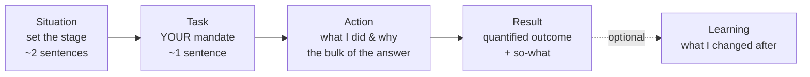
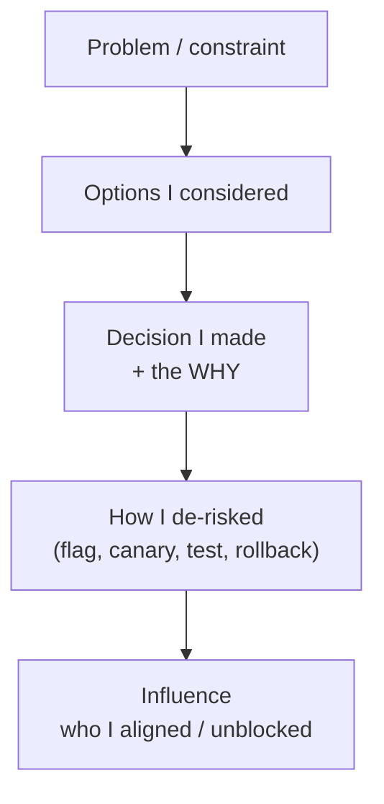
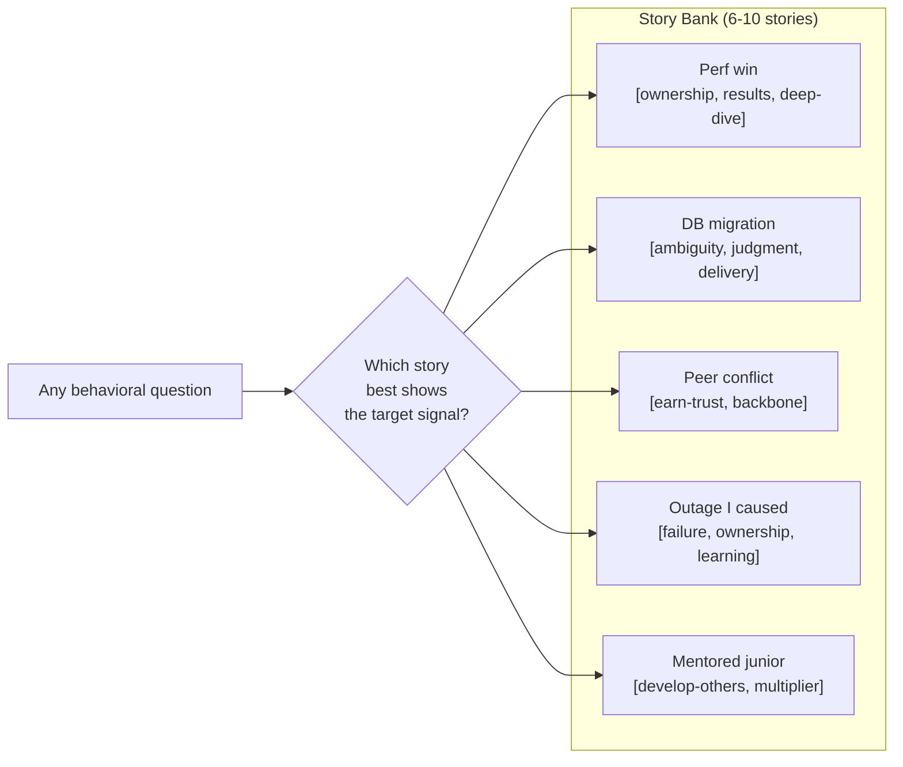
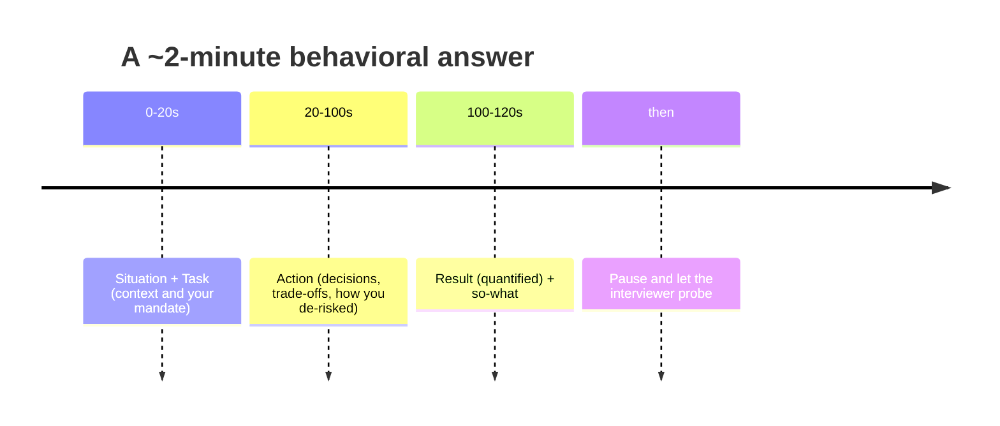

# Behavioral Interviews & the STAR Method

Behavioral rounds are where senior/staff backend loops are won or lost — not because the
questions are hard, but because most engineers treat them as a formality and show up with
vague, "we"-heavy, result-less stories. This topic teaches the mechanics: **why** behavioral
rounds exist, **how** to structure an answer (STAR and its variants), how to build a reusable
**story bank**, and the specific failure modes interviewers are trained to penalize.

> [!KEY-TAKEAWAY]
> A behavioral answer is not a story for its own sake — it is **evidence for a hiring
> decision**. The interviewer is filling in a rubric of *signals* (ownership, influence,
> judgment, scope). Every sentence should either set up the stakes or demonstrate a signal.
> If a sentence does neither, cut it.

> [!NOTE]
> This topic owns the **behavioral/storytelling** craft. The *technical* system-design
> interview method (driving a whiteboard) lives in
> `system-design/interview-method-scenario-playbooks`; the specific competency stories
> (conflict, failure, ambiguity) get their own deep dive in
> `interview-craft/behavioral-competency-bank`; Amazon LP mechanics and the Bar Raiser in
> `interview-craft/company-values-and-leadership-principles`.

---

## Why behavioral rounds exist

Behavioral interviewing rests on one premise: **past behavior is the best available predictor
of future behavior.** Rather than ask hypothetical "what would you do if…" questions (which
measure how well you *imagine* yourself, i.e. aspiration), interviewers ask "tell me about a
time when…" (which measures what you *actually did*). The technique traces to structured/
behavioral-description interviewing, which meta-analyses have repeatedly found more predictive
of on-the-job performance than unstructured "getting to know you" chats.

What the round is actually measuring:

- **Signal, not trivia.** There is no fact to recall. The interviewer is probing for
  demonstrated competencies: ownership, dealing with ambiguity, influence without authority,
  handling conflict, learning from failure, delivering measurable results.
- **Calibration to level.** The *same* story can read as senior or as junior depending on the
  scope of decision you owned and the blast radius of the outcome. (See
  `seniority-ladder-and-scope-signals`.)
- **Culture/values fit.** At values-driven companies (Amazon's Leadership Principles, Netflix's
  culture memo, etc.) the round maps your stories onto named principles.
- **Consistency and honesty.** Structured follow-up probes exist specifically to catch
  rehearsed-but-hollow or exaggerated stories.

> [!INTERVIEW]
> Interviewers are usually **taking notes and scoring against a written rubric**, often "meets
> bar / does not meet bar" per competency with a supporting quote. They are writing down *what
> you did*, in your words. This is why "we" is so damaging (see below) — the note-taker
> literally cannot attribute an action to you if you never said "I."

---

## The STAR framework

**STAR** is the near-universal structure for a behavioral answer:

| Letter | Stands for | What it answers | Target length |
|---|---|---|---|
| **S** | Situation | Context: where, when, what system, what was at stake | ~15% (short) |
| **T** | Task | *Your* specific goal/responsibility/mandate | ~10% (short) |
| **A** | Action | The steps **you** took, the decisions and trade-offs | ~60% (long) |
| **R** | Result | The outcome, **quantified**, plus what it meant | ~15% |

The single most important proportion: **Situation and Task are the setup, Action and Result are
the payload.** A well-run answer spends the first ~20 seconds on context and the next ~90 on
what you did and what happened. Beginners invert this and burn two minutes on backstory.

A tight worked example (a "tell me about a time you improved system performance" answer):

> **S:** "At my last company our checkout API's p99 latency had crept to 1.8 seconds during
> peak, and we were seeing cart-abandonment climb."
> **T:** "As the service owner I took the goal of getting p99 back under 500 ms without a
> rewrite, in one quarter."
> **A:** "I profiled the hot path and found we were making N+1 calls to the pricing service per
> line item. I proposed batching them into a single call, but I was worried about a bigger blast
> radius, so I first added distributed tracing to confirm the pricing calls were 70% of the
> latency. I then introduced a request-scoped batch loader, put it behind a feature flag, and
> rolled it out to 5% of traffic while watching the pricing service's own latency to make sure I
> wasn't just moving the problem. Once that held, I ramped to 100% over a week."
> **R:** "p99 dropped from 1.8 s to 380 ms, cart-abandonment fell about 6%, and because it was
> flag-gated we had zero incidents. I wrote it up so two other teams reused the batch-loader
> pattern."

Notice: the Situation is two sentences, the Action is the bulk and full of *decisions* ("I was
worried about blast radius, so I first…"), and the Result has numbers **and** a business
outcome **and** a multiplier ("two other teams reused it").

---

## STAR variants: SAR, CARL, STARL

STAR is the default, but interviewers and coaches use close variants; know them so you can flex
to what a question is really asking:

| Variant | Expands to | When it shines |
|---|---|---|
| **STAR** | Situation, Task, Action, Result | The default; any "tell me about a time" |
| **SAR** | Situation, Action, Result | Compressed — when Task is obvious from Situation |
| **STARL** / **STAR(L)** | STAR **+ Learning** | Failure/mistake questions — the *learning* is the point |
| **CARL** | Context, Action, Result, Learning | Reflection-heavy prompts; growth questions |
| **CAR / PAR** | Context/Problem, Action, Result | Résumé bullets, quick prompts |

> [!TIP]
> For **failure, conflict, and feedback** questions, always append the **L (Learning)**: "…and
> what I took away was X, which is why I now do Y." Without it, a failure story reads as an
> excuse or a shrug. The learning — and evidence you *applied* it later — is the signal that
> separates a mature engineer from a defensive one.

The letters are a checklist, not a script you recite aloud. Never say "So, the situation
was…, the task was…" robotically — narrate naturally but make sure all four (or five) beats are
present.

---

## Situation & Task: set the stage, fast

The Situation exists to give the interviewer *just enough* context to understand the stakes and
your role. Its failure mode is **rambling**: five minutes of org charts, product history, and
acronyms before anything happens.

Do it well:

- **Two to three sentences.** Name the system, the scale (traffic, team size, revenue,
  deadline), and the problem or opportunity. Scale numbers early establish scope cheaply.
- **Establish stakes.** "…and if we missed the migration window we'd be paying double for two
  data centers" tells the interviewer why this story matters.
- **Task = your mandate.** Make clear what *you specifically* were responsible for. "I was the
  tech lead" vs "I was one of eight engineers" is a scope signal in one clause.

> [!WARNING]
> The **rambling Situation** is the #1 pacing mistake. If the interviewer's eyes glaze before
> you reach a single decision *you* made, the answer has already failed regardless of how good
> the Action is. Rule of thumb: if you're 45 seconds in and haven't said "so I…", you over-built
> the Situation.

Weak vs strong Situation for "tell me about a hard technical decision":

- **Weak:** "So we had this monolith, it was a Rails app originally from 2014, and over the
  years different teams added stuff, and there was this one service, well actually two services,
  and the on-call rotation was owned by… " *(no stakes, no scope, no sign of the decision)*
- **Strong:** "Our monolith served 40k requests/second and deploys had grown to 45 minutes,
  blocking six teams. I owned the platform, and my task was to cut deploy time without a
  big-bang rewrite." *(scale, stakes, your mandate — in two sentences)*

---

## Action: "I" not "we"

The Action is 60% of the answer and the part the interviewer scores hardest, because it is where
*your* judgment, decisions, and trade-offs live. Two things make or break it.

**1. Say "I," not "we."** The interviewer is scoring *you*, not your team. Chronic "we did X, we
decided Y" makes it impossible to know what *you* contributed — and interviewers are explicitly
trained to probe it ("what was *your* role in that?"). Use "we" for genuine context ("we agreed
as a team") but switch to "I" the instant you describe a decision or action you drove.

- **Weak:** "We realized the cache was stale, so we added a TTL and we shipped it."
- **Strong:** "I noticed the cache had no TTL, so I proposed a 30-second TTL. Two engineers
  worried about a thundering herd on expiry, so I added jittered expiry and a request-coalescing
  layer, then I ran a load test to prove it held before we shipped."

Both mention a team; only the second lets the interviewer attribute specific judgment to you.

**2. Show decisions and trade-offs, not just a task list.** Junior answers narrate a sequence of
actions ("I did A, then B, then C"). Senior answers narrate *decisions under constraints*: what
options you weighed, why you chose one, what you were worried about, how you de-risked. "I chose
X over Y **because** Z, and to de-risk it I did W" is the sentence pattern that reads as seniority.

> [!KEY-TAKEAWAY]
> The Action should read like a **decision log**, not a to-do list. Every "I did X" earns more
> signal when it becomes "I did X **because** Y, having considered Z." Trade-off articulation is
> the highest-value habit in the whole round — see `tradeoff-articulation-and-judgment`.

---

## Result: quantify the impact

The **missing or vague Result** is the single most common reason strong-sounding stories score
poorly. An answer with no measurable outcome leaves the interviewer unable to tell whether your
effort *mattered*.

Quantify along at least one of these axes, ideally more:

- **Technical metric:** p99 latency 1.8 s → 380 ms; error rate 2% → 0.1%; throughput 5k → 40k
  rps; build 45 min → 6 min.
- **Business metric:** cart-abandonment −6%; $400k/yr infra savings; churn −3%; feature shipped
  two weeks early.
- **People/org metric:** unblocked six teams; on-call pages −70%; onboarding time 3 weeks → 4
  days; pattern adopted by 3 other services (multiplier).

> [!TIP]
> If you genuinely don't have exact numbers, **estimate honestly and say so**: "I don't have the
> exact figure, but it was roughly a 3x throughput improvement — we went from struggling at 5k
> rps to comfortably handling 15k." An honest estimate beats "it was much faster," and beats a
> fabricated precise number that a follow-up will expose.

End the Result with a **so-what** and, when you have one, a **multiplier**: "…and because I wrote
it up as a runbook, two other teams adopted the pattern." The multiplier ("my work changed how
*others* work") is what elevates a story from senior to staff-level scope.

Weak vs strong Result:

- **Weak:** "It worked well and everyone was happy, so that was good."
- **Strong:** "p99 went from 1.8 s to 380 ms, cart-abandonment dropped ~6% (worth roughly $2M
  ARR by our analytics team's estimate), and we shipped with zero incidents because it was
  flag-gated."

---

## Build a story bank

Do not walk into a loop hoping to improvise. Prepare a **story bank**: roughly **6-10 flexible
stories** from your real experience, each written up in STAR form and pre-tagged with the
competencies it demonstrates. A well-built bank means you're never caught blank, and you can
match the *best-fitting* story to whatever gets asked.

What to prepare:

- **6-10 stories** spanning: a shipped project you're proud of, a hard technical decision/
  trade-off, a conflict/disagreement, a failure or mistake, dealing with ambiguity, influencing
  without authority, mentoring/growing someone, a tight deadline, dealing with a difficult
  stakeholder.
- Each stored as: one-line title, the STAR beats in bullet form, the **numbers**, and a
  **competency tag list** (e.g. `[ownership, ambiguity, delivered-results]`).
- **Recent** (last 2-3 years is best; ancient stories signal stagnation), and where **you were
  central** to the outcome.

> [!INTERVIEW]
> A common panic is being asked a question you didn't prep a story for. The fix is the bank plus
> flexibility: most questions map to one of your 6-10 stories from a different angle. If asked
> about "influencing without authority" you can reuse your DB-migration story, foregrounding the
> alignment work instead of the technical work.

---

## Tailor one story to many questions

The same raw experience can answer many different questions — you change *which beats you
emphasize*, not which story you tell. This is why a bank of 6-10 stories can cover a 5-round loop.

Take one story — leading a risky database migration — and re-aim it:

| If asked about… | Foreground… |
|---|---|
| Ownership | that you volunteered, owned the plan end-to-end, and carried the pager |
| Ambiguity | that requirements were unclear and you drove them to clarity |
| Conflict | the DBA who disagreed with your cutover approach and how you aligned |
| Failure | the first cutover attempt that you had to roll back, and what you learned |
| Influence | how you got three teams to schedule freeze windows without authority |
| Trade-offs | dual-write vs backfill vs downtime, and why you chose the one you did |

> [!WARNING]
> Tailoring is *re-emphasis*, never *fabrication*. Don't invent a conflict that didn't happen to
> answer a conflict question. If none of your stories fits, it is better to pick your closest
> real story and be honest about the fit than to manufacture one — follow-up probes (next
> section) will find the seams in an invented story.

---

## Recent, relevant, you were central

Three filters decide whether a story is worth telling:

1. **Recent** — ideally within the last 2-3 years. A great story from 8 years ago raises the
   question "what have you done lately?" Recency also means you remember the details a probe will
   dig for.
2. **Relevant** — matched to the competency asked *and* to the level/role. A staff candidate
   telling a story about a solo weekend hack signals the wrong scope; a story about aligning
   three teams signals the right one. (See `seniority-ladder-and-scope-signals`.)
3. **You were central** — the outcome hinged on *your* actions and decisions. Stories where you
   were a bystander to someone else's great work have nothing to score. If your honest role was
   small, pick a different story.

> [!TIP]
> When two stories fit, pick the one where you can quantify the result *and* were most central.
> A slightly less flashy project where you owned the outcome beats a famous project where you
> were one of twenty.

---

## Honesty and the follow-up probe

Interviewers rarely accept a story at face value. They **probe**: "What exactly was your role?"
"Why did you choose that over the alternative?" "What did the other person say?" "What would you
do differently?" "How did you measure that?" These follow-ups are designed to distinguish lived
experience from rehearsed narrative — and to expose exaggeration.

Why fabrication fails:

- **Depth of probing.** A real story has infinite detail; you can answer "what did the DBA say
  when you proposed the cutover?" A fabricated one runs out of detail in two follow-ups.
- **Consistency.** Details must stay consistent across a 90-minute loop and multiple
  interviewers who compare notes.
- **The "I" attribution test.** Claiming credit for team work collapses under "walk me through
  what *you personally* built."

> [!WARNING]
> **Do not fabricate or over-claim.** The fastest way to fail a senior loop is to get caught
> inflating your role — it torpedoes the one thing that can't be recovered: trust. It is far
> safer to say "that part was actually driven by a teammate; my contribution was X" than to
> claim the whole thing. Owning the boundaries of your contribution is itself an ownership/
> earn-trust signal.

Handling "tell me about a failure" honestly: pick a *real* failure with real stakes where you
were genuinely at fault, own it plainly, and land the **Learning**. Candidates who dodge with a
fake-flaw ("I care too much") or a trivial failure signal low self-awareness.

---

## Delivery: pacing, tense, and the note-taking interviewer

Structure is necessary but not sufficient — delivery decides whether the signal lands.

- **Pacing.** Aim for **~2 minutes** per initial answer, then let the interviewer drive with
  follow-ups. Long enough to hit all STAR beats, short enough to leave room for probing. If you
  hit three minutes without finishing, you're rambling.
- **The present-tense / hypothetical trap.** When asked "tell me about a time," answer in the
  **past tense about a real event** ("I noticed…, so I built…"). Sliding into present/future
  hypothetical ("I would usually…", "what I do is…") turns a behavioral answer into a
  philosophy statement with zero evidence. If you catch yourself saying "I would," stop and
  anchor to a specific past instance.
- **Signpost lightly.** "There are two parts to what I did…" helps the note-taker follow, but
  don't recite "S-T-A-R" labels.
- **Read the room.** The interviewer is taking notes; pause at natural beats so they can catch
  up, and watch for them steering ("let's go deeper on the rollout") — follow their lead.
- **Land the result, then stop.** Resist trailing off into tangents after the Result. A clean
  stop invites the follow-ups you want.

> [!INTERVIEW]
> A useful self-check while answering: "Have I said a number yet? Have I said 'I' for the key
> decision? Am I still setting up context 90 seconds in?" If a story consistently fails these,
> rewrite it in your bank.

---

## Weak vs strong: a full contrast

Question: *"Tell me about a time you disagreed with a technical decision."*

**Weak answer (junior signal):**
> "So on my team we were using MongoDB and I didn't really think it was the right choice, we had
> a lot of discussions about it, and eventually we kind of moved some stuff to Postgres and it
> worked out. It was a team effort and everyone pitched in."

Problems: no stakes, all "we," no decision *you* drove, no trade-off reasoning, no result, no
number, vague "worked out." Unscoreable.

**Strong answer (senior signal):**
> **S:** "We were storing financial ledger data in MongoDB and hitting consistency bugs — we'd
> had two reconciliation incidents in a quarter. **T:** As the service owner I believed we needed
> strong transactional guarantees and pushed to move to Postgres, but our staff engineer
> preferred staying on Mongo to avoid a migration. **A:** Rather than argue in the abstract, I
> wrote a one-page doc laying out the two incidents, the ACID requirements of a ledger, and a
> migration plan with a dual-write phase to de-risk. I disagreed but committed to a decision
> meeting: I presented the data, he raised operational-cost concerns I hadn't weighed, so we
> agreed on Postgres for the ledger tables only, leaving Mongo for the event log. I owned the
> migration. **R:** Zero reconciliation incidents in the two quarters after, migration shipped
> with no downtime via dual-write, and we documented the decision as an ADR the team still cites."

Why it's strong: real stakes with a number, clear "I" ownership of a *disagreement handled with
data and respect* (backbone + earn trust), a genuine trade-off, a de-risking plan, and a
quantified result plus a lasting artifact (the ADR — a multiplier).

---

## Common follow-up questions

- "What was *your* specific role versus the rest of the team?"
- "Why did you choose that approach over the alternatives you mentioned?"
- "How did you measure that result? What was the baseline?"
- "What would you do differently if you did it again?"
- "How did the person who disagreed with you react?"
- "What was the hardest part, and where did you get stuck?"
- "What did you learn, and where have you applied that learning since?"
- "Walk me through a specific technical detail of what you built."

## References

- Amazon Leadership Principles (16 principles, incl. "Strive to be Earth's Best Employer" and
  "Success and Scale Bring Broad Responsibility"), amazon.jobs — the canonical values that many
  behavioral rubrics map onto; see also the Bar Raiser process.
- Will Larson, *Staff Engineer: Leadership Beyond the Management Track* & StaffEng.com — the
  Tech Lead / Architect / Solver / Right Hand archetypes and scope framing.
- Will Larson, *An Elegant Puzzle* — organizational judgment and scope.
- Gayle Laakmann McDowell, *Cracking the Coding Interview* / *Cracking the PM Interview* —
  behavioral sections; the "recent, relevant, you were central" story-selection heuristic.
- Published engineering ladders: Dropbox, CircleCI, Rent the Runway, GitLab — scope-per-level
  rubrics that calibrate what a story needs to demonstrate.
- Google re:Work / Project Oxygen — structured interviewing and why past behavior predicts
  future behavior.
- Jeff Dean / Peter Norvig, "Latency numbers every programmer should know" — for the estimation
  companion topic `estimation-and-napkin-math`.
- Related topics: `interview-craft/behavioral-competency-bank`,
  `interview-craft/company-values-and-leadership-principles`,
  `interview-craft/seniority-ladder-and-scope-signals`,
  `interview-craft/tradeoff-articulation-and-judgment`,
  `system-design/interview-method-scenario-playbooks`.
