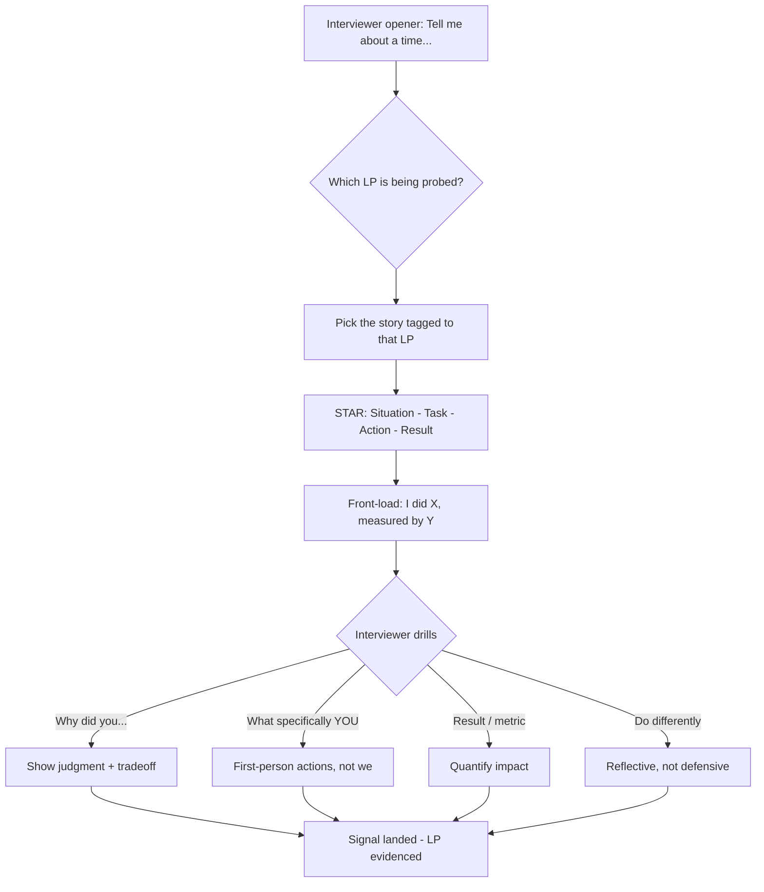
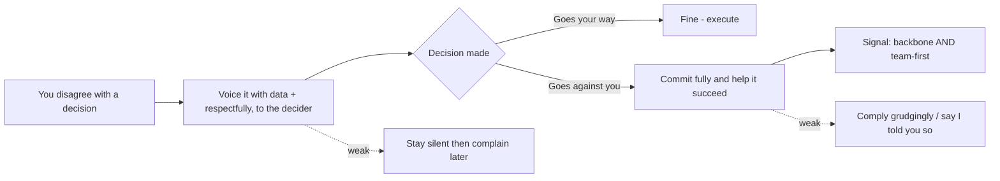

# Company Values & Leadership Principles (Amazon LPs et al.)

Most senior/staff interview loops at product companies include at least one round that is
**explicitly scored against a published set of company values or leadership principles** —
Amazon's 16 Leadership Principles (LPs) are the archetype, but Netflix's "Freedom &
Responsibility," Google's "Googleyness & Leadership," Meta's core values, and nearly every
startup's homegrown value list work the same way. This topic is about the *behavioral*
craft of that round: how values-based interviewing works, how interviewers convert your
stories into a value-signal score, and how to tell a story that lands the intended signal
**without sounding rehearsed or robotic**.

This is a JUDGMENT domain. There is rarely one "factually correct" sentence — the correct
move is the one that best demonstrates the target signal (ownership, dive deep, backbone)
to a trained interviewer. The failure modes are consistent and penalized consistently:
taking individual credit for a team win, solving the symptom instead of the root cause,
staying vague on your specific actions, and answering at a scope below your target level.

> [!KEY-TAKEAWAY]
> Values-based rounds test *how you operate*, not what you know. Interviewers are trained to
> extract specific, first-person, data-backed behavior — "**I** did X, which caused Y,
> measured by Z" — and map it to a named principle. Prepare a **story bank** tagged to the
> target company's values, tell each story in STAR structure with **you** as the clear
> protagonist, and lead with the signal the question is fishing for.

---

## Why values-based interviewing exists

Companies score against explicit values for three reasons, and knowing them tells you what
the interviewer is actually optimizing for:

1. **Culture fit at scale / consistency of bar.** A published rubric lets hundreds of
   interviewers across a company evaluate candidates the *same way*. Instead of "I liked
   them," an interviewer must write "demonstrated Ownership: took a dependency that wasn't
   assigned to them and drove it to done." The rubric is the anti-bias, anti-vibes
   mechanism — it forces evidence.
2. **Predicting on-the-job behavior.** Past behavior in a comparable situation is the best
   available predictor of future behavior. That is why these rounds demand *real past
   examples* ("Tell me about a time…") and distrust hypotheticals ("What would you do…").
3. **Signaling the culture to the candidate.** The questions telegraph what the company
   rewards. If every question probes "disagree and commit," the company runs on vigorous
   debate followed by alignment — useful to know before you accept.

> [!INTERVIEW]
> "Culture fit" does **not** mean "people like us / people I'd get a beer with" — that is
> the discredited version that imports bias. Modern loops say **culture add / values
> alignment**: do you demonstrate the behaviors the company has decided it needs? Frame your
> stories around *behaviors and outcomes*, not personality or shared background.

The senior/staff bar: you are expected to *recognize* which value each question targets and
to show the behavior at the **scope of your level** — a staff engineer's Ownership story
spans multiple teams and quarters, not a single ticket.

---

## Amazon's 16 Leadership Principles

Amazon evaluates every candidate against **16 Leadership Principles** (expanded from 14 in
2021 when *Strive to be Earth's Best Employer* and *Success and Scale Bring Broad
Responsibility* were added). Interviewers are each assigned a subset of LPs to probe, so the
loop covers the full set across the panel. The 16, verbatim titles:

| # | Leadership Principle | One-line essence |
|---|---|---|
| 1 | **Customer Obsession** | Start from the customer and work backwards; earn/keep trust. |
| 2 | **Ownership** | Think long-term, act on behalf of the whole company, never "not my job." |
| 3 | **Invent and Simplify** | Seek new ideas from everywhere; simplify as you innovate. |
| 4 | **Are Right, A Lot** | Strong judgment; seek diverse perspectives and disconfirm your own views. |
| 5 | **Learn and Be Curious** | Never done learning; explore new possibilities. |
| 6 | **Hire and Develop the Best** | Raise the bar with every hire; coach and grow others. |
| 7 | **Insist on the Highest Standards** | Relentlessly high bar; fix defects so they stay fixed. |
| 8 | **Think Big** | Bold direction that inspires results; thinking small is self-fulfilling. |
| 9 | **Bias for Action** | Speed matters; take calculated, reversible risks. |
| 10 | **Frugality** | Do more with less; constraints breed resourcefulness. |
| 11 | **Earn Trust** | Listen, speak candidly, be self-critical, benchmark against the best. |
| 12 | **Dive Deep** | Stay connected to details, audit frequently, no task is beneath you. |
| 13 | **Have Backbone; Disagree and Commit** | Respectfully challenge, then fully commit once decided. |
| 14 | **Deliver Results** | Focus on key inputs, deliver with quality, never settle. |
| 15 | **Strive to be Earth's Best Employer** | Safer, more diverse, higher-performing work environment. |
| 16 | **Success and Scale Bring Broad Responsibility** | Act with humility about the company's societal impact. |

> [!TIP]
> You do **not** need a distinct story for all 16. Build 6–8 strong, layered stories and map
> each to 2–4 LPs it can credibly demonstrate. A single hard project story often covers
> Ownership + Dive Deep + Deliver Results + Bias for Action depending on which slice you
> emphasize. What you *cannot* do is stretch one thin story across everything — the
> follow-up questions will expose it.

Two LPs are probed far more than the rest for engineers: **Ownership** and **Dive Deep**.
See their dedicated section below.

---

## The Bar Raiser role

Every Amazon loop includes a **Bar Raiser**: a trained interviewer from *outside* the hiring
team who has veto power over the hire and whose job is to protect the long-term bar — "would
this person raise the average of the team they're joining?" Key mechanics that change how you
should behave:

- The Bar Raiser is **not the hiring manager** and often probes a different LP set. They are
  deliberately detached from the team's short-term staffing pressure, so "we need a body
  now" arguments carry no weight with them.
- Amazon runs on **written, data-driven debrief**. Interviewers submit detailed written
  feedback with specific examples and an LP mapping *before* discussing. Vague praise gets
  discounted; specific behavioral evidence wins. This is why interviewers dig relentlessly
  for the "what did *you* specifically do" detail — they must write it down and defend it.
- A single strong "no" from a Bar Raiser can sink an otherwise positive loop. Consistency
  across the panel matters: one round of shallow, credit-hogging answers can be the data
  point that tanks you.

> [!INTERVIEW]
> Implication for you: give **quantified, first-person** detail unprompted, because the
> interviewer needs to transcribe it. "We improved latency" is un-writable. "I profiled the
> hot path, found an N+1 query, added a covering index and a cache, and cut p99 from 800ms to
> 120ms, which recovered ~$40k/mo in abandoned-checkout revenue" is exactly what they paste
> into the debrief tool.

---

## The LP-per-question structure

Amazon-style behavioral questions almost always take the form **"Tell me about a time
when…"** and each question is pre-mapped to a specific LP the interviewer must assess. The
interviewer's flow: ask the opener, then drill with **"why," "what specifically did you
do," "what was the result," "what would you do differently."** The best answers anticipate
this drill and front-load the detail.

**One story = one LP focus.** If asked about Ownership, do not tell an Ownership+Dive
Deep+Backbone mega-story — pick the story where *ownership* is the sharpest signal and let
the interviewer pull the other threads if they want. Diluting the focus makes the LP harder
for them to score.

> [!WARNING]
> Do not answer a "Tell me about a time" question with a hypothetical ("I would generally…").
> That is the single most common disqualifier — it reads as "I have no real example." If you
> genuinely lack a direct example, use the closest real analog and say so, then bridge:
> "The closest I've hit was…"

---

## Mapping your stories to specific principles

The prep unit is a **story bank**: 6–8 real projects/incidents, each written once in STAR
form, then tagged with every value it can credibly serve. Before a loop, re-tag the bank to
*that company's* published values.

A worked mapping for one project ("led migration off a failing monolith DB"):

| Emphasize this slice… | …and it demonstrates |
|---|---|
| Chose to own the un-owned migration risk | Ownership |
| Found the root-cause lock contention by reading query plans | Dive Deep |
| Shipped a reversible dual-write cutover fast | Bias for Action |
| Pushed back on the "big-bang cutover" plan, then committed | Have Backbone; Disagree and Commit |
| Cut p99 60% and eliminated the weekly outage | Deliver Results / Insist on Highest Standards |

> [!TIP]
> Maintain a small matrix (rows = your stories, columns = the target company's values). Any
> value with **zero** strong story is a prep gap — go find a real example before the loop.
> Any story serving **four or more** values is your workhorse; know it cold.

The senior bar: your *examples themselves* must be senior. A staff Ownership story is "I owned
the cross-org reliability program," not "I owned my sprint tickets." If your best story tops
out at individual-contributor scope, the value is technically demonstrated but the *level* is
not — a common reason strong engineers get down-leveled.

---

## Dive Deep and Ownership: the most-probed for engineers

For engineering candidates, **Ownership** and **Dive Deep** are the two most heavily and
repeatedly probed principles, because they most predict senior engineering behavior.

**Ownership** — the signal is *acting beyond your assigned boundary and thinking long-term.*
Strong signals: taking on a problem no one owned; considering the downstream/next-quarter
consequences, not just shipping your piece; declining to say "not my job." Weak signals:
"I finished my tickets," blaming another team for a shared outcome, optimizing for your own
component while the system degrades.

**Dive Deep** — the signal is *you personally got into the mechanism and data, not the
summary.* Strong signals: reading the actual query plan / flame graph / raw logs; catching
that a metric was misleading; being able to answer "why" three levels down without hand-
waving. Weak signals: "the dashboard was green," "my team told me," inability to explain the
mechanism when the interviewer drills.

**Weak vs strong — a "Dive Deep" answer:**

> *Weak:* "Latency was high, so we added more servers and it got better."
>
> *Strong:* "p99 spiked to 2s only for logged-in users. I pulled traces and saw the session
> service fanned out to 12 downstream calls serially. I read the code and found we
> re-fetched the same permission set per call. I added a request-scoped cache, cut it to one
> fetch, and p99 dropped to 180ms. Scaling servers wouldn't have fixed it — the bottleneck
> was the serial fan-out, not capacity."

The strong version names the specific mechanism, shows *you* did the investigation, quantifies,
and explicitly rejects the shallow fix (adding servers) — which is itself an Ownership +
Insist on Highest Standards signal.

---

## Disagree and Commit: the nuance interviewers test

**Have Backbone; Disagree and Commit** is the most misunderstood LP, and interviewers
probe the misunderstanding on purpose. It is *two* behaviors in sequence:

1. **Backbone / Disagree:** you respectfully but firmly challenged a decision, with data,
   *even when it was uncomfortable* (challenging your manager, a senior architect, a
   consensus you thought was wrong). Caving immediately shows no backbone.
2. **Commit:** once the decision was made — even against your recommendation — you committed
   *fully and genuinely*, not passive-aggressively "I told you so"-ing or quietly
   sabotaging. You helped make the chosen path succeed.

> [!WARNING]
> The two classic failure modes: (a) telling a pure-conflict story where you "won" and the
> other person was wrong — that shows backbone but zero *commit*, and can read as
> combative; (b) telling a story where you disagreed and then *nothing changed and you just
> went along* — that shows commit but no backbone. The best story has **genuine
> disagreement, a decision that went against you, and you making it succeed anyway.**

Bonus signal: if you disagreed, lost, committed, and it turned out you were *right* — the
strongest version is that you still say you'd commit again, because a functioning team can't
re-litigate every decision. That shows judgment about *when* backbone is worth spending.

---

## Other companies' values

The Amazon LP machinery is the most explicit, but the same round exists everywhere under
different names. Read the target company's actual list — do not walk in with Amazon LPs at a
non-Amazon loop.

| Company | Values framework | What the behavioral round rewards |
|---|---|---|
| **Amazon** | 16 Leadership Principles + Bar Raiser | First-person, quantified, LP-mapped STAR stories |
| **Netflix** | "Freedom & Responsibility" culture; judgment, selflessness, candor, "keeper test" | High autonomy + high judgment; context over control; radical candor |
| **Google** | "Googleyness & Leadership" (General Cognitive Ability, Leadership, Role-Related Knowledge, Googleyness) | Comfort with ambiguity, collaboration, emergent/servant leadership, humility |
| **Meta** | "Move Fast," "Focus on Long-Term Impact," "Build Awesome Things," "Live in the Future," "Be Direct and Respect Your Colleagues," "Meta, Metamates, Me" | Speed, long-term measurable impact, direct communication, company-first |
| **Startups** | Homegrown, often 3–6 values (e.g. "bias to ship," "ownership," "customer-first") | Scrappiness, generalist range, comfort without process, direct customer contact |

> [!INTERVIEW]
> Netflix's **"keeper test"** ("would I fight to keep this person?") and its no-tolerance for
> "brilliant jerks" mean candor + collaboration are load-bearing — a story where you were
> right but torched a relationship scores badly. Google's evaluation deliberately values
> **"emergent leadership"** (stepping up without being the boss) and **intellectual humility**
> (Project Oxygen found the best managers coach rather than command) — bring a story about
> leading without authority and one about being wrong and updating.

The senior/staff commonality across all of them: they want evidence you operate at **scope**
(cross-team influence, long-term thinking) and with **judgment** (you make good calls under
ambiguity and can explain the trade-offs).

---

## Reading a company's values before the loop

Values-based rounds are open-book — the rubric is published. Not preparing to it is an
unforced error.

A pre-loop checklist:

1. **Find the actual list.** Careers page, "our culture" page, engineering blog, the CEO's
   founding letter (Amazon's original 1997 shareholder letter still underpins its LPs).
2. **Decode what each value *rewards behaviorally*** — "Bias for Action" rewards shipping a
   reversible decision fast; it does *not* reward recklessness. Translate each value into "a
   story that demonstrates it looks like ___."
3. **Build the story-to-value matrix** and fill every gap.
4. **Prime one or two of the company's actual phrases** so you can mirror their language
   naturally ("I treated it as a two-way door, so I shipped and iterated") — but do not
   robotically recite value names.
5. **Prepare reverse questions that probe whether the values are real** (below) — this both
   protects you and signals maturity.

> [!TIP]
> Cross-reference `interview-craft/behavioral-star-method` for the STAR mechanics and
> `interview-craft/behavioral-competency-bank` for building the underlying stories. This
> topic is specifically about *mapping* those stories to a company's declared values and
> hitting the target signal.

---

## Hitting the intended value without sounding robotic

The paradox of a values round: you must clearly demonstrate a named value, but explicitly
narrating "This shows my Customer Obsession…" reads as canned and can *lower* your score.
The craft is to make the behavior obvious through **specifics** so the interviewer maps it
themselves.

**Robotic vs natural:**

> *Robotic:* "This demonstrates my Ownership Leadership Principle because I have strong
> ownership. It also shows Bias for Action."
>
> *Natural:* "It wasn't my team's service, but the outage was hitting our customers, so I
> paged myself in, found the bad deploy, and rolled it back — then I filed the ticket to fix
> the missing rollback alarm so it couldn't happen silently again."

The natural version *is* Ownership + Bias for Action + Insist on Highest Standards, but the
candidate lets the actions speak. Techniques:

- **Front-load the signal through action verbs and specifics**, not labels.
- **Let the interviewer connect it to the value** — they are trained to, and it lands harder
  when they do it themselves.
- **Mirror the company's vocabulary lightly** ("two-way door," "work backwards") to show
  you've internalized the culture, without reciting the list like a checklist.
- Keep answers **~2–4 minutes**; then stop and let them drill. Over-talking buries the signal.

> [!WARNING]
> Related failure mode: the "we" trap. Interviewers must score *you*, so an all-"we" answer is
> un-scorable. Deliberately say "**I** decided / **I** built / **I** convinced" for your
> contributions, then credit the team for theirs. Over-correcting into "I did everything
> alone" is the opposite failure (no collaboration signal) — attribute honestly, but make
> your own actions unmistakable.

---

## Common failure modes interviewers penalize

A consolidated list of what tanks a values round, and the value it fails:

- **Hypothetical instead of real example** — "I would…" for a "tell me about a time." Reads
  as no evidence.
- **The "we" fog** — impossible to tell what *you* did. Fails Ownership signal.
- **Individual credit-hogging** — taking sole credit for a team win. Fails Earn Trust / Hire &
  Develop.
- **No metrics** — "it got better" with no number. Fails Deliver Results / Dive Deep.
- **Symptom not root cause** — "added more servers." Fails Dive Deep / Insist on Highest
  Standards.
- **Scope too junior** — a staff candidate whose best story is one ticket. Fails leveling.
- **Backbone without commit** (or vice-versa) — see the Disagree & Commit section.
- **No reflection** — can't answer "what would you do differently," or gets defensive. Fails
  Learn & Be Curious / Earn Trust (self-criticism).
- **Reciting value names** — robotic labeling instead of demonstrated behavior.
- **Wrong company's values** — bringing Amazon LPs to a non-Amazon loop.

---

## Common follow-up questions

- "You keep saying *we* — what did *you* specifically do?"
- "Why did you make that choice? What were the alternatives you rejected, and why?"
- "How did you *know* it worked? What metric moved, and by how much?"
- "What would you do differently if you did it again?"
- "Tell me about a time you disagreed with your manager. What happened after the decision?"
- "Tell me about a time you were wrong. How did you find out, and what did you change?"
- "Tell me about the hardest bug/incident you personally debugged — walk me down to the root
  cause."
- "Tell me about a time you took on something outside your job description."
- "What's an example where you had to move fast without complete information?"
- "How do you decide when to push back versus commit to a decision you disagree with?"

## References

- Amazon, "Leadership Principles" — official 16 LPs, amazon.jobs.
- Amazon, "The Bar Raiser" hiring process — amazon.jobs / About Amazon.
- Jeff Bezos, 1997 Letter to Shareholders (foundational to Customer Obsession & long-term
  Ownership).
- Netflix, "Netflix Culture — Freedom & Responsibility" (jobs.netflix.com/culture);
  the "keeper test" and no-brilliant-jerks norms.
- Google re:Work — Project Oxygen (manager behaviors) and structured/behavioral hiring;
  "Googleyness & Leadership" evaluation criteria.
- Meta, company values ("Move Fast," "Focus on Long-Term Impact," "Be Direct and Respect
  Your Colleagues," "Meta, Metamates, Me" — metacareers.com/culture).
- STAR / SAR / CARL behavioral-answer frameworks (see
  `interview-craft/behavioral-star-method`).
- Gayle Laakmann McDowell, *Cracking the Coding Interview* / *Cracking the PM Interview* —
  behavioral sections and the "we vs I" / metrics guidance.
- Will Larson, *Staff Engineer* & StaffEng.com — scope/level expectations that make a values
  story read as senior vs junior.
