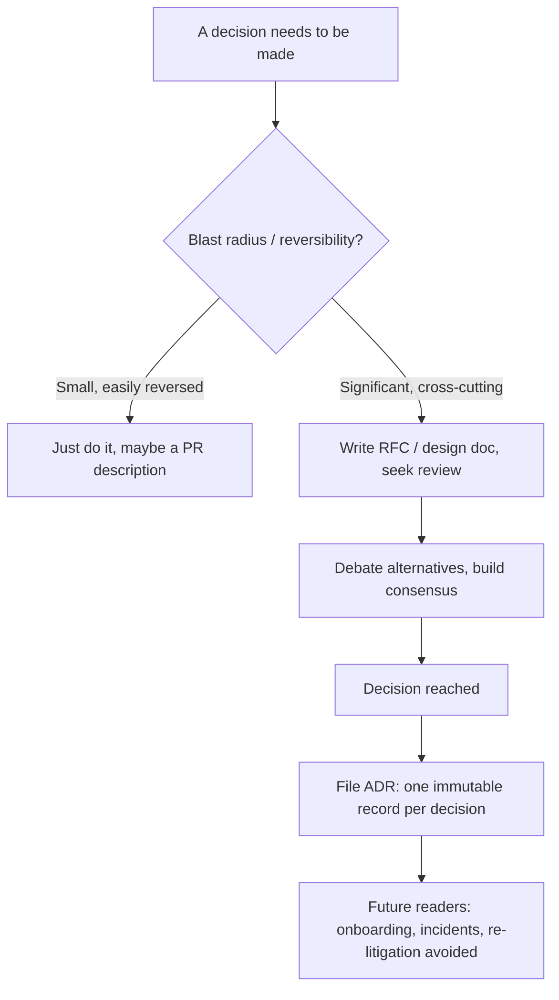
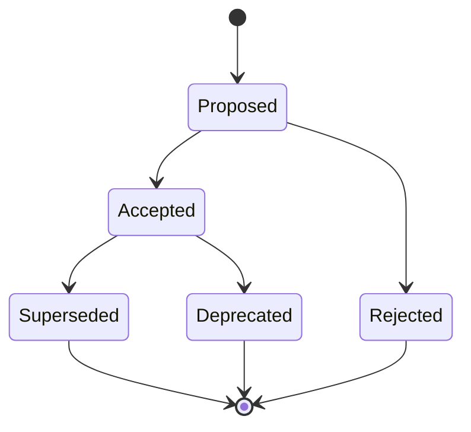

# Design Docs, RFCs & Architecture Decision Records

At senior and staff level, your leverage stops being the code you personally type and
starts being the **decisions you shape across other people**. The primary tool for that
is *writing*: a design doc that aligns ten engineers before a line of code is written, an
RFC that surfaces the objection you hadn't thought of, an ADR that stops the team
re-litigating the same choice every six months. Interviewers know this — so "walk me
through a design doc you wrote," "critique this design," and "how do you drive alignment
on a big decision" are standard senior+ probes. This topic is about the **craft of
engineering writing and decision records**: what goes in each artifact, why the
`Alternatives considered` section is the one that shows judgment, and how to signal
seniority through clarity.

> [!KEY-TAKEAWAY]
> Writing is a *force multiplier*: a design doc read by 20 people is 20x the leverage of
> a Slack thread read by 2. At staff level, "can this person write a doc that aligns an
> org and survives review" is a direct proxy for scope. Clarity of writing is read as
> clarity of thinking.

This topic owns the **communication craft** of design docs, RFCs, and ADRs. For the
mechanics of *driving a whiteboard system-design round*, see
`system-design/interview-method-scenario-playbooks`. For the incident/postmortem *story*
angle, see `interview-craft/incident-leadership-behavioral`; for the postmortem *process*
mechanics, see `devops-cicd`/`observability`.

---

## Engineering writing as a senior/staff skill

The single biggest multiplier available to a senior+ engineer is **written communication
that scales without you in the room**. A verbal explanation reaches the people in the
meeting; a well-written doc reaches everyone who will ever touch the system — including
future-you at 2 a.m. during an incident, and the new hire onboarding a year from now.
This is why published engineering ladders (Dropbox, CircleCI, Gitlab, Rent the Runway)
and Will Larson's *Staff Engineer* all list "writing" and "communication" as explicit
staff competencies: influence at that level is exercised through artifacts, not
keystrokes.

**What interviewers are probing.** When they ask "tell me about a design you led," they
are checking whether you can (a) frame a problem crisply, (b) reason about alternatives,
(c) build alignment across people who disagree, and (d) leave a durable record. A
candidate who says "I just built it and it worked" signals individual-contributor scope.
A candidate who says "I wrote an RFC, ran it through async review, resolved the three big
objections, and we still reference the ADR two years later" signals org-level scope.

> [!INTERVIEW]
> A tell for staff-level writing maturity: the candidate talks about writing as a way to
> *find bugs in their own thinking before building*, not as bureaucratic overhead. "The
> act of writing the alternatives section changed my mind about the primary design" is a
> strong sentence.

**Weak vs strong framing of the same experience:**

- **Weak:** "I documented the system after we shipped." (docs as afterthought/compliance)
- **Strong:** "I wrote the design doc *first* to align three teams; the review surfaced a
  data-migration risk we'd missed, which changed the rollout plan and saved us a
  backfill outage." (writing as a decision and risk-reduction tool, upstream of code)

---

## Design doc vs RFC vs ADR: which artifact when

These three are often conflated, and interviewers reward candidates who know the
distinction. They differ in **scope, lifecycle, and audience**.

| Artifact | Scope | Lifecycle | Answers | Typical length |
|---|---|---|---|---|
| **Design doc** | One project/system/feature | Living during design, then archived | "*How* will we build this?" | 1–10+ pages |
| **RFC** (Request for Comments) | A proposal seeking feedback/consensus, often cross-team | Draft → review → accepted/rejected | "Should we do this, and does anyone object?" | Similar to design doc |
| **ADR** (Architecture Decision Record) | *One* architecturally-significant decision | Immutable once accepted; superseded, never edited | "*Why* did we decide X?" | ~1 page |

The practical relationships:

- **RFC vs design doc** is mostly *cultural naming*. An RFC emphasizes the
  *seeking-consensus* posture (the term comes from the IETF); a design doc emphasizes the
  *design content*. Many orgs use the words interchangeably; some (e.g. Rust, Kubernetes,
  many startups) run a formal RFC process with a required template and an accept/reject
  gate.
- **ADR vs design doc** is a *granularity and durability* difference. A design doc
  explores the whole solution and is a snapshot in time. An ADR captures **one decision**
  (e.g. "use Postgres, not DynamoDB, for the orders store") in a short, *immutable* record
  that outlives the doc. A single design doc might spawn several ADRs.

> [!TIP]
> A clean mental model: the **RFC/design doc** is where you *think and debate*; the **ADR**
> is the *receipt* you file so nobody has to reconstruct the reasoning later. You can have
> both: debate in the RFC, then record the outcome as ADRs.

Common failure mode interviewers penalize: using the words as if they were synonyms with
no sense of when a heavyweight RFC is warranted versus a one-line ADR versus just shipping
a two-way-door change. Right-sizing the process to the reversibility and blast radius of
the decision *is itself* a judgment signal.

---

## Anatomy of a design doc / RFC

A strong design doc is not a wall of implementation detail — it is an *argument* that a
particular design is the right one for a stated problem. The canonical sections (aligned
with "Design Docs at Google" and most internal RFC templates):

1. **Title, author(s), status, date, reviewers** — metadata so readers know freshness and
   ownership.
2. **Context / background** — objective facts about the current state and why this is on
   the table now. Link out for detail; don't restate requirements docs.
3. **Problem statement** — the one thing this doc exists to solve, stated crisply.
4. **Goals and non-goals** — what success is, and explicitly what you are *choosing not*
   to solve (see below).
5. **Proposed design** — the actual solution: system-context diagram, key APIs/data
   models, the flow. Focus on the parts where **trade-offs live**, not boilerplate.
6. **Alternatives considered** — the other reasonable designs and *why they were
   rejected* (the judgment section).
7. **Trade-offs** — what the chosen design costs you.
8. **Risks and mitigations** — what could go wrong and your plan.
9. **Rollout / migration plan** — how it ships safely (flags, phases, backfills, rollback).
10. **Cross-cutting concerns** — security, privacy, cost, observability, on-call impact.
11. **Open questions** — honestly listing what's undecided.
12. **Appendix / references** — links, benchmarks, prior art.

> [!WARNING]
> The most common junior mistake is a doc that is *all* proposed design and *no* problem
> statement, alternatives, or trade-offs. That reads as "I already decided; here's the
> code I want to write," which invites reviewers to either rubber-stamp or nitpick — not
> to engage with the *decision*. Lead with the problem and the alternatives.

**The problem statement is load-bearing.** If a reviewer can't tell what problem you're
solving in the first half-page, the rest is noise. Strong problem statements are specific
and often quantified: not "search is slow," but "p99 search latency is 1.8s against a 300ms
SLO, driven by fan-out to 40 shards; this doc proposes reducing it below SLO."

---

## Goals and non-goals: scoping the argument

**Goals** state what success looks like — ideally measurable. **Non-goals** are the
underrated half: things that *could reasonably be goals but you are explicitly choosing
not to pursue* in this design. Non-goals are a scoping and expectation-setting tool.

Why non-goals matter so much:

- They **prevent scope creep** in review ("what about multi-region?" → "explicit non-goal
  for v1, tracked separately").
- They **surface disagreement early** — if a reviewer thinks your non-goal *should* be a
  goal, that's the conversation to have now, cheaply, not after you've built.
- They **demonstrate judgment**: naming what you're *not* doing shows you understand the
  full space and made a deliberate cut, rather than missing it.

> [!TIP]
> A good non-goal is a real temptation you're resisting, with a reason. "Non-goal:
> supporting on-prem deployment (all target customers are cloud; revisit if enterprise
> segment materializes)" is strong. "Non-goal: being slow" is not a non-goal — it's just
> a goal phrased backwards.

Failure mode: goals that are unmeasurable ("make the system better") or a missing
non-goals section, so reviewers can't tell where the boundaries are and pile on
out-of-scope feedback.

---

## Alternatives considered: the section that shows judgment

If you optimize one section of a design doc for a senior/staff signal, make it
**Alternatives considered**. "Design Docs at Google" calls it one of the most important
sections precisely because it demonstrates *why the chosen solution is best given the
goals*, and preempts the "did you think about X?" question every reviewer has.

A strong alternatives section, per option:
- names the alternative honestly (steel-man it, don't strawman),
- states what it would win you,
- states why you rejected it **for this context** — ideally tied to a goal or constraint,
- notes the condition under which it *would* win (shows you understand the boundary).

**Weak vs strong alternative entry:**

- **Weak:** "We could use DynamoDB but Postgres is better." (dogmatic, no reasoning, strawman)
- **Strong:** "**DynamoDB:** gives effortless horizontal scale and no ops for the store.
  Rejected for v1 because the orders domain needs multi-item transactions and ad-hoc joins
  across order/payment/line-item, which Postgres gives for free and DynamoDB makes painful.
  We'd revisit if a single table's write volume outgrows a primary+read-replica Postgres,
  which our 5k-TPS projection is well under."

> [!INTERVIEW]
> Interviewers frequently ask "what else did you consider?" *specifically* to see if you
> explored the space or tunnel-visioned on the first idea. "I only considered this one
> approach" is a red flag at senior+. Even "I considered doing nothing / the status quo"
> counts as an alternative and should usually appear.

The strongest candidates note that **the act of writing the alternatives section changed
their design** — that's proof the doc did its job as a thinking tool, not a
justification exercise.

---

## Trade-offs, risks, and open questions

These three sections separate a persuasive-but-shallow doc from a trustworthy one.

**Trade-offs** — every design gives something up. Naming the cost of your *chosen* design
(not just why alternatives lost) builds reviewer trust. "This adds a cache, so we accept
up-to-60s staleness on this data, which is fine because it's a leaderboard, not a bank
balance." A doc with zero stated trade-offs reads as naïve or as advocacy.

**Risks and mitigations** — what could go wrong, how likely, how bad, and your plan.
Framing matters: "Risk: the backfill could double DB load during migration. Mitigation:
throttle to 10% and run in off-peak window; abort if replica lag > 5s." A named risk with
a mitigation is *more* reassuring than a doc that pretends there are none.

**Open questions** — honestly listing what you *haven't* resolved is a maturity signal,
not a weakness. It invites reviewers to help where they can add most value and prevents
false confidence. The failure mode is hiding open questions to look decisive, then getting
blindsided in review or production.

> [!KEY-TAKEAWAY]
> Counterintuitively, *stating* your risks, trade-offs, and open questions makes a doc more
> credible, not less. Reviewers trust an author who has clearly stress-tested their own
> idea more than one who presents a flawless-looking design with no acknowledged costs.

---

## Rollout, migration, and operational readiness

A design that can't ship safely isn't done. Senior reviewers look hard at the **rollout**
section because it's where good designs die in production. Elements of a strong rollout
plan:

- **Phasing / feature flags** — dark launch, percentage rollout, canary, then GA.
- **Migration and backfill** — for data changes: dual-write, backfill, verify, cut over,
  clean up. Ordering matters (usually: add new path → migrate data → switch reads →
  remove old path).
- **Rollback plan** — how you undo it *fast* if the canary is bad. A rollout without a
  rollback is a one-way door dressed up as a two-way door.
- **Observability** — what metrics/alarms tell you it's working, and what tells you to
  abort.
- **On-call / operational impact** — new runbooks, new alarms, who gets paged.

> [!WARNING]
> "Big-bang" cutovers with no phasing and no rollback are the classic junior rollout. The
> senior instinct is to make change *incremental and reversible* wherever possible, so a
> mistake affects 1% before 100%.

Interview relevance: "how would you roll this out safely?" is a standard follow-up to any
design question. Naming flags, canary, backfill order, and an abort condition unprompted
is a strong operational-maturity signal.

---

## Writing for the audience and skimmability

A doc nobody finishes has zero leverage. Senior writers optimize for the *reader*, not the
author. Practical rules:

- **Lead with the answer (BLUF — bottom line up front).** A TL;DR / summary at the top:
  the problem, the proposal, and the ask, in five sentences. Busy reviewers (your director,
  a staff engineer on another team) may only read that.
- **Make it skimmable.** Headings, short paragraphs, bullet lists, tables for comparisons,
  a diagram for anything with more than three moving parts. Reviewers skim first, then dive.
- **Know your audiences.** The same doc is read by peers (want design detail), managers
  (want scope/risk/timeline), and adjacent teams (want the interface/impact on them).
  Structure so each can find their part.
- **Cut ruthlessly.** Length is not thoroughness. If a section doesn't change a decision,
  it's appendix material or a link.
- **Define terms and link context** — don't assume the reader has your context loaded.

> [!TIP]
> Test: can a reviewer who reads only your title + TL;DR + section headings correctly
> summarize your proposal and its main trade-off? If not, the structure isn't doing its
> job. That summary is what people actually repeat in the hallway.

Failure mode interviewers and reviewers penalize: a stream-of-consciousness doc with no
summary, no headings, and the key decision buried on page 6. It signals the author is
writing to *offload their brain*, not to *serve a reader*.

---

## Architecture Decision Records (ADRs): the Nygard format

An **ADR** captures a single architecturally-significant decision. The widely-used format
is **Michael Nygard's**, deliberately lightweight so people actually write them. Its
sections:

1. **Title** — short noun phrase, numbered (e.g. `ADR-014: Use Postgres for the orders store`).
2. **Status** — `Proposed` → `Accepted` → later possibly `Deprecated` or `Superseded by
   ADR-021`. (Some teams add `Rejected`.)
3. **Context** — the forces at play: the situation, constraints, and pressures that make
   this decision necessary. Value-neutral facts.
4. **Decision** — the choice, stated actively: "We will…".
5. **Consequences** — what becomes easier *and harder* as a result — both the good and
   the bad. This is the honesty section.

Two defining properties:

- **One decision per ADR.** If you're recording two decisions, write two ADRs. This keeps
  each record findable and its status meaningful.
- **Immutable.** Once accepted, you don't edit an ADR to reflect a new decision — you write
  a *new* ADR that supersedes it and flip the old one's status to `Superseded by ADR-N`.
  This preserves the *history* of thinking, which is the whole point.

> [!TIP]
> The Consequences section is where ADRs earn their keep. "We gain transactions and
> integrity for free; we accept that horizontal scaling later will require app-level
> sharding" tells future-you exactly what you signed up for. An ADR that lists only
> upsides is advocacy, not a record.

---

## Why record decisions: future-you, onboarding, and not re-litigating

Recording decisions is not bureaucracy — it's how a team avoids paying the same cost
repeatedly. The three durable payoffs:

- **Future-you and future maintainers.** Six months later nobody remembers *why* the queue
  is at-least-once and the consumer is idempotent. The ADR answers "why is it like this?"
  before someone "fixes" it and reintroduces the bug it was avoiding.
- **Onboarding.** A new engineer can read the ADR log and absorb *years* of architectural
  reasoning in an afternoon — the decisions and their rationale, not just the current
  state of the code.
- **Stop re-litigating.** Without a record, teams re-argue "should we have used
  microservices?" every time someone new is frustrated. With an ADR, the answer is "here's
  the context we decided in; if that context changed, write a superseding ADR" — which
  turns a rehash into a productive, evidence-based re-decision.

> [!KEY-TAKEAWAY]
> The value of a decision record is almost entirely in the **rationale**, not the decision
> itself. The code already tells you *what* was decided. Only the ADR tells you *why* — and
> "why" is what you need to safely change it later.

Interview relevance: "how does your team preserve architectural context / onboard people
onto a complex system?" ADRs are a crisp, concrete answer that signals process maturity
without heavyweight bureaucracy.

---

## The review process: async comments, consensus, and disagree-and-commit

Writing the doc is half the job; **driving it to a decision** is the other half. Mature
orgs run design review largely **asynchronously**: share the doc, collect inline comments,
resolve threads, and only pull people into a synchronous meeting for the contentious
unresolved points. This scales far better than "present slides in a meeting."

How to run a review well as the author:

- **Give reviewers context and a deadline.** "Please comment by Thursday; I especially want
  eyes on the migration section" beats "thoughts?"
- **Engage every substantive comment.** Reply, resolve, or capture as an open question.
  Ignoring reviewer comments is a fast way to lose their trust and their sign-off.
- **Separate blocking from non-blocking feedback.** Not every nit must be addressed before
  proceeding; distinguish "this changes the decision" from "style preference."
- **Update the doc, don't just argue in threads.** The doc is the source of truth; fold
  resolutions back in so the next reader sees the current state.

**Disagree and commit** (an Amazon Leadership Principle, and a broadly useful norm): once a
decision is made through legitimate discussion, everyone — *including those who argued the
other side* — commits to it fully, rather than quietly relitigating or slow-walking. The
seniority signal is being able to say: "I pushed hard for the event-sourced design and lost
the argument on operational complexity; I disagreed, but I committed and helped make the
chosen design succeed." That shows you can put the team's decision above your ego.

> [!INTERVIEW]
> "Tell me about a time you disagreed with a technical decision" is a top-5 behavioral
> question. The strong arc: I voiced the disagreement *with data*, once, at the right
> altitude; the group decided against me; I committed fully and it worked out (or I was
> right and we course-corrected gracefully). The weak arc: I was overruled, stayed bitter,
> and said "I told you so" later.

> [!WARNING]
> Two failure modes at opposite ends: (1) the author who defends the doc against all
> feedback and treats review as an approval formality — signals ego over outcome; (2) the
> author who capitulates to every comment with no spine — signals no conviction. Strong
> reviewers hold opinions firmly *and* update on good arguments.

---

## Written-argument culture: strong opinions, loosely held

Some engineering cultures deliberately favor **writing over presenting** because prose
forces rigor that slide bullets let you skip. The most famous example is **Amazon's
6-pager**: meetings open with ~20 minutes of *silent reading* of a narratively-written
document, then discussion. Jeff Bezos banned PowerPoint in these settings, arguing that
"the narrative structure of a good memo forces better thought and better understanding" —
you can hide a hand-wavy idea behind bullet points, but not behind full sentences and
paragraphs. (Amazon also uses the **PR/FAQ** — a mock press release plus FAQ — for
*Working Backwards* product decisions; the 6-pager is the general narrative format.)

**"Strong opinions, loosely held"** is the companion norm: form a clear, well-reasoned
position and argue it vigorously, but update immediately when the evidence or a better
argument appears. It's the antidote to both wishy-washy fence-sitting and stubborn
ego-driven digging-in. In a doc/review context it looks like: propose a definite design
(strong opinion), invite attack, and genuinely change it when a reviewer is right (loosely
held).

> [!TIP]
> Why narrative beats slides for decisions: sentences expose gaps that bullets hide. "•
> Improves scalability" survives a slide; "This shards writes by customer-id, which removes
> the single-writer bottleneck but breaks cross-customer transactions" cannot be written
> without confronting the trade-off. Writing is thinking made auditable.

Interview relevance: candidates from writing-first cultures often frame decisions crisply
because they've practiced defending them in prose. If the company you're interviewing at
has this culture, showing you *value* it — "I'd write this up as a doc and run it through
review before building" — is a fit signal.

---

## Clarity as a seniority signal

Across all of the above runs one thread: **clarity of communication is read as clarity of
thinking**, and it is one of the most reliable seniority signals interviewers have. A
staff engineer who can take a gnarly, ambiguous problem and produce a two-paragraph
summary that a director understands has demonstrated exactly the skill the level requires:
compressing complexity for the audience that needs it.

What clarity looks like in practice:

- **Simple language for complex ideas.** Jargon-dense writing usually hides fuzzy thinking;
  the ability to explain a hard concept plainly signals you actually understand it.
- **The right altitude for the audience.** Talk architecture with peers, scope/risk/cost
  with leadership — in the same doc, in different sections.
- **Structure that mirrors the argument.** Problem → options → decision → consequences is
  a *thinking* structure, not just a formatting one.

**Weak vs strong (asked "walk me through a design decision"):**

- **Weak:** A meandering, chronological narration of everything you tried, no clear
  problem statement, no explicit decision, listener has to reconstruct the point.
- **Strong:** "The problem was X (quantified). We had three options; I'll focus on the two
  real contenders. I chose A because of constraint Y; it cost us Z, which was acceptable
  because W. Here's how we rolled it out safely." — problem, alternatives, decision,
  trade-off, rollout, in under two minutes.

> [!KEY-TAKEAWAY]
> If the interviewer has to work hard to follow you, that *is* the signal — regardless of
> how good the underlying design was. Structure your spoken answers the way you'd structure
> a doc: BLUF, then the argument, then the trade-off. Clarity is not a nice-to-have at
> staff level; it *is* the job.

---

## In interviews: writing or critiquing a design doc

Increasingly, senior+ loops include a **doc-based round**: you're given a design doc to
critique, or asked to draft one, or your take-home is evaluated partly on its writeup.
What's being graded and how to hit it:

**When asked to *write / draft* a design doc or writeup:**
- Start with problem statement, goals, and non-goals — don't dive into the solution.
- Include an explicit alternatives-considered section even if brief; it's the fastest way
  to show judgment.
- Name trade-offs and at least one risk with a mitigation.
- Add a short rollout note. Reviewers notice when you think past "it compiles."

**When asked to *critique* a design doc:**
- Check the *frame* first: is the problem clear? Are goals/non-goals stated? This catches
  more than nitpicking the diagram.
- Ask "what alternatives were considered and why rejected?" — a missing or thin section
  here is the highest-value critique.
- Probe the risky seams: data migration, failure modes, rollback, consistency, scale
  limits, security/PII.
- Distinguish blocking issues from nits, and frame feedback constructively ("what problem
  is this solving?" not "this is wrong"). *How* you give feedback is itself evaluated —
  it's a proxy for how you'll behave in real code/design review.

> [!INTERVIEW]
> When critiquing, lead with what's *good and the intent you understand* before the gaps —
> the same collaborative tone you'd want in a real review. Interviewers watch whether your
> critique would make the author defensive or grateful. Staff engineers make people *want*
> their review.

**When asked "how would you drive alignment on a big decision":** the strong answer is a
process, not heroics — "I'd write an RFC, socialize it async with the affected teams,
resolve objections in the doc, escalate the one or two truly contested points to a short
decision meeting, then record the outcome as ADRs and disagree-and-commit." That sentence
demonstrates the entire lifecycle.

---

## Weak vs strong: failure modes interviewers penalize

| Failure mode (weak) | What it signals | Strong version |
|---|---|---|
| Doc is all solution, no problem statement | Solutioning before understanding | Lead with the problem, quantified |
| No alternatives considered | Tunnel vision, first-idea bias | Steel-man 2–3 options + why rejected |
| No trade-offs / no risks stated | Naïve or advocacy, not analysis | Name what the choice costs + mitigations |
| No non-goals | Can't scope; invites scope creep | Explicit "not doing X because Y" |
| Big-bang rollout, no rollback | Operational immaturity | Phased/flagged, reversible, abort criteria |
| Ignores or fights all review comments | Ego over outcome | Engage each comment; disagree-and-commit |
| Docs written after shipping, as compliance | Writing seen as overhead | Writing used to find bugs *before* building |
| Rambling, no summary/headings | Writing for self, not reader | BLUF + skimmable structure |
| Edits an old ADR in place | Loses decision history | New superseding ADR, old marked superseded |
| "I built it and it worked" | IC-level scope | "I aligned N teams via a doc + review" |

> [!KEY-TAKEAWAY]
> The meta-signal across every row: senior/staff engineers treat writing as a *tool for
> better decisions and broader influence*, not as documentation chore. Show that framing
> and most of these failure modes disappear on their own.

---

## Common follow-up questions

- "Walk me through a design doc or RFC you wrote. What problem, what alternatives, what did
  you decide, and how did the review go?"
- "What's the difference between a design doc, an RFC, and an ADR? When would you use each?"
- "Tell me about a time your design changed because of review feedback."
- "Tell me about a time you disagreed with a technical decision. What did you do?"
  (disagree-and-commit)
- "How does your team preserve the *why* behind architectural decisions / onboard people
  onto a complex system?" (ADRs)
- "Here's a design doc — critique it." / "Draft a quick design for X."
- "How would you roll this out safely?" (phasing, flags, backfill order, rollback)
- "How do you drive alignment on a decision that spans multiple teams?"
- "Why might a company prefer written narratives over slide presentations for decisions?"
- "What goes in the 'alternatives considered' section, and why does it matter?"
- "You wrote an ADR six months ago and the decision no longer holds. What do you do?"
  (write a superseding ADR; don't edit in place)

## References

- Malte Ubl, "Design Docs at Google," industrialempathy.com (2020) — canonical design-doc
  structure and why *alternatives considered* is one of the most important sections.
- Michael Nygard, "Documenting Architecture Decisions" (2011) — the ADR format
  (Context / Decision / Status / Consequences); one decision per record, immutable.
- Joel Parker Henderson, "architecture-decision-record" (GitHub) — ADR templates and the
  proposed/accepted/deprecated/superseded status lifecycle; specificity + immutability.
- Will Larson, *Staff Engineer: Leadership Beyond the Management Track* and
  *An Elegant Puzzle* — writing/communication as core staff competencies; RFCs and
  decision-making at scale (staffeng.com).
- Amazon Leadership Principles — "Have Backbone; Disagree and Commit."
- "The Beauty of Amazon's 6-Pager" / Jeff Bezos shareholder letters — narrative memos over
  PowerPoint; the PR/FAQ and *Working Backwards* method (Bryar & Carr, *Working Backwards*).
- Published engineering ladders (Dropbox, CircleCI, Gitlab, Rent the Runway) — "writing"
  and "communication" as explicit senior/staff expectations.
- IETF RFC tradition — origin of the "Request for Comments" consensus-seeking posture.
