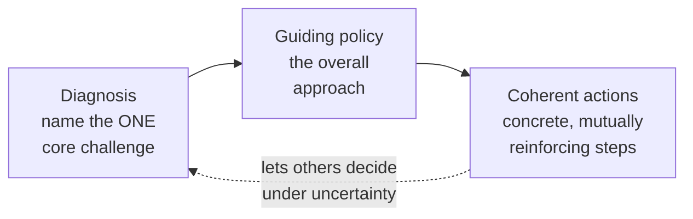
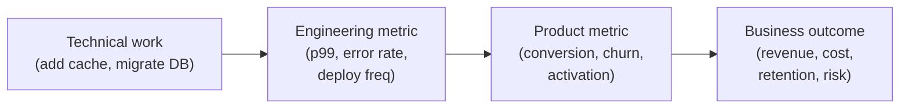
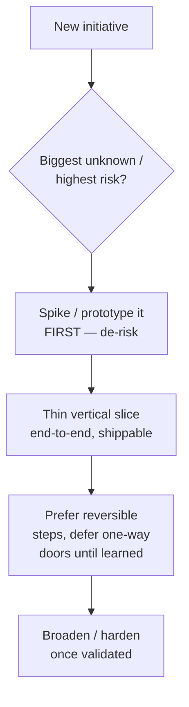

# Engineering Strategy & Prioritization

Once you are interviewing at senior and beyond, the questions stop being "can you build
it?" and start being "**can you decide what to build, in what order, and defend the call
when someone pushes back?**" Strategy and prioritization is the craft of choosing under
scarcity — finite engineers, finite quarters, infinite backlog — and *narrating that
choice* so an interviewer hears judgment instead of activity.

This is a **very common staff+ probe** because it separates people who execute assigned
tickets from people who set direction. A mid-level engineer says "I worked on what my
manager prioritized." A staff engineer says "I looked at where we were losing customers,
diagnosed that onboarding drop-off was the constraint, and sequenced the roadmap to
de-risk that first." Same team, different altitude — and the difference is audible in one
answer.

> [!KEY-TAKEAWAY]
> Prioritization is not "having a framework." It's being able to say, out loud and
> quickly: *here's the goal, here's the one thing that most moves it, here's why I
> sequenced it this way, and here's what I explicitly chose NOT to do and why that's
> okay.* The framework (RICE, WSJF, Eisenhower) is just the scaffolding that makes that
> narration defensible.

This topic owns the **behavioral, communication, and judgment craft** of strategy and
prioritization. For the *technical* method of driving a whiteboard system-design session,
see `system-design/interview-method-scenario-playbooks`. For quantifying priorities with
back-of-envelope numbers, see `interview-craft/estimation-and-napkin-math`. For defending
individual technical decisions, see `interview-craft/tradeoff-articulation-and-judgment`.

---

## What strategy is (and why it's a staff+ signal)

Most engineers use "strategy" to mean "a long list of things we plan to do." That is a
**roadmap**, not a strategy, and interviewers can hear the difference instantly. Will
Larson's working definition is the one to internalize: **a strategy is a document (or a
line of reasoning) that helps you make decisions under uncertainty.** Its job is to let
someone facing a new, unforeseen choice infer what to do without asking you. If your
"strategy" doesn't help anyone decide anything, it's a wish list.

The sharpest structure to borrow is Richard Rumelt's **kernel of good strategy** (from
*Good Strategy / Bad Strategy*), which has exactly three parts:

1. **Diagnosis** — what is actually going on? Name the *one* core challenge, stripped of
   noise. ("Our checkout p99 is 4s and we lose 8% of carts per extra second — latency is
   the constraint, not features.")
2. **Guiding policy** — the overall approach you'll take to the challenge. ("Make the
   critical path fast by default: no synchronous call in checkout may exceed 50ms; move
   everything else off the path.")
3. **Coherent actions** — the concrete, *mutually reinforcing* steps that carry out the
   policy. ("Async the fraud check, cache the pricing table, add a payment-provider
   timeout budget.")

Rumelt's contrast: **bad strategy** is fluff (buzzwords), failure to face the challenge,
mistaking goals for strategy ("grow 30%!" is a goal, not a plan), and a soup of
incoherent, contradictory objectives. In an interview, "we'll improve reliability,
velocity, *and* cut cost" with no diagnosis of the real constraint is a textbook bad-strategy tell.

> [!INTERVIEW]
> When an interviewer asks "how would you set the team's technical strategy for next
> year?", do NOT answer with a project list. Answer with the kernel: "First I'd diagnose
> the binding constraint — is it reliability, delivery speed, or cost? Say it's delivery
> speed. My guiding policy would be X, and the coherent actions that follow are Y and Z."
> Leading with diagnosis is the staff-level tell.

**Weak vs strong — "what's your strategy for the platform team?"**

- **Weak:** "We're going to migrate to Kubernetes, add better monitoring, improve CI, and
  reduce tech debt." (a list of activities, no diagnosis, no theme — bad strategy)
- **Strong:** "Diagnosis: teams ship slowly because every service reinvents deploy and
  observability, so each launch takes weeks of glue work. Guiding policy: make the paved
  road the fast path — the default way is the best way. Coherent actions: a golden service
  template, a shared deploy pipeline, and built-in tracing. Everything ladders up to
  cutting time-to-first-deploy from weeks to a day, which is the number I'd be judged on."

---

## How do you decide what to work on?

This is one of the most common senior+ behavioral questions, and the trap is answering at
the wrong altitude. Junior answers describe *how they pick the next ticket from a sprint
board*. Senior answers describe *how they decide what the team should be doing at all* and
tie it to an outcome the business cares about.

A durable answer structure:

1. **Start from the goal / metric**, not the backlog. "What outcome are we accountable for
   this half? Reduce churn? Hit a latency SLO? Unblock a revenue line?"
2. **Identify the constraint** — the one thing most limiting that outcome (Theory of
   Constraints thinking). Working on anything other than the bottleneck rarely moves the
   metric.
3. **Generate options and score them** with a lightweight framework (RICE/ICE/WSJF) so the
   ranking is defensible and not just "loudest stakeholder wins."
4. **Sequence for risk and learning** — do the thing that most reduces uncertainty or is
   hardest to reverse first (see sequencing below).
5. **Make the trade-off explicit** — state what you're consciously *not* doing and why
   that's acceptable this cycle.

> [!TIP]
> The single most powerful sentence in this answer: *"I anchored on the metric we were
> accountable for, then asked which work most moved it — everything else waited."* It
> signals you optimize for outcomes, not output.

**Common failure mode:** answering "I work on whatever's highest priority in Jira." That
outsources judgment to whoever wrote the tickets. Interviewers want to hear that *you*
formed a view of what mattered and influenced the backlog, not just consumed it.

---

## Prioritization frameworks and when to use each

You do not need to worship any single framework — you need to (a) name the right one for
the situation and (b) explain *why* its inputs fit. Reaching for a framework signals
rigor; reaching for the *wrong* one (or applying RICE to a "the site is down" decision)
signals you're pattern-matching without thinking.

| Framework | Formula / structure | Best when | Watch out for |
|---|---|---|---|
| **RICE** | (Reach × Impact × Confidence) ÷ Effort | Comparing many product bets with roughly measurable reach/impact | Effort in the denominator; Confidence (%) guards against optimistic Impact |
| **ICE** | Impact × Confidence × Ease | Fast, scrappy ranking when you lack reach data (startups, growth) | More subjective than RICE; good for a quick first cut |
| **WSJF** | Cost of Delay ÷ Job Size (Duration) | Sequencing a queue where *delay* is costly; SAFe/Lean shops | CoD = user-business value + time criticality + risk-reduction/opportunity-enablement |
| **Eisenhower** | Urgent × Important 2×2 | Sorting reactive vs strategic work; protecting Important-not-Urgent | Everything feels "urgent"; forces the do/schedule/delegate/drop call |
| **MoSCoW** | Must / Should / Could / Won't | Scoping a single release with stakeholders; drawing the line | "Won't (this time)" is the valuable box — it makes the cut explicit |
| **Cost of Delay / CD3** | CoD ÷ Duration (WSJF's engine) | Making the economics of *waiting* visible to non-engineers | Quantifies why sequencing order matters, not just what's in scope |

**RICE in one worked example.** Feature A: reaches 10,000 users/quarter, impact 2 (high),
confidence 80%, effort 4 person-months → (10000 × 2 × 0.8) / 4 = **4,000**. Feature B:
reaches 2,000 users/quarter, impact 3 (massive), confidence 100%, effort 1 →
(2000 × 3 × 1.0) / 1 = **6,000**. B wins despite lower reach — smaller, surer, cheaper.
The lesson to voice: *"Effort in the denominator is why the small sure thing often beats
the splashy big bet."*

**WSJF's key insight** is the opposite of "do the biggest-value thing first." If two items
have equal Cost of Delay but one is half the size, do the *small* one first — you deliver
value sooner and free capacity, so **shortest weighted job first** maximizes total value
delivered over time. This is the answer to "you have five equally important things — what
order?"

> [!WARNING]
> Do not present a framework as if the number is the decision. The number *organizes the
> conversation*; judgment still overrides it. Strong candidates say "RICE ranked X first,
> but I overrode it because it ignored a compliance deadline — frameworks inform, they
> don't decide." Treating the score as gospel is a junior tell; ignoring the framework
> entirely is the opposite failure.

---

## Cost of delay and opportunity cost

The most senior lens on prioritization is **economic, not effort-based**. Junior
prioritization asks "how hard is this?" Senior prioritization asks "**what does it cost us
per week that we DON'T have this?**" — that's cost of delay. Reframing a backlog in cost-of-delay terms is one of the fastest ways to sound like you think in business impact.

- **Cost of delay (CoD):** the economic loss per unit time of *not* having a feature.
  A feature that unlocks $50k/week of revenue has a CoD of $50k/week; delaying it a
  quarter costs ~$650k. Suddenly "let's do the fun refactor first" looks expensive.
- **Opportunity cost:** every yes is a no to everything else your team could do with that
  time. The right question is never "is this worth doing?" (almost everything is) but "is
  this the *best* use of the next engineer-month?"
- **CD3 (Cost of Delay Divided by Duration):** the WSJF engine — rank by CoD/duration to
  sequence for maximum economic throughput.

> [!INTERVIEW]
> When asked to justify a priority, converting it to "this costs us roughly $X/week while
> we wait" or "each week of delay loses ~N customers" is the strongest possible framing —
> it speaks the language of the people who fund the team and shows you optimize for impact,
> not personal interest.

**Sunk cost trap:** a common scenario question gives you a half-built project that's no
longer the best bet. The senior answer kills or pauses it — *"the six months already spent
are sunk; the only question is whether the remaining work is the best use of the next
engineer-month."* Continuing purely because "we've invested so much" is the failure mode.

---

## Connecting technical work to business outcomes and OKRs

The recurring staff+ complaint about senior candidates is that they describe *technical
achievements* without *business consequences*. "I migrated us to gRPC" is an activity.
"I migrated us to gRPC, which cut p99 by 40% and let us hit the checkout SLO that was
blocking a $2M enterprise deal" is impact. The gap between those two sentences is often the
gap between senior and staff.

The technique: for any piece of work, chain it up to something the CEO would care about.

**OKRs done right in an interview answer:** Objective is the qualitative direction
("Make checkout trustworthy"); Key Results are the measurable outcomes ("p99 < 500ms;
cart-abandonment < 20%"). The staff move is showing your *technical* roadmap items each map
to a KR, and being able to say which KR a given task serves. Work that maps to no KR is a
candidate to cut — voicing that is a strong signal.

**Weak vs strong — "tell me about your biggest impact":**

- **Weak:** "I rewrote our monolith into microservices — it was a huge, complex project."
  (scope of effort, not scope of impact; no number, no business tie)
- **Strong:** "I led splitting the checkout path out of the monolith. The goal was
  deploy independence — checkout couldn't ship without a full-monolith release, so we
  shipped fixes weekly instead of daily. Post-split, checkout deployed 5×/day, MTTR on
  checkout incidents dropped from hours to minutes, and we unblocked the mobile team who'd
  been waiting on our release train. I measured it by deploy frequency and lead time."

> [!KEY-TAKEAWAY]
> Rule of thumb: if you can't end a project story with a number and the word "which
> meant..." (impact), you haven't finished the story. "...which cut cost 30%," "...which
> unblocked the sales team," "...which meant we hit the SLO."

---

## Tech debt vs features: articulating the balance

"How do you balance tech debt against feature work?" is nearly guaranteed at senior+. Both
extreme answers fail: "always fix debt first" signals you don't understand the business
pays for features; "debt only when we have spare time" signals you'll let the system rot
until it explodes. The hire signal is **treating debt as an investment decision with a
return, not a moral crusade.**

Strong framing moves:

- **Quantify the debt's cost** in the same terms as features: "this debt costs us ~2
  eng-days per sprint in workarounds and one incident a month — that's a recurring tax,
  not a nice-to-have."
- **Distinguish debt types.** Not all debt is equal: debt *on the critical path / in
  frequently-changed code* has high interest; debt in a stable, rarely-touched corner can
  be left alone. Paying down debt nobody's paying interest on is waste.
- **Propose a sustainable policy, not a one-time heroic cleanup.** "I advocate a standing
  allocation — e.g., ~20% of capacity to health work — so debt is continuously serviced
  and never needs a scary stop-the-world rewrite." A steady tax beats a bankruptcy.
- **Tie debt paydown to a feature it unblocks.** The most fundable debt work is the kind
  that accelerates the roadmap: "refactoring this module first makes the next three
  features 2× faster to build." Debt paydown framed as *velocity investment* gets approved;
  framed as *cleanliness* gets deferred.

> [!WARNING]
> The "big-bang rewrite" is a classic anti-pattern interviewers probe for. Preferring
> incremental, ship-as-you-go refactoring (strangler-fig) over a multi-quarter rewrite
> with no intermediate value is the senior answer. Advocating a full rewrite "to do it
> right this time" is usually a red flag.

---

## Saying no, managing the backlog, and defending priorities

Saying no well is a **top seniority signal** — juniors say yes to everything and burn out
or ship late; seniors protect focus by declining, deferring, or trading. But *how* you say
no matters as much as saying it. A blunt "no" damages relationships; a good no keeps the
relationship intact while protecting the priority.

The strong pattern is **"yes-if / no-because + alternative,"** never a bare no:

- Acknowledge the request's value ("that's a real problem and I want to solve it").
- Anchor on the shared goal / current commitment ("our committed goal this quarter is X").
- Make the trade-off *visible and theirs*: "I can take this on, but it displaces Y — which
  do you want?" This turns a confrontation into a joint prioritization decision.
- Offer a path: defer to next cycle, a smaller version now, or hand off with support.

**Weak vs strong — a VP asks you to squeeze in a pet feature mid-sprint:**

- **Weak (junior, people-pleasing):** "Sure, we'll fit it in." (silently drops committed
  work or burns the team; the VP never learns the cost)
- **Weak (junior, rigid):** "No, it's not in the sprint." (technically correct, politically
  costly, makes you look inflexible)
- **Strong (senior):** "Happy to — that feature would help the demo. To pull it in this
  sprint I'd have to drop the payments retry fix we committed to, which is our current top
  reliability item. If this is more important, I'll make the swap and flag the trade to the
  team; if not, I'll slot it first next sprint. Which would you prefer?" (says yes to the
  person, makes the cost explicit, hands the trade-off back with data)

> [!TIP]
> "Every yes is a no to something else — I just make the no visible" is a quotable line
> that captures the whole skill. Interviewers reward candidates who protect the team's
> focus without being obstructionist.

**Backlog hygiene** is a related signal: a healthy senior view is that a backlog is a
*prioritized queue you actively prune*, not an infinite dumping ground. Ruthlessly closing
stale, never-going-to-happen items ("if we haven't done it in a year, we're not going to —
close it") signals you manage attention as a scarce resource.

---

## Sequencing: de-risk first, thin slices, reversible-first

Two roadmaps can contain the identical work and score very differently on seniority based
purely on **order**. Sequencing is where staff-level thinking shows most, because it's
about managing risk and learning, not just listing tasks.

Three sequencing heuristics interviewers reward:

1. **De-risk first (tackle the biggest unknown early).** Do the scariest, most uncertain
   part first — the thing that, if it doesn't work, kills the plan. Discovering a fatal
   problem in week 2 is cheap; discovering it in week 20 is a disaster. Junior sequencing
   does the easy, known parts first to show early progress; senior sequencing front-loads
   the risk. This is the same instinct as a spike/prototype.
2. **Thin vertical slices (walking skeleton).** Ship a tiny end-to-end path that touches
   every layer (UI → API → DB → deploy) before broadening any one layer. You get a working,
   shippable, feedback-generating increment early, and you flush out integration risk. The
   anti-pattern is building all of one horizontal layer first (all the backend, then all
   the frontend) — nothing works until the very end.
3. **Reversible-first / one-way vs two-way doors.** Bezos's framing: two-way-door
   (reversible) decisions should be made fast and cheaply; one-way-door (hard-to-reverse)
   decisions deserve deliberation. In sequencing, prefer reversible steps early and keep
   options open; delay the irreversible commitment until you've learned enough. "I'd pick a
   reversible path first so we can course-correct cheaply" is a strong line.

> [!INTERVIEW]
> A great answer to "how would you sequence this 6-month project?" is: "I'd front-load
> whatever's most likely to be wrong — probably the [X integration] — as a spike in week
> one, ship a thin end-to-end slice by week three so we're learning from real usage, and
> keep the [irreversible data migration] as late as possible so we've de-risked everything
> reversible first."

---

## Roadmapping: short-term delivery vs long-term health

A roadmap communicates *direction and sequence*, not a set of dated promises. The senior
skill is holding two horizons at once: shipping enough near-term value to keep trust and
funding, while protecting the long-term health that makes future delivery possible. Lean
entirely short-term and you accumulate debt that eventually halts you; lean entirely
long-term and you lose stakeholder trust before the payoff lands.

Techniques worth naming:

- **Now / Next / Later** (theme-based, not date-based) roadmaps set direction without
  over-promising exact dates — the modern default over a Gantt chart of fixed deadlines.
- **A capacity split** across horizons (e.g., ~70% roadmap features / ~20% health &
  reliability / ~10% exploration) makes the balance a *policy* rather than a fight every
  sprint.
- **Sequence to keep trust:** interleave visible wins with invisible foundation work so
  stakeholders see progress while you invest in the long term. A quarter of pure
  infrastructure with nothing shippable is a trust-killer even when it's technically right.

**Weak vs strong — "we're way behind; do we cut the refactor to hit the deadline?"**

- **Weak:** "Yes, ship it, we'll clean up later." (later never comes; debt compounds) OR
  "No, quality first, the date slips." (ignores the business reality)
- **Strong:** "Let's separate must-have from nice-to-have for the deadline (MoSCoW), ship
  the must-haves on time, and take on the *specific* debt that's on the critical path now
  while explicitly deferring the rest with a tracked follow-up. I'd flag which corners
  we're cutting and their cost so it's a conscious decision, not an accident."

---

## Build vs buy: the senior decision

"Do we build this ourselves or buy/adopt an existing solution?" tests whether you optimize
for *your company's actual differentiation* or for the fun of building. The default senior
bias is **buy/adopt unless it's core to your competitive advantage** — engineering time is
your scarcest resource, and spending it rebuilding a commodity (auth, queue, email, feature
flags) is opportunity cost stolen from your actual product.

A structured build-vs-buy answer weighs:

| Factor | Favors BUILD | Favors BUY / adopt |
|---|---|---|
| **Core to differentiation?** | It IS the product / secret sauce | Commodity, undifferentiated heavy lifting |
| **Total cost of ownership** | Cheap to build & maintain long-term | Build cost + *perpetual maintenance* is high |
| **Time to market** | You have time | You need it now; buying is faster |
| **Fit / customization** | No product fits your needs | An off-the-shelf option fits ~well enough |
| **Vendor / lock-in risk** | Can't tolerate dependency or data leaving | Acceptable, or mitigated by abstraction |
| **Scale / cost curve** | Vendor pricing explodes at your scale | Vendor is cheaper at your volume |

> [!TIP]
> The line interviewers love: "I'd buy the undifferentiated heavy lifting and build only
> what's core to our differentiation — engineering time is the scarcest resource, so I
> won't spend it rebuilding a commodity." Wanting to build everything in-house "for control"
> or "because it's more interesting" is a classic junior/over-engineering tell.

Watch the hidden cost: the "build" estimate almost always undercounts *ongoing maintenance,
on-call, and feature parity* — a strong candidate names TCO, not just initial build cost.
Conversely, naïve "always buy" ignores lock-in and per-scale pricing; the mature answer
weighs both and often lands on "adopt open-source / buy now, keep an abstraction so we
could swap later."

---

## Telling the story: a strategy / hard-prioritization STAR

When asked "tell me about a time you drove a strategy" or "a hard prioritization call,"
structure it as STAR but make the **decision reasoning** the star of the show — the
interviewer is buying your judgment, so spend your words on *why you chose*, not on the
technical mechanics.

**Sample STAR — a hard prioritization / saying-no call:**

- **Situation:** "Our team had committed to a Q3 reliability goal — get checkout to
  99.95% — but three stakeholders each wanted a feature, and sales was pushing a demo
  build. Everything was 'top priority.'"
- **Task:** "As tech lead I owned the roadmap. I needed to hold the reliability commitment
  without torching relationships with sales and two PMs."
- **Action:** "I made the trade-off economic and visible. I scored the requests with
  RICE and, more importantly, put a cost of delay on the reliability work — we were losing
  ~$40k/week to checkout errors, dwarfing any single feature. I took that to the group,
  proposed we protect ~80% capacity for the SLO push, and offered each PM a thin version of
  their feature or a slot next quarter. For the sales demo I found a two-day scoped-down
  path instead of the full build. I said no to the rest explicitly, with the data."
- **Result:** "We hit 99.95%, recovered the ~$40k/week, and — because I'd made the trade
  visible rather than silently dropping work — the PMs stayed bought in and two of their
  features shipped early next quarter. My manager cited this as the reason I was trusted to
  own cross-team roadmap calls after."

Why this scores: it leads with a metric-anchored diagnosis, uses a framework *and* overrides
it with economic judgment (CoD), says no with data and an alternative, and closes with a
*business* result plus a *scope-expansion* result (now owns cross-team calls).

> [!WARNING]
> Common failure modes in strategy stories: (1) taking sole credit ("I decided") when it
> was a team/stakeholder call — use "I drove/facilitated"; (2) all mechanics, no reasoning
> — you describe *what* you built but never *why that and not something else*; (3) no
> metric or business tie; (4) a story where you just executed someone else's priorities,
> which reads as low scope for a staff question.

---

## The seniority rubric: what scope of strategy signals what level

Interviewers map your prioritization stories to a level by the **scope of the decision** you
owned, not the size of the codebase. Larson's *Staff Engineer* and published ladders
(Dropbox, CircleCI, GitLab, Rent the Runway) converge on this scope ladder:

| Level | Scope of prioritization / strategy owned |
|---|---|
| **Mid (SDE II / L4)** | Prioritizes within a task or feature; decides order of subtasks; executes the team's roadmap |
| **Senior (L5)** | Owns a project/component roadmap; makes trade-offs across a feature area; influences the team backlog |
| **Staff (L6)** | Sets *team or multi-team* technical strategy; decides what a team should NOT do; ties technical direction to business outcomes; resolves cross-team prioritization conflicts |
| **Senior Staff / Principal (L7+)** | Sets *org-level* strategy; makes bets that shape roadmaps for years; owns build-vs-buy and platform direction across the org |

Larson's archetypes surface here too: the **Tech Lead** drives a team's execution and
sequencing; the **Architect** owns technical direction across an area; the **Solver** is
deployed at the thorniest priority/ambiguity; the **Right Hand** operates at
org-strategy scope alongside leadership. Matching your story's scope to the level you're
interviewing for is essential — a staff loop wants a *"I decided what the team wouldn't
do and defended it to leadership"* story, not a *"I picked the right data structure"* one.

> [!KEY-TAKEAWAY]
> The fastest scope upgrade in any prioritization answer: show you decided what NOT to do
> and influenced *others'* priorities, not just your own. "I convinced two teams to
> deprioritize their asks so we could unblock the shared platform" is staff-scoped;
> "I finished my tickets in the right order" is not.

---

## Common follow-up questions

- "Walk me through how you'd set the technical strategy for your team next quarter." (Lead
  with diagnosis → guiding policy → coherent actions; don't give a project list.)
- "You have five equally important things and one team — what order do you do them in, and
  why?" (WSJF / shortest-weighted-job-first + de-risk-first sequencing.)
- "How do you balance tech debt against feature delivery?" (Investment framing, quantify
  the interest, standing allocation, tie paydown to velocity.)
- "Tell me about a time you said no to a senior stakeholder." (Yes-if / no-because +
  alternative; make the trade-off visible and theirs.)
- "How do you decide what to work on when everything is a priority?" (Anchor on the metric,
  find the constraint, score, sequence, make the cut explicit.)
- "Build or buy — how do you decide?" (Core-to-differentiation test; TCO; buy the
  undifferentiated heavy lifting.)
- "Tell me about a project that didn't deliver the expected impact — how would you
  reprioritize?" (Sunk-cost awareness; kill/pause based on remaining ROI.)
- "How do you connect your team's work to business goals?" (Technical → eng metric →
  product metric → business outcome; map roadmap items to KRs.)
- "How would you sequence a risky six-month migration?" (De-risk first, thin vertical
  slice, reversible-first, irreversible steps last.)
- "How do you handle a roadmap where the deadline can't move but the scope is too big?"
  (MoSCoW the scope, ship must-haves, defer specific debt with tracking.)

---

## References

- Richard Rumelt, *Good Strategy / Bad Strategy* — the kernel (diagnosis → guiding policy →
  coherent actions) and the four hallmarks of bad strategy.
- Will Larson, *Staff Engineer* and StaffEng.com — strategy as a decision-making aid under
  uncertainty; the Tech Lead / Architect / Solver / Right Hand archetypes.
- Will Larson, *An Elegant Puzzle* — engineering strategy, systems thinking, and
  prioritization at organizational scale.
- Intercom, "RICE: Simple prioritization for product managers" — the RICE score
  ((Reach × Impact × Confidence) ÷ Effort) origin.
- Scaled Agile Framework (SAFe), "WSJF" — Weighted Shortest Job First = Cost of Delay ÷
  Job Duration; CoD = user-business value + time criticality + risk-reduction/opportunity.
- Donald Reinertsen, *The Principles of Product Development Flow* — cost of delay and CD3.
- Eisenhower matrix (urgent/important) and MoSCoW (Must/Should/Could/Won't) prioritization.
- Jeff Bezos shareholder letters — one-way vs two-way door (reversible) decisions.
- Published engineering ladders: Dropbox, CircleCI, GitLab, Rent the Runway; levels.fyi
  for cross-company leveling.
- Eric Ries, *The Lean Startup* — thin vertical slices / MVP and validated learning
  (de-risk first).
