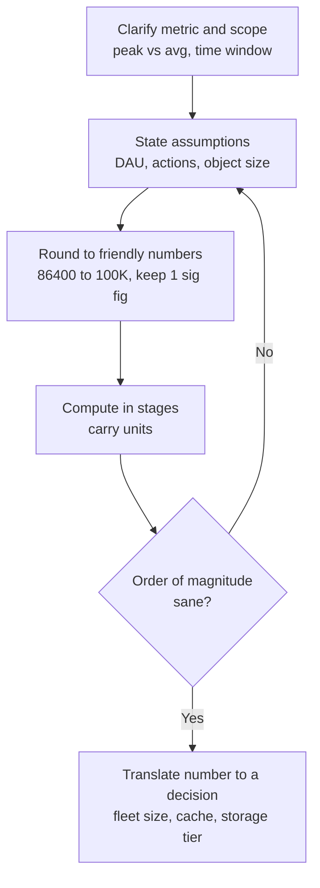
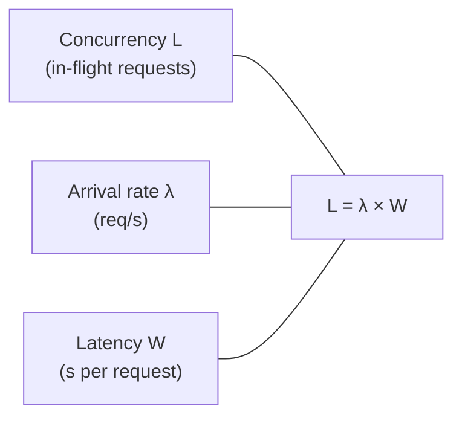

# Estimation & Napkin Math (Numbers to Know)

> Every system-design and many "how many X?" interviews hinge on a moment where the
> interviewer says: *"Roughly how much storage / QPS / bandwidth does this need?"* They are
> not testing whether you can do arithmetic — they are testing whether you can reason under
> uncertainty: **state assumptions, round to numbers you can multiply in your head, and
> sanity-check the order of magnitude out loud.** A senior engineer who lands within ~1
> order of magnitude with clear reasoning beats a "precise" answer arrived at silently or
> by guessing. This topic gives you the method, the handful of numbers to memorize, and the
> phrasings that signal judgment.
>
> Scope note: *how to drive a whiteboard system-design session* lives in
> `system-design/interview-method-scenario-playbooks`. This page owns the **estimation
> craft** — the numbers, ratios, and the way you narrate the math — that you plug into that
> method.

## Why interviewers want the method not the number

Estimation questions are a **judgment probe disguised as arithmetic**. The interviewer
already knows the "answer" is fuzzy; real systems get sized by load tests and dashboards,
not napkin math. What they are scoring is whether you:

- **Decompose** a vague question into a small number of driving variables.
- **Make assumptions explicit** and reasonable ("let's say 100M DAU, 10 actions each").
- **Round aggressively** so the math is doable out loud (86,400 s/day → "call it 100K").
- **Sanity-check the order of magnitude** ("50 PB for a photo app — that feels 100x too
  high, let me recheck my per-photo size").
- **Connect the number to a decision** ("~40K QPS means one box won't do it; we need a
  fleet plus a cache").

> [!KEY-TAKEAWAY]
> Getting within **one order of magnitude** with visible, well-narrated reasoning is a
> *pass*. A confident precise-looking number with hidden or absurd assumptions is a *fail*.
> The number is the artifact; the reasoning is the signal.

**Weak answer:** *"It'll need a big database, maybe a few servers."* — no variables, no
math, no scale sense.

**Strong answer:** *"Let me size it. Assume 100M DAU, each posts 2 photos/day → 200M
photos/day. Average photo ~1.5 MB → ~300 TB/day ingest, so on the order of 100 PB/year
before compression or dedup. That tells me object storage plus a CDN, not a single
database — and that retention policy will dominate cost, so I'd ask the interviewer how
long we keep originals."* — variables, rounding, order-of-magnitude, and a decision.

## The estimation method: assume round sanity-check show the work

A repeatable five-step loop keeps you from freezing:

1. **Clarify the scope & the metric.** What exactly are we sizing — peak QPS? bytes/day?
   servers? Ask "do you want average or peak?" and "over what time window?"
2. **State assumptions out loud.** Pick round anchor numbers (DAU, actions/user, object
   size) and *say* you're choosing them: "I'll assume…". Invite correction.
3. **Round to friendly numbers.** Use 100K s/day instead of 86,400; 10^6 for a million.
   Keep one significant figure until the end.
4. **Compute in stages**, narrating units. Carry units (requests/s, bytes/day) so a
   dimension error is obvious.
5. **Sanity-check the order of magnitude**, then translate to a decision. "Does 40K QPS
   sound right for 100M users? ~10 actions/day/user / 100K seconds ≈ 10K avg, ×4 peak ≈
   40K — yes." Then: "so we need caching + horizontal scaling."



> [!TIP]
> Narrate every assumption as a question you'd normally load-test: *"I'm assuming a 4x peak
> factor; in a real system I'd confirm that against traffic dashboards."* This shows you
> know napkin math is a starting point, not a substitute for measurement.

## Latency numbers every engineer should know

The canonical "Latency Numbers Every Programmer Should Know" (Jeff Dean, originally Peter
Norvig). Memorize the **relative ratios and orders of magnitude**, not exact figures — the
point is to reason about where time goes.

| Operation | Latency | Rounded mental model |
|---|---|---|
| L1 cache reference | ~0.5 ns | sub-nanosecond |
| Branch mispredict | ~5 ns | |
| L2 cache reference | ~7 ns | ~10x L1 |
| Mutex lock/unlock | ~25 ns | |
| Main memory (RAM) reference | ~100 ns | ~200x L1 |
| Compress 1 KB (fast codec) | ~3 µs | |
| Send 1 KB over 1 Gbps network | ~10 µs | |
| SSD random read | ~16–150 µs | ~100 µs mental anchor |
| Read 1 MB sequentially from RAM | ~250 µs | |
| Round trip within same datacenter | ~0.5 ms | |
| Read 1 MB sequentially from SSD | ~1 ms | |
| Disk seek (spinning HDD) | ~10 ms | ~20x DC round trip |
| Read 1 MB sequentially from disk | ~20 ms | |
| Packet round trip CA ↔ Netherlands | ~150 ms | speed-of-light bound |

Key intuitions interviewers want you to *use*:

- **RAM is ~100,000x faster than a disk seek and ~5,000x faster than an in-DC network
  round trip; a disk seek itself is only ~20x an in-DC round trip.** This is why we cache,
  why we avoid random disk I/O, and why chatty cross-service calls hurt.
- **Cross-region/continent latency is speed-of-light bound (~150 ms RTT for a
  transatlantic hop)** — no amount of engineering removes it; you architect around it
  (regional replicas, CDNs, async).
- **Sequential >> random.** Reading 1 MB sequentially from SSD (~1 ms) is far cheaper per
  byte than many random reads.

> [!INTERVIEW]
> A classic probe: *"A user in London hits your US-East API and it feels slow — why?"* The
> answer starts with **~150 ms transatlantic RTT** (unavoidable physics), multiplied by any
> chatty round trips, before any server work. That single number reframes the whole design
> toward edge/CDN and regional presence.

## Powers of two and data sizes

Storage and memory are counted in powers of two; you should convert instantly:

| Power | Value | Rounds to | Data size |
|---|---|---|---|
| 2^10 | 1,024 | ~10^3 | 1 KB |
| 2^20 | ~1.05M | ~10^6 | 1 MB |
| 2^30 | ~1.07B | ~10^9 | 1 GB |
| 2^40 | ~1.1 × 10^12 | ~10^12 | 1 TB |
| 2^50 | ~1.13 × 10^15 | ~10^15 | 1 PB |

Handy anchors to memorize:

- **2^10 ≈ 10^3, 2^20 ≈ 10^6, 2^30 ≈ 10^9.** So "a KB ≈ 10^3 bytes" is close enough for
  napkin math. (The ~2.4% error per 2^10 rarely matters at estimation precision.)
- **2^32 ≈ 4.3 billion** — the number of IPv4 addresses / the range of a 32-bit unsigned
  int. If your ID space needs more than ~4B values, you've outgrown a 32-bit key → use
  64-bit (2^63 ≈ 9.2 × 10^18).
- **A char/ASCII byte = 1 B; a typical UUID = 16 B; an int = 4 B; a long/timestamp = 8 B.**
  These let you size a row: sum the columns.

> [!WARNING]
> Don't confuse **bits and bytes** in bandwidth math. Network links are quoted in **bits**
> per second (Gbps), storage in **bytes**. Divide link speed by 8 to get bytes/s. Mixing
> them is an instant order-of-magnitude error interviewers catch.

## QPS from DAU

The workhorse formula for request rate:

```
average QPS  =  (DAU × actions per user per day) / seconds per day
peak QPS     =  average QPS × peak factor  (commonly 2x–10x, often ~say 3–5x)
```

- **Seconds per day = 86,400 → round to ~100,000 (10^5).** Memorize this; it turns most
  QPS math into "shift the decimal."
- **Peak factor** captures daily/traffic spikes (evenings, launches, Black Friday). State
  your assumption — 2x for smooth global traffic, up to 10x for spiky/regional. Interviewers
  want to see you *apply* one, not the exact value.

Worked example: 100M DAU, 20 actions/user/day.

- Actions/day = 100M × 20 = 2 × 10^9.
- Average QPS = 2 × 10^9 / 10^5 = **20,000 QPS**.
- Peak (×5) ≈ **100,000 QPS** → clearly a multi-server fleet + load balancer + cache.

> [!TIP]
> Keep a "**1M DAU ≈ ~10–100 QPS avg**" gut feel handy (depends heavily on actions/user).
> It lets you sanity-check: if your math says 1M DAU → 5M QPS, a per-user action count is
> off by orders of magnitude.

## Storage sizing

Storage is a volume-over-time calculation:

```
storage  =  items per day × bytes per item × retention period × replication factor
```

Steps: (1) items/day from the QPS/DAU math, (2) bytes/item by summing the row/object size,
(3) multiply by retention (days/years), (4) multiply by replication (×3 is a common default
for durability) and add overhead (indexes, metadata).

Worked example — a tweet-like text feed:

- 500M writes/day, each record ~300 B (text + metadata + IDs).
- Raw/day = 500M × 300 B = 1.5 × 10^11 B ≈ **150 GB/day**.
- Per year ≈ 150 GB × 365 ≈ **~55 TB/year** raw; ×3 replication ≈ **~165 TB/year**.
- Conclusion: fits comfortably on a sharded cluster; **media (photos/video) would dwarf
  this** — which is why you separate blob storage from the metadata DB.

> [!KEY-TAKEAWAY]
> In storage math, the **object size and retention usually dominate**, not the request rate.
> Always ask "how long do we keep it, and do we store originals + thumbnails + backups?"
> Media (images/video) is typically **1,000x+** the size of text records.

## Bandwidth estimation

Bandwidth is just throughput expressed as bytes (or bits) per second:

```
bandwidth (bytes/s)  =  requests per second × bytes per response
```

Worked example — image CDN egress:

- 20,000 image reads/s (peak), average image 200 KB.
- Egress = 20,000 × 200 KB = 4 × 10^9 B/s = **~4 GB/s ≈ 32 Gbps**.
- Conclusion: far beyond one NIC (a 10 Gbps NIC ≈ 1.25 GB/s) → **CDN offload is mandatory**,
  not optional.

Remember the bit/byte conversion (÷8) and that **read-heavy media systems are usually
bandwidth-bound, while write-heavy logging systems are storage-bound.**

## Little's Law for capacity

**Little's Law: `L = λ × W`** — the average number of concurrent requests in a system (L)
equals arrival rate (λ, requests/sec) times average time in system (W, seconds). It is the
bridge from *throughput* to *how much concurrency/how many threads or servers* you need.

- Rearranged for capacity: **concurrency needed `L = λ × W`**; **max throughput
  `λ = L / W`** (a pool of L workers each taking W seconds serves L/W req/s).
- Example: 10,000 req/s, each request holds a thread for 50 ms (0.05 s). Concurrent
  in-flight = 10,000 × 0.05 = **500**. So you need ~500 threads/connections in flight; at
  ~200 threads/box you need ~3 boxes (plus headroom).
- Reverse: a 200-connection DB pool where each query takes 20 ms serves 200 / 0.02 =
  **10,000 queries/s** at most — beyond that, requests queue and latency spikes.



> [!INTERVIEW]
> Little's Law is the senior move when asked *"how many servers/threads?"*. It shows you
> understand that **capacity is throughput × latency**, and that shaving latency (W) or
> raising the pool (L) are the two levers. Naming it and applying it is a strong signal.

## Reads-vs-writes ratio and common ratios

Real systems are lopsided; the **read:write ratio** drives the architecture:

- **Read-heavy (e.g., 100:1 or 1000:1 reads:writes)** — social feeds, catalogs, CDNs. Push
  toward caching, read replicas, denormalization, fan-out-on-write.
- **Write-heavy (writes ≈ or > reads)** — logging, metrics, IoT ingest, event streams. Push
  toward append-only stores, LSM-tree DBs, batching, sharding by write key.

Ratios worth carrying as defaults (state them as assumptions, not facts):

| Ratio | Typical ballpark | Why it matters |
|---|---|---|
| Read:write (social/content) | ~100:1 to 1000:1 | justifies aggressive caching + replicas |
| Cache hit rate (well-tuned) | ~80–95% | a 90% hit rate cuts DB load ~10x |
| Peak:average traffic | ~2x–10x | size the fleet for peak, not average |
| Compression ratio (text/logs) | ~2x–10x | shrinks storage & bandwidth estimates |
| DAU:MAU (sticky product) | ~0.1–0.5 | derive DAU when only MAU is given |

Cache math example: 50,000 read QPS at a **90% hit rate** → only 5,000 QPS reach the DB.
Bumping to **95%** halves DB load to 2,500 QPS — which is why the last few points of hit
rate are worth a lot, and why you *state* the assumed hit rate.

> [!KEY-TAKEAWAY]
> Establish the **read:write ratio early** — it's the single assumption that most changes
> the design. "This is ~1000:1 read-heavy, so I'll optimize reads with a cache and replicas
> and accept eventual consistency" is a top-tier framing move.

## Throughput ballparks and sanity anchors

A few order-of-magnitude anchors let you sanity-check any result (all rough, state them as
such):

- **Single commodity server:** ~1K–10K QPS for lightweight requests; a well-tuned service
  can push higher, a heavy request (complex query, large payload) far lower.
- **Single relational DB instance:** ~1K–10K simple queries/s before you shard/replicate.
- **In-memory cache (Redis/Memcached):** ~100K+ ops/s per node.
- **10 Gbps NIC:** ~1.25 GB/s theoretical; plan well below line rate.
- **Disk:** HDD ~100 random IOPS; SSD ~10K–100K+ IOPS; sequential throughput
  hundreds of MB/s (SSD) — random vs sequential differs by orders of magnitude.
- **Kafka-style log:** a single broker/partition handles high MB/s; scale by partitions.

Use these as the "does my answer smell right?" filter. If your napkin math implies one
Postgres box serving 500K QPS, the *anchor* tells you to add sharding/caching or recheck
your numbers.

> [!WARNING]
> Don't quote these as gospel — hardware and workloads vary hugely. Say "on the order of"
> and frame them as **starting hypotheses you'd validate with a load test.** Stating a
> single precise throughput as fact reads as junior overconfidence.

## Putting it together: a worked capacity estimate

Design sizing for a URL-shortener-style read-heavy service, narrated the way you'd speak it:

1. **Scope:** "Assume 100M new URLs/day created, read-heavy at 100:1, so ~10B redirects/day."
2. **QPS:** writes = 100M / 10^5 ≈ **1K write QPS**; reads = 10B / 10^5 ≈ **100K read QPS**
   avg, ×3 peak ≈ **300K peak read QPS**.
3. **Storage:** 100M/day × ~500 B/record × 365 × 5 yrs ≈ 100M × 500 × ~1,800 ≈ **~90 TB**
   over 5 years, ×3 replication ≈ **~270 TB** — sizeable but tractable on a sharded store.
4. **Serving 300K read QPS:** a single DB can't; cache the hot mappings. At a 90% hit rate,
   DB sees ~30K QPS → shard across ~a handful of nodes (anchor: ~10K/node). Cache tier via
   Little's Law and ~100K ops/node → a few cache nodes.
5. **Sanity check:** 300K QPS for a globally popular shortener — plausible; and reads
   dominate writes 100:1 as assumed. Decision: **cache + read replicas + sharding + CDN/edge
   for redirects.**

> [!INTERVIEW]
> The move that earns senior/staff marks is closing the loop: *"So the numbers say this is a
> read-optimized, cache-and-shard problem, and storage is modest — the interesting risk is
> the 300K peak read QPS and the hot-key distribution, which I'd validate with a load test."*
> Numbers → architecture → the one risk worth calling out.

## Common failure modes interviewers penalize

- **Analysis paralysis / refusing to commit** — "it depends, I can't say." Interviewers
  read this as inability to reason under uncertainty. Pick assumptions and go.
- **Silent arithmetic** — doing math in your head and stating only the result. Even if
  right, it earns no signal. **Narrate.**
- **No sanity check** — accepting "50 PB/day for a chat app" without flinching. A missing
  order-of-magnitude check is the most common fail.
- **False precision** — "42,347 QPS." Round numbers signal you know it's an estimate;
  spurious precision signals you don't understand the exercise.
- **Bits/bytes and unit slips** — dropping a ÷8 or a 10^3, or losing units mid-calc.
- **Not tying the number to a decision** — computing 300K QPS and stopping. Always finish
  with "…so the design needs X."
- **Forgetting peak vs average** — sizing a fleet for average traffic and getting paged at
  the evening spike.

## Common follow-up questions

- **"Why do you round 86,400 to 100,000 — isn't that a 16% error?"** Because at estimation
  precision I care about order of magnitude, and one significant figure keeps the mental
  math reliable; a ~15% skew never changes the "one box vs a fleet" decision. I'd use exact
  numbers only when the decision is genuinely close.
- **"You assumed a 5x peak factor — defend it."** It's a placeholder for daily/spiky traffic
  I'd normally get from dashboards; 2x for smooth global traffic, higher for regional or
  launch spikes. The key is that I sized for *peak*, not average, so we don't fall over at
  the evening surge — and I'd confirm the real factor before provisioning.
- **"Your storage estimate ignores compression and media — redo it."** Fair: text
  compresses ~2–5x, so raw is an upper bound; media (photos/video) is ~1000x text and would
  dominate, so I'd split blob storage from the metadata DB and estimate them separately.
- **"How many application servers do you need for 10K QPS?"** Little's Law: concurrency =
  10K × per-request latency. At 50 ms that's 500 in-flight; at ~200 threads/box, ~3 boxes
  plus headroom and redundancy — call it 4–5.
- **"A user across the ocean says the app is slow — where's the time going?"** Start with
  the ~150 ms transatlantic round trip (physics), times any chatty calls, before server
  work. Fix with edge/CDN and regional replicas, not by optimizing the handler.

## References

- Jeff Dean / Peter Norvig — "Latency Numbers Every Programmer Should Know"
  (jboner gist; Norvig's "Teach Yourself Programming in Ten Years" appendix).
- Peter Norvig, *Teach Yourself Programming in Ten Years* — original latency table.
- Alex Xu, *System Design Interview, Vol. 1* — "Back-of-the-envelope estimation" chapter
  (powers of two, availability numbers, QPS/storage estimation method).
- Little's Law — J.D.C. Little, "A Proof for the Queuing Formula L = λW" (1961);
  applied capacity-planning treatments in queuing-theory references.
- Donald Knuth / general CS references on powers of two and 2^n ≈ 10^(0.3n) approximations.
- Martin Kleppmann, *Designing Data-Intensive Applications* — read/write ratios, caching,
  replication, and storage-engine (LSM vs B-tree) throughput characteristics.
- "System Design Primer" (GitHub, donnemartin) — appendix of powers of two and latency
  numbers; back-of-envelope calculation examples.
