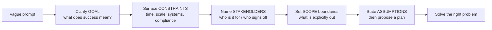
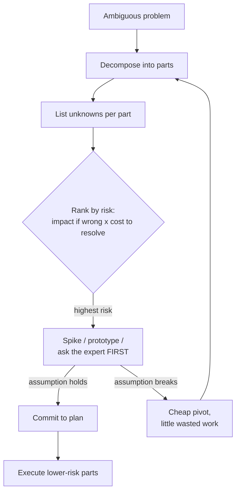
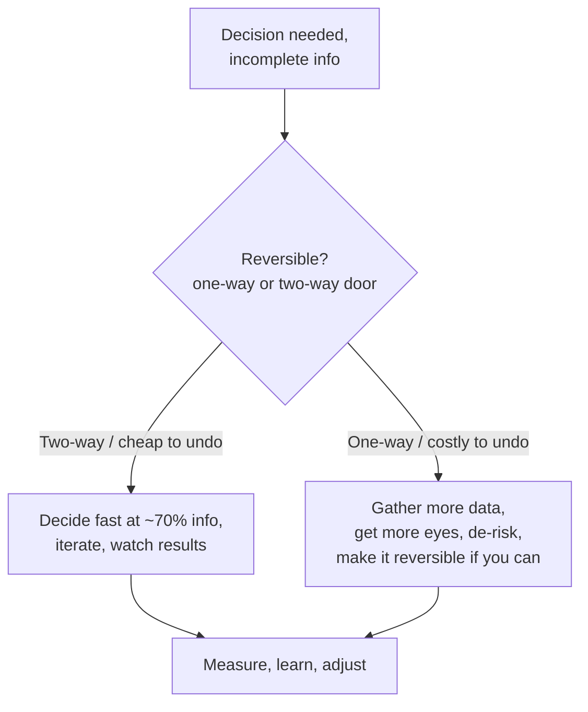
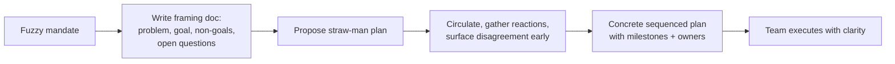
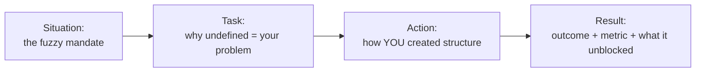

# Handling Ambiguity & Driving Clarity

Ambiguity tolerance is one of the clearest dividing lines between a strong senior
engineer and a staff+ engineer — and interviewers probe for it deliberately. Junior
engineers need a well-formed ticket; senior engineers turn a fuzzy problem into a
plan. This topic teaches the *observable behaviors* that signal that ability, how to
demonstrate them live in an interview (behavioral **and** design rounds), and the
failure modes that quietly sink candidates.

> [!INTERVIEW]
> The single most repeated senior+ mistake is **solving the wrong problem
> confidently**. Interviewers would rather see you spend 90 seconds clarifying the
> goal than 15 minutes building the wrong thing fast. "Comfort with ambiguity" is
> almost always graded as: *did they establish the goal and constraints before
> committing to a direction?*

> [!NOTE]
> This topic owns the **behavioral / communication** angle of ambiguity. The
> technical method for driving a whiteboard system-design session lives in
> `system-design/interview-method-scenario-playbooks` — cross-reference it for the
> design-round mechanics rather than re-teaching them here.

## Why ambiguity-handling is a top senior/staff signal

Scope and ambiguity are two axes of the same thing. Engineering ladders
(Dropbox, CircleCI, Rent the Runway, GitLab) all describe advancement partly as
**the size and ambiguity of problem you can be handed and still drive to a good
outcome without hand-holding.** A rough progression:

| Level | Problem you're given | What's expected |
|---|---|---|
| Junior (L3) | A well-defined task | Execute it correctly with guidance |
| Mid (L4) | A well-scoped feature | Own the how; ask when blocked |
| Senior (L5) | A loosely-defined problem | Scope it, sequence it, deliver it |
| Staff (L6) | A fuzzy *mandate* or theme | Define the problem, align people, create the plan others execute |
| Principal (L7+) | An open business/technical space | Decide *what problem is even worth solving* |

The higher you go, the *less* someone hands you a spec — you produce the spec.
This is why "handling ambiguity" reads as a proxy for seniority: an interviewer who
sees you impose structure on a vague prompt is watching a staff behavior in
miniature.

> [!KEY-TAKEAWAY]
> Ambiguity tolerance is not "being comfortable not knowing." It's **the skill of
> systematically converting unknowns into knowns, decisions, and next steps** —
> and doing it visibly so others can follow and trust the process.

## Clarify the goal and constraints first

Before proposing *any* solution, establish four things. This is the single most
reliable senior signal and it takes under two minutes.

1. **Goal / definition of success** — What outcome are we actually after? What does
   "done" look like, and how will we know it worked (the metric)?
2. **Constraints** — Deadline, budget, team size, existing systems, compliance,
   backward-compatibility, SLAs. Constraints are what turn an infinite design space
   into a decision.
3. **Users / stakeholders** — Who is this for, and who has to sign off?
4. **Scope boundaries** — Explicitly what is *out* of scope (this is where most
   ambiguity hides).

A compact framing you can say out loud in an interview:

> "Before I dive in, let me make sure I'm solving the right problem. What outcome
> defines success here, what constraints am I working under — timeline, existing
> systems, scale — and what's explicitly out of scope? I'll state my assumptions as
> I go so you can correct me."

**Weak vs strong opening on a vague prompt** ("Design a notification system"):

- Weak: "Okay, so I'll use Kafka and a fan-out service and..." *(jumps to a
  solution before knowing what problem exists — a mid-level reflex.)*
- Strong: "Let me clarify scope first. Are we notifying end users or internal
  services? What channels — push, email, SMS, all? What's the volume, roughly, and
  is delivery latency or delivery guarantee the priority? I'll assume consumer
  push + email at ~1M/day, at-least-once delivery, and treat SMS as out of scope
  unless you say otherwise."

> [!WARNING]
> Clarifying is not stalling. Ask **decision-relevant** questions — ones whose
> answers change your approach. Asking trivia ("what language should I use?") when
> it doesn't affect the design signals *false* rigor. Every question should be
> justifiable with "because the answer changes what I'd build."

## Scoping an ambiguous problem: break down, de-risk the riskiest part first

Once the goal is set, the senior move is **decomposition + risk-first sequencing**,
not "start coding the easy part." The loop:

1. **Break the problem into parts** and name the unknowns in each.
2. **Classify unknowns** by (a) how much they'd change the plan if wrong, and
   (b) how expensive they are to resolve.
3. **Attack the riskiest / highest-uncertainty part first** — the thing most likely
   to invalidate the whole approach. Cheaply, via a spike, prototype, or a
   conversation with the one person who knows.
4. **Propose a plan** with milestones and explicit checkpoints where you'll re-plan.

De-risking first is counterintuitive to juniors, who prefer to start with the part
they already understand (it feels productive). But building the easy 80% before
validating the risky 20% is how teams discover in month three that the core
assumption was false. **Pull the scariest unknown to the front.**

> [!TIP]
> A crisp interview line: "I'd identify the riskiest assumption first — the one
> that, if wrong, means the whole approach doesn't work — and spend a day
> de-risking that before building anything expensive around it."

## In interviews: don't jump to a solution on a vague prompt

Interviewers frequently give **intentionally under-specified** prompts precisely to
see whether you'll restate, clarify, and scope — or bolt straight to an
implementation. The expected sequence:

1. **Restate** the problem in your own words ("So we want X, for Y users, under Z
   constraint — is that right?"). This catches misunderstandings instantly.
2. **Clarify** the decision-relevant unknowns.
3. **State assumptions** out loud for anything they won't pin down.
4. **Propose an approach** and check it lands before going deep.

This applies beyond system design — behavioral prompts ("Tell me about a time you
influenced without authority") and even take-home instructions benefit from a quick
restatement of what you *think* is being asked.

**Contrast:**

| | Under-specified reflex | Senior response |
|---|---|---|
| First move | Start solving / coding | Restate + clarify goal |
| Assumptions | Silent, in your head | Stated out loud, labeled |
| When stuck | Guess and hope | "I don't know yet — here's how I'd find out" |
| Checkpoints | None; one big reveal | Frequent "does this match what you meant?" |

> [!WARNING]
> The opposite failure exists too: **death by clarification.** A candidate who asks
> twenty questions and never commits looks indecisive and unable to operate without
> a spec. Clarify the few things that change your approach, *then move* — stating
> assumptions to cover the rest. Momentum matters.

## Stating assumptions out loud

When you can't get an answer — the interviewer deflects, or in real life the
stakeholder is unavailable — the professional move is to **make an explicit,
reasonable assumption and proceed**, flagging it so it can be corrected. This is
strictly better than either freezing or silently guessing.

Formula: **"I'll assume [X] because [reason]; if that's wrong, [what changes]."**

Examples:
- "I'll assume read-heavy traffic, ~100:1 read/write, because it's a feed. If it's
  write-heavy that changes my storage choice."
- "I'll assume we can tolerate eventual consistency here since it's a like count.
  If we need strong consistency, I'd revisit the datastore."

Stated assumptions do three things at once: they keep you moving, they make your
reasoning auditable, and they invite the interviewer to redirect you cheaply. Silent
assumptions do none of these and are a top reason strong technical candidates get
dinged on communication.

## Making progress under uncertainty: reversible vs irreversible decisions

You rarely have complete information. The senior discipline is to **classify the
decision, not the information.** Amazon frames this as **one-way vs two-way doors**
(and Bias for Action codifies it: *"Many decisions and actions are reversible and do
not need extensive study. We value calculated risk-taking."*):

- **Two-way door (reversible):** Decide fast, with ~70% of the info you wish you had.
  If wrong, you walk back through. Most decisions are these — over-analyzing them is
  waste.
- **One-way door (irreversible / very costly to reverse):** Public API contracts,
  data-model migrations, security posture, org structure. Slow down, gather more
  data, get more eyes.

The multiplier move: when facing a one-way door, ask **"can I make this a two-way
door?"** — e.g. ship behind a feature flag, dual-write during a migration, version
the API. Converting irreversible decisions into reversible ones is a hallmark of
staff judgment.

> [!KEY-TAKEAWAY]
> "Bias for action under uncertainty" does **not** mean recklessness. It means
> matching your rigor to the reversibility and blast radius of the decision — moving
> fast on cheap-to-undo choices and deliberately on costly ones.

## Driving clarity for a team: turning a fuzzy mandate into a concrete plan

The staff+ version of ambiguity-handling is *outward-facing*: someone hands the
**team** a fuzzy mandate ("improve reliability," "figure out our mobile strategy")
and you convert it into a shared, concrete plan that others can execute. The
artifacts and moves:

- **Write it down.** A one-page framing doc / RFC / problem statement is how you make
  ambiguity legible to a group. The act of writing forces the fuzziness into the open.
  (See `design-docs-rfcs-and-adrs`.)
- **Name the problem, the goal, the non-goals, and the open questions.** Non-goals
  and open questions are what a fuzzy mandate is missing.
- **Propose a straw-man plan** to react to. A concrete-but-wrong proposal generates
  far more useful alignment than an open "what should we do?" — people edit better
  than they invent.
- **Sequence the work** with milestones and decision points.
- **Align stakeholders** — surface the disagreement early rather than discovering it
  at launch.

**Weak vs strong (behavioral):** "My manager gave me a vague goal so I asked him to
clarify it and then did what he said" *(passive — pushes the ambiguity back up)*
vs. "The mandate was 'reduce on-call pain,' which was undefined. I wrote a one-pager
defining the problem as our top-3 alert sources, proposed cutting them via X/Y/Z,
circulated it for feedback, and turned it into a quarter's roadmap the team owned."
*(created the structure; owned the definition.)*

## "I don't know yet — here's how I'd find out"

Admitting uncertainty *with a method attached* is a senior strength, not a weakness.
Interviewers respect "I don't know, but here's exactly how I'd figure it out" far
more than a confident wrong answer or a bluff, because it's what real senior work
looks like.

- Weak: "Uh… I'm not sure." *(dead end — reads as junior.)*
- Weak: bluffing a fabricated answer. *(worst option — destroys trust the moment
  they probe.)*
- Strong: "I don't know the exact GC pause off-hand, but I'd find out by enabling GC
  logging under a load test and checking p99 pause times — and I'd expect it to
  matter most if we're latency-sensitive."

The pattern: **acknowledge the gap → give your best-informed hypothesis → describe
the concrete experiment/data/person that would resolve it.** This shows intellectual
honesty (an Amazon "Are Right, A Lot" undertone: *seek diverse perspectives and work
to disconfirm their beliefs*) plus a bias toward resolving unknowns empirically.

> [!TIP]
> "I don't know" is only strong when followed by "…and here's how I'd find out."
> Naked "I don't know" with no path is still a miss. Always attach the method.

## Over-clarifying vs under-clarifying: finding the balance

Both extremes are penalized. Calibrate:

| | Under-clarifying | Over-clarifying |
|---|---|---|
| Behavior | Assumes, dives in silently | Endless questions, no commitment |
| Reads as | Reckless, solves wrong problem | Indecisive, needs a spec, junior |
| Fix | Restate + ask the 2-3 things that change your approach | Ask the decision-relevant few, state assumptions for the rest, then move |

Heuristic for whether to ask vs assume: **Would the answer change what I do next?**
- Yes, and it's cheap to ask → ask.
- Yes, but no one can answer right now → state an explicit assumption and proceed.
- No → don't ask; just proceed. (Asking anyway signals you can't prioritize.)

The senior sweet spot is **a couple of sharp, decision-relevant questions, then
decisive movement with assumptions labeled** — visible momentum, not analysis
paralysis and not blind charging.

## The behavioral story: creating structure from vagueness (STAR)

Have one polished STAR story where you were **handed something undefined and created
structure**. Structure it so the *ambiguity-handling* is the visible skill, not just
the technical result.

**Sample STAR answer** — *"Tell me about a time you were handed an ambiguous problem."*

- **(S)** "Leadership said 'our deploys are too risky' after an outage, but there was
  no defined problem, owner, or success metric — just anxiety."
- **(T)** "As the senior engineer on the platform team, I took it on myself to turn
  that into something actionable rather than wait for a spec."
- **(A)** "I started by defining success as 'change-failure rate and lead-time for
  changes,' since we had none. I pulled six months of deploy data, found 70% of
  incidents came from schema migrations, and wrote a one-page RFC scoping the problem
  to migrations specifically — explicitly marking rollback tooling as out of scope
  for phase one. I proposed a straw-man of gated migrations + automated rollback,
  circulated it, and de-risked the scariest assumption (that we *could* auto-roll-back
  online migrations) with a two-day spike before committing the roadmap."
- **(R)** "Change-failure rate dropped from 18% to 4% over the quarter, and just as
  importantly the team now had a shared definition of 'deploy safety' and a doc other
  teams reused. My manager pointed to it as staff-level scoping in my next review."

Why it lands: it shows **defining success where none existed**, **de-risking the
riskiest unknown first**, **scoping via non-goals**, **a written artifact**, and a
**measurable result** — all the target signals in one story. Note the "I" for the
structuring moves and "we/the team" for execution.

> [!WARNING]
> Failure modes that tank the ambiguity story: (1) the situation wasn't actually
> ambiguous (a clear ticket doesn't count); (2) you waited for someone else to
> define it; (3) no metric / success definition; (4) all "we," no visible personal
> agency; (5) the "structure" was just working harder, not imposing clarity.

## Common failure modes interviewers penalize

- **Solving before understanding** — jumping to a solution on a vague prompt.
- **Silent assumptions** — deciding things in your head the interviewer can't see or
  correct.
- **Analysis paralysis** — treating every decision as a one-way door; can't move
  without perfect information.
- **Bluffing** — fabricating an answer instead of "I don't know, here's how I'd find
  out." The fastest trust-killer.
- **Pushing ambiguity upward** — "I asked my manager to tell me exactly what to do."
  Junior behavior dressed as diligence.
- **Starting with the easy part** — building the well-understood 80% before
  validating the risky 20%.
- **No success definition** — never establishing what "done" or "good" means, so the
  work can't be judged (or steered).

## Common follow-up questions

- "How do you decide when to stop clarifying and just start?"
- "Tell me about a time you made a decision without all the information you wanted.
  How did you decide how much rigor it needed?"
- "You're handed 'make the service faster' with no target. What do you do first?"
- "How do you handle a stakeholder who can't or won't define what they want?"
- "Describe a time your initial assumptions turned out to be wrong. What happened?"
- "How do you drive alignment when the team disagrees on what problem to even solve?"
- "When is it right to say 'I don't know' in an interview or to a leader?"
- "How do you tell a reversible decision from an irreversible one under time
  pressure?"
- "Give an example of turning a fuzzy mandate into a concrete plan others executed."

## References

- Amazon Leadership Principles (16 principles; **Bias for Action** — reversible
  vs. irreversible decisions and calculated risk-taking; **Are Right, A Lot** — seek
  diverse perspectives, work to disconfirm beliefs) — amazon.jobs / aboutamazon.com.
- Jeff Bezos, shareholder letters on **one-way vs two-way door** decisions (2015/2016).
- Will Larson, *Staff Engineer: Leadership Beyond the Management Track* and
  *An Elegant Puzzle* — staff archetypes (Tech Lead / Architect / Solver / Right
  Hand) and operating in ambiguity; StaffEng.com guides.
- Engineering ladders framing ambiguity/scope by level: Dropbox, CircleCI,
  Rent the Runway, and GitLab published engineering career frameworks;
  levels.fyi leveling guide.
- Google re:Work / Project Oxygen — manager & IC behaviors around problem framing and
  decision-making.
- *Cracking the Coding Interview* (behavioral chapter) and *Cracking the PM
  Interview* — restate/clarify-before-solving and structured problem framing.
- Cross-references in this library: `system-design/interview-method-scenario-playbooks`
  (technical design-round method), `interview-craft/design-docs-rfcs-and-adrs`
  (writing framing docs), `interview-craft/tradeoff-articulation-and-judgment`,
  `interview-craft/behavioral-star-method`.
