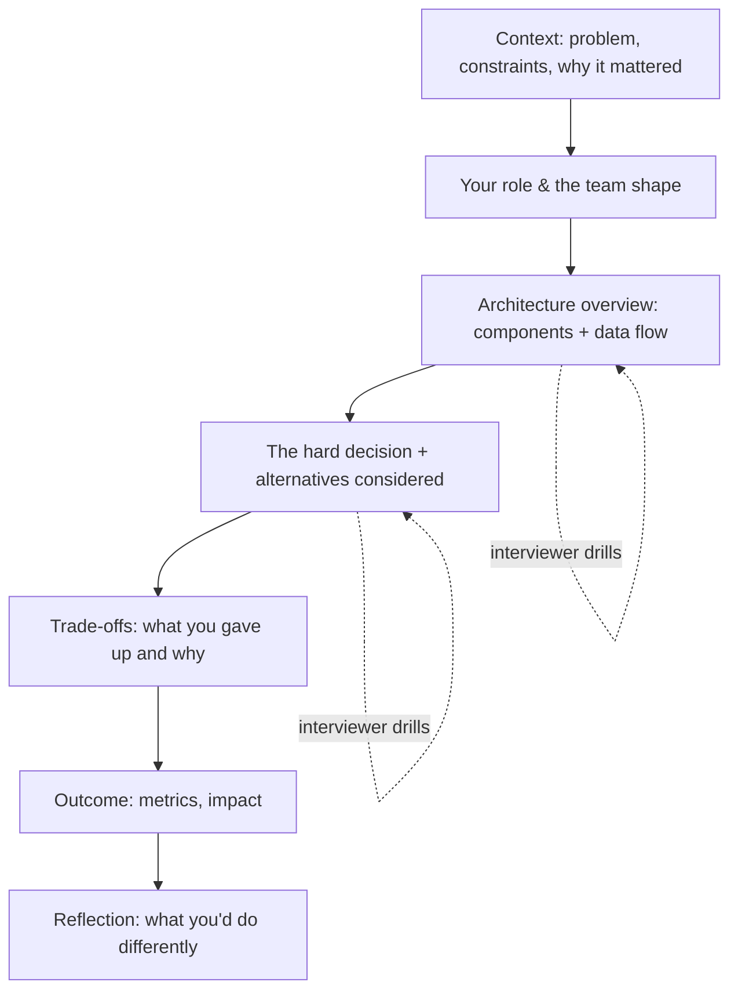
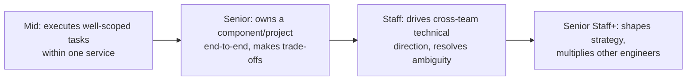

# Hiring-Manager Round & Project Deep-Dive

The hiring-manager (HM) round and the project deep-dive are the two interviews where the
decision actually gets made. Coding and system-design rounds prove you *can* do the work; the
HM round decides whether the manager **wants you on the team**, whether your **seniority
matches the level** they're hiring for, and whether there are **red flags** worth vetoing an
otherwise-strong loop. The project deep-dive is where a senior interviewer drills a real
project you shipped to separate people who *did* the hard work from people who were *near* it.

This topic owns the **behavioral / narrative** craft of these rounds: how to pick and
structure a deep-dive, how to own your scope honestly, how to answer "walk me through your
resume" and "why this company," and how to read what the HM is really asking. The **technical
system-design method** (driving a whiteboard, capacity math, API design) lives in
`system-design/interview-method-scenario-playbooks` — point there, don't re-teach it here.
Incident *process* mechanics live in `devops-cicd/observability`; here, incident stories are a
lens for showing ownership.

> [!KEY-TAKEAWAY]
> The HM is answering three questions about you: **Can you do the job at this level?**
> (seniority calibration) · **Will I want to work with you?** (fit, communication, low drama)
> · **Why you, why us, why now?** (motivation and retention risk). Every answer you give
> should feed at least one of these. The project deep-dive is the primary instrument for the
> first — so bring a project where **you** made the hard calls and can go three "why?"s deep.

---

## What the hiring-manager round is really for

The HM round is not a technical gate — it is a **fit, motivation, and seniority-calibration**
interview, usually run by the person you'd report to. The manager is simultaneously
evaluating you *and* selling the role, because a strong candidate has options. Understand both
sides: they want to de-risk the hire and they want you to say yes.

What the HM is actually assessing:

- **Level fit** — does the scope of what you've owned match the level in the job description?
  A "senior" who has only ever executed well-specified tickets is a mis-level; a "mid" who has
  driven cross-team projects is an under-level.
- **Collaboration & low-drama signal** — "Will I want this person in my 1:1s and standups?"
  They probe how you handle conflict, disagreement, and being wrong.
- **Motivation & retention** — why this role, why now; will you be engaged and stay.
- **Red flags** — blaming past teams/managers, taking sole credit, vagueness under drill-down,
  inability to name a real weakness, badmouthing a former employer.
- **Ownership & judgment** — do you think about impact and trade-offs, or just tasks.

> [!INTERVIEW]
> The HM round is the one interview where the interviewer has skin in the outcome — they'll
> live with the hire. That makes them the most skeptical *and* the most persuadable person in
> the loop. Treat it as a two-way conversation, not an interrogation: ask sharp questions back.

Common failure modes: treating it as small talk and under-preparing; giving résumé-recital
answers with no impact or reflection; being unable to explain *why this company* beyond
"growth/comp"; and going too broad (listing everything) instead of going deep on one thing.

## What the hiring manager is *really* asking (subtext)

HM questions are proxies. The senior signal is answering the *underlying* question, not the
literal one. A quick decoder:

| They ask | They're really testing | What a strong answer surfaces |
|---|---|---|
| "Walk me through your resume." | Can you self-edit and tell a coherent arc? | A 2-3 min narrative with a through-line, not a chronology |
| "Tell me about a project you're proud of." | Scope + your actual role + judgment | A project *you* drove; hard decisions & trade-offs |
| "Why are you leaving / looking?" | Retention risk & maturity | Moving *toward* something, not just fleeing |
| "Why this company / team?" | Motivation & did-you-do-homework | Specifics about their product/tech/mission |
| "Tell me about a conflict." | Do you make things worse or better? | Disagree-then-commit; empathy for the other side |
| "What would you do differently?" | Self-awareness & growth | A real learning, owned without excuses |
| "What are you looking for in your next role?" | Level & fit alignment | Scope that matches (or slightly stretches) the role |
| "Any questions for me?" | Seriousness, seniority of thinking | Questions about scope, team health, success in 6 months |

> [!TIP]
> When an HM question feels simple, pause and ask "what's the underlying worry?" "Why do you
> want to leave?" is a retention/maturity check — so answer toward the future, never with a
> grievance. Diagnosing the subtext *is* the senior signal.

## Choosing the right project to deep-dive

The deep-dive project is your single most important asset in the loop — pick it before the
interview, don't improvise. The selection criteria:

1. **You made the hard calls.** You should be able to defend design decisions as *yours*, not
   your tech lead's. Depth of ownership beats prestige of project.
2. **It has genuine technical difficulty.** A real trade-off, a scaling wall, a nasty bug, an
   ambiguous requirement — something with a decision that could have gone the other way.
3. **You can go three "why?"s deep** on every layer without hitting "I don't know / someone
   else did that."
4. **It maps to the target level.** For senior+, prefer a project with cross-team surface,
   ambiguity you resolved, or measurable business impact — not a well-specified feature.
5. **You remember the numbers.** Traffic, latency, data size, cost, timeline, team size.

Prepare **2-3 projects** so you can pick based on what the interviewer probes (one scaling
story, one ambiguity/greenfield story, one incident/reliability story). Have a crisp
**60-second overview** ready for each: problem, your role, the key decision, the outcome.

Then *read the opening probe* and map it to the right project in the first 30 seconds:

- "Hardest technical decision / biggest trade-off you've made" → lead with the **scaling** story
  (it has the clearest alternatives-and-trade-off spiral).
- "Most ambiguous problem / something with no clear spec" → lead with the **greenfield/ambiguity**
  story (shows you can create structure, not just execute it).
- "A time something went wrong / a failure" → lead with the **incident/reliability** story
  (ownership under pressure).

And have a pivot ready: if the first project isn't landing — the interviewer keeps steering away, or
the drill keeps hitting parts you didn't own — bridge explicitly rather than forcing it. "That one was
more of a team effort on the layer you're asking about; a cleaner example of me owning that decision is
the ledger migration — can I switch to that?" Choosing to pivot is itself a senior signal; grinding a
mismatched story into the ground is not.

> [!WARNING]
> Do not pick the most *impressive-sounding* project if you were peripheral to it. Interviewers
> drill precisely to find the seam between "I built this" and "I was on the team that built
> this." A modest project you owned deeply beats a famous project you can't defend.

## Structuring the deep-dive: the depth spiral

A deep-dive is not a monologue — it's an interviewer-driven interrogation of one system.
Structure your opening, then let them steer. A reliable flow:

Open with **~90 seconds of framing** (problem → constraints → your role), then **pause and
invite drilling**: "I can go deep on the data model, the scaling work, or the migration —
where's most useful?" This shows you can read an audience and manages the interview
collaboratively.

When drilled, answer at the **right altitude**: start one level up, then descend on demand.
Don't dump every detail unprompted (junior signal); don't stay abstract when they want depth
(evasive signal). The senior move is to *offer* the next level: "The write path used an outbox
pattern — want me to walk the failure modes?"

> [!TIP]
> Bring the numbers unprompted: "~40k RPS peak, p99 budget 200 ms, ~2 TB of hot data." Concrete
> figures are the fastest credibility signal and pre-empt the "how do you know it worked?" drill.

## Why interviewers drill for depth (detecting exaggeration)

The deep-dive drill exists to answer one question: **did you actually do this, and do you
understand it?** Résumés inflate; drilling deflates. Interviewers use a **funnel**: broad
question → follow-up → "why not X?" → "what broke?" → "what would you change?" Each layer is
harder to fake. People who were peripheral run out of answers by layer two or three; people who
owned it get *more* precise as you go deeper.

Common tells the interviewer is listening for:

- **Vagueness under pressure** — "we used a queue for reliability" but can't explain
  delivery semantics, retries, or the DLQ.
- **Credit that doesn't survive drilling** — "I designed the sharding" but can't say the shard
  key or why.
- **No alternatives** — every decision is presented as obvious/inevitable (real engineering has
  paths not taken).
- **No failures** — a project with zero regrets or incidents reads as either trivial or
  sanitized.

The counter-strategy is honesty plus depth: know your project cold, and where you *didn't* own
something, say so and pivot to what you *did* own. "The ML model wasn't mine — I owned the
serving layer, and there the hard part was..." Honest scoping *raises* trust.

### A drill-down, traced turn by turn

Here is the funnel in motion on the checkout-cache project, so you can *hear* an owner getting
sharper each layer instead of vaguer. Notice the interviewer never repeats a question — each
probe descends one level, and each answer adds a number or a mechanism the layer above didn't have.

> **Q1 (broad):** "You mentioned a read-through cache for pricing. Why 30 s TTL and not, say, 5 s?"
> **A1:** "Prices changed a few times a day at most, so 30 s bounded staleness cheaply — a 5 s TTL
> would have ~6× the miss rate and pushed load right back onto the pricing service I was trying to
> protect. 30 s kept hit rate around 98%."
>
> **Q2 (why-not-X):** "What happens to a shopper who loads the page during those 30 s right after a
> price *changes*?"
> **A2:** "They can see a stale price for up to the TTL. Product accepted that for non-promotional
> items. For promos we couldn't — a promo ending late is a real revenue/GMV risk — so those keys
> were tagged and evicted on the price-change event instead of waiting for TTL."
>
> **Q3 (what broke):** "You said you hit a thundering herd. How did you actually detect it?"
> **A3:** "On a launch the cache was cold; the pricing service's p99 spiked from ~40 ms to ~1.2 s and
> its error rate crossed ~5%, which paged us. The tell was thousands of *identical* misses in a
> ~200 ms window — every request recomputing the same key because none had populated it yet."
>
> **Q4 (the fix):** "And the fix under fire?"
> **A4:** "Hotfix was a per-key mutex so only one request recomputes and the rest wait on the result.
> Afterward I added request coalescing plus a short 'stale-while-revalidate' window so a cold key
> serves the last value while one background fill runs. That's the cache-stampede protection I said
> I'd build from day one now."

Contrast a peripheral candidate on the *same* funnel: Q1 → "30 seconds felt like a reasonable
default." Q2 → "I think it would just... show the new price?" Q3 → "I remember it was slow at launch
but the infra team handled that part." The answers get *shorter and softer* as the drill deepens —
the exact inverse of the owner above. That divergence, not any single wrong answer, is what the
funnel is built to expose.

## Owning your scope honestly: "I" vs "we"

Pronoun discipline is a top seniority and integrity signal. **"We" describes the team's
context; "I" describes your contribution.** Use both deliberately:

- **"We"** for shared context: "We needed to cut checkout latency by half."
- **"I"** for your actions and decisions: "I proposed the read-through cache, prototyped it, and
  drove the rollout."

Two symmetric failure modes:

- **Credit-grabbing** ("I built the whole platform") — collapses under drilling and reads as
  low integrity; it also signals you can't work on a team.
- **Credit-hiding** ("we did everything") — leaves the interviewer unable to assess *you*,
  which reads as low ownership or low level. Especially fatal for senior+.

The senior calibration is: generous with team credit, precise about your specific leverage.
"The team shipped the migration; my part was designing the dual-write cutover and owning the
rollback plan — I made the call to bleed traffic over 10% at a time after the first attempt
spiked errors."

> [!WARNING]
> Overclaiming is the single most common deep-dive killer. If drilling exposes a gap between
> your "I" and reality, the interviewer down-levels or vetoes — not for the gap, but for the
> exaggeration. Under-claiming is safer but caps your level. Aim for precise.

## Weak vs strong deep-dive answers

The same project can read junior or staff depending on framing. A worked contrast — prompt:
*"Tell me about a hard technical decision on this project."*

**Weak (junior signal):**
> "We had performance problems so I added Redis and it got faster. It was a good decision because
> the site was slow before."

Why it's weak: no alternatives, no numbers, no trade-off, no failure mode, "faster" unquantified,
and no reasoning that could have gone another way.

**Strong (senior signal):**
> "Checkout p99 was ~900 ms against a 300 ms budget; ~70% was a fan-out of read queries to the
> pricing service. I considered three options: (1) a read-through cache, (2) denormalizing prices
> into the order table, (3) a read replica. I chose the read-through cache with a 30 s TTL because
> prices changed infrequently but the denormalization would've created a consistency problem on
> price updates across millions of rows. The trade-off I accepted was up to 30 s of stale prices,
> which product signed off on for non-promotional items. It cut p99 to ~180 ms. If I did it again
> I'd add cache-stampede protection from day one — we got a thundering herd on a cold cache during
> a launch and had to hotfix a mutex."

Why it's strong: numbers, alternatives, an explicit trade-off with a stakeholder, a measured
outcome, and an owned mistake with the lesson. That's the full spiral in one answer.

## Recovering in the moment: blanks and the friendly HM

Two real-time situations trip up prepared candidates, and neither is about the *content* of your
answer — they're about composure.

**When you blank on a number mid-drill.** You will not remember every figure, and faking precision
is worse than not having it — a made-up number that doesn't survive the next follow-up reads as the
exaggeration the drill is hunting for. The honest recovery is to give the *order of magnitude* and
pivot to *why it mattered*, which is the part you actually own:

> Interviewer: "What was your exact p99 before the cache?"
> You: "I don't recall the exact figure — it was somewhere around 800–900 ms against a 300 ms budget,
> so roughly 3× over. What I remember clearly is *why*: about 70% of it was fan-out to the pricing
> service, and that's what drove the caching decision."

That answer loses nothing — it signals honesty (you flag the imprecision), keeps the magnitude
credible, and steers back to reasoning, which is what's actually being scored. Compare the trap:
inventing "847 ms," then getting asked "measured how, at what percentile, over what window?" and
unravelling.

**When the HM is clearly selling the role.** A warm, enthusiastic manager who spends half the time
pitching the team is *still scoring you* — the friendliness is not a pass. The trap is downshifting:
giving looser, less-structured answers because the vibe feels like a chat. Stay in the same gear you
would with a skeptical interviewer: same numbers, same "I" vs "we" discipline, same depth. Enjoy the
rapport, but treat every answer as graded, because it is.

> [!WARNING]
> A friendly HM going easy is the most common round to under-perform in, precisely because it doesn't
> *feel* like an evaluation. Don't coast. The write-up they submit is scored on the same rubric as the
> toughest interviewer's — warmth in the room does not soften the bar on the page.

## "Walk me through your resume" and career narrative

This is a *storytelling* test, not a recall test. The failure mode is a chronological recital
("Then in 2019 I joined X, then in 2021..."). The senior move is a **narrative arc with a
through-line**: what you've been optimizing for, how your scope has grown, and why this next
role is the logical next step.

A reusable structure (~2-3 minutes):

1. **One-line positioning:** "I'm a backend engineer who's spent the last ~6 years on
   high-throughput payment systems."
2. **2-3 arc beats, each with a scope jump:** not every job — the moves that show growth. "At
   A I owned a service; at B I led the redesign of the ledger and started mentoring."
3. **The through-line:** what connects them ("increasingly, reliability of money-movement
   systems").
4. **The hook to *this* role:** "which is exactly why this platform team interests me."

Stitched together, the four parts read as one continuous ~90-second answer — notice the seams
between positioning, arc beats, through-line, and hook disappear:

> "I'm a backend engineer, and for the last six years I've basically lived in high-throughput payment
> systems. I started at company A owning a single service — the payment-authorization API — where I
> learned what 'reliability of money movement' really costs when you're the one paged at 3 a.m. That
> pulled me deeper: at company B I led the redesign of our double-entry ledger, moved it off a
> single-primary Postgres onto a sharded model before we hit the write ceiling, and started mentoring
> two engineers through it. The thread through all of it is that I keep gravitating to the systems where
> being wrong means losing someone's money — the correctness and reliability bar is what I find
> genuinely interesting, not just the scale. Which is exactly why this platform role caught my eye:
> you're building the payments substrate other teams build on, and that's the leverage point I want to
> be at next."

That is roughly 150 words — about 60-75 seconds spoken. It never lists a job title with a date; every
beat earns its place by showing a scope jump, and the through-line ("systems where being wrong loses
money") is stated explicitly so the interviewer doesn't have to infer it.

> [!TIP]
> Rehearse the arc out loud and *time it*. Over ~3 minutes and you're rambling; under ~60 s and
> you look disengaged. End on the hook to their role so it hands the conversation back naturally.

Skip the parts that don't serve the arc. Editing your own story is itself a seniority signal —
a staff engineer knows what matters and what's noise.

## Why-this-company / why-this-role motivation

"Why us?" screens for **genuine interest vs. mass-applying**, and predicts retention. Generic
answers ("great culture," "growth opportunity," "comp") are near-negative signals — they apply
to everyone. Strong answers are **specific and personal**, built on homework.

A three-part recipe:

1. **Something specific about *them*** — a product decision, their tech (they open-sourced X),
   their scale, a public eng-blog post, their mission.
2. **Why it connects to *you*** — a genuine link to your experience or interests.
3. **What you'd contribute** — where you'd add value in *their* problem space.

Example: *"You're moving from a monolith to event-driven services — I did that migration at my
last company and the strangler-fig sequencing is exactly the problem I want to keep solving.
And I use your API weekly, so I care about the developer experience you're building."*

For "why leaving?" — move *toward*, never *away*. Never badmouth a current employer; it signals
you'll do the same to them. "I've learned a lot but the scope has plateaued; I'm looking for
larger systems and cross-team influence" beats "my manager is difficult."

## Discussing a past architecture end-to-end

Some HM/senior rounds ask you to whiteboard a system *you actually built* (distinct from the
generic design round — here it's *your* real system). The bar: explain it **end-to-end** —
request entry to data at rest — and defend every box.

A checklist to cover, at the altitude they want:

- **Entry & API**: clients, protocols, gateway, auth.
- **Compute & data flow**: services, sync vs async paths, queues, the write and read paths.
- **Storage**: datastore choices *and why* (why Postgres not Dynamo here), schema, indexing,
  partitioning/sharding.
- **Cross-cutting**: consistency model, failure modes, idempotency, observability, scaling
  limits.
- **The seams**: where it's fragile, what you'd redesign, the next bottleneck.

The differentiator from a textbook design is **specificity and hindsight**: real numbers, the
actual incident that shaped a decision, the compromise you made under a deadline. "We chose
Postgres because we needed transactions across the order and inventory tables; the scaling
ceiling was ~single-primary write throughput, which we were 18 months from hitting."

> [!INTERVIEW]
> When drilled on a choice you'd now make differently, say so plainly and explain the new
> reasoning. "Given today's traffic I'd shard on customer_id from the start" shows growth. Rigidly
> defending a past decision you privately doubt reads as lack of self-awareness.

## Handling conflict and disagreement

"Tell me about a time you disagreed with a technical decision" is one of the most reliably-asked
and most-botched HM questions. The slogan is "disagree and commit," but a slogan is not an answer.
What the HM is actually watching for: can you hold a strong view, argue it on *data* rather than
volume, and then get behind the team's call — including one that went *against* you — without
sulking. The trap is picking a story where you "won" by being the most senior person in the room;
that shows you can overrule, not that you can collaborate.

A worked answer (same payments engineer), structured so the seams are visible:

> **The disagreement:** "Our tech lead wanted to add a second datastore — a document DB — for a new
> product-catalog feature, arguing the schema was too fluid for Postgres. I disagreed: we already ran
> Postgres, and I thought a JSONB column plus a GIN index would cover the flexibility without a whole
> new operational surface — a second datastore meant a second backup story, on-call runbook, and
> consistency boundary."
>
> **How I voiced it:** "I didn't just assert it in the meeting. I built a throwaway prototype over two
> days: JSONB storage for the catalog, with the three query patterns product actually needed. It held
> ~50k catalog items and returned the worst query in ~15 ms — well under our 100 ms bar."
>
> **How it resolved:** "The data mostly backed me *and* surfaced a real limit: one planned query — a
> deep faceted search — was awkward in JSONB and genuinely cleaner in a document DB. So we split the
> difference: JSONB now, and a documented trigger — 'if faceted search ships, revisit.' My lead was
> right that the schema was fluid; I was right that we didn't need the second system *yet*."
>
> **The disagree-and-commit:** "On a *different* call I lost outright — I wanted gRPC between two
> services, the team chose REST for tooling familiarity. I said my piece once, the decision went the
> other way, and I wrote the REST client myself and didn't relitigate it in standups. Six months on it
> was clearly the right call for that team's velocity."

Why it lands: a real technical disagreement with a named trade-off, resolved by *evidence* not
seniority, plus a second beat where the candidate *lost* and committed cleanly. The interviewer
learns you can push hard and let go — the exact low-drama, high-ownership blend the round screens for.

> [!WARNING]
> Do not pick a conflict you won by authority ("as the senior engineer, I made the final call"), and
> never make the other person the villain. The strongest conflict story is one where you show empathy
> for *why* the other side held their view, and — bonus — one where you were the one who was wrong and
> changed your mind. "I can lose gracefully and still commit" is the signal; "I always win" is a red flag.

## Showing curiosity, self-awareness, and "what you'd do differently"

HMs weight **coachability** heavily — a smart engineer who can't take feedback is a net
negative on a team. Two signals prove it:

- **Self-awareness:** a *real* weakness or mistake, owned without deflection, plus what you
  changed. Avoid humble-brags ("I care too much"). Strong: "I used to over-engineer for scale we
  didn't have; now I ship the simple version and instrument it first."
- **Curiosity:** you ask questions because you want to understand, not to look smart. You engage
  with the interviewer's pushback instead of defending.

The **"what would you do differently?"** question is a self-awareness probe. There is a wrong
answer: "nothing, it went great." Every real project has a regret. The strong answer names a
*specific* alternative and the *lesson*, and distinguishes what you knew then from what you know
now (no hindsight bias): "With what we knew, the monolith was right; the mistake was not carving
seams for later extraction — I'd define module boundaries earlier now."

## Matching seniority to the depth and breadth of your examples

Interviewers calibrate level by the **scope** of your stories, not the *count*. Two axes:
**depth** (technical difficulty you personally resolved) and **breadth** (how many teams /
how much ambiguity / how much time-horizon your impact spanned).

Rough rubric for the story you should lead with:

| Level | Scope signal your best story should show |
|---|---|
| Mid | Delivered a well-specified feature reliably; solid execution and debugging |
| Senior | Owned a project/component end-to-end; made and defended real trade-offs; some ambiguity |
| Staff | Drove technical direction across teams; resolved ambiguity; multiplied others; measurable org impact |
| Senior Staff+ | Set strategy, influenced beyond your org, created leverage (frameworks, standards, hires) |

The mistake is a **scope mismatch**: a senior candidate whose best story is "I fixed a hard bug"
(strong for mid, thin for senior) will get down-leveled; a mid whose story is all "influenced
the org" without hands-on depth reads as inflated. Pick stories that sit *at* the target level,
with one that stretches slightly above.

> [!TIP]
> If you're targeting a stretch level, lead with a story at your current level (to establish
> credibility) and follow with one that reaches up (to show you're ready). Don't open with the
> stretch — if it wobbles under drilling you've capped yourself.

## Salary, leveling, and level signals in the HM round

The HM round is where **level and comp expectations** first get sounded — often obliquely. The
manager is calibrating what level to slot you at (which sets the band) and whether your comp
expectations fit the budget. This is a *signal-gathering* moment, not the negotiation itself.

Tactics:

- **Deflect early number-anchoring** without stonewalling: "I'd like to understand the scope and
  level first — I'm confident we can align on comp if the role's a fit. What band is this
  budgeted at?" Turning the question around is legitimate and often works.
- **Never lie about current comp**, but you're not obligated to disclose it — salary-history bans in
  a number of US states and cities make asking about *prior pay* unlawful in those jurisdictions
  (it varies by location, and the rules keep changing, so don't assume). Anchor on market/target,
  not history.
- **Understand the level maps to the money.** Fighting for a title with the same band is
  hollow; the leverage is level. Deep detail on negotiation and reverse questions lives in
  `leveling-negotiation-and-reverse-questions` — here, just recognize the *signals*.
- **Match your stories to the level you're negotiating for.** If you want senior, your deep-dive
  had better show senior scope; the HM connects the two.

> [!WARNING]
> Blurting a specific number early ("I want $X") anchors you and can under-sell or price you out
> before scope is established. In the HM round, gather information and defer specifics to the
> recruiter/offer stage.

## Reverse questions for the hiring manager

"Any questions for me?" is a graded part of the round — no questions reads as disengaged or
junior. Good questions double as **your** due diligence (you're interviewing them too) and
signal seniority through what you choose to probe. Tailor to the HM specifically (they own team
health, roadmap, and your growth).

Strong questions to ask an HM:

- "What does success look like for this role in the first 6-12 months?"
- "What's the biggest technical challenge the team is facing right now?"
- "How is the team's scope likely to change over the next year?"
- "How do you think about the balance of feature work vs. platform/tech-debt investment?"
- "What's the promotion/growth path from this role, and what have recent examples looked like?"
- "How does the team handle on-call and incidents?" (health/burnout signal)
- "What would make you say, a year from now, that this hire was a home run?"
- "Why is this role open — growth, backfill, or a new initiative?"

Weak/avoid (for the HM specifically): questions answered on the careers page ("what does the
company do?"), pure comp/perks questions (save for recruiter), or nothing at all.

> [!TIP]
> Prepare ~6-8 questions and ask the 2-3 most relevant given what came up in conversation. Asking
> a question that builds on something they said earlier ("you mentioned the migration — how far
> along is it?") signals you were listening and think in systems.

## Common follow-up questions

- "Walk me through your resume in a couple of minutes." — Lead with positioning, 2-3 scope-jump
  beats, a through-line, and a hook to this role. Not a chronology.
- "Tell me about a project you're proud of and your specific role in it." — Pick one you owned;
  use the depth spiral; be precise with "I" vs "we."
- "What was the hardest technical decision you made, and what were the alternatives?" — Show the
  options not taken and the trade-off you accepted; bring numbers.
- "What would you do differently on that project?" — Name a specific alternative and the lesson;
  distinguish what you knew then from now. Never "nothing."
- "Why are you looking to leave, and why us?" — Move toward something; be specific about *them*;
  never badmouth a current employer.
- "What level do you see yourself at, and what are you looking for in the next role?" — Match
  scope to the target level; defer specific comp to the recruiter/offer stage.
- "Tell me about a time you disagreed with a technical decision." — Disagree-and-commit; empathy
  for the other view; focus on outcome, not on being right.
- "What are your questions for me?" — Ask 2-3 sharp, HM-specific questions about scope, success,
  team health, and growth.
- "Describe a system you built end-to-end." — Cover entry→data-at-rest, defend datastore choices,
  name the seams and the next bottleneck, add real numbers.

## References

- Will Larson, *Staff Engineer: Leadership Beyond the Management Track* and StaffEng.com —
  Staff archetypes (Tech Lead, Architect, Solver, Right Hand) and scope definitions.
- Amazon Leadership Principles (16) and the Bar Raiser process — Ownership, Dive Deep, Hire and
  Develop the Best; behavioral drill-down and the "raise the bar" hiring philosophy.
- *Cracking the Coding Interview* (McDowell) and *Cracking the PM Interview* — behavioral
  sections, project deep-dive and "walk me through your resume" guidance.
- levels.fyi — leveling and comp-band context; how title maps to band.
- Published engineering ladders (Dropbox, CircleCI, Rent the Runway, GitLab) — depth vs breadth
  scope rubrics for mid/senior/staff calibration.
- Google re:Work / Project Oxygen — manager and hiring-signal research (coachability, structured
  behavioral interviewing).
- STAR method (and SAR/CARL variants) — structuring behavioral answers (see
  `interview-craft/behavioral-star-method`).
- Cross-references: `system-design/interview-method-scenario-playbooks` (technical design
  method), `interview-craft/seniority-ladder-and-scope-signals`,
  `interview-craft/leveling-negotiation-and-reverse-questions`,
  `interview-craft/behavioral-competency-bank`.
