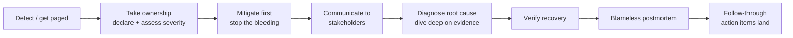
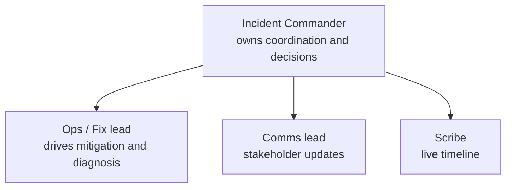

# Incident Leadership & Blameless Postmortems (Behavioral)

Almost every senior/staff backend loop asks some version of **"tell me about a production
outage you handled"** or **"tell me about a time something you built broke in prod."** It is one
of the highest-signal behavioral prompts because a real incident compresses ownership,
communication, calm-under-pressure, systems-thinking, and follow-through into a single story —
and it is very hard to fake. This topic is about **how to *tell* that story** so it reads as
staff-level leadership, not "I was on the pager and it was stressful."

> [!KEY-TAKEAWAY]
> The interviewer is not grading whether the outage happened or whose fault it was. They are
> grading a specific behavioral arc: **you took ownership → coordinated calmly → mitigated
> first, diagnosed second → communicated to stakeholders throughout → then drove a *blameless*
> postmortem and the follow-through that prevented recurrence.** Every sentence should advance
> one of those beats.

> [!NOTE]
> This topic owns the **behavioral / storytelling** angle on incidents. The *process mechanics*
> — SLOs, error budgets, alerting, runbooks, on-call rotation design, RCA templates — live in
> `devops-cicd/observability`. Point there for the "how the system works" details; here we care
> about the leadership signal. The *technical* system-design method (whiteboarding) lives in
> `system-design/interview-method-scenario-playbooks`.

---

## Why the outage question is high-signal

Interviewers love "tell me about an outage" because a real incident is a **forcing function for
seniority signals** that are otherwise easy to claim and hard to prove:

- **Ownership under pressure.** Anyone can own a task when things go well. An outage tests
  whether you step *toward* the problem or wait to be told it's yours.
- **Prioritization in real time.** Mitigate vs. diagnose, page more people vs. keep it small,
  roll back vs. roll forward — these are judgment calls made with incomplete information and a
  clock running. That is exactly the senior decision-making the loop wants to observe.
- **Communication as a deliverable.** Under stress, most people go heads-down and silent. The
  senior behavior is to *narrate* — keep stakeholders informed even while you don't yet have
  answers.
- **Learning and prevention.** Junior engineers fix the symptom and move on. Senior engineers
  treat the incident as data about a *system* that let it happen, and they change the system.
- **Emotional maturity.** Blame, panic, and defensiveness are the tells of someone who will be
  hard to work with when things go wrong — and things always go wrong.

> [!INTERVIEW]
> A subtle trap: interviewers often *prefer* a story where **you caused or contributed to the
> incident.** An outage you merely observed shows you can follow a runbook. An outage you helped
> cause and then owned, mitigated, and turned into a systemic fix shows accountability *and*
> growth — a far stronger signal. Do not reflexively pick the story that makes you look
> blameless.

---

## The incident story arc (the beats that score)

Structure the answer as a timeline. STAR still applies, but the *task/action* middle expands
into a recognizable incident sequence. Interviewers are pattern-matching against this arc:

What each beat should convey in your telling:

| Beat | Weak telling | Strong (senior) telling |
|---|---|---|
| **Detect** | "An alert went off." | "Our latency SLO alert fired; I acknowledged the page within 2 minutes and pulled up the dashboard." |
| **Own** | "I waited for my lead." | "I declared a SEV2, made myself incident commander, and started a war-room channel." |
| **Mitigate** | "I started debugging the code." | "First I stopped the bleeding — rolled back the deploy to restore service — *then* investigated, because customers came first." |
| **Communicate** | (silence) | "I posted a status update every 15 minutes to the stakeholder channel, even when I had no new answer, so support and leadership weren't guessing." |
| **Diagnose** | "It was a bug." | "Once stable, I traced it to a connection-pool exhaustion from a query that lost its index after a migration — confirmed via the slow-query log." |
| **Postmortem** | "We agreed to be more careful." | "I ran a blameless postmortem, wrote the timeline, and we landed three action items — two of which I owned and shipped within the sprint." |

> [!TIP]
> Open with the **stakes and your role**, not the technical minutiae: "I was on call when our
> payments API started 500-ing during peak traffic — roughly 8% of checkouts failing, so real
> revenue was on the line." That single sentence establishes blast radius, urgency, and that
> *you* were the person on the hook. Then walk the timeline.

---

## Mitigate first, diagnose second

The single most common way engineers reveal junior instincts in an outage story is by
**debugging before mitigating.** When customers are impacted, the priority is to *restore
service*, not to understand the bug. Understanding comes after.

The senior mental model: **stop the bleeding, then perform surgery.** Mitigations are
reversible, low-risk actions that restore service *without* requiring you to know root cause:

- Roll back the most recent deploy (the highest-probability cause).
- Fail over to a healthy region/replica.
- Shed load / enable a rate limiter / turn on a circuit breaker.
- Feature-flag off the suspect code path.
- Scale up the resource that's saturated.

> [!WARNING]
> "I spent 40 minutes reading logs to find the exact line of code, then fixed it" is a **red
> flag** in an outage story even if it's technically impressive. It says you optimized for your
> curiosity over customer impact. The strong version is: "I rolled back within 10 minutes to
> restore service, *then* took my time on root cause with no clock pressure."

There is nuance a staff engineer articulates: sometimes you *can't* mitigate blindly (e.g., a
rollback would corrupt data mid-migration), and you must diagnose enough to mitigate *safely*.
Naming that trade-off — "I couldn't just roll back because we were mid-migration, so I diagnosed
just enough to know a forward-fix flag was safe" — shows judgment, not rule-following.

---

## Communicating during an incident

Under pressure the instinct is to go silent and heads-down. The senior behavior is the
opposite: **communication is a first-class deliverable of incident response**, not a
distraction from it. Stakeholders (support, leadership, dependent teams, sometimes customers)
are anxious precisely because they *can't* see what you see.

Principles that signal maturity:

- **Regular cadence over perfect information.** Post updates on a fixed cadence (e.g., every
  15–30 min) *even when there's no news*. "Still investigating, service is stable via rollback,
  next update in 15" is a valuable update — it tells people they don't need to escalate.
- **Separate the communicator role when it's big.** In a large incident, the incident commander
  should *not* also be typing the fix. Delegating a "comms lead" so responders can focus is a
  staff-level move.
- **Right altitude for the audience.** Leadership wants blast radius, ETA, and "do we need to
  pull anyone else in" — not stack traces. Support wants "what do I tell customers." Engineers
  want the technical thread.
- **Own the message even when it's bad.** "We caused this, here's impact, here's our plan" beats
  vague reassurance. Sandbagging or minimizing destroys trust.

> [!TIP]
> A crisp phrasing that scores: *"I appointed one person to own stakeholder comms so I could
> focus on the fix, and we committed to a status update every 15 minutes — because in an outage,
> silence reads as loss of control."*

---

## Being the incident commander (IC)

The **incident commander** is a role, not a rank — the single person who owns *coordination* of
the response (not necessarily the person doing the debugging). Naming that you took or held this
role is a strong scope signal. Good IC behavior:

- **Declare severity and structure early.** Open a war room, assign roles (ops lead, comms lead,
  scribe), and make the current plan explicit so everyone rows in one direction.
- **Coordinate, don't hero.** The IC's job is to keep the response organized, avoid duplicate
  work, decide when to pull in more people, and make the call on mitigate-vs-diagnose. A great
  IC often touches no code.
- **Maintain a running timeline.** Capturing timestamps live makes the postmortem accurate and
  removes the temptation to reconstruct (and unconsciously sanitize) events later.
- **Know when to escalate.** Pulling in a domain expert or waking up a manager is a strength, not
  an admission of failure. "I paged the database on-call at the 20-minute mark because I judged
  we were past the point where solo debugging was responsible" is a mature line.

> [!WARNING]
> The anti-pattern: a self-described "hero" who did everything alone, refused to escalate, and
> kept everyone else in the dark. In an interview this reads as a **coordination and trust
> risk**, not a strength — even if they resolved the incident. Heroics don't scale and often
> hide a lack of documentation and teamwork.

---

## Blameless postmortem culture

A **blameless postmortem** (also called a blameless retro or, at Amazon, a Correction of Errors
/ COE) focuses on the **systems and processes** that allowed an incident, **not on the
individuals** involved. Google's SRE book states it directly: a blameless postmortem investigates
contributing causes "without indicting any individual or team for bad or inappropriate behavior,"
assuming "everyone involved had good intentions and did the right thing with the information they
had." The operating principle: **you can't fix people, but you can fix systems and processes.**

Why it matters *for the interview*: advocating for blamelessness is one of the clearest **senior
maturity signals** there is. It shows you understand that:

- **Blame destroys the information you need.** If people fear punishment, they hide mistakes,
  stop escalating, and stop writing honest postmortems — so the org stops learning. Psychological
  safety is a *reliability* investment, not a nicety.
- **"Human error" is a symptom, not a root cause.** If one engineer's typo could take down prod,
  the real defect is a system with no guardrail (no review, no canary, no validation), not the
  human. The blameless question is "why did the system make this mistake easy and its
  consequences severe?"
- **The output is systemic action items, not apologies.** A blameless postmortem still holds the
  bar high — it names exactly where the system failed and commits to concrete fixes; it just
  doesn't name-and-shame.

> [!INTERVIEW]
> When a candidate's outage story ends with *"...and we counseled the engineer to be more
> careful"* or *"we added a rule that you must double-check before deploying,"* that is a
> **blame-and-exhort anti-pattern**. Careful-ness is not a control. Interviewers want to hear a
> *systemic* fix — a canary, an automated check, a guardrail — that would stop the *next* person
> from making the same mistake.

Contrast, in the language you'd use:

| Blameful framing | Blameless framing |
|---|---|
| "Priya pushed a bad config." | "A config change reached prod without validation because our pipeline had no schema check." |
| "The on-call didn't notice the alert." | "The alert was buried among 40 noisy pages that night; alert fatigue meant a real signal was missed." |
| "We need people to be more careful." | "We added an automated guardrail so this class of mistake can't reach prod again." |

---

## Owning your own mistake in a postmortem story

The strongest incident stories are often ones where **you caused or contributed to the
problem** — because owning your own mistake, publicly and without flinching, is the purest test
of accountability. The skill is **accountability *without* self-flagellation.**

The balance to strike:

- **Take clear, specific ownership.** "I shipped the migration that dropped the index" — first
  person, concrete, no hedging. Don't diffuse it into "mistakes were made."
- **Don't grovel or spiral.** Excessive self-blame ("I felt terrible, I couldn't sleep, I'm so
  sorry") is *also* a weak signal — it centers your feelings over the fix and, ironically, is the
  opposite of blameless (you're blaming a person; that person is just you). It can also read as
  fragile.
- **Immediately pivot to systemic learning.** "...and here's what I realized the *system* was
  missing that let my mistake reach prod" turns your error into an org-level improvement. That
  pivot is the money shot.
- **Show the follow-through.** "I owned the action item to add migration validation to CI, and it
  shipped" proves the learning was real, not just stated.

> [!TIP]
> A model close: *"I own that I wrote the query that lost its index. But the real lesson was that
> our deploy pipeline had no way to catch a plan regression — so I added an automated
> slow-query check to the migration gate. My mistake was the trigger, but the fix was systemic,
> and it's caught two regressions since."* Ownership, no groveling, systemic prevention,
> evidence of impact.

---

## Weak vs. strong: a worked example

**Prompt:** *"Tell me about a production outage you handled."*

**Weak answer (junior signals):**
> "One time the service went down. I looked at the logs for a while and eventually found a bug
> in the code that a teammate had written. I fixed it and deployed. Then we told everyone to test
> more carefully before shipping. It was really stressful but we got through it."

Why it's weak: no ownership (it was the teammate's bug, and blame is implied), debugged before
mitigating (customers stayed down while they read logs), no communication, no severity/role, the
"fix" is exhorting people to be careful (not systemic), and no measurable impact.

**Strong answer (senior/staff signals):**
> **S:** "I was on call when our checkout API began returning 500s during a Friday peak — about
> 8% of orders failing, so meaningful revenue at risk."
> **T:** "I acknowledged the page in two minutes, declared a SEV2, and made myself IC."
> **A:** "First priority was to stop the bleeding: the errors correlated with a deploy 20 minutes
> earlier, so I rolled it back, and error rate dropped to zero within 5 minutes. I appointed a
> comms lead to post 15-minute stakeholder updates so support and leadership weren't in the dark.
> *Then*, with service stable, I dove into root cause — a migration in that deploy had dropped an
> index, so a hot query started table-scanning and saturated the connection pool. I confirmed it
> in the slow-query log."
> **R:** "We were fully recovered in under 15 minutes. I ran a blameless postmortem the next day.
> The honest finding was that *my* migration reached prod because our pipeline had no plan-
> regression check — so I owned the action item to add an automated slow-query gate to
> migrations. It's shipped and has caught two regressions since. We also cut our rollback time by
> adding one-click rollback."

Why it's strong: instant ownership, mitigate-before-diagnose, active communication, IC role,
owns *his own* mistake without groveling, blameless + systemic fix, and quantified impact plus
prevention that generalizes.

---

## Anti-patterns interviewers penalize

The failure modes that turn an incident story into a *negative* signal:

- **Blaming a person.** "It was the intern's fault" / "the other team broke it." Even if true, it
  reads as someone who will point fingers when things go wrong.
- **Panicking / no structure.** "It was chaos, everyone was yelling." Fine to acknowledge stress,
  but you must show you *imposed* order (declared severity, assigned roles).
- **Hiding or minimizing.** "I quietly fixed it and didn't tell anyone" or "it wasn't really a
  big deal." Concealment is the opposite of ownership and blameless culture.
- **Diagnosing before mitigating.** Optimizing for your curiosity over customer impact.
- **Hero complex.** Did everything alone, wouldn't escalate, no documentation.
- **Symptom fix, no prevention.** "I restarted the box and it was fine" with no follow-through on
  *why* — and no systemic change so it can't recur.
- **"Be more careful" as the action item.** Exhortation instead of a control/guardrail.
- **All "we," no "I."** The interviewer can't score what *you* did if you never say "I."

> [!WARNING]
> Beware over-correcting into a story where you were flawless and everyone else failed. That
> triggers a *credibility* check — real incidents are messy and involve your own missteps. A
> story with zero self-implication often reads as sanitized or as low-ownership.

---

## Mapping incident stories to leadership principles

At values-driven companies, an incident story is a natural vehicle for named principles. Amazon
currently publishes **16 Leadership Principles**; the outage story maps especially well onto:

| Principle | How the incident story demonstrates it |
|---|---|
| **Ownership** | You stepped toward the problem, thought long-term (prevention), and never said "not my job." Owning *your own* mistake is peak Ownership. |
| **Dive Deep** | You didn't stop at the symptom — you audited the slow-query log and found the true root cause, staying connected to the details. |
| **Customer Obsession** | You mitigated to restore customer service *first*, before satisfying your own need to understand the bug. |
| **Insist on the Highest Standards** | The blameless postmortem raised the bar via a systemic guardrail, not a one-off patch. |
| **Earn Trust** | Transparent, honest communication during and after — including admitting your own contribution. |
| **Are Right, A Lot / Bias for Action** | Making a sound mitigate-vs-diagnose call quickly under uncertainty. |

> [!TIP]
> When you know the company uses LPs, *name the behavior, not the label*: describe diving into the
> slow-query log; let the interviewer map it to "Dive Deep." Explicitly reciting "this shows Dive
> Deep" can feel rehearsed. But do make sure the story *contains* an Ownership and a Dive-Deep
> beat, since those are the two the outage question is built to elicit.

---

## Common follow-up questions

Interviewers probe to test the depth and honesty of your story. Expect:

- **"What was *your* specific role?"** — Guards against "we" stories. Be ready with first-person
  actions and decisions you personally made.
- **"What would you have done differently?"** — Tests reflection and blamelessness. Answer with a
  *systemic* insight, not "I'd have been more careful."
- **"How did you decide to roll back vs. fix forward?"** — Tests real-time judgment under
  uncertainty. Explain the risk trade-off you weighed.
- **"Who did you communicate with, and how often?"** — Tests whether communication was a
  deliverable or an afterthought.
- **"Was it your mistake? How did you feel / how did the team react?"** — Tests accountability and
  whether the culture was blameless. The strong answer owns it and describes a systemic, not
  personal, resolution.
- **"Did the fix actually prevent recurrence?"** — Tests follow-through. Have the evidence (it
  hasn't recurred; the guardrail caught N regressions since).
- **"How did you prevent this class of problem, not just this instance?"** — The staff-level probe:
  can you generalize from one incident to a category of risk?
- **"What if you couldn't roll back?"** — Tests whether your mitigate-first instinct is a rule or
  a judgment (see the mid-migration nuance above).

---

## References

- Google, *Site Reliability Engineering* — ["Postmortem Culture: Learning from Failure"](https://sre.google/sre-book/postmortem-culture/) (blameless postmortem definition; "you can't fix people, you can fix systems").
- Google, *The Site Reliability Workbook* — ["Incident Response"](https://sre.google/workbook/incident-response/) and the Incident Command System (IC / comms / ops roles).
- PagerDuty — [Incident Response Documentation](https://response.pagerduty.com/) (incident commander role, severity levels, mitigate-first).
- Atlassian — [Blameless postmortems](https://www.atlassian.com/incident-management/postmortem/blameless) and incident management handbook.
- Amazon — [Leadership Principles](https://www.amazon.jobs/content/en/our-workplace/leadership-principles) (16 LPs; Ownership, Dive Deep, Customer Obsession, Earn Trust) and the Correction of Errors (COE) process.
- John Allspaw — ["Blameless PostMortems and a Just Culture"](https://www.etsy.com/codeascraft/blameless-postmortems/) (Etsy Code as Craft; origin of the "blameless" framing in software).
- Sidney Dekker — *The Field Guide to Understanding 'Human Error'* (human error as a symptom of systemic conditions; "just culture").
- Will Larson — *Staff Engineer* and [StaffEng.com](https://staffeng.com/) (coordinating cross-team response and driving org-level follow-through as staff-scope work).
