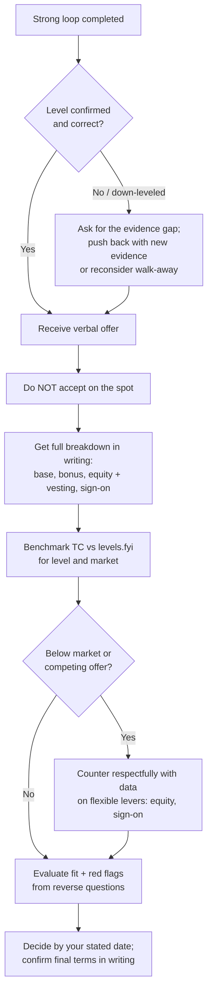

# Leveling, Negotiation & Reverse Questions

You aced the loop. Now the *other* half of the outcome is decided: **what level** you're
placed at (which sets your entire pay band and trajectory) and **what number** goes in the
offer. Most engineers treat these as passive — "they'll tell me the level, they'll send a
number, I'll say yes." That is the single most expensive mistake in a tech career: a
down-level or a lowball anchors your comp for years and compounds. This topic teaches how
leveling is actually decided, how to negotiate respectfully with data (not bluster), and how
to use the "any questions for me?" slot — which *is scored* — to both signal seniority and
detect red flags before you sign.

> [!KEY-TAKEAWAY]
> Three levers decide your outcome after a strong loop: (1) **Level** — match your
> demonstrated scope to the target band and confirm the level early; a down-level costs far
> more than any signing bonus. (2) **Negotiation** — think **total comp** (base + bonus +
> equity + sign-on), anchor with market data (levels.fyi), never accept on the spot, get it in
> writing, and let leverage (competing offers) do the talking respectfully. (3) **Reverse
> questions** — thoughtful questions are a seniority signal and your due-diligence tool; asking
> none is a negative signal.

> [!INTERVIEW]
> The *technical* interview method (driving a whiteboard design, back-of-envelope math) lives
> in `system-design/interview-method-scenario-playbooks`. This topic owns the **career/
> commercial** craft: leveling, comp negotiation, and the close. Recruiters run negotiation
> professionally and repeatedly; you do it every few years. Close the asymmetry with data and
> process, not with tricks.

---

## How leveling is decided

**What it is.** Leveling is the panel + hiring committee's judgment of which band your
*demonstrated* scope, autonomy, and impact fit — L4/L5/L6 at Amazon, E4/E5/E6 at Meta, SWE
II/III/Senior/Staff elsewhere. It is decided by the **debrief/hiring-committee**, not by any
single interviewer, and it is calibrated against the *scope your stories proved you owned* —
not your title, not your years. (See `seniority-ladder-and-scope-signals` for the underlying
scope axis; this section is about the *mechanics* of the leveling decision.)

**How it actually works:**

- Each interviewer files independent feedback with a leveling recommendation and evidence.
- A debrief (Amazon: with a **Bar Raiser** who owns bar/leveling consistency and has veto
  power, and is not on the hiring team) reconciles the signals and assigns a level.
- Ambiguous signal defaults **down**, not up. If two interviewers saw Senior scope and two saw
  Mid, the committee rarely gambles up — the cost of a bad senior hire is higher.
- The recruiter often has a *target* level in mind from your résumé screen; the loop confirms
  or corrects it.

> [!WARNING]
> "Mixed signal → default down" is why consistency across the whole loop matters. One
> interviewer who heard only feature-level scope can cap you. Bring the *same* level of
> scope/impact framing to every round, including the ones that feel junior (coding, the HM
> chat).

**The senior/staff bar.** At senior+ you are leveled on scope evidence: what you *owned
end-to-end*, what you decided autonomously, and whether your work multiplied others. Tie every
major story to a level-appropriate scope claim ("I owned the payments migration across three
teams and set the idempotency standard they still follow") rather than task completion ("I
finished my tickets on time").

---

## Down-leveling risk and how to protect against it

**What it is.** Down-leveling is being offered a level *below* the one you targeted (and often
below your current title). It happens when the loop's scope evidence didn't clearly clear the
higher bar, or when the company's bands are stricter (a "Senior" at a 50-person startup may
map to Mid at Google).

**Why it matters.** Level sets your pay band, your scope, your promo clock, and your next
job's anchor. Accepting a down-level "to get in the door and prove myself" usually means a
1–2 year internal promo grind to recover what you'd have had on day one — and internal promos
are slower and less certain than an external offer at the right level.

**How to protect against it:**

- **Confirm the target level early** (see next section) so the loop is calibrated to the right
  bar and interviewers probe for the right scope.
- **Bring level-appropriate stories.** If you're targeting Staff, at least one story must show
  cross-team/org impact, not just a well-run project.
- **If down-leveled, ask for the evidence gap:** "What scope would you have needed to see to
  place me at L6?" This is data for a rebuttal or for the next company.
- **You can push back with new evidence** — a project you didn't get to discuss, a reference,
  or a re-interview with one more senior-scope round. Companies do re-level when given a
  concrete reason.
- **Decide your walk-away.** Sometimes the right move is to decline and interview elsewhere at
  the correct level rather than anchor low.

> [!TIP]
> A signing bonus is sometimes offered to "make up" for a lower level. Do the math: a one-time
> bonus does not fix a permanently lower pay band and slower equity. Level > one-time cash
> almost every time.

---

## Asking about level early

**What it is.** Proactively surfacing the target level with the recruiter *before* the loop —
"What level is this role scoped for, and what's the band?" — and aligning your prep to it.

**Why it matters.** If you don't know the target, you can't calibrate your stories, and you
risk interviewing for L5 when your experience clears L6 (leaving comp on the table) or vice
versa (getting rejected for over-reaching). Recruiters expect senior candidates to ask; it
reads as commercial awareness, not presumption.

**How to do it well — sample phrasing:**

- Early screen: *"Before we schedule, can you share the level this role is scoped for and the
  comp band? I want to make sure my experience maps to what you need."*
- If they hedge: *"Understood that it can flex based on the loop. What's the range of levels
  you'd consider, and what would tip it to the higher one?"* — now you know the scope to
  demonstrate.
- Mid-process, if you suspect a mismatch: *"Based on our conversations, I'm targeting [Senior/
  Staff]. Is the loop calibrated for that, or should we adjust?"*

**Failure modes:** never open with a demand ("I'll only interview for Staff"); frame it as
alignment. And don't skip the question out of politeness — going through a full loop mis-leveled
wastes everyone's time and usually ends in a down-level offer.

---

## Total compensation: base + bonus + equity + sign-on

**What it is.** Tech comp is a *package*, not a salary. The four standard components:

| Component | What it is | Notes |
|---|---|---|
| **Base salary** | Cash, paid biweekly | Most stable; taxed as income; the number recruiters anchor you to |
| **Bonus** | Annual target %, often tied to company/individual performance | "Target" ≠ guaranteed; ask about payout history |
| **Equity** | RSUs (public) or options (private); vests over 4 yrs | Often the largest component at senior+; see equity section |
| **Sign-on bonus** | One-time cash, sometimes split over 2 years | Used to bridge unvested equity you're forfeiting, or a lower level |

**Why it matters.** Comparing offers on base alone is the classic mistake. A $180k base + $50k
bonus + $600k/4yr equity is ~$380k/yr **total comp (TC)**, not $180k. Amazon famously
**front-loads sign-on** (Year-1 and Year-2 cash bonuses) because its RSUs vest 5/15/40/40 —
back-loaded — so the *average* TC over 4 years is the honest number, and Year-1 can look very
different from Year-4.

**How to do it well:**

- Always compute and compare **average annual TC over 4 years** (and eye the year-by-year
  curve, especially for back-loaded vesting).
- Know which levers are flexible: base is often band-capped; **equity and sign-on usually have
  the most give** at senior+.
- Model the **cliff and vesting schedule** (below) — unvested equity is not yours yet.

> [!WARNING]
> Recruiters may quote a headline "up to $X" that assumes stock appreciation or on-target
> bonus. Ask what's *guaranteed* vs. *variable*, and value RSUs at the **current** share price,
> not a projected one.

---

## Benchmarking with market data (levels.fyi)

**What it is.** Grounding your expectations and asks in real, level-mapped comp data:
levels.fyi (crowd-sourced TC by company/level/location), Glassdoor, Blind, and offers from
peers. levels.fyi also maps titles across companies (Google L5 ≈ Meta E5 ≈ Amazon L6).

**Why it matters.** Data turns negotiation from a feelings argument ("I think I deserve more")
into a defensible one ("the 75th percentile for L6 in this market is $X; my offer is at the
40th"). It also tells you the *realistic ceiling* so you neither lowball yourself nor make an
absurd ask that burns credibility.

**How to do it well:**

- Pull the **level-specific, location-specific** band before you get a number — don't compare
  a Bay Area L6 to a remote-Midwest L5.
- Anchor asks near the **top of band**, not beyond it; asking for double the band signals you
  haven't done homework.
- Use cross-company title mapping to argue level equivalence when negotiating a level, not just
  a number.

> [!TIP]
> Bring the specific data point, not the vibe: *"levels.fyi puts L6 TC in this market at
> $X–$Y; my offer's at the low end. Can we get to the midpoint on equity?"* Named source +
> specific number + specific lever = a request a recruiter can actually take to the committee.

---

## The "what are your expectations?" trap

**What it is.** The recruiter asks, early, *"What are your salary expectations?"* or *"What are
you making now?"* Whoever names a number first often sets the anchor — and if you anchor low,
you cap the whole negotiation.

**Why it matters.** A number you give in the first screen can become the ceiling. Naming your
*current* comp lets them offer a small bump instead of the market rate for the role. (Several
US jurisdictions now **ban** the current-salary question for exactly this reason.)

**How to do it well — deflect, then anchor high with data:**

- Deflect current-salary: *"I'd rather focus on the value of this role. What's the band you've
  budgeted for this level?"* — flips the anchor to them.
- If pressed for expectations, **anchor on researched market data, high-but-defensible:**
  *"Based on levels.fyi for this level and market, I'm targeting total comp around $X, but I'm
  flexible on the mix of base, equity, and sign-on for the right role."*
- Give a **range whose bottom you'd actually accept**, and put your target at the *middle* of
  what they'll likely offer — never state a floor you'd resent.

> [!WARNING]
> The two classic errors: (1) blurting your current salary (anchors you to your old job, not
> the new role's value), and (2) naming a specific low number to "seem reasonable." Both leave
> money on the table. Deflect first; if you must anchor, anchor on market data, not your past.

---

## Negotiating respectfully with data and leverage

**What it is.** Using calm, evidence-based back-and-forth — and genuine leverage (competing
offers, a strong loop, in-demand skills) — to move the offer, without adversarial games.

**Why it matters.** Almost every senior+ offer has room; recruiters expect a counter and
often hold budget in reserve. Not negotiating leaves money on the table. But bluffing,
ultimatums, or fake competing offers can blow up the offer and your reputation.

**How to do it well:**

- **Anchor on data + a specific lever:** *"I'm excited about the team. To get to yes, I'd need
  TC closer to $X — that's the market midpoint for this level. Is there room on the equity or
  sign-on?"*
- **Competing offers are the strongest honest leverage.** State them factually with the number,
  never bluff: *"I have a competing offer at $Y TC; I'd prefer to join you if we can close the
  gap."* Fabricating one is a fireable/rescinding-level integrity risk if discovered.
- **Negotiate the flexible levers.** Base is often band-locked; **equity, sign-on, and start
  date** usually have more give. Ask for a specific component, not just "more."
- **Stay warm and collaborative** ("help me get to yes"), never adversarial. You'll work with
  these people; a scorched close poisons the relationship.
- **Get every counter in writing** before you respond to it.

> [!TIP]
> A useful frame: *"I'm not trying to squeeze you — I want to say yes. Here's the gap and the
> data behind it. What can we do on equity or sign-on?"* Collaborative framing gets recruiters
> advocating *for* you to the committee.

**Failure modes interviewers/recruiters penalize:** exploding ultimatums ("$X or I walk"),
bluffed offers, negotiating rudely or with entitlement, and re-trading (agreeing then re-opening).
Also: accepting instantly (you leave money on the table and signal you undervalue yourself).

---

## Never accept on the spot; get it in writing

**What it is.** The discipline to (a) not verbally commit the moment you hear a number, and (b)
insist on a **written offer** with every component before you agree or resign anywhere.

**Why it matters.** Verbal offers and "trust me, the bonus is usually X" are not binding.
On-the-spot acceptance forecloses negotiation and any competing process. Details omitted from
writing (bonus %, vesting schedule, refresh policy, start date, remote status) are the ones
that later "weren't what we discussed."

**How to do it well — sample phrasing:**

- *"Thank you, I'm genuinely excited. This is a big decision — can you send the full details in
  writing? I'll review and come back to you by [date]."*
- Ask for the **written breakdown**: base, bonus target + payout history, equity grant value +
  vesting schedule, sign-on and any clawback, level, title, start date.
- **Buy time** politely: a few days to a week is standard and reasonable; use it to negotiate
  and to let other processes catch up.
- Never resign your current job on a *verbal* offer.

> [!WARNING]
> "This offer expires end of day" / "exploding offers" are pressure tactics. A company that
> genuinely wants you can give you a reasonable window (days, not hours). Extreme deadline
> pressure is itself a mild red flag; respond calmly and ask for time.

---

## Equity nuances: RSUs vs options, vesting, refreshers

**What it is.** How equity actually converts to money, and why the fine print dominates the
headline number.

- **RSUs (Restricted Stock Units)** — public-company grants; each unit becomes a share as it
  vests. Value = current share price × units. Taxed as income at vest. Lower risk than options.
- **Stock options (ISOs/NSOs)** — the *right to buy* shares at a fixed **strike price**. Worth
  money only if the share price exceeds the strike; you must **exercise** (pay the strike) to
  own them. Common at startups.
- **Vesting schedule** — the calendar over which equity becomes yours. Classic: **4-year vest
  with a 1-year cliff** (nothing vests until month 12, then monthly/quarterly). Amazon's is
  back-loaded (**5/15/40/40** per year), which front-loading sign-on bonuses compensate for.
- **Cliff** — leave before the cliff and you get *zero* equity.
- **Refreshers** — additional grants awarded during employment (annual/performance) that offset
  the "vesting cliff" drop when your initial grant runs out around year 4. Ask about the refresh
  policy — without refreshers, TC falls off a cliff in year 5.

**Why it matters.** Two offers with identical "equity value" can be worth wildly different
amounts depending on vesting shape, strike price, and refresh policy. A back-loaded grant with
no refresher can mean a low year-1 and a comp cliff at year 4.

> [!TIP]
> Questions to always ask about equity: *What's the vesting schedule and cliff? Are these RSUs
> or options (and what's the strike)? What's the refresh/annual-grant policy? Is the grant
> quoted in shares or dollars, and at what share price?*

---

## Startup equity: percent ownership, dilution, and strike price

**What it is.** At a private startup, equity is usually **options** (or sometimes RSUs at later
stages). The number that matters is not the share count but the **percentage of the company**
and its realistic value.

**Key concepts:**

- **Percent ownership** — your shares ÷ fully-diluted shares outstanding. Ask for the
  percentage, not just the share count (100,000 shares is meaningless without the denominator).
- **Dilution** — future funding rounds issue new shares, shrinking your percentage. Your 0.5%
  today may be 0.2% after two more rounds. Early equity carries more dilution risk (and more
  upside).
- **Strike price / 409A valuation** — the price to exercise options, set by the last 409A
  appraisal. Lower strike = more upside. Compare strike to the preferred-share price investors
  paid.
- **Preferred vs common** — investors hold **preferred** stock with liquidation preferences;
  employees hold **common**, which pays *after* preferences in an exit. A "$1B valuation" can
  leave common holders with little if preferences stack up.
- **Vesting + cliff** — same 4-year/1-year-cliff norm; plus watch the **post-termination
  exercise window** (often only 90 days to exercise vested options after you leave, requiring
  real cash).

**Why it matters.** Startup equity is a lottery ticket with fine print. "0.5% of a company
that might be worth $1B" sounds like $5M but can be near-zero after dilution, liquidation
preferences, and a strike you must pay. Value it soberly and weight cash accordingly.

> [!WARNING]
> Never accept a startup offer on share count alone. Ask: *What percentage is this on a
> fully-diluted basis? What's the current 409A / strike? What did the last round price at, and
> what are the preferences? What's the post-termination exercise window?* If they won't share
> percentage or the cap-table basics, that opacity is itself a red flag.

---

## Reverse questions: why "any questions for me?" is scored

**What it is.** The 3–5 minutes at the end of each round where the interviewer asks *"Do you
have any questions for me?"* It is **not filler** — it is evaluated, and it is also your only
window to interview *them*.

**Why it matters.** Good questions demonstrate engagement, curiosity, seniority, and that
you're evaluating fit (which senior people do). **Asking nothing is a negative signal** — it
reads as disinterest, passivity, or "just wants any job." The questions you ask are also
mini-signals of your level: junior candidates ask about perks and process; senior candidates
ask about scope, trade-offs, and organizational health.

**How to do it well:**

- Prepare **more questions than you'll need** (some get answered during the interview) and
  **tailor them to that interviewer's role** (ask an engineer about the codebase, a manager
  about team health, a skip-level about strategy).
- Ask **open, specific** questions that invite real answers, not yes/no or things you could
  Google.
- It's fine to make the last one a soft close: *"Is there anything about my background you'd
  like me to expand on?"*

> [!WARNING]
> Bad reverse questions hurt you: leading with comp/perks/WFH to a peer engineer, asking things
> the JD answers ("what does the team do?"), or "no, I'm good." Save comp for the recruiter.

---

## Reverse questions that signal seniority

**What it is.** Questions that reveal you think about systems, trade-offs, org dynamics, and
impact — the way a senior/staff engineer does.

**Strong, seniority-signaling questions:**

- *"What's the biggest technical challenge the team is facing in the next 6–12 months?"*
- *"How are technical decisions made and disagreements resolved here — RFCs, a tech-lead call,
  consensus?"*
- *"How is success measured for this role in the first 6 and 12 months?"* (shows
  outcome/impact orientation)
- *"Where do you see the most technical debt, and how does the team decide when to pay it
  down?"*
- *"What separates a good engineer from a great one on this team?"*
- *"How does this team influence or get influenced by other teams / the broader architecture?"*
  (scope/cross-team thinking)
- To a skip-level/HM: *"What are the org's top priorities this year, and how does this team ladder
  up to them?"*

**Why they work:** each maps to a senior signal — thinking in outcomes, trade-offs, org
context, and growth — rather than tasks and perks.

> [!TIP]
> A great closing question for the hiring manager: *"What does success look like for someone in
> this role a year from now?"* It shows you're already thinking about impact, and the answer
> tells you exactly how you'll be judged.

---

## Red-flag-detecting reverse questions

**What it is.** Due-diligence questions that surface problems *before* you sign — the reverse
questions do double duty: signal seniority *and* protect you.

**Questions that surface red flags (and what to watch for):**

| Question | What a bad answer reveals |
|---|---|
| *"What does on-call look like — rotation frequency, pager load, comp?"* | Constant pages, weekly rotations, no comp → burnout culture |
| *"How does the team handle tech debt vs. feature pressure?"* | "We don't have time for that" → death-march / brittle systems |
| *"What's the team's attrition been like in the last year? Why did the last person in this role leave?"* | Evasion or high churn → management/culture problem |
| *"How are on-call incidents and postmortems handled — blameless?"* | Blame culture → fear-driven engineering |
| *"What's the deploy frequency and how long does CI take?"* | Weekly manual deploys, hours-long CI → poor eng maturity |
| *"How much of the week is meetings vs. focused work?"* | All-meetings → low autonomy |
| *"Why is this role open — growth or backfill?"* | Repeated backfill → retention issue |

**Why it matters.** You'll spend years here; the offer stage is your leverage-maximal moment to
evaluate them. Ask calmly and neutrally — you're gathering data, not accusing. Watch *how* they
answer as much as *what* they say: hesitation, deflection, or over-rehearsed positivity are
signals.

> [!TIP]
> Ask the *same* question (e.g., "why did the last person leave?") to multiple interviewers.
> Inconsistent answers are a louder red flag than any single response.

---

## Researching the company and interviewer

**What it is.** The homework you do *before* the loop and the close: the company's product,
business model, recent news, tech stack, engineering blog, and — where possible — your
interviewers' backgrounds.

**Why it matters.** Research powers everything above: better tailored reverse questions,
credible level/comp benchmarking, informed red-flag radar, and answers that connect your
experience to *their* problems. Senior candidates are expected to have done it; showing up
cold reads as low interest.

**How to do it well:**

- **Product & business:** what they sell, who the customers are, how they make money, recent
  funding/earnings, competitors. (For startups: stage, runway, last round — informs equity risk.)
- **Engineering:** their eng blog, public talks, GitHub, job posts (reveal the stack and pain
  points), Glassdoor/Blind for culture and comp.
- **Interviewers:** LinkedIn for role and tenure so you can tailor questions (ask the staff
  engineer about architecture, the EM about team health).
- **Synthesize into questions:** *"I saw on your engineering blog you moved to event-driven
  ingestion — how's that trade-off working out operationally?"* signals genuine, specific interest.

> [!TIP]
> Turn research into *one specific, informed reference* per interview ("I read your post on the
> Cassandra→DynamoDB migration…"). It instantly separates you from candidates who did zero prep
> and gives the interviewer an easy, engaged conversation.

---

## The offer-close decision flow

---

## Common follow-up questions

- *"The recruiter asked what I'm currently making. What do I say?"* — Deflect to the role's
  budgeted band; don't anchor to your old comp. In many US jurisdictions they legally can't ask.
- *"They offered me a level below what I expected. What now?"* — Ask what scope evidence they'd
  have needed, push back with anything you didn't get to show, and weigh a down-level's
  long-term cost (pay band + promo grind) against a signing bonus. Consider walking.
- *"How do I compare two offers with different equity structures?"* — Compute average annual TC
  over 4 years, value RSUs at current price, model vesting shape and refreshers, and discount
  startup options for dilution/strike/liquidation preferences.
- *"Is it rude to negotiate? Won't they rescind?"* — A respectful, data-backed counter almost
  never gets an offer pulled; recruiters expect it. Ultimatums, bluffed offers, and re-trading
  are what damage relationships.
- *"What's the single best reverse question?"* — For the HM: *"What does success look like for
  this role in 12 months?"* It signals impact-orientation and tells you how you'll be judged.
- *"They gave me an exploding offer — 24 hours. What do I do?"* — Ask calmly for a reasonable
  window; a company that wants you can grant days. Extreme pressure is itself a mild red flag.
- *"How much equity/salary give is there really?"* — At senior+, base is often band-capped but
  equity and sign-on usually have room; ask for a specific lever, not just "more."

## References

- levels.fyi — crowd-sourced total-comp data by company/level/location and cross-company level
  mapping (e.g., Google L5 ≈ Meta E5 ≈ Amazon L6); the standard benchmarking source.
- Amazon Leadership Principles (16 total, incl. "Strive to be Earth's Best Employer" and
  "Success and Scale Bring Broad Responsibility," added 2021) and the **Bar Raiser** process —
  who owns leveling/bar consistency in a debrief.
- Haseeb Qureshi, "Ten Rules for Negotiating a Job Offer" — never give the first number, always
  get it in writing, competing offers as leverage, negotiate the flexible components.
- Patrick McKenzie (patio11), "Salary Negotiation: Make More Money, Be More Valued" —
  anchoring, who-names-a-number-first, and the "what are your expectations?" trap.
- Will Larson, *Staff Engineer* / StaffEng.com — scope-based leveling and matching stories to
  the target band (leveling mechanics).
- Dropbox / CircleCI / GitLab / Rent the Runway published engineering ladders — how level maps
  to scope, autonomy, and impact.
- *Cracking the Coding Interview* (Gayle Laakmann McDowell), offer/negotiation and "questions to
  ask" sections.
- Holloway, *The Holloway Guide to Equity Compensation* — RSUs vs options, vesting, cliffs,
  409A/strike price, dilution, liquidation preferences, and post-termination exercise windows.
