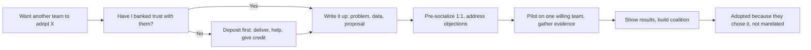
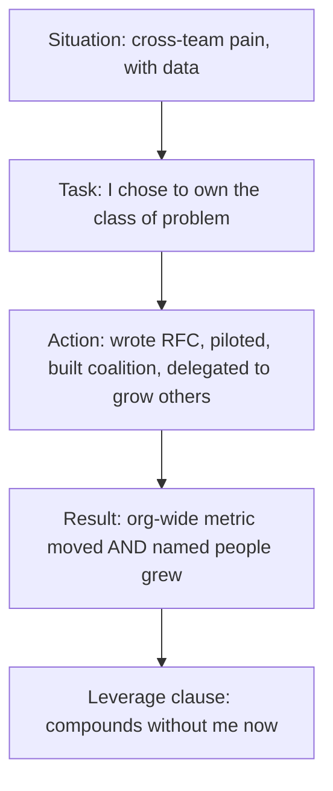

# Mentorship, Multiplier Impact & Cross-Team Influence

At Senior the interview asks *"can you deliver hard projects?"* At **Staff+** it asks
*"do you make the people and systems around you better?"* This topic is about the
**multiplier** — the single strongest senior/staff signal — and the two skills that
create it: **growing other engineers** (mentorship, sponsorship, teaching) and **moving
work across teams you don't own** (influence without authority). It also covers the
career trap hiding inside all of this: **glue work** that is real leadership but reads as
"not technical" if you narrate it wrong.

This is behavioral/judgment content. The "correct" answer in the MCQs is the one that
best demonstrates the target signal an interviewer is scoring — leverage, ownership,
judgment — not the one that sounds nicest.

> [!KEY-TAKEAWAY]
> A force-multiplier's résumé line is not *"I built X"* — it's *"I made N people/teams
> able to build X-class things without me."* In interviews, keep answering three implicit
> questions: **How much did this raise others' output? (leverage)**, **Did you move people
> who didn't report to you, and how? (influence)**, and **Can you prove it beyond "I
> helped"? (evidence/scope)**. If a story only shows personal heroics, it scores Senior no
> matter how hard the thing was.

Boundaries: the **technical** system-design interview method lives in
`system-design/interview-method-scenario-playbooks`. Incident *process* mechanics live in
`devops-cicd/observability`; here, incident stories are only the behavioral angle.
Coding-round *skills* live in `dsa-coding`/`lld-and-ood`; here we care how you
**communicate** as a mentor/reviewer, not the algorithms.

---

## The multiplier effect

Andy Grove's rule (*High Output Management*): **a manager's output = the output of their
org + the output of orgs they influence.** Staff+ ICs inherit the same math without the
reporting line — your output is your work **plus the leverage you add to everyone else's**.
This is why "I shipped a lot" caps out at Senior: it doesn't scale past one person's hours.

**Where leverage comes from** (roughly high → low reach):

| Lever | Reach | Example |
|---|---|---|
| Reusable systems / platforms / tooling | Whole org, indefinitely | A migration framework 6 teams use; a golden path that cuts new-service setup from 2 weeks to 1 day |
| Standards, patterns, docs, templates | Everyone who reads them | An RFC template + review bar that raises design quality org-wide |
| Teaching that sticks | Each person, forever | Code review that teaches the *why*; onboarding that makes ramp-up 2x faster |
| Sponsorship | The sponsored person's whole trajectory | Putting someone on the visible project that gets them promoted |
| Direct unblocking | This project, this week | Pairing to break a specific blocker |

Direct unblocking is real but the **lowest-leverage** form — it doesn't compound. The
multiplier move is to convert a one-off unblock into something durable: a doc, a lint rule,
a pattern, a taught principle.

> [!INTERVIEW]
> Weak: *"I'm the go-to person on our team — everyone comes to me when they're stuck."*
> That's a **bottleneck** signal, not a multiplier signal (bus-factor of one, doesn't
> scale). Strong: *"I noticed I was the bottleneck for X, so I wrote the runbook and ran
> two brown-bags; ticket volume to me dropped ~70% and two engineers now own that area."*
> Same facts, but the second removes yourself from the critical path — that's leverage.

Common failure mode interviewers penalize: **the hero who is secretly a single point of
failure.** Making yourself indispensable is anti-multiplier. The goal is to make yourself
*unnecessary* for the thing you built.

---

## Mentorship vs sponsorship

These are different acts with different costs, and conflating them is a classic senior-level
tell. **Mentorship gives advice; sponsorship spends your capital.**

| | Mentorship | Sponsorship |
|---|---|---|
| What you give | Advice, feedback, context, time | Opportunity, visibility, your reputation as collateral |
| Direction | Talk *to* the person | Talk *about* the person, often when they're not in the room |
| Cost to you | Time | **Political capital / risk** — you vouch for them |
| Who it helps most | People who need skills | People who already have skills but lack **opportunity and visibility** |
| Failure mode | "Let me give you some advice" (can imply they're not good enough) | Requires you to *have* capital and *spend* it |

Lara Hogan's concrete **sponsorship** acts (memorize a few — they make great story fodder):
recommend someone to *lead* a project; put them forward to run a postmortem or a meeting
where leaders watch; nominate them for a talk or a blog post; forward their win to a wider
audience explaining why it mattered; cite what you learned from them to influential people;
name them in a promotion/staffing discussion.

Larson's framing: sponsorship **amplifies**; mentorship **advises**. The higher-leverage,
scarcer act is sponsorship, because it moves someone's *trajectory*, not just their current
task — and it costs *you* something. A common bias worth naming: underrepresented engineers
often get over-mentored ("here's advice") and under-sponsored ("I'll put my name behind
you"), when what they lacked was opportunity, not skill.

> [!INTERVIEW]
> A near-guaranteed follow-up: *"Did you mentor them or sponsor them — what's the
> difference in what you actually did?"* Strong answer names a **specific capital-spending
> act**: *"I didn't just give her advice; I told my director she should lead the payments
> cutover and I'd back her, then handed her the design review to run while I stayed quiet."*
> Weak answer: *"I mentored her a lot and she grew."* (Advice, not amplification — reads
> junior and un-scoped.)

---

## Growing engineers: onboarding, code review, docs, talks

Concrete multiplier mechanisms, each of which is a story you can tell:

**Code review as teaching.** The junior signal is a review that only lists defects. The
senior signal is a review that transfers judgment: explain the **why** and the principle,
not just the fix; distinguish **blocking** issues from **preferences** (label "nit:" vs
"blocking:"); ask questions instead of dictating (*"what happens here if the upstream call
times out?"*) so they reach the answer; praise good decisions, not just flaws. Reviewing to
*teach* means you'll eventually review *less* because the person internalized the pattern —
that's the multiplier.

**Onboarding.** A great onboarding doc/mentor turns a 6-week ramp into 2 weeks for *every
future hire* — pure leverage that compounds with headcount. Framing an onboarding revamp as
"cut median ramp-to-first-PR from X to Y across N hires" is a strong multiplier story.

**Docs, tech talks, brown-bags.** These are **write-once, teach-many** leverage: a
well-placed design doc or a recorded talk keeps teaching after you've moved on. The staff
move is to spot a recurring question you keep answering 1:1 and convert it into a durable
artifact.

**Growing vs doing it yourself.** Under deadline pressure the tempting move is to grab the
hard task and ship it. The multiplier move is to **pair a stretch task with a growing
engineer and a safety net** — slower this week, faster forever, and you built capacity. In
interviews, showing you *delegated a thing you could have done faster yourself* (and why) is
a strong seniority signal.

> [!TIP]
> Measure mentoring by **the mentee's outcomes and independence**, not your effort:
> *"they now own that service and I'm no longer in the review loop,"* *"they got promoted
> and I sponsored the case,"* *"ramp time dropped."* "I spent a lot of time helping people"
> is effort, not impact.

---

## Influence without authority

The defining Staff+ skill: **getting teams and leaders who don't report to you to adopt your
approach — through trust, data, relationships, and writing, not mandate.** You almost never
have authority at the scope where staff impact happens, so "I'd tell them to do it" is a
failing answer.

The toolkit, roughly in order of durability:

1. **Trust & relationships (the bank account).** You can only spend influence you've
   deposited. Deposits: reliably delivering, helping other teams unprompted, giving credit,
   being right in low-stakes moments. Build the relationship *before* you need the favor.
2. **Writing.** A crisp doc/RFC scales your argument to rooms you're not in and lets people
   engage async on their own time. Writing is the highest-leverage influence tool at scale —
   it's how one person aligns dozens.
3. **Data & shipped proof.** "Here's the p99 latency / cost / incident data" beats opinion.
   Better still: **a working prototype or pilot** on one team — adoption follows evidence,
   not slides. Show, don't mandate.
4. **Meeting people where they are.** Frame the ask in *their* goals and incentives ("this
   cuts your on-call load"), not yours. Understand what they're measured on.
5. **Coalition-building.** Get one or two respected teams/individuals on board first; social
   proof pulls the rest. Pre-socialize 1:1 *before* the big meeting so you're not asking
   people to change their mind in public.

> [!WARNING]
> The most common failing answer to *"how did you get another team to adopt X?"* is some
> flavor of **escalation-first**: "I got my manager to tell their manager." Escalation is a
> real tool but it's the **last** resort — leading with it signals you can't move people
> without a hammer, and it burns the relationship you'll need next quarter. Escalate only
> after you've genuinely tried to align, and frame it as surfacing a decision to the right
> owner, not "winning."

---

## Driving org-wide standards & adoption

Turning "my team's good practice" into "how the org does it." The trap is thinking the hard
part is the standard itself — the hard part is **adoption**. A perfect standard nobody
follows is zero leverage.

Playbook:

- **Start from real pain, not aesthetics.** "We had 3 incidents from inconsistent retry
  logic" lands; "I prefer this style" doesn't.
- **Make the right way the easy way.** A **golden path** / paved road (a template, a
  library, a generator, a default that's already wired up) drives adoption far better than a
  policy doc, because it's *less* work to comply than to deviate.
- **Enforce with tooling, not nagging.** Linters, CI checks, and defaults scale; code-review
  policing doesn't and creates resentment.
- **Pilot → iterate → roll out.** Prove it on one team, incorporate their feedback (which
  also makes them advocates), *then* generalize. Big-bang mandates usually stall.
- **Migration, not just introduction.** A standard that only applies to new code leaves a
  two-world mess. Have a credible path (and often a scripted codemod) for existing code.
- **Grandfather + sunset.** Give teams time and a deadline; pair carrots (it's easier) with
  a clear eventual stick.

> [!INTERVIEW]
> Strong scope signal: *"I didn't just publish the standard — I shipped the paved-path
> library, migrated the two highest-traffic services myself to prove it, added a CI check so
> new violations couldn't merge, and left a codemod + deadline for the rest. Adoption went
> from 0 to ~90% of services in a quarter."* That's leverage (org-wide), judgment
> (pilot-first, tooling-enforced), and influence (made it easy, didn't mandate).

---

## Navigating cross-team disagreement (disagree & commit)

Staff work means principled conflict with peers who don't report to you. The signal is that
you can **hold a strong position, change your mind on evidence, and — critically — commit
fully once a decision is made even if it wasn't yours.**

**Disagree and commit** (Amazon LP *"Have Backbone; Disagree and Commit"*) has two halves
people forget:

- **Have Backbone / Disagree:** respectfully challenge decisions you disagree with, even
  when it's uncomfortable; don't compromise for social cohesion. Voice it *before* the
  decision.
- **Commit:** once a decision is made, commit *wholly* — no undermining, no "told you so,"
  no lukewarm compliance — even if you argued the other way.

The framework for a cross-team disagreement:

1. **Seek to understand first.** Restate their position until they agree you've got it. Much
   "disagreement" is different context/constraints, not different values.
2. **Find the shared goal.** Ladder up to the objective you both serve (customer, reliability,
   the business) — disagreements at the *how* level often dissolve at the *why* level.
3. **Make it about data/trade-offs, not ego.** "Here's the cost of each option on latency vs
   dev-time" depersonalizes it.
4. **Identify the decision-maker.** If it's genuinely a judgment call, who owns it? Disagree
   openly, then let the owner decide.
5. **Commit visibly.** If the call goes against you, back it publicly and help make it
   succeed. This *builds* the trust bank for next time.

> [!INTERVIEW]
> The classic behavioral: *"Tell me about a time you disagreed with a decision but had to
> go along with it."* Strong answer shows **both halves**: you voiced a data-backed
> objection *before* the decision (backbone), the owner chose otherwise, and you then
> committed genuinely and helped it succeed — bonus if you note it turned out fine or you
> learned your read was incomplete. Weak answers pick a lane: either "I just went along"
> (no backbone) or "I was right and kept fighting / I was quietly bitter" (no commit).
> Never make the story one where you "won" by steamrolling a peer — that's an anti-signal.

---

## Glue work & the recognition problem

Tanya Reilly's "Being Glue": the essential non-coding work that holds projects together —
onboarding, design review, unblocking, cross-team coordination, keeping everyone aligned. It
is **real technical leadership** and often the difference between a project shipping or not.
The problem: many promotion processes reward quantifiable output (code, designs) and label
glue "**not technical enough**," so it can be **career-limiting** if you do only it — and
it's distributed unfairly (studies: women are asked ~44% more often and volunteer ~48% more
for non-promotable tasks).

The nuance interviewers want you to hold: glue work is **high-leverage AND a career risk**,
and the resolution is *not* "refuse to do it." It's:

- **Make it visible / create artifacts.** Turn invisible glue into design docs, summaries,
  and a narrative your manager can credit as *leading*, not "helping."
- **Get the title/mandate.** Being named tech lead converts glue into recognized leadership.
- **Balance the portfolio.** Pair glue with unambiguously technical, promotable work so you
  don't become "the coordinator who doesn't code." *"If you only do glue, you'll only get
  better at glue."*
- **Distribute it.** As a leader, rotate glue and track it so it isn't silently absorbed by
  whoever volunteers.

> [!INTERVIEW]
> Interviewers use glue-work stories to separate people who *do* leadership from people who
> can *name and frame* it. Strong: *"I realized I was doing a lot of invisible coordination
> across three teams, so I made it explicit — wrote the launch-tracking doc, got named
> tech lead, and made sure the retrospective credited the coordination as why we shipped."*
> That shows the work **and** the self-awareness to get it recognized (which is itself a
> staff skill).

---

## Handling a junior making a mistake

A frequent behavioral probe — it tests leadership, blamelessness, and whether you build or
break people. The signal set: **you protect the person, fix the system, and grow them —
without taking their agency or the credit for the recovery.**

Structure of a strong answer:

1. **Blameless first / assume good intent.** Separate the person from the error. The
   question isn't "who screwed up" but "what let this happen."
2. **Stabilize before teaching.** Fix the immediate impact (roll back, mitigate) *with*
   them; do the learning after the fire is out.
3. **System over scapegoat.** A junior pushing a bad change usually means the *system*
   failed — no tests, no review gate, no guardrail. The senior move is fixing the guardrail
   (CI check, required review, staged rollout) so the *next* junior can't make it either.
   That's the multiplier: one mistake becomes an org-wide safeguard.
4. **Coach privately, credit publicly.** Give the feedback 1:1 and specific; never
   dress-down in public. Preserve their confidence to keep taking risks.
5. **As mentor, own your share.** If you were the reviewer/lead, the mistake is partly yours
   — saying so is a maturity signal, not weakness.

> [!INTERVIEW]
> Weak answers: *"I fixed it myself and made sure they knew not to do it again"* (took
> agency + credit, and blame-flavored), or *"I reported it to their manager"* (throwing
> them under the bus). Strong: *"We rolled it back together, I ran a blameless look at how a
> change like that reached prod without a test, we added the missing CI gate, and I gave her
> the feedback privately — she led the fix so she'd own the learning."* Ownership + system
> fix + growth, no blame.

---

## Measuring mentorship & multiplier impact

The hardest interview follow-up on this topic: *"how do you measure the impact of mentoring
/ platform / glue work that doesn't map to revenue?"* Weak answers give effort metrics
("hours spent," "# of people mentored"). Strong answers give **outcome and leverage
metrics**, honestly scoped.

| Weak (effort/vanity) | Strong (outcome/leverage) |
|---|---|
| "I mentored 5 engineers" | "3 of them now own services independently; I sponsored 2 promotions" |
| "I wrote 12 docs" | "onboarding doc cut median ramp-to-first-PR from 6 to 2 weeks across 8 hires" |
| "I did a lot of code reviews" | "review comments per PR on the team dropped as the pattern spread; defect-escape rate fell" |
| "I built a platform" | "6 teams adopted it; new-service setup went from ~2 weeks to ~1 day" |

For platform/infra with no direct revenue line, translate to **money, time, or risk**:
engineering-hours saved (× loaded cost), incidents/on-call load avoided, or revenue *enabled*
(the launch this unblocked). Baseline → after, with honest magnitude and the population size,
beats false precision. *"Roughly halved setup time for ~30 engineers"* is more credible than
*"+23.4% productivity."*

> [!TIP]
> The tell of a real multiplier is that the metric is about **other people's output**
> (their ramp time, their throughput, their promotions) or **the system's health** (fewer
> incidents), not about your activity. If every metric is "how much *I* did," you're
> describing a strong IC, not a force-multiplier.

---

## Great Senior IC vs force-multiplier Staff

The distinction the whole topic ladders up to. Same behaviors, different **unit of impact**.

| Dimension | Great Senior IC | Force-multiplier Staff+ |
|---|---|---|
| Unit of impact | Own output (ships hard things well) | Others' + org's output (raises the team's ceiling) |
| Scope | A team / a project | Multiple teams / an org / a domain |
| Problem-solving | Solves the problem | Solves the *class* of problem so it doesn't recur; often makes others able to solve it |
| Being the expert | *Is* the go-to person | *Grows* go-to people; removes self as bottleneck |
| Influence | Within own team | Across teams without authority |
| Getting help | Unblocks self | Unblocks *others*; builds the tools that unblock everyone |
| Credit | Earns credit for their work | Distributes credit; measured by the team's win |
| Failure mode | Hero / bottleneck / single point of failure | (avoids it) |

The interview reframe: for any accomplishment, a Senior answers *"I built it and it was
hard."* Staff answers *"I built it **and** left the team able to build the next one without
me — here's who grew and what compounds."* If you can consistently add that second clause
honestly, you're narrating at staff.

> [!KEY-TAKEAWAY]
> Force-multiplier ≠ "Senior who helps a lot." It's a change in what you optimize: from
> *maximizing your own output* to *maximizing the output of everyone around you* — even when
> that means going slower yourself, delegating work you'd do faster, or spending your own
> capital to advance someone else. Every strong answer in this domain ends with leverage
> that outlives your direct involvement.

---

## Behavioral stories that show leverage

How to *narrate* the above (this domain owns storytelling structure; see
`behavioral-star-method` for STAR mechanics). Two upgrades turn a Senior story into a Staff
story:

**Upgrade 1 — the Result names other people's gains.** End not at "we shipped" but at "and
this is who/what got better beyond me." Add the compounding clause.

**Upgrade 2 — the Action shows influence, not just execution.** Include how you moved people
who didn't report to you (aligned, wrote, piloted, sponsored), not just what you coded.

**Weak vs strong (same underlying project — a flaky shared client library):**

- **Weak:** *"Our HTTP client kept causing incidents, so I rewrote it with proper retries
  and timeouts. It fixed our outages."* — Senior at best: personal fix, one team, no
  leverage, no influence.
- **Strong:** *"Our shared HTTP client caused repeat incidents across several teams. I wrote
  an RFC with the incident data, prototyped a fixed client, and piloted it with the one team
  most in pain. Once their incidents dropped I used that as proof, pre-socialized with the
  other leads, added a CI check, and left a codemod. Six teams migrated in a quarter,
  cross-service retry incidents went to ~zero, and two engineers who'd never owned shared
  infra led their teams' migrations — I sponsored one into the platform team."* — Staff:
  scope (org), influence (RFC/pilot/coalition, no mandate), leverage (6 teams + grew 2
  people), evidence (incident data).

> [!WARNING]
> Two failure modes interviewers penalize hard: **(1) "we" with no "I"** — you can't tell
> what *you* did, so you get no credit for leverage; and **(2) "I" with no "we"** — you took
> sole credit for a multi-team win, which reads as the opposite of a multiplier. The staff
> register is *"I drove/aligned/enabled, and here's how the team/others won."*

---

## Common follow-up questions

- *"What's the difference between mentoring and sponsoring someone — and which did you
  actually do in your example?"*
- *"Tell me about a time you got another team (that didn't report to you) to adopt your
  approach. What did you do when they pushed back?"*
- *"Describe a time you disagreed with a decision but committed to it anyway."*
- *"How do you handle a junior engineer who made a serious mistake — say, took down prod?"*
- *"How do you measure the impact of your mentorship / platform / infra work when it doesn't
  tie directly to revenue?"*
- *"Tell me about a time you grew someone. Where are they now, and what specifically did you
  do?"*
- *"Give an example of driving a standard or practice across the whole org. How did you get
  adoption?"*
- *"When did you delegate something you could have done faster yourself — and why?"*
- *"Tell me about invisible or 'glue' work you did that made a project succeed. How did you
  make sure it was recognized?"*
- *"What separates a strong senior engineer from a staff engineer, in your experience?"*
- *"Tell me about a time you were the bottleneck. What did you do about it?"*

## References

- Will Larson — *Staff Engineer: Leadership Beyond the Management Track*; StaffEng.com;
  lethain.com essays on mentorship vs sponsorship ("amplify vs advise").
- Lara Hogan — "What Does Sponsorship Look Like?" and *Resilient Management* (concrete
  sponsorship acts; mentorship gives advice, sponsorship gives opportunity/visibility).
- Tanya Reilly — "Being Glue" (noidea.dog/glue) and *The Staff Engineer's Path* (glue work,
  the recognition problem, "not technical enough").
- Andy Grove — *High Output Management* (leverage; managerial output = output of your org +
  orgs you influence).
- Amazon — Leadership Principles, esp. *"Have Backbone; Disagree and Commit"*, *Earn Trust*,
  *Hire and Develop the Best*; the Bar Raiser process.
- Herminia Ibarra — research on sponsorship vs mentorship and the sponsorship gap.
- Google — Project Oxygen (behaviors of effective technical leaders: coaching, not
  micromanaging).
- Published engineering ladders — Dropbox, CircleCI, Rent the Runway, GitLab (Senior vs
  Staff vs Principal scope/influence/"multiplier" language); levels.fyi leveling.
- Cross-references: `staff-archetypes-and-impact`, `seniority-ladder-and-scope-signals`,
  `behavioral-star-method`, `behavioral-competency-bank`,
  `company-values-and-leadership-principles`, `incident-leadership-behavioral`,
  `design-docs-rfcs-and-adrs`, and `system-design/interview-method-scenario-playbooks`.
