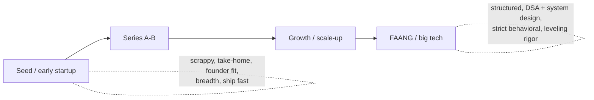

# Product Sense & Startup vs FAANG Interviews

Two strong backend engineers apply the same résumé to a 12-person seed startup and to a
FAANG L5 loop. One optimizes for a clean binary-search solution and a textbook 4-box system
design; the other ships a rough end-to-end prototype over the weekend and can explain *why*
the feature matters to the business. **Both can be right — for different companies.** The
biggest, most avoidable mistake senior candidates make is running the *same* playbook against
every company type. This topic teaches how product/startup loops differ from FAANG loops,
what "product sense" means for a backend engineer, and how to re-tune your prep, stories, and
reverse questions to the company you're actually interviewing at.

> [!KEY-TAKEAWAY]
> FAANG loops optimize for **calibrated, level-accurate signal at scale** (structured DSA +
> system design + strict behavioral/values, rigorous leveling). Startup loops optimize for
> **"can this person build the thing and own it with little direction"** (practical/take-home
> bias, full-stack breadth, product sense, mission fit). Same engineer, different emphasis:
> read the company type first, then choose your playbook.

> [!INTERVIEW]
> The *technical system-design method itself* (how to drive a whiteboard, back-of-envelope
> capacity math) lives in `system-design/interview-method-scenario-playbooks` and
> `interview-craft/estimation-and-napkin-math`. This topic owns the *strategic* layer: which
> rounds a company runs, what they weight, and how to signal product judgment. For comp/equity
> mechanics and reverse questions see `interview-craft/leveling-negotiation-and-reverse-questions`.

---

## Why company type reshapes the entire interview

A hiring loop is a *risk-reduction machine* calibrated to the company's biggest hiring risk.
Those risks differ, so the loops differ.

- **FAANG's risk** is a bad hire polluting a huge, long-lived org: a mis-levelled engineer
  costs promo/comp fairness, and a low performer is hard to manage out. So FAANG invests in
  **structure and calibration** — standardized rubrics, multiple independent interviewers, a
  Bar Raiser (Amazon) or hiring committee that never met you, to make the decision *repeatable
  and defensible*, not just "the manager liked them."
- **A startup's risk** is hiring someone who can't ship in ambiguity, needs hand-holding, or
  bloats a tiny runway. So startup loops probe **breadth, autonomy, and raw building ability**
  — often a take-home or pairing session, plus heavy founder/culture-fit conversation.

The practical consequence: **the same answer earns different scores.** "I formed a working
group and aligned three teams over a quarter" is a strong Staff signal at FAANG; at a 10-person
startup it can read as *process-heavy and slow*. "I shipped it over the weekend and iterated in
prod" is gold at a startup and a yellow flag ("did you get review? test coverage?") at FAANG.

> [!TIP]
> Before any loop, answer three questions: (1) How many engineers? (2) What stage/funding?
> (3) What does this specific role own? These predict 80% of what the loop will weight. Ask
> your recruiter for the loop structure explicitly — it's a normal, expected question.

### The spectrum, not a binary

"Startup vs FAANG" is a spectrum. A Series-C 300-person scale-up runs a hybrid: more structure
than a seed startup, more scrappiness than Amazon. Growth-stage companies (post-PMF, scaling)
increasingly *copy* FAANG loops to scale hiring. Read the specific company, not the stereotype.

---

## Anatomy of a FAANG loop

FAANG (and FAANG-like big tech) loops are **standardized and heavily calibrated**. Know the
shape so you prep the right muscles.

- **Recruiter screen** → **technical phone screen** (usually 1–2 coding problems) → **onsite
  loop** of 4–6 rounds.
- Onsite typically contains: **2 coding/DSA** rounds (data structures, algorithms, clean code
  under time), **1–2 system design** (for senior+), **1–2 behavioral** (values/leadership),
  and often a **hiring-manager** round.
- **Amazon specifically:** every round is mapped to **Leadership Principles** (16 LPs as of
  2021, after the two additions "Strive to be Earth's Best Employer" and "Success and Scale
  Bring Broad Responsibility"), and the loop includes a **Bar Raiser** — a trained interviewer
  from *outside* the hiring team with veto power, whose job is to keep the hiring bar
  consistent across the company and guard against a manager lowering the bar to fill a seat.
- **Leveling rigor:** the debrief maps your evidence to a specific level (L4/L5/L6…). Scope
  claims are scrutinized. See `interview-craft/seniority-ladder-and-scope-signals`.

What FAANG weights: **algorithmic problem-solving, scalable system design, structured
communication, and evidence-backed behavioral stories** mapped to competencies/values.

> [!WARNING]
> At FAANG the coding bar is real even for senior+ roles — "I don't really do LeetCode, I do
> architecture" is a fast way to fail the coding rounds. Seniority *adds* system design and
> behavioral rounds; it rarely *removes* the coding bar.

---

## Anatomy of a startup / product-company loop

Startup loops trade standardization for **signal on building ability and fit**. Common shape:

- **Founder / hiring-manager call** early (often first) — mission, motivation, what you've
  built.
- **A take-home project** *or* a **pairing / practical build** session (real-ish task in the
  codebase or a small system), instead of (or alongside) abstract DSA.
- A **system/architecture discussion** grounded in *their actual product*, not a generic
  "design Twitter."
- **Culture / values fit** with founders and early team — often the deciding round.
- Frequently **fewer, higher-signal rounds**; decisions move fast and the founder's gut carries
  weight.

What startups weight: **can you build the thing end-to-end, own it with little direction,
operate in ambiguity, wear multiple hats (some frontend/infra/ops), and do you believe in the
mission.** Scrappiness and shipping velocity beat algorithmic elegance.

> [!TIP]
> At a startup, demonstrate *breadth with a spine*: "I'm strongest in backend/distributed
> systems, but I've shipped React front-ends and owned the deploy pipeline when no one else
> would." That signals the full-stack, ownership-heavy profile early teams need — without
> pretending to be an expert at everything.

### FAANG vs startup at a glance

| Dimension | FAANG / big tech | Startup / early product |
|---|---|---|
| **Loop structure** | Standardized, 4–6 rounds, calibrated | Fewer rounds, founder-driven, variable |
| **Coding round** | Timed DSA / algorithms | Take-home or pairing on realistic task |
| **System design** | Generic, scale-focused | Grounded in their product & constraints |
| **Behavioral** | Values/LPs, strict rubric, Bar Raiser | Mission fit, "what have you built," founder gut |
| **Top signal** | Level-accurate scope + calibrated skill | Scrappiness, ownership, breadth, product sense |
| **Specialization** | High (you own one system deeply) | Low (wear many hats) |
| **Decision speed** | Slow, committee-based | Fast, founder-weighted |
| **What kills you** | Weak coding / mis-levelled scope | Needs hand-holding, no product curiosity, no mission fit |

---

## Product sense for backend engineers

**Product sense** is the ability to reason about *why* you're building something — the user,
the business, the metric it moves — and to let that reasoning shape technical decisions. It is
no longer a PM-only skill; senior/staff backend engineers are increasingly expected to have it,
because the best technical trade-offs depend on product context.

For a backend engineer, product sense shows up as:

- **Knowing who the user is and what they're trying to accomplish** — even for an internal
  API, the "user" is the calling team and their latency/reliability needs.
- **Understanding why a feature matters** — what business metric or user pain it addresses, so
  you can push back on low-value work and prioritize the high-value path.
- **Proposing product-aware technical trade-offs** — "We could do the fully consistent version
  in six weeks, or an eventually-consistent MVP in one week that covers the 90% case; given
  we're pre-PMF and need to learn fast, I'd ship the MVP and instrument it."
- **Speaking in outcomes, not output** — "cut checkout p99 from 1.2s to 300ms, which lifted
  conversion ~3%," not "I rewrote the service in Go."

> [!KEY-TAKEAWAY]
> The product-sense tell interviewers listen for is whether you connect a **technical choice**
> to a **user or business outcome**. "I added a cache" is output. "Product analytics showed
> 70% of reads hit the same 50 items, so I added a cache and cut p99 by 4x, which unblocked the
> mobile launch" is product sense.

### A quick product-sense framework: User → Value → Metric → Trade-off

When asked "why would you build X" or "how would you approach feature Y":

1. **User** — who is this for and what's their job-to-be-done?
2. **Value** — what pain does it remove / what business goal does it serve?
3. **Metric** — how will we *know* it worked? (name a metric)
4. **Trade-off** — what's the cheapest thing that tests the hypothesis (MVP), and what did we
   consciously defer?

> [!WARNING]
> The failure mode is **"a spec came in and I built it,"** with zero curiosity about why.
> Interviewers read that as an order-taker, not an owner — a Senior-negative signal everywhere,
> and disqualifying at a startup where engineers help *decide* what to build.

---

## MVP thinking and product-aware technical trade-offs

MVP (minimum viable product) thinking is the discipline of building the **smallest thing that
tests the riskiest assumption** and lets you learn, rather than the "complete" system. It's the
technical expression of product sense and it's *especially* prized at startups (limited
runway, need to learn fast) but valued everywhere.

Good MVP reasoning in an interview:

- **Name the riskiest assumption / core hypothesis** the feature is testing.
- **Scope to the 80–90% case**; explicitly defer the long tail ("I'd skip multi-region and
  admin tooling for v1").
- **Choose boring, fast-to-build tech** over the scalable-but-slow-to-build option when you're
  pre-PMF — a Postgres table beats a bespoke event-sourcing system for v1.
- **Instrument from day one** so the MVP actually produces the learning it's meant to.
- **State the migration path** — how the MVP evolves if the bet pays off, so you're not
  cornered as reckless.

> [!TIP]
> Pair scrappiness with judgment so you don't read as cowboy: "For v1 I'd ship the
> single-region eventually-consistent version to learn fast — *and* I'd put a feature flag and
> metrics around it, and I know the clean upgrade is to move to X once we see traction." That's
> the startup-grade answer: fast **and** responsible.

### MVP vs gold-plating (worked contrast)

> **Prompt:** "We want in-app notifications. How do you build it?"
>
> **Weak (gold-plating):** "I'd build a notification *platform* — pluggable channels, a rules
> engine, per-user preference center, Kafka fan-out, multi-region." *(Months of work to test an
> unproven feature; classic résumé-driven over-engineering.)*
>
> **Strong (MVP thinking):** "First, what are we trying to learn — do users even engage with
> notifications? For v1 I'd write rows to a `notifications` table, poll on the client, and log
> open-rate. One week, single channel. If open-rate clears our bar, *then* I'd invest in
> real-time delivery and a preference center — and I'd design the v1 table so that migration is
> clean." *(Tests the hypothesis cheaply, instruments it, shows the upgrade path.)*

---

## Metrics & experimentation basics

You don't need to be a data scientist, but senior+ engineers — especially at product companies
— are expected to speak the language of metrics and experiments, because that's how the
business decides whether your work worked.

Core vocabulary to wield fluently:

- **North-star metric** — the one number that best captures the product delivering value (e.g.
  weekly active teams, nights booked, messages sent). Tie your work to it when you can.
- **Leading vs lagging** — leading indicators (signups, activation) move first; lagging
  (revenue, retention) confirm later. MVPs usually optimize a leading metric.
- **Guardrail metrics** — the things you must *not* break while improving the target (latency,
  error rate, unsubscribe rate). Naming a guardrail signals maturity.
- **A/B test / experiment** — ship to a random subset, compare against control, check for
  **statistical significance** before rolling out; watch for **novelty effects** and adequate
  sample size.
- **Funnel / conversion** — where users drop off in a multi-step flow; backend latency and
  errors often live at a drop-off step.

> [!INTERVIEW]
> A backend-flavored product question: "How would you measure whether your caching change was
> worth it?" Strong answer names a **primary metric** (p99 latency, or conversion if latency
> gates it), a **guardrail** (cache staleness / correctness, error rate), and a **method**
> (compare pre/post or A/B by cohort, check significance). That's product-and-data literacy in
> one breath.

---

## Signals startups screen for (and how to show them)

Beyond raw skill, early-stage companies screen for a *profile*. Know the signals and give
concrete evidence for each.

| Signal | What it means | How to demonstrate it |
|---|---|---|
| **Ownership / autonomy** | Drives things to done without being told how | Stories where you found the problem, not just executed a ticket |
| **Scrappiness** | Ships pragmatically with limited resources | "No time/budget for X, so I did Y and it was enough" |
| **Full-stack breadth** | Comfortable outside your core lane | Examples of touching FE, infra, on-call, data |
| **Comfort with ambiguity** | Makes progress without a spec | "The requirements were one sentence, so I…" (see `handling-ambiguity`) |
| **Product curiosity** | Cares *why*, proposes ideas | Times you changed *what* got built, not just how |
| **Bias to ship** | Iterates in prod, learns fast | "Shipped v1 in a week behind a flag, iterated from real usage" |
| **Mission fit** | Genuinely wants *this* problem | Specific, researched reasons for this company |

> [!WARNING]
> At a startup, "impact visible / less specialization" cuts both ways. There's no big-company
> scaffolding to hide behind, so **individual impact is highly visible** — but you also can't
> say "that's another team's job." An answer that leans on specialization ("I'd hand that to the
> platform team") can read as big-company baggage at a 15-person company.

---

## The take-home / pairing / practical bias at startups

Startups lean on **take-homes** and **pairing sessions** because they predict "can you build
our thing" far better than an abstract DSA problem. Treat these as *the* round, not a chore.

How to approach a **take-home**:

- **Read the rubric and time-box** — if they say "~4 hours," a 20-hour submission signals poor
  prioritization (and unfairly pressures other candidates). Ship the core well; list what you'd
  do with more time in the README.
- **Prioritize working end-to-end** over one perfect layer — a running app with a rough edge
  beats a beautiful half.
- **Show judgment in the README** — state assumptions, trade-offs, what you deferred and why,
  how you'd productionize. This is where product/senior signal lives.
- **Include tests for the risky parts**, clear setup instructions, and clean commits. It's a
  proxy for how you'd work on their team.

How to approach a **pairing / practical session**:

- **Think out loud** and *collaborate* — they're evaluating what it's like to work with you,
  not just whether you're right.
- **Ask clarifying questions**, state assumptions, and use their feedback (rigidly ignoring a
  hint reads as un-coachable).
- It's OK to look things up — startups value knowing *how* to find answers over memorization.

> [!TIP]
> For the code-round *approach & communication* mechanics (how to narrate, handle hints, manage
> a take-home scope) see `interview-craft/take-home-pairing-and-code-review-rounds` and, for the
> coding skills themselves, `dsa-coding` / `lld-and-ood`. Here the point is strategic: at a
> startup the practical round is usually **weighted most**, so invest there.

---

## "Why our startup?" and mission fit

At FAANG, "why Google" can be a lightweight question — the brand sells itself and loops are
skill-calibrated. At a startup, **"why *us*?" is often decisive.** Founders are betting the
company on early hires and want people who'll stay through hard months; genuine mission fit
predicts retention and grit.

A strong "why this startup" has three ingredients:

1. **Specific product/market insight** — you researched them: "You're going after X segment
   that incumbents underserve because Y."
2. **Personal resonance** — a real reason this problem matters to you (used the product, lived
   the pain, care about the domain).
3. **Stage/role fit** — why *this stage* suits you: "I want the breadth and ownership of an
   early team, and I've deliberately chosen scope over big-company polish."

> [!WARNING]
> Generic answers ("I want to work at a fast-paced startup / I like impact / I'm passionate
> about tech") are the classic red flag — they'd apply to any of 10,000 companies. Founders
> hear the emptiness instantly. Name *this* company's specific bet.

### Weak vs strong "why us"

> **Weak:** "I'm really excited about startups and want more ownership and impact than I get at
> big companies." *(True of every startup; says nothing about them.)*
>
> **Strong:** "I've been on-call for a payments system, so your pitch — making reconciliation
> painless for SMB finance teams — is a problem I've felt. You're attacking the mid-market that
> Stripe treats as an afterthought, and at Series A I'd own a whole domain instead of a slice.
> That's exactly the scope and problem I want." *(Specific bet + personal resonance + stage fit.)*

---

## Founder / early-team interviews

Early on you'll often talk directly with a **founder or founding engineer**, and the round
feels different from a FAANG panel. They're probing for a co-owner, not an employee.

What founders are really evaluating:

- **Do I want to be in the trenches with this person at 2am during an outage?** (trust,
  temperament, low ego)
- **Will they own outcomes, or wait to be told what to do?** (autonomy)
- **Do they get the business, not just the code?** (product/commercial sense)
- **Are they genuinely bought into the mission, or shopping for any job?** (retention risk)
- **Can they operate with almost no process or safety net?** (scrappiness)

How to show up well: **match their urgency and directness**, bring *ideas* about the product
(not just questions), show you've used/researched the product, and be honest about what you
don't know — founders trust candor over polish. Ask sharp questions about runway, the biggest
technical risk, and what the first 90 days need (see reverse questions below).

> [!TIP]
> Founders remember candidates who make them think. Coming in with one concrete, informed
> observation about their product ("your onboarding drops users at the API-key step — is that a
> known funnel leak?") signals product sense and genuine interest more than any rehearsed
> answer.

---

## Tailoring your prep, stories, and reverse questions

Same résumé, different framing. Re-tune three things per company type.

**Prep allocation:**

| If interviewing at… | Weight your prep toward… |
|---|---|
| FAANG | DSA fluency, generic scalable system design, values/behavioral stories mapped to competencies/LPs, precise leveling of scope |
| Growth/scale-up | Balanced: real coding, product-grounded system design, ownership stories |
| Early startup | Take-home/practical build quality, breadth stories, product sense, deep "why us," mission fit |

**Stories:** keep a bank of STAR stories (see `behavioral-star-method`), but *re-angle the same
story* per audience. A migration project told to FAANG emphasizes scope, calibration, and
cross-team alignment; told to a startup it emphasizes scrappiness, end-to-end ownership, and
shipping under constraint.

**Reverse questions** (what *you* ask) also signal fit — tune them:

- *To a founder/startup:* "What's the biggest technical risk to the roadmap this year?" ·
  "What does the first 90 days need from this role?" · "How do you decide what to build?" ·
  "What's runway and the path to the next milestone?"
- *To a FAANG panel/HM:* "How is scope defined at this level here?" · "What does the promo path
  look like?" · "How does this team make technical decisions and resolve disagreement?"

> [!INTERVIEW]
> Reverse questions are a two-way evaluation *and* a signal. Startup-appropriate questions
> (risk, runway, first-90-days ownership) show you think like an owner; asking a seed founder
> only about promo ladders and comp bands can signal a poor stage fit.

---

## Equity vs comp differences (brief)

Compensation *shape* differs sharply and shapes how you evaluate an offer — but the mechanics
belong to the negotiation topic; this is just enough to interview intelligently.

- **FAANG:** high, liquid, predictable — base + **RSUs** (real, sellable stock) + bonus, with
  published-ish leveling bands. Lower variance, lower upside.
- **Startup:** lower cash, higher-*variance* upside via **stock options** (often ISOs) —
  meaningful only with an understood **strike price, vesting (typically 4-year with a 1-year
  cliff), % of company, latest preferred-share price, and dilution**. Most options end up worth
  little; a few pay off enormously.

> [!WARNING]
> "Equity" is not free money. A number of shares means nothing without **% of fully-diluted
> shares, strike price, preference stack, and the company's odds**. Evaluating a startup offer
> on option *count* alone is the classic mistake.

> [!TIP]
> Full mechanics — negotiating, comparing offers, RSU vs option math, reverse-question scripts
> for comp — live in `interview-craft/leveling-negotiation-and-reverse-questions`. Cross-link,
> don't re-derive.

---

## Common failure modes interviewers penalize

- **One playbook for all companies** — grinding LeetCode for a startup take-home, or winging
  the coding round at FAANG because "I'm senior."
- **Order-taker syndrome** — "the spec said X so I built X," with no curiosity about *why*.
- **Gold-plating / résumé-driven design** — proposing a distributed platform to test an
  unproven feature; the opposite of MVP thinking.
- **Output not outcomes** — describing what you *built* with no user/business metric attached.
- **Generic "why us"** — passion for "startups" or "impact" with nothing company-specific.
- **Big-company baggage at a startup** — "that's another team's job," process-heavy answers,
  needing a spec to start.
- **Cowboy with no judgment** — "ship to prod, no tests, no flags" — scrappy *without* the
  responsibility half.
- **Evaluating a startup offer on option count** — ignoring %, strike, and dilution.

---

## Common follow-up questions

- "You've only worked at big companies — why do you think you'll thrive at a 20-person
  startup?"
- "Tell me about a time you shipped something scrappy under a tight deadline. What did you cut,
  and how did you decide?"
- "A PM hands you a one-line feature request. Walk me through how you'd approach it."
- "How would you measure whether a feature you built was actually successful?"
- "Why do you want to join *us* specifically, and not [bigger competitor / any startup]?"
- "How do you decide between shipping a quick MVP and building it properly the first time?"
- "Give an example of when you pushed back on *what* was being built, not just how."
- "You're the third engineer. There's no PM, no designer, one-line specs. How do you operate?"
- "How do you think about the trade-off between our lower cash + equity and a FAANG offer?"
- "What questions do you have for me?" (your reverse questions — tuned to stage).

## References

- Will Larson, *Staff Engineer: Leadership Beyond the Management Track* & StaffEng.com —
  archetypes (Tech Lead, Architect, Solver, Right Hand) and scope framing.
- Amazon Leadership Principles (16 as of 2021) and the Bar Raiser program — amazon.jobs
  leadership-principles; Amazon Bar Raiser overview.
- levels.fyi — leveling and comp (RSU vs option) reference across companies.
- Gayle Laakmann McDowell, *Cracking the Coding Interview* / *Cracking the PM Interview* —
  behavioral and product-sense sections; startup vs big-company interview differences.
- Y Combinator library / *The Founder's Guide to Hiring* and startup-hiring essays — what early
  teams screen for (ownership, mission fit, breadth).
- Marty Cagan, *Inspired* — product sense, MVP thinking, north-star and outcome-over-output.
- "Latency numbers every engineer should know" (Jeff Dean / Peter Norvig) — see
  `interview-craft/estimation-and-napkin-math`.
- First Round Review & a16z essays on startup hiring loops, take-home best practices, and
  founder interviews.
