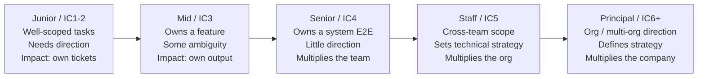
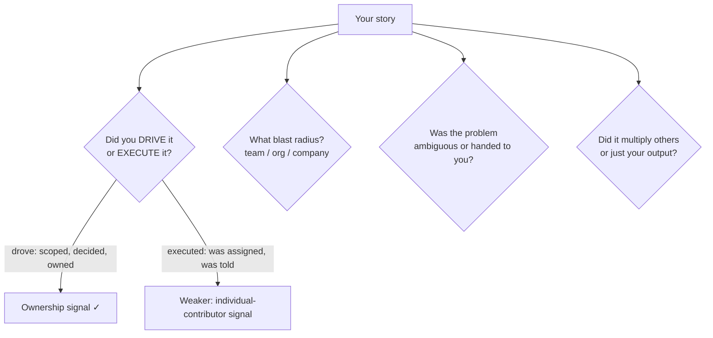
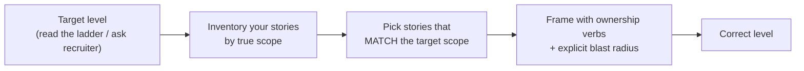

# The Seniority Ladder & Scope Signals

Two candidates describe the *same* project — "I built the notification service." One gets
leveled Senior, the other Staff. The difference is not the work; it's the **scope, autonomy,
and impact** each one demonstrably owned, and how precisely their story matched the target
level. This topic teaches the axis that engineering ladders actually measure, how to read the
level you're being interviewed for, and how to calibrate your stories so you neither
under-sell (stories too small) nor over-reach (claiming scope you didn't own).

> [!KEY-TAKEAWAY]
> The promotion/leveling axis is **scope × autonomy × impact**, not years of tenure or raw
> coding skill. Senior = owns a system/project end-to-end with little direction and multiplies
> a team. Staff+ = influence and impact beyond your own team (org-level technical strategy).
> In interviews you are leveled on the *scope your stories prove you owned* — so match the
> story to the level.

> [!INTERVIEW]
> The *technical* system-design interview method (driving a whiteboard, back-of-envelope math)
> lives in `system-design/interview-method-scenario-playbooks`. This topic owns the
> **behavioral/career** signal: how to describe scope so you get leveled correctly. When a
> panel debriefs, the leveling conversation is literally "what scope did the stories prove?"

---

## The real axis: scope, autonomy, and impact (not years)

The single most common misconception is that seniority is a function of **time served** or
**coding ability**. It is not. Every published engineering ladder (Dropbox, CircleCI, GitLab,
Rent the Runway) and every leveling rubric (levels.fyi) measures the same three things:

- **Scope** — how big is the surface you're responsible for? A component → a system → a
  team's roadmap → an org's technical direction → the company/industry.
- **Autonomy** — how much direction do you need? "Given a well-scoped task" → "given a fuzzy
  goal" → "you *find* the problem worth solving and define the goal yourself."
- **Impact** — does your work move a metric the business cares about, and does it **multiply
  other engineers** or just produce your own output?

Coding skill is table stakes — necessary but not the differentiator above Senior. A staff
engineer who writes less code than a strong senior can still be more senior, because their
*leverage* (the decisions, standards, and unblocking they provide) raises the output of many
teams. levels.fyi frames the progression as **individual → team → immediate team → org →
company/industry** impact.

> [!WARNING]
> "I've been coding for 12 years" is not a seniority signal — it's a tenure signal. Ladders
> explicitly separate the two: a 12-year engineer stuck at team-scope work is a strong Senior,
> not a Staff. Lead with scope and impact, never with years.

### The three axes at a glance

| Axis | Mid | Senior | Staff+ |
|---|---|---|---|
| **Scope** | A feature/component | A system or project, end-to-end | Cross-team / org technical direction |
| **Autonomy** | Given well-scoped tasks | Given fuzzy goals, self-directs | Finds the problem worth solving |
| **Impact** | Own output | Multiplies own team | Multiplies multiple teams / the org |

---

## The ladder walk: junior → mid → senior → staff → principal

The named rungs vary by company, but the *shape* is remarkably consistent. What changes at
each step is a widening of scope and a shrinking need for direction.

The **IC numbers below are illustrative, not universal** — companies number differently.
Dropbox, for example, names no "Senior" title at all (IC1–IC4 are all just "Software
Engineer"; named titles start at Staff/IC5), yet its **IC3** rung describes the
senior-equivalent bar (ambiguous problems, multi-component systems). Google's L5 and Meta's
E5 are the senior-equivalent. **Anchor on the scope description, not the number.**

- **Junior (IC1–2):** executes well-defined tasks with guidance and review. Learning the
  codebase and the craft.
- **Mid (IC3 at many companies):** owns a feature or component, handles moderate ambiguity,
  needs less hand-holding. Impact is primarily their own delivery.
- **Senior (IC4):** the **"career level"** where most engineers land and stay. Owns a system or
  project end-to-end, handles open-ended problems independently, and starts *multiplying* the
  team through mentorship, reviews, and setting local technical direction.
- **Staff (IC5):** impact and influence extend **beyond their own team**. Drives technical
  strategy across teams, tackles the ambiguous problems nobody owns, and is a force multiplier
  for the org. Typically <10% of engineers.
- **Principal (IC6+):** sets technical vision for an organization or multiple orgs; reviews
  designs org-wide; impact measured in company (sometimes industry) terms.

> [!TIP]
> The two "career-defining" jumps are **mid → senior** (from "delivers what I'm told" to "owns
> ambiguous outcomes and needs little direction") and **senior → staff** (from "multiplies my
> team" to "impact beyond my team; sets strategy"). Interview leveling almost always hinges on
> which side of one of these lines your stories fall.

---

## What changes at Senior: end-to-end ownership and little direction

Senior is the level most product and startup loops are calibrated around, so it pays to know
its bar precisely. The Dropbox ladder (IC3) captures it well: a senior engineer "independently
identifies the right solutions to solve **ambiguous, open-ended problems**," delivers projects
"spanning a specific product focus or a multi-component system," and drives cross-team
collaboration *for their project*.

The Senior bar in one sentence: **you can be handed a fuzzy goal and reliably return a shipped,
well-reasoned system, needing coordination but not direction — and you make the engineers
around you better while doing it.**

Concrete senior signals interviewers listen for:

- **End-to-end ownership:** you drove design, implementation, rollout, *and* the operational
  aftermath (on-call, metrics, iteration) — not just the code.
- **Handling ambiguity:** the problem arrived under-specified and *you* defined scope, cut
  scope under pressure, and made the call.
- **Multiplier behavior (local):** mentoring, raising the bar in code review, writing the
  design doc others follow, unblocking teammates.
- **Judgment under trade-offs:** you can explain why you chose A over B and when B would win.

**Weak vs strong (same project):**

> **Weak (mid-level signal):** "I was assigned to build the retry logic for the payments
> service. I implemented exponential backoff and my tech lead reviewed it. It worked well."
>
> **Strong (senior signal):** "Payments had a 4% failure rate from transient downstream
> errors and no one owned a fix. I scoped it, decided retries-with-jitter plus an idempotency
> key was the right trade-off over a queue (lower latency, acceptable at our volume), wrote the
> design doc, drove it past a security concern about double-charges, shipped it behind a flag,
> and drove the failure rate to 0.3%. I also paired two juniors through the rollout so they now
> own that path."

The strong version shows: found-the-problem autonomy, a named trade-off, end-to-end ownership
through rollout, a quantified outcome, *and* a multiplier effect.

---

## What changes at Staff+: org-level impact and the multiplier effect

Staff is a **different kind** of job, not just "senior with more experience." Will Larson
frames it as the intersection of *role, behaviors, impact, and the organization's recognition
of all of those.* The defining shift is from **personal output → organizational leverage**:
your value is increasingly the decisions you enable, the standards you set, and the teams you
unblock, not the lines you write. As Larson puts it about the Tech Lead archetype, "the team's
impact grows as the tech lead's coding blocks shrink."

Staff+ signals:

- **Scope beyond your team:** the outcome you drove required aligning multiple teams, or set
  direction other teams now follow.
- **Technical strategy:** you didn't just solve the problem in front of you — you shaped *which
  problems the org should solve* (a migration strategy, a platform bet, a deprecation).
- **Multiplier at org scale:** a framework, a paved road, an architectural standard, or a
  cross-team review process that made *many* teams faster.
- **Ambiguity at the top of the funnel:** you identified a problem nobody had named yet, built
  the case for it, and got buy-in *without* positional authority — i.e., influence.

> [!WARNING]
> A very common miss: a candidate targeting Staff tells a beautifully-executed *Senior* story —
> deep, end-to-end, well-reasoned — but entirely within one team's boundary, with no
> cross-team influence or strategy. It's a great story for the wrong level. The panel levels it
> Senior. Staff stories must cross a team boundary.

---

## Published engineering ladders (Dropbox, CircleCI, GitLab, Rent the Runway)

Several companies open-sourced their ladders; reading them teaches the shared vocabulary
interviewers use in debriefs. They differ in style but agree on the scope-widening axis.

| Ladder | Notable trait | How it frames the axis |
|---|---|---|
| **Dropbox** (dbx-career-framework) | Per-level pages with "impact levers" (project leadership, product expertise, mentorship) | IC3 = independently solves ambiguous problems, delivers multi-component systems; influence local |
| **CircleCI** | Split into *Technology / System / People / Process / Influence* competency tracks | Explicitly separates technical depth from influence/scope so you can't level up on code alone |
| **Rent the Runway** | Famous 2-axis format: a compact grid of levels × competency areas on a single page | Emphasizes that expectations are **cumulative** — each level *adds* to, not replaces, the last |
| **GitLab** | Public handbook; heavy on written communication, async influence, "results" | Rewards documented, cross-functional, remote-first influence — scope shown through writing |

Common threads across all four: (1) a separate **influence/scope** competency distinct from
technical skill, (2) explicit language about **ambiguity** and **autonomy** rising per level,
and (3) the multiplier/mentorship expectation appearing at Senior and dominating at Staff+.

> [!TIP]
> If you're interviewing at a company that publishes its ladder, **read it before the loop**
> and mine it for the exact words they use for your target level ("ambiguous," "cross-team,"
> "technical strategy"). Then make sure your stories literally demonstrate those words.

---

## The scope signals interviewers listen for

In a behavioral debrief, interviewers translate your stories into scope evidence. Four signals
dominate. Learn to hit them on purpose.

1. **Drive vs execute** — did you *scope, decide, and own* the outcome, or were you handed a
   task and completed it? Ownership verbs ("I decided," "I scoped," "I made the call") signal
   drive; passive verbs ("I was assigned," "we were told to") signal execution.
2. **Blast radius** — team-level vs org-level vs company-level impact. Say the boundary out
   loud: "this affected three teams that consume the API."
3. **Ambiguity handled** — was the problem well-defined, or did you have to define it? Higher
   levels *find* and frame the problem.
4. **Multiplier effect** — did your work raise other engineers' output (a tool, a standard,
   mentorship, a paved road) or only produce your own deliverable?

### A scope-signal rubric

| Signal | Under-leveled phrasing | Well-leveled (Senior) | Staff+ phrasing |
|---|---|---|---|
| Drive | "I was asked to…" | "I identified and scoped…" | "I saw the org didn't have… so I built the case for…" |
| Blast radius | "my feature" | "the whole checkout system" | "every team consuming the payments platform" |
| Ambiguity | "the ticket said…" | "the goal was fuzzy, so I…" | "no one had even framed the problem; I did" |
| Multiplier | "I shipped it" | "I mentored two juniors through it" | "the paved road I built cut every team's launch time" |

> [!KEY-TAKEAWAY]
> When you narrate a project, explicitly say **the boundary** ("this touched N teams") and use
> **ownership verbs**. Interviewers can only credit scope you make legible — don't make them
> guess.

---

## Staff+ archetypes as scope lenses (Tech Lead / Architect / Solver / Right Hand)

Will Larson's four Staff archetypes are useful in interviews because they let you *name the
shape* of your impact — panels use them as shorthand. Knowing which one your story fits helps
you frame scope precisely.

| Archetype | Scope shape | Example story frame |
|---|---|---|
| **Tech Lead** | Directs approach/execution of one team or a small cluster; the most common first Staff role | "I set the technical direction for the payments team and coordinated the roadmap while delegating implementation." |
| **Architect** | Owns direction & quality of a critical, enduring technical domain (storage, API, infra) | "I own our data-storage architecture across the company; every team's schema choices route through the standards I set." |
| **Solver** | Trusted specialist who dives into thorny, high-risk problems and stays until resolved | "When search latency was in crisis, I was pulled in, went deep for six weeks, fixed it, and moved on." |
| **Right Hand** | Rarest; extends an executive's reach with borrowed authority across business/tech/people/process (org of hundreds+) | "I acted as the VP's technical right hand across a 300-person org, driving whatever was on fire." |

> [!TIP]
> Pick the archetype your evidence actually supports. A candidate whose real strength is deep
> problem-solving should tell a crisp **Solver** story rather than fake an org-wide
> **Architect** narrative they can't defend under follow-up.

---

## Leveling: matching your stories' scope to the target level

Leveling is the interviewer's judgment of which rung you belong on, formed from the scope your
stories *prove*. You can move that judgment by choosing which stories to tell and how to frame
them — this is legitimate calibration, not exaggeration.

The mechanic: **know the target level, then pick stories whose true scope matches it.** If
you're interviewing for Staff, lead with your most cross-team, strategy-shaping,
multiplier-heavy work — not your most technically clever single-handed hack.

- **Under-leveling (stories too small):** a genuine Staff engineer who only tells tidy,
  well-executed *component-level* stories gets leveled Senior. The work was there; the *framing*
  buried the scope. Fix: choose bigger-scope stories and name the boundary and the influence.
- **Over-reaching (claiming scope you didn't own):** claiming "I led the migration" when you
  implemented one service of it. This collapses under the standard follow-up ("what exactly did
  *you* decide? who else was involved? what was the hardest trade-off *you* made?"). It reads
  as inflation and torpedoes trust — a worse outcome than being accurately leveled one notch
  lower.

> [!WARNING]
> Over-reaching is more dangerous than under-selling. A modest, *true* story survives deep
> follow-up; an inflated one dies on the first "what did *you* personally decide?" and now the
> interviewer discounts your *other* stories too.

---

## Common calibration mistakes: the "senior IC in a mid interview" and scope > tenure

Two recurring pitfalls:

**1. Miscalibrating up or down to the room.** A senior IC dropped into a mid-level-framed
interview sometimes answers with sprawling org-context that never lands a concrete "here's what
*I* did," reading as unfocused. Conversely, a strong mid answering a senior loop with only
task-execution stories reads as not-yet-ready. Match the altitude of your answer to the level
being assessed: enough scope to prove the level, enough concrete personal action to prove it
was *you*.

**2. Leading with tenure.** "I've been here 8 years / I have 15 years of experience" is not
evidence of seniority — ladders decouple scope from time on purpose. Someone can plateau at
Senior for a decade. Replace tenure claims with scope claims: instead of "I'm very senior, I've
done this a long time," say "I've owned our billing platform end-to-end for three years and set
the retry/idempotency standards three other teams now follow." **Scope > tenure**, always.

### Reading and responding to down-leveling signals in the room

If an interviewer keeps probing "but what did *you* specifically do?" or "was this just your
team or wider?", they're testing scope. Respond by *sharpening the personal-ownership and
boundary details*, not by adding more technical depth. If you're offered a level below target,
you can (politely) ask what scope evidence would have supported the higher level — often the
gap is a missing cross-team or strategy story you simply didn't tell.

> [!KEY-TAKEAWAY]
> You are leveled on **demonstrated scope**, not potential or tenure. Prepare a story
> *inventory* tagged by true scope (component / system / cross-team / org), know your target
> level, and deliberately tell the stories that match it — framed with ownership verbs and an
> explicit blast radius.

---

## Common follow-up questions

- "Walk me through the most complex project you've owned end-to-end." *(Probing autonomy +
  scope: listen for did-you-drive-it and the blast radius.)*
- "Tell me about a time you influenced a decision on a team that wasn't yours." *(Direct
  Staff+ scope probe: influence without authority.)*
- "What's the difference between how you'd operate as a Senior vs a Staff engineer here?"
  *(Testing whether you understand the axis — answer with scope/autonomy/multiplier, not code.)*
- "On that migration you led — what exactly did *you* decide, and who else was involved?"
  *(The over-reach detector. Have the honest ownership breakdown ready.)*
- "Give me an example of a problem nobody asked you to solve." *(Top-of-funnel ambiguity;
  strong Staff signal if you found and framed it.)*
- "How have you made the engineers around you better?" *(Multiplier effect — mentorship, tools,
  standards, paved roads.)*
- "Why do you think you're at level X?" *(Answer with scope evidence, never tenure.)*

## References

- Will Larson, *Staff Engineer: Leadership Beyond the Management Track* and StaffEng.com —
  the four archetypes (Tech Lead, Architect, Solver, Right Hand) and "role + behaviors +
  impact + recognition" framing.
- Will Larson, *An Elegant Puzzle: Systems of Engineering Management* — leveling, scope, and
  organizational leverage.
- Dropbox Engineering Career Framework (dbx-career-framework.github.io) — per-level scope and
  "impact levers"; IC3/Senior definition.
- CircleCI Engineering Competency Matrix — competency tracks (Technology, System, People,
  Process, Influence) separating skill from scope.
- Rent the Runway Engineering Ladder — the compact levels × competencies grid; cumulative
  expectations.
- GitLab Engineering handbook / job-family descriptions — async, documented, cross-functional
  influence.
- levels.fyi Software Engineering Level Framework — the scope progression
  individual → team → org → company/industry and level mapping across companies.
- Amazon Leadership Principles (16, incl. "Strive to be Earth's Best Employer" and "Success and
  Scale Bring Broad Responsibility," added 2021) and the Bar Raiser process — leveling and bar
  calibration in practice.
- *Cracking the Coding/PM Interview* (Gayle Laakmann McDowell), behavioral sections — matching
  stories to level and structuring ownership narratives.
