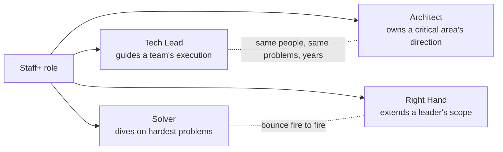
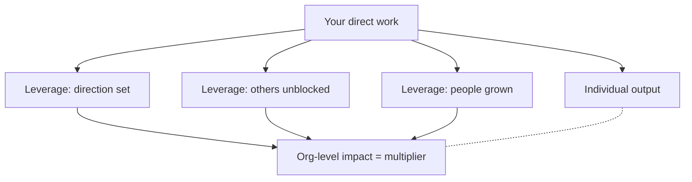
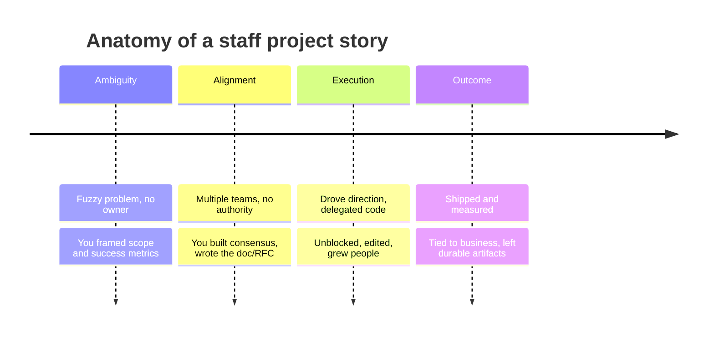

# Staff+ Archetypes & Demonstrating Impact

At Senior (L5/SDE II-III) the interview asks *"can this person deliver hard projects
well?"* At **Staff+ (L6/L7+, Staff / Senior Staff / Principal)** the question flips to
*"does this person make the people and systems around them better?"* — i.e. **are they a
multiplier, not just a strong individual contributor?** The bar is about **leverage,
judgment, and influence at scope**, and interviewers are actively listening for those
signals in every story you tell.

This topic covers **who staff engineers are** (Will Larson's four archetypes), **what
staff-level impact actually looks like** (multiplier work, business framing, glue work,
sponsorship, the staff project), and **how to narrate it** so an interviewer scores you at
the level you're targeting.

> [!KEY-TAKEAWAY]
> Staff+ is not "Senior but better at coding." It is a **change in the unit of impact**:
> from *your output* to *the output of the org around you*. In interviews, the winning move
> is to consistently show **leverage** (you made N other people/teams more effective),
> **judgment** (you made the right call under ambiguity and can explain the trade-offs), and
> **influence without authority** (you moved an org that didn't report to you). Individual
> heroics are table stakes, not the story.

Two boundaries: the **technical** system-design interview method (how to drive a whiteboard
design) lives in `system-design/interview-method-scenario-playbooks` — this topic points
there and does not re-teach it. The mechanics of the seniority ladder and scope signals live
in `seniority-ladder-and-scope-signals`; here we assume you know the ladder and focus on the
**archetypes and impact narration** on top of it.

---

## The four Staff+ archetypes

Will Larson (StaffEng.com, *Staff Engineer*) identifies **four recurring shapes** of the
staff-plus role. They're descriptive, not a rigid taxonomy — most real jobs blend two — but
naming them helps you (a) understand which one a given role wants and (b) tell stories that
match it.

| Archetype | One-line definition | Primary leverage | Typical stories |
|---|---|---|---|
| **Tech Lead** | Guides the approach & execution of *one team or a cluster of teams*, partnering with 1-few managers | Team throughput & direction | "I set the technical vision for X, unblocked the team, and delegated to grow engineers." |
| **Architect** | Owns the *direction, quality, and approach of a critical area* (API, storage, data, infra) | Long-lived technical direction | "I owned our storage strategy across N teams and drove the migration." |
| **Solver** | A trusted agent who *dives deep on the hardest, gnarliest problems* until resolved | Depth on high-risk problems | "Leadership dropped me on the failing payments rewrite; I diagnosed and turned it around." |
| **Right Hand** | *Extends a senior leader's* (director/VP) *capacity*; operates as a senior org leader without managing | Executive leverage | "I ran the org's tech-debt program on behalf of the VP, coordinating 6 teams." |

Larson's own observations worth knowing:

- **Tech Lead is the most common** (roughly one per ~8 engineers) and the most accessible
  entry into Staff — it's the closest to strong Senior work.
- **Architect** tends to emerge in larger orgs with complex, coupled codebases or heavy tech
  debt (~100+ engineers). A *good* architect is embedded and hands-on, **not** an
  ivory-tower "design-and-throw-over-the-wall" figure.
- **Solver** shows up where the *individual* (not the team) is the unit of ownership; they
  do little org politics because leadership has already picked the priority.
- **Right Hand** is the **rarest** and appears only at real scale (hundreds/thousands of
  engineers).
- Two natural pairings: **Tech Lead + Architect** work with the same people on the same
  problems for years (deep team cohesion); **Solver + Right Hand** bounce from fire to fire
  (transactional, tightly aligned to leadership priorities).

> [!INTERVIEW]
> Nobody asks "which archetype are you?" outright. But the same story lands differently
> depending on the role: a **Solver** story (I parachuted in and fixed the crisis alone)
> under-sells you if the team wants a **Tech Lead** (did you *grow* the team, or just do it
> yourself?). Know the archetype the JD implies, and pick stories that show that shape of
> leverage.

---

## Reading which archetype the role wants

Before you pick stories, decode the role. Signals in the JD, recruiter chat, and who
interviews you:

- **"Set technical direction for a team / mentor the team / drive execution"** → **Tech
  Lead**. Bring stories of raising a team's bar, unblocking, and delegating-to-grow.
- **"Own the architecture of <area> / define standards across teams / long-term technical
  strategy"** → **Architect**. Bring migration/platform/API-standard stories that outlived
  your direct involvement.
- **"Tackle our hardest problems / high-ambiguity / no clear owner"** → **Solver**. Bring
  crisis-turnaround and deep-diagnosis stories.
- **"Partner with the VP/director / cross-org program / represent engineering"** → **Right
  Hand**. Bring stories of executing a leader's agenda across many teams.

> [!TIP]
> When unsure, **ask**: *"What does success look like for this role in the first year — is
> it more about guiding a specific team, owning a technical area across teams, or
> parachuting into whatever's hardest?"* This is a strong reverse-question (it shows you
> think in scope/leverage terms) **and** it tells you which stories to lead with.

A common mistake: telling a **pure Solver** story (lone genius) when the org wants a
multiplier. If your best material is a solo deep-dive, **add the leverage layer** — what
docs/runbooks/patterns you left behind, who you taught, what you standardized so it never
recurs.

---

## Multiplier impact: leverage over individual output

The defining staff signal is **leverage**: your impact = (your work) + (the increased output
of everyone you affected). Andy Grove's framing (*High Output Management*) and Larson's
"work on what matters" both land here. Interviewers score you on the **multiplier**, so make
it explicit.

Sources of leverage to name in stories:

- **Setting technical direction** — a design/standard/pattern many teams adopt.
- **Unblocking others** — removing a blocker that was stalling N engineers/teams.
- **Mentoring & sponsorship** — leveling up engineers so *they* deliver more (see below).
- **Editing** — small, high-privilege interventions: a review comment, a re-scope, a 15-min
  conversation that changes a project's trajectory (Larson's "edit").
- **Finishing things** — coaching a stalled project to done ("a six-month slog into a
  two-week sprint").
- **Org-wide standards & tooling** — a linter, framework, or paved road that raises the
  floor for everyone.

**Weak vs strong (same underlying work):**

> [!WARNING]
> **Weak (individual output):** *"I rewrote the payments service and cut latency 40%."*
> Great Senior answer. It's *your* output only.

> [!TIP]
> **Strong (multiplier):** *"Payments latency was blocking three product teams from shipping
> checkout features. I rewrote the hot path — 40% latency cut — but the lasting win was the
> **async pattern and load-test harness I documented**, which two other teams adopted, and I
> paired with their leads so they could apply it without me. Checkout feature velocity
> roughly doubled the next quarter."*

The strong version names the **beneficiaries** (three teams), the **durable artifact**
(pattern + harness), the **teaching** (paired with leads), and the **business outcome**
(feature velocity). That's the multiplier made legible.

---

## Glue work and the invisible-impact trap

**Glue work** (Tanya Reilly's term) is the unglamorous coordination that holds a project
together: writing the design doc, running the meeting that unblocks two teams, keeping the
launch checklist, noticing the gap nobody owns, onboarding new folks. It is **essential
staff-level leverage** — *and* it is the work most likely to be **invisible** in a
performance review or interview if you don't narrate it deliberately.

The trap has two sides:

1. **Doing too much glue at the wrong level.** For a promo-track engineer, endless glue can
   *stall* you if it crowds out visible technical leadership — Reilly's caution is that glue
   work is critical but often uncredited, so make sure it's *recognized* and that you're not
   the only one doing it. Larson's version: do "as little [unsupported new-value work] as you
   can, but no less."
2. **Failing to narrate it.** In interviews, glue work sounds like nothing (*"I kept things
   organized"*) unless you tie it to the **outcome it enabled** and the **judgment it
   required** (you saw the gap others missed; you chose what to coordinate).

> [!INTERVIEW]
> How to narrate glue work as a strength: name the **gap you spotted** ("no one owned
> cross-team API compatibility for the launch"), the **leverage** ("I created the
> compatibility matrix and ran a weekly 20-min sync"), and the **outcome** ("we shipped on
> time with zero breaking-change incidents; the matrix is now standard for launches").
> That's not "organizing" — that's *seeing and closing an org-level risk*.

Avoid the opposite failure: bragging about glue work that should have been **automated or
delegated**. Staff judgment includes knowing when to build a system (a bot, a template, a
process) instead of being the human glue forever.

---

## Business-impact framing: tie tech to dollars, users, risk

Staff+ engineers are trusted to make **business-aware** technical calls. In interviews,
translate every technical outcome into the language leadership cares about: **revenue/cost
(\$), users/experience, risk, and speed (team velocity / time-to-market)**. This is the
single biggest differentiator between a Senior and a Staff answer.

The framing move: `<technical thing> → <business quantity>`.

| Technical outcome | Business framing |
|---|---|
| Cut p99 latency 300ms → 90ms | "Checkout conversion rose ~2%, ≈ \$Xm annualized revenue" |
| Reduced instance count 40% | "Saved ≈ \$40k/month infra spend, ~\$500k/yr" |
| Added idempotency + retries | "Eliminated duplicate charges — the top driver of refunds & support tickets" |
| Migrated to a paved-road platform | "Cut new-service setup from 2 weeks to 1 day across ~30 teams" |
| Fixed the flaky deploy pipeline | "Restored daily deploys; unblocked ~50 engineers from a 3-day release cycle" |

> [!TIP]
> If you don't have the exact number, **estimate defensibly and say so**: *"I don't have the
> precise figure, but at ~2M daily checkouts a 2% conversion lift is on the order of tens of
> millions in annual GMV — that's the scale of why it mattered."* Showing you *think* in
> business terms beats a false-precision number. (Estimation technique lives in
> `estimation-and-napkin-math`.)

Failure mode interviewers penalize: **staying in pure tech-speak** ("I refactored the
service using the strangler pattern") with no line to *why the business cared*. At staff
level that reads as "strong engineer who needs a manager to connect them to impact" — a
downlevel signal.

---

## Leading without authority

At Staff+ you routinely need teams that **don't report to you** to change what they're
doing. You have no org power to compel them, so you lead through **influence**: credibility,
alignment to shared goals, data, and trust. This is the skill hiring managers probe hardest,
because it's what separates a "senior IC" from an "org multiplier."

Techniques to demonstrate (and to use in STAR stories):

- **Lead with the shared goal, not your solution.** Frame the problem in terms of *their*
  objectives, so adopting your approach helps them hit *their* goals.
- **Bring data and prototypes, not opinions.** A working spike or a benchmark moves skeptics
  faster than an argument. "Strong opinions, loosely held" — and change your mind publicly
  when the data says so (this *builds* credibility).
- **Do the pre-work / one-on-ones before the big meeting.** Build consensus in private so
  the meeting ratifies rather than debates ("nemawashi").
- **Write it down.** A design doc / RFC turns your influence into a durable, reviewable
  artifact others can align to (see `design-docs-rfcs-and-adrs`).
- **Give credit generously; make it their win.** Influence compounds when others succeed
  under your direction.
- **Escalate as a last resort, well.** Knowing *when* to pull in a manager/VP — with options
  and a recommendation, not just a complaint — is itself a staff signal.

> [!WARNING]
> Distractor answers that signal *low* seniority: "I escalated to my manager to force them"
> (used authority you don't have, first resort), "I just built it myself and showed them"
> (didn't actually get buy-in — may create a fork/shadow system), or "I kept pushing until
> they agreed" (wore them down ≠ aligned them). The strong answer aligns on the goal, brings
> evidence, and gets *genuine* buy-in.

**Sample STAR (leading without authority):**
> **S/T:** Two teams owned duplicate, drifting auth logic; a third was about to build a
> third copy. No one owned consolidation and I had no authority over any of them.
> **A:** I wrote a one-page problem statement framed around *their* pain (each team's on-call
> burden from auth bugs), built a small prototype of a shared library, and did 1:1s with each
> tech lead before proposing it in the architecture forum. I let the teams co-own the
> interface so it was *theirs*, not mine.
> **R:** All three adopted the shared library within a quarter; auth-related pages dropped
> ~60%; it became the default for new services. I never had to escalate.

---

## Sponsorship vs mentorship

Both grow people (a core staff leverage source), but interviewers reward understanding the
**difference** — sponsorship is the higher-scope, higher-leverage act.

| | **Mentorship** | **Sponsorship** |
|---|---|---|
| What | *Advising* — you share knowledge/feedback | *Advocating* — you spend your capital to create opportunities |
| Direction | You talk *to* the person | You talk *about* the person (to those who decide) |
| Example | "Here's how I'd approach that design" | "I put her name forward to lead the migration / for promo" |
| Risk you take | Low (your time) | Real (your reputation is on the line) |
| Scope signal | Senior+ | Staff+ (you have capital *and* spend it on others) |

> [!KEY-TAKEAWAY]
> "Mentors talk *to* you; sponsors talk *about* you when you're not in the room." At staff
> level, the stronger story is **sponsorship**: you used your credibility to hand someone a
> stretch opportunity, publicly backed them, or got them the promotion/visibility — and it
> paid off. That shows you have organizational capital *and* choose to spend it multiplying
> others.

Failure mode: framing all people-growth as "I mentored juniors." It's good, but if *every*
story is 1:1 advice, you look Senior. Add at least one **sponsorship** and one
**direction-setting** story to hit the staff bar.

---

## The staff project: driving a big ambiguous cross-team effort

Almost every staff+ loop probes for a **staff project**: a large, *ambiguous*,
*cross-team/cross-org* effort **you drove** — not one your manager scoped and handed you.
This is the single most important story to have polished; it's where archetype, leverage,
business framing, and leading-without-authority all show up at once.

What makes a project "staff-sized" (the signals to hit):

- **Ambiguity you resolved** — the problem was fuzzy; *you* defined scope, success metrics,
  and approach (ties to `handling-ambiguity`).
- **Cross-team blast radius** — it required aligning multiple teams you didn't own.
- **You drove it** — you owned the direction and the outcome, not just a slice of code.
- **Real trade-offs** — you can articulate what you *didn't* do and why (ties to
  `tradeoff-articulation-and-judgment`).
- **Durable, measurable outcome** — it changed the trajectory of a system/team/business, and
  you can quantify it.

> [!INTERVIEW]
> Prepare **one** staff project to depth-3: you should survive "why did you choose X over Y?"
> three follow-ups deep on the trade-offs, the org dynamics, *and* what you'd do differently.
> Interviewers dig until they find the edge of your ownership — if you scoped it, you can go
> deep; if your manager really drove it, the depth-probe exposes it fast.

**Common failure:** claiming a project that was actually **driven by someone else**. If you
say "we migrated to microservices" and can't answer "who decided the service boundaries and
why," you get downleveled. Only claim projects where **you can defend the judgment calls.**

---

## Measuring and narrating impact

Staff impact must be **measured and narrated** — "trust me, it was big" doesn't score. Pick
metrics that map to the leverage you claim, and always give a **baseline → after → over what
population** structure.

Metric families and when to use them:

- **Business:** revenue, GMV, conversion, cost saved, churn, risk/incidents avoided. (Use
  when you can connect tech to \$ / users.)
- **Velocity / leverage:** teams unblocked, deploy frequency, lead time, onboarding time,
  # of teams adopting your thing. (Use for multiplier claims.)
- **Reliability:** SLO/error-budget, p99 latency, incident count/MTTR. (Use for platform/infra.)
- **People:** engineers mentored who were promoted, sponsorship outcomes. (Use for growth
  leverage — quantify: "3 of the 5 I sponsored were promoted within a year".)

Narration structure that lands (a compact STAR/SAR):

1. **Scope** — how big, how many teams/users, how ambiguous.
2. **Judgment** — the key decision + the trade-off you made (and the option you rejected).
3. **Leverage** — who/what you made better beyond your own hands.
4. **Result** — baseline → after, in business terms, plus the **durable artifact**.

> [!WARNING]
> Two narration anti-patterns: **vanity metrics** ("I wrote 12 design docs" — output, not
> outcome) and **false precision** ("improved velocity by 23.4%" with no credible source).
> Prefer *"lead time dropped from ~2 weeks to 2 days across ~8 teams"* — honest magnitude
> beats fake decimals. And beware **preening** (Larson): optimizing for *visible* work over
> *impactful* work — interviewers can tell.

Also own the **"we" vs "I" balance**: staff work is collaborative, so say "we" for the team
outcome, but be *crisp* about "I" for your specific decisions and leverage. All-"we" hides
your contribution; all-"I" reads as a credit-taker who can't do multiplier work.

---

## Why staff interviews weigh judgment and influence over coding

Coding rounds don't disappear at staff+, but their **weight drops** and their **purpose
shifts**: the bar is "no red flags / can still build," not "fastest LeetCode." The signal
that actually decides staff loops is **judgment under ambiguity and influence at scope** —
because that's what the *job* is. (The coding-round *skills* live in `dsa-coding` /
`lld-and-ood`; how to *approach* those rounds lives in
`take-home-pairing-and-code-review-rounds`. The *technical* system-design method lives in
`system-design/interview-method-scenario-playbooks`.)

Why the shift:

- **The failure mode at staff is rarely "can't code" — it's "built the wrong thing," "made a
  call that cost the org months," or "couldn't get teams aligned."** Loops are designed to
  find *those* risks.
- **Judgment doesn't show in code, it shows in trade-off talk** — so behavioral, system
  design, and deep-dive rounds carry more weight and are scrutinized harder.
- **Bar Raiser / hiring-committee** style processes (e.g. Amazon's) exist specifically to
  probe *leadership signals and scope*, not just technical correctness.

> [!INTERVIEW]
> If a staff loop is *all* algorithm puzzles with no design/behavioral depth, that's a
> yellow flag about how the company *levels* — a fair reverse-question is *"How does this
> loop assess staff-level scope and influence, versus individual coding?"* Companies that
> level well will have a crisp answer.

What this means for prep: over-index on **story depth, trade-off articulation, and scope
narration**, keep coding *sharp enough to avoid a no-hire*, and make sure every story
answers the implicit staff question — *"and how did that make the org better?"*

---

## Weak vs strong staff answers: failure modes interviewers penalize

A quick catalogue of downlevel signals and their staff-level fix — memorize the *pattern*,
not just the examples.

| Failure mode | Sounds like | Why it downlevels | Staff-level fix |
|---|---|---|---|
| **Individual-output framing** | "I built X, I fixed Y" | No leverage; that's Senior | Name who/what you made better beyond your hands |
| **Credit-taking ("I" everywhere)** | "I single-handedly…" | Can't do multiplier/collaborative work | Balance "we" (outcome) + crisp "I" (your decisions) |
| **Solved the symptom** | "I restarted it / added a retry" | No root-cause judgment | Show diagnosis + the systemic fix + prevention |
| **No business connection** | pure tech-speak | Needs a manager to find impact | Tie to \$ / users / risk / velocity |
| **Used authority you don't have** | "I escalated to force them" | Can't influence peers | Align on shared goal, bring data, get buy-in |
| **Scope inflation** | claims a project they didn't drive | Collapses under depth-probe | Only claim what you can defend 3 follow-ups deep |
| **All mentorship, no sponsorship/direction** | "I mentored juniors" | Reads Senior | Add sponsorship + direction-setting stories |
| **Vanity/false-precision metrics** | "wrote 12 docs / +23.4%" | Output not outcome; not credible | Baseline→after, honest magnitude, population |

> [!KEY-TAKEAWAY]
> Every staff story should implicitly answer three questions: **How big was it? (scope)**,
> **Did you make the right call, and can you defend the trade-off? (judgment)**, and **How
> did it make the org better beyond your own output? (leverage/influence)**. If a story hits
> all three honestly, it scores at staff. If it only hits "I built a hard thing well," it
> scores at Senior — no matter how hard the thing was.

---

## Common follow-up questions

- *"Tell me about a project where you had to align multiple teams you didn't own. How did you
  get buy-in, and what did you do when someone pushed back?"*
- *"What's the most impactful technical decision you've made? Walk me through the trade-offs
  and what you'd do differently."*
- *"Describe a time you grew another engineer. Did you mentor them or sponsor them — what's
  the difference in what you did?"*
- *"How do you decide what to work on when everything is ambiguous and nothing has a clear
  owner?"*
- *"Give me an example where you changed your mind based on data or someone else's argument."*
- *"How do you quantify the impact of platform/infra work that doesn't map directly to
  revenue?"*
- *"Tell me about a time you did the unglamorous coordination work that made a project
  succeed."*
- *"When have you chosen *not* to do a piece of work, and how did you communicate that
  trade-off?"*
- *"What does technical leadership mean to you — and how is it different from being a strong
  individual contributor?"*

## References

- Will Larson — *Staff Engineer: Leadership Beyond the Management Track*; StaffEng.com guides
  ("The Four Staff Engineer Archetypes", "Work on What Matters"); lethain.com essays.
- Will Larson — *An Elegant Puzzle: Systems of Engineering Management*.
- StaffEng.com — collected staff-engineer stories/interviews (Tanya Reilly, Keavy McMinn,
  et al.).
- Tanya Reilly — "Being Glue" (noidea.dog/glue / Lead Dev talk) and *The Staff Engineer's Path*.
- Andy Grove — *High Output Management* (leverage / managerial output = output of your org).
- Amazon — Leadership Principles & the Bar Raiser process (probing leadership/scope signals).
- Google — Project Oxygen (what makes effective technical leaders).
- Published engineering ladders: Dropbox, CircleCI, Rent the Runway, GitLab (scope /
  influence rubrics at Staff/Principal).
- levels.fyi — leveling and Staff/Principal scope definitions across companies.
- Cross-references in this library: `seniority-ladder-and-scope-signals`,
  `tradeoff-articulation-and-judgment`, `mentorship-and-cross-team-influence`,
  `handling-ambiguity`, `estimation-and-napkin-math`, `design-docs-rfcs-and-adrs`,
  `behavioral-star-method`, and `system-design/interview-method-scenario-playbooks`.
