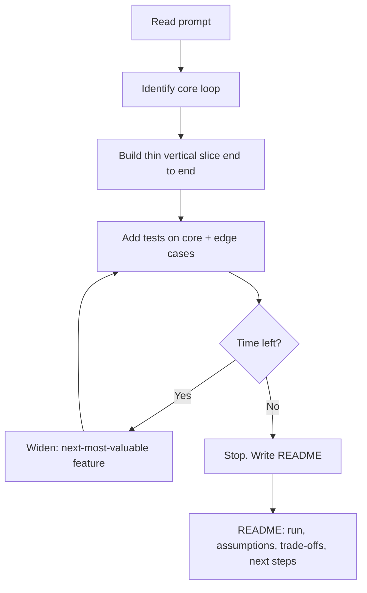
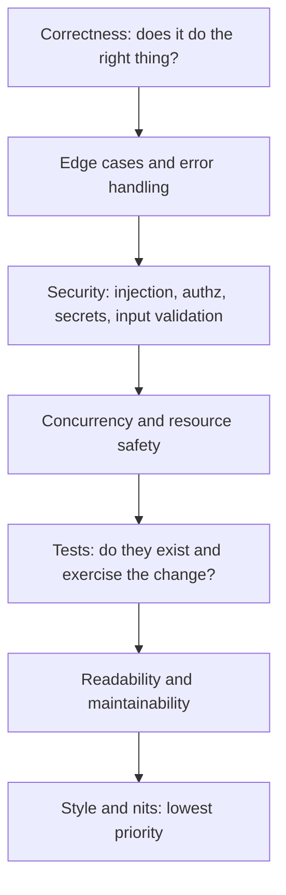

# Take-Home Projects, Pairing & Code-Review Rounds

Product companies and startups increasingly replace (or supplement) the FAANG-style
whiteboard loop with three "realistic work" rounds: a **take-home project** you build on your
own time, a **pairing / live-coding** session where you build with an interviewer beside you,
and a **code-review round** where you critique a pull request. These rounds are less about
whether you can invert a binary tree and more about whether you write code a team would want to
maintain, and whether you collaborate like a senior teammate.

This topic owns the **approach and communication craft** for these rounds — how to shine, not
the algorithms or design themselves. The data-structures/algorithms skill lives in
`dsa-coding`; object modeling lives in `lld-and-ood`; the whiteboard **system-design method**
(driving a design, capacity math) lives in `system-design/interview-method-scenario-playbooks`.
Point there for the technical technique; here we cover how to *behave and communicate* so those
skills read as senior.

> [!KEY-TAKEAWAY]
> Every one of these rounds is really a **pragmatism + communication + craftsmanship** test.
> Take-home: can you scope, finish, and explain trade-offs? Pairing: can you think out loud,
> collaborate, and take input? Code review: can you catch what matters and give feedback that
> makes the code and the author better? The "right" move is almost always the one that shows
> judgment and teamwork over raw cleverness or feature-count.

---

## What these rounds actually test

Realistic-work rounds exist because the whiteboard is a poor proxy for the job. A hiring team
running a take-home, a pairing session, or a code review is sampling the signals they can't get
from an algorithm puzzle:

| Round | Primary signals | Anti-signals (what sinks you) |
|---|---|---|
| Take-home | Scoping, finishing, code quality, tests, clear README, trade-off reasoning | Over-engineering, no tests, no README, blew the time-box, gold-plating |
| Pairing / live-coding | Communication, collaboration, incremental progress, taking hints | Silent coding, arguing with hints, big-bang code that never runs, freezing |
| Code review | What you catch (correctness > style), prioritization, feedback tone | Only nitpicking style, missing the real bug, harsh/vague comments |

The through-line is **"would I want this person on my team on a normal Tuesday?"** These rounds
reward the boring senior virtues: pragmatism, clear communication, and craft. They punish the
things that look impressive in the abstract — clever one-liners, speculative abstractions,
feature-maximalism — but hurt a real codebase.

> [!INTERVIEW]
> When you're unsure what a round wants, optimize for the signal, not the artifact. Nobody is
> counting your features or your lines of code. They're asking: is this someone whose PRs I'd
> approve, whose pairing I'd enjoy, and whose reviews would make my code better?

## Take-home: scope to the time-box

The single most common take-home failure is treating a "spend ~4 hours" prompt as "spend as
long as it takes to be perfect." Take-homes are deliberately under-specified and larger than
the time-box — that's the test. **What you choose to build, and what you consciously leave out,
is the signal.**

How to scope well:

- **Read the prompt for the core loop.** Identify the one or two things that, if working,
  prove you solved the problem. Build those end-to-end first.
- **Honor the stated time-box.** If it says ~3–4 hours, plan to a 3–4 hour deliverable. Going
  10 hours doesn't impress — it signals poor prioritization and disadvantages candidates with
  jobs, kids, or disabilities (many companies now explicitly cap or check this).
- **If no time-box is stated, impose your own.** Default to a self-imposed 3–4 hour box and say
  so in the README ("I boxed this to ~4 hours; here's what that bought and what I cut"). A
  take-home with no cap that clearly demands 15+ hours is itself a mild red flag about how the
  company values candidates' time — it's reasonable to ask the recruiter for an expected effort
  before you start, or to deliver a deliberately time-boxed slice and name it.
- **Build a thin vertical slice, then widen.** A working request→logic→response→test path beats
  three half-built features. Depth on the core beats breadth of stubs.
- **Timebox with a visible plan.** Even a scratch TODO list of "must / nice-to-have / skipped"
  shows deliberate scoping, and it becomes your README's "what I'd do next" section.

> [!TIP]
> If the time-box forces a cut, cut *features*, not *quality*. A smaller, tested, readable
> solution with a clear README outscores a sprawling, untested one almost every time. Then name
> the cut explicitly: "I scoped out pagination and auth to stay in the time-box; here's how I'd
> add them."

**Weak vs strong scoping.** Weak: candidate implements every bullet in the prompt plus a React
dashboard nobody asked for, ships no tests, and the app crashes on empty input. Strong:
candidate ships the core API with input validation, a handful of meaningful tests, and a README
that lists the three features they deliberately deferred and why.

## Take-home: working, tested, readable beats feature-complete

Reviewers open your submission and, within minutes, try to answer: does it run? is it tested?
would I want to maintain this? Optimize for those three in that order.

- **Does it run?** Provide a one-command setup (`make run`, `docker compose up`, or a crisp
  README recipe). If a reviewer can't run it in two minutes, quality inside doesn't matter. Pin
  versions; don't assume their machine matches yours.
- **Is it tested?** You don't need 100% coverage — you need *meaningful* tests on the core
  logic and the nasty edge cases (empty input, bad input, boundaries). Tests are the clearest
  proxy for "this person writes production code." A submission with zero tests is a near-
  automatic senior-level ding.
- **Is it readable?** Clear names, small functions, sensible structure, consistent formatting
  (run the linter/formatter). Readability is craftsmanship; it's what a reviewer *feels*
  immediately. Delete dead code and commented-out experiments before submitting.
- **Handle errors like production.** Validate inputs, return sensible errors, don't swallow
  exceptions. Senior reviewers look for the unhappy path, not just the demo path.

> [!WARNING]
> Do not gold-plate. A caching layer, a plugin system, or a microservice split that the prompt
> never asked for reads as *poor judgment*, not sophistication. Every abstraction you add is
> something the reviewer must evaluate and something you have to justify. Build for the
> requirements plus obvious near-term needs — no further.

The senior bar: your submission looks like a small, real PR — cohesive commits (not one
"final" blob), a green test suite, a README, and no TODO landmines. It communicates that on the
job your work would be reviewable and shippable.

## Take-home: the README is half the grade

Reviewers read the README before the code, and it's often weighted as heavily as the code
itself, because it's where you demonstrate the **judgment** that the code alone can't show. A
strong README turns "here's some code" into "here's an engineer reasoning about a problem."

A senior take-home README covers:

1. **How to run it** — setup, dependencies, one command to start, one command to test.
2. **Assumptions** — every ambiguity in the prompt you resolved, and how. ("The spec didn't say
   whether IDs are globally unique; I assumed per-tenant uniqueness.")
3. **Design / approach** — the shape of the solution and *why* this structure.
4. **Trade-offs** — the key decisions and what you gave up. ("Used in-memory storage for
   simplicity; this loses data on restart — I'd swap for Postgres in production.")
5. **What I'd do with more time** — the explicit backlog: tests you'd add, features you cut,
   scaling concerns, hardening. This is where you prove you *know* what's missing — which is
   more senior than pretending nothing is.
6. **What I deliberately left out and why** — closely related; shows the cut was a choice, not
   an oversight.

> [!TIP]
> "What I'd do with more time" is the highest-leverage section. It lets you demonstrate senior
> awareness (observability, security, scaling, edge cases) without spending the hours to build
> it. Naming a gap you chose not to fill reads as *stronger* than silently leaving it — it shows
> you saw it.

**Weak vs strong README.** Weak: "Run `npm start`. Built a TODO API." Strong: a run recipe,
three named assumptions, a short rationale for the storage and error-handling choices, and a
five-item "next steps" list covering auth, pagination, persistence, load testing, and metrics.
Same code, wildly different signal.

## Take-home: production-minded without over-engineering

The senior tension in a take-home is between two failure modes: too *junior* (no tests, no
error handling, happy-path only) and too *over-built* (frameworks and abstractions the problem
doesn't need). The target is **production-minded pragmatism**: the hallmarks of real code,
applied proportionally to a small problem.

Production-minded hallmarks worth including even in a small project:

- Input validation and explicit error handling on the boundaries.
- Meaningful tests, including edge cases and at least one failure-path test.
- Structured logging or a note on where you'd add observability.
- A clear separation of concerns (transport / logic / storage) *if* the size warrants it.
- A note on security-relevant choices (no secrets in the repo, parameterized queries, input
  sanitization).

Over-engineering to avoid: premature microservices, a generic plugin/strategy framework for a
single case, config for things that will never change, deep inheritance hierarchies,
speculative "we might need it" interfaces. The rule of thumb interviewers respect is **YAGNI +
"make it work, make it right, then stop."** If you add an abstraction, be ready to justify it in
one sentence tied to a real requirement; if you can't, delete it.



## AI coding assistants: use them like a senior would

By 2026, "did you use Copilot / ChatGPT / Claude?" is one of the most common candidate questions
and interviewer concerns for both take-homes and pairing. The reality on the job is that seniors
*do* use assistants — so the interview signal isn't abstinence, it's **ownership**: can you
explain, defend, and stand behind every line, whoever typed it?

- **Follow the prompt's stated policy.** Some take-homes say "assistants allowed," some say "no
  AI," some ask you to disclose usage. Read it and comply; violating a stated no-AI rule is an
  integrity ding that outweighs any code you produce.
- **Assume you must explain every line.** In the follow-up conversation (or a pairing round with
  no assistant), you'll be asked "why this approach?" or "walk me through this function." Code an
  assistant wrote that you can't reason through is a landmine — it exposes you as someone who
  ships what they don't understand.
- **Disclose when asked, and be matter-of-fact.** "I used Copilot to scaffold the boilerplate
  and wrote the core logic and tests myself" is a fine, senior answer. The risk isn't having used
  a tool; it's hiding it or being unable to defend the output.

> [!WARNING]
> The failure mode is *unowned* AI code: a slick submission the candidate can't explain, defend,
> or debug under questioning. Treat an assistant like a junior pair — it drafts, you review,
> reason, and own. If you can't justify a line in one sentence tied to a requirement, rewrite it
> until you can.

## Pairing & live-coding: think out loud and communicate intent

In a pairing round the interviewer is your temporary teammate, and the **primary thing being
measured is not the final code — it's how you work through it out loud.** A silent candidate who
arrives at a correct answer often scores *below* a talkative candidate who reasons clearly but
needs a nudge, because the interviewer can only score what they can observe.

How to communicate well:

- **Narrate intent before mechanics.** Say *what* you're about to do and *why* ("I'll start with
  a brute-force pass so we have something working, then optimize the lookup"), not a keystroke
  play-by-play.
- **State your plan first.** Before coding, restate the problem and sketch your approach in a
  sentence or two. This lets the interviewer redirect you *before* you waste time on the wrong
  path — a gift, not a risk.
- **Externalize trade-offs.** "I could use a hash map for O(1) lookup at the cost of memory —
  I'll do that since the input is bounded." This is the same trade-off articulation that senior
  design rounds reward.
- **Flag assumptions as you make them.** "I'm assuming inputs fit in memory; shout if not."

> [!WARNING]
> The two extremes both fail: total silence (interviewer can't follow your reasoning or help)
> and non-stop chatter that never produces code. Aim for a running commentary tied to progress
> — talk *while* you build, and let there be quiet moments while you actually type.

**What good narration actually sounds like.** Prompt: "given an array of ints and a target,
return the indices of the two numbers that sum to the target." Here is the cadence — clarify →
plan → brute force → trade-off → incremental test — with the spoken line, then what it buys you:

> 1. *(clarify)* "Quick questions: can the same element be used twice? Is exactly one valid pair
>    guaranteed, or could there be zero or many? Can the array be empty?" → shows you probe
>    requirements before touching code.
> 2. *(plan)* "Plan: I'll start with the obvious double loop to get something correct and
>    running, then swap to a hash map for O(n) if we have time." → interviewer can redirect now,
>    before you invest.
> 3. *(brute force, typing)* "So — outer loop `i`, inner loop `j` from `i+1`, return `[i, j]`
>    when `nums[i] + nums[j] == target`." → correct-first beats clever-first.
> 4. *(trade-off)* "This is O(n²) time, O(1) space. The hash-map version trades O(n) memory for
>    O(n) time — worth it once N is large; for a bounded input either is fine." → same trade-off
>    articulation design rounds reward.
> 5. *(incremental test)* "Let me sanity-check on `[2,7,11,15], target 9` → `i=0,j=1`, `2+7=9`,
>    returns `[0,1]`. And an edge case: empty array returns nothing, no crash." → test-mindedness,
>    live.

Notice the ratio: roughly one sentence of intent per chunk of code, plus silence while typing —
not a keystroke-by-keystroke monologue.

## Pairing: clarify first, then build and test incrementally

Jumping straight to code on an under-specified prompt is a classic mid-level tell. Seniors
**invest the first minute or two in clarifying questions**, then build in small, verifiable
steps rather than one big untested blob.

- **Clarify before coding.** Ask about inputs, output format, scale, edge cases, and
  constraints. "Can the input be empty? Are IDs unique? How large can N get?" Good questions are
  themselves a strong signal — they show you think about requirements and edge cases.
- **Work an example by hand.** Trace one concrete input→output before coding to confirm you and
  the interviewer share the same understanding.
- **Build incrementally and run often.** Get a trivial version working and *run it*, then extend.
  Frequent small checkpoints beat writing 60 lines and hoping. When something breaks, you know
  exactly which small change caused it.
- **Test as you go.** Add a quick assertion or run through a sample input after each piece. This
  demonstrates the same test-mindedness reviewers look for in a take-home, live.
- **Handle edge cases out loud.** Even if you defer them, name them: "empty list, single
  element, duplicates — I'll handle empty now and note the others."

> [!TIP]
> Treat clarifying questions as scoping, not stalling. Two sharp questions ("should I optimize
> for read or write?", "is the dataset bounded?") can save you from building the wrong thing and
> signal seniority faster than any line of code.

## Pairing: take hints gracefully and collaborate as a teammate

Interviewers give hints deliberately, and **how you receive a hint is itself a graded signal.**
A hint is not a failure — it's the interviewer collaborating, exactly as a teammate would in a
real pairing session. The senior move is to treat the room as collaborative, not adversarial.

- **Take hints as gifts.** When nudged, engage: "Good point — that means I should use a set
  instead of a list here." Defensiveness or ignoring the hint is a strong anti-signal; it
  predicts someone who'll be hard to work with in code review.
- **Don't argue to win.** If you disagree, discuss the trade-off briefly and openly, then move
  on. Digging in to prove you're right — even when you are — reads worse than adapting.
- **Ask when stuck; don't suffer silently.** "I'm weighing two approaches — can I talk through
  them with you?" invites collaboration. Grinding silently for ten minutes wastes the round.
- **Treat the interviewer as a pair, not a judge.** Use "we" and "let's." Bounce ideas off them.
  The behavior they're imagining is your next standup, not this test.

**Weak vs strong hint response.** Weak: interviewer says "what happens with an empty input?" and
the candidate says "it won't be empty" and moves on. Strong: "Good catch — let me add a guard
and a test for that," then does it. Same hint, opposite signal.

## Pairing: manage nerves and recover from being stuck

Live-coding is stressful, and interviewers *know* nerves aren't the same as inability — but they
can only credit you for the composure they observe. Getting stuck is expected; **how you recover
is the signal.**

- **Buy time honestly.** "Let me think for a moment" or "let me talk through my options" is
  perfectly acceptable — silence to think is fine if you frame it.
- **Fall back to brute force.** If the optimal solution won't come, say so and implement the
  naive version: "I'll get a working O(n²) solution first, then optimize." A working slow
  solution beats an elegant non-solution, and you can improve from there.
- **Debug systematically, out loud.** When something breaks, don't flail — narrate a hypothesis,
  test it, narrate the next. Calm, methodical debugging under pressure is a strong senior signal.
- **Reset instead of spiraling.** If you go down a wrong path, name it and back out: "This isn't
  working — let me step back and reconsider." Recovering gracefully impresses more than never
  stumbling.
- **Preparation reduces nerves.** Practicing out-loud coding and setting up your environment
  beforehand (editor, language, runtime) removes avoidable friction on the day.
- **Sort out remote logistics first.** These rounds are almost always remote on a shared tool
  (CoderPad, CodeSandbox, a shared repo, or their editor via screen share). Confirm the tool and
  language ahead of time, test your screen share and mic before the call, and get fluent in
  whatever shared editor they use — fumbling with an unfamiliar environment or a broken share
  burns real minutes and reads as unpreparedness. If you can bring your own editor, ask; if you
  must use theirs, do a dry run.

## Code-review round: what senior reviewers catch

In a code-review round you're handed a PR — often with planted bugs and smells — and asked to
review it. The test is **prioritization**: do you find the things that actually matter, in the
order that matters? Juniors nitpick formatting; seniors find the race condition. Review roughly
in this order of severity:



What senior reviewers look for at each level:

- **Correctness** — logic errors, off-by-one, wrong assumptions, misuse of an API. The bug that
  breaks the feature is the highest-value catch.
- **Edge cases & error handling** — empty/null inputs, boundaries, unhandled failures, swallowed
  exceptions, resources not closed.
- **Security** — SQL/command injection, unvalidated input, secrets committed to the repo,
  missing authz checks, unsafe deserialization.
- **Concurrency & resources** — race conditions, shared mutable state, unbounded growth,
  connection/file leaks.
- **Tests** — do tests exist, do they cover the change and its edge cases, are the assertions
  meaningful or just present.
- **Readability & design** — naming, function size, duplication, unclear structure, missing
  abstractions or wrong ones.
- **Style/nits** — formatting, minor naming. Real, but *lowest* priority; leading with these is
  the classic junior tell.

> [!INTERVIEW]
> Verbalize your triage: "First I'll check correctness and edge cases, then security, then
> tests, then readability — style nits last." Even before you find anything, stating that order
> signals that you know what matters. Missing a planted correctness bug while flagging a naming
> nit is the fastest way to read as junior.

## Code-review round: give kind, specific, actionable feedback

Finding problems is half the round; **how you communicate them is the other half.** Feedback
tone predicts how you'll behave on the team — a reviewer who is harsh, vague, or dogmatic
creates friction, no matter how sharp their eye. The bar is *kind, specific, and actionable*.

Techniques that read as senior:

- **Be specific and point to the line.** "Line 42: this dereferences `user` before the null
  check on line 45 — it'll NPE when the lookup misses," not "error handling is bad."
- **Critique the code, not the person.** "This function has two responsibilities" — not "you
  always over-complicate things." Assume good intent.
- **Explain the *why* and the risk.** Give the reasoning so the author learns and can decide,
  rather than issuing commands.
- **Distinguish blockers from nits.** Label priority: prefix optional polish with "nit:" and be
  explicit about what must change before merge versus what's a suggestion. This is a widely-used
  convention (Google's code-review guide, "conventional comments").
- **Offer suggestions, not just problems.** "Consider extracting this into a helper" beats "this
  is messy."
- **Ask questions when context is unclear.** "Is this endpoint reachable without auth? If so we
  need a check here" — a question can be less confrontational and surfaces context you lack.
- **Acknowledge what's good.** Noting a clean abstraction or good test isn't fluff; it calibrates
  your feedback and builds trust.
- **Delivering it live?** Many code-review rounds are a spoken screen-share walkthrough, not
  written PR comments. Structure it the same way: open by stating your triage order aloud ("I'll
  go correctness and security first, then tests, then nits"), walk the highest-severity issue
  first with the concrete risk, and *don't* enumerate every nit — bundle them into one closing
  "a few minor readability things" instead of ten separate remarks.

> [!WARNING]
> Two failure modes sink this round: the **rubber-stamp** ("looks good") that misses planted
> bugs, and the **nitpick storm** that buries a critical security flaw under twenty formatting
> comments. Prioritize ruthlessly and lead with what matters.

**Weak vs strong comment.** Weak: "This code is sloppy, fix it." Strong: "Line 30: `results`
grows unbounded inside the loop, so a large query could OOM the process — can we stream or
paginate here? Not a blocker for the happy path, but worth addressing before this hits
production."

### Worked example: reviewing a real diff

Here is exactly the kind of PR a code-review round hands you. Four problems are planted; find
them in severity order before writing a single comment.

```python
 1  def get_user_orders(db, user_id, status):
 2      # returns all orders for a user filtered by status
 3      q = "SELECT * FROM orders WHERE user_id = " + user_id \
 4          + " AND status = '" + status + "'"
 5      rows = db.execute(q)
 6      user = db.get_user(user_id)
 7      results = []
 8      for r in rows:
 9          if r.total > user.credit_limit:      # flag high-value orders
10              r.flagged = True
11          results.append(r)
12      return results
```

**Internal triage (scan correctness → edge cases → security → tests → style):**

- *Correctness:* line 6 fetches `user`, line 9 dereferences `user.credit_limit`. If `get_user`
  returns `None` for an unknown/deleted `user_id`, line 9 throws `AttributeError` — the whole
  request 500s. **High.**
- *Edge case:* line 4 interpolates `status` with no validation; an empty or unexpected `status`
  silently returns an empty list rather than an error. Minor, but worth a guard. **Medium.**
- *Security:* lines 3–4 build SQL by string concatenation — classic **SQL injection**. A
  `status` of `x' OR '1'='1` dumps every user's orders. This is the highest-value catch even
  though it sits below the null bug in raw line order. **High/blocker.**
- *Style:* `q`, `r` are terse; the comment on line 2 restates the signature. **Lowest — a nit.**

**The review, prioritized and delivered in kind/specific/actionable form:**

1. *(blocker — security)* "Line 3–4: this builds the query by string concatenation, so `status`
   and `user_id` are injectable — e.g. `status = \"x' OR '1'='1\"` would return every user's
   orders. Let's use a parameterized query: `db.execute(\"... WHERE user_id = %s AND status =
   %s\", (user_id, status))`. Must fix before merge."
2. *(blocker — correctness)* "Line 9 dereferences `user.credit_limit`, but `get_user` on line 6
   can return `None` for a missing user — that'll `AttributeError` and 500 the request. Can we
   guard: return early (or 404) when `user is None` before the loop?"
3. *(nit)* "Optional: `q`/`r` could be `query`/`order` for readability, and the line-2 comment
   just restates the signature. Not blocking."

Note what happened: the two high-severity issues lead and are labeled blockers; the style nit is
named once and explicitly deprioritized — never buried on top of the injection flaw. That
ordering *is* the signal.

## Being reviewed graciously

The flip side — how you respond when *your* code is critiqued — is also assessed, sometimes by
having the interviewer push back on your take-home or pairing solution. It's the same muscle as
taking hints gracefully, but now it's your own committed code, which stings more — so ego
management matters even more. It's a direct proxy for day-to-day collaboration and ego.

- **Assume good intent and stay curious.** Treat feedback as being about the code, not you.
  "Good point, I hadn't considered that case" costs nothing and signals maturity.
- **Don't get defensive.** Explaining your reasoning is fine; digging in to defend a clearly
  weaker choice is not. Know when to say "you're right, I'll change it."
- **Engage with the reasoning.** If you disagree, discuss the trade-off with data or a concrete
  scenario, and be willing to be wrong. Disagreeing well is a senior skill; disagreeing
  *badly* — emotionally, or by authority — is a red flag.
- **Separate preference from correctness.** Concede correctness issues immediately; discuss
  style/preference as trade-offs, and defer to team conventions where they exist.
- **Thank the reviewer.** A genuine "thanks, this is better now" closes the loop and models the
  culture a hiring manager wants on the team.

> [!KEY-TAKEAWAY]
> Being reviewed well and reviewing well are the same muscle: separate ego from code, prioritize
> what matters, and optimize for the codebase and the relationship over being right. That's the
> collaboration signal every one of these rounds is ultimately hunting for.

## Common follow-up questions

- "You have a 4-hour take-home but the prompt clearly needs 20 hours of work. What do you
  do?" — Scope to the time-box: build the core loop end-to-end with tests, then document the
  cuts and next steps in the README. Explain that finishing a coherent slice and naming what you
  deferred is the signal, not maximizing features.
- "In a take-home, is it better to build every requested feature partially, or a subset
  fully?" — A subset fully. Depth, tests, and a clear README beat breadth of half-built stubs.
- "What goes in a take-home README?" — Run instructions, assumptions, design rationale,
  trade-offs, and an explicit "what I'd do with more time / left out" section.
- "During pairing you're completely stuck on the optimal solution. What now?" — Say so,
  implement the brute-force version to have something working, and optimize from there —
  narrating throughout. A working slow solution beats an elegant non-solution.
- "The interviewer drops a hint you disagree with. How do you respond?" — Engage with it,
  discuss the trade-off briefly and openly, then adapt. Never argue to win; how you take input
  is itself graded.
- "You're reviewing a PR with a subtle race condition and several formatting issues. Where do
  you start?" — Correctness and concurrency first (the race condition), then security, tests,
  readability, and style nits last. Verbalize the triage order.
- "How do you phrase a critical review comment without demoralizing the author?" — Point to
  the specific line, explain the concrete risk, critique the code not the person, offer a
  suggestion, and label whether it's a blocker or a nit.
- "Your take-home used an unusual library the reviewer questions. How do you handle the
  pushback?" — Explain the reasoning behind the trade-off, acknowledge the downside, and stay
  open to changing it — disagree with data, not ego.

## References

- The Pragmatic Engineer (Gergely Orosz) — writing on take-home assignments and realistic
  interview formats.
- Google Engineering Practices — "How to do a code review" and "The CL author's guide"
  (google.github.io/eng-practices), including the "Nit:" convention and code-not-person feedback.
- Conventional Comments (conventionalcomments.org) — labeling review comments by type and
  severity (nit, suggestion, issue, blocking).
- interviewing.io and Pramp guides on live-coding / pairing interviews — think-aloud, clarifying
  questions, taking hints.
- "Cracking the Coding Interview" (Gayle Laakmann McDowell) — behavioral and communication
  sections on live coding.
- Will Larson, StaffEng.com and "Staff Engineer" — the collaboration/craft expectations behind
  senior+ leveling.
- Martin Fowler / Refactoring and "Clean Code" (Robert C. Martin) — readability, naming, and
  YAGNI / "make it work, make it right" principles applied to take-homes.
- system-design/interview-method-scenario-playbooks (this library) — the technical
  system-design interview method referenced above.
