# Trade-off Articulation & Technical Judgment

At senior and staff level, interviews stop rewarding the *right answer* and start
rewarding *judgment* — the ability to reason about competing forces, decide for a
stated context, and say out loud what you're giving up. Two candidates can propose the
exact same architecture; the one who names the trade-offs, quantifies where possible,
and adapts when constraints change gets the higher level. This topic is about the
**craft of articulating judgment** in any round where you defend a decision:
system-design, hiring-manager deep-dives, "tell me about a hard technical call," and the
reverse-question portion.

> [!KEY-TAKEAWAY]
> The interviewer is not grading whether you picked A or B. They are grading whether you
> understand *why A beats B under these constraints*, *when B would win instead*, and
> *what A costs you*. Say all three out loud — that sentence is the seniority signal.

This topic owns the **communication and judgment craft** of trade-offs across every
round. For the mechanics of *driving a whiteboard system-design session* (the DRIVEN
loop, scoping, deep-dive time-boxing), see
`system-design/interview-method-scenario-playbooks`. For the raw numbers used in
back-of-envelope quantification, see `interview-craft/estimation-and-napkin-math`.

---

## Judgment is the number-one senior signal

The single biggest differentiator between a mid-level and a senior/staff engineer in an
interview is **demonstrated judgment**, not recall. Mid-level answers optimize for
*correctness* ("the answer is Kafka"). Senior answers optimize for *defensibility*
("for this write-heavy, at-least-once, replayable workload I'd use Kafka; if it were
low-volume RPC I'd use SQS — here's the line between them"). Recall is table stakes;
judgment is the hire signal.

Why interviewers weight this so heavily: at senior+ you will make decisions with
incomplete information that others build on for years. The company is buying your
*decision quality under ambiguity*, so the interview probes exactly that. A candidate who
recites the "best practice" for every question signals they'll cargo-cult in the job; a
candidate who reasons from constraints signals they'll make good calls when the textbook
doesn't apply.

**The tell interviewers listen for:** unprompted trade-off narration. When you say
"I'll cache reads — I gain p99 latency and origin offload, I give up freshness, which is
acceptable because this data tolerates 60s staleness," you've demonstrated judgment in one
sentence. When you say "I'll add a cache" and stop, you've demonstrated a keyword.

> [!INTERVIEW]
> A common bar-raiser rubric line is literally "demonstrates judgment / considers
> alternatives." You can earn that checkbox on almost any answer by adding one clause:
> *"...the alternative would be X, which wins when Y, but here Z makes my choice better."*

**Weak vs strong on the same question** — *"Should this service use SQL or NoSQL?"*

- **Weak (junior):** "NoSQL, it scales better." (dogmatic, no context, cargo-cult)
- **Mid:** "Depends on the access pattern." (correct instinct, but a cop-out — no follow-through)
- **Strong (senior/staff):** "It depends on three things: do we need multi-entity
  transactions, what's the read:write ratio, and how strict are our consistency needs.
  For an orders service with money involved and joins across order/line-item/payment, I'd
  start with Postgres — I get transactions and referential integrity for free, and it
  scales to well past our stated 5k TPS. I'd revisit only if a single table's write
  volume forces sharding. I'd give up effortless horizontal scale, but that's a problem I
  don't have yet and can solve later." (names axes, decides for context, states the cost,
  states the reversal condition)

---

## The "it depends, on X, Y, Z" structure

"It depends" is the correct instinct and the most dangerous phrase in an interview. Said
alone, it reads as evasion or ignorance. Said *with follow-through* — naming what it
depends on and then **deciding** — it reads as senior judgment. The difference between the
cop-out and the signal is entirely in the next sentence.

The structure that converts "it depends" from weakness to strength:

```mermaid
flowchart TD
    A["It depends —"] --> B["name the 2-4 axes it<br/>depends ON (be specific)"]
    B --> C["state your assumptions<br/>about the context"]
    C --> D["DECIDE for that context<br/>(commit to an answer)"]
    D --> E["name what you give up<br/>+ when the alternative wins"]
    style A fill:#402,stroke:#a44
    style D fill:#042,stroke:#4a4
```

**The cop-out** stops at step A: *"It depends on a lot of factors."* Dead end. The
interviewer now has to drag the answer out of you, which reads as passivity.

**The signal** runs all five steps in ~30 seconds: *"It depends — mainly on our
consistency needs and our write volume. I'll assume we need read-your-writes for the user's
own data but can tolerate eventual consistency for others' data, and we're at maybe 2k
writes/sec. Given that, I'd go with a single-primary Postgres with read replicas and route
the user's own reads to the primary. I give up some read scale-out simplicity, but if we
outgrow it, moving hot reads to a cache is a smaller change than adopting a distributed
database now."*

> [!TIP]
> Rehearse the pivot phrase: **"It depends on X and Y — let me pick the case I think is
> most likely and design for that."** The words "let me pick" are what signal you'll
> actually decide, not just hedge. Ask one clarifying question if a real constraint is
> unknown, then *assume and move* — don't stall waiting to be handed the answer.

The number of axes matters. One axis ("it depends on scale") is thin. Naming 2–4
*specific, named* axes and then collapsing them to a decision is the sweet spot. More than
four and you're stalling.

---

## Naming the trade-off axes

Strong candidates have a **mental checklist of dimensions** they can run any decision
through. Naming the axis explicitly ("this is a latency-vs-cost trade-off") is itself a
seniority signal — it shows you've abstracted the pattern, not just memorized cases. The
canonical axes for backend/system decisions:

| Axis | The question it answers | Example trade |
|---|---|---|
| **Latency / performance** | How fast must the p50/p99 be? | Cache for speed vs freshness |
| **Cost** | $ / infra / headcount to build & run | Managed service vs self-host |
| **Complexity** | How hard to build, understand, debug | Microservices vs modular monolith |
| **Time-to-market** | How fast can we ship it? | Buy/SaaS vs build |
| **Scalability** | Does it hold at 10x / 100x? | Vertical vs horizontal scaling |
| **Operability** | On-call burden, observability, blast radius | More moving parts = more to page on |
| **Reliability / consistency** | Correctness, durability, availability targets | Strong vs eventual consistency (CAP) |
| **Risk / reversibility** | Cost of being wrong; can we undo it? | One-way vs two-way door |
| **Security / compliance** | Attack surface, data residency, audit | Convenience vs least-privilege |

You don't recite the whole list. You **pick the 2–4 axes that dominate this decision** and
reason on those. For a checkout path: reliability, latency, and risk dominate; cost is
secondary. For an internal analytics batch job: cost and time-to-market dominate; p99
latency is nearly irrelevant. **Knowing which axes to drop is as much a signal as naming
the ones that matter** — it shows you understand the problem's actual shape.

> [!WARNING]
> A frequent staff-interview trap: the candidate optimizes an axis the business doesn't
> care about (shaving 5ms off a nightly report, or hand-rolling a scalable system for a
> feature with 50 users). Always tie the axis back to a stated requirement. If no
> requirement is given, *state your assumption* about which axes matter and why.

---

## Making assumptions explicit

Every real decision rests on assumptions about scale, constraints, and context.
Interviewers can't read your mind — if you silently assume "low traffic" and design a
monolith, they may think you *missed* the scaling angle. **Stating assumptions out loud**
does three things: it de-risks miscommunication, it lets the interviewer correct you early
(a gift — free signal about what they want), and it demonstrates that you know a decision
is only as good as the context it's made in.

The pattern: **"I'm going to assume X. If that's wrong, tell me and I'll adjust."** Then
proceed. This is strictly better than either (a) asking twenty questions before committing
to anything, which reads as unable to move under ambiguity, or (b) silently assuming and
building, which reads as not knowing that context matters.

**What to make explicit:**

- **Scale numbers** — "I'll assume ~1M DAU, ~10k writes/sec peak, read-heavy 100:1."
- **Consistency / correctness needs** — "I'll assume this is money, so we need exactly-once."
- **Team & timeline** — "I'll assume a 3-person team and we need something in prod this quarter."
- **Non-negotiables** — "I'll assume GDPR applies, so data residency is a hard constraint."

> [!TIP]
> When you state an assumption, *justify it briefly*: "I'll assume read-heavy, since it's a
> social feed and reads dominate writes ~100:1." The justification shows the assumption is
> reasoned, not random — and gives the interviewer a specific thing to correct if they had
> a different scenario in mind.

**Weak vs strong** — *interviewer says "design a URL shortener":*

- **Weak:** *(starts drawing boxes immediately)* — no scale context; the design is
  unmoored and probably over- or under-built.
- **Strong:** "Before I design — I'll assume ~100M new URLs/month and read:write around
  100:1, mostly redirect reads. I'll assume we need custom aliases but not analytics in v1.
  Sound right? Given that..." — the design is now anchored and the interviewer has had a
  chance to redirect.

---

## Reasoning about non-functional requirements

Junior candidates design for the **functional** requirement ("it stores and retrieves
URLs"). Senior candidates surface the **non-functional** requirements (NFRs) — latency,
availability, durability, consistency, scalability, security, cost, operability — because
that's where all the interesting trade-offs and 90% of the real engineering lives.
Proactively raising NFRs is a strong seniority signal; waiting to be asked is a mid-level
tell.

The high-value NFRs to name and pin to a number:

| NFR | Pin it to a number | Why it drives design |
|---|---|---|
| **Availability** | "three nines = ~8.7h/yr down" | Determines redundancy, multi-AZ/region, failover |
| **Latency** | "p99 < 200ms" | Caching, denormalization, sync vs async |
| **Durability** | "no data loss on single-node failure" | Replication factor, WAL, backup strategy |
| **Consistency** | "read-your-writes for own data" | Strong vs eventual, quorum, primary routing |
| **Throughput** | "10k writes/sec peak" | Sharding, partitioning, queueing |
| **Retention / compliance** | "PII deleted within 30 days" | Storage, encryption, access controls |

The senior move is to notice that **NFRs conflict** and to reason about the conflict
explicitly. Strong consistency fights availability during partitions (CAP). Low latency
fights durability (fsync-per-write is safe but slow). High availability fights cost
(active-active across regions doubles infra). **Naming the conflict and picking a point on
the curve for the stated context is the judgment signal:** "We need high availability more
than strong global consistency for a shopping cart, so I'll accept eventual consistency and
resolve conflicts with last-writer-wins plus a merge for adds — a lost cart item is worse
than a slow one."

> [!INTERVIEW]
> When a prompt gives you *only* functional requirements, the highest-value opening move is
> to ask (or assume) the NFRs: "What are our availability and latency targets, and roughly
> what scale?" This single question separates candidates who think in features from those
> who think in systems.

---

## Choosing the boring, simple solution

A hallmark of engineering maturity is **deliberately choosing the boring, well-understood
solution** and being able to justify why. Junior engineers reach for the newest,
most-scalable, most-impressive tool. Senior engineers reach for Postgres, a monolith, a
cron job, or a managed queue — and can articulate that the boring choice minimizes risk,
operational burden, and time-to-market, which are usually the constraints that actually
bind. "Choose boring technology" (Dan McKinley) is a recognized industry principle for a
reason.

**Why boring wins (say these out loud):**

- **Operability** — mature tools have known failure modes, mature tooling, and a large
  hiring pool who already know them. Your on-call at 3am understands Postgres.
- **Risk** — battle-tested tech has fewer surprises; you're not the one finding the bugs.
- **Time-to-market** — you spend innovation budget on the actual product, not on operating
  novel infrastructure.
- **Total cost** — the sticker price of a fancy system ignores the ongoing cost of
  learning, operating, and debugging it.

The framing: **"innovation tokens"** — you get a small budget of novel technologies per
project. Spend them on the 1–2 places where novelty is a genuine competitive advantage;
use boring, proven tech everywhere else.

**Strong answer pattern:** "I'd use a Postgres table with a `status` column as a job queue
before I reach for Kafka or a dedicated queue. It handles our stated few-hundred jobs/min
trivially, it's one fewer system to operate and page on, and we already run Postgres. I'd
migrate to a real queue only when throughput or fan-out patterns actually demand it — and
I'd know that point by watching queue depth and lock contention." That answer signals you
optimize for the *system's* total cost, not for the resume line.

> [!KEY-TAKEAWAY]
> "Boring" is not the same as "outdated" or "lazy." It means *proven, well-understood, and
> matched to the requirement*. The signal is choosing it **deliberately with a stated
> justification**, and naming the specific condition under which you'd upgrade.

---

## Avoiding over-engineering and résumé-driven design

The flip side of choosing boring is recognizing and rejecting **over-engineering** and
**résumé-driven development** (RDD) — picking a technology because it's impressive or good
for your career, not because the problem needs it. Interviewers actively probe for this
because RDD is expensive: it burns time, adds operational load, and often doesn't even
solve the real problem. Reaching for Kubernetes, microservices, event sourcing, or a
service mesh on a problem that doesn't warrant it is a **negative** signal, even though it
sounds sophisticated.

**Tells of over-engineering an interviewer penalizes:**

- Designing for 100x scale that has no basis in the stated requirements ("what if we get a
  billion users?" when the prompt says internal tool).
- Splitting into microservices on day one for a 3-person team ("distributed monolith" pain
  with none of the benefits).
- Adding a cache/queue/mesh before establishing there's a problem it solves.
- Generic frameworks and abstraction layers for a single, known use case (YAGNI).

**The senior counter-move** is **YAGNI + "design for 10x, not 1000x."** You build for a
realistic near-term multiple of current load, keep the design *evolvable* (clear seams so
you can split later), and explicitly defer complexity until a real signal demands it.
Saying "I'm deliberately *not* adding X yet, because we don't have the problem it solves;
here's the metric that would tell me it's time" is a top-tier maturity signal — it shows
restraint *and* forethought.

> [!WARNING]
> Over-engineering and under-engineering are *both* judgment failures. The bar is
> **appropriate** engineering for the stated constraints. If you genuinely need scale,
> build for it — don't under-engineer to look humble. The skill is matching the solution to
> the problem, and *saying* that's what you're doing.

**Weak vs strong** — *"How would you build a notification system for our startup's 10k users?"*

- **RDD / over-engineered:** "I'd use Kafka for the event bus, a microservice per channel,
  Kubernetes for orchestration, and Flink for stream processing." (impressive words,
  wildly disproportionate to 10k users, huge ops burden for a startup)
- **Strong:** "For 10k users I'd start with a single service that writes to a Postgres
  `notifications` table and a background worker that sends via a provider like SES/Twilio.
  That's operable by a small team and ships in a week. I'd introduce a real queue when
  send volume or retry/fan-out complexity justifies it — probably around when we need
  per-channel scaling or hit provider rate limits."

---

## Acknowledging what you give up

Every decision has a cost. The clearest marker of senior judgment is **volunteering the
downside of your own choice** before anyone asks. It signals honesty, self-awareness, and
that you actually understand the decision rather than pattern-matching to a "best
practice." Candidates who present their choice as flawlessly perfect read as either
inexperienced (haven't been burned yet) or not self-aware (won't catch the downside in
production).

The pattern is a single sentence appended to every significant decision:
**"...the trade-off is [what I give up], which is acceptable here because [context]."**

Examples of the give-up clause:

- "I'll denormalize for read speed — I give up write simplicity and now have to keep copies
  in sync, which is fine because reads dominate 100:1 and writes are already in a transaction."
- "I'll use eventual consistency — I give up read-your-writes globally, so I'll route a
  user's own reads to the primary to hide it for the case users notice most."
- "A monolith gives up independent deploy and scaling per module — acceptable at our size,
  and I'll keep module boundaries clean so we can extract services later."

> [!INTERVIEW]
> If you've named the downside yourself, you've pre-empted the interviewer's follow-up and
> controlled the narrative. If they have to point out the downside and you look surprised,
> you've lost the signal. Assume they *will* find the weakness — beat them to it.

The advanced version is naming the **downside you're accepting *and* how you'd mitigate or
monitor it.** "I give up X; I'll watch metric M and revisit when it crosses threshold T."
That closes the loop from judgment to operability.

---

## Changing your answer under new constraints

Interviewers frequently add a constraint mid-answer ("now assume 100x the traffic," "now
it has to be strongly consistent," "now the budget is half") to test whether you can
**adapt your reasoning**. The correct response is to *change your recommendation* and
explain *why the new constraint tips the balance*. This is **adaptability**, and it's a
strong positive signal — it proves your original answer was reasoned from constraints, not
memorized.

The critical distinction interviewers are watching for:

```mermaid
flowchart LR
    A["New constraint added"] --> B{Does it change<br/>which axis dominates?}
    B -->|Yes| C["Change the answer +<br/>explain the tipping point<br/>= ADAPTABILITY ✓"]
    B -->|No| D["Hold the answer +<br/>explain why it still holds<br/>= CONVICTION ✓"]
    E["Change with no reason /<br/>abandon under mild pushback"] --> F["FLIP-FLOPPING ✗"]
    style C fill:#042,stroke:#4a4
    style D fill:#042,stroke:#4a4
    style F fill:#402,stroke:#a44
```

- **Adaptability (good):** "With 100x traffic, my earlier single-Postgres answer breaks —
  write volume now exceeds a single primary, so the sharding I was deferring becomes
  necessary. I'd shard by tenant, or move the hot write path to a distributed store. The
  constraint changed which axis binds, so my answer changes."
- **Conviction (also good):** *when the interviewer pushes but the constraint doesn't
  actually change the calculus* — "I hear the concern, but at 2x traffic the primary still
  has headroom, so I'd hold on Postgres and monitor rather than add complexity now."
- **Flip-flopping (bad):** abandoning a sound decision the instant an interviewer raises an
  eyebrow, with no new reasoning. This signals low conviction and that you were guessing.

> [!TIP]
> When you change your answer, **explicitly name the tipping point**: "*Because* the
> consistency requirement is now strict, the eventual-consistency design no longer works,
> so I'm switching to X." Naming the causal link is what distinguishes adapting from
> caving. And it's fine to defend a decision under soft pushback — interviewers often push
> on *correct* answers to test your conviction.

---

## Quantifying trade-offs

Whenever you can attach a *number* to a trade-off, do it — quantification separates
hand-waving from engineering. "Caching will help latency" is a claim; "an in-memory cache
turns a ~5ms disk/DB read into a ~100ns memory read, ~50,000x faster, and at 100:1 read:write
it absorbs 99% of our read load" is an argument. You don't need precision; you need the
*order of magnitude* and the *direction*, done quickly in your head.

Anchor numbers worth memorizing (Jeff Dean / Peter Norvig "latency numbers every engineer
should know," rounded to orders of magnitude):

| Operation | Rough latency | Mental model |
|---|---|---|
| L1 cache reference | ~1 ns | — |
| Main memory reference | ~100 ns | ~100x L1 |
| Read 1 MB sequentially from memory | ~10 µs | — |
| SSD random read | ~16–100 µs | ~1000x memory |
| Round trip within same datacenter | ~0.5 ms | — |
| Read 1 MB sequentially from SSD | ~1 ms | — |
| Disk seek (spinning) | ~10 ms | ~20x intra-DC RTT |
| Round trip CA ↔ Netherlands | ~150 ms | speed of light bound |

Fast rules of thumb: **memory is ~100,000x faster than disk seek; a cross-region round
trip (~150ms) dwarfs almost any compute; a datacenter round trip is ~0.5ms.** These let you
reason instantly: "putting this call cross-region adds ~150ms — that alone blows our 200ms
p99 budget, so the dependency has to be same-region or cached."

**Worked example** — *"Is it worth adding a read cache?"* "We do ~50k reads/sec against a DB
where each read is ~5ms and the DB caps around 60k reads/sec — we're near the ceiling. A
cache hit is ~1ms (in-DC) or ~100ns (local). At a conservative 90% hit rate, we cut DB load
10x to ~5k reads/sec, buying years of headroom, and drop p50 latency ~5x. The cost is
staleness and cache-invalidation complexity. For data that tolerates seconds of staleness,
that's clearly worth it." Numbers turned a vibe into a decision.

> [!TIP]
> You don't need exact figures. Round aggressively to powers of ten, state your
> assumption ("call it 50k reads/sec"), and reason about *ratios and orders of magnitude*.
> A confident order-of-magnitude estimate beats a hesitant precise one. For the full number
> set and estimation method, see `interview-craft/estimation-and-napkin-math`.

---

## One-way versus two-way door decisions

Amazon's **one-way vs two-way door** framing (from Jeff Bezos's shareholder letters) is a
widely-adopted tool for calibrating *how much rigor a decision deserves*, and referencing
it signals decision-making maturity. A **two-way door** is reversible: if it's wrong, you
walk back through with little cost, so **decide fast and iterate**. A **one-way door** is
hard or impossible to reverse (a public API contract, a data-model or schema choice a
migration would touch, a database engine your whole product couples to, a security or
privacy design): it warrants slowing down, gathering data, and getting more eyes.

```mermaid
flowchart TD
    A["A decision to make"] --> B{"Reversible?<br/>(cheap to undo)"}
    B -->|"Two-way door"| C["Decide fast, low ceremony,<br/>iterate. Bias for action."]
    B -->|"One-way door"| D["Slow down, gather data,<br/>get review, plan rollback.<br/>High rigor."]
    style C fill:#042,stroke:#4a4
    style D fill:#420,stroke:#a84
```

The judgment isn't just knowing the framing — it's **correctly classifying** the decision
and **matching your process to it.** Two failure modes interviewers penalize:

- **Bureaucracy on a two-way door:** running a three-week design review and building
  consensus over which logging library to use — a choice you could reverse in an afternoon.
  Over-investing rigor is a cost.
- **Recklessness on a one-way door:** casually shipping a public API shape or a schema
  design without review, then discovering it's expensive to change once clients depend on
  it. Under-investing rigor is a disaster.

**Strong answer signal:** "This is close to a one-way door — once external partners
integrate against this API contract, changing it means a versioned migration and partner
coordination, so I'd invest in getting the interface right up front and design it to be
extensible. In contrast, the internal retry policy is a two-way door — I'll pick a
reasonable default and tune it from production data." Classifying the decision *and* setting
your rigor accordingly is the signal. Note many decisions are *more reversible than they
first appear* — turning a one-way door into a two-way one (e.g., launching behind a feature
flag, or versioning the API) is itself a senior move.

---

## The "what would you do differently" reflection

"What would you do differently?" and "what did you learn?" are near-universal in
hiring-manager and behavioral rounds, and they directly probe judgment and growth. A
strong answer demonstrates **honest self-reflection without self-flagellation** — a
specific, credible thing you'd change, *why*, and ideally that you've *since applied* the
lesson. This is the reflective half of judgment: good judgment comes from experience, and
experience comes from reflecting on past decisions.

The structure:

1. **Name a real, specific thing** — not "I'd communicate more" (vague) but "I'd have put
   the migration behind a feature flag so we could roll back per-tenant instead of all-or-
   nothing."
2. **Explain the reasoning** — what you now understand that you didn't then.
3. **Show it stuck** — "on the next migration, I did exactly that and it saved us during a
   partial failure." (This closes the loop and proves growth, not just hindsight.)

> [!WARNING]
> Two failure modes: (1) **"Nothing, I'd do it all the same"** — reads as lacking
> self-awareness or humility; *everything* has a lesson. (2) **The humble-brag disguised as
> a flaw** — "I'd have delivered even faster" or "my only mistake was caring too much."
> Interviewers see through it instantly; it reads as unable to take real feedback. Pick a
> *genuine* trade-off you'd revisit — the credibility of a real answer is worth far more
> than looking flawless.

The safe, strong territory: a **trade-off you'd rebalance with hindsight** ("we optimized
for ship-speed and took on tech debt X; given how central that feature became, I'd have
invested two more days in the data model"). It shows you understood the trade-off *at the
time*, and that new information would legitimately change the call — which is exactly the
judgment muscle the whole topic is about.

---

## Weak versus strong answers: failure modes interviewers penalize

A consolidated map of the trade-off/judgment failure modes and their senior counterparts.
Interviewers are trained to listen for the weak patterns; knowing them lets you self-correct
mid-answer.

| Failure mode (penalized) | What it signals | Senior counterpart (rewarded) |
|---|---|---|
| Dogmatism ("always use X") | Cargo-cult, no judgment | "X here because Y; Z would win if W" |
| Cop-out "it depends" with no follow-through | Evasion / can't commit | "Depends on X,Y — I'll assume A and decide B" |
| Silent assumptions | Miscommunication risk | "I'm assuming X; correct me if wrong" |
| Only functional requirements | Thinks in features, not systems | Proactively raises NFRs & pins numbers |
| Résumé-driven / over-engineering | Poor cost sense, ego | Boring tech + YAGNI, justified |
| Presenting choice as flawless | Not self-aware | Volunteers the give-up clause |
| Flip-flopping under any pushback | Low conviction, guessing | Adapts *with a named tipping point* |
| Hand-waving ("it'll be faster") | Can't reason quantitatively | Orders-of-magnitude estimate |
| Same rigor for every decision | Poor prioritization | One-way vs two-way door calibration |
| "I'd do nothing differently" | No growth / humility | Specific, applied lesson |

> [!KEY-TAKEAWAY]
> If you take one habit from this topic: after every non-trivial decision you state, append
> the sentence **"...I gain X, I give up Y, and I'd choose differently if Z."** That single
> reflex converts nearly every answer from a keyword into a demonstration of judgment.

---

## Common follow-up questions

- "You said 'it depends' — depends on *what*, specifically? And given the most likely case,
  what would you actually do?"
- "What's the downside of the approach you just picked? What are you giving up?"
- "Now assume traffic is 100x higher / the budget is halved / it must be strongly
  consistent. Does your answer change? Why or why not?"
- "Why not just use [newer, fancier technology]? What would that buy us?"
- "Is this a decision you'd want to get exactly right up front, or one you can iterate on?"
- "How would you know if you'd made the wrong call? What would you monitor?"
- "Walk me through a technical decision you now think was wrong. What would you do
  differently, and did you get a chance to apply that?"
- "How do you decide when a system is 'good enough' versus needs more investment?"
- "You're defending Postgres, but the team wants to adopt [X]. How do you make the call?"
- "Can you put a rough number on that? How much faster / cheaper / more available?"

---

## References

- Jeff Bezos, Amazon Shareholder Letters (2015–2016) — the "Type 1 / Type 2" one-way vs
  two-way door decision framing.
- Amazon Leadership Principles (16, incl. "Are Right, A Lot," "Bias for Action," "Dive
  Deep," "Frugality") — the judgment/decision-quality signals bar-raisers probe:
  <https://www.amazon.jobs/content/en/our-workplace/leadership-principles>.
- Dan McKinley, "Choose Boring Technology" — the "innovation tokens" model
  (<https://mcfunley.com/choose-boring-technology>).
- Jeff Dean / Peter Norvig, "Latency Numbers Every Programmer Should Know" — anchor numbers
  for quantifying trade-offs.
- Will Larson, *Staff Engineer: Leadership Beyond the Management Track* and StaffEng.com —
  the archetypes (Tech Lead / Architect / Solver / Right Hand) and judgment-under-ambiguity
  bar.
- "YAGNI" (You Aren't Gonna Need It) and Martin Fowler's writing on evolutionary design and
  premature abstraction.
- Eric Brewer, the CAP theorem and PACELC — the reliability/consistency/availability
  trade-off surface.
- *Cracking the Coding Interview* (McDowell), behavioral section — structuring
  reflection ("what would you do differently") answers.
- `system-design/interview-method-scenario-playbooks` (this library) — the technical
  system-design interview method (DRIVEN loop, scoping, deep dives).
- `interview-craft/estimation-and-napkin-math` (this library) — the full back-of-envelope
  number set and method.
