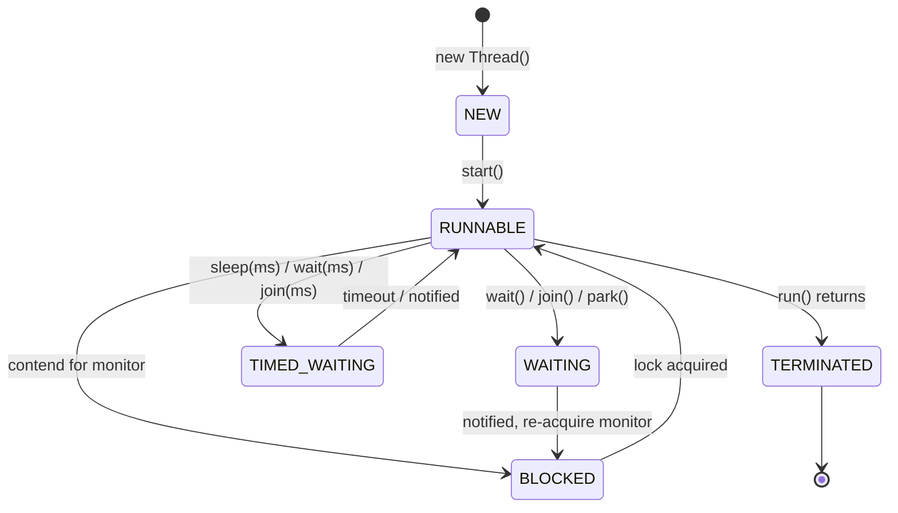

# Multithreading and Concurrency Fundamentals

Concurrency lets a program make progress on more than one task at a time. On the JVM this is built on **threads** — independent paths of execution that share the same heap (objects) but have their own stack (local variables, call frames) and program counter. Because threads share mutable memory, the hard part of concurrency is not *starting* threads but *coordinating* them safely: preventing corrupted state (race conditions), ensuring one thread sees another thread's writes (visibility), and avoiding permanent stalls (deadlock, livelock, starvation).

This topic covers the classic, foundational model that has been stable since **Java 5 (2004)**, when JSR-133 rewrote the Java Memory Model and `java.util.concurrent` was introduced. Where a feature is version-specific it is tagged explicitly. Two big modern shifts are called out: the `Executor`/`Future` framework (Java 5) that replaced hand-rolled thread management, and **virtual threads** (Project Loom), which were **finalized in JDK 21** (JEP 444) and change how you should think about the "thread-per-task" model.

---

## Thread lifecycle and states

A Java thread moves through a fixed set of states, enumerated by `Thread.State` (since Java 5). Calling `thread.getState()` returns exactly one of:

| State | Meaning | How you get here |
|---|---|---|
| `NEW` | Created but not started | `new Thread(...)` — `start()` not yet called |
| `RUNNABLE` | Eligible to run (running or waiting for CPU) | after `start()` |
| `BLOCKED` | Waiting to acquire a monitor lock | contending for a `synchronized` block/method |
| `WAITING` | Waiting indefinitely for another thread | `Object.wait()`, `Thread.join()`, `LockSupport.park()` (no timeout) |
| `TIMED_WAITING` | Waiting for a bounded time | `sleep(ms)`, `wait(ms)`, `join(ms)`, `park` with timeout |
| `TERMINATED` | `run()` has completed (normally or via exception) | thread finished |



Note the `WAITING → BLOCKED → RUNNABLE` path: a notified thread cannot run until it *re-acquires* the monitor it released in `wait()`, so it passes through `BLOCKED` first.

Key beginner points:
- **`RUNNABLE` does not distinguish "running on a CPU" from "ready to run."** The JVM does not expose a separate `RUNNING` state; the OS scheduler decides who actually runs. A thread blocked on I/O (e.g., a socket read) is *also* reported as `RUNNABLE`, not `BLOCKED`, because `BLOCKED` specifically means waiting for a Java monitor lock.
- **`start()` can be called only once.** Calling `start()` on a thread that has already been started (or terminated) throws `IllegalThreadStateException`. Calling `run()` directly does *not* start a new thread — it just executes `run()` on the current thread.
- State transitions are one-way toward `TERMINATED`. You cannot restart a terminated thread.

Intermediate/advanced notes:
- `BLOCKED` vs `WAITING`: `BLOCKED` is *involuntary* (JVM parks you until a monitor is free). `WAITING`/`TIMED_WAITING` is *voluntary* (you called `wait`/`join`/`park`). A thread that has called `wait()` and been notified must **re-acquire the monitor**, so it transitions `WAITING → BLOCKED → RUNNABLE`.
- `getState()` is intended for **monitoring and debugging only**, not for control-flow decisions — the value can be stale the instant it returns.
- Deprecated lifecycle controls: `Thread.stop()`, `suspend()`, and `resume()` are deprecated (and `stop`/`suspend`/`resume` throw `UnsupportedOperationException` when called as of JDK 20/21 — they were degraded to no-ops/throwers because they were fundamentally unsafe, e.g., `stop()` released locks while leaving objects in inconsistent state). Use interruption and cooperative shutdown instead.

---

## Runnable vs Thread vs Callable

There are three classic ways to define a unit of work:

```java
// 1. Extend Thread (rarely preferred)
class MyThread extends Thread {
    public void run() { System.out.println("hi"); }
}
new MyThread().start();

// 2. Implement Runnable (preferred; run() returns void, cannot throw checked exceptions)
Runnable r = () -> System.out.println("hi");
new Thread(r).start();

// 3. Implement Callable<V> (since Java 5; returns a value, CAN throw checked exceptions)
Callable<Integer> c = () -> 42;
ExecutorService pool = Executors.newFixedThreadPool(2);
Future<Integer> f = pool.submit(c);
Integer result = f.get();   // blocks until done; rethrows work's exception as ExecutionException
```

| | `Thread` (extend) | `Runnable` | `Callable<V>` |
|---|---|---|---|
| Since | 1.0 | 1.0 | Java 5 |
| Return value | no | no (`void run()`) | yes (`V call()`) |
| Checked exceptions | no | no | yes |
| Coupling | ties your class to `Thread` | decoupled; can extend another class | decoupled |
| Runs via | `Thread.start()` | `Thread`/`Executor` | `ExecutorService.submit()` |

Why `Runnable`/`Callable` beat extending `Thread`:
- Java has single inheritance — extending `Thread` burns your one superclass slot.
- A task (what to do) should be separate from the mechanism (how/where it runs). `Runnable`/`Callable` are just tasks you can hand to a thread pool, a scheduler, or a virtual thread.
- Both `Runnable` and `Callable` are functional interfaces (single abstract method), so lambdas work (Java 8+).

**Modern preference (Java 5+ / Loom):** Don't create raw `Thread` objects for real work. Submit tasks to an `ExecutorService`, which pools and reuses OS threads. Since **JDK 21**, `Executors.newVirtualThreadPerTaskExecutor()` gives a virtual thread per task — cheap enough that "thread-per-request" scales to millions of tasks. A `Runnable` submitted to `execute()` returns nothing; a `Runnable` or `Callable` submitted to `submit()` returns a `Future`.

Gotcha: `Executors.callable(Runnable)` adapts a `Runnable` into a `Callable` that returns `null`. And `FutureTask` implements both `Runnable` and `Future`, wrapping a `Callable`.

---

## Runnable vs Thread vs Callable execution model

*Orientation: the previous section defined the **task** abstractions (`Runnable`/`Callable`); this one covers the **execution machinery** that runs them — `ExecutorService`, `Future`, `CompletableFuture`, and the `ThreadPoolExecutor` internals underneath the `Executors` factories.*

`ExecutorService` (Java 5) decouples task submission from thread management and is the recommended replacement for manual `new Thread()`.

```java
ExecutorService pool = Executors.newFixedThreadPool(4);
Future<String> future = pool.submit(() -> compute());
try {
    String s = future.get(2, TimeUnit.SECONDS); // TimeoutException if too slow
} finally {
    pool.shutdown();              // stops accepting new tasks, lets running ones finish
    // pool.shutdownNow();        // interrupts running tasks, returns queued ones
}
```

- `submit()` returns a `Future`; exceptions thrown in the task are **captured** and rethrown wrapped in `ExecutionException` when you call `get()`. This is a common trap: an exception in a submitted task is silently swallowed until `get()` is called.
- `execute()` (from `Executor`) takes only a `Runnable`, returns void, and propagates exceptions to the thread's uncaught-exception handler.
- Always shut pools down; non-daemon pool threads keep the JVM alive.
- **`CompletableFuture` (Java 8)** extends the model with composition (`thenApply`, `thenCompose`, `thenCombine`, `allOf`) and is the go-to for async pipelines, unlike a plain `Future` which only offers a blocking `get()` and `cancel()`.

**Under the hood: `ThreadPoolExecutor` parameters.** The `Executors.newXxx` factories are just presets over one class, `ThreadPoolExecutor`. Its knobs:

| Parameter | Role |
|---|---|
| `corePoolSize` | threads kept alive even when idle |
| `maximumPoolSize` | hard ceiling on threads |
| `workQueue` | where tasks wait when all core threads are busy |
| `keepAliveTime` | how long *non-core* idle threads survive before being reaped |
| `RejectedExecutionHandler` | what to do when queue is full **and** `maxPoolSize` is reached |

Submission logic (the part that trips people up): a new task starts a **core** thread until `corePoolSize` is reached; after that it goes to the **queue**; only when the queue is *full* does the pool create threads up to `maximumPoolSize`; only when that also fails does the **rejection policy** fire. The four built-in policies: `AbortPolicy` (default — throws `RejectedExecutionException`), `CallerRunsPolicy` (runs the task on the submitting thread, providing natural backpressure), `DiscardPolicy` (silently drops it), `DiscardOldestPolicy` (drops the oldest queued task).

> [!WARNING]
> `Executors.newFixedThreadPool(n)` uses an **unbounded** `LinkedBlockingQueue`. Because the queue never fills, the pool never grows past `n` and the rejection policy never fires — but a burst of slow tasks queues **without limit** and can OOM the heap. For production, prefer an explicit `new ThreadPoolExecutor(...)` with a **bounded** queue and `CallerRunsPolicy` so overload pushes back on producers instead of exhausting memory. `newCachedThreadPool` has the opposite risk: `maxPoolSize = Integer.MAX_VALUE`, so a burst can spawn thousands of threads.

**Worked example — sizing the pool.** Use `N = Ncpu × U × (1 + W/C)`, where `U` is target CPU utilization (0–1), `W` is time spent waiting (I/O, locks), and `C` is time spent computing.

- *CPU-bound* job on an 8-core box: tasks barely wait, so `W/C ≈ 0`. `N = 8 × 1.0 × (1 + 0) = 8`. In practice size to `Ncpu + 1 = 9` so one extra thread covers the occasional page fault. More threads than cores here just adds context-switching overhead with no throughput gain.
- *I/O-bound* job on the same 8 cores where each task spends **90%** of its time waiting on the network and 10% computing: `W/C = 90/10 = 9`. `N = 8 × 1.0 × (1 + 9) = 80` threads. The wait time is "free" CPU you fill with other tasks — hence far more threads than cores.

The formula is why virtual threads (JDK 21) are transformative for I/O-bound work: instead of hand-tuning to ~80 platform threads, you spawn one cheap virtual thread per task and let the scheduler unmount them while they wait.

---

## Race conditions, deadlock, livelock, and starvation

These are the four classic liveness/safety hazards.

**Race condition** — the result depends on the *non-deterministic timing* of threads. The canonical example is a check-then-act or read-modify-write that isn't atomic:

```java
count++;   // NOT atomic: read count, add 1, write count — two threads can interleave and lose an update
```

Two threads can both read `count == 5`, both compute `6`, both write `6` — one increment is lost. Fixes: `synchronized`, `AtomicInteger`, or a lock.

**Deadlock** — two or more threads each hold a lock the other needs, so none can proceed. Requires **all four** Coffman conditions simultaneously (break any one and deadlock is impossible):

- **Mutual exclusion** — a resource is held exclusively; only one thread at a time.
- **Hold-and-wait** — a thread holds one resource while waiting for another.
- **No preemption** — a resource can't be forcibly taken; the holder must release it voluntarily.
- **Circular wait** — a cycle of threads each waiting on the next (A waits on B's lock, B waits on A's).

Which prevention attacks which condition: **global lock ordering** (always acquire lock1 before lock2) removes **circular wait** — it's the standard fix. `tryLock(timeout)` from `ReentrantLock` introduces **preemption** (a waiter gives up) and breaks **hold-and-wait** (release what you hold and retry). Acquiring all locks at once, or using a single coarse lock, also kills hold-and-wait.

```java
// Thread A: synchronized(lock1) { synchronized(lock2) {...} }
// Thread B: synchronized(lock2) { synchronized(lock1) {...} }  // opposite order -> deadlock
```
Prevention: acquire locks in a **global consistent order**; use `tryLock(timeout)` (from `ReentrantLock`) to back off; reduce lock scope.

**Livelock** — threads are not blocked but keep responding to each other and make no progress (e.g., two people repeatedly stepping aside in a hallway). Threads are active (`RUNNABLE`) but stuck in a retry loop. Often caused by naive deadlock-avoidance that always retries the same way; fix with randomized backoff.

**Starvation** — a thread never gets CPU or a lock because others monopolize it (e.g., low-priority threads, or unfair locks always favoring the same waiter). `ReentrantLock(true)` provides a **fair** ordering policy to mitigate starvation (at a throughput cost).

| Hazard | Threads blocked? | Making progress? | Typical cause |
|---|---|---|---|
| Race condition | no | yes (but wrong result) | unsynchronized shared state |
| Deadlock | yes (BLOCKED/WAITING) | no | circular lock ordering |
| Livelock | no (RUNNABLE) | no | endless mutual retry/backoff |
| Starvation | maybe | no (for the victim) | unfairness, priority skew |

---

## wait, notify, and notifyAll with intrinsic locks

Every Java object has an **intrinsic lock** (aka monitor). `synchronized` acquires it; `wait`/`notify`/`notifyAll` (defined on `Object`) coordinate threads *around* it. This is the low-level "guarded blocks" mechanism.

**Hard rule:** you may call `wait()`, `notify()`, or `notifyAll()` only while holding that object's monitor (inside a `synchronized` block on the same object). Otherwise you get `IllegalMonitorStateException` at runtime.

- `wait()` **atomically releases the monitor** and parks the thread until notified/interrupted/timeout, then **re-acquires** the monitor before returning. (Contrast: `Thread.sleep()` and `Thread.yield()` do **not** release any lock.)
- `notify()` wakes *one arbitrary* waiting thread; `notifyAll()` wakes *all* waiters (they then compete to re-acquire the monitor).

**Always wait in a loop, never an `if`:**

```java
synchronized (lock) {
    while (!conditionHolds()) {   // MUST be while, not if
        lock.wait();
    }
    // proceed — condition is now true and we hold the lock
}
```

Why a `while` loop:
1. **Spurious wakeups** — the JVM/OS may wake a waiter with no notification; re-checking the condition guards against it.
2. **Stolen wakeups / multiple consumers** — with `notifyAll`, several threads wake but the condition may only hold for one; the others must re-check and go back to waiting.

`notifyAll` vs `notify`: prefer `notifyAll` unless you can prove a single, uniform waiter set — `notify` can wake the "wrong" thread and cause a missed-signal hang. A **missed signal** also occurs if `notify` runs before the consumer calls `wait` (the notification is lost because notifications aren't queued) — the condition-loop pattern plus holding the lock during the state change prevents this.

**Worked example — how a missed signal happens, and how the lock + loop fix it.** Suppose the state change and the wait are *not* serialized by a lock (imagine `wait`/`notify` without the surrounding `synchronized`):

| step | Producer | Consumer | outcome |
|---|---|---|---|
| t1 | sets `ready = true` | | condition now true |
| t2 | calls `notify()` | (hasn't reached `wait()` yet) | **notification lost** — no one is waiting |
| t3 | | calls `wait()` | **blocks forever** — the signal already came and went |

The signal is dropped because `notify` has no memory: it wakes a *currently* waiting thread or does nothing. Now the correct pattern, where the shared monitor serializes t1–t3 and the consumer re-checks under the lock:

| step | Producer | Consumer | outcome |
|---|---|---|---|
| t1 | | acquires lock, checks `while(!ready)` → true | about to wait |
| t2 | *blocked* — can't enter `synchronized` while consumer holds lock | `wait()` **atomically releases lock** and parks | consumer waiting, lock free |
| t3 | acquires lock; `ready = true`; `notify()` | | consumer woken |
| t4 | releases lock | re-acquires lock, re-checks `while(!ready)` → false → proceeds | correct |

If the producer instead runs *entirely before* the consumer: the consumer's very first `while(!ready)` check sees `true` and **never waits at all** — the loop guard catches the already-satisfied condition. Holding the lock during the state change guarantees the check-and-wait is one indivisible step, so no signal can slip between them.

Modern alternative: `java.util.concurrent.locks.Condition` (via `ReentrantLock.newCondition()`, Java 5) gives multiple wait-sets per lock (`await`/`signal`/`signalAll`), so producers and consumers can wait on separate conditions — cleaner than a single object monitor.

---

## join

`t.join()` makes the *calling* thread wait until thread `t` terminates. It is how you wait for a thread's work to finish before proceeding.

```java
Thread t = new Thread(task);
t.start();
t.join();          // caller blocks (WAITING) until t is TERMINATED
t.join(1000);      // TIMED_WAITING: wait up to 1s, then continue regardless
```

- `join()` is implemented on top of `wait()`: internally the `Thread` object waits on itself, and the JVM calls `notifyAll` on the terminating thread. (Corollary: never call `wait()`/`notify()` on a `Thread` object yourself — you'll interfere with `join`.)
- `join()` throws `InterruptedException` if the *waiting* thread is interrupted.
- `join(0)` means wait forever (same as `join()`), *not* "return immediately."
- Joining puts the caller in `WAITING`; `join(timeout)` puts it in `TIMED_WAITING`.

Common use: fork N worker threads, then `join` each in a loop to implement a barrier ("wait for all to finish"). For richer coordination prefer `CountDownLatch`, `CyclicBarrier`, `Phaser`, or an `ExecutorService.invokeAll()` (all Java 5+).

---

## Thread safety strategies

A class is **thread-safe** if it behaves correctly when accessed from multiple threads with no additional external synchronization. Strategies, roughly from simplest to most involved:

1. **Confinement / don't share** — keep data on one thread. `ThreadLocal`, stack confinement (locals), or handing an object to exactly one thread. No sharing → no synchronization needed.
2. **Immutability** — an immutable object (all fields `final`, no mutation after construction, no leaked `this`) is inherently thread-safe. `final` fields have special JMM publication guarantees. Records (final in **JDK 16**) and `String` are examples.
3. **Synchronization** — guard *all* accesses (reads and writes) to shared mutable state with the *same* lock (`synchronized` or `Lock`). Consistency requires a documented locking policy.
4. **Atomic variables** — `AtomicInteger`, `AtomicLong`, `AtomicReference`, adders (`LongAdder`, Java 8) use lock-free CAS (compare-and-swap) for single-variable atomicity.

> [!KEY-TAKEAWAY]
> **What CAS actually does, and how `incrementAndGet` uses it.** A compare-and-swap is a single hardware instruction (`LOCK CMPXCHG` on x86) that atomically says: *"if the current value equals `expected`, set it to `next` and report success; otherwise change nothing and report failure."* No lock is taken — the thread just retries on failure. `AtomicInteger.incrementAndGet()` is a retry loop over CAS:
>
> ```java
> int incrementAndGet() {
>     int old, next;
>     do {
>         old  = get();          // read current value
>         next = old + 1;        // compute new value
>     } while (!compareAndSet(old, next));   // publish only if unchanged since read
>     return next;
> }
> ```
>
> **Worked interleaving** — two threads both increment a counter starting at `5`, with the classic lost-update timing that breaks `count++`:
>
> | step | Thread A | Thread B | actual value in memory |
> |---|---|---|---|
> | t1 | `old=get()` → **5** | | 5 |
> | t2 | | `old=get()` → **5** | 5 |
> | t3 | `next=6`; `CAS(5,6)` → mem is 5 → **succeeds**, sets 6 | | **6** |
> | t4 | | `next=6`; `CAS(5,6)` → mem is **6**, not 5 → **fails** | 6 |
> | t5 | | retry: `old=get()` → **6** | 6 |
> | t6 | | `next=7`; `CAS(6,7)` → mem is 6 → **succeeds** | **7** |
>
> Both increments land (`5 → 7`); no update is lost. Contrast with plain `count++`, where B's stale read of `5` would have overwritten A's `6` with another `6`. CAS turns the lost update into a cheap retry.
>
> **ABA problem:** CAS only checks the *value*, not whether it changed and changed back. If the value goes `A → B → A` between a thread's read and its CAS, the CAS still succeeds even though state churned underneath. Fix with `AtomicStampedReference` (attaches a version counter) when identity of intervening changes matters. Under very high contention, `LongAdder` beats `AtomicLong` by spreading updates across per-thread cells (fewer failed CAS retries), summing them only on `sum()`.
5. **Concurrent collections** — `ConcurrentHashMap`, `CopyOnWriteArrayList`, `ConcurrentLinkedQueue`, `BlockingQueue` implementations replace externally synchronized collections and scale far better than `Collections.synchronizedXxx` or legacy `Vector`/`Hashtable`.

Tables of collection choices:

| Need | Use |
|---|---|
| Concurrent map | `ConcurrentHashMap` (lock striping / CAS; no null keys/values) |
| Mostly-read list | `CopyOnWriteArrayList` |
| Producer-consumer queue | `ArrayBlockingQueue` / `LinkedBlockingQueue` |
| Single-var counter (high contention) | `LongAdder` (Java 8) > `AtomicLong` |

Advanced gotchas:
- **Compound actions aren't atomic even on thread-safe objects.** `if (!map.containsKey(k)) map.put(k, v);` is a race on a `ConcurrentHashMap`; use `putIfAbsent`/`computeIfAbsent`.
- **`Collections.synchronizedList` requires manual synchronization while iterating** (client-side locking on the returned collection).
- `volatile` provides visibility/ordering but **not** atomicity for compound operations — it's not a substitute for locking on `count++`.

**Double-checked locking (DCL) — a classic that ties together `volatile` + safe publication + reordering.** The goal: lazily create a singleton, but avoid locking on every access after it exists.

```java
class Holder {
    private static volatile Holder instance;   // volatile is MANDATORY
    static Holder get() {
        if (instance == null) {                 // 1st check — no lock (fast path)
            synchronized (Holder.class) {
                if (instance == null) {         // 2nd check — under lock
                    instance = new Holder();
                }
            }
        }
        return instance;
    }
}
```

Why the field **must** be `volatile`: `instance = new Holder()` is not atomic — it is (a) allocate memory, (b) run the constructor, (c) publish the reference to `instance`. Without `volatile`, the JVM may reorder to (a)(c)(b): the reference becomes non-null **before** the object is constructed. A second thread on the fast path then sees `instance != null`, skips the lock, and returns a **partially-constructed object** (fields still at defaults). `volatile` forbids that reordering and publishes the fully-built object. This is exactly why pre-Java-5 DCL was broken — the old JMM gave `volatile` no such ordering guarantee. (Simpler alternative: the initialization-on-demand holder idiom, which relies on class-init locking instead.)

---

## Atomicity, visibility, and ordering

These are the three guarantees the **Java Memory Model (JMM)** governs. The JMM was redefined by **JSR-133 in Java 5**; reasoning about it uses the **happens-before** relation.

- **Atomicity** — an operation completes entirely or not at all; no thread sees a half-done state. `count++` is *not* atomic. Reads/writes of most primitives and references are atomic, **except** `long` and `double`, whose 64-bit reads/writes are *not* guaranteed atomic unless declared `volatile` (JLS §17.7). Declaring a field `volatile` makes 64-bit access atomic.
- **Visibility** — when one thread writes, will another thread *see* it? Without synchronization, no guarantee: a writer's update may sit in a CPU cache/register and never be observed, causing infinite loops on a flag. `volatile`, `synchronized`, `final`, and j.u.c. classes establish visibility.
- **Ordering** — compilers and CPUs may reorder instructions. Within a single thread things *appear* sequential ("as-if-serial"), but another thread can observe reorderings unless a happens-before edge forbids it.

**happens-before** edges (partial list):
- Program order within a single thread.
- **Monitor unlock happens-before every subsequent lock** of the same monitor.
- **A write to a `volatile` happens-before every subsequent read** of that same `volatile`.
- `Thread.start()` happens-before everything the started thread does.
- Everything a thread does happens-before another thread's successful `join()` on it.
- Transitivity: if A hb B and B hb C then A hb C.

`volatile` specifics:
- Guarantees visibility + prevents reordering around the access (acts as a memory fence), and makes `long`/`double` access atomic.
- Does **not** provide mutual exclusion or make compound actions (`x++`) atomic.
- Classic correct use: a `volatile boolean running` stop-flag.

```java
volatile boolean running = true;   // without volatile, the reader loop may never see the change
public void run() { while (running) { /* work */ } }
public void stop() { running = false; }
```

**Worked example — why reordering corrupts a "flag + data" handoff.** This is the concrete hazard the "ordering" bullet describes. Two shared fields, both default-initialized (`data = 0`, `ready = false`):

```java
int data = 0;
boolean ready = false;            // NOT volatile (the bug)

// Thread A (producer)                 // Thread B (consumer)
data  = 42;   // (A1)                   while (!ready) { }    // (B1) spin
ready = true; // (A2)                   int x = data;         // (B2) read
```

You *expect* B to print `42`. But there is **no happens-before edge** between A's writes and B's reads, so two things can bite you:

1. **Reordering.** The compiler/CPU may reorder A1 and A2 (they're independent within A's own thread — "as-if-serial" only protects A's *own* view). B then observes the sequence `ready=true` **before** `data=42`.
2. **Stale cache.** Even without reordering, A's write to `data` may still sit in A's store buffer / cache line when B reads it.

Trace of the broken interleaving:

| step | who | action | `data` visible to B | `ready` visible to B |
|---|---|---|---|---|
| t1 | A | `ready = true` (reordered ahead) | `0` | `true` |
| t2 | B | `!ready` is false → exits loop | `0` | `true` |
| t3 | B | `x = data` → reads **`0`**, not `42` | `0` | `true` |
| t4 | A | `data = 42` (too late) | 42 | true |

B prints `0`. **The fix is one keyword** — make the flag `volatile boolean ready`:

- A write to a `volatile` happens-before every subsequent read of it (the edge in the list above). So B reading `ready == true` at B1 now happens-*after* A's `ready = true` at A2.
- `data = 42` (A1) is *program-order before* A2, and B's `x = data` (B2) is program-order after B1. By **transitivity**: A1 → A2 → B1 → B2, so A1 happens-before B2. B is now guaranteed to read `42`.
- As a bonus, the volatile write acts as a store fence that forbids the A1/A2 reordering. One `volatile` on the *flag* safely publishes the *data* written before it.

Advanced: `final` fields get a special **freeze** guarantee — if an object is properly constructed (no `this` escapes during construction), any thread that sees a reference to it is guaranteed to see the correctly initialized `final` fields, with no synchronization. This underpins safe publication of immutable objects and String's thread safety.

---

## Daemon threads

A **daemon thread** is a background thread that does *not* prevent JVM shutdown. The JVM exits when all remaining threads are daemons (or all non-daemon "user" threads have finished).

```java
Thread t = new Thread(task);
t.setDaemon(true);     // MUST be set before start(); else IllegalThreadStateException
t.start();
```

- The JVM does **not** wait for daemon threads to finish; they are abruptly abandoned at shutdown (their `finally` blocks may not run, buffers may not flush). So don't use daemons for work that must complete or hold resources needing cleanup.
- Daemon status is **inherited**: a thread is a daemon iff its creating thread was a daemon (you can override with `setDaemon` before `start`).
- `setDaemon()` after `start()` throws `IllegalThreadStateException`.
- Typical daemons: GC threads, JIT compiler threads, timers, background maintenance. The `main` thread is a user (non-daemon) thread.
- **Virtual threads (JDK 21)** are always daemon threads — you cannot make a virtual thread a non-daemon, and `setDaemon(false)` on one throws. So a JVM will not stay alive just because virtual threads are running.

---

## ThreadLocal

`ThreadLocal<T>` gives each thread its own independent copy of a variable — thread confinement as a first-class tool. `get()`/`set()` operate on the *calling thread's* value; threads never see each other's.

```java
private static final ThreadLocal<SimpleDateFormat> FMT =
    ThreadLocal.withInitial(() -> new SimpleDateFormat("yyyy-MM-dd"));  // withInitial: Java 8
String today = FMT.get().format(new Date());   // SimpleDateFormat is not thread-safe; TL makes it safe
```

Uses: per-thread caches of non-thread-safe objects (`SimpleDateFormat`, `Random`), request/transaction context (user id, trace id) propagated implicitly through a call stack.

Advanced/gotchas:
- **Memory leaks in thread pools.** Each `Thread` holds a `ThreadLocalMap` whose keys are weak references to the `ThreadLocal` but whose **values are strong**. In a pool the thread lives forever, so values are never garbage-collected until overwritten. **Always call `remove()`** (typically in a `finally`) when done, especially in pooled/web threads.
- `InheritableThreadLocal` copies values from parent to child thread at creation time (useful for context propagation), but *not* across a thread pool boundary.
- With **virtual threads (JDK 21)** there can be millions of threads; per-thread ThreadLocals can be expensive. JEP 429's **Scoped Values** (`ScopedValue`) are the intended modern replacement for immutable, bounded-lifetime context sharing — but note Scoped Values were still a **preview/incubating** feature in JDK 21 (finalized later), so don't claim they are final in 21.

---

## Interrupt mechanism

Interruption is Java's **cooperative** cancellation protocol — there is no forced kill (`Thread.stop()` is unsafe/removed). One thread *requests* another to stop; the target must check and honor it.

Three related APIs (easy to confuse):

| Call | What it does | Clears the flag? |
|---|---|---|
| `t.interrupt()` | sets `t`'s interrupt status (or wakes it from a blocking call) | no (sets it) |
| `t.isInterrupted()` | queries `t`'s status | **no** |
| `Thread.interrupted()` | queries **current** thread's status | **yes** (clears it) |

Behavior:
- If a thread is blocked in `wait`, `sleep`, `join`, or an interruptible j.u.c. call (`BlockingQueue.take`, `Lock.lockInterruptibly`, `Future.get`), interrupting it throws `InterruptedException` **and clears the interrupt flag**.
- If the thread is running (not blocked), `interrupt()` just sets the flag; the code must poll `Thread.currentThread().isInterrupted()` and stop.

**Correct handling** — never swallow it silently:

```java
try {
    queue.take();
} catch (InterruptedException e) {
    Thread.currentThread().interrupt();  // restore the flag you just cleared
    return;                              // or otherwise unwind
}
```

Why restore the flag: because catching `InterruptedException` cleared it, code higher in the stack (and thread pools) can no longer tell the thread was interrupted. Restoring preserves the cancellation signal. Swallowing an `InterruptedException` (empty catch) is a well-known bug that makes threads uncancellable.

Note: interrupting does **not** unblock a thread stuck on a plain `synchronized` acquisition or on `InputStream` I/O; only interruptible operations respond.

---

## Producer-consumer

The producer-consumer pattern decouples work generation from work processing via a shared bounded buffer: producers put items in, consumers take them out, and the buffer applies **backpressure** (blocks producers when full, blocks consumers when empty).

**Old way — hand-coded with wait/notify:**

```java
synchronized (buf) {
    while (buf.isFull()) buf.wait();   // producer waits for space
    buf.add(item);
    buf.notifyAll();                   // wake consumers
}
```
Error-prone: you must use `while` loops, `notifyAll`, correct lock scope, and avoid missed signals.

**Modern way — `BlockingQueue` (Java 5):**

```java
BlockingQueue<Task> queue = new ArrayBlockingQueue<>(100);
// Producer:
queue.put(task);        // blocks if full
// Consumer:
Task t = queue.take();  // blocks if empty
```

`BlockingQueue` hides all the wait/notify machinery and is the recommended solution. Key implementations and semantics:

| Method group | Behavior when full/empty |
|---|---|
| `put` / `take` | **block** until possible (the classic choice) |
| `offer` / `poll` | return `false`/`null` immediately (or with timeout) |
| `add` / `remove` | throw `IllegalStateException`/`NoSuchElementException` |

- `ArrayBlockingQueue` — bounded, array-backed, single lock, optional fairness.
- `LinkedBlockingQueue` — optionally bounded, separate put/take locks (higher throughput).
- `SynchronousQueue` — zero capacity; each put must meet a take (direct handoff; used by cached thread pools).
- `PriorityBlockingQueue` — unbounded, ordered by priority.

Idiom: a common shutdown signal is a **poison pill** — a sentinel object placed on the queue that tells consumers to exit. The whole pattern is usually wired via `ExecutorService` + `BlockingQueue` (a `ThreadPoolExecutor` *is* a producer-consumer system internally). With virtual threads (JDK 21), blocking on `take()`/`put()` no longer pins an OS thread, so simple blocking designs scale.

---

## Common interview follow-up questions

1. Why must `wait()`/`notify()` be called inside a `synchronized` block on the same object? What exception otherwise?
2. Why wait in a `while` loop rather than an `if`? Explain spurious wakeups and missed signals.
3. What's the difference between `notify()` and `notifyAll()`, and when is `notify()` unsafe?
4. Does `Thread.sleep()` release the lock? Does `wait()`? Does `yield()`?
5. Explain happens-before. What edge does a `volatile` write/read create? A monitor unlock/lock?
6. Is `long`/`double` assignment atomic in Java? How does `volatile` change that?
7. Why is `count++` not thread-safe even if `count` is `volatile`? How would you fix it?
8. Difference between `BLOCKED` and `WAITING`? Is a thread doing socket I/O `BLOCKED`?
9. How do you cancel a thread safely? Why restore the interrupt flag after catching `InterruptedException`?
10. What makes a daemon thread different at JVM shutdown? Are virtual threads daemons?
11. How can `ThreadLocal` cause a memory leak in a thread pool, and how do you prevent it?
12. Compare `Runnable` vs `Callable` vs `Thread`. When does an exception in a submitted task surface?
13. Name the four Coffman conditions for deadlock and how to break the circular-wait one.
14. Difference between livelock and deadlock; give a real example of each.
15. Which Java version finalized virtual threads, and how do they change the thread-per-request model?
16. `Future` vs `CompletableFuture`? Why prefer `BlockingQueue` over hand-rolled wait/notify for producer-consumer?

## References

- JLS, Chapter 17 "Threads and Locks" (Java Memory Model, §17.4 happens-before; §17.7 non-atomic 64-bit treatment): https://docs.oracle.com/javase/specs/jls/se21/html/jls-17.html
- JSR-133: Java Memory Model and Thread Specification (Java 5): https://www.jcp.org/en/jsr/detail?id=133
- `java.lang.Thread` and `Thread.State` API docs: https://docs.oracle.com/en/java/javase/21/docs/api/java.base/java/lang/Thread.html
- `java.util.concurrent` package summary (Executors, Future, BlockingQueue, locks): https://docs.oracle.com/en/java/javase/21/docs/api/java.base/java/util/concurrent/package-summary.html
- JEP 444: Virtual Threads (Final in JDK 21): https://openjdk.org/jeps/444
- JEP 425: Virtual Threads (Preview, JDK 19): https://openjdk.org/jeps/425
- JEP 429: Scoped Values (Incubator/Preview): https://openjdk.org/jeps/429
- JDK 20 removal of `Thread.stop/suspend/resume` behavior (JDK-8289610): https://bugs.openjdk.org/browse/JDK-8289610
- Goetz et al., *Java Concurrency in Practice* (2006) — canonical treatment of the JMM, safe publication, and these patterns.
