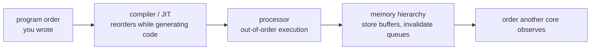
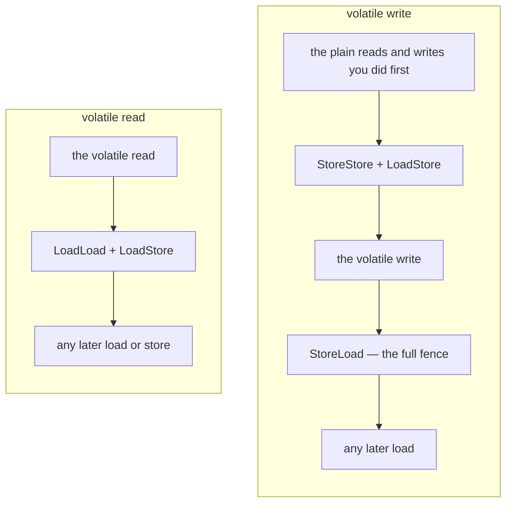

# synchronized, volatile and the Java Memory Model

Concurrency correctness in Java rests on the **Java Memory Model (JMM)** — the part of the
Java Language Specification (JLS Chapter 17) that defines *when* a write by one thread is
guaranteed to be *visible* to a read by another thread, and *which* reorderings a compiler,
JIT, or CPU is allowed to perform. The modern JMM was defined by **JSR-133** and shipped in
**Java 5 (2004)**; before that, `volatile` and `final` had weaker, partly-broken semantics.

This document builds from beginner definitions to advanced internals and gotchas for the
core low-level concurrency tools: `volatile`, `synchronized`, atomic classes / CAS,
double-checked locking, `final` field semantics, and false sharing.

---

## The Java Memory Model and happens-before

**Intuition first.** Think of happens-before as a *delivery guarantee*, not a stopwatch. If
action X happens-before action Y, then everything X did is "packaged and delivered" to Y —
Y is guaranteed to see it. Crucially the delivery can be lazy and the packing reordered: the
JMM does **not** promise X ran earlier in wall-clock time, only that *when* an hb edge exists,
Y cannot observe a state older than X's. No hb edge means no delivery promise — Y may see X's
work, stale data, or a torn mix, and the JVM is free to reorder. So the whole game of writing
correct concurrent code is: create enough hb edges that every read you care about has a
delivery guarantee from the write that produced its value.

**Beginner.** Each thread may keep its own working copy of variables (in registers, store
buffers, or per-core caches). Without synchronization there is *no guarantee* that a write
made by thread A is ever seen by thread B, or in what order. The JMM does not talk about
caches directly — it is an abstract model defined in terms of a **happens-before** partial
ordering over memory actions. If action X *happens-before* action Y, then the effects of X
(including all writes) are visible to Y.

**The happens-before rules (JLS 17.4.5):**

- **Program order rule:** within a single thread, each action happens-before every action
  that comes later in program order.
- **Monitor lock rule:** an unlock on monitor M happens-before every subsequent lock on M.
- **Volatile rule:** a write to a volatile field happens-before every subsequent read of
  that same field.
- **Thread start rule:** `Thread.start()` happens-before any action in the started thread.
- **Thread join rule:** any action in a thread happens-before another thread returning from
  `join()` on it.
- **Thread interruption rule:** a call to `interrupt()` happens-before the interrupted
  thread detecting the interrupt.
- **Finalizer rule:** the end of a constructor happens-before the start of `finalize()`.
- **Transitivity:** if X hb Y and Y hb Z, then X hb Z.

**Intermediate.** Happens-before is a *partial* order, not a total one. Two actions with no
happens-before relationship are said to be in a **data race** if at least one is a write and
they touch the same non-final, non-volatile location — such a program's behavior is not
guaranteed to be sequentially consistent. The JMM's guarantee is the **DRF-SC** theorem:
*correctly synchronized (data-race-free) programs behave as if sequentially consistent.* Your
job is to insert enough synchronization to remove data races; then you get the intuitive
interleaving semantics.

**Advanced.** Happens-before does **not** mean "happens-before in wall-clock time," and it
does **not** forbid reordering — it only constrains the *values reads are allowed to return*.
A JIT may freely reorder actions that are not ordered by happens-before as long as the
single-thread (as-if-serial) semantics are preserved. The JMM is also careful to forbid
*out-of-thin-air* values via a causality model, so that data races (while unspecified in
ordering) still cannot fabricate arbitrary values for references (which would break memory
safety). Note happens-before is not transitively "consistent" across different variables
unless a synchronization action bridges them.

---

## Visibility, reordering, and atomicity

Three different things can go wrong with a shared field, and each one needs a different fix.
The smallest case is one `boolean`:

```java
boolean stop = false;            // not volatile

// Thread T
while (!stop) { /* spin */ }     // JIT may hoist to: if(!stop) while(true){}

// Main thread
stop = true;                     // T may never observe this
```

Main sets `stop = true` and exits. Thread T spins on, pinning a core. No exception, no log
line, and the flag was set long ago. The write was not slow. The JIT is allowed to read
`stop` once before the loop and reuse that copy, because with no happens-before edge nothing
in the program obliges T to look again. Declare `stop` volatile and the edge exists, so T has
to re-read. This is a legal compiler optimisation, not a cache that failed to flush.

That loop is a **visibility** failure: a write by one thread never becomes observable to
another. Two more failures can happen to the same field, and neither one is visibility.

**Ordering** is whether operations appear to run in the order the program wrote them. Write
`data = 42` and then `ready = true`, both of them plain fields, and another thread can see
`ready` set while `data` is still 0. Nothing forces those two writes to become visible in the
order you wrote them.

**Atomicity** is whether a compound operation runs as one indivisible step. `stop = true`
is a single write, so it has nothing to divide; `count++` is a read, an add and a write,
and another thread can land in the middle of it.

The three are independent, and each tool covers a different subset. `volatile` gives you
visibility and ordering, and no atomicity of compound actions. `synchronized` and the
atomic classes give all three, within the block or the variable they cover.

Atomicity has a second and smaller form. A *single* access can be split. Per JLS 17.7 a JVM
may implement a write of a non-volatile `long` or `double` as two separate writes, one to
each 32-bit half. A reader can then see a word-torn value: the high half of one write beside
the low half of another, a number no thread ever stored. Declaring the field `volatile`
guarantees the 64-bit access is atomic. References are always read and written atomically,
whatever the platform's word size.

> [!WARNING]
> You will hear that tearing is theoretical, because HotSpot on a 64-bit platform writes a
> `long` atomically anyway. That is true of that platform and it is not a guarantee. The
> specification promises 64-bit atomicity only for a `volatile` field, so identical source is
> free to tear on any JVM that splits a 64-bit access in two. Historically those have been
> 32-bit JVMs. Write down the guarantee you need rather than the one your laptop happens to
> provide.

### Why the simple version is wrong: three machines reorder, not one

Between the order you wrote and the order another core observes, an access passes three
stages, and each one may move it.



The hoist in the loop above happened at the first stage, in generated code, which is why no
amount of cache-flushing would have fixed it. At the last stage a write can be delayed after
it has already executed. A store waits in the core's store buffer. On many designs an
invalidate queue also delays the moment another core learns its copy of the line has gone
stale.

Which moves another core can observe depends on the chip, and the compiler targets that chip
too. x86 behaves as **total store order (TSO)**: for ordinary field accesses, store-load is
the only reordering it exposes to another core. A store followed by a load of a different
address can appear swapped. ARM and POWER are weakly ordered, and permit reorderings that x86
forbids. That is why a racy program can pass every run on an x86 laptop and still fail on an
ARM server running the same bytecode.

The JMM sits above all three stages, and above every hardware model under them. That is what
makes a correctly synchronised program portable: get the happens-before edges right, and the
same source is correct on both chips.

`volatile` fixes visibility, ordering and the tearing case with one keyword. It cannot fix
`count++`. That keyword is the next section.

---

## volatile

`volatile` makes one access to a field behave. It never makes a *sequence* of accesses
behave.

Take a counter at `v == 5`, with threads A and B each running `v++` exactly once:

```java
volatile int v;
v++;   // NOT atomic: load v, add 1, store v — lost updates under contention
```

`v++` is three steps: load, add 1, store. `volatile` covers each step and does not fuse
the three, so this interleaving is legal:

| time | Thread A | Thread B | `v` in memory | what just happened |
|---|---|---|---|---|
| t1 | load v -> 5 | | 5 | |
| t2 | | load v -> 5 | 5 | B reads before A stores |
| t3 | add 1 -> 6 | | 5 | |
| t4 | | add 1 -> 6 | 5 | |
| t5 | store 6 | | 6 | |
| t6 | | store 6 | 6 | B overwrites with its stale 6 |

Two increments happened and `v` is 6, not 7. One update was lost. Visibility is not what
failed: B's load at t2 returned a genuinely fresh 5. The race lives in the gap between a
load and the store that depends on it, and no visibility guarantee closes a gap.

What closes it is a retry. `AtomicInteger.incrementAndGet()` behaves as a compare-and-set
retry loop. `compareAndSet(expected, expected + 1)` stores the new value only if the field
still holds the value that was read. If it does not, the increment reads again and retries.
The same interleaving now ends differently:

| time | Thread A | Thread B | `v` |
|---|---|---|---|
| t1 | load v -> 5 | | 5 |
| t2 | | load v -> 5 | 5 |
| t3 | CAS(expect 5, set 6) -> OK | | 6 |
| t4 | | CAS(expect 5, set 6) -> FAIL (v is 6, not 5) | 6 |
| t5 | | retry: load v -> 6 | 6 |
| t6 | | CAS(expect 6, set 7) -> OK | 7 |

B's first attempt fails because `v` no longer holds the 5 it expected, so B re-reads and
retries against the current value, and the count comes out 7. That retry-on-conflict is
precisely the atomicity `volatile` lacks.

`volatile` gives you visibility: a read sees the most recent write, because that write
happens-before every later read of the field. It gives you ordering: the volatile accesses
are not reordered against each other, and they act as memory barriers for the plain accesses
around them. It gives you atomicity of one read or one write, a 64-bit `long` or `double`
included. It does not give you atomicity of a read-modify-write such as `count++`, or of a
check-then-act such as `if (x == null) x = ...`.

The ordering half is why `volatile` appears on fields whose own value nobody cares about.
Since JSR-133 the two accesses have names taken from hardware: the volatile write is the
**release** and the matching volatile read is the acquire. Everything a thread wrote before
the release is visible to a thread that afterwards reads that same volatile and sees the value
the release wrote. That includes plain non-volatile fields.

```java
int data;                 // plain
volatile boolean ready;   // guard

// Writer
data = 42;                // (1)
ready = true;             // (2) volatile write — release

// Reader
if (ready) {              // (3) volatile read — acquire
    use(data);            // (4) guaranteed to see 42
}
```

(1) happens-before (2) by program order. (2) happens-before (3) by the volatile rule, and (3)
happens-before (4) by program order again. Transitivity then carries the plain write of
`data` all the way to (4). A reader that sees `ready == true` sees 42, never 0. One volatile
boolean published a field that carries no synchronisation of its own, and that piggybacking
is the single most useful thing `volatile` does.

> [!WARNING]
> Performing the volatile read is not what creates the edge. The edge exists only if your
> read lands after the release, and seeing the value the release wrote is how you know it
> did. If the reader's `if (ready)` sees the initial `false`, there is no happens-before
> relationship to the writer at all, and a later read of `data` may return 0. Even
> `boolean ignored = ready;` forms the edge, as long as the value it read is the one the
> release wrote.

### Where it breaks: what the keyword does not reach

Declare `volatile int[] arr` and exactly one thing is volatile: the field holding the
reference. `arr[0] = 1` is a plain write, with no ordering and no visibility guarantee,
which is why element-level semantics need `AtomicIntegerArray` or a `VarHandle` over the
array.

The other two misuses assume the keyword reaches further than one field access. A check built
from two volatile reads is not one atomic action: `v == 5 && w == 0` loads `v`, then loads
`w`, and either can change between the two loads. And a volatile field holding a mutable
object says nothing about that object's internal state; the field access is thread-safe, the
object is not.

### What it costs: the fences HotSpot emits

The expensive part of `volatile` is one instruction, and it sits after a write rather than
after a read: on x86 a StoreLoad barrier compiles to a full fence such as `mfence` or
`lock addl`.

A **memory barrier**, or fence, is an instruction that computes nothing. All it does is forbid
the compiler and the CPU from moving certain memory operations across it. StoreLoad does one
thing more: it forces buffered writes out to where other cores can see them. Four are named,
and each pins one before-and-after pair:

| Barrier | What it pins |
|---|---|
| LoadLoad | a load before the barrier completes before any load after it, so no read is hoisted past the barrier |
| LoadStore | a load before the barrier completes before any store after it |
| StoreStore | a store before the barrier becomes visible before any store after it |
| StoreLoad | a store before the barrier becomes visible before any load after it |

Conceptually, this is where the JMM requires each of them:



The StoreStore before the write is what makes the piggyback pattern work: the plain write of
`data` has to become visible before the volatile write of `ready` does, so a reader that
sees `ready` cannot be looking at a stale `data`.

The StoreLoad after the write is the costly one, and the cost is mechanical. A store does
not go straight to cache; it waits in the core's store buffer. StoreLoad may not let the
next load proceed until that buffer has drained to cache, so the pipeline stalls for as long
as the drain takes. That drain is what orders a volatile write against a later volatile read
of a *different* variable. It is also why a volatile write costs more than a volatile read.

None of this stops two threads from running `v++` at the same time. Keeping them apart takes
mutual exclusion, and that is what a monitor provides.

---

## synchronized, monitors, and reentrancy

**Beginner.** `synchronized` acquires an object's intrinsic lock (**monitor**). It provides
both **mutual exclusion** (only one thread in the block per monitor) and **visibility**
(unlock happens-before subsequent lock on the same monitor — flushing writes). Two forms:

```java
synchronized (lockObject) { ... }   // block on an explicit monitor
synchronized void m() { ... }        // instance method -> locks 'this'
static synchronized void s() { ... } // static method -> locks the Class object
```

**Intermediate.**

- **Reentrant:** a thread already holding monitor M can re-acquire M without deadlocking; a
  hold count is maintained and the lock is released only when the count returns to zero.
- **Which monitor matters:** locking on different objects gives no mutual exclusion. A common
  bug is `synchronized` on `Integer`/`Boolean`/`String` (interned/cached), or reassigning the
  lock object. Always lock on a `private final Object lock = new Object();`.
- Instance and static synchronized methods use *different* monitors (the instance vs the
  `Class`), so they don't exclude each other.

**Advanced — lock internals in HotSpot.** An object header's mark word encodes lock state.
HotSpot historically supported:

- **Biased locking** — optimized for a single thread repeatedly locking. **Disabled by
  default since JDK 15 (JEP 374)** and deprecated for removal because it hurt more than it
  helped on modern hardware.
- **Thin / lightweight locks** — CAS on the mark word for uncontended locks (no OS mutex).
- **Fat / heavyweight locks (inflation)** — a real OS monitor (`ObjectMonitor`) with a wait
  set and entry list, used under contention.

`wait()`/`notify()`/`notifyAll()` are defined on `Object` and **must be called while holding
that object's monitor** or they throw `IllegalMonitorStateException`. `wait()` releases the
monitor and must be used in a loop guarding against spurious wakeups:

```java
synchronized (lock) {
    while (!condition) lock.wait();   // never 'if' — spurious wakeups + missed signals
    ...
}
```

**Gotcha — lock-ordering deadlock.** The most common `synchronized` failure is two threads
acquiring two locks in opposite orders:

```
Thread 1: synchronized(A) { ... synchronized(B) { ... } }
Thread 2: synchronized(B) { ... synchronized(A) { ... } }
```

Interleave them: T1 grabs A, T2 grabs B, then T1 blocks waiting for B (held by T2) while T2
blocks waiting for A (held by T1) — neither can proceed, and `synchronized` cannot be
interrupted or timed out, so the threads are wedged forever. Fixes: impose a **global lock
order** (every thread always takes A before B — e.g. order by `System.identityHashCode` or a
fixed tier) so the cycle is impossible, or use `ReentrantLock.tryLock(timeout)` so a thread
that can't get the second lock backs off and releases the first instead of hanging.

**Trade-off vs `ReentrantLock` (java.util.concurrent, Java 5):** explicit `Lock` adds
`tryLock`, timed/interruptible acquisition, fairness policy, and multiple `Condition`s, at
the cost of a mandatory `try/finally unlock()`. Use `synchronized` for simple cases; reach
for `ReentrantLock`/`StampedLock`/`ReadWriteLock` when you need those features — the
`tryLock`-with-timeout above is a concrete reason to prefer it when deadlock risk is real.

---

## Atomic classes and CAS

**Beginner.** `java.util.concurrent.atomic` (Java 5) provides lock-free, thread-safe single
variables: `AtomicInteger`, `AtomicLong`, `AtomicBoolean`, `AtomicReference`, plus array and
field-updater variants. They solve the `count++` atomicity problem without locks:

```java
AtomicInteger n = new AtomicInteger();
n.incrementAndGet();      // atomic read-modify-write
```

**Intermediate — CAS.** Atomics are built on **Compare-And-Swap**: an instruction that
atomically sets a location to a new value *only if* it currently equals an expected value,
returning success/failure. The typical loop:

```java
int prev, next;
do {
    prev = value.get();
    next = prev + 1;
} while (!value.compareAndSet(prev, next));  // retry on contention
```

CAS is **optimistic**: no blocking, threads retry on conflict. It maps to hardware
(`cmpxchg` on x86, LL/SC on ARM). Atomic reads/writes carry the same happens-before
guarantees as volatile (the backing field is volatile).

**Advanced.**

- **ABA problem:** a value changes A→B→A; a plain CAS can't tell it changed. Use
  `AtomicStampedReference` (version stamp) or `AtomicMarkableReference`.

  *Worked example — a corrupted lock-free stack pop.* The stack top is an `AtomicReference`.
  `pop()` reads `top`, then does `CAS(top, oldTop, oldTop.next)`. Start with stack `A -> B -> C`
  (top = A, A.next = B):

  ```
  Thread 1: reads top = A, computes A.next = B, is about to CAS(top, A, B) ... then STALLS
  Thread 2: pop() -> top now B    (removed A)
  Thread 2: pop() -> top now C    (removed B; B is recycled/free)
  Thread 2: push(A) -> top now A again, and sets A.next = C   (stack is now A -> C)
  Thread 1: wakes, runs CAS(top, A, B): top IS A, so CAS SUCCEEDS
            -> top is set to B, but B was already popped and is garbage!
  ```

  The stack is now corrupted (top points to a freed/unlinked node) even though every CAS
  "succeeded", because the value returned to `A` and the plain CAS only compares the reference,
  not its history. `AtomicStampedReference` fixes this by pairing the reference with an int
  stamp bumped on every change: Thread 1 read `(A, stamp=10)`; after Thread 2's three ops the
  stamp is `13`; Thread 1's `compareAndSet(A, B, 10, 11)` now **fails** on the stamp mismatch
  (`13 != 10`), forcing a re-read instead of a silent corruption.
- **LongAdder / DoubleAdder (Java 8):** under high contention, `AtomicLong` CAS retries
  become a bottleneck. `LongAdder` spreads the count over multiple *cells* (striping) to
  reduce contention, summing them on `sum()`. Prefer it for hot counters where you rarely
  read; prefer `AtomicLong` when you need an exact instantaneous value cheaply. Concretely:
  with N cells, `increment()` CASes just *one* cell (threads on different cores rarely collide,
  so almost no retries), but `sum()` must add all N cells and it is **not** an atomic snapshot —
  it reads cell 0, then cell 1, ... while other threads keep updating cells it already passed.
  So the total is approximate under concurrent writes (eventually exact once writers quiesce),
  which is why it fits metrics/throughput counters but not a value you must read exactly.
- **VarHandle (Java 9, JEP 193)** replaced `sun.misc.Unsafe` for fine-grained access modes:
  `getPlain`, `getOpaque`, `getAcquire`/`setRelease`, `getVolatile`, and `compareAndSet`.
  This exposes the C11-style access-mode spectrum directly in the standard API.
- Atomics give lock-freedom (system-wide progress) but not wait-freedom; under extreme
  contention a lock can outperform a spinning CAS loop.

---

## Double-checked locking

**Beginner.** A lazy-initialization idiom that tries to avoid locking on the common (already
initialized) path:

```java
class Holder {
    private volatile Singleton instance;          // volatile is MANDATORY
    Singleton get() {
        if (instance == null) {                   // 1st check (no lock)
            synchronized (this) {
                if (instance == null) {           // 2nd check (locked)
                    instance = new Singleton();
                }
            }
        }
        return instance;
    }
}
```

**Intermediate — why `volatile` is required.** `instance = new Singleton()` is not atomic:
it (a) allocates memory, (b) runs the constructor, (c) publishes the reference. Without
`volatile`, the compiler may reorder so the reference is published *before* the constructor
finishes. Another thread's first check could then see a non-null but **partially constructed**
object. This is the famous reason DCL was *broken* before Java 5. Since JSR-133 (Java 5),
declaring the field `volatile` makes DCL correct (the volatile write is a release; the reader's
volatile read is an acquire, so it sees a fully constructed object).

**Advanced — better alternatives:**

- **Initialization-on-demand holder idiom** — relies on JVM class-init laziness and is often
  cleaner (no volatile, no explicit synchronization):

```java
class Singleton {
    private Singleton() {}
    private static class Holder { static final Singleton INSTANCE = new Singleton(); }
    static Singleton getInstance() { return Holder.INSTANCE; }   // lazy + thread-safe
}
```

  The JVM guarantees class initialization is thread-safe and happens exactly once (JLS 12.4),
  and `Holder` is not loaded until `getInstance()` first touches it.

- **enum singleton** — simplest thread-safe, serialization-safe singleton.

- For a `volatile` local optimization, read the field into a local variable once to avoid a
  second volatile read.

---

## final field semantics

**Beginner.** A `final` field must be assigned exactly once, in the constructor (or field
initializer / instance initializer). Beyond immutability, `final` has crucial *memory-model*
meaning added by JSR-133.

**Intermediate — the final-field guarantee (JLS 17.5).** If an object is *properly
constructed* (the `this` reference does not escape the constructor), then any thread that
sees a reference to that object — even through a **data race** — is guaranteed to see the
correctly initialized values of its `final` fields, without any synchronization.

```java
class Point {
    final int x, y;
    Point(int x, int y) { this.x = x; this.y = y; }
}
// A thread reading a Point reference (even unsafely published) sees x,y correctly set.
```

This is why immutable objects (all-`final` fields, no `this` escape) are safe to publish via
a data race. `String`, `Integer`, etc. rely on this.

**Advanced — the escape caveat and freeze.** The guarantee holds only if `this` does not
escape during construction (e.g. registering `this` in a static map or starting a thread that
uses `this` inside the constructor breaks it). Semantically there is a **freeze** action at
the end of the constructor for each final field; reorderings that would let another thread
see the pre-freeze (default) value are forbidden. Note: for a `final` reference to a mutable
object, only the *reference* and the field values reachable through final fields *at
construction time* get the guarantee — later mutations still need normal synchronization.
Reflectively mutating a `final` field is undefined territory w.r.t. these guarantees.

---

## False sharing

**Beginner.** CPUs move memory in **cache lines** (commonly 64 bytes), not individual
variables. If two threads on different cores write to two *different* variables that happen
to sit on the *same* cache line, each write invalidates the other core's copy of the whole
line, causing cache-coherence traffic (ping-ponging). This is **false sharing** — the
variables are logically independent but physically share a line, silently killing scalability.

**Intermediate — diagnosing and fixing.** Symptoms: a "shared-nothing" parallel algorithm
that scales poorly. Classic fix is **padding** to push hot fields onto separate lines:

```java
// Manual padding (fragile; JIT may eliminate unused fields)
long p1,p2,p3,p4,p5,p6,p7;   // pad before
volatile long value;
long q1,q2,q3,q4,q5,q6,q7;   // pad after
```

**Worked example — the 64-byte arithmetic.** Suppose a counters array holds two `long`s used
by two threads. A `long` is 8 bytes, a cache line is 64 bytes. Laid out back to back:

```
offset:  0        8        16 ...                                  63 | 64
         [ longA ][ longB ][ ...other data... ]                      | next line
         \___________________ one 64-byte cache line ______________/
```

`longA` (offset 0) and `longB` (offset 8) are both inside bytes 0–63 — the **same line**.
Thread A writing `longA` invalidates the whole line in Thread B's core, so B's independent
write to `longB` must re-fetch it, and vice versa: the line ping-pongs between cores on every
write. For a two-thread counter this can cut throughput by roughly an order of magnitude versus
truly independent lines — the algorithm looks shared-nothing but the hardware disagrees.

The 7-long pad fixes it by pushing the second hot field past the 64-byte boundary. Placing
`longA` at offset 0 then 7 pad longs (7 × 8 = 56 bytes) fills offsets 8–63, so the next hot
field lands at offset 64 — the *start of the next cache line*:

```
line 0: [longA][pad][pad][pad][pad][pad][pad][pad]   offsets 0..63
line 1: [longB]...                                    offset 64.. (separate line)
```

Now A's and B's writes touch different lines and never invalidate each other.

**Advanced — `@Contended` (Java 8, JEP 142).** `jdk.internal.vm.annotation.Contended`
(was `sun.misc.Contended` in Java 8) tells the JVM to pad a field/class onto its own cache
line. It requires `-XX:-RestrictContended` for application code (it is restricted to JDK
internals by default). `LongAdder`'s cells and the fork/join framework use it internally.
This is why `LongAdder` scales far better than a single padded `AtomicLong` under contention.
Prefer letting the JDK (LongAdder, ConcurrentHashMap) handle padding rather than rolling your
own, which the JIT may optimize away.

---

## volatile vs atomic vs synchronized trade-offs

**Summary comparison:**

| Aspect | `volatile` | Atomic (`AtomicX` / CAS) | `synchronized` / `Lock` |
|---|---|---|---|
| Visibility | Yes | Yes | Yes |
| Ordering (happens-before) | Yes | Yes | Yes |
| Mutual exclusion | **No** | No (single var, lock-free) | **Yes** |
| Atomic compound ops | No | Yes (single variable) | Yes (arbitrary block) |
| Blocking | Never | Never (spins/retries) | Can block / park |
| Multi-variable invariants | No | No | **Yes** |
| Typical cost | Cheap read; write has StoreLoad fence | Cheap; retries under contention | Uncontended cheap; contended = OS monitor |

**Decision guide:**

- **One flag / reference, single writes and reads, no compound update →** `volatile`.
- **One variable needing atomic read-modify-write →** `AtomicInteger`/`AtomicLong`/CAS
  (or `LongAdder` for hot counters read rarely).
- **Multiple variables that must change together, or check-then-act invariants →**
  `synchronized` / `ReentrantLock`.

**Gotchas:**

- Do not "upgrade" a `volatile` counter to fix `count++` — it is still a race; use an atomic
  or a lock.
- `synchronized` gives visibility even for non-volatile fields written inside the block (via
  the monitor happens-before edge) — you don't also need volatile inside a lock.
- Prefer `java.util.concurrent` (concurrent collections, `Executor`s) over hand-rolled
  low-level primitives when possible.

---

## Common interview follow-up questions

1. What is happens-before, and can you list the main rules from the JMM?
2. Why can a non-volatile `while(!stop)` loop never terminate, and how does `volatile` fix it?
3. Does `volatile` make `count++` thread-safe? Why not — and what do you use instead?
4. Explain the release/acquire ("piggyback") semantics of a volatile write and read.
5. Why was double-checked locking broken before Java 5, and why does `volatile` fix it?
6. Compare double-checked locking with the initialization-on-demand holder idiom and enum
   singleton.
7. What memory guarantee do `final` fields give, and what breaks it (this-escape)?
8. What is the difference between `synchronized` and `ReentrantLock`? When use each?
9. What is biased locking and why was it disabled by default (JDK 15)?
10. Explain CAS and the ABA problem; how do `AtomicStampedReference` and `LongAdder` help?
11. Why must `wait()` be called in a loop and while holding the monitor?
12. What is false sharing, how do you detect it, and what does `@Contended` do?
13. When is a 64-bit `long` read non-atomic in Java, and how do you guarantee atomicity?
14. What is the DRF-SC guarantee, and what is a "data race" precisely?
15. Compare volatile vs atomic vs synchronized on visibility, ordering, atomicity, and cost.

## References

- JLS SE 21, Chapter 17 "Threads and Locks" (17.4 Memory Model, 17.4.5 happens-before,
  17.5 final field semantics, 17.7 non-atomic long/double).
- JSR-133: Java Memory Model and Thread Specification (finalized in Java 5, 2004);
  Brian Goetz & JSR-133 FAQ.
- Brian Goetz et al., *Java Concurrency in Practice* (2006).
- JEP 142: Reduce Cache Contention on Specified Fields (`@Contended`, Java 8).
- JEP 193: Variable Handles (`VarHandle`, Java 9).
- JEP 171: Fence Intrinsics (Java 8).
- JEP 374: Disable and Deprecate Biased Locking (JDK 15).
- `java.util.concurrent.atomic` package docs (`LongAdder`, `AtomicStampedReference`).
- Doug Lea, "Using JDK 9 Memory Order Modes."
