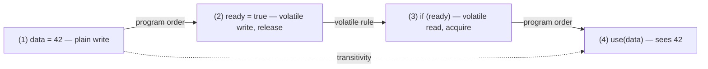
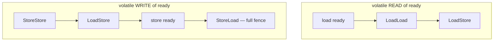
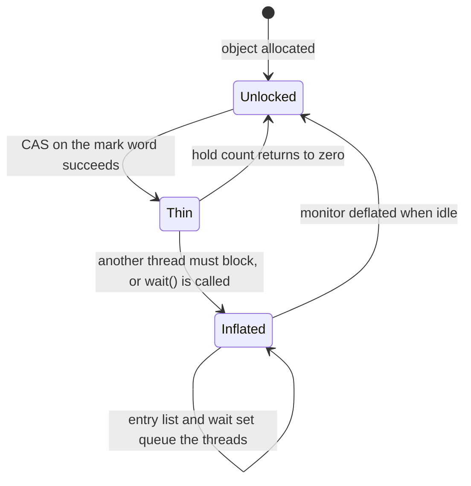

# synchronized, volatile and the Java Memory Model

Eight request-handling threads increment one counter on a shared `Metrics` object, and a ninth
thread sets `stop = true` to shut them down. Two things go wrong that no amount of testing on
your laptop reliably shows. The counter finishes below eight million after eight million
increments, and one worker keeps spinning long after the flag was set. Neither is a bug in the
increment or in the flag; both are the Java runtime doing exactly what the specification permits
it to do. So the question this file answers is this: what does the Java platform actually promise
about one thread seeing another thread's writes, and which part of that promise does each of
`volatile`, `synchronized` and the atomic classes buy you?

The rulebook is the **Java Memory Model** — the chapter of the Java Language Specification (JLS
Chapter 17) that answers two questions and no others. When is a write by one thread guaranteed to be
visible to a read by another thread? And which reorderings may a compiler, a JIT, or a CPU perform?
Its modern form was defined by JSR-133 and shipped in Java 5 (2004). Before that, `volatile` and
`final` had weaker, partly-broken semantics, and code written against the old rules can be wrong
under the new ones.

> [!TIP]
> **Reading map.** About 62 minutes end to end, and it is meant to be read across sittings. The
> nine sections build one chain: happens-before is the currency, and every later section is a
> different way of buying an edge in it. If you already know why `while (!stop)` can hang, start at
> [What it costs: the four barriers, and the one that stalls](#what-it-costs-the-four-barriers-and-the-one-that-stalls).
> If you are here for lock internals, jump to
> [What the JVM does underneath: the mark word and inflation](#what-the-jvm-does-underneath-the-mark-word-and-inflation).
> The two long worked traces — the lost update and the ABA stack — are the load-bearing ones;
> the 64-byte layout arithmetic in False sharing is skippable if you already count cache lines.

---

## The Java Memory Model and happens-before

The memory model gives you exactly one primitive: an ordering edge between two actions that
forces the second one to see the first one's writes. Every tool in this file is a different way of
buying that edge. Go back to the shutdown flag — the ninth thread runs `stop = true` while a
worker runs `while (!stop)` — and if nothing in that program creates an edge between those two
lines, the worker is under no obligation ever to notice.

Think of the edge as a delivery guarantee rather than a stopwatch. The writer packs up everything it
has written so far; the edge is the courier's promise that the reader will receive the package.
Three parts of the picture carry over. The package is every write the writer made before the edge,
not just the one variable. The promise binds the reader, so the reader cannot claim an older state.
And the courier is free to be slow and to repack the box in any order, because the promise is only
about what arrives, never about when it was sent. Where this picture stops working: a real delivery
happens at a moment you could timestamp, and this one does not. Nothing is literally sent anywhere.
The edge is a constraint on which values a read is permitted to return, and a JVM may satisfy it
with no fence instruction at all wherever the hardware already orders those two accesses.

That constraint has a name. When action X **happens-before** action Y, every write X made is
guaranteed visible to Y, and the JVM must not let Y observe a state older than X's. With no such
edge, the reader may see the writer's work, or stale data, or a torn mix of two writes — and the
JIT may reorder both sides freely. So writing correct concurrent Java is one task repeated: make
sure every read you care about has an edge back from the write that produced its value.

Each thread may also keep its own working copy of a variable, in a register, in a store buffer, or
in a per-core cache. The model defines nothing in terms of any of those. It is defined purely as a
partial ordering over memory actions, so a JVM may implement an edge with a cache flush, a fence, or
nothing, and your reasoning stays valid on every machine.

Where does an edge come from? Eight rules answer that one question. The specification splits them
across two sections — JLS 17.4.4 defines the *synchronizes-with* cases, and JLS 17.4.5 the
happens-before clauses built on them — and they sort neatly by who pays for the edge. Two come free
from structure. The program order rule says
that within a single thread, each action happens-before every action later in program order.
Transitivity says that if X happens-before Y and Y happens-before Z, then X happens-before Z —
and that is the rule doing the real work, because it lets one volatile write carry an unlimited
amount of plain data along with it. Four more come from thread control and object lifetime, also
free:

- `Thread.start()` happens-before any action in the started thread.
- Any action in a thread happens-before another thread returning from `join()` on it.
- A call to `interrupt()` happens-before the interrupted thread detecting the interrupt.
- The end of a constructor happens-before the start of `finalize()`.

The two you pay for are the two this file is about. The monitor lock rule: an unlock on monitor M
happens-before every subsequent lock on M. The volatile rule: a write to a volatile field
happens-before every subsequent read of that same field. Those two are the only edges available
between two threads that neither started, joined nor interrupted each other — which is every pair of
workers in a thread pool — so every mechanism in the rest of this file is built out of one of them.

The ordering is *partial*, not total: plenty of action pairs have no edge in either direction. Two
of them are in a **data race** when they touch the same non-final, non-volatile location and at
least one is a write. A program containing a data race is not guaranteed to behave as if its
threads had been interleaved on one core. So reasoning about a racy program by imagining
interleavings is not conservative or approximate — it is invalid.

What the model guarantees instead is the **DRF-SC** theorem, and the initials are worth expanding:
data-race-free implies sequentially consistent. Remove every race from a program and it behaves as
if its threads had been interleaved on a single core after all. The intuitive semantics come back,
as a theorem rather than as a hope.

### Where it breaks: an edge is not a moment in time

Two threads can have an edge between them and still run in the surprising order, because the model
constrains values rather than clocks. If thread A's write to `hits` happens-before thread B's
read, that does not say A's store retired first on the hardware. It says B may not return a value
older than A's. A JIT may reorder any two actions that no edge orders, as long as a single thread
running alone would compute the same answer — and that licence is what makes the shutdown flag
hang in the first place.

The model still refuses to let a racy program invent values. Consider a read of `hits` that returns
`42` when no thread anywhere in the program ever writes `42`. Nothing in the happens-before rules
forbids it directly, because a racy read has no edge to constrain it. So the JLS adds a second
requirement on top. An execution counts as legal only if you can build it up one action at a time.
Every read you add must return a value that some write you already added produced. And every write
you add must be one that could happen without assuming that some data race already occurred — that
is the JLS's own informal statement of the rule.

Try to build the thin-air read under that rule and it stalls. The read returns `42` because the
write of `42` ran; the write ran because the read returned `42`. Neither can be added first, so the
pair can never be committed at all, and an execution nobody can build is not a legal one. The
impossibility of that build order is what "no **out-of-thin-air** values" means concretely. The same
requirement is also why a race can corrupt your arithmetic but cannot hand you a reference to an
object that was never allocated: memory safety survives races, and correctness does not.

One last boundary. Transitivity chains edges, but it does not make *variables* consistent with
each other. If thread A writes `hits` and thread B writes `errors` with no synchronization
between them, a third thread may see the new `hits` and the old `errors` in one glance and the
reverse in the next. Only a shared synchronization action — the same lock, or the same volatile
field — bridges two variables into one ordered story.

> [!KEY-TAKEAWAY]
> Every guarantee in this file reduces to buying a happens-before edge, and every bug in this file
> reduces to a read that has no edge back to the write it needed. When you review concurrent code,
> the useful question is never "is this atomic?" but "which rule created the edge here?" If you
> cannot name the rule, there is no edge.

A missing edge fails in three separate ways — visibility, ordering, and atomicity — and each way
needs a different fix.

---

## Visibility, reordering, and atomicity

Three failures hide behind the single word "thread-safe", and a fix for one of them does nothing
for the other two. Take the counter again: eight threads run `hits++` and the count ends a few
thousand short of 8,000,000. Marking `hits` volatile does not repair that number, because the
broken thing is not whether the threads can see each other's writes.

Each of the three is a different question about the same code:

- Visibility asks whether a write by one thread is observable by another at all.
- Ordering, or reordering, asks whether operations appear to run in the order the source lists them.
- Atomicity asks whether a compound operation runs as one indivisible step.

They are independent, and the tools split along the same three lines. `volatile` buys visibility
and ordering but not atomicity of a compound action. `synchronized` and the atomic classes buy all
three, within the scope they cover — one block for a monitor, one variable for an atomic.

The shutdown flag is the pure visibility failure, and it is worth watching closely because the
usual explanation of it is wrong:

```java
boolean stop = false;            // not volatile

// Thread T
while (!stop) { /* spin */ }     // JIT may hoist to: if(!stop) while(true){}

// Main thread
stop = true;                     // T may never observe this
```

The JIT is allowed to hoist the non-volatile read out of the loop. Nothing in the program creates
an edge into that read, so the compiler can prove that no action in thread T itself changes
`stop`, and it may therefore load `stop` once into a register and test the register forever. The
loop that shipped is not the loop you wrote; it is `if (!stop) while (true) {}`. Marking `stop`
volatile fixes it, because the volatile rule forbids caching the value across the read. Notice
what this explanation did *not* say: it never mentioned a stale cache line. Even on a machine with
no caches at all, the hoist would still happen, because the hoist is a legal compiler
transformation and not a hardware artifact.

Atomicity has its own trap at 64 bits. Per JLS 17.7, writes and reads of `long` and `double` are
permitted to be split into two 32-bit halves on some JVMs. A thread reading a non-volatile `long`
can therefore get a word-torn mix: the high half of one write and the low half of another, a value
no thread ever stored. Declaring the field `volatile` guarantees the full 64-bit access happens as
one step. In practice HotSpot on 64-bit platforms writes them atomically anyway, but the spec only
guarantees it for `volatile`, so a `long` counter you read without `volatile` is portable-by-luck.
Read the condition carefully, because it is easy to sharpen wrongly: JLS 17.7 makes splitting
*implementation-specific*, saying a JVM "is free to perform writes to `long` and `double` values
atomically or in two parts". It is not conditioned on the machine being 32-bit. References are
always read and written atomically, whatever their width.

### Where it breaks: three layers can reorder, and only one is the compiler

Reordering arrives from three places, and blaming the compiler for all of it leads to the wrong
mental model. First the compiler and JIT reorder, as the hoisted flag read just showed. Second the
processor executes out of order, issuing later independent instructions while an earlier one waits
on memory. Third the memory hierarchy reorders after the instruction has already run. A store
sitting in a store buffer is not yet visible to other cores. And an invalidate queue can delay
another core learning that its own copy has gone stale.

How much of that third layer you can observe depends on the chip. x86 implements a relatively
strong model called **TSO** — total store order — in which only store-load reordering is visible
to software: a store followed by a load of a different location can appear to swap. ARM and POWER
are weakly ordered and expose far more, including store-store and load-load reordering that x86
never shows you. That gap is why a data race can pass every test on a developer laptop and fail on
an ARM server running the same bytecode.

The memory model exists precisely so you never have to enumerate that list per platform. You reason
in happens-before edges; each JVM port translates your edges into whatever fences its chip requires.
Code that is correct under the model is correct on every supported machine. Code that relies on x86
happening to be strict is correct nowhere in particular.

> [!WARNING]
> The most common story about `while (!stop)` is that thread T is reading a stale cached copy and
> that `volatile` "flushes the cache". Both halves are wrong. The read was deleted, not stale — it
> happened once, before the loop — and `volatile` fixes it by removing the compiler's licence to
> delete it, not by issuing a flush. Believing the cache story leads people to "fix" visibility
> bugs with a `Thread.sleep()` or a log line in the loop, which happens to defeat the hoist and
> leaves the program still racy.

`volatile` is the cheapest way to buy the missing edge, so it is worth knowing exactly which of
the three failures it repairs and which it leaves alone.

---

## volatile

Marking a field `volatile` buys two of the three guarantees outright and the third only for a
single access. Declare `volatile boolean stop` and the shutdown loop terminates; declare
`volatile int hits` and `hits++` still loses counts under eight threads. That asymmetry is the
whole content of the keyword, and it is worth stating as three separate promises.

1. Visibility — a read always sees the most recent write, because the volatile rule puts a
   happens-before edge between that write and every later read of the field.
2. Ordering — reads and writes of the volatile are not reordered with each other, and they act as
   barriers for the plain operations around them.
3. Atomicity of one read or one write, including a 64-bit `long` or `double`.

What it does not give you is atomicity of a compound action: `count++`, which is a
read-modify-write, or `if (x == null) x = ...`, which is a check-then-act.

```java
volatile int v;
v++;   // NOT atomic: load v, add 1, store v — lost updates under contention
```

Say `v == 5` and threads A and B each run `v++` once. `v++` is three steps: load, add 1, store.
`volatile` makes each individual load and store visible and indivisible, but it does not fuse the
three into one step, so this interleaving is legal:

```
time  Thread A            Thread B            v (in memory)
 t1   load v -> 5                             5
 t2                       load v -> 5         5     <- B reads BEFORE A stores
 t3   add 1  -> 6                             5
 t4                       add 1  -> 6         5
 t5   store 6                                 6
 t6                       store 6             6     <- B overwrites with its stale 6
```

Two increments happened and the final value is `6`, not `7`. One update was lost. Visibility did
not help, and could not: B's load at t2 read a legitimately fresh `5`, because at t2 the value in
memory really was `5`. The race lives in the gap between B's load and B's store, and no visibility
guarantee says anything about a gap.

Run the same interleaving through `AtomicInteger.incrementAndGet()` and the gap closes, because
the store now refuses to land if the value moved underneath it:

```
time  Thread A                        Thread B                        v
 t1   load v -> 5                                                      5
 t2                                    load v -> 5                     5
 t3   CAS(expect 5, set 6) -> OK                                       6
 t4                                    CAS(expect 5, set 6) -> FAIL (v is 6, not 5)
 t5                                    retry: load v -> 6              6
 t6                                    CAS(expect 6, set 7) -> OK      7
```

B's first attempt fails because `v` is no longer the `5` it expected, so B re-reads and retries
against the current value. Final result `7`. That retry-on-conflict is precisely the atomicity
`volatile` lacks, and the next section takes the mechanism apart.

The ordering half of `volatile` is the more useful half, and it has a name. Since JSR-133 a
volatile write acts as a *release* and a volatile read as an *acquire*. Everything a thread wrote
before a volatile write becomes visible to any thread that afterwards reads that same volatile —
including the plain, non-volatile fields:

```java
int data;                 // plain
volatile boolean ready;   // guard

// Writer
data = 42;                // (1)
ready = true;             // (2) volatile write — release

// Reader
if (ready) {              // (3) volatile read — acquire
    use(data);            // (4) guaranteed to see 42
}
```

Trace the edges rather than trusting the picture. Line (1) happens-before (2) by program order.
Line (2) happens-before (3) by the volatile rule. Line (3) happens-before (4) by program order
again. Transitivity chains all three, so (1) happens-before (4) and the plain write of `data` is
guaranteed visible. One volatile boolean carried an arbitrary amount of ordinary data across the
thread boundary for the price of one flag — which is why this piggybacking is the single most
useful volatile idiom.



The chain only holds in that shape. If the reader tests a *different* volatile than the one the
writer set, or reads `data` before testing `ready`, edge (2)→(3) never exists and `data` is racy
again. Piggybacking is a property of the pair of accesses to one field, not a property of the
field.

Three gotchas follow directly from "the guarantee attaches to the field access, nothing more".
Marking an array reference volatile makes the *reference* volatile and leaves every element plain,
so use `AtomicIntegerArray` or a `VarHandle` when you need element-level volatile semantics. A
compound check such as `v == 5 && v < limit`, built from two separate volatile reads, is not atomic
— the value can change between them. And `volatile` on a reference to a mutable object says
nothing about that object's internal state; you get an ordered view of the pointer, not of what it
points at.

### What it costs: the four barriers, and the one that stalls

A **memory barrier**, also called a fence, is an instruction that forbids the compiler and the CPU
from moving certain memory operations across it. It computes nothing. On x86 the full form is
`mfence` or a dummy `lock addl`, and its only effect is to constrain what may be reordered around
it. Four named barriers each pin one before-after pair:

| Barrier | What it pins | Why you want it |
|---|---|---|
| LoadLoad | a load before it completes before any load after it | no later read gets hoisted above the barrier |
| LoadStore | a load before it completes before any store after it | a later write cannot jump ahead of an earlier read |
| StoreStore | a store before it becomes visible before any store after it | the plain writes you did first land first — this is what makes piggybacking work |
| StoreLoad | a store before it becomes visible before any load after it | a later read cannot be satisfied from before the store |

Where each one goes is not folklore. Doug Lea's *JSR-133 Cookbook for Compiler Writers* holds the
barrier table JVM implementers work from, and it asks for four placements. After each volatile
load: LoadLoad and LoadStore. Before a volatile store whose preceding action is a plain store:
StoreStore. Before a volatile store whose preceding action is a plain load: LoadStore. And after
each volatile store: StoreLoad.

Read the model and the recipe as two different objects. The JMM requires an *ordering*. The
Cookbook's barriers are one conservative way to get that ordering, so a JVM may use fewer of them
wherever the hardware already guarantees the order it needs. Its own table for x86 lists LoadLoad,
LoadStore and StoreStore as no-ops, needing `mfence` or a lock-prefixed instruction only for
StoreLoad. Conformance there, in the Cookbook's words, "amounts only to placing a StoreLoad barrier
after volatile stores", so a volatile *read* on x86 emits no barrier instruction at all.



StoreLoad is the expensive one, and the reason is mechanical. A store that has retired may still be
sitting in the core's **store buffer**. That buffer is a small queue that lets the core keep
executing while the write makes its way to cache. StoreLoad has to drain it. Every pending write
must reach cache before the next load may proceed, so the pipeline stalls for as long as the drain
takes. Nothing equivalent happens on the read side, where the barriers only forbid reordering. That
single asymmetry is why a volatile write costs materially more than a volatile read. It is also what
orders a volatile write against a later volatile read of a *different* variable.

> [!TIP]
> The cost asymmetry is a design tool, not trivia. Volatile is at its best where reads vastly
> outnumber writes — a config reference swapped once an hour and then read by every request, or a
> `stop` flag written once at shutdown. The keyword is at its worst as a hot counter, where you pay
> the full fence on every single increment and still do not get atomicity. The Cookbook makes the
> same trade explicitly: it places the StoreLoad after the write rather than before every read,
> because reads greatly outnumber writes in typical programs.

Atomicity is the guarantee `volatile` cannot supply, and the atomic classes supply it without ever
taking a lock.

---

## synchronized, monitors, and reentrancy

`synchronized` buys two guarantees at once, and that pairing is why it fixes bugs `volatile` cannot.
Wrap `hits++` in `synchronized (lock)` and the eight threads reach exactly 8,000,000: one thread at
a time is inside the block, so no two loads can straddle each other's stores. That is mutual
exclusion, the first of the two. The second is visibility — an unlock happens-before every later
lock on the same object, so whatever a thread wrote inside the block is visible to the next thread
that enters it, volatile or not.

The object whose lock you take is called its **monitor**: the per-object intrinsic lock, together
with two queues the JVM keeps for it. Every Java object has one. There are three ways to name it,
and the third one catches people:

```java
synchronized (lockObject) { ... }   // block on an explicit monitor
synchronized void m() { ... }        // instance method -> locks 'this'
static synchronized void s() { ... } // static method -> locks the Class object
```

A static synchronized method locks the `Class` object, not any instance. So an instance
synchronized method and a static synchronized method on the same class use two different monitors
and do not exclude each other at all — a pair of methods that both look guarded can run
simultaneously.

Monitors are reentrant, which matters as soon as one synchronized method calls another. A thread
already holding monitor M can acquire M again without deadlocking itself. The JVM tracks a hold
count: each entry increments it, each exit decrements it, and the lock is released only when the
count returns to zero. Without reentrancy, a subclass method calling `super.method()` under the
same lock would deadlock against itself, which is why the language made this choice rather than
leaving it to the programmer.

Which object you lock is the whole safety property, and locking the wrong one gives you no
exclusion while looking exactly like code that does. Locking on an `Integer`, `Boolean` or
`String` is the classic failure: those are interned or cached, so unrelated code elsewhere in the
process may be locking the very same object, and small `Integer` values are shared process-wide.
Reassigning the lock field is the other failure, because two threads then synchronize on two
different objects and both proceed. The habit that avoids both is one line:
`private final Object lock = new Object();` — private so nobody else can lock it, final so nobody
can swap it.

Monitors also carry the platform's built-in waiting mechanism. `wait()`, `notify()` and
`notifyAll()` are defined on `Object` rather than on `Thread`, because the thing you wait on is the
monitor. They must be called while holding that object's monitor, and throw
`IllegalMonitorStateException` if they are not. `wait()` releases the monitor while it waits — that
is the point of it, since otherwise no other thread could ever change the condition — and
reacquires it before returning.

```java
synchronized (lock) {
    while (!condition) lock.wait();   // never 'if' — spurious wakeups + missed signals
    ...
}
```

> [!WARNING]
> "`wait()` returns, therefore the condition is now true" is the belief that makes this
> loop look redundant, and it is false for two independent reasons. First, `notifyAll()` wakes every
> waiter but only one of them can reacquire the monitor; by the time the third one runs, the first
> may already have consumed the thing they were all waiting for, so the condition is false again.
> Second, the `Object.wait()` specification permits a thread to wake "without being notified,
> interrupted, or timing out, a so-called *spurious wakeup*". It gives no cause for that, and it
> does not need to: it says the case is rare in practice and that applications must guard against it
> regardless. Note also that the first reason is worse than it looks, because a woken thread has to
> win the monitor back like any other thread, so its return can be delayed arbitrarily while others
> run. With `if`, both cases fall straight through into code that assumes a condition that does not
> hold. With `while`, both cases simply wait again.

### What the JVM does underneath: the mark word and inflation

Every HotSpot object carries a header made of a mark word plus a class pointer, and lock state lives
in the first of those — the *mark word*, 64 bits on a 64-bit JVM. When the object is unlocked, that
word holds its identity hash code once something has asked for one, some garbage-collector
bookkeeping such as the object's age, and two low tag bits. Those two bits are the state machine. HotSpot's `markWord.hpp`
spells the encoding out: `01` means lock-neutral, so the object has no monitor and is not locked;
`00` means fast-locked; `10` means the object has a monitor and the lock state is recorded there;
`11` means a collector has swapped the header out to mark or forward the object. The mark word is
the single place a thread looks to find out whether it may walk into a `synchronized` block, so
making that lookup cheap is what the three lock states are for.

| State | What the mark word holds | When HotSpot uses it | Cost to enter |
|---|---|---|---|
| Thin / lightweight (`00`) | that the object is fast-locked; which thread owns it is tracked outside the header, and older HotSpot releases instead displaced the header into a lock record on the owning thread's stack | no other thread is contending | one successful CAS on the mark word, no operating-system involvement |
| Fat / heavyweight (inflated, `10`) | that the object has an `ObjectMonitor`, with the lock state held in that monitor rather than in the header | a thread had to block, or someone called `wait()` | a CAS, then possibly parking the thread through the OS |
| Biased (historical) | the owning thread's identity plus an epoch | one thread locked the same object over and over | no CAS at all after the first acquisition |

Biased locking existed to delete the CAS entirely in the common single-threaded case: once an object
was biased toward a thread, that thread re-entered by comparing the mark word against its own
identity. It paid for that with what JEP 374 calls "an expensive revocation operation in case of
contention", so it only came out ahead in code doing large amounts of uncontended synchronization —
the legacy collections that lock on every access, `Hashtable` and `Vector`. JEP 374 retires it for
two reasons in its own words. The gains "seen in the past are far less evident today", because
current code reaches for unsynchronized or concurrent collections instead, and thread-pool designs
"generally perform better with biased locking disabled". And the implementation "introduced a lot of
complex code into the synchronization subsystem", which blocked design changes there. So JEP 374
disabled it by default in JDK 15 and deprecated the options, and JDK-8256425 deleted the
implementation in JDK 18. The `-XX:+UseBiasedLocking` flag outlived the code it controlled by one
release: JDK 18 still accepts it, ignores it and warns, and JDK 19 rejects it outright. On any
current JDK there are two states, not three.

**Inflation** is the transition into the heavyweight state: HotSpot allocates an `ObjectMonitor`
and rewrites the mark word to point at it. That structure is what a thin lock lacks and what makes
blocking possible, because it owns two queues. The *entry list* holds threads that tried to enter
the block and could not. The *wait set* holds threads that called `wait()`, released the monitor,
and are waiting to be told to try again. `notify()` moves one thread from the wait set to the entry
list; `notifyAll()` moves all of them. Neither hands over the monitor — a woken thread still has to
win the lock like anyone else, which is exactly why the `while` loop above is not optional.

Two events force inflation. One is genuine contention: a thread finds the mark word already owned,
spins briefly, and then needs somewhere to park, which requires a monitor with an entry list. The
other is calling `wait()`, which needs a wait set to be parked in, so it inflates even with no
contention at all. Inflation is one-way in practice for the object's useful lifetime; HotSpot can
deflate an idle monitor, but you cannot count on that inside a hot path.



Treat the encoding as version-specific and the three states as the stable shape. The biased-locking
row above is exactly the kind of detail that a release note deletes, and the bit layout of the mark
word has been revised more than once for reasons that have nothing to do with locking.

### What the JIT is allowed to do: roach motel, coarsening, elision

The compiler may move your code *into* a `synchronized` block but never out of it, and two useful
optimizations fall out of that one rule. Goetz's name for it is **roach-motel ordering**: actions
can check in, but they can't check out. A statement sitting just before the block may be sunk
inside it; a statement just after may be hoisted inside; a statement already inside may not be
lifted out in either direction.

The asymmetry is not arbitrary. Moving an action out of a block would let it run while the lock is
not held, which could break another thread's mutual exclusion. Moving one *in* only ever shrinks the
window in which that action is unprotected, so it can never turn a correct program into an
incorrect one. The JMM licenses exactly the safe direction.

Lock coarsening cashes that licence in. When the JIT sees two `synchronized` blocks on the same
lock separated by a little code, it may merge them into one larger block, deleting an unlock and a
relock. Three calls to a synchronized `append()` in a row become one locked region. You get fewer
lock operations, and you pay for it by holding the lock across the code in between — which is
harmless for arithmetic and unhelpful if that code blocks.

Lock elision goes further and deletes the lock entirely. Escape analysis is the JIT pass that asks
whether a newly allocated object can ever be reached by another thread. If it proves the answer is
no — the object is created in a method, never stored into a field, never returned, never passed
somewhere that publishes it — then no other thread can contend for its monitor, so locking it cannot
synchronize with anything. The lock and unlock are removed. Elision is why a local `StringBuffer`
inside one method costs roughly what a `StringBuilder` costs, even though every one of its methods
is declared `synchronized`: the synchronization is real in the bytecode and gone in the compiled
code.

Both optimizations depend on the JIT seeing the whole picture, and both stop applying the moment the
lock escapes. The dependence on escape analysis is worth knowing when you benchmark: a
microbenchmark whose lock object is local can measure a cost of nearly zero for synchronization that
is expensive in the real caller.

### Where it breaks: two locks, opposite orders

Two threads that each need both of two locks, and take them in opposite orders, wedge the process
permanently. Lock-order deadlock is the most common `synchronized` failure in real systems, and it
needs no unusual timing to happen — just two code paths written by two people:

```
Thread 1: synchronized(A) { ... synchronized(B) { ... } }
Thread 2: synchronized(B) { ... synchronized(A) { ... } }
```

Interleave them. T1 takes A. T2 takes B. T1 asks for B, which T2 holds, and blocks. T2 asks for A,
which T1 holds, and blocks. Each holds what the other needs and neither will let go, because a
thread blocked on `monitorenter` — the bytecode a `synchronized` block compiles to — is not running
any code that could release anything.

What makes this final rather than merely slow is a property of the keyword itself. `synchronized`
has exactly one acquisition mode: block until you own the monitor. There is no form that gives up
after 50 ms, no form that returns a boolean saying "someone else has it", and no form that a
`Thread.interrupt()` can pull out of the queue. So the two threads cannot detect the cycle, cannot
back off, and cannot be rescued from outside — no timeout expires, and the JVM does not break
deadlocks. A thread dump will show you the cycle; nothing will dissolve it.

That leaves prevention as the only cure available inside the keyword. Impose a global lock order:
every thread that needs both locks takes them in the same sequence, always A before B, so the cycle
cannot form. Where the objects have no natural order, order them by something stable such as
`System.identityHashCode`, or assign each lock a fixed tier number and forbid taking a lower tier
while holding a higher one. A lock order is a discipline, not a mechanism — nothing in the language
enforces it — but it is the only fix that works with `synchronized` alone.

The `java.util.concurrent.locks` package, added in Java 5, is where the missing acquisition modes
live. A `ReentrantLock` gives you the same mutual exclusion and the same happens-before edge as a
monitor, plus the one thing the keyword withholds: the ability to *fail*. It offers three of them.
`tryLock` returns false immediately when the lock is held. `ReentrantLock.tryLock(timeout)` gives up
after a timeout you name. And `lockInterruptibly` responds to interruption. With a timed attempt
available, the deadlock above becomes recoverable rather than terminal: a thread that cannot get the
second lock releases the first and retries. A
`ReentrantLock` also offers a fairness policy, and several wait sets on one lock — each one a
`Condition` object — instead of the single wait set a monitor has. `ReadWriteLock` and `StampedLock`
sit alongside it, each giving up some part of strict mutual exclusion so that readers can run
together. You pay for all of it in two ways. The unlock is now yours to remember, so every
acquisition needs a `try/finally` around it. And a forgotten `unlock()` leaks the lock forever,
where a `synchronized` block could not. Take `synchronized` when the block is short and the failure
mode is "wait your turn". Reach for an explicit `Lock` when a thread has to be able to walk away.

A lock is not the only way to make a compound update indivisible, and the alternative never blocks a
thread at all.

---

## Atomic classes and CAS

The atomic classes make a read-modify-write indivisible without ever suspending a thread. Replace
`volatile int hits` with an `AtomicInteger` and the eight threads reach 8,000,000 with no lock, no
blocking and no `synchronized` block anywhere. `java.util.concurrent.atomic` arrived in Java 5
with `AtomicInteger`, `AtomicLong`, `AtomicBoolean` and `AtomicReference`, plus array variants and
field updaters.

```java
AtomicInteger n = new AtomicInteger();
n.incrementAndGet();      // atomic read-modify-write
```

The field-updater variants look redundant next to `AtomicInteger`, and they are not.
`AtomicIntegerFieldUpdater` is a reflection-based utility that performs atomic updates on a
designated `volatile int` field of a designated class, named as a string at construction. One
`static` updater serves every instance of that class, so the objects themselves each carry a plain
`int` field rather than a reference to a separate `AtomicInteger`. Its javadoc gives the design
intent as "atomic data structures in which several fields of the same node are independently subject
to atomic updates". The field must be a `volatile int` and must be accessible to the caller under
ordinary Java access control, both checked when `newUpdater` runs. The price is a genuinely weaker
guarantee, stated in the javadoc: `compareAndSet` here is atomic only with respect to other
`compareAndSet` and `set` calls made through the same updater, not with respect to every change to
the field. A plain `AtomicInteger` field is clearer everywhere the object count does not force your
hand.

Underneath every one of these classes is one hardware operation. **CAS** — compare-and-swap — takes
a location, the value you expect to find there, and the value you want to write. It writes only if
the location still holds the expected value, and it tells you which happened. Compare, then write or
report failure: that is the whole primitive, and the retry loop from the previous section is how you
build anything larger out of it:

```java
int prev, next;
do {
    prev = value.get();
    next = prev + 1;
} while (!value.compareAndSet(prev, next));  // retry on contention
```

CAS is *optimistic*: a thread assumes it will not be interfered with, does the work, and finds out
at the last instant whether it was right. Nothing blocks; a loser simply reads the new value and
tries again. It maps directly to hardware — `cmpxchg` on x86, a load-linked / store-conditional
pair on ARM — which is why the whole scheme costs a handful of instructions rather than a trip
through the operating system.

Atomic reads and writes also carry exactly the happens-before guarantees of `volatile`, because the
backing field literally is one: `AtomicInteger` declares `private volatile int value`. So an atomic
is a volatile field plus indivisible read-modify-write, and you can piggyback plain data on an
atomic write the same way you piggyback it on a volatile write.

One caution about reading the source. The loop above is a `compareAndSet(expected, expected+1)` in
shape, but `incrementAndGet()` does not call `compareAndSet` at all: since Java 8 its body is
`U.getAndAddInt(this, VALUE, 1) + 1`, delegating to an intrinsic. HotSpot may compile that intrinsic
to a single atomic add instruction where the hardware provides one, rather than to the loop above.
The retry loop is the right model for reasoning about the *semantics* — a losing thread does observe
a changed value and does redo its work — but do not expect to find it in the call path.

Contention changes which of these facts matters. Under heavy write pressure the CAS loop stops being
free: every failure means a re-read and a redo, and with enough threads on one location most
attempts fail, so throughput collapses while every core stays busy. `LongAdder` and `DoubleAdder`
(Java 8) answer that by refusing to keep the count in one place. A `LongAdder` spreads its value
over an array of *cells*, and `increment()` picks one cell — chosen by a per-thread probe value — and
CASes only that. With N cells, threads on different cores rarely collide, so almost nothing retries.
The array is not fixed either. It starts at two entries on the first failed CAS and doubles as
contention continues, stopping at the nearest power of two at least as large as the machine's CPU
count. The striping therefore grows to fit the contention it actually meets.

You pay for that in the read. `sum()` must add all N cells, and it is not an atomic snapshot: it
reads cell 0, then cell 1, and so on, while other threads keep updating cells it has already passed.
The total is therefore approximate whenever writers are active, and becomes exact once they stop. So
`LongAdder` fits a metrics or throughput counter you increment constantly and scrape once a second,
and `AtomicLong` fits a value you must read exactly — a remaining-capacity count you make decisions
against, for instance.

### Where it breaks: the value came back

CAS compares a value, not a history, so a location that changes A→B→A looks untouched to it. That
gap has a name — the **ABA problem** — and on a plain reference it is not a theoretical concern;
it silently corrupts lock-free data structures. Here is a stack whose top is an `AtomicReference`,
where `pop()` reads `top` and then does `CAS(top, oldTop, oldTop.next)`. Start with `A -> B -> C`,
so `top = A` and `A.next = B`:

```
Thread 1: reads top = A, computes A.next = B, is about to CAS(top, A, B) ... then STALLS
Thread 2: pop() -> top now B    (removed A)
Thread 2: pop() -> top now C    (removed B; B is recycled/free)
Thread 2: push(A) -> top now A again, and sets A.next = C   (stack is now A -> C)
Thread 1: wakes, runs CAS(top, A, B): top IS A, so CAS SUCCEEDS
          -> top is set to B, but B was already popped and is garbage!
```

Every CAS in that trace succeeded and the stack is wrecked: `top` now points at a node that was
removed. Thread 1's comparison was against the reference it read, and that reference is genuinely
back in place — the CAS had no way to know the three operations in between ever happened. The
corrupting value is `B`, a stale *field* Thread 1 read before it stalled, rather than the value it
compared.

`AtomicStampedReference` closes the gap by giving CAS something that cannot come back: a reference
paired with an `int` stamp that every update increments. Thread 1 reads `(A, stamp=10)`. Thread 2's
three operations take the stamp to `13`. Thread 1's `compareAndSet(A, B, 10, 11)` now fails on the
stamp, because `13 != 10`, and the failure forces the re-read that turns silent corruption into an
ordinary retry. The numbers here are illustrative — what matters is that the stamp is monotonic, so
returning the reference to `A` cannot return the stamp to `10`. `AtomicMarkableReference` is the
one-bit version, for when you need to flag a node rather than count its revisions.

### The version-specific truth: access modes and fences since Java 9

`volatile` gives you one strength of access, and hardware offers at least four. `VarHandle`
(Java 9, JEP 193) exposed the whole range in the standard library, replacing the
`sun.misc.Unsafe` reflection that libraries had been using unofficially. A single `VarHandle` on a
field offers `get` and `set` for plain access, then `getOpaque`, `getAcquire` and `setRelease`,
`getVolatile`, and `compareAndSet` — the C11-style access-mode spectrum, on ordinary Java fields.
(There is no `getPlain`: plain access is what `get` and `set` already mean. The only `Plain`-named
method on the class is `weakCompareAndSetPlain`.)

The mode worth understanding first is the one with no `volatile` equivalent. An **opaque** access
promises three things. It is bitwise atomic. It is "coherently ordered with respect to accesses to
the same variable", in the javadoc's words, so two opaque accesses to one field cannot be reordered
with each other. And it happens "in program order", which is the clause that matters for the
shutdown flag: an opaque read cannot be deleted or hoisted out of the loop the way the plain read
was. Doug Lea's write-up on the modes states the matching progress guarantee, that an opaque write
eventually becomes visible; the `VarHandle` javadoc itself stops at atomicity, coherence and program
order.

What opaque does *not* buy is any ordering against accesses to *other* variables. So it would fix
the shutdown loop, and it would not make the piggyback pattern work: `data = 42` before an opaque
write of `ready` is not ordered with it. Acquire and release are the modes that add exactly that
cross-variable ordering, and volatile adds the StoreLoad fence on top. Each rung up the ladder buys
more ordering and costs more, and opaque is the rung for code that needs progress without
ordering.

The same API also exposes the barriers themselves. JEP 171 added fence intrinsics to the JDK in Java
8, reachable at first only through `sun.misc.Unsafe`. Java 9 published them as static methods on
`VarHandle`. There, `fullFence()` is the strongest: no load or store before it may be reordered with
any load or store after it. `acquireFence()` stops loads before it being reordered with loads *and*
stores after it. That is LoadLoad plus LoadStore: exactly the pair the Cookbook puts after a
volatile read. `releaseFence()` stops loads and stores before it being reordered with stores after
it. That is LoadStore plus StoreStore, the pair the Cookbook puts before a volatile write. And
`loadLoadFence()` and `storeStoreFence()` are the two narrow barriers on their own. They let a
library author put a barrier where no field access naturally sits. Building a lock-free queue is the
usual case: the ordering you need is between two arrays rather than around one volatile field.

> [!WARNING]
> "Lock-free means faster" is the wrong reading of these guarantees. Lock-freedom is a
> *progress* property: the system as a whole always makes progress, because no thread's suspension
> can block another. Lock-freedom is not wait-freedom, which would promise that *each individual*
> thread finishes in a bounded number of steps — and a CAS loop gives you no such promise, since one
> unlucky thread can lose every race indefinitely. Nor is it a speed claim: under extreme contention
> a lock can outperform a spinning CAS loop, because the lock parks the losers and stops them
> burning cache bandwidth on retries, while the CAS loop keeps every core fighting over one line.

The `synchronized` block and the CAS loop both assume the value already exists; lazily creating it
the first time it is asked for reopens the ordering problem in its most famous form.

---

## Double-checked locking

Double-checked locking pays for the lock only on the first call and gets away with it only because
one keyword is present. Read `instance` without a lock; if it is null, take the lock and read it
again before creating anything. The second read is what stops two threads both constructing, and the
`volatile` is what stops a third thread seeing a half-built object:

```java
class Holder {
    private volatile Singleton instance;          // volatile is MANDATORY
    Singleton get() {
        if (instance == null) {                   // 1st check (no lock)
            synchronized (this) {
                if (instance == null) {           // 2nd check (locked)
                    instance = new Singleton();
                }
            }
        }
        return instance;
    }
}
```

The reason `volatile` is not optional is that `instance = new Singleton()` is three operations, not
one. The JVM allocates memory, runs the constructor to fill in the fields, and writes the reference
into `instance`. Those last two are independent as far as a single thread can tell — a thread that
runs both sees the same result either way — so without `volatile` the compiler may reorder them and
publish the reference before the constructor finishes. Note the hedge: it *may*, not it *does*, which
is why this bug ships and survives testing.

Now follow the second thread. It reaches the first check, finds `instance` non-null, skips the lock
entirely, and returns. What it returns is a reference to an object whose constructor has not run:
its `int` fields still read `0`, its reference fields still read `null`, and any invariant the
constructor was supposed to establish does not hold. There is no exception and no null pointer —
just an object that is wrong. A half-built object is the famous reason DCL was broken before Java 5,
when `volatile` carried no ordering guarantee for the surrounding plain writes and there was no
correct way to write the idiom at all.

Since JSR-133 the fix is exactly the piggyback pattern from earlier. The volatile write of `instance`
is a release, so every write the constructor made is ordered before it. The first check is a volatile
read and therefore an acquire, so a thread that sees a non-null reference is guaranteed to see the
constructor's writes too. The same transitive chain that carried `data = 42` carries an entire
object.

> [!WARNING]
> The tempting reading is that the `synchronized` block is doing the safety work and the
> `volatile` is belt-and-braces. The dependency runs the other way around for the failing thread.
> The thread that gets hurt never enters the block — it returns on the first check, having taken no
> lock at all — so the monitor's happens-before edge is not available to it. Only the volatile read
> in that first check gives it an edge back to the constructor. Delete the `volatile` and the code
> still looks synchronized, still passes tests, and is broken on the path that skips the lock.

### What it costs: three ways to be lazy, and which one to reach for

DCL costs you a `volatile` read at every single call, plus an idiom with two silent failure modes:
drop the `volatile` and a caller can be handed a half-built object, drop the second check and two
threads can both construct one. Two alternatives get the same laziness for less, and the first is
usually the right answer. The initialization-on-demand holder idiom pushes the whole problem onto
the class loader:

```java
class Singleton {
    private Singleton() {}
    private static class Holder { static final Singleton INSTANCE = new Singleton(); }
    static Singleton getInstance() { return Holder.INSTANCE; }   // lazy + thread-safe
}
```

Why that is safe needs one fact about the JVM rather than about the memory model. Class
initialization is itself synchronized by the JVM: JLS 12.4 requires that a class's static
initializers run exactly once, and that any thread which observes the class as initialized also
observes everything the initializer wrote. The JVM acquires a per-class initialization lock to
guarantee it. And a nested class is not initialized until something first touches it, so `Holder`
does not load until the first `getInstance()` call. You get laziness from the class loader and
ordering from JLS 12.4, with no `volatile`, no explicit lock, and nothing to mistype.

An `enum` singleton is the shortest form of all, and it adds serialization safety for free: the
language guarantees an enum constant is created once per class loader, and deserialization returns
the existing constant instead of building a second one. Its cost is that it is not lazy in any
useful sense once anything references the enum type, and that an enum cannot extend a class.

The one micro-optimization worth knowing applies to DCL itself. Read the volatile field into a local
variable once, and return the local:

```java
Singleton get() {
    Singleton local = instance;          // one volatile read
    if (local == null) {
        synchronized (this) {
            local = instance;
            if (local == null) instance = local = new Singleton();
        }
    }
    return local;                        // no second volatile read
}
```

The original reads `instance` twice on the fast path: once in the check, once in the `return`. Each
of those is a volatile read, and the JIT may not fold the two together. Hoisting into a local halves
the count. The saving is genuinely small. What it shows is that a volatile read has a name and a
place in the compiled code, rather than being free.

Immutable objects avoid this whole problem, because `final` fields carry a publication guarantee that
needs neither a lock nor a volatile.

---

## final field semantics

A `final` field comes with a memory-model guarantee that no other field has: it survives publication
through a data race. Hand a `Point` with `final int x, y` to another thread through a plain,
unsynchronized field and the receiving thread still sees `x` and `y` correctly set. A final field is
the only thing in this entire file that a race cannot damage, and it is why immutability counts as a
concurrency technique rather than a style preference.

Start with the ordinary meaning. A `final` field must be assigned exactly once, in the constructor,
in a field initializer, or in an instance initializer block. The compiler enforces it, and every
subsequent read in the program gets that one value.

JSR-133 added the second meaning, and JLS 17.5 states it. Suppose an object is *properly
constructed*, which here means one specific thing: the `this` reference does not escape the
constructor. Then any thread that sees a reference to that object is guaranteed to see the
correctly initialized values of its `final` fields. No synchronization of any kind is required, and
the guarantee holds even if the reference reached that thread through a race.

```java
class Point {
    final int x, y;
    Point(int x, int y) { this.x = x; this.y = y; }
}
// A thread reading a Point reference (even unsafely published) sees x,y correctly set.
```

The mechanism is a single ordering constraint, and naming it makes the rest of this section
predictable. Semantically the JMM inserts a *freeze* action for each final field at the end of the
constructor, and forbids any reordering that would let another thread see the pre-freeze value —
which for `int x` is `0` and for a reference is `null`. Implementations get that by placing a
StoreStore barrier between the final-field writes and the publication of the reference; the
JSR-133 Cookbook writes the required shape as `x.finalField = v; StoreStore; sharedRef = x;`. So the
guarantee is not magic and not a special case bolted on: it is the piggyback pattern again, with the
constructor's end playing the part of the volatile write, arranged by the compiler instead of by you.

The freeze is what makes an all-`final`, no-escape immutable object safe to publish any way you
like, and `String`, `Integer` and the other immutable library types depend on it. The same guarantee
is why a defensive-copy-and-share design scales: no reader needs a lock, so no reader contends.

### Where it breaks: the constructor that leaked itself

Every part of the guarantee hangs on the freeze happening before publication, so anything that
publishes the reference *during* construction voids it. Two shapes do this and both look innocent.
Registering `this` in a static registry from inside the constructor hands out the reference while the
field writes are still in flight. Starting a thread from inside the constructor, where the new thread
touches `this`, does the same. In both cases another thread can hold the reference before the freeze,
and it may then read a `final int` as `0`.

*Properly constructed* is the phrase JSR-133 and the concurrency literature use for this; the
specification's own wording is *completely initialized*. Either name means precisely one thing and
nothing broader: the reference did not become reachable from another thread before the constructor
ended. It says nothing about whether the constructor threw, and nothing about whether every field
holds a value that makes sense. The standard fix is to publish after construction:
build the object, then register it, in the caller.

The guarantee is also narrower than "everything reachable is safe". For a `final` reference to a
*mutable* object, only the reference itself and the values reachable through final fields at
construction time are covered. A `final List` field is guaranteed to point at the same list; the
list's contents get no protection at all, and a mutation made after construction needs the same
ordinary synchronization as any other shared write. An immutable wrapper around a mutable interior is
not immutable in the sense this section is about.

One boundary is genuinely treacherous, and not for the reason you would guess. Mutating a `final`
field reflectively, with `setAccessible(true)` and `Field.set`, is undefined territory with respect
to these guarantees — but the specification does not simply ignore it. JLS 17.5.3 adds a freeze
immediately after each reflective modification too, exactly as it does at the end of a constructor.
What it withholds is the reader's half. The rules that let a read see a frozen value are written for
a reader that reaches the object through a reference published after the freeze, so a thread already
holding the reference may keep seeing the old value indefinitely, and no amount of synchronization on
its side changes that. Do not build anything on it.

> [!TIP]
> The practical rule that falls out of this section is short enough to apply during review.
> Check three things: every field is `final`, every field's type is itself immutable or defensively
> copied, and `this` never leaves the constructor. An object that passes all three needs no
> synchronization ever, on any path, in any number of threads. Break any one of them and it needs
> the same care as any other shared mutable state. The cases worth hunting are the ones that satisfy
> two of the three: an all-`final` class that hands out its mutable interior, or an
> immutable-looking class whose constructor registers itself somewhere.

Correctness is settled at that point. What remains is a performance failure in which two
independent, correctly synchronized variables sabotage each other.

---

## False sharing

Two threads can slow each other to a crawl while sharing no variable at all. Give thread A its own
counter and thread B its own counter, declare the two next to each other in the same object, and the
pair runs slower than one thread alone. The cause is that the CPU does not move memory one variable
at a time. It moves it in a **cache line**: a fixed-size block, commonly 64 bytes, which is the
smallest unit the coherence hardware knows how to own.

That granularity is where the trouble starts. Cache coherence works per line: when a core writes to
a line, every other core's copy of that *whole line* is invalidated, because the hardware tracks
ownership at line granularity and cannot tell that the two threads touched different bytes inside
it. So two logically independent variables that happen to sit in one line behave, to the coherence
protocol, like one shared variable. The effect has a name: **false sharing** — false because nothing
is actually shared, sharing because the hardware treats it as if something were.

The symptom is distinctive and easy to misread: a parallel algorithm you designed to share nothing
scales badly, and the profile shows no lock contention because there is no lock. Throughput per
thread drops as you add threads. The classic fix is padding — putting enough dead space around each
hot field to push it onto a line of its own:

```java
// Manual padding (fragile; JIT may eliminate unused fields)
long p1,p2,p3,p4,p5,p6,p7;   // pad before
volatile long value;
long q1,q2,q3,q4,q5,q6,q7;   // pad after
```

The arithmetic behind that particular seven is worth doing once. A `long` is 8 bytes and a cache line
is 64, so a line holds eight of them. Two `long` counters declared back to back land like this:

| Offset (bytes) | Contents |
|---|---|
| 0–7 | `longA` |
| 8–15 | `longB` |
| 16–63 | whatever else is in the object |
| 64 and up | the next cache line begins |

`longA` at offset 0 and `longB` at offset 8 are both inside bytes 0–63, so they are in the same line.
Seven pad longs — 7 × 8 = 56 bytes — fill offsets 8 through 63 and push the second hot field to
offset 64, which is where the next line starts:

| Offset (bytes) | Contents | Cache line |
|---|---|---|
| 0–7 | `longA` | line 0 |
| 8–63 | seven pad longs (56 bytes) | line 0 |
| 64–71 | `longB` | line 1 |

Now A's writes and B's writes touch different lines and never invalidate each other.

What the unpadded version costs is best counted rather than estimated. Every write by thread A to
`longA` invalidates thread B's copy of the line, so B's next write to `longB` cannot proceed from its
own cache — it has to reacquire the line from A's core first, and that acquisition in turn invalidates
A's copy. Two threads writing in a loop therefore trade the line back and forth once per write. The
per-write cost changes from a hit in the core's own L1 cache to a cross-core coherence transfer, and
you pay it on *every* increment instead of never. How large the resulting slowdown is depends on
the machine: core count, how the cores are interconnected, and the line size all move it. So false
sharing is something you measure — with hardware counters, or with a before-and-after benchmark —
rather than something you predict from reading the source.

> [!WARNING]
> False sharing looks like a synchronization problem and adding synchronization makes it worse. The
> variables are independent and each may already be perfectly correct — even `volatile` or atomic. No
> happens-before edge is missing and no update is lost; the count is right and only the clock is
> wrong. Reaching for a lock here adds contention on top of coherence traffic. The fix is always
> layout: move the two fields apart, or give each thread its own object.

### The version-specific truth: `@Contended` is not application API

Manual padding is fragile for a specific reason: the JIT may eliminate fields nothing reads, and
nothing reads a pad. So the JDK has an annotation that asks the JVM's own field layouter to do the
padding instead, which cannot be optimized away. It is `@Contended`, added in Java 8 by JEP 142. Its
full name today is `jdk.internal.vm.annotation.Contended`, and it was `sun.misc.Contended` in Java
8. Marking a field with it tells the JVM to isolate that field onto its own cache line; marking a
class isolates the whole object.

Two separate gates stand between your application code and that annotation, and clearing only one of
them is the usual mistake. The first is module access: `java.base` exports
`jdk.internal.vm.annotation` only to a handful of named JDK modules, not to the unnamed module, so
code on the class path cannot even name the annotation without
`--add-exports java.base/jdk.internal.vm.annotation=ALL-UNNAMED`. The second is a VM flag:
HotSpot's `RestrictContended` flag defaults to true and, in the VM's own words, restricts
`@Contended` to trusted classes, so the layouter ignores the annotation on your class until you also
pass `-XX:-RestrictContended`. Pass only the export and your annotation compiles and does nothing —
silently, with no warning and no padding. The honest conclusion is that application code should not
use `@Contended` at all: it is a JDK-internal facility whose package, flag and behaviour the JDK is
free to change in any release.

What you should do instead is use the classes that already have it. `LongAdder`'s cells are
`@Contended`, which is the second half of why `LongAdder` beats `AtomicLong` under contention — and
the half people usually miss. Striping alone would spread the CASes across N cells and leave those
cells adjacent in one array. All N would then share a couple of cache lines, and every increment
would still invalidate its neighbours. Padding each cell onto its own line is what turns "fewer CAS
retries" into "actual independent scaling". The fork/join framework uses the annotation for the same
reason. `ConcurrentHashMap` keeps its own size the same way: its implementation notes describe the
count as a specialization of `LongAdder`, creating additional counter cells as contention appears.

Correctness rules and hardware costs are both on the table now, so what is left is choosing between
the three primitives.

---

## volatile vs atomic vs synchronized trade-offs

The three primitives differ on one axis that decides almost every choice: how much work they can
make indivisible at once. `volatile` covers one access, an atomic covers one variable, and a monitor
covers whatever you put inside the block.

| Aspect | `volatile` | Atomic (`AtomicX` / CAS) | `synchronized` / `Lock` |
|---|---|---|---|
| Visibility | Yes | Yes | Yes |
| Ordering (happens-before) | Yes | Yes | Yes |
| Mutual exclusion | No | No (single var, lock-free) | Yes |
| Atomic compound ops | No | Yes (single variable) | Yes (arbitrary block) |
| Blocking | Never | Never (spins/retries) | Can block / park |
| Multi-variable invariants | No | No | Yes |
| Typical cost | Cheap read; write has StoreLoad fence | Cheap; retries under contention | Uncontended cheap; contended = OS monitor |

That last row deserves units, because "cheap" hides a change of order — the difference between a
fence and a scheduler round trip. A
volatile *read* on x86 emits no extra instruction, for the reason the Cookbook gave: the barriers it
needs are all no-ops on that chip. What you pay is the optimization the JIT gives up, since it may
no longer keep the value in a register across the read. A volatile *write* adds the StoreLoad fence
and therefore a store-buffer drain, which stalls the pipeline for as long as the pending writes take
to reach cache. That puts it in the same range as one atomic instruction, and nowhere near the range
of a system call. An uncontended `synchronized` entry is a single successful CAS on the mark word,
so it sits in that same range — this is what "uncontended cheap" means, and it is why removing a
lock nobody contends for rarely shows up in a benchmark.

### What it costs: where the units change from cycles to microseconds

Contention is where the units change, and the two mechanisms diverge rather than merely both getting
slower. Put all eight counter threads on one `AtomicLong` and the CAS loop still costs only
instructions. The loser re-reads and redoes its work, so the price grows with the retry count while
every core stays busy. A contended monitor does something categorically different: it parks the
losing thread. The operating system then deschedules that thread and must later wake it. A
park-and-wake pair is a scheduler round trip rather than a handful of instructions. On a typical
server OS that moves the unit from nanoseconds to microseconds. The exact figure depends on the OS
and the machine. It also depends on whether HotSpot's adaptive spinning resolves the contention
before anything is parked at all. So treat the jump as a change of order, not a constant.

Reading the table top to bottom, the choice reduces to three cases:

- One flag or reference, written and read whole, with no compound update — use `volatile`.
- One variable needing an atomic read-modify-write — use `AtomicInteger`, `AtomicLong` or a CAS loop,
  or `LongAdder` for a hot counter you read rarely.
- Several variables that must change together, or any check-then-act invariant — use `synchronized`
  or a `ReentrantLock`.

Three mistakes recur often enough to name. The first is "upgrading" a broken `count++` to `volatile
count++`. It is still a race, exactly as the t1–t6 trace showed, and the fix is an atomic or a lock.
The second is doubling up inside a lock. A field written inside a `synchronized` block does not also
need to be `volatile`. The monitor's happens-before edge already covers every plain field written in
there, so the extra keyword buys nothing but a fence. The third is reaching for these primitives at
all where `java.util.concurrent` already solves the problem. A concurrent collection or an
`Executor` has usually had more thought put into its contention behaviour than a hand-rolled lock
will get.

The through-line of the whole topic is one sentence. Every primitive here is a way of buying a
happens-before edge, and they differ only in how wide a piece of code the edge covers and what you pay
for it — a fence, a retry, or a parked thread.

---

## Common interview follow-up questions

1. What is happens-before, and can you list the main rules from the JMM?
2. Why can a non-volatile `while(!stop)` loop never terminate, and how does `volatile` fix it?
3. Does `volatile` make `count++` thread-safe? Why not — and what do you use instead?
4. Explain the release/acquire ("piggyback") semantics of a volatile write and read.
5. Why was double-checked locking broken before Java 5, and why does `volatile` fix it?
6. Compare double-checked locking with the initialization-on-demand holder idiom and enum
   singleton.
7. What memory guarantee do `final` fields give, and what breaks it (this-escape)?
8. What is the difference between `synchronized` and `ReentrantLock`? When use each?
9. What is biased locking and why was it disabled by default (JDK 15)?
10. Explain CAS and the ABA problem; how do `AtomicStampedReference` and `LongAdder` help?
11. Why must `wait()` be called in a loop and while holding the monitor?
12. What is false sharing, how do you detect it, and what does `@Contended` do?
13. When is a 64-bit `long` read non-atomic in Java, and how do you guarantee atomicity?
14. What is the DRF-SC guarantee, and what is a "data race" precisely?
15. Compare volatile vs atomic vs synchronized on visibility, ordering, atomicity, and cost.

## References

- JLS SE 21, Chapter 17 "Threads and Locks" (17.4 Memory Model, 17.4.4 synchronizes-with order,
  17.4.5 happens-before, 17.5 final field semantics with 17.5.3 freezes — including the freeze after
  a reflective modification, 17.7 non-atomic long/double); 17.4.8 executions and causality
  requirements (the out-of-thin-air rules); 12.4 class initialization.
- JSR-133: Java Memory Model and Thread Specification (finalized in Java 5, 2004);
  Brian Goetz & JSR-133 FAQ.
- Doug Lea, "The JSR-133 Cookbook for Compiler Writers" — the required-barriers table quoted in the
  volatile section, including the `x.finalField = v; StoreStore; sharedRef = x;` shape.
- Brian Goetz et al., *Java Concurrency in Practice* (2006) — source of the "roach motel" name.
- JEP 142: Reduce Cache Contention on Specified Fields (`@Contended`, Java 8).
- JEP 193: Variable Handles (`VarHandle`, Java 9).
- JEP 171: Fence Intrinsics (Java 8).
- JEP 374: Disable and Deprecate Biased Locking (JDK 15); JDK-8256425 "Obsolete Biased Locking in
  JDK 18" removed the implementation there and obsoleted `UseBiasedLocking`; HotSpot `arguments.cpp`
  records the flag as deprecated in 15, obsolete in 18, expired in 19.
- `java.util.concurrent.atomic` package docs (`LongAdder`, `AtomicStampedReference`); OpenJDK
  `Striped64` (the `@Contended`-padded `Cell`, and the CPU-count cap on the cell array);
  `AtomicInteger` (`incrementAndGet` delegating to `Unsafe.getAndAddInt`); `Object.wait()`
  (spurious wakeups).
- HotSpot `globals.hpp`: `RestrictContended` ("Restrict @Contended to trusted classes", default
  true); `java.base/module-info.java`: `jdk.internal.vm.annotation` exported only to named JDK
  modules.
- Doug Lea, "Using JDK 9 Memory Order Modes" — the plain / opaque / acquire-release / volatile
  ladder.
