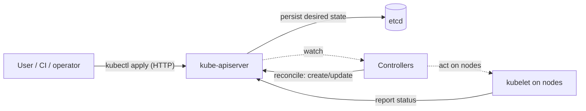
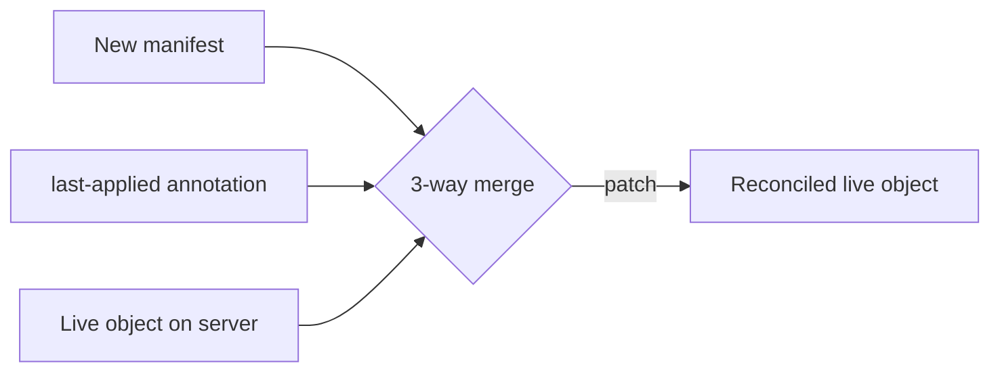
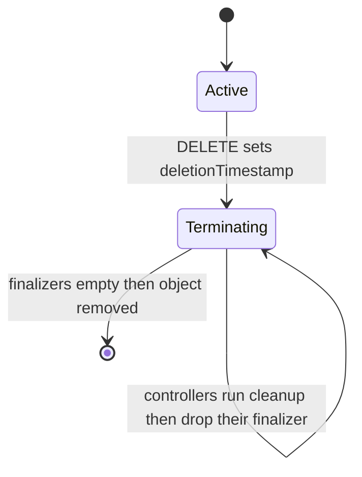
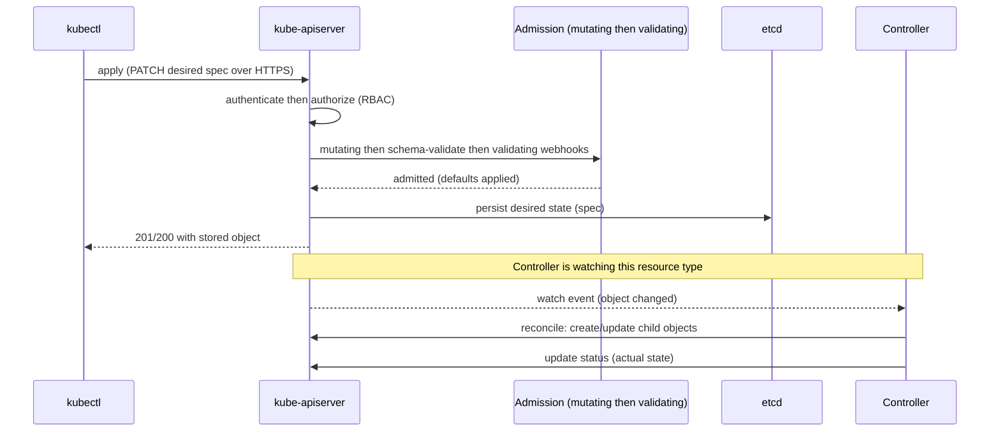

# Kubernetes API, Objects & kubectl

Kubernetes is, at its core, a **declarative, API-centric control system**. You don't tell it
*how* to run your workload step by step; you write down the **desired state** as objects and
submit them to a single, central **REST API server**, and a set of controllers works
continuously to make the cluster's **actual state** match. Everything you do — with
`kubectl`, with the dashboard, with a CI pipeline, with an operator — is ultimately a
create/read/update/delete call against that API. Understanding the **object model**
(`apiVersion`/`kind`/`metadata`/`spec`/`status`), how objects are grouped and versioned
(**API groups**), how they are labelled and selected, how they are scoped (**namespaces**),
and how `kubectl` translates your intent into API calls (**imperative vs declarative apply**,
**dry-run**, **server-side apply**) is the foundation every other Kubernetes topic builds on.

This note owns that foundation. It assumes container basics from the `docker` domain (images,
the CRI-facing runtime) and does not re-teach them. Control-plane component internals
(scheduler, controller-manager, etcd) live in `architecture-control-plane`; specific
workload objects (Deployment, StatefulSet, Job) live in `pods-workload-controllers` and
`deployments-rolling-updates`. Here we cover the *shape and mechanics of the API itself*.

> [!KEY-TAKEAWAY]
> A Kubernetes object is a **record of intent**: you declare a `spec` (desired state), the
> API server persists it in etcd, and a controller drives `status` (actual state) toward it
> via a continuous reconciliation loop. The API server is the **single source of truth** and
> the only component that talks to etcd — every actor reads and writes cluster state through
> it. `kubectl` is just an ergonomic HTTP client for that REST API.

---

## The Kubernetes API and the declarative model

The **kube-apiserver** is the front door to the cluster: a RESTful HTTP(S) API that exposes
cluster state as **resources** you manipulate with standard verbs (`GET`, `POST`, `PUT`,
`PATCH`, `DELETE`, plus `WATCH` for streaming changes). It is the **only** component that
reads from and writes to **etcd** (the backing key-value store); the scheduler, controllers,
kubelets and `kubectl` all go through the API server. This makes it the single source of
truth and the single point for authentication, authorization (RBAC), and admission control.

The model is **declarative, not imperative**. You describe the end state you want ("3
replicas of this Pod template, this image, these labels") and submit it; controllers figure
out the actions needed to get there and keep it there. Contrast with an imperative model
where you issue commands ("start a container, now start another"). Declarative state is
idempotent (re-submitting the same manifest is a no-op if nothing changed), self-healing (if
a Pod dies, the controller recreates it to restore desired state), and version-controllable
(the manifest *is* the record).



> [!INTERVIEW]
> A classic opener: *"What does 'declarative' mean in Kubernetes and why does it matter?"*
> Answer with **desired-state vs actual-state + reconciliation**: you declare intent, the
> control loop continuously converges actual toward desired, giving idempotency, drift
> correction, and self-healing — properties an imperative script cannot guarantee.

## The object model: apiVersion, kind, metadata, spec, status

Almost every Kubernetes object shares the same top-level shape. These are the four fields you
will write, plus one the system writes back:

| Field | Who sets it | Meaning |
|---|---|---|
| `apiVersion` | you | Which API group + version this object belongs to (e.g. `apps/v1`, `v1`). |
| `kind` | you | The object type (e.g. `Pod`, `Deployment`, `Service`). |
| `metadata` | you (+ system) | Identity data: `name`, `namespace`, `labels`, `annotations`, `uid`, `resourceVersion`, `finalizers`, `ownerReferences`, `creationTimestamp`. |
| `spec` | you | **Desired state** — what you want to be true. |
| `status` | the system | **Actual/observed state** — what the controller reports is currently true. |

```yaml
apiVersion: apps/v1          # API group "apps", version v1
kind: Deployment
metadata:
  name: web
  namespace: shop
  labels:
    app: web
spec:                        # DESIRED STATE — you own this
  replicas: 3
  selector:
    matchLabels: { app: web }
  template:
    metadata:
      labels: { app: web }
    spec:
      containers:
        - name: web
          image: nginx:1.27
status:                      # ACTUAL STATE — the controller writes this; do not hand-edit
  replicas: 3
  availableReplicas: 3
  observedGeneration: 2
```

The **spec/status split** is the heart of the whole system. You never write `status` — a
controller owns it and updates it to reflect reality. The controller's job is to notice when
`spec != status` and take action to close the gap. `metadata.generation` (bumped on spec
changes) vs `status.observedGeneration` (the generation the controller has processed) is how
you tell whether a controller has caught up with your latest change.

> [!WARNING]
> Editing `status` by hand is almost always meaningless — the controller overwrites it on the
> next reconcile. If you find yourself wanting to "fix" status, the real fix is to change the
> `spec` or address why the controller can't reach desired state.

## API groups, versions, and resources vs kinds

The API is partitioned into **API groups**, each versioned independently so the project can
evolve types without breaking everyone at once.

- **Core (legacy) group**: `apiVersion: v1` — no group name in the path. Contains the oldest,
  most fundamental types: `Pod`, `Service`, `ConfigMap`, `Secret`, `Namespace`, `Node`,
  `PersistentVolumeClaim`, `ServiceAccount`. Served at `/api/v1`.
- **Named groups**: `apiVersion: <group>/<version>`, e.g. `apps/v1` (Deployment, StatefulSet,
  DaemonSet, ReplicaSet), `batch/v1` (Job, CronJob), `networking.k8s.io/v1`
  (Ingress, NetworkPolicy), `rbac.authorization.k8s.io/v1`. Served at `/apis/<group>/<version>`.

Versions carry a **maturity signal**: `v1alpha1` (experimental, may change/vanish, often
disabled by default), `v1beta1` (well-tested, enabled by default, but API may still change),
`v1` (stable, long-term compatibility guarantee). A given object can be served at multiple
versions simultaneously; the API server converts between them and stores one **storage
version** in etcd.

Two terms interviewers love to probe: **kind vs resource**.

- A **kind** is the *type name* used in YAML (`Pod`, `Deployment`) — PascalCase, singular.
- A **resource** is the *lowercase plural URL segment* used in the REST path and by `kubectl`
  (`pods`, `deployments`). Resources are what RBAC rules and the API paths reference.

So `kind: Pod` is served at the `pods` resource under `/api/v1/namespaces/<ns>/pods`.
`kubectl api-resources` lists every resource with its short name, API group, whether it's
namespaced, and its kind:

```
$ kubectl api-resources
NAME          SHORTNAMES   APIVERSION   NAMESPACED   KIND
pods          po           v1           true         Pod
services      svc          v1           true         Service
deployments   deploy       apps/v1      true         Deployment
nodes         no           v1           false        Node
```

> [!TIP]
> `kubectl explain deployment.spec.strategy` prints the schema and docs for any field
> straight from the server's OpenAPI — the fastest way to answer "what fields does this
> object have?" without leaving the terminal. Add `--recursive` for the full field tree.

## Labels and selectors: the glue

**Labels** are key/value pairs in `metadata.labels` that **identify** objects for grouping and
selection. They are the primary loose-coupling mechanism in Kubernetes: a Service finds its
Pods, a Deployment finds its ReplicaSet's Pods, and you find "everything in the payments team"
all via label **selectors** — never by hard-coding names.

```yaml
metadata:
  labels:
    app: web
    tier: frontend
    environment: prod
```

A **selector** is a query over labels. Two forms:

- **Equality-based**: `app=web,tier=frontend` (comma = logical AND).
- **Set-based**: `environment in (prod,staging)`, `tier notin (cache)`, `app` (key exists),
  `!app` (key absent).

```bash
kubectl get pods -l app=web,environment=prod
kubectl get pods -l 'environment in (prod,staging)'
kubectl get pods -l '!tier'          # pods with NO tier label
```

Controllers use selectors structurally. A Service's `spec.selector` and a Deployment's
`spec.selector.matchLabels` decide which Pods they act on. This is why the label on a
Deployment's Pod **template** must match the Deployment's selector — otherwise it would create
Pods it doesn't recognize as its own.

> [!WARNING]
> A Deployment's `spec.selector` is **immutable** after creation. If you need to change which
> Pods a Deployment owns, you must delete and recreate it. Choosing selector labels carelessly
> (e.g. reusing `app: web` across two Deployments) can cause two controllers to fight over the
> same Pods.

Selectors underpin more than ownership: `kubectl` bulk operations (`kubectl delete pods -l
app=web`), Service endpoints, `NetworkPolicy` peers, `podAffinity`, and topology-spread all
select by label. Labels are the connective tissue of the entire object graph.

## Annotations: non-identifying metadata

**Annotations** (`metadata.annotations`) are also key/value pairs, but they carry
**non-identifying** metadata — arbitrary data attached to an object for tools, libraries, and
humans, **not** for selection. You **cannot** select objects by annotation.

| | Labels | Annotations |
|---|---|---|
| Purpose | Identify & select objects | Attach arbitrary metadata |
| Selectable? | **Yes** (selectors, `-l`) | **No** |
| Value size | Small, constrained (63 char value, limited charset) | Large, arbitrary (build info, JSON blobs, URLs) |
| Typical use | `app`, `tier`, `release` | ingress config, `kubectl.kubernetes.io/last-applied-configuration`, checksums, tool state, contact info |

Examples of annotation use: the client-side apply `last-applied-configuration`, ingress
controller tuning (`nginx.ingress.kubernetes.io/rewrite-target`), Prometheus scrape hints,
change-cause tracking, and controller bookkeeping. Rule of thumb: **if you'll query on it,
it's a label; if it's just data riding along, it's an annotation.**

## Namespaces and scoping: namespaced vs cluster-scoped

A **Namespace** is a virtual cluster inside a physical cluster — a scope for **names** and a
boundary for **policy** (RBAC, ResourceQuota, LimitRange, NetworkPolicy). Object names must be
unique **within a namespace + resource**, not across the whole cluster: you can have a
`Service/api` in `team-a` and a `Service/api` in `team-b`.

Not everything is namespaced. Resources split into two scopes:

| Scope | Examples | Notes |
|---|---|---|
| **Namespaced** | Pod, Deployment, Service, ConfigMap, Secret, PVC, Role, RoleBinding, ServiceAccount | Live inside a namespace; deleted when the namespace is deleted. |
| **Cluster-scoped** | Node, PersistentVolume, Namespace, StorageClass, ClusterRole, ClusterRoleBinding, CustomResourceDefinition, PriorityClass | Exist once per cluster, no namespace. |

```bash
kubectl api-resources --namespaced=true    # list namespaced kinds
kubectl api-resources --namespaced=false   # list cluster-scoped kinds
kubectl get pods -n kube-system            # target a namespace
kubectl get pods -A                        # --all-namespaces
```

The four default namespaces: `default` (where your stuff lands if you don't specify one),
`kube-system` (control-plane components), `kube-public` (world-readable cluster info), and
`kube-node-lease` (node heartbeat Lease objects). Namespaces provide *scoping*, not hard
isolation — Pods in different namespaces can still reach each other over the network unless a
`NetworkPolicy` restricts it (see `workload-network-security`). DNS reflects namespaces:
`<service>.<namespace>.svc.cluster.local`.

> [!WARNING]
> Deleting a namespace deletes **everything namespaced inside it** (cascading). A namespace can
> get stuck in `Terminating` if a contained object has a finalizer that never clears — a very
> common real-world incident.

## kubectl essentials: get, describe, apply, logs, exec, explain

`kubectl` is a REST client for the API server, configured by a **kubeconfig**. The verbs you
must know cold:

| Command | What it does |
|---|---|
| `kubectl get <resource> [name]` | List/read objects (add `-o wide` for more columns). |
| `kubectl describe <resource> <name>` | Human-readable detail **plus the object's Events** — first stop for debugging. |
| `kubectl apply -f file.yaml` | Declaratively create-or-update to match the file. |
| `kubectl create -f file.yaml` | Imperatively create (errors if it already exists). |
| `kubectl delete <resource> <name>` | Delete an object (cascades to owned objects). |
| `kubectl edit <resource> <name>` | Open the live object in `$EDITOR`, apply on save. |
| `kubectl logs <pod> [-c container]` | Fetch container stdout/stderr (`-f` follow, `--previous` for the crashed instance). |
| `kubectl exec -it <pod> -- sh` | Run a command / get a shell inside a running container. |
| `kubectl explain <type>.<field>` | Print schema/docs for a field from the server. |
| `kubectl scale`, `rollout`, `port-forward`, `cp` | Common operational shortcuts. |

Two debugging patterns worth memorizing: `kubectl describe pod X` surfaces the **Events**
(scheduling failures, image pulls, probe failures, OOMKills), and `kubectl logs X --previous`
retrieves logs from the *previous* container instance after a crash — essential for diagnosing
`CrashLoopBackOff` (deep-dived in `troubleshooting-observability`).

```bash
kubectl get pods -o wide                 # + node, IP, nominated node
kubectl describe deploy/web              # spec, conditions, events
kubectl logs -f deploy/web -c app        # stream logs from a Deployment's pods
kubectl exec -it web-abc -- /bin/sh      # shell into a container
```

## Output formats: yaml, json, wide, jsonpath

`kubectl get` defaults to a compact table, but `-o` reshapes the output for humans or scripts:

| `-o` value | Output |
|---|---|
| `wide` | Table + extra columns (node, IP, etc.). |
| `yaml` / `json` | The full live object, including `status` and server-set metadata. |
| `name` | Just `resource/name` (handy for piping). |
| `jsonpath='{...}'` | Extract specific fields with a JSONPath expression. |
| `custom-columns=...` | Define your own table columns. |
| `go-template=...` | Full Go-template formatting. |

```bash
kubectl get pod web -o yaml
kubectl get pods -o jsonpath='{.items[*].metadata.name}'
kubectl get nodes -o custom-columns=NAME:.metadata.name,CPU:.status.capacity.cpu
kubectl get pod web -o jsonpath='{.status.phase}'
```

`-o yaml`/`json` is also how you inspect the parts of an object you can't see in the table:
the resolved `status`, `managedFields`, `ownerReferences`, `finalizers`, and any defaults the
API server filled in. `jsonpath` and `custom-columns` are the scripting workhorses — prefer
them over parsing table output with `grep`/`awk`.

> [!TIP]
> `kubectl get ... -o yaml` shows the object *as stored by the server*, including fields you
> never wrote (defaults, `status`, `uid`, `resourceVersion`). That is different from your
> source manifest — a frequent source of "why is this field here?" confusion.

## Declarative apply vs imperative commands

There are two philosophies for changing the cluster, and interviewers want you to know when to
use each:

- **Imperative**: you issue an action. `kubectl create`, `kubectl run`, `kubectl delete`,
  `kubectl scale`, `kubectl set image`, `kubectl expose`, `kubectl edit`. Fast for one-off/
  experimentation; **not idempotent** (`create` fails if the object exists) and leaves **no
  declarative record** of intent.
- **Declarative**: you maintain files and run `kubectl apply -f dir/`. `apply` **creates the
  object if absent and updates it to match if present** — idempotent and re-runnable. This is
  the GitOps-friendly model: the files in version control are the source of truth.

```bash
# Imperative — quick, no record
kubectl create deployment web --image=nginx:1.27
kubectl scale deployment web --replicas=5

# Declarative — repeatable, reviewable, GitOps-ready
kubectl apply -f deploy.yaml
```

`create` and `apply` differ crucially on **re-run**: `kubectl create -f x.yaml` on an existing
object returns `AlreadyExists`; `kubectl apply -f x.yaml` succeeds and reconciles differences.
That idempotency is why `apply` is the backbone of GitOps tools (Argo CD/Flux — see
`gitops-continuous-delivery`).

> [!INTERVIEW]
> *"You changed a Deployment's replicas with `kubectl scale`, then re-ran `kubectl apply` from
> your unchanged manifest — what happens?"* With **client-side apply**, apply only reverts
> fields *it* manages via `last-applied-configuration`; if the manifest still says
> `replicas: 3`, apply sets it back to 3. If `replicas` was removed from the manifest, apply
> would leave the live value. This is exactly why mixing imperative edits with declarative
> apply causes surprises — and why server-side apply's field ownership is clearer.

## The three-way merge and last-applied-configuration

How does `kubectl apply` decide what to change without clobbering fields set by other actors?
Classic (client-side) apply does a **three-way merge** using three inputs:

1. Your **new manifest** (what you want now),
2. The **`kubectl.kubernetes.io/last-applied-configuration` annotation** (what you applied last
   time, stored on the object by kubectl),
3. The **live object** on the server (current actual state, including fields others set).

By diffing (1) against (2), kubectl knows which fields **you** added, changed, or **removed**;
it merges those changes onto (3). This lets apply *delete* a field you dropped from your
manifest (because it can see you removed it relative to last-applied) while **leaving alone**
fields it never managed (like a `replicas` count an HPA controls, or defaults the server
added). The last-applied annotation is the memory that makes deletion detection possible.



Limitations that motivated server-side apply: the annotation can get large and stale, the
merge happens on the *client* (so different `kubectl` versions can behave differently), and
there is no shared notion of *who owns which field* — two controllers can silently fight.

## Server-side apply and field management

**Server-side apply (SSA)** moved this logic into the API server and made it GA in **Kubernetes
1.22**. It is the mechanism controllers and tools increasingly use, but note the `kubectl apply`
CLI still defaults to **client-side** apply — you opt into SSA with `--server-side` (the API
server, however, records `managedFields` for every writer regardless). Instead of a
client-side annotation, SSA tracks **field ownership** in `metadata.managedFields`:
each **field manager** (identified by a name like `kubectl`, or a controller's name) records
exactly which fields it set and via which operation (`Apply` vs `Update`).

Key mechanics:

- Each applier sends only its **fully specified intent** (the fields it cares about), as a
  PATCH with content type `application/apply-patch+yaml`.
- If you apply and try to change a field **another manager owns**, the server returns a
  **conflict** error rather than silently overwriting. You resolve it by (a) forcing with
  `kubectl apply --server-side --force-conflicts` to take ownership, (b) dropping the field to
  yield the claim, or (c) matching the current value to become a shared owner.
- Removing a field from your manifest and re-applying deletes it *only if no other manager owns
  it* — ownership, not a stale annotation, drives deletion.

```bash
kubectl apply --server-side -f deploy.yaml
kubectl apply --server-side --force-conflicts -f deploy.yaml
kubectl get deploy web --show-managed-fields -o yaml   # inspect field ownership
```

SSA's big win is **safe multi-writer collaboration**: an HPA can own `replicas`, your GitOps
tool can own the image and template, and neither stomps the other — conflicts are explicit,
not silent. `managedFields` is managed by the server; don't hand-edit it.

> [!KEY-TAKEAWAY]
> Client-side apply remembers *what you applied* (an annotation) and merges on the client.
> Server-side apply remembers *who owns each field* (`managedFields`) and merges on the server,
> turning silent overwrites into explicit conflicts. SSA is GA (1.22) and is the modern
> direction, though `kubectl apply` still defaults to client-side unless you pass `--server-side`.

## Dry-run: client vs server

`--dry-run` lets you preview an operation without persisting it — but the two modes are very
different in what they validate:

- `--dry-run=client`: kubectl processes the manifest **locally** and prints what *would* be
  sent. It does **not** contact the API server for validation, does **not** run admission
  webhooks, and does **not** apply defaults. Good for generating YAML.
- `--dry-run=server`: the request goes **all the way through the API server** — schema
  validation, defaulting, **admission controllers and validating/mutating webhooks** — but is
  **not persisted** to etcd. This is a true "what would actually happen?" check.

```bash
# Generate a manifest without creating anything (a common exam trick)
kubectl create deployment web --image=nginx -o yaml --dry-run=client > web.yaml

# Validate against the real server, including admission webhooks, without saving
kubectl apply -f web.yaml --dry-run=server

# See exactly what apply would change on the live object
kubectl diff -f web.yaml
```

Pair `--dry-run=server` with `kubectl diff` in CI to catch policy rejections (e.g. Pod Security
Standards, OPA/Kyverno) *before* merging. `--dry-run=client -o yaml` is the idiomatic way to
scaffold a manifest from an imperative command.

## kubeconfig: clusters, users, and contexts

`kubectl` (and client libraries) find *which* cluster to talk to and *how* to authenticate via
a **kubeconfig** file (default `~/.kube/config`, overridable by `--kubeconfig` or the
`$KUBECONFIG` env var, which can list several files to merge). It has three lists plus a
pointer:

| Section | Contains |
|---|---|
| `clusters` | API server URL + CA cert (the *where*). |
| `users` | Credentials: client cert, token, exec plugin (e.g. `aws eks get-token`), etc. (the *who*). |
| `contexts` | A named triple of **cluster + user + default namespace** (the *combination*). |
| `current-context` | Which context is active right now. |

A **context** binds a cluster, a user, and a namespace together. Switching contexts is how you
move between clusters (dev/prod, EKS/GKE) or identities without retyping connection details.

```bash
kubectl config get-contexts            # list contexts, * marks current
kubectl config current-context         # show active context
kubectl config use-context prod        # switch clusters/identity
kubectl config set-context --current --namespace=shop   # change default ns
```

> [!WARNING]
> The `current-context` is a shared, stateful setting — a large fraction of "I ran it against
> the wrong cluster" incidents come from an unexpected active context. Verify with
> `kubectl config current-context` (or a shell prompt tool like `kubectx`/`kube-ps1`) before
> destructive commands, especially against prod.

## Finalizers and the deletion lifecycle

Deletion in Kubernetes is not always immediate. **Finalizers** are keys in
`metadata.finalizers` that tell the API server: *"don't actually remove this object until the
responsible controller has done its cleanup and removed its finalizer."*

The flow when you `delete` an object that has finalizers:

1. The API server sets `metadata.deletionTimestamp` (the object is now **Terminating**) and
   returns `202 Accepted` — it does **not** delete yet.
2. The object stays, blocked, while its finalizers are non-empty. Controllers watching it
   perform cleanup (detach a volume, deregister a load balancer, delete cloud resources).
3. Each controller removes its own key from `metadata.finalizers` once done.
4. When `finalizers` is **empty**, the API server actually removes the object.



Real finalizers you'll see: `kubernetes.io/pv-protection` and `kubernetes.io/pvc-protection`
(block deleting storage still in use), `foregroundDeletion`, and the `orphan` finalizer.

> [!WARNING]
> A stuck `Terminating` object almost always means a finalizer's controller is gone or wedged.
> Force-removing a finalizer (`kubectl patch ... -p '{"metadata":{"finalizers":null}}'`) makes
> the object vanish but **skips the cleanup it guarded** — potentially leaking cloud
> load balancers, volumes, or leaving dangling state. Use it only when you understand and have
> manually done the cleanup.

## Owner references and cascading deletion

**Owner references** (`metadata.ownerReferences`) express a parent→child relationship in the
object graph: a ReplicaSet owns its Pods, a Deployment owns its ReplicaSets, a Job owns its
Pods. Each dependent stores the owner's `apiVersion`, `kind`, `name`, and **uid**. The
**garbage collector** uses these references — *not* labels — to decide what to clean up when an
owner is deleted.

There are three **cascading-deletion (propagation) policies**:

| Policy | Behavior | Mechanism |
|---|---|---|
| **Background** (default) | Owner deleted immediately; GC deletes dependents asynchronously afterward. | Async GC |
| **Foreground** | Owner enters "deletion in progress"; **dependents deleted first**, then the owner. | `foregroundDeletion` finalizer |
| **Orphan** | Owner deleted; dependents **kept** (their owner references are cleared). | `orphan` finalizer |

```bash
kubectl delete deployment web                              # background (default)
kubectl delete deployment web --cascade=foreground         # children first, then owner
kubectl delete deployment web --cascade=orphan             # keep the pods/replicasets
```

The classic gotcha: `kubectl delete deployment web --cascade=orphan` deletes the Deployment
but leaves the ReplicaSet and Pods running with no controller managing them. The `uid` in the
owner reference matters — if you delete and recreate an owner with the same name, old
dependents pointing at the *old* uid become orphans and may be garbage-collected.

> [!INTERVIEW]
> *"You deleted a Deployment but the Pods are still running — why?"* Likely someone used
> `--cascade=orphan` (or `--cascade=false` in older kubectl). The Pods lost their owner
> reference chain and now have no controller. Answer ties together **owner references +
> propagation policy**.

## The object lifecycle: from apply to reconciliation

Putting it together, here is the end-to-end path of a single `kubectl apply`, which is the
mental model senior candidates are expected to narrate:



1. **Auth**: the API server authenticates the caller, then checks **RBAC** authorization.
2. **Admission**: **mutating** admission (webhooks/controllers may inject defaults, sidecars),
   then **schema validation**, then **validating** admission (may reject, e.g. Pod Security).
3. **Persist**: the accepted object's `spec` is written to **etcd**; server-set metadata
   (`uid`, `resourceVersion`, `creationTimestamp`, defaults) is filled in.
4. **Watch/notify**: controllers **watching** that resource receive the change event.
5. **Reconcile**: the responsible controller acts to make actual match desired (e.g. the
   Deployment controller creates a ReplicaSet, which creates Pods) and writes back `status`.
6. This loop runs **forever** — it is level-triggered, not edge-triggered, so a controller
   re-checks desired-vs-actual on every resync and self-heals drift.

`metadata.resourceVersion` is the optimistic-concurrency token: updates carry the version they
read, and the server rejects a write if the object changed underneath (a `Conflict`), forcing
the client to re-read and retry. This is how thousands of controllers safely write shared
state through one API server without locks.

## Common follow-up questions

- **"What's the difference between spec and status, and who writes each?"** You write `spec`
  (desired state); the controller writes `status` (observed state) and drives spec→status.
- **"kind vs resource?"** `kind` is the PascalCase type in YAML (`Pod`); `resource` is the
  lowercase plural REST/RBAC name (`pods`).
- **"When would you use `create` vs `apply`?"** `apply` for anything you'll manage over time
  (idempotent, GitOps); `create`/`run` for one-off or scaffolding.
- **"How does apply know what to delete?"** Client-side: three-way merge via the last-applied
  annotation. Server-side: field ownership in `managedFields`.
- **"Client dry-run vs server dry-run?"** Client is local-only (no validation/admission);
  server runs the full pipeline including webhooks but doesn't persist.
- **"Why is my namespace/object stuck Terminating?"** A finalizer whose controller never
  cleared it; inspect `metadata.finalizers`.
- **"I deleted the parent but children remain — why?"** Orphan cascade policy / broken owner
  references.
- **"Labels vs annotations?"** Labels are selectable identity; annotations are non-selectable
  metadata.
- **"How do I target a different cluster?"** Switch kubeconfig **context** (`use-context`).
- **"What are alpha/beta/stable API versions?"** Maturity/compat guarantees; alpha may be
  removed, beta is enabled-but-may-change, v1 is stable.

## References

- Kubernetes Docs — *Understanding Kubernetes Objects*: https://kubernetes.io/docs/concepts/overview/working-with-objects/
- Kubernetes Docs — *Kubernetes API Overview & API Groups/Versioning*: https://kubernetes.io/docs/reference/using-api/
- Kubernetes Docs — *Labels and Selectors*: https://kubernetes.io/docs/concepts/overview/working-with-objects/labels/
- Kubernetes Docs — *Annotations*: https://kubernetes.io/docs/concepts/overview/working-with-objects/annotations/
- Kubernetes Docs — *Namespaces*: https://kubernetes.io/docs/concepts/overview/working-with-objects/namespaces/
- Kubernetes Docs — *Declarative Management with Configuration Files*: https://kubernetes.io/docs/tasks/manage-kubernetes-objects/declarative-config/
- Kubernetes Docs — *Server-Side Apply*: https://kubernetes.io/docs/reference/using-api/server-side-apply/
- Kubernetes Docs — *Finalizers*: https://kubernetes.io/docs/concepts/overview/working-with-objects/finalizers/
- Kubernetes Docs — *Owners and Dependents* & *Garbage Collection*: https://kubernetes.io/docs/concepts/architecture/garbage-collection/
- Kubernetes Docs — *Organizing Cluster Access Using kubeconfig Files*: https://kubernetes.io/docs/concepts/configuration/organize-cluster-access-kubeconfig/
- Kubernetes Docs — *kubectl Cheat Sheet & Overview*: https://kubernetes.io/docs/reference/kubectl/
