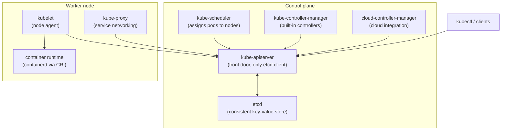
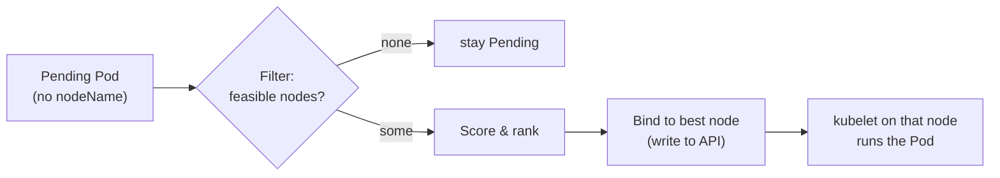
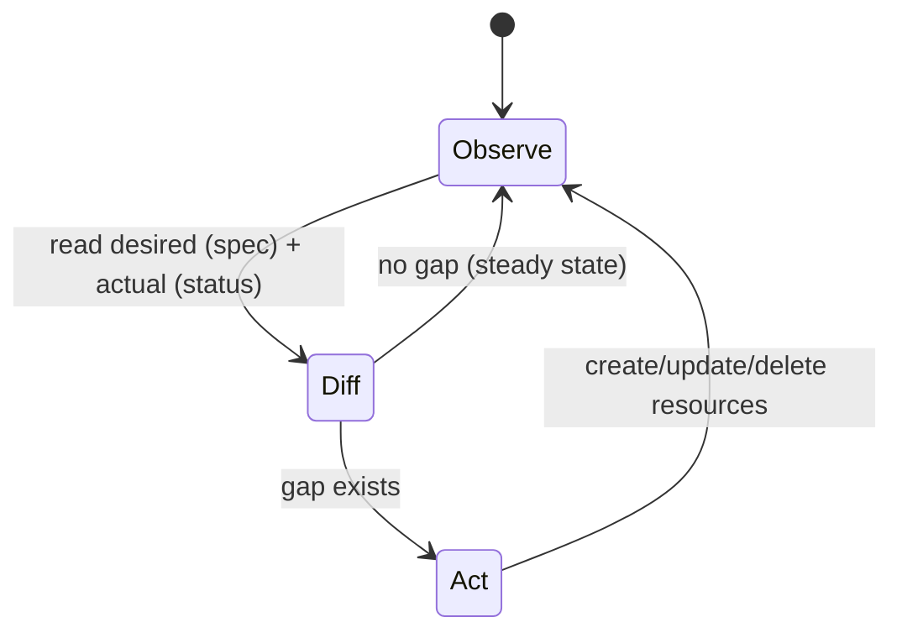
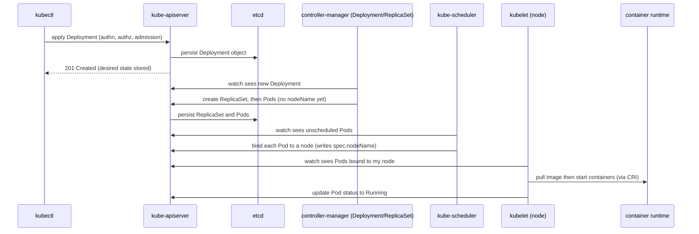

# Kubernetes Architecture & Control Plane

Kubernetes is a **declarative, API-driven cluster orchestrator**. You describe the *desired
state* of your workloads as objects, submit them to a central API, and a set of background
control loops continuously works to make the *actual state* of the cluster match. Nothing in
Kubernetes is imperative-first: you don't tell it "start this container on that machine," you
record "I want 3 replicas of this Pod" and the system figures out the rest and keeps it true.

A cluster is split into two planes:

- **Control plane** — the brains. Stores cluster state and runs the loops that make decisions
  (what should run, where, and reconciling drift). Usually on dedicated nodes.
- **Worker nodes (the data plane)** — the muscle. Machines that actually run your containers,
  under the direction of the control plane.

This topic assumes container basics from the `docker` domain (images, layers, containerd/runc,
namespaces/cgroups). Kubernetes doesn't build or run containers itself — it *drives* a container
runtime through a standard interface (the CRI). We focus here on the control-plane/node
components, the object+controller model, and the reconciliation loop that ties it all together.

> [!KEY-TAKEAWAY]
> Kubernetes = **a database of desired state (etcd) behind one API (kube-apiserver), plus a
> swarm of controllers that reconcile actual → desired.** Almost every question about "how does
> K8s do X" reduces to: which object records the intent, which controller acts on it, and how
> does the loop observe and correct drift.



---

## Cluster architecture: control plane and worker nodes

**Beginner:** A Kubernetes cluster is a set of machines (nodes) with two roles. The **control
plane** makes global decisions and stores the source of truth; **worker nodes** run the actual
application containers (inside Pods). Every node — control-plane or worker — runs a container
runtime and a kubelet, but only worker nodes normally schedule your workloads.

The control plane comprises: `kube-apiserver`, `etcd`, `kube-scheduler`,
`kube-controller-manager`, and (in cloud environments) `cloud-controller-manager`. Each worker
node runs: `kubelet`, `kube-proxy`, and a **container runtime** (e.g. containerd).

**Intermediate — separation of concerns.** The design deliberately centralizes *state and
decisions* on the control plane and pushes *execution* to nodes:

- The control plane never runs your app containers (unless you deliberately allow it by removing
  the control-plane taint — not recommended in production).
- Nodes are largely stateless and disposable; if a node dies, the control plane notices and
  reschedules its Pods elsewhere. The desired state lives in etcd, not on the node.

**Advanced — the hub-and-spoke API pattern.** All components communicate *through* the API
server; they do not talk to each other directly. The scheduler doesn't call the kubelet — it
writes a decision to the API, and the kubelet reads it. This "everything through the API,
watch-based" pattern is what makes the system loosely coupled, extensible, and observable.

> [!INTERVIEW]
> "Walk me through the components of a Kubernetes cluster." Structure the answer as
> **control plane (apiserver, etcd, scheduler, controller-manager, cloud-controller-manager)**
> vs **node (kubelet, kube-proxy, runtime)**, then add the key insight: everything flows through
> the apiserver, and controllers reconcile desired vs actual. That framing signals you understand
> the *model*, not just a component list.

| Plane | Component | One-line job |
|---|---|---|
| Control | kube-apiserver | REST front door; validates & persists objects; only etcd client |
| Control | etcd | Consistent, highly-available key-value store of all cluster state |
| Control | kube-scheduler | Decides which node each new Pod runs on |
| Control | kube-controller-manager | Runs built-in controllers (Deployment, ReplicaSet, Node, Job…) |
| Control | cloud-controller-manager | Integrates with the cloud provider (LB, routes, node lifecycle) |
| Node | kubelet | Node agent; ensures the Pods assigned to it are running & healthy |
| Node | kube-proxy | Programs Service load-balancing rules (iptables/IPVS/nftables) |
| Node | container runtime | Actually runs containers, via the CRI (containerd, CRI-O) |

---

## kube-apiserver: the front door

**Beginner:** The `kube-apiserver` is the **front door of the cluster** — a REST API server that
every client and component talks to. `kubectl`, controllers, the scheduler, kubelets, dashboards,
and CI systems all go through it. It is also the **only component that reads from and writes to
etcd**; nothing else touches the datastore directly.

**Intermediate — what the request path does.** For every incoming request the apiserver runs a
pipeline:

1. **Authentication** — who are you? (client certs, bearer tokens, OIDC, service-account tokens).
2. **Authorization** — are you allowed to do this? (usually RBAC — see `security-rbac`).
3. **Admission control** — mutating then validating admission webhooks/plugins can rewrite or
   reject the object (defaults, Pod Security Standards, quota, policy).
4. **Schema validation** and **persistence** to etcd.

Only after all stages pass does the object land in etcd and become visible to watchers.

**Advanced — watch and resource versions.** The apiserver exposes a **watch** API. Clients issue
a list+watch and receive a stream of add/update/delete events keyed by `resourceVersion`
(monotonic per object, sourced from etcd's revision). This is the backbone of controllers'
informer caches: they list once, then watch for deltas rather than polling. The apiserver is
**stateless and horizontally scalable** — you can run many replicas behind a load balancer
because all durable state is in etcd. It also serves the **aggregation layer** (for extension
API servers like `metrics-server`) and **CRD-backed APIs**.

> [!WARNING]
> The apiserver being the *only* etcd client is a hard rule, not a convention. Directly writing
> to etcd bypasses authentication, authorization, admission, validation, and the watch machinery
> — it can silently corrupt cluster state. Never poke etcd directly except for backup/restore.

---

## etcd: the cluster state store

**Beginner:** `etcd` is a **distributed, consistent key-value store**. It holds *all* cluster
state — every object you create (Pods, Deployments, Secrets, ConfigMaps, nodes, RBAC rules). If
you lose etcd and have no backup, you've lost the cluster's brain: the desired state is gone.

**Intermediate — why etcd specifically.** Kubernetes needs a datastore that is **strongly
consistent** (a read after a write returns the write) and **highly available**. etcd uses the
**Raft consensus algorithm** to replicate a log across members. Writes require a **quorum**
(majority) of members to agree, giving linearizable consistency.

**Advanced — quorum and cluster sizing.** With `N` members, quorum is `floor(N/2) + 1`, and the
cluster tolerates the loss of `N - quorum` members:

| Members | Quorum | Failures tolerated | Notes |
|---|---|---|---|
| 1 | 1 | 0 | Dev only, no HA |
| 3 | 2 | 1 | Common production minimum |
| 5 | 3 | 2 | Higher resilience |
| 4 | 3 | 1 | **No better than 3**, worse write latency — avoid even counts |

You use **odd numbers** because adding an even member increases quorum without increasing fault
tolerance. Other things interviewers probe: etcd stores values with **revisions** (multiversion,
enabling watch and compaction); it has a default **2 GiB** database size quota
(`--quota-backend-bytes`, with **8 GiB** the suggested maximum) and needs regular
**compaction + defragmentation**; and it should run on **low-latency disks** (fsync latency
directly limits write throughput). Backups are taken with `etcdctl snapshot save`, and restore is
covered under `cluster-installation-upgrades`.

> [!TIP]
> "How many etcd nodes should I run?" → **3 or 5**, always odd. 3 tolerates one failure, 5
> tolerates two. Don't run even counts (a 4-node cluster tolerates the same one failure as 3 but
> costs more and slows writes). Single-node etcd is dev-only.

---

## kube-scheduler: placing pods on nodes

**Beginner:** The `kube-scheduler` watches for **newly created Pods that have no node assigned**
(`spec.nodeName` empty) and picks a node for each. It doesn't start the container — it just
records the decision by setting the Pod's node binding. The kubelet on that node then runs it.

**Intermediate — the two-phase algorithm.** For each pending Pod the scheduler runs:

1. **Filtering (predicates)** — eliminate nodes that *cannot* run the Pod: insufficient
   CPU/memory, unmatched `nodeSelector`/affinity, unsatisfied taints, no matching volume zone,
   port conflicts. The survivors are *feasible* nodes.
2. **Scoring (priorities)** — rank the feasible nodes (spread, least/most-allocated resources,
   affinity preferences, image locality, topology spread). Highest score wins; ties broken
   randomly.

Then it **binds** the Pod to the winning node (a write to the API). If no node is feasible, the
Pod stays **Pending** and the scheduler retries.

**Advanced — knobs and internals.** The scheduler is built on a **framework of plugins** with
extension points (PreFilter, Filter, Score, Reserve, Permit, Bind). Senior-level details worth
knowing: **taints and tolerations**, **node/pod affinity and anti-affinity**, **topology spread
constraints**, **PriorityClass + preemption** (a higher-priority pending Pod can evict lower
ones to make room), and **resource requests** driving fit decisions (requests, not limits, gate
scheduling). Note the scheduler decides based on **requests**; actual usage is irrelevant to
placement. Deep scheduling coverage lives in `scheduling-affinity-namespaces`.



> [!WARNING]
> A common "why is my Pod Pending?" cause is that **no node satisfies the Pod's resource
> requests** (or a nodeSelector/affinity/taint rules everything out). `kubectl describe pod`
> shows scheduler events like `0/5 nodes are available: 3 Insufficient cpu…`. The scheduler
> filters on **requests**, so oversized requests, not real usage, block scheduling.

---

## kube-controller-manager and controllers

**Beginner:** The `kube-controller-manager` is a single binary that runs most of Kubernetes'
**built-in controllers**. A **controller** is a control loop that watches one or more object
types and drives the cluster toward the desired state for them.

Examples of controllers it hosts: the **Deployment** controller, **ReplicaSet** controller,
**Node** controller (marks nodes NotReady, triggers eviction), **Job/CronJob** controllers,
**EndpointSlice** controller, **Namespace**, **ServiceAccount** and token controllers, and more.

**Intermediate — one process, many loops.** They're packaged into one binary/process for
operational simplicity, but each controller is logically independent. Each uses an **informer**
(a cached, watch-fed local view of the objects it cares about) and a **work queue**, so it reacts
to changes without hammering the API with polls.

**Advanced — leader election.** In an HA control plane you run multiple
controller-manager replicas, but only **one is active** at a time. They coordinate via a
**leader-election lock** (a `Lease` object in the API). If the leader stops renewing its lease,
another replica takes over. This prevents two controllers from both trying to reconcile the same
object and fighting each other. The same leader-election mechanism applies to the scheduler and
cloud-controller-manager.

> [!INTERVIEW]
> A crisp definition to have ready: **"A controller is a non-terminating loop that watches the
> desired state of some resource and takes action to move the cluster's actual state toward it."**
> Then note the controller-manager just bundles the built-in ones; custom controllers/operators
> (see `operators-crds-extensibility`) follow the exact same pattern for CRDs.

---

## cloud-controller-manager

**Beginner:** The `cloud-controller-manager` (CCM) is the component that knows how to talk to a
specific **cloud provider** (AWS, GCP, Azure, etc.). It runs the controllers whose logic is
cloud-specific, so the core Kubernetes components can stay **cloud-agnostic**.

**Intermediate — what it does.** The CCM typically runs:

- **Node controller** — checks with the cloud API whether a node still exists; if the VM is gone,
  it removes the Node object. It also labels nodes with region/zone/instance-type.
- **Route controller** — configures network routes in the cloud so Pods can talk across nodes
  (when the CNI relies on cloud routing).
- **Service controller** — provisions a cloud **load balancer** when you create a
  `Service type=LoadBalancer`, wiring external traffic to the Service.

**Advanced — why it was split out.** Historically this logic lived *inside* the
kube-controller-manager and kubelet (as "in-tree" cloud providers). The CCM was introduced so
cloud vendors could ship and update integrations **out-of-tree** (as separate binaries/plugins)
on their own schedule, and so the core project could drop provider-specific code. On a managed
service like **EKS/GKE/AKS** the cloud provider runs and manages the CCM (and the whole control
plane) for you — see the `aws` domain (`aws-containers-ecs-eks`) for EKS specifics. On bare-metal
or on-prem clusters there is usually **no** CCM.

> [!TIP]
> If a `type=LoadBalancer` Service is stuck with `EXTERNAL-IP: <pending>`, a frequent cause is
> that there's **no cloud-controller-manager / load-balancer provider** in the cluster (e.g.
> bare-metal without MetalLB). Nothing is there to fulfill the request.

---

## kubelet: the node agent

**Beginner:** The `kubelet` is the **primary agent that runs on every node**. Its job: given the
set of Pods assigned to *its* node, make sure those Pods' containers are **running and healthy**.
It's the component that actually talks to the container runtime to start/stop containers.

**Intermediate — the kubelet's reconciliation loop.** The kubelet:

1. Watches the API server for Pods bound to its node (`spec.nodeName == myNode`).
2. For each Pod, calls the **container runtime via the CRI** to pull images and start containers,
   sets up the Pod sandbox (network namespace), mounts volumes (via CSI), and injects
   config/secrets.
3. Runs **liveness / readiness / startup probes** and reports Pod status back to the API.
4. Continuously reconciles: if a container exits and the restart policy says so, it restarts it.

It also **reports node status** (capacity, conditions like `Ready`/`MemoryPressure`) and renews
its node lease as a heartbeat.

**Advanced — what the kubelet does and doesn't do.**

- The kubelet **only manages Pods** — it will not run a bare container you didn't express as a Pod
  object (except **static Pods**, below).
- It **does not depend on the scheduler** to keep already-running Pods alive; even if the control
  plane is down, existing Pods on a node keep running under the local kubelet.
- It performs **eviction** under node resource pressure (memory/disk), respecting QoS classes.
- It handles the **CRI, CNI (network), and CSI (storage)** plugin interfaces on the node.

> [!WARNING]
> If a node's kubelet stops heartbeating (crash, network partition), the node controller marks
> the Node `NotReady` after a grace period and eventually the Pods are evicted/rescheduled. But
> Pods on a genuinely-partitioned node may **still be running** locally — this split-brain risk is
> why StatefulSets and fencing matter for stateful workloads.

---

## kube-proxy: service networking on nodes

**Beginner:** `kube-proxy` runs on every node and implements the **Service** abstraction. A
Service gives a stable virtual IP (ClusterIP) and DNS name for a changing set of Pods; kube-proxy
programs the node's networking so that traffic to that virtual IP is load-balanced to the healthy
backend Pods.

**Intermediate — how it does it.** kube-proxy watches Services and **EndpointSlices** (the list
of ready Pod IPs behind each Service) and programs kernel rules:

- **iptables mode** (long-time default) — installs DNAT rules; picks a backend roughly at random.
  Rule count grows with the number of Services/endpoints.
- **IPVS mode** — uses the kernel's in-kernel load balancer (hash tables), scaling better to
  thousands of Services and offering more LB algorithms (round-robin, least-conn).
- **nftables mode** — newer backend addressing iptables' scaling limits.

Note kube-proxy does **not** sit in the data path as a userspace proxy for normal traffic — it
*programs the kernel*, and the kernel forwards packets. Full Service/network detail is in
`services-networking`.

**Advanced — what replaces or complements it.** Some CNIs (e.g. **Cilium** with eBPF) can
**replace kube-proxy** entirely, implementing Service load-balancing in eBPF for better
performance and observability. DNS-based Service discovery is handled separately by **CoreDNS**,
not kube-proxy.

> [!INTERVIEW]
> Clarify the division of labor: **CoreDNS** resolves the Service name → ClusterIP;
> **kube-proxy** (or eBPF) turns traffic *to* that ClusterIP into load-balanced connections to Pod
> IPs; the **CNI** provides the underlying Pod-to-Pod connectivity. Mixing these up is a common
> tell that someone hasn't run a cluster.

---

## Container runtime and the CRI

**Beginner:** Kubernetes does not run containers itself — it delegates to a **container runtime**
on each node. The kubelet talks to the runtime through a standard gRPC interface called the
**CRI (Container Runtime Interface)**. Common runtimes: **containerd** and **CRI-O** (both use
**runc** as the low-level OCI runtime under the hood — see the `docker` domain for OCI/runc).

**Intermediate — why the CRI exists.** Before the CRI, Docker support was hardwired into the
kubelet. The CRI decoupled Kubernetes from any specific runtime: implement the CRI gRPC API and
the kubelet can drive you. This is what let the ecosystem swap Docker for containerd/CRI-O without
changing Kubernetes.

**Advanced — the dockershim removal.** The kubelet historically shipped a **`dockershim`**
adapter to speak to the Docker Engine (which wasn't CRI-native). This shim was **deprecated in
v1.20 and removed in v1.24 (2022)**. The headline "Kubernetes is deprecating Docker" was widely
misunderstood: your **Docker-built images still run fine** (they're OCI images), and Docker Engine
itself uses containerd. What went away was the kubelet's built-in Docker adapter; nodes now use
containerd or CRI-O directly. For sandboxed/hardened workloads you can plug in alternative OCI
runtimes via **RuntimeClass** (e.g. **gVisor** `runsc`, **Kata Containers** microVMs).

> [!WARNING]
> "Kubernetes removed Docker" ≠ "your Docker images won't work." Images built with `docker build`
> follow the **OCI image spec** and run unchanged. Only the kubelet↔Docker-Engine shim was
> removed (v1.24); nodes use containerd/CRI-O via the CRI. This is a classic interview gotcha.

---

## The declarative model and desired state

**Beginner:** Kubernetes is **declarative**: you tell it *what* you want (the desired state), not
*how* to achieve it. You write a manifest — "I want a Deployment with 3 replicas of this image" —
and submit it. Kubernetes stores that intent and works continuously to make it true. Contrast with
an **imperative** model where you run step-by-step commands and own the outcome yourself.

```yaml
apiVersion: apps/v1
kind: Deployment
metadata:
  name: web
spec:
  replicas: 3                 # desired state: 3 Pods
  selector:
    matchLabels: { app: web }
  template:
    metadata:
      labels: { app: web }
    spec:
      containers:
        - name: web
          image: nginx:1.27
```

**Intermediate — why declarative wins.** Because the desired state is stored, the system is
**self-healing**: if a Pod dies or a node fails, controllers notice actual ≠ desired and recreate
Pods to restore 3 replicas — you didn't have to do anything. It's also **idempotent** (re-applying
the same manifest is a no-op) and **auditable** (the manifests are your source of truth, which is
what makes **GitOps** possible — see `gitops-continuous-delivery`).

**Advanced — spec vs status.** Nearly every object has a **`spec`** (desired state, written by
users/controllers) and a **`status`** (actual observed state, written by the controlling
component). Reconciliation is precisely the work of driving `status` toward `spec`. Fields like
`metadata.generation` (bumped on spec changes) vs `status.observedGeneration` let you tell whether
a controller has caught up with your latest change.

> [!KEY-TAKEAWAY]
> Declarative + stored desired state = **self-healing and idempotent by construction**. You never
> "start" a Pod imperatively in production; you declare the desired workload and let controllers
> keep it true. This is the single most important mental model in Kubernetes.

---

## The reconciliation loop

**Beginner:** The **reconciliation loop** is the heartbeat of Kubernetes. Each controller runs a
loop: **observe** the current state, **compare** it to the desired state, and **act** to close the
gap — over and over, forever. When someone says "Kubernetes is a bunch of control loops," this is
what they mean.



**Intermediate — level-triggered, not edge-triggered.** A crucial property: controllers are
**level-triggered**, not edge-triggered. They act on the *current observed state*, not on the
*event* that something changed. If a controller misses an event (restart, dropped watch), it still
converges because on its next sync it re-reads the actual full state and reconciles the difference.
Edge-triggered systems ("on delete event, do X") break if they miss the edge; level-triggered
systems are **self-correcting**. Watches are just an *optimization* to react quickly; a periodic
**resync** guarantees eventual correctness even without events.

**Advanced — the ReplicaSet example.** Say you have `replicas: 3` and a Pod is deleted:

1. The ReplicaSet controller's informer sees the Pod-deleted event (or notices on resync).
2. It lists Pods matching its selector → observes **2** running.
3. Desired is **3**, actual is **2** → gap of one.
4. It creates one new Pod (which the scheduler then places, and a kubelet runs).
5. Loop repeats; now actual == desired, so it does nothing further.

Controllers are also **idempotent** and must tolerate seeing the same state repeatedly without
double-acting. This model composes: Deployment → ReplicaSet → Pod, each level a controller
reconciling the level below.

> [!INTERVIEW]
> If asked "what does 'level-triggered' mean and why does it matter?" — say controllers act on
> **current state, not on change events**, so a missed event or a controller restart still
> converges (it re-reads reality and fixes drift). That robustness is *why* Kubernetes survives
> component restarts and network blips gracefully.

---

## Everything is an object: the API model

**Beginner:** In Kubernetes, **everything is an object** exposed through the API — Pods,
Deployments, Services, ConfigMaps, Secrets, Nodes, Namespaces, even RBAC rules and the scheduler's
decisions. Every object has a consistent shape: `apiVersion`, `kind`, `metadata` (name, namespace,
labels, annotations), and usually `spec` and `status`.

**Intermediate — the API surface.** Resources are grouped into **API groups** and **versions**,
e.g. `apps/v1` (Deployments, StatefulSets), `batch/v1` (Jobs), `networking.k8s.io/v1`
(NetworkPolicy, Ingress), and the **core group** (`v1`: Pods, Services, ConfigMaps — note the
empty group prefix). `kubectl api-resources` lists them; `kubectl explain <kind>` documents any
object's fields straight from the server's schema. Objects are **namespaced** (scoped to a
Namespace) or **cluster-scoped** (Nodes, Namespaces, PersistentVolumes, ClusterRoles).

**Advanced — a uniform, extensible model.** Because every object flows through the same API with
the same verbs (get/list/watch/create/update/patch/delete), tooling is uniform: RBAC, admission,
audit logging, and watches all work the same way for *any* resource — including ones you invent.
**CustomResourceDefinitions (CRDs)** let you add your own object kinds that behave exactly like
built-in ones, and the **aggregation layer** lets you plug in whole extension API servers. This
uniformity is why the operator pattern works (`operators-crds-extensibility`). Fields you'll cite
in interviews: **labels** (selectable, used by selectors), **annotations** (non-selectable
metadata), **ownerReferences** (parent→child for garbage collection and cascading delete), and
**finalizers** (block deletion until cleanup runs).

> [!TIP]
> `kubectl explain deployment.spec.strategy` and `kubectl api-resources` are your live,
> version-accurate documentation — they read the server's own OpenAPI schema, so they're never
> out of date with your cluster. Great to mention when asked how you'd explore an unfamiliar API.

---

## Anatomy of kubectl apply

**Beginner:** When you run `kubectl apply -f deployment.yaml`, you're not "deploying" directly to
nodes. You're submitting your desired state to the **apiserver**, which stores it; from there,
controllers and the scheduler take over asynchronously. Understanding this end-to-end flow is a
very common senior interview question.



**Intermediate — step by step.**

1. `kubectl` sends the manifest to the apiserver, which runs **authn → authz → admission →
   validation**, then writes the Deployment object to **etcd**. The command returns as soon as the
   object is *stored* — not when Pods are running.
2. The **Deployment controller** (watching) creates a **ReplicaSet**; the **ReplicaSet
   controller** creates the required **Pods**, initially with no `nodeName`.
3. The **scheduler** (watching for unscheduled Pods) picks nodes and **binds** each Pod.
4. Each target node's **kubelet** (watching for Pods bound to it) pulls images and tells the
   **container runtime** (via CRI) to start containers, sets up networking (CNI) and volumes (CSI).
5. The kubelet updates Pod **status** to Running; controllers update Deployment/ReplicaSet status.

**Advanced — apply semantics.** `kubectl apply` is **declarative**: it computes a diff against the
stored object and patches only what changed. Modern clusters use **server-side apply**, where the
apiserver tracks **field ownership** (`managedFields`) so multiple actors (you, a controller, a
GitOps tool) can own different fields without clobbering each other; conflicts are surfaced rather
than silently overwritten. Contrast with imperative commands (`kubectl create`/`replace`/`edit`)
which don't track intent the same way. Because everything is asynchronous, `apply` returning does
**not** mean your app is ready — use `kubectl rollout status` or watch Pod readiness for that.

> [!INTERVIEW]
> "What happens when you `kubectl apply` a Deployment?" The gold-standard answer traces the object
> through **apiserver (authn/authz/admission) → etcd → Deployment controller → ReplicaSet
> controller → scheduler binds Pods → kubelet pulls & runs via CRI → status flows back**, and
> emphasizes it's all **asynchronous and watch-driven**, with the command returning once state is
> *stored*, not once Pods are *running*.

---

## Control-plane high availability

**Beginner:** For production you run **multiple control-plane nodes** so a single machine failure
doesn't take down the cluster's brain. The apiserver is **stateless** and scales horizontally
behind a load balancer; etcd is **stateful** and needs quorum; the scheduler and
controller-manager use **leader election** so only one instance is active.

**Intermediate — two etcd topologies.**

| Topology | Layout | Pros | Cons |
|---|---|---|---|
| **Stacked etcd** | etcd runs *on* each control-plane node, co-located with apiserver | Fewer machines, simpler to bootstrap (kubeadm default) | Losing a node loses both an apiserver *and* an etcd member — coupled failure domains |
| **External etcd** | etcd runs on its own dedicated cluster, separate from control-plane nodes | Decoupled failure domains, independent scaling/ops | More machines, more operational complexity |

Both need an **odd number of etcd members (3 or 5)** for quorum.

**Advanced — what HA actually requires.** A load balancer / VIP fronts the apiserver replicas
(clients hit one endpoint). Each apiserver talks to the etcd cluster. If you lose etcd **quorum**
(e.g. 2 of 3 members down), the control plane goes **read-only-ish / unavailable for writes** —
you cannot create or change objects, though **already-running workloads keep running** because
kubelets operate independently of the control plane. This is a key nuance: control-plane outage ≠
application outage, at least until something needs to be rescheduled. Managed offerings (EKS/GKE/
AKS) run a multi-AZ HA control plane for you; cluster lifecycle/upgrades are in
`cluster-installation-upgrades`.

> [!KEY-TAKEAWAY]
> HA control plane = **stateless apiservers scaled behind a LB + odd-numbered etcd quorum +
> leader-elected scheduler/controller-manager.** Lose etcd quorum → no writes to the cluster, but
> existing Pods keep running because nodes are self-sufficient.

---

## Static pods and control-plane bootstrapping

**Beginner:** A **static Pod** is a Pod managed **directly by the kubelet on a node**, not by the
API server or any controller. The kubelet watches a directory (default
`/etc/kubernetes/manifests`) and runs whatever Pod manifests it finds there. This solves a
chicken-and-egg problem: how do you run the apiserver as a Pod when the apiserver isn't up yet?

**Intermediate — how kubeadm uses them.** With `kubeadm`, the control-plane components
(`kube-apiserver`, `kube-controller-manager`, `kube-scheduler`, and stacked `etcd`) run as
**static Pods** defined by manifests in `/etc/kubernetes/manifests`. The kubelet starts them
purely from local files — no control plane required — which is exactly how the control plane
bootstraps itself.

**Advanced — mirror Pods and behavior.** For visibility, the kubelet creates a **mirror Pod** in
the API for each static Pod, so `kubectl get pods -n kube-system` shows them — but you **cannot
manage them via the API**: deleting the mirror Pod won't stop the real one; the kubelet just
recreates the mirror. To change or remove a static Pod you edit/delete its **manifest file** on
the node. Static Pods are always bound to the node whose kubelet runs them and are never
rescheduled elsewhere. (Aside: `kubectl edit` on a mirror pod has no effect on the real workload —
another classic gotcha.)

> [!WARNING]
> You can't `kubectl delete` a static Pod away — the kubelet immediately recreates the mirror from
> the on-disk manifest. To stop it, remove/move the manifest file in the kubelet's static-pod
> directory on that node. Confusing static Pods with normal Pods is a frequent troubleshooting
> mistake.

---

## Common follow-up questions

- "What's the difference between the control plane and worker nodes?" — Control plane stores
  state (etcd) and makes decisions (apiserver, scheduler, controllers); worker nodes run your
  containers via kubelet + runtime, directed through the API.
- "Why can only the apiserver talk to etcd?" — To funnel every change through authn/authz/
  admission/validation and the watch machinery; direct etcd access bypasses all safety and can
  corrupt state.
- "How many etcd members should you run and why?" — Odd numbers, 3 or 5, for Raft quorum;
  even counts add cost without extra fault tolerance.
- "Edge-triggered vs level-triggered controllers?" — Kubernetes is level-triggered: acts on
  current observed state, so it self-corrects after missed events or restarts; watches are just an
  optimization.
- "What decides where a Pod runs?" — The scheduler: filter feasible nodes (on requests,
  affinity, taints), then score and bind. Requests, not usage, gate scheduling.
- "Is the control plane in the data path for pod traffic?" — No. Once Pods run, traffic flows
  via CNI + kube-proxy/eBPF in the kernel; the apiserver isn't involved per-packet.
- "If the control plane goes down, do my apps stop?" — Existing Pods keep running (kubelets are
  autonomous); you just can't make changes or reschedule until it recovers.
- "Did Kubernetes remove Docker? Do my images break?" — Only the kubelet's dockershim was
  removed (v1.24). OCI images built by Docker run fine on containerd/CRI-O.
- "spec vs status?" — spec = desired (you write it), status = actual (the controller writes
  it); reconciliation drives status toward spec.
- "What is a static Pod?" — A Pod the kubelet runs from local manifest files, used to
  bootstrap the control plane; managed via files on the node, not the API.

## References

- Kubernetes docs — Cluster Architecture:
  https://kubernetes.io/docs/concepts/architecture/
- Kubernetes docs — Components:
  https://kubernetes.io/docs/concepts/overview/components/
- Kubernetes docs — Controllers & reconciliation:
  https://kubernetes.io/docs/concepts/architecture/controller/
- Kubernetes docs — kube-apiserver, kube-scheduler, kube-controller-manager, cloud-controller-manager:
  https://kubernetes.io/docs/reference/command-line-tools-reference/
- Kubernetes docs — Operating etcd clusters for Kubernetes:
  https://kubernetes.io/docs/tasks/administer-cluster/configure-upgrade-etcd/
- etcd docs — FAQ & cluster sizing / Raft:
  https://etcd.io/docs/latest/faq/ and https://raft.github.io/
- Kubernetes docs — The Kubernetes API & API concepts:
  https://kubernetes.io/docs/concepts/overview/kubernetes-api/ and
  https://kubernetes.io/docs/reference/using-api/api-concepts/
- Kubernetes docs — kubelet & static Pods:
  https://kubernetes.io/docs/concepts/workloads/pods/#static-pods and
  https://kubernetes.io/docs/tasks/configure-pod-container/static-pod/
- Kubernetes docs — CRI & dockershim removal:
  https://kubernetes.io/docs/setup/production-environment/container-runtimes/ and
  https://kubernetes.io/blog/2022/02/17/dockershim-faq/
- Kubernetes docs — Highly available control plane / kubeadm HA:
  https://kubernetes.io/docs/setup/production-environment/tools/kubeadm/high-availability/
- Kubernetes docs — kube-proxy modes:
  https://kubernetes.io/docs/reference/networking/virtual-ips/
- Kubernetes docs — Server-Side Apply:
  https://kubernetes.io/docs/reference/using-api/server-side-apply/
