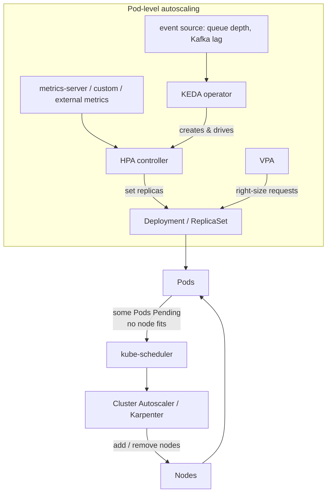
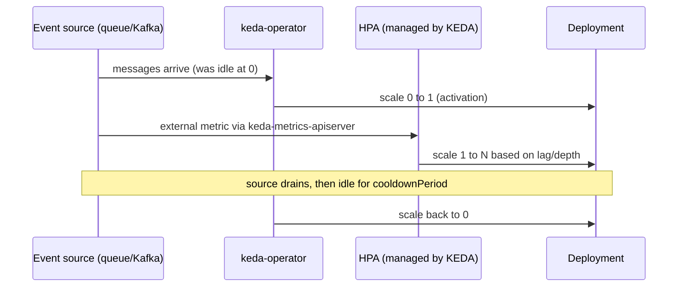
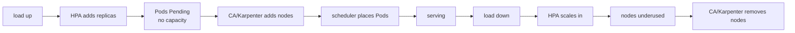

# Autoscaling: HPA, VPA, Cluster Autoscaler, KEDA & Karpenter

Kubernetes autoscaling happens on **three independent axes**, and a strong interview answer keeps
them straight:

- **Horizontal Pod Autoscaler (HPA)** — changes the **number of Pod replicas** of a workload based
  on observed metrics (CPU/memory, custom, or external). *Scale out/in.*
- **Vertical Pod Autoscaler (VPA)** — changes the **CPU/memory requests (and limits)** of the Pods
  themselves, right-sizing each replica. *Scale up/down.*
- **Cluster Autoscaler (CA) / Karpenter** — changes the **number (and shape) of nodes** in the
  cluster so Pods have somewhere to run. *Scale the infrastructure.*

On top of these sit two CNCF projects that extend the model: **KEDA** (event-driven pod autoscaling
+ true scale-to-zero) and **Karpenter** (a modern, node-group-free node autoscaler). The pieces
compose: HPA/KEDA decide how many Pods you need, and when those Pods can't fit, CA/Karpenter grow
the node pool. This topic assumes container basics from the **docker** domain and the requests/limits
mechanics from `probes-resources`. EKS-specific node autoscaling depth lives in the **aws** domain;
here we stay cloud-agnostic.

> [!KEY-TAKEAWAY]
> **HPA scales replicas, VPA scales per-Pod resources, Cluster Autoscaler/Karpenter scale nodes —
> three different axes.** HPA and VPA must **not** both act on the *same* resource metric (CPU/mem)
> of the *same* workload or they fight. Pod-level autoscalers (HPA/VPA/KEDA) create *pending* Pods
> or new requests, node-level autoscalers react to *unschedulable* Pods. KEDA adds event-driven
> triggers and scale-to-zero, Karpenter adds just-in-time, right-sized nodes without node groups.



---

## The three axes of autoscaling

**Beginner framing.** Demand changes; a fixed deployment is either wasteful (over-provisioned) or
fragile (under-provisioned). Kubernetes lets you automate three different responses:

| Axis | Controller | What it changes | Trigger | Typical use |
|---|---|---|---|---|
| Horizontal (pods) | HPA (and KEDA) | replica **count** | CPU/mem/custom/external metric | stateless web/API tiers under variable load |
| Vertical (pod size) | VPA | per-Pod **requests/limits** | historical usage | right-sizing, jobs with unknown footprint |
| Cluster (nodes) | Cluster Autoscaler / Karpenter | node **count/shape** | unschedulable / underused nodes | matching capacity to the Pod workload |

**Why they're separate.** Each solves a distinct failure mode. Horizontal handles *concurrency*
(more requests → more workers). Vertical handles *per-instance sizing* (this Pod actually needs
2Gi, not 512Mi). Cluster handles *capacity* (there is nowhere to place the Pods). A production
system usually runs HPA **and** a node autoscaler together; VPA is used more selectively.

> [!INTERVIEW]
> Interviewers love: "You added an HPA and nothing scaled — why?" The classic answers are
> (1) **metrics-server isn't installed** so the HPA can't read CPU (`<unknown>/50%`), or
> (2) the Pods have **no CPU request**, so utilization is undefined. HPA computes utilization as a
> percentage *of the request*; no request → no percentage → no scaling on that metric.

---

## metrics-server & the metrics pipeline

HPA (and `kubectl top`) needs a **metrics source**. Kubernetes defines three aggregated metrics
APIs, served by add-ons — none ship enabled by default in vanilla clusters:

- **`metrics.k8s.io`** — resource metrics (CPU/memory per Pod/node). Served by **metrics-server**,
  which scrapes the kubelet's Summary API. Powers `kubectl top` and HPA's `Resource` metrics.
- **`custom.metrics.k8s.io`** — custom metrics tied to a K8s object (e.g. requests-per-second from
  Prometheus via the Prometheus Adapter).
- **`external.metrics.k8s.io`** — metrics from outside the cluster (queue depth, cloud metrics).
  This is the API KEDA implements.

metrics-server is for **autoscaling and `kubectl top` only** — it stores *no* history and is **not**
a monitoring system. Do not scrape it for dashboards; use Prometheus (see the **observability**
domain). Its data is a short rolling window of the latest samples.

```bash
kubectl top pods              # needs metrics-server
kubectl top nodes
kubectl get apiservices | grep metrics.k8s.io   # v1beta1.metrics.k8s.io  ... True
```

> [!WARNING]
> If `kubectl top` returns `error: Metrics API not available` or an HPA shows `TARGETS:
> <unknown>/50%`, metrics-server is missing or unhealthy. On self-managed/kind clusters people also
> hit the kubelet TLS issue and add `--kubelet-insecure-tls` to metrics-server (dev only).

---

## Horizontal Pod Autoscaler (HPA) — the basics

An **HPA** is an API object (`autoscaling/v2`) that targets a scalable workload (Deployment,
StatefulSet, ReplicaSet — anything exposing the `scale` subresource) and adjusts its `replicas`
between `minReplicas` and `maxReplicas` to hit a metric target. The HPA controller in
`kube-controller-manager` reconciles on a loop (default **`--horizontal-pod-autoscaler-sync-period`
= 15s**).

```yaml
apiVersion: autoscaling/v2
kind: HorizontalPodAutoscaler
metadata:
  name: web
spec:
  scaleTargetRef:
    apiVersion: apps/v1
    kind: Deployment
    name: web
  minReplicas: 2
  maxReplicas: 20
  metrics:
  - type: Resource
    resource:
      name: cpu
      target:
        type: Utilization        # % of the Pod's CPU *request*
        averageUtilization: 60
```

Key points for interviews:

- HPA scales **replicas**, never Pod size. It requires the target's Pods to declare a **request**
  for any resource it scales on (utilization is relative to the request).
- HPA cannot scale a **DaemonSet** (not a scalable subresource) or a bare Pod.
- `kubectl get hpa` shows `TARGETS` as `current/target`; `kubectl describe hpa` shows scaling
  events and why it did/didn't act.
- Don't set the Deployment's `replicas` in Git if an HPA owns it — you'll fight the HPA (and GitOps
  will thrash). Manage `min/maxReplicas` instead.

## The HPA scaling algorithm & tolerance

The core formula (same for every metric type):

```
desiredReplicas = ceil[ currentReplicas × (currentMetricValue / desiredMetricValue) ]
```

Example: 4 replicas averaging 80% CPU with a 40% target → `ceil(4 × 80/40) = 8`. Halving the load
would target `ceil(4 × 20/40) = 2`.

Nuances that separate a good answer:

- **Tolerance:** the controller does **nothing** if the ratio is within a tolerance (default
  **0.10**) of 1.0 — this prevents flapping around the target. Historically a single cluster-wide
  flag; newer versions allow a **configurable per-HPA tolerance**.
- **Ready/known pods:** not-yet-ready Pods and Pods with missing metrics are handled
  **conservatively** — on scale-up, unready Pods are assumed to use 0% (dampens overshoot); missing
  metrics are assumed 100% on scale-down and 0% on scale-up. Pods being deleted are ignored.
- **CPU initialization period / initial readiness delay** avoid acting on cold-start CPU spikes.
- It reconciles on the 15s sync loop, not continuously.

> [!INTERVIEW]
> "Your target is 50% CPU and pods sit at 55% but nothing scales — bug?" No: 55/50 = 1.10, exactly
> at the default tolerance edge; small deviations inside ±10% are intentionally ignored to avoid
> thrash. That's a feature, not a fault.

## HPA v2: multiple metrics, custom & external metrics

`autoscaling/v2` supports **four metric source types** and lets you list **several**; the HPA
computes a desired replica count for **each** metric and takes the **maximum** (so the busiest
signal wins), clamped to `min/maxReplicas`.

| Type | Source | Example |
|---|---|---|
| `Resource` | metrics-server | CPU/memory utilization or `AverageValue` |
| `Pods` | custom-metrics API | per-pod avg, e.g. `http_requests_per_second` (raw avg, no utilization) |
| `Object` | custom-metrics API | a metric on one object, e.g. Ingress `requests-per-second` |
| `External` | external-metrics API | not tied to a K8s object, e.g. SQS `ApproximateNumberOfMessages` |

```yaml
  metrics:
  - type: Resource
    resource: { name: cpu, target: { type: Utilization, averageUtilization: 60 } }
  - type: Pods
    pods:
      metric: { name: http_requests_per_second }
      target: { type: AverageValue, averageValue: "500" }
  - type: External
    external:
      metric: { name: queue_messages }
      target: { type: AverageValue, averageValue: "30" }
```

`Pods`/`Resource` targets use **averaged** values across pods; `Object`/`External` use a single
value (`Value`) or divide by pod count (`AverageValue`). Custom/external metrics require an adapter
implementing the respective API (Prometheus Adapter, KEDA, cloud adapters).

## HPA behavior, stabilization & avoiding thrash

Autoscaling's enemy is **flapping** — scaling out then in repeatedly, which churns Pods and can
worsen latency. `autoscaling/v2` exposes a **`behavior`** block to control the *rate* and
*smoothness* of scaling, independently for `scaleUp` and `scaleDown`:

```yaml
  behavior:
    scaleDown:
      stabilizationWindowSeconds: 300   # default 300s: use the *highest* recommendation
      policies:                          #   over the last 5 min before scaling down
      - type: Percent
        value: 10
        periodSeconds: 60               # remove at most 10% of pods per minute
      - type: Pods
        value: 4
        periodSeconds: 60
      selectPolicy: Min                  # most conservative of the policies
    scaleUp:
      stabilizationWindowSeconds: 0      # default 0: scale up promptly
      policies:
      - type: Percent
        value: 100
        periodSeconds: 30               # can double every 30s
```

- **`stabilizationWindowSeconds`** — the controller considers the recommendations over the window
  and picks the value that avoids reversing direction. Default **scaleDown = 300s** (slow down
  scale-in to avoid killing pods you'll immediately need), **scaleUp = 0s** (react fast).
- **`policies`** cap how fast replicas change (by `Pods` count or `Percent`); `selectPolicy`
  (`Max`/`Min`/`Disabled`) chooses among them. `scaleDown: {selectPolicy: Disabled}` freezes
  scale-in entirely.

> [!TIP]
> Asymmetric defaults are deliberate: **scale up fast, scale down slow.** The cost of briefly
> over-provisioning is small compared to dropping requests, so aggressive scale-in is the thing you
> usually want to dampen with a longer stabilization window and small `Percent`/`Pods` steps.

## Vertical Pod Autoscaler (VPA)

**VPA** right-sizes a workload by setting **CPU/memory requests (and, keeping the original
request:limit ratio, limits)** based on historical + live usage — so you don't have to guess.
It's a separate add-on (not in core), configured via a `VerticalPodAutoscaler` CRD, and has **three
components**:

- **Recommender** — watches usage (from metrics-server/history) and computes recommended
  requests (lower bound / target / upper bound).
- **Updater** — decides which running Pods are mis-sized and **evicts** them so they get recreated
  with new requests.
- **Admission Controller** — a mutating webhook that **rewrites the Pod spec's requests** at
  creation time to the recommendation.

```yaml
apiVersion: autoscaling.k8s.io/v1
kind: VerticalPodAutoscaler
metadata:
  name: web-vpa
spec:
  targetRef:
    apiVersion: apps/v1
    kind: Deployment
    name: web
  updatePolicy:
    updateMode: "Auto"
  resourcePolicy:
    containerPolicies:
    - containerName: '*'
      minAllowed: { cpu: 50m,  memory: 64Mi }
      maxAllowed: { cpu: "2",  memory: 2Gi }
```

VPA is well suited to workloads where you can't easily reason about size (batch jobs, stateful
services) and to killing the toil of hand-tuning requests. Its recommendations are also useful in
**`Off`** mode purely as advice.

## VPA update modes & in-place resize

`updatePolicy.updateMode`:

| Mode | Behavior |
|---|---|
| `Off` | Only *computes* recommendations (visible in the VPA status); never changes Pods. Great for observation. |
| `Initial` | Applies recommendations **only at Pod creation**; never disturbs running Pods. |
| `Recreate` | Applies at creation **and evicts** running Pods when their request drifts far from target. |
| `Auto` | Currently behaves like `Recreate` (may use in-place resize as that feature matures). |
| `InPlaceOrRecreate` | Newer: tries **in-place** resize, falls back to eviction if not possible. |

The historical gotcha: pre-in-place, a Pod's resources were **immutable**, so VPA had to **evict and
recreate** the Pod to change requests — disruptive. Kubernetes added **in-place Pod resize**
(`resizePolicy`, the `/resize` subresource; **beta in 1.33, GA/stable in 1.35**) so requests can
change without restarting the Pod, which VPA is adopting via `InPlaceOrRecreate`. Always set a **PodDisruptionBudget**
and expect restarts with `Recreate`/`Auto`.

> [!WARNING]
> VPA with `Auto`/`Recreate` **deletes and recreates Pods**. On a single-replica Deployment that's
> an outage; use a PDB and multiple replicas, or use `Off`/`Initial` for sensitive workloads.

## Why you must not run HPA and VPA on the same resource

**The cardinal rule: do not let HPA and VPA both act on the *same resource metric* (CPU or memory)
of the *same* workload.** They enter a feedback loop:

- HPA sees high CPU utilization → adds replicas → per-Pod CPU drops.
- VPA sees usage and adjusts the **request** (the denominator of HPA's utilization) → utilization
  jumps or collapses → HPA over/under-reacts. They oscillate.

Safe combinations:

- **HPA on a custom/external metric** (e.g. RPS, queue depth) **+ VPA on CPU/memory** — different
  signals, no conflict. This is the recommended way to use both.
- **HPA on CPU** alone, sizing requests by hand (or with VPA in `Off` mode as advisory only).
- VPA's own guidance: don't target the same resource HPA scales on. (Managed multidimensional
  autoscalers on some clouds special-case CPU-horizontal + memory-vertical.)

## Cluster Autoscaler (CA) — scaling nodes

Pod-level autoscalers can only create *Pending* Pods; something must add **nodes**. The **Cluster
Autoscaler** watches for Pods that are **Pending because they don't fit** on any node and, if adding
a node from a configured **node group** (cloud ASG/MIG/instance group) would let them schedule, it
**scales that node group up**. It also **scales down** nodes that have been **underutilized** long
enough and whose Pods can move elsewhere.

- **Scale-up trigger:** at least one Pod is unschedulable due to insufficient resources (and a node
  group can satisfy it). CA does *not* look at CPU utilization for scale-up — it's driven by
  **scheduling pressure**, i.e. Pending Pods.
- **Scale-down trigger:** a node's utilization is below a threshold (default ~50%) for a period
  (`--scale-down-unneeded-time`, default **10 min**) and its Pods can be rescheduled — it's
  drained and removed.
- CA respects PDBs, `node.kubernetes.io/...` taints, and won't evict Pods it can't reschedule
  (kube-system without PDB, Pods with local storage, Pods with restrictive affinity) unless
  annotated `cluster-autoscaler.kubernetes.io/safe-to-evict: "true"`.

> [!WARNING]
> CA scales on **requests, not usage**. A node full of Pods that *request* a lot but *use* little
> looks "full" — CA won't add or remove based on actual utilization. This is why right-sizing
> requests (VPA / good defaults) matters: bad requests waste money regardless of the autoscaler.

## Cluster Autoscaler internals & gotchas

- CA assumes **nodes in one node group are identical** (same instance type/labels). Mixed sizes →
  use multiple node groups. It simulates scheduling to pick which group to grow.
- **Expander** strategies decide *which* group to scale when several fit: `random`, `most-pods`,
  `least-waste`, `price`, `priority`.
- Scan interval default **10s**. Scale-up is bounded by the cloud's node-provisioning time (minutes:
  boot + join + image pull), so CA is not instant.
- CA won't scale a node group **above its max size** or below **min**; a stuck Pending Pod may mean
  the group is at max, the Pod requests more than any node type offers, or a taint/affinity/PVC-zone
  mismatch (not a capacity issue at all).
- **Overprovisioning**: run low-priority "pause" Pods that CA can evict, to keep spare warm capacity
  and hide node boot latency.

## Karpenter — just-in-time, node-group-free node autoscaling

**Karpenter** is a modern node autoscaler (CNCF, originally AWS) that also reacts to unschedulable
Pods but **skips the node-group abstraction entirely**. Instead of scaling a fixed ASG of one
instance type, it looks at the *actual resource shape* of the pending Pods and **provisions
right-sized nodes just-in-time**, choosing instance types/sizes/zones/purchase-options directly from
the cloud provider.

Configured via two CRDs (v1 API):

- **`NodePool`** — constraints and limits (allowed instance types, architectures, zones, capacity
  type spot/on-demand, `limits`, `disruption` policy, `expireAfter`, weights).
- **`EC2NodeClass`** (cloud-specific NodeClass) — AMI, subnets, security groups, IAM role, block
  device mappings.

Because it talks to instances directly, Karpenter can:

- **Bin-pack** pending Pods and launch a single correctly-sized node instead of a fixed-shape one.
- **Consolidate** — replace/remove nodes when workloads shrink (delete empty nodes, or swap several
  small nodes for one cheaper node), governed by **disruption budgets**.
- Handle **drift** (node no longer matches spec), **expiration** (`expireAfter`), and **spot
  interruption** (cordon/drain ahead of reclaim).
- Retry in **milliseconds** when capacity is unavailable, and pick from **hundreds of instance
  types**.

```yaml
apiVersion: karpenter.sh/v1
kind: NodePool
metadata: { name: default }
spec:
  template:
    spec:
      requirements:
      - key: kubernetes.io/arch
        operator: In
        values: ["amd64"]
      - key: karpenter.sh/capacity-type
        operator: In
        values: ["spot", "on-demand"]
      nodeClassRef: { group: karpenter.k8s.aws, kind: EC2NodeClass, name: default }
  limits: { cpu: "1000" }
  disruption:
    consolidationPolicy: WhenEmptyOrUnderutilized
    consolidateAfter: 1m
```

## Karpenter vs Cluster Autoscaler

| Dimension | Cluster Autoscaler | Karpenter |
|---|---|---|
| Node abstraction | fixed **node groups** (ASG/MIG) | **no node groups** — provisions instances directly |
| Node sizing | pre-defined group instance type(s) | **right-sized just-in-time** from many instance types |
| Speed | minutes (bounded by ASG + boot) | fast decision (ms retries), still bounded by boot |
| Bin-packing / consolidation | limited; scales groups | strong **consolidation** to cut cost |
| Config surface | cloud-specific group config + CA flags | K8s-native CRDs (`NodePool`/`NodeClass`) |
| Flexibility (spot/zones/types) | per-group, coarse | fine-grained across many types/zones/purchase options |

Both are **node** autoscalers reacting to unschedulable Pods — you run **one** of them, alongside
HPA. Karpenter's advantages are efficiency (right-sizing + consolidation) and operational simplicity
(no fleet of node groups to maintain). CA is cloud-portable and battle-tested; Karpenter's
production support is strongest on AWS with growing multi-cloud efforts.

## KEDA — event-driven autoscaling & scale-to-zero

**KEDA (Kubernetes Event-Driven Autoscaling)** extends HPA to scale on **event sources** — queue
depth (SQS, RabbitMQ), **Kafka consumer lag**, Prometheus queries, cron schedules, database rows,
etc. — via 70+ **scalers**. Crucially, it does **not replace HPA**; it *drives* one.

Architecture:

- **`keda-operator`** — watches KEDA CRDs and **creates/manages an HPA** under the hood for each
  ScaledObject. Owns the **0↔1** transition itself.
- **`keda-metrics-apiserver`** — a metrics **adapter** implementing `external.metrics.k8s.io`, so the
  HPA can read the scaler's value.
- **admission webhooks** — validate (e.g. reject two ScaledObjects on one Deployment).

CRDs:

- **`ScaledObject`** — scale a Deployment/StatefulSet on triggers.
- **`ScaledJob`** — scale Kubernetes Jobs (e.g. one Job per batch of messages).
- **`TriggerAuthentication`** — credentials for the event source.

```yaml
apiVersion: keda.sh/v1alpha1
kind: ScaledObject
metadata: { name: consumer }
spec:
  scaleTargetRef: { name: consumer }     # a Deployment
  minReplicaCount: 0                       # scale to zero when idle
  maxReplicaCount: 50
  pollingInterval: 15                      # how often KEDA checks the source
  cooldownPeriod: 300                      # wait before scaling back to 0
  triggers:
  - type: kafka
    metadata:
      topic: orders
      lagThreshold: "100"                  # ~1 replica per 100 messages of lag
```

## KEDA scale-to-zero & the two-track model

KEDA's headline feature is **true scale-to-zero**. HPA alone **cannot** scale a Deployment to 0
replicas (`minReplicas` must be ≥1 for resource metrics, and with 0 pods there'd be no metric).
KEDA solves this with a **two-track** model:

- **0 → 1 (activation):** the **keda-operator** watches the event source directly. When there's work
  (e.g. queue depth crosses the **activation threshold**), it scales the Deployment from 0 to 1,
  then hands off to the HPA. When the source is idle for `cooldownPeriod`, KEDA scales back to 0.
- **1 → N:** delegated to the **HPA** KEDA created, using the scaler's value as an external metric.



> [!TIP]
> **Scale-to-zero works for event-driven triggers, not CPU/memory.** CPU/mem come from
> metrics-server, which needs running Pods — with 0 Pods there's no signal to wake up from. Use a
> queue/Kafka/cron/Prometheus trigger for scale-to-zero. Scale-to-zero saves cost for spiky/batch
> workloads but adds **cold-start latency** on the first request.

## The interplay: pods scale first, then nodes

The autoscalers **compose**, and interview scenarios test whether you understand the ordering:

1. Load rises → **HPA/KEDA** increases replicas.
2. The new Pods are **Pending** because existing nodes lack capacity.
3. **Cluster Autoscaler/Karpenter** sees unschedulable Pods and **adds nodes**.
4. The scheduler places the Pods; the app scales out.
5. Load falls → HPA/KEDA scales replicas in (respecting stabilization) → nodes go underutilized →
   CA/Karpenter drains and removes nodes.



Failure modes to name:
- HPA wants more Pods but **maxReplicas** caps it → no scale-up regardless of load.
- Pods Pending but **node group at max / NodePool limits reached** → nodes can't grow.
- Aggressive scale-in on both layers → **thrash**; tune HPA stabilization *and* CA
  `scale-down-unneeded-time` / Karpenter `consolidateAfter`.
- **PodDisruptionBudgets** block node scale-down (Pods can't be evicted) → nodes never removed.

## Scaling metrics, signals & choosing what to scale on

Choosing the *signal* matters as much as the machinery:

- **CPU** — good default for CPU-bound, stateless tiers; cheap and built-in. Misleads for I/O-bound
  apps (low CPU but saturated on connections/latency).
- **Memory** — usually a poor scaling signal (memory rarely frees on scale-in; risks OOM), better
  handled by VPA/right-sizing.
- **Custom (RPS, in-flight requests, p95 latency, queue length per pod)** — best correlates with
  user-facing load; needs Prometheus Adapter or KEDA.
- **External (queue depth, Kafka lag)** — ideal for worker/consumer patterns; enables scale-to-zero
  via KEDA.

General guidance: scale **horizontally on the signal that reflects demand** (RPS/queue), use **VPA
or good requests** to size each Pod, and let a node autoscaler handle capacity. Always defend against
**thrash** with stabilization windows and rate policies, and load-test the scaling behavior — an
autoscaler that reacts too slowly or oscillates is worse than a well-sized static deployment.

## Common follow-up questions

- **"HPA shows `<unknown>/50%` — what's wrong?"** metrics-server isn't installed/healthy, or the
  Pods have no CPU **request** so utilization is undefined.
- **"Can HPA scale to zero?"** Not for resource metrics (min ≥1). Use **KEDA** for scale-to-zero on
  event sources.
- **"Why can't I run HPA and VPA together on CPU?"** VPA changes the request (HPA's denominator);
  they form a feedback loop and oscillate. Use HPA on a custom metric + VPA on resources, or pick one.
- **"Load spiked, HPA added replicas, but they're all Pending — why?"** No node capacity; you need a
  **node** autoscaler (CA/Karpenter), and it may be capped at max or blocked by taints/affinity/PVC
  zones.
- **"Karpenter vs Cluster Autoscaler?"** CA scales fixed node groups; Karpenter provisions
  right-sized instances just-in-time with no node groups and consolidates for cost.
- **"Why does my HPA flap?"** Metric near target within tolerance, or scale-down too aggressive —
  tune `behavior.stabilizationWindowSeconds` and policies.
- **"Does CA scale on CPU usage?"** No — on **scheduling pressure** (unschedulable Pods) and
  **requests**, not live utilization.
- **"VPA restarted my Pods — expected?"** Yes in `Auto`/`Recreate` (pre in-place resize); use a PDB,
  `Initial`/`Off`, or `InPlaceOrRecreate` on new versions.

## References

- Kubernetes docs — [Horizontal Pod Autoscaling](https://kubernetes.io/docs/tasks/run-application/horizontal-pod-autoscale/)
  and [HPA walkthrough](https://kubernetes.io/docs/tasks/run-application/horizontal-pod-autoscale-walkthrough/)
- Kubernetes docs — [Resource metrics pipeline / metrics-server](https://kubernetes.io/docs/tasks/debug/debug-cluster/resource-metrics-pipeline/)
- Kubernetes docs — [Resize CPU and Memory Resources assigned to Containers (in-place resize, beta 1.33, GA 1.35)](https://kubernetes.io/docs/tasks/configure-pod-container/resize-container-resources/)
- Vertical Pod Autoscaler — [README & docs](https://github.com/kubernetes/autoscaler/tree/master/vertical-pod-autoscaler)
- Cluster Autoscaler — [FAQ & docs](https://github.com/kubernetes/autoscaler/tree/master/cluster-autoscaler)
- [Karpenter documentation](https://karpenter.sh/docs/) — Concepts, NodePools, Disruption
- [KEDA documentation](https://keda.sh/docs/) — Concepts, Scalers, ScaledObject spec
- `autoscaling/v2` — [Kubernetes API reference](https://kubernetes.io/docs/reference/kubernetes-api/workload-resources/horizontal-pod-autoscaler-v2/)
