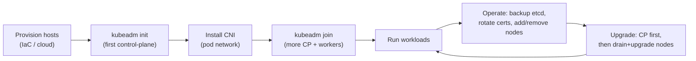
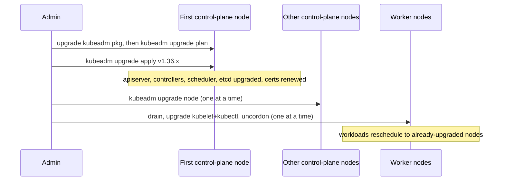
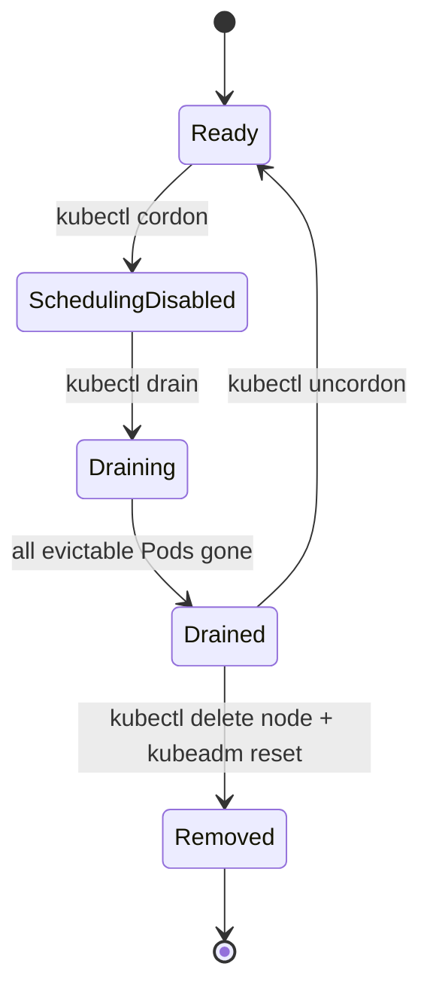

# Cluster Installation, Upgrades & Lifecycle

Most engineers *consume* a Kubernetes cluster; senior engineers must also **operate its
lifecycle** — how a cluster is born, how its brain (etcd) is protected, and how you upgrade it
without dropping traffic. This topic is deliberately **cloud-agnostic**: it teaches the K8s
machinery (kubeadm bootstrapping, etcd backup/restore, the version skew policy, drains and
PodDisruptionBudgets, certificate rotation, node lifecycle, deprecated-API migration). Managed
platforms (EKS/GKE/AKS) automate much of this, but interviewers still expect you to know what
they automate and why.

This builds on the `architecture-control-plane` topic (apiserver, etcd, scheduler,
controller-manager, kubelet). It assumes container basics from the `docker` domain. For **cloud
provisioning / IaC** (Terraform, CloudFormation) see `devops-cicd`; for **EKS at the AWS-service
level** see `aws` (`aws-containers-ecs-eks`). Here we stay on the Kubernetes lifecycle itself.

> [!KEY-TAKEAWAY]
> The cluster's entire desired state lives in **etcd** — lose it without a backup and you lose
> the cluster. Upgrades follow strict rules: **control plane before nodes, one minor version at
> a time, apiserver first**, and the **version skew policy** (kubelet may lag the apiserver by up
> to 3 minors; controllers/scheduler by only 1) is what makes rolling, zero-downtime upgrades
> possible. Drains + PodDisruptionBudgets protect availability while you cycle nodes.



---

## Cluster creation options: managed, self-managed, and local

**Beginner:** There is no single "install Kubernetes" button — you choose *who runs the control
plane* and *how much you operate yourself*. Three broad options:

| Option | Examples | Who runs the control plane | Use for |
|---|---|---|---|
| **Managed control plane** | EKS, GKE, AKS | The cloud provider (you don't see/patch apiserver or etcd) | Production, minimal ops burden |
| **Self-managed** | `kubeadm`, kOps, Cluster API, Rancher (RKE) | You (on your own VMs/bare metal) | On-prem, full control, air-gapped |
| **Local / dev** | `kind`, `minikube`, `k3d`, `k3s` | You, on a laptop / single box | Learning, CI, local testing |

**Intermediate — the managed trade-off.** With a managed control plane, the provider runs and
patches the apiserver, etcd (backed up automatically), scheduler, and controller-manager across
AZs, and gives you an endpoint. You still own the **worker nodes** (and often trigger node-group
upgrades yourself). You give up: direct etcd access, control over apiserver flags/admission,
and the exact upgrade timing (providers offer a version window). This is why interviewers ask
"what does EKS *not* manage?" — the answer is your nodes, your workloads, and your RBAC/network
policy.

**Advanced — local tools differ in what they emulate.**
- **kind** ("Kubernetes IN Docker") runs each node as a *container* — great for CI, multi-node
  topologies, and testing K8s itself; not for running real workloads long-term.
- **minikube** runs a node in a VM or container; single-node focus, many addons.
- **k3s** is a **production-capable** lightweight distro (single ~50MB binary, SQLite or etcd
  datastore option, edge/IoT focus) — not just a dev tool.

> [!INTERVIEW]
> "How would you stand up a cluster?" For production say: *managed control plane if on a cloud
> (offload etcd/apiserver ops), self-managed via kubeadm or Cluster API if on-prem/air-gapped.*
> For local dev: *kind or minikube.* Naming k3s as production-capable (edge) shows depth.

---

## Bootstrapping a cluster with kubeadm (init and join)

**Beginner:** `kubeadm` is the official tool to bootstrap a **conformant** self-managed cluster.
It sets up the control-plane components and lets nodes join — but it deliberately does **not**
install a CNI network plugin or cloud integration; you add those. Two core commands:

- `kubeadm init` — turns the first host into a control-plane node.
- `kubeadm join` — adds more control-plane nodes or worker nodes to the cluster.

```bash
# On the first control-plane node:
sudo kubeadm init --pod-network-cidr=10.244.0.0/16 --control-plane-endpoint="lb.example.com:6443"

# Set up kubectl for your user (copy the admin kubeconfig):
mkdir -p $HOME/.kube && sudo cp /etc/kubernetes/admin.conf $HOME/.kube/config
sudo chown $(id -u):$(id -g) $HOME/.kube/config

# init prints a join command — run it on each worker:
sudo kubeadm join lb.example.com:6443 --token abcdef.0123456789abcdef \
  --discovery-token-ca-cert-hash sha256:<hash>
```

**Intermediate — what init actually does:**
1. **Preflight checks** (swap off, ports free, cgroup driver, container runtime reachable via CRI).
2. Generates the cluster **CA and certificates** in `/etc/kubernetes/pki`.
3. Writes **static Pod manifests** to `/etc/kubernetes/manifests/` — the kubelet runs apiserver,
   etcd, scheduler, and controller-manager as **static Pods** (the kubelet watches that directory).
4. Bootstraps etcd (stacked on the control-plane node by default).
5. Installs core addons: **CoreDNS** and **kube-proxy**.
6. Emits a **bootstrap token** and CA hash used by `join`.

After init the cluster's Nodes are `NotReady` until you install a **CNI plugin** (Calico,
Cilium, Flannel, etc.) — DNS Pods stay `Pending` until pod networking exists. This is a classic
gotcha: "I ran kubeadm init and CoreDNS is Pending" → you forgot the CNI.

**Advanced — stacked vs external etcd, and HA.**
- **Stacked etcd** (default): etcd runs as a static Pod *on each control-plane node*. Simpler,
  fewer machines; a control-plane node loss also loses an etcd member.
- **External etcd**: a separate etcd cluster, decoupled from control-plane nodes. More hosts,
  but etcd and apiserver fail independently — preferred for large/critical clusters.
- **HA control plane**: run **≥3** control-plane nodes behind a **load balancer** (the
  `--control-plane-endpoint`). You must set that endpoint at init time — you cannot convert a
  single-node cluster to HA later without re-bootstrapping the endpoint.

> [!WARNING]
> `kubeadm init` requires **swap handling** and a working **CRI runtime** with a matching
> **cgroup driver** (systemd vs cgroupfs must agree between kubelet and runtime) or the kubelet
> fails to start. Since v1.24 there is no dockershim — use containerd or CRI-O.

---

## The etcd datastore: backup and restore

**Beginner:** **etcd** is the consistent key-value store that holds *all* cluster state — every
object you ever created. The apiserver is the *only* component that talks to etcd. **If etcd
data is lost and you have no snapshot, the cluster is gone** (nodes keep running existing Pods,
but you can't recover the control plane's memory). Therefore: **back up etcd** — it is the single
most important DR task in cluster operations.

**Intermediate — taking and restoring a snapshot with `etcdctl`:**

```bash
# Backup: take a point-in-time snapshot (run against the etcd endpoint with its certs)
ETCDCTL_API=3 etcdctl snapshot save /backup/etcd-snapshot.db \
  --endpoints=https://127.0.0.1:2379 \
  --cacert=/etc/kubernetes/pki/etcd/ca.crt \
  --cert=/etc/kubernetes/pki/etcd/server.crt \
  --key=/etc/kubernetes/pki/etcd/server.key

# Inspect a snapshot
etcdutl snapshot status /backup/etcd-snapshot.db --write-out=table

# Restore: writes a NEW data directory from the snapshot (does NOT touch the live cluster)
etcdutl snapshot restore /backup/etcd-snapshot.db --data-dir=/var/lib/etcd-restored
```

Restore is **offline**: you stop the apiserver and etcd, run the restore into a fresh data dir,
point etcd at that directory (update the static Pod manifest's `--data-dir` / volume), and
restart. Restoring **rolls the entire cluster back** to the snapshot's moment — anything created
after the snapshot is lost. That is why snapshot **frequency** matters (e.g. every 15–30 min +
before every upgrade).

**Advanced — gotchas:**
- **Restore is a whole-cluster operation, not selective.** You cannot restore a single Namespace
  from an etcd snapshot; it's all-or-nothing. For object-level backup use tools like **Velero**.
- In an **HA etcd cluster**, restore on *one* member into a fresh data dir, then have the others
  re-join (or restore with matching `--initial-cluster` on each). You must not just restore one
  member into a live quorum — you'll corrupt state.
- `etcdctl` (client ops) vs `etcdutl` (offline data ops like snapshot restore/status) — in newer
  etcd releases restore moved to **`etcdutl`**.
- Managed clusters (EKS/GKE) back etcd up for you and give you no direct etcdctl access.

> [!TIP]
> A senior answer to "how do you protect a cluster from disaster?" leads with **automated,
> tested etcd snapshots stored off-cluster**, plus **application-level backup (Velero)** for
> PVs and selective restore. A backup you have never restored is not a backup.

---

## etcd quorum and high availability

**Beginner:** etcd uses the **Raft** consensus protocol and needs a **majority (quorum)** of
members available to accept writes. Quorum for `N` members is `floor(N/2) + 1`. Because a
majority is required, you run an **odd** number of members (3, 5, 7).

**Intermediate — why odd numbers?** Fault tolerance = `floor((N-1)/2)`:

| Members | Quorum | Failures tolerated |
|---|---|---|
| 1 | 1 | 0 |
| 3 | 2 | 1 |
| 4 | 3 | 1 (no better than 3, more overhead) |
| 5 | 3 | 2 |
| 7 | 4 | 3 |

A 4-member cluster tolerates only 1 failure — the same as 3 — but has *more* members that can
fail and a larger quorum to lose, so it's strictly worse than 3. Hence odd numbers. Most
clusters use **3 or 5** members; beyond 7, write latency (every write must be replicated to a
majority) usually outweighs the availability gain.

**Advanced:** If etcd **loses quorum** (e.g., 2 of 3 members down), it becomes **read-limited /
write-unavailable** — the apiserver can't persist changes, so the control plane freezes for
mutations (existing Pods keep running). Recovery means restoring members or, worst case,
restoring from a snapshot to re-form the cluster. Spread etcd members across **failure domains
(AZs)** so a single-AZ outage can't take the majority. This is why control-plane nodes come in
odd counts too (stacked etcd) — see `architecture-control-plane`.

---

## Version skew policy

**Beginner:** Kubernetes components run at different versions during a rolling upgrade, so K8s
defines exactly **how far apart their versions may be**. The golden rule: **no component may be
newer than the kube-apiserver** it talks to (the apiserver is the reference point). The apiserver
is always upgraded **first**.

**Intermediate — the numbers (versions are `major.minor.patch`; skew is measured in *minor*):**

| Component | Relative to apiserver | May be older by |
|---|---|---|
| **kubelet** | never newer | up to **3** minor versions |
| **kube-proxy** | never newer | up to **3** minor (and ±3 vs its node's kubelet) |
| **kube-controller-manager / kube-scheduler / cloud-controller-manager** | never newer | up to **1** minor version |
| **kubectl** | — | within **1** minor **older or newer** (only client that may be newer) |

Example: apiserver at **1.36** → kubelet supported at 1.36/1.35/1.34/1.33; controller-manager
only at 1.36 or 1.35; kubectl at 1.37/1.36/1.35.

**Advanced — why kubelet gets 3 but controllers get 1.** The kubelet and kube-proxy live on many
nodes you drain and upgrade *gradually*, so they need a wide window (3 minors) to lag the control
plane during a long node-by-node rollout. The controller-manager/scheduler live *with* the
apiserver on the control plane and are upgraded together, so 1 minor of skew is enough (to cover
the brief window mid-upgrade). In **HA**, if apiservers themselves are skewed (1.36 and 1.35),
the **oldest apiserver** defines the ceiling for everything else. And you can never *skip* a
minor version on the apiserver — upgrades go 1.34 → 1.35 → 1.36, never 1.34 → 1.36.

> [!WARNING]
> If a kubelet is allowed to fall the full **3 minors** behind, you **cannot upgrade the
> apiserver again** until you first upgrade that kubelet — doing so would push skew to 4 and
> violate the policy. Don't let nodes rot at the skew boundary.

---

## Upgrading a cluster: order and process

**Beginner:** Cluster upgrades follow a strict order derived from the skew policy:
**control plane first, then worker nodes**, and **one minor version at a time** (you cannot skip
minors). Within the control plane, the **apiserver is upgraded first**, then
controller-manager/scheduler, then the addons.

**Intermediate — the kubeadm upgrade flow:**



```bash
# --- First control-plane node ---
sudo apt-get install -y kubeadm='1.36.x-*'
sudo kubeadm upgrade plan                 # shows what can be upgraded
sudo kubeadm upgrade apply v1.36.x        # upgrades control-plane static Pods + renews certs

# --- Each additional control-plane node ---
sudo kubeadm upgrade node                 # (not "apply"); no plan/CNI needed here

# --- Then, for EACH node (control-plane and worker), upgrade the kubelet ---
kubectl drain <node> --ignore-daemonsets   # evict Pods, mark unschedulable
sudo apt-get install -y kubelet='1.36.x-*' kubectl='1.36.x-*'
sudo systemctl daemon-reload && sudo systemctl restart kubelet
kubectl uncordon <node>                    # allow scheduling again
```

**Advanced — key facts:**
- `kubeadm upgrade apply` runs only on the **first** control-plane node; others use
  `kubeadm upgrade node`. Control-plane nodes are upgraded **one at a time** (v1.28+ kubeadm
  won't touch addons like CoreDNS/kube-proxy until all CP instances are upgraded).
- **In-place minor kubelet upgrades are not supported** — you *must drain the node first* for a
  minor bump. This is why upgrades are node-by-node and rely on spare capacity to reschedule.
- `kubeadm upgrade` **auto-renews the certificates it manages** (opt out with
  `--certificate-renewal=false`).
- On a managed platform you upgrade the **control plane** with one API/console action, then
  upgrade each **node group** (often a rolling replacement of nodes with the new version).

---

## Draining nodes and PodDisruptionBudgets

**Beginner:** Before you take a node out of service (upgrade, patch, decommission) you **cordon**
it (mark unschedulable so no *new* Pods land) and **drain** it (evict existing Pods so they
reschedule elsewhere). Draining uses the **Eviction API**, which respects PodDisruptionBudgets.

```bash
kubectl cordon <node>                       # mark unschedulable (no eviction yet)
kubectl drain <node> --ignore-daemonsets --delete-emptydir-data
kubectl uncordon <node>                     # re-enable scheduling after work is done
```

`--ignore-daemonsets` is almost always needed because DaemonSet Pods are tied to the node and
aren't rescheduled (drain refuses without it). `--delete-emptydir-data` is required if any Pod
uses an `emptyDir` (data is lost — that's the point of the flag).

**Intermediate — PodDisruptionBudget (PDB).** A PDB caps how many Pods of an app may be **down
voluntarily at once**, protecting availability during drains/upgrades:

```yaml
apiVersion: policy/v1
kind: PodDisruptionBudget
metadata:
  name: web-pdb
spec:
  minAvailable: 2          # or maxUnavailable: 1
  selector:
    matchLabels:
      app: web
```

During a drain, the Eviction API **blocks** evicting a Pod if doing so would violate the PDB —
so drain **waits** until enough replicas are healthy elsewhere before evicting the next one. This
is what turns a node upgrade into a *rolling*, no-outage operation.

**Advanced — voluntary vs involuntary disruptions.** PDBs only protect against **voluntary**
disruptions (drain, `kubectl delete pod` via eviction, autoscaler scale-down) — **not** node
crashes, kernel panics, or `kubectl delete node` (involuntary). A common gotcha: a PDB with
`minAvailable: 100%` or a single-replica Deployment with `minAvailable: 1` makes the node
**undrainable** — drain hangs forever because no eviction can satisfy the budget. `kubectl drain`
without `--force` also refuses to evict "bare" Pods not managed by a controller.

> [!WARNING]
> A misconfigured PDB (`minAvailable` equal to replica count, or `maxUnavailable: 0`) will
> **stall node drains and cluster upgrades indefinitely**. Always leave room for at least one
> Pod to be evicted, and ensure replicas > `minAvailable`.

---

## Certificate management and rotation

**Beginner:** A kubeadm cluster is a web of **TLS certificates** — the cluster CA signs certs for
the apiserver, etcd, kubelets, and clients (in `/etc/kubernetes/pki`). By default, kubeadm-issued
**certificates expire after 1 year**. If they expire, components can't authenticate to the
apiserver and the control plane effectively stops working — a notorious "cluster broke exactly a
year after install" outage.

**Intermediate — checking and renewing:**

```bash
kubeadm certs check-expiration      # table of every cert and its expiry date
kubeadm certs renew all             # renew all kubeadm-managed certs (needs restart of CP Pods)
```

The good news: **`kubeadm upgrade` automatically renews these certs**, so a cluster upgraded at
least yearly never hits expiry. Clusters left un-upgraded for over a year are the ones that break.
The **cluster CA** itself has a **10-year** default lifetime (renewing leaf certs is routine;
rotating the CA is a bigger, rarer operation).

**Advanced — kubelet certs rotate themselves.** The kubelet's **serving and client certs** can
**auto-rotate** via the certificate rotation feature (`--rotate-certificates`, on by default in
kubeadm setups): the kubelet requests a new cert through the **CSR API** before expiry and the
controller-manager (with `--cluster-signing-*` configured) signs it. So node certs are usually
self-healing; the *control-plane* certs (apiserver, etcd) are the ones tied to the 1-year
kubeadm renewal. Managed control planes handle all of this invisibly.

> [!INTERVIEW]
> "Why did a healthy cluster suddenly stop responding after ~12 months?" → **expired control-plane
> certificates.** Fix: `kubeadm certs renew all` + restart control-plane static Pods; prevent it
> by upgrading regularly (which auto-renews) or automating `certs renew`.

---

## Node lifecycle: add, remove, cordon, drain, uncordon

**Beginner:** Nodes are **disposable**. You add capacity by joining nodes and remove it by
draining then deleting them. The state machine of a node during maintenance:



**Intermediate — add a node:**
```bash
# On an existing control-plane node, mint a fresh join command:
kubeadm token create --print-join-command
# Run the printed "kubeadm join ..." on the new host.
```
Bootstrap tokens are short-lived (default 24h) — you generate a new one to add nodes later.

**Remove a node cleanly:**
```bash
kubectl drain <node> --ignore-daemonsets --delete-emptydir-data   # evict workloads
kubectl delete node <node>                                        # remove from the API
# on the node itself:
sudo kubeadm reset                                                # undo kubeadm state
```

**Advanced — cordon vs drain vs delete.**
- **cordon** = mark unschedulable, **no eviction** (existing Pods stay, useful to quarantine a
  suspect node).
- **drain** = cordon **+ evict** existing Pods (respecting PDBs).
- **delete node** = remove the Node object; the kubelet may re-register it if still running, so
  you must also stop the kubelet / `kubeadm reset` to truly remove it.

The **node controller** also manages lifecycle automatically: if a node stops heartbeating, it's
marked `NotReady`, and the controller applies the `NoExecute` taints
`node.kubernetes.io/not-ready` and `node.kubernetes.io/unreachable`. Pods that don't tolerate
those taints are then evicted after their `tolerationSeconds` (default **300s**, set cluster-wide
via `--default-not-ready-toleration-seconds` / `--default-unreachable-toleration-seconds`) and
rescheduled — but that's an *involuntary* path and does **not** respect PDBs. (The older
`--pod-eviction-timeout` kube-controller-manager flag is legacy — taint-based eviction, GA since
v1.18, is the live mechanism.)

---

## Backup and disaster-recovery strategies

**Beginner:** "Backing up a Kubernetes cluster" means two different things:
1. **Cluster state** → the **etcd snapshot** (every object). Restoring it rebuilds the control
   plane's memory.
2. **Application data + selective object backup** → tools like **Velero**, which back up
   Namespaces/objects to object storage and snapshot **PersistentVolumes**.

**Intermediate — why you need both.** An etcd snapshot restores *everything at once* and can't do
"restore just the `payments` namespace." Velero backs up subsets of objects **and** the actual
data on PVs (via cloud volume snapshots or a file-level copy), enabling **granular** restore and
**migration between clusters** — something an etcd snapshot (tied to one cluster's identity) can't
do. GitOps (`gitops-continuous-delivery`) adds a third leg: your desired manifests live in Git,
so re-applying them to a fresh cluster recreates workloads declaratively.

**Advanced — a layered DR posture:**

| Layer | Tool | Restores |
|---|---|---|
| Cluster control-plane state | etcd snapshot (`etcdctl`/`etcdutl`) | Whole cluster to a point in time |
| App objects + PV data | Velero + volume snapshots | Namespaces, selective, cross-cluster |
| Desired config | Git (GitOps) | Declarative re-apply of manifests |

On **managed** clusters you rarely restore etcd yourself (the provider owns it); GitOps + Velero
become your primary DR levers because they operate at the Kubernetes-object layer you *do* control.

---

## Deprecated-API migration on upgrade

**Beginner:** Kubernetes evolves API groups/versions (e.g. `extensions/v1beta1` →
`networking.k8s.io/v1` for Ingress). When an API version is **removed** in a release, manifests or
controllers still using the old version **stop working** after you upgrade. So before every minor
upgrade you must find and migrate deprecated API usage.

**Intermediate — the deprecation lifecycle.** APIs go through **alpha → beta → stable (GA)**, and
old versions are **deprecated** (still work, emit warnings) before being **removed** in a later
minor. The apiserver returns warning headers, and `kubectl` prints them, when you use a deprecated
API. Historic examples: Ingress `extensions/v1beta1` removed in **1.22**; **PodSecurityPolicy**
removed in **1.25** (replaced by **Pod Security Standards / admission**); CronJob and many others
moved to stable groups.

**Advanced — tooling and process.**
- Run **`kubeadm upgrade plan`** — it reports deprecated/removed APIs relevant to the target.
- Tools like **`kubent` (kube-no-trouble)** and **Pluto** scan live objects and Helm releases for
  APIs that will be removed in your target version.
- The **Storage Version Migrator** re-writes stored objects to the current version so removing an
  old served version doesn't strand data in etcd.
- Practically: scan → update manifests/Helm charts to the new apiVersion → re-apply → *then*
  upgrade. Skipping this is the most common cause of "the upgrade succeeded but half my
  Ingresses/PSPs vanished."

> [!WARNING]
> Removed APIs are gone for good in that version — there is **no `--force` to keep serving them**.
> Migrate manifests *before* the control-plane upgrade, and remember Helm charts and CRD-based
> controllers may embed old apiVersions too.

---

## Common follow-up questions

- "What does a managed control plane (EKS/GKE) NOT manage for you?" — Your worker nodes,
  workloads, RBAC/NetworkPolicy, and (usually) triggering node-group upgrades. You lose direct
  etcd/apiserver-flag access.
- "Why is CoreDNS Pending right after kubeadm init?" — No CNI installed yet; Pods can't get an
  IP until a pod-network plugin is applied.
- "Can I upgrade from 1.34 straight to 1.36?" — No. One minor version at a time (1.34 → 1.35 →
  1.36); the apiserver must not skip minors.
- "kubelet is 1.33, apiserver is 1.36 — is that OK?" — Yes, kubelet may lag by up to 3 minors.
  But you can't upgrade the apiserver to 1.37 until you bump that kubelet, or skew hits 4.
- "My drain is hanging forever — why?" — A PodDisruptionBudget can't be satisfied (e.g.
  `minAvailable` = replica count, or single-replica app), or a bare/unmanaged Pod without
  `--force`. DaemonSet Pods need `--ignore-daemonsets`.
- "Cluster died ~1 year after install with TLS errors." — Control-plane certs expired
  (kubeadm default 1yr). `kubeadm certs renew all` + restart; upgrade regularly to auto-renew.
- "How do you back up a cluster?" — etcd snapshot (whole state) + Velero (selective objects +
  PV data) + GitOps (declarative manifests). Test restores.
- "Odd vs even etcd members?" — Odd. 4 members tolerate the same 1 failure as 3 but cost more;
  quorum = floor(N/2)+1.
- "What replaced PodSecurityPolicy?" — Pod Security Standards enforced via the built-in Pod
  Security admission controller (PSP removed in 1.25). See `security-rbac` /
  `workload-network-security`.

## References

- Kubernetes docs — Version Skew Policy:
  https://kubernetes.io/releases/version-skew-policy/
- Kubernetes docs — Upgrading kubeadm clusters:
  https://kubernetes.io/docs/tasks/administer-cluster/kubeadm/kubeadm-upgrade/
- Kubernetes docs — Creating a cluster with kubeadm:
  https://kubernetes.io/docs/setup/production-environment/tools/kubeadm/create-cluster-kubeadm/
- Kubernetes docs — Options for Highly Available topology (stacked vs external etcd):
  https://kubernetes.io/docs/setup/production-environment/tools/kubeadm/ha-topology/
- Kubernetes docs — Operating etcd clusters / backing up and restoring:
  https://kubernetes.io/docs/tasks/administer-cluster/configure-upgrade-etcd/
- etcd docs — Disaster recovery & FAQ (quorum, member sizing):
  https://etcd.io/docs/latest/op-guide/recovery/ and https://etcd.io/docs/latest/faq/
- Kubernetes docs — Certificate Management with kubeadm:
  https://kubernetes.io/docs/tasks/administer-cluster/kubeadm/kubeadm-certs/
- Kubernetes docs — Safely Drain a Node & PodDisruptionBudgets:
  https://kubernetes.io/docs/tasks/administer-cluster/safely-drain-node/ and
  https://kubernetes.io/docs/concepts/workloads/pods/disruptions/
- Kubernetes docs — Deprecated API Migration Guide:
  https://kubernetes.io/docs/reference/using-api/deprecation-guide/
- Kubernetes docs — Taint-based eviction & node conditions (NoExecute taints, tolerationSeconds):
  https://kubernetes.io/docs/concepts/scheduling-eviction/taint-and-toleration/#taint-based-evictions
- Kubernetes docs — Install Tools (kind, minikube, kubeadm):
  https://kubernetes.io/docs/tasks/tools/ and https://k3s.io/
- Velero docs — Backup & restore, cluster migration:
  https://velero.io/docs/
