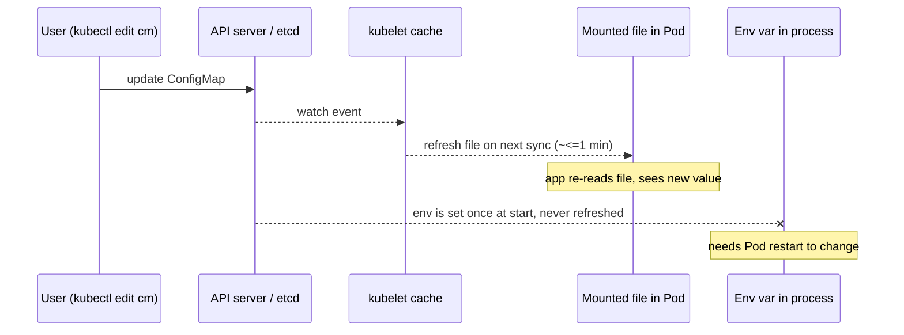
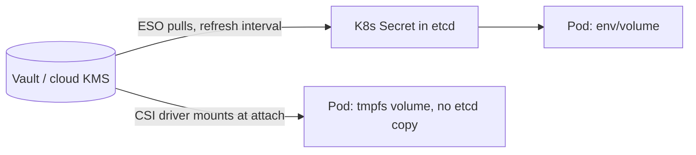

# Configuration & Secrets Management

Applications need configuration — database URLs, feature flags, log levels, TLS certs,
API keys. The **12-factor** rule is to keep config **in the environment, not in the code
or image**, so the *same* immutable image promotes unchanged from dev to prod and only the
config differs. Kubernetes gives you two purpose-built API objects for this: **ConfigMap**
for non-sensitive config and **Secret** for sensitive values. Both are just key/value data
you decouple from the Pod spec and inject at runtime — as environment variables or as files
mounted into the container.

This topic assumes container basics from the **docker** domain (images are immutable
artifacts; don't bake environment-specific config or credentials into layers). It focuses
on the K8s mechanics: how config is consumed, the env-var-vs-volume update gotcha, why a
Secret is *not* encrypted by default, and how external secret managers (Vault, cloud KMS)
and GitOps-safe patterns (Sealed Secrets, SOPS) fit in. Encryption-at-rest and RBAC on
Secrets are introduced here and deepened in **security-rbac** / **workload-network-security**.

> [!KEY-TAKEAWAY]
> A **Secret is base64-*encoded*, not encrypted** — by default it sits in etcd in plaintext
> and anyone with API/etcd access (or the ability to create a Pod in the namespace) can read
> it. Encoding ≠ security. Protect Secrets with **etcd encryption-at-rest + tight RBAC**, and
> for real secret management reach for an external store (Vault / cloud KMS via the External
> Secrets Operator or Secrets Store CSI Driver). ConfigMaps are the same but for
> non-sensitive data.

> [!KEY-TAKEAWAY]
> **Volume-mounted** ConfigMaps/Secrets update *live* in the container (within ~1 minute);
> values consumed as **environment variables do NOT update** — the process must be restarted
> (a new Pod) to see the change. This single distinction drives most real-world config bugs.

---

## Why not bake config into the image (12-factor config)

The **12-factor** methodology says config — anything that varies between deploys (creds,
hostnames, ports, toggles) — belongs in the *environment*, not in the code or the built
artifact. In Kubernetes terms: build **one** image, and inject per-environment config via
ConfigMaps/Secrets referenced by the Pod. This is why the docker domain treats images as
immutable and environment-agnostic.

Baking config into the image is an anti-pattern because:

- **You lose promotion guarantees.** If dev, staging and prod each need a rebuilt image, the
  artifact you tested is not the artifact you ship — defeating the point of immutable images.
- **Secrets leak into layers.** A credential in an `ENV` or `COPY`ed file is baked into an
  image layer forever (and often pushed to a registry). Layer history and `docker history`
  expose it even if a later layer "removes" it.
- **No runtime change without a rebuild.** Flipping a feature flag or rotating a DB password
  should not require a CI build.

> [!INTERVIEW]
> "Why not put the DB URL in the image?" → *Same image must run in every environment;
> config that varies per environment goes in ConfigMaps/Secrets injected at runtime. Baking
> it in breaks immutability and, for secrets, leaks credentials into image layers.*

---

## ConfigMap: non-sensitive configuration

A **ConfigMap** stores non-confidential key/value pairs. Keys can be short values or whole
file contents. It exists so config can live and change independently of the Pods that use it.

```yaml
apiVersion: v1
kind: ConfigMap
metadata:
  name: app-config
  namespace: default
data:
  LOG_LEVEL: "info"
  FEATURE_X_ENABLED: "true"
  # a whole file as one key
  app.properties: |
    server.port=8080
    cache.ttl=300
binaryData:
  logo.png: <base64-bytes>   # for non-UTF-8 content
```

Create imperatively too:

```bash
kubectl create configmap app-config --from-literal=LOG_LEVEL=info \
  --from-file=app.properties
kubectl get configmap app-config -o yaml
```

Key facts and limits:

- **Not for large data.** A ConfigMap's data must not exceed **1 MiB** (an etcd object-size
  constraint). Larger data → a volume, an artifact store, or a database.
- **Namespaced.** A Pod can only reference a ConfigMap in its **own namespace**.
- **Must exist before the Pod (usually).** By default a Pod referencing a missing ConfigMap
  won't start unless the reference is marked `optional: true`.
- **`data` is UTF-8 strings; `binaryData` is base64** for binary blobs.

> [!WARNING]
> A ConfigMap is *not* a secrecy boundary. Anyone who can read ConfigMaps in the namespace
> reads everything in them in plaintext. Put credentials in a **Secret**, not a ConfigMap.

---

## Secret: sensitive data (base64-encoded, NOT encrypted)

A **Secret** looks almost exactly like a ConfigMap but is intended for sensitive data
(passwords, tokens, keys, certs). The crucial gotcha: the values in a Secret's `data` field
are **base64-encoded, not encrypted**. Base64 is a reversible transport encoding, not a
cipher — `echo <val> | base64 -d` reveals it instantly.

```yaml
apiVersion: v1
kind: Secret
metadata:
  name: db-cred
type: Opaque
data:
  username: YWRtaW4=        # base64("admin")
stringData:
  password: s3cr3t         # stringData: you write plaintext, K8s base64-encodes on write
```

`stringData` is a write-only convenience: you supply plaintext and the API server encodes it
into `data`; it never appears when you read the object back.

By default a Secret is **stored unencrypted in etcd**. The threat model the docs call out:

- Anyone with **API access** or **etcd access** can read every Secret.
- Anyone who can **create a Pod** in a namespace can mount and read any Secret there
  (including indirectly via a Deployment). So Pod-create permission ≈ secret-read permission.

Mitigations (layered — see **security-rbac**):

1. **Enable encryption-at-rest** for Secrets (encrypt in etcd, ideally via a KMS provider).
2. **Tight RBAC** — least-privilege `get/list/watch` on `secrets` and on `create pods`.
3. Restrict which containers can read a Secret; prefer **external secret stores**.

> [!WARNING]
> `kubectl get secret x -o yaml` shows base64 — this is **encoding, not protection**. Do not
> treat "it's base64" as "it's secure." The two real protections are etcd
> encryption-at-rest and RBAC.

---

## Secret types (Opaque, dockerconfigjson, tls, service-account-token)

A Secret's `type` field tells Kubernetes (and controllers) what shape the data has and lets
the API server validate required keys. The built-in types:

| `type` | Purpose | Required key(s) |
|---|---|---|
| `Opaque` | arbitrary user data (default) | none |
| `kubernetes.io/service-account-token` | ServiceAccount token | annotations bind it to an SA |
| `kubernetes.io/dockercfg` | legacy `~/.dockercfg` | `.dockercfg` |
| `kubernetes.io/dockerconfigjson` | registry pull creds (`~/.docker/config.json`) | `.dockerconfigjson` |
| `kubernetes.io/basic-auth` | basic auth | `username`, `password` |
| `kubernetes.io/ssh-auth` | SSH private key | `ssh-privatekey` |
| `kubernetes.io/tls` | TLS cert + key | `tls.crt`, `tls.key` |
| `bootstrap.kubernetes.io/token` | kubeadm node bootstrap token | `token-id`, `token-secret` |

Two common ones:

**TLS** (used by Ingress, cert-manager):
```bash
kubectl create secret tls my-tls --cert=tls.crt --key=tls.key
```

**Image pull secret** — referenced from a Pod/ServiceAccount `imagePullSecrets` to auth to a
private registry:
```bash
kubectl create secret docker-registry regcred \
  --docker-server=registry.example.com \
  --docker-username=ci --docker-password=$TOKEN
```

> [!WARNING]
> Since **Kubernetes v1.24**, creating a ServiceAccount no longer auto-generates a
> long-lived `service-account-token` Secret. The modern path is short-lived, auto-rotated
> **projected** tokens (TokenRequest API) mounted by the kubelet. Only create a
> `service-account-token` Secret manually when you truly need a long-lived token.

---

## Consuming config: env vars vs mounted volumes

There are two ways to inject a ConfigMap/Secret into a container. **This is the highest-value
interview distinction in the topic.**

**As environment variables** — individual keys with `valueFrom`, or all keys with `envFrom`:

```yaml
containers:
- name: app
  image: myapp:1.0
  env:
  - name: LOG_LEVEL
    valueFrom:
      configMapKeyRef: { name: app-config, key: LOG_LEVEL }
  - name: DB_PASSWORD
    valueFrom:
      secretKeyRef: { name: db-cred, key: password }
  envFrom:
  - configMapRef: { name: app-config }   # every key becomes an env var
  - secretRef:    { name: db-cred }
```

**As mounted files** — each key becomes a file in a directory:

```yaml
  volumeMounts:
  - name: cfg
    mountPath: /etc/config     # /etc/config/app.properties, /etc/config/LOG_LEVEL ...
    readOnly: true
volumes:
- name: cfg
  configMap:
    name: app-config
    items:                      # optional: pick specific keys → specific paths
    - key: app.properties
      path: application.properties
```

The critical behavioral difference is **update propagation** (next section). Other trade-offs:

| | Env vars | Mounted volume (files) |
|---|---|---|
| Live update without restart | **No** | **Yes** (~1 min; not with `subPath`) |
| Good for | small scalars, 12-factor apps | files, certs, whole config files |
| Visible in `kubectl describe pod` / process env | Yes (env can leak in logs/crash dumps) | No (file contents not in Pod spec) |
| `envFrom` with invalid key names | silently skipped | keys are filenames, fewer constraints |

> [!TIP]
> For **secrets**, prefer **volume mounts** over env vars: env vars are easy to leak (child
> processes inherit them, crash handlers and `/proc/<pid>/environ` expose them, logging
> frameworks dump the environment). Files can be `readOnly` and are not in the Pod spec.

---

## The live-update gotcha (env vars don't update, volumes do)

When you edit a ConfigMap/Secret that a running Pod consumes:

- **Volume-mounted** keys are **updated in place** — the kubelet periodically refreshes the
  mounted files. The total delay is roughly **kubelet sync period + cache propagation delay**
  (in practice up to ~1 minute with the default watch-based strategy). The app must
  *re-read the file* to pick up the change (many apps watch the file or reload on SIGHUP).
- **Environment variables are frozen at container start** — env is set once when the process
  is exec'd and **never updates**. A changed ConfigMap/Secret is invisible to env-var
  consumers until the **Pod is recreated** (rolling restart).



Consequences and fixes:

- **`subPath` mounts do NOT auto-update.** If you mount a single key via `subPath` (e.g. to
  place one file next to others), the kubelet does **not** refresh it live — you get the
  value at creation time only. Use a full-directory mount (or projected volume) if you need
  live updates.
- **Force a rolling restart on config change.** Editing a ConfigMap does **not** by itself
  restart Pods. Common patterns: `kubectl rollout restart deployment/app`, or hash the
  config into a Pod-template annotation (Helm's `checksum/config` trick) so a config change
  changes the Pod template and triggers a normal rolling update.

> [!INTERVIEW]
> "I changed the ConfigMap but the app still sees the old value." → First ask **how it's
> consumed**: env var (needs a Pod restart) vs volume (updates live, but not with `subPath`,
> and the app must re-read the file). This is the classic config gotcha.

---

## Immutable ConfigMaps and Secrets

Setting `immutable: true` marks a ConfigMap/Secret as unchangeable — you can no longer edit
its `data`; you must delete and recreate it (and typically roll a new object name/version).

```yaml
apiVersion: v1
kind: ConfigMap
metadata:
  name: app-config-v2
immutable: true
data:
  LOG_LEVEL: "info"
```

The feature went alpha in **v1.18**, beta (on by default) in **v1.19**, and **GA/stable in
v1.21**. Two benefits:

- **Safety** — prevents accidental edits that would silently propagate to every consuming
  Pod (and, for mounted config, take effect live within a minute across the fleet).
- **Performance/scale** — the biggest win at scale: the kubelet **stops watching** immutable
  objects for changes, dramatically reducing API-server and etcd load in large clusters with
  many ConfigMaps/Secrets.

The trade-off: to "change" an immutable object you create a **new** one (e.g. versioned name)
and update the Deployment to reference it — which also gives you a clean, auditable rollout.

---

## External secrets (Vault, cloud KMS) & GitOps-safe patterns

Native Secrets are fine for many teams once encryption-at-rest + RBAC are on, but larger orgs
centralize secrets in a dedicated manager (HashiCorp Vault, AWS Secrets Manager, GCP Secret
Manager, Azure Key Vault) for rotation, audit, and a single source of truth. Two integration
patterns:

- **External Secrets Operator (ESO)** — a controller with an `ExternalSecret` CRD that
  **pulls** from the external store and **materializes a native K8s Secret** on a refresh
  interval. Pods consume the Secret normally; ESO keeps it in sync (and can rotate it).
- **Secrets Store CSI Driver** — mounts secrets from the external store **directly into the
  Pod as a volume** at attach time (nothing stored as a K8s Secret unless you enable the
  optional "sync to K8s Secret"). Tighter blast radius; the secret only exists in the Pod.



**GitOps problem:** with Argo CD/Flux the desired state lives in Git, but you must never
commit a plaintext Secret. Two safe patterns (see **gitops-continuous-delivery**):

- **Sealed Secrets (Bitnami)** — you `kubeseal`-encrypt a Secret with the cluster
  controller's public key into a `SealedSecret` CR that is **safe to commit**; only the
  in-cluster controller (holding the private key) can decrypt it into a real Secret.
- **SOPS** (often via Flux or the `helm-secrets` plugin) — encrypts values in a file using a
  KMS/age/PGP key; the encrypted file is committed and decrypted at apply time.

> [!TIP]
> "How do you keep secrets in Git for GitOps?" → **You don't store them in plaintext.** Use
> Sealed Secrets or SOPS (asymmetric encryption — only the cluster can decrypt) to commit an
> encrypted form, or keep secrets out of Git entirely with ESO / Secrets Store CSI pulling
> from an external manager.

---

## Downward API: Pod/container metadata into the container

Sometimes the "config" an app needs is facts about **its own Pod** — its name, namespace,
node, labels, or its resource limits. The **Downward API** exposes this metadata to the
container without the app querying the API server, via env vars (`fieldRef`/`resourceFieldRef`)
or a `downwardAPI` volume.

```yaml
env:
- name: POD_NAME
  valueFrom:
    fieldRef: { fieldPath: metadata.name }
- name: POD_NAMESPACE
  valueFrom:
    fieldRef: { fieldPath: metadata.namespace }
- name: NODE_NAME
  valueFrom:
    fieldRef: { fieldPath: spec.nodeName }
- name: MEM_LIMIT
  valueFrom:
    resourceFieldRef: { containerName: app, resource: limits.memory }
```

Only a subset of fields is available via env var (`metadata.name/namespace/uid`,
`spec.nodeName`, `spec.serviceAccountName`, `status.podIP/hostIP`, and resource
requests/limits). **Labels and annotations** can only be projected through a `downwardAPI`
**volume** (because they can change and are multi-valued), where each becomes a file. Typical
uses: emitting the Pod name in logs, setting JVM heap from the memory limit, or feeding a
node/zone into an app for topology-aware behavior.

---

## Common follow-up questions

- **"Is a Secret encrypted?"** No — base64-encoded and stored plaintext in etcd by default.
  Enable encryption-at-rest (ideally KMS-backed) and lock down RBAC.
- **"ConfigMap vs Secret — what's the real difference?"** Intent and handling: Secrets are
  base64, can be encrypted at rest, are (optionally) not written to disk on the node beyond
  tmpfs, have typed variants, and get RBAC/audit attention. Mechanically they're near-twins.
- **"I updated config, app didn't change — why?"** Env var (needs Pod restart) vs volume
  (live, ~1 min, not `subPath`, app must re-read).
- **"How do you trigger a restart when a ConfigMap changes?"** `kubectl rollout restart`, or
  hash config into a Pod-template annotation so the template changes.
- **"Why immutable ConfigMaps?"** Prevent accidental edits + reduce kubelet watch load at
  scale; change = create a new versioned object.
- **"How do secrets work with GitOps?"** Sealed Secrets / SOPS (commit encrypted), or ESO /
  CSI driver pulling from an external manager — never commit plaintext.
- **"How does a Pod know its own name/namespace?"** Downward API via `fieldRef` env or a
  `downwardAPI` volume (labels/annotations only via volume).

## References

- Kubernetes docs — ConfigMaps: https://kubernetes.io/docs/concepts/configuration/configmap/
- Kubernetes docs — Secrets: https://kubernetes.io/docs/concepts/configuration/secret/
- Configure a Pod to use a ConfigMap: https://kubernetes.io/docs/tasks/configure-pod-container/configure-pod-configmap/
- Managing Secrets using kubectl: https://kubernetes.io/docs/tasks/configmap-secret/managing-secret-using-kubectl/
- Encrypting Confidential Data at Rest: https://kubernetes.io/docs/tasks/administer-cluster/encrypt-data/
- Downward API: https://kubernetes.io/docs/concepts/workloads/pods/downward-api/
- Expose Pod info via files (Downward API): https://kubernetes.io/docs/tasks/inject-data-application/downward-api-volume-expose-pod-information/
- Immutable ConfigMaps/Secrets: https://kubernetes.io/docs/concepts/configuration/configmap/#configmap-immutable
- External Secrets Operator: https://external-secrets.io/
- Secrets Store CSI Driver: https://secrets-store-csi-driver.sigs.k8s.io/
- Sealed Secrets: https://github.com/bitnami-labs/sealed-secrets
- SOPS: https://github.com/getsops/sops
- The Twelve-Factor App — Config: https://12factor.net/config
