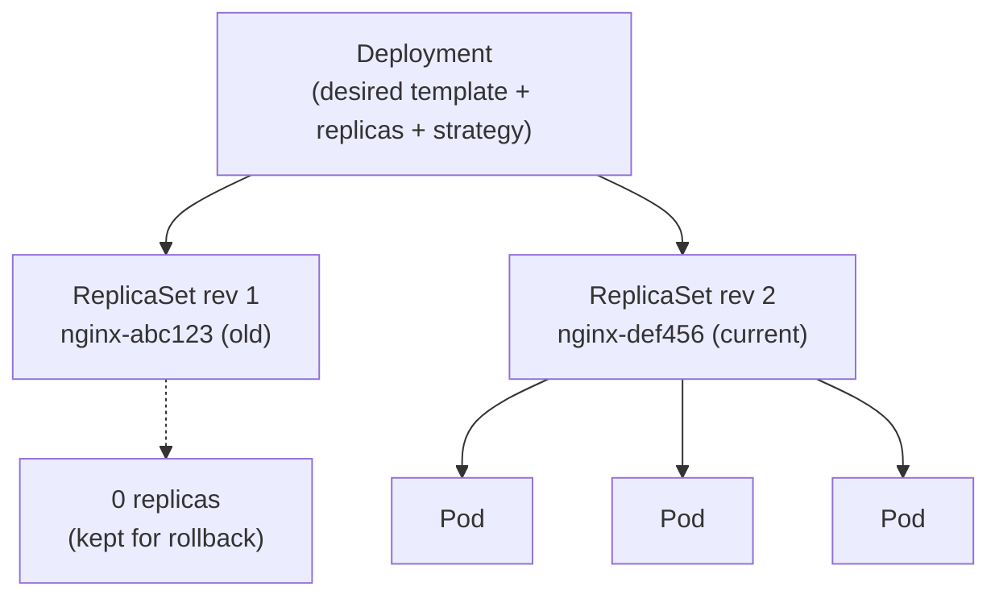
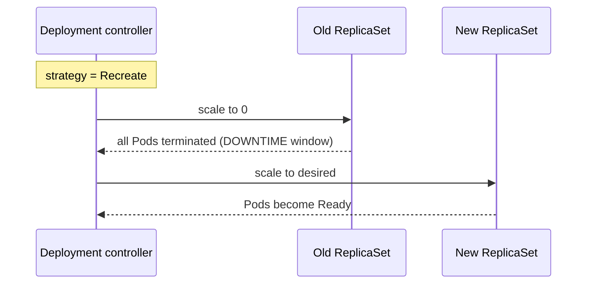
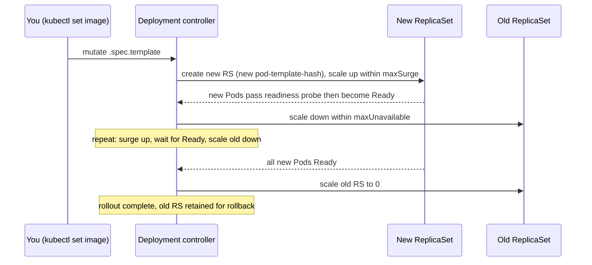

# Deployments, Rolling Updates & Rollbacks

This page covers the workload object most backend engineers touch every day: the
**Deployment**. A Deployment is a declarative controller for **stateless** apps that manages
**ReplicaSets** on your behalf to give you versioned, automated, self-healing updates. We cover
how a Deployment owns ReplicaSets, the two update strategies (`RollingUpdate` vs `Recreate`),
exactly how a rolling update executes (new RS up, old RS down, gated by **readiness probes**),
how to observe and control a rollout (`kubectl rollout status/history/undo`, pause/resume),
how rollback actually works, scaling and proportional scaling, and why canary/blue-green need
extra tooling.

It builds on `pods-workload-controllers` (Pods and the ReplicaSet controller) and
`probes-resources` (readiness/liveness probe mechanics). Containers/images come from the Docker
domain via the CRI — we don't re-teach images here. Progressive-delivery tooling (Argo Rollouts,
Flagger) is introduced as a pointer and lives more fully in `gitops-continuous-delivery`.

> [!KEY-TAKEAWAY]
> Four ideas unlock this topic. **(1) A Deployment doesn't run Pods — it manages ReplicaSets,
> and each ReplicaSet runs Pods.** Every change to the Pod template mints a new ReplicaSet
> (a new *revision*). **(2) A rolling update is a controlled hand-off:** the controller scales
> the new ReplicaSet up and the old one down in lock-step, bounded by `maxSurge` and
> `maxUnavailable`. **(3) The readiness probe is the gate:** a new Pod counts as "available"
> only once it's `Ready`, so a bad readiness probe (or a crashing app) *stalls* the rollout
> instead of taking down the service. **(4) Rollback is just rolling forward to an old
> ReplicaSet** — the previous RS is scaled back up; nothing magical happens.

---

## Deployment, ReplicaSet and the reconciliation model

A **Deployment** is a Kubernetes object (`apps/v1`) that describes the *desired state* of a
stateless application: which Pod template to run, how many replicas, and how to roll out
changes. You almost never create a ReplicaSet directly — you create a Deployment, and the
**Deployment controller** (running in `kube-controller-manager`) creates and manages
ReplicaSets for you.

The ownership chain is three layers deep:



- **Deployment → ReplicaSet:** the Deployment owns one ReplicaSet *per revision*. Only one is
  "active" (scaled up) at steady state; older ones are scaled to 0 but retained for rollback.
- **ReplicaSet → Pods:** the ReplicaSet controller ensures the observed number of matching Pods
  equals its `.spec.replicas`, creating/deleting Pods to converge. This is the **reconciliation
  loop**: observe actual → compare to desired → act → repeat.

The Deployment controller adds a **`pod-template-hash`** label to every ReplicaSet it creates
(and to that RS's selector and Pod labels). The hash is computed from the Pod template, so a
template change produces a new hash → a new ReplicaSet whose name is `[DEPLOYMENT]-[HASH]`
(e.g. `nginx-deployment-75675f5897`). This label is what keeps sibling ReplicaSets from
stealing each other's Pods. **Never edit it by hand.**

> [!INTERVIEW]
> "What's the difference between a Deployment and a ReplicaSet?" A ReplicaSet only guarantees N
> copies of a *fixed* Pod template — it has no notion of updates or history. A Deployment sits
> on top and orchestrates ReplicaSets to give you **versioned, gradual updates, rollout status,
> and one-command rollback**. Because a Deployment gives you everything a ReplicaSet does plus
> updates, you should essentially always use a Deployment for stateless apps, never a bare RS.

---

## Anatomy of a Deployment manifest

```yaml
apiVersion: apps/v1
kind: Deployment
metadata:
  name: web
spec:
  replicas: 4                     # desired Pod count (default 1)
  revisionHistoryLimit: 10        # old ReplicaSets to retain (default 10)
  minReadySeconds: 10             # Pod must stay Ready this long to count "available" (default 0)
  progressDeadlineSeconds: 600    # fail the rollout if no progress in this window (default 600)
  selector:
    matchLabels:
      app: web                    # MUST match template labels; immutable after creation
  strategy:
    type: RollingUpdate           # RollingUpdate (default) | Recreate
    rollingUpdate:
      maxSurge: 25%               # extra Pods above desired during rollout (default 25%)
      maxUnavailable: 25%         # Pods allowed unavailable during rollout (default 25%)
  template:                       # the Pod template — changing THIS triggers a rollout
    metadata:
      labels:
        app: web
    spec:
      containers:
        - name: web
          image: myapp:1.2.0
          ports: [{ containerPort: 8080 }]
          readinessProbe:         # the rollout gate — see below
            httpGet: { path: /healthz, port: 8080 }
            initialDelaySeconds: 5
            periodSeconds: 5
```

Key facts an interviewer probes:

- **`.spec.selector` is immutable** once the Deployment exists (since `apps/v1`). It must match
  `.spec.template.metadata.labels`. A common mistake is a selector that doesn't match the
  template labels — the API server rejects it.
- **Only `.spec.template` changes trigger a rollout.** Editing `image`, `env`, resource
  requests, labels, or annotations *inside the template* mints a new ReplicaSet. Changing
  `replicas`, `strategy`, `minReadySeconds`, etc. does **not** create a new revision — those are
  Deployment-level knobs, not part of the Pod fingerprint.
- Because the hash is over the *whole* template, even a trivial env-var change is a new revision.

> [!TIP]
> `kubectl set image deployment/web web=myapp:1.3.0` and `kubectl edit deployment/web` are the
> two most common ways to trigger a rollout imperatively. For GitOps you'd change the manifest
> and `kubectl apply -f`. All three mutate `.spec.template` and produce a new ReplicaSet.

---

## RollingUpdate strategy: maxSurge and maxUnavailable

`RollingUpdate` is the **default** strategy. It replaces old Pods with new ones **incrementally**
so the service stays available throughout. Two knobs control the pace, both under
`.spec.strategy.rollingUpdate`:

| Field | Default | Meaning |
|---|---|---|
| `maxSurge` | `25%` | How many Pods can exist **above** `.spec.replicas` during the update. Higher = faster rollout, more temporary capacity/cost. |
| `maxUnavailable` | `25%` | How many Pods can be **unavailable** (below desired) during the update. Higher = faster, but less serving capacity. |

Both accept an absolute number or a percentage (percentages round **up** for `maxSurge`, **down**
for `maxUnavailable`). **They cannot both be 0** — that would forbid the controller from making
any progress.

Worked example — `replicas: 4`, `maxSurge: 25%`, `maxUnavailable: 25%`:
- 25% of 4 = 1 (surge rounds up, unavailable rounds down → both 1 here).
- The controller may run **up to 5 Pods** total (4 + 1 surge) and keep **at least 3 available**
  (4 − 1 unavailable) at all times.

Because old and new Pods run **simultaneously** during the roll, clients (and the Pods
themselves) hit a *mix* of both versions for the whole rollout window. That makes
**N/N+1 compatibility a first-class correctness constraint**: the DB schema, API contracts, and
message/queue formats must tolerate both the old and new code at once. The standard technique is
the **expand/contract (parallel-change) migration** — e.g. to rename a column: first *expand*
(add the new column, write to both, keep reading the old) and ship that; roll out the code that
reads the new column; only *contract* (drop the old column) in a later release once no running
Pod references it. A migration that can't be split this way — old and new genuinely cannot
coexist — is exactly the case `Recreate` exists for (accept a downtime window instead of a
correctness bug).

Two useful extremes:

- **`maxUnavailable: 0`** (with `maxSurge > 0`): never drop below full capacity — always add new
  Pods first, then remove old. Zero-capacity-loss rollout; needs headroom for the surge Pods.
- **`maxSurge: 0`** (with `maxUnavailable > 0`): never exceed `replicas` — remove old Pods first,
  then add new. No extra capacity used (good under tight resource quotas), but you serve at
  reduced capacity during the roll.

> [!WARNING]
> `maxUnavailable` interacts with **PodDisruptionBudgets** and cluster capacity. If your surge
> Pods can't be scheduled (no room, hit a `ResourceQuota`), the rollout stalls with new Pods
> `Pending`. And a Deployment rollout is *not* governed by a PDB — the PDB protects against
> *voluntary disruptions* like node drains, not the Deployment controller's own rollout.

---

## Recreate strategy vs RollingUpdate

`strategy.type: Recreate` is the alternative: the controller **terminates all old Pods first**,
waits for them to be gone, then creates the new ones. This causes **downtime** (a window with
zero available Pods) but guarantees that old and new versions **never run simultaneously**.



| | RollingUpdate | Recreate |
|---|---|---|
| Downtime | None (gradual) | Yes (all-down, then all-up) |
| Versions coexisting | Yes (briefly) | No |
| Use when | Stateless HTTP APIs, most services | Schema/format migrations that can't tolerate mixed versions, singletons that can't have two instances, apps needing exclusive access to a resource |

> [!INTERVIEW]
> "When would you pick `Recreate`?" When running two versions at once is unsafe — e.g. a
> non-backward-compatible DB migration, or a process that takes an exclusive lock / writes to a
> `ReadWriteOnce` volume that only one Pod can mount. The trade-off you're accepting is a
> downtime window. For most stateless services, RollingUpdate (the default) is correct.

---

## How a rolling update executes step by step

When you change the Pod template, the Deployment controller runs this loop:



1. A new ReplicaSet is created with `.spec.replicas: 0`, then scaled up by up to `maxSurge`.
2. The controller **waits for the new Pods to become `Ready`** (readiness gate) and to satisfy
   `minReadySeconds` before counting them "available."
3. Only then does it scale the old ReplicaSet **down** — subject to `maxUnavailable`.
4. Steps 1–3 repeat in waves until the new RS is at full `replicas` and the old RS is at 0.
5. The old ReplicaSet is retained (scaled to 0) up to `revisionHistoryLimit` for rollback.

**Worked trace — `replicas: 4`, `maxSurge: 25%`, `maxUnavailable: 25%`.** First resolve the
knobs: `maxSurge = ceil(0.25 × 4) = 1` (rounds **up**), `maxUnavailable = floor(0.25 × 4) = 1`
(rounds **down**). So the two invariants the controller must honor at *every* step are
**total Pods ≤ 5** (4 + surge) and **available Pods ≥ 3** (4 − unavailable). Watch `(old, new)`
march from `(4, 0)` to `(0, 4)`:

| Wave | Action | old | new | total | available |
|---|---|---|---|---|---|
| 0 | steady state on old version | 4 | 0 | 4 | 4 |
| 1a | surge: create 1 new Pod (pending) | 4 | 1 | **5** | 4 |
| 1b | new Pod passes readiness → scale old −1 | 3 | 1 | 4 | 4 |
| 2a | surge: +1 new Pod (pending) | 3 | 2 | **5** | 4 |
| 2b | new Pod Ready → scale old −1 | 2 | 2 | 4 | 4 |
| 3a | surge: +1 new Pod (pending) | 2 | 3 | **5** | 4 |
| 3b | new Pod Ready → scale old −1 | 1 | 3 | 4 | 4 |
| 4a | surge: +1 new Pod (pending) | 1 | 4 | **5** | 4 |
| 4b | last new Pod Ready → scale old −1 | 0 | 4 | 4 | 4 |

Notice total tops out at exactly **5** on every surge step (never 6) and availability never dips
below the **3** floor — in fact it holds at 4 here because the controller surges *before* it
removes an old Pod. A pending (not-yet-Ready) new Pod counts toward the total but **not** toward
availability, which is exactly why a stuck-`Pending` or crashing new Pod parks the trace at, say,
`(3, 1)` forever: it can't surge past total 5, and it won't scale old below 3.

The crucial property: **progress on the new RS is what unlocks scale-down of the old RS.** If new
Pods never become Ready, the old Pods are never removed — the service keeps serving the old
version and the rollout simply stalls. This is a *safety feature*, not a bug.

---

## The readiness-probe gate and minReadySeconds

A rolling update's correctness hinges on the **readiness probe** (see `probes-resources` for
probe mechanics). A Pod that is not `Ready`:

- is **removed from Service Endpoints**, so it receives **no traffic** (kube-proxy / the
  EndpointSlice controller only route to Ready Pods); and
- does **not count as "available"** toward the rollout, so the controller won't scale the old RS
  down past it.

Together this means a broken new version can't take traffic *and* can't displace the healthy old
version — the rollout pauses safely. **If a Deployment has no readiness probe, a Pod is
considered Ready as soon as its containers are Running** (with no readiness signal required; if a
`startupProbe` is defined it must pass first). So Kubernetes will happily route to a process that
is up but hasn't finished warming up, and will march the rollout forward over a broken build.
Always define a readiness probe for anything serving traffic.

`minReadySeconds` (default `0`) adds a stabilization delay: a new Pod must stay Ready for this
many seconds *without any container crashing* before it's treated as available. It guards against
Pods that pass readiness momentarily and then crash — without it, a flapping Pod could let the
rollout proceed prematurely.

> [!WARNING]
> A classic incident: the app's readiness probe returns 200 before the app can actually serve
> (e.g. connection pool not warmed, cache not loaded). The rollout "succeeds," old Pods are
> torn down, and then the new Pods fall over under real traffic. The fix is a readiness probe
> that reflects *true* readiness, plus a sensible `minReadySeconds`.

---

## Graceful shutdown: why "Ready" alone isn't zero-downtime

The readiness gate protects the **new** Pods coming up. But a rolling update also **tears old
Pods down**, and that side has its own race — the reason a rollout can drop requests even though
every Pod was `Ready`. When the controller deletes an old Pod, **two things happen in parallel,
not in sequence**:

1. The Pod's endpoint is removed from every EndpointSlice, and that removal must **propagate** to
   kube-proxy on every node (and to external load balancers / ingress) before they stop sending it
   traffic. This is eventually consistent and takes some time.
2. The kubelet sends the container **`SIGTERM`** and starts the `terminationGracePeriodSeconds`
   clock (default **30s**); if the process hasn't exited when it elapses, it gets `SIGKILL`.

Trace the race with numbers. Say endpoint propagation to all proxies takes ~2s, but your app
exits *immediately* on `SIGTERM` (say 200ms):

- `t=0.0s` — Pod marked Terminating; endpoint removal begins **and** `SIGTERM` delivered.
- `t=0.2s` — app process exits, connections refused.
- `t=0.2s–2.0s` — a proxy that hasn't yet seen the removal **still routes new connections to the
  dead Pod → connection refused / 502.** Requests are dropped for ~1.8s per Pod, ×4 Pods across
  the roll.

The fix is to make the container **outlive** the propagation window instead of dying instantly.
A `preStop` hook that sleeps buys time for endpoints to converge before the app stops accepting
connections:

```yaml
lifecycle:
  preStop:
    exec:
      command: ["/bin/sh", "-c", "sleep 5"]   # let LBs/kube-proxy deregister first
# and give real in-flight requests time to finish:
terminationGracePeriodSeconds: 30
```

`SIGTERM` is only sent **after** `preStop` completes, so the sequence becomes: endpoint removal
starts → app keeps serving for 5s (proxies converge, no new traffic arrives) → `SIGTERM` → app
drains in-flight requests and exits, well inside the 30s grace period. Net result: **zero dropped
requests**. Readiness gating handles ramp-up; `preStop` + grace period handle ramp-down — you need
**both** for a truthful "zero-downtime" claim.

---

## progressDeadlineSeconds and detecting a stuck rollout

`progressDeadlineSeconds` (default **600**, i.e. 10 minutes) bounds how long a rollout may go
**without making progress** before it's declared failed. "Progress" means the Deployment created
new Pods, scaled the new RS up, or new Pods became available. If nothing progresses within the
window, the controller sets a status condition:

```
type: Progressing
status: "False"
reason: ProgressDeadlineExceeded
```

One interaction to size correctly: `minReadySeconds` **counts against** the progress window. Each
wave the controller waits `minReadySeconds` before a Pod counts available, so a healthy-but-slow
rollout of many waves can consume real time. Keep `progressDeadlineSeconds` comfortably larger
than the total expected `(startup + minReadySeconds) × waves`, or a perfectly healthy rollout can
trip `ProgressDeadlineExceeded` just because it's slow. (E.g. `minReadySeconds: 60` across ~4
waves already eats ~4 minutes of the default 10-minute deadline before any real delay.)

Critically, **exceeding the progress deadline does NOT auto-rollback** by default — it only marks
the rollout as failed and stops retrying. `kubectl rollout status` will then exit non-zero,
which is what CI/CD pipelines watch for:

```bash
kubectl rollout status deployment/web --timeout=120s
# exits 0 on success, non-zero on failure/timeout → pipeline can trigger `rollout undo`
```

Checking conditions:

```bash
kubectl describe deployment web        # look at Conditions and Events
kubectl get deployment web -o jsonpath='{.status.conditions}'
```

> [!TIP]
> To get *automatic* rollback on a failed rollout you need progressive-delivery tooling like
> **Argo Rollouts** or **Flagger** — the built-in Deployment does not roll back on its own.
> Teams commonly wire `kubectl rollout status` into the pipeline and call
> `kubectl rollout undo` when it fails.

---

## Rollout status, history and the change-cause annotation

```bash
# Watch a rollout to completion (blocks until done or failed)
kubectl rollout status deployment/web

# List revisions
kubectl rollout history deployment/web
# REVISION  CHANGE-CAUSE
# 1         kubectl apply --filename=web.yaml
# 2         image updated to myapp:1.3.0

# Inspect a specific revision's Pod template
kubectl rollout history deployment/web --revision=2
```

The **CHANGE-CAUSE** column comes from the `kubernetes.io/change-cause` annotation on the
Deployment. It is **not populated automatically for you** in modern kubectl (the old
`--record` flag is deprecated). Set it explicitly so history is meaningful:

```bash
kubectl annotate deployment/web \
  kubernetes.io/change-cause="image updated to myapp:1.3.0" --overwrite
```

Each revision corresponds to a retained ReplicaSet. `revisionHistoryLimit` (default **10**)
caps how many old ReplicaSets are kept; setting it to `0` keeps none and **disables rollback**.

> [!INTERVIEW]
> "Why is `kubectl rollout history` showing `<none>` for CHANGE-CAUSE?" Because nothing set the
> `kubernetes.io/change-cause` annotation — history still tracks revisions by their Pod template,
> but the human-readable reason is blank. Best practice is to set the annotation (or let your
> GitOps tooling record the commit) on every change.

---

## Rolling back (undo) and how rollback really works

Rollback re-applies an **older revision's Pod template** by scaling the corresponding old
ReplicaSet back up (via the same rolling-update process) and scaling the current one down. It
does **not** delete data or reverse anything outside the Pod template.

```bash
# Roll back to the immediately previous revision
kubectl rollout undo deployment/web

# Roll back to a specific revision
kubectl rollout undo deployment/web --to-revision=2
```

Mechanics to know:

- A rollback creates a **new revision number** whose template equals the target revision's — it
  rolls *forward* to an old spec, so the revision counter keeps increasing.
- Rollback is only possible while the target ReplicaSet still exists (within
  `revisionHistoryLimit`). If it's been pruned, you can't `undo` to it.
- Rollback obeys the **same strategy** (`RollingUpdate`/`Recreate`, surge/unavailable) as a
  normal update — it's not instantaneous.
- **Rollback only reverts the Deployment spec.** It does not undo a database migration, a
  consumed message, or a mutated external resource. This is why forward/backward compatibility of
  schema changes matters.

> [!WARNING]
> A subtle gotcha: if you fix a bad rollout by simply re-applying the *old good image*, that is a
> normal roll-forward and produces yet another revision — fine, but be aware `undo` and
> "re-apply old manifest" both work and both create new revisions. Don't hand-delete the old
> ReplicaSet to "clean up," or you lose your rollback target.

---

## Pausing and resuming a rollout (and canary-by-hand)

You can **pause** a Deployment to batch multiple changes into a single rollout, or to inspect a
partially-rolled state:

```bash
kubectl rollout pause deployment/web
kubectl set image deployment/web web=myapp:1.4.0
kubectl set resources deployment/web -c web --limits=cpu=500m,memory=512Mi
kubectl rollout resume deployment/web     # now ONE rollout applies both changes
```

While paused, **changes to the Pod template do not trigger a rollout** — they accumulate. On
`resume`, the controller reconciles once toward the new desired state.

This enables a crude **manual canary**: pause, bump the image, manually scale the new RS to a
small number, observe, then resume to complete — but this is fiddly and error-prone. For real
canary/blue-green you want dedicated tooling (below).

> [!TIP]
> A paused Deployment still self-heals its *current* replicas (crashed Pods are replaced) — pause
> only freezes *rollout progress*, not the ReplicaSet controller keeping replicas at desired.

---

## Scaling and proportional scaling

Scaling changes `.spec.replicas` and, importantly, **does not create a new revision** (it's not
a template change):

```bash
kubectl scale deployment/web --replicas=10
kubectl autoscale deployment/web --min=3 --max=20 --cpu-percent=70   # creates an HPA
```

**Proportional scaling** is the clever bit: if you scale a Deployment *while a rolling update is
in flight* (so both old and new ReplicaSets have replicas), the controller distributes the new
replicas across the existing ReplicaSets **in proportion to their current sizes**, respecting
`maxSurge`. This avoids dumping all new capacity onto a version that may still be rolling out.

Worked example — `replicas: 10`, `maxSurge: 3`, `maxUnavailable: 2`. You bump the image but the
new build can't pull, so the rollout **stalls mid-flight** at the surge ceiling:

- old RS = **8**, new RS = **5** → total **13** (that's `replicas 10 + maxSurge 3`, the cap).

Now the HPA scales the Deployment to **15**. Where do the extra replicas go? The controller does
*not* pour them all into the new RS. It first computes the new ceiling and how many to add:

- new max total = `15 + maxSurge 3` = **18**; current total = **13** → **5 replicas to add**.

Then it apportions those 5 across the RSs by each one's share of the current total, using the
controller's rule `add = round(rsReplicas × replicasToAdd / currentTotal)` with
`replicasToAdd = 5`, `currentTotal = 13`:

- old RS: `round(8 × 5 / 13) = round(40/13) = round(3.08) = 3` → **8 + 3 = 11**
- new RS: `round(5 × 5 / 13) = round(25/13) = round(1.92) = 2` → **5 + 2 = 7**

Check: `3 + 2 = 5` (exactly the replicas we needed to add), new total `11 + 7 = 18`. So the
old (bigger) RS gets the larger share (3) and the new RS gets 2 — capacity is spread across both
versions rather than piled onto a build that may never become Ready. When the new image is
eventually fixed, the normal rolling-update loop drains the old 11 down to 0 and the new RS up to
the full 15.

> [!WARNING]
> If an **HPA** targets a Deployment, do **not** also set `.spec.replicas` in your manifest and
> `kubectl apply` it — you'll fight the HPA (apply resets replicas, HPA re-scales, flapping). Omit
> `replicas` from the manifest when an HPA owns it. See `autoscaling-hpa-vpa`.

---

## Canary and blue-green need extra tooling

A vanilla Deployment gives you exactly one built-in rollout strategy family (rolling or recreate).
It **cannot** natively do:

- **Canary** — route a small % of *traffic* (not just Pod count) to the new version, analyze
  metrics, then progress or abort.
- **Blue-green** — stand up the full new version alongside the old, then flip a Service selector
  to cut over atomically.
- **Automated analysis-driven rollback** on error-rate/latency SLOs.

These require add-ons:

| Need | Tool |
|---|---|
| Canary/blue-green with traffic shifting + metric analysis | **Argo Rollouts** (a `Rollout` CRD that replaces the Deployment), **Flagger** |
| Traffic splitting mechanism | Service mesh (Istio/Linkerd) or an ingress/Gateway that supports weighted routing |

Argo Rollouts replaces `kind: Deployment` with `kind: Rollout` (same Pod template shape) and adds
`strategy.canary`/`strategy.blueGreen` with steps, pauses, and `AnalysisTemplate` gates. This is
covered in `gitops-continuous-delivery` (K8s progressive delivery); the general deployment-strategy
theory lives in the `devops-cicd` domain. Managed platforms (EKS/GKE/AKS) run stock Deployments
the same way — nothing here is cloud-specific.

---

## Common failure modes and gotchas

- **Rollout stuck at "waiting for rollout to finish":** new Pods aren't becoming Ready. Causes:
  failing readiness probe, `CrashLoopBackOff`, `ImagePullBackOff`, unschedulable surge Pods
  (`Pending` — no capacity / quota / node selector). Diagnose with `kubectl describe deployment`,
  `kubectl get rs`, `kubectl describe pod`, `kubectl get events`. (See `troubleshooting-observability`.)
- **Selector/template label mismatch:** API server rejects the Deployment; `.spec.selector` must
  match template labels and is immutable.
- **No readiness probe:** rollout races ahead over unhealthy Pods.
- **`revisionHistoryLimit: 0`:** you silently lose the ability to `rollout undo`.
- **Both `maxSurge` and `maxUnavailable` set to 0:** invalid — the controller can't make progress.
- **Editing the `pod-template-hash` label or a child ReplicaSet directly:** breaks ownership and
  can orphan Pods.
- **Expecting `progressDeadlineSeconds` to auto-rollback:** it only marks failure; wire your
  pipeline or use Argo Rollouts for automatic rollback.

## Common follow-up questions

- What actually happens when I run `kubectl set image`? It patches `.spec.template`, the hash
  changes, a new ReplicaSet is minted, and the rolling update begins.
- Does scaling create a new revision? No — only Pod-template changes do.
- How do I make a zero-capacity-loss rollout? `maxUnavailable: 0` with `maxSurge > 0` (needs
  headroom for surge Pods).
- How do I do a no-extra-capacity rollout under a tight quota? `maxSurge: 0` with
  `maxUnavailable > 0` (serves at reduced capacity during the roll).
- Why didn't my rollout roll back automatically after failing? Deployments don't; only tooling
  like Argo Rollouts/Flagger does. Watch `kubectl rollout status` in CI and call `undo`.
- Can I roll back to any revision? Only those still retained within `revisionHistoryLimit`.
- How is a Deployment different from a StatefulSet/DaemonSet? Deployments are for
  interchangeable stateless replicas; StatefulSets give stable identity/ordering, DaemonSets run
  one Pod per node. (See `pods-workload-controllers`.)

## References

- Kubernetes docs — Deployments: https://kubernetes.io/docs/concepts/workloads/controllers/deployment/
- Kubernetes docs — ReplicaSet: https://kubernetes.io/docs/concepts/workloads/controllers/replicaset/
- Kubernetes API reference — Deployment v1 (apps): https://kubernetes.io/docs/reference/kubernetes-api/workload-resources/deployment-v1/
- kubectl reference — `kubectl rollout`: https://kubernetes.io/docs/reference/generated/kubectl/kubectl-commands#rollout
- Kubernetes docs — Managing Resources / rolling updates tutorial: https://kubernetes.io/docs/tutorials/kubernetes-basics/update/update-intro/
- Argo Rollouts (progressive delivery): https://argo-rollouts.readthedocs.io/
- Flagger: https://docs.flagger.app/
