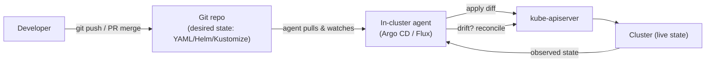
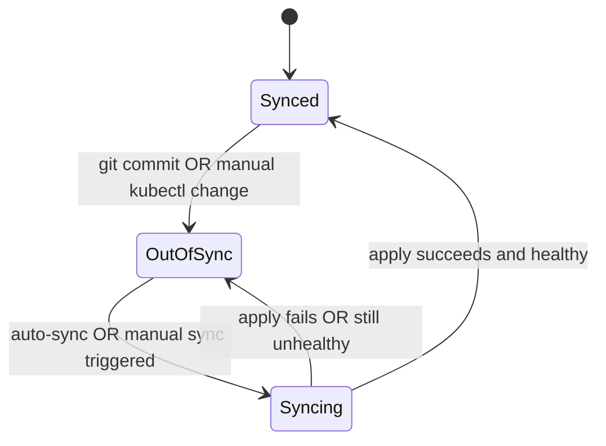
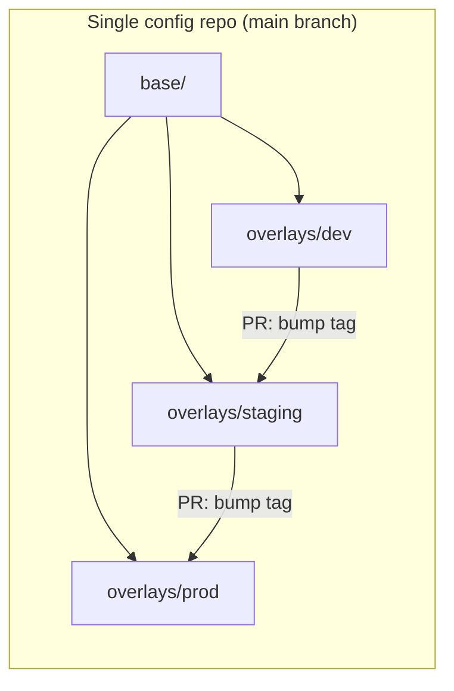

# GitOps & Continuous Delivery (Kubernetes)

This page covers how **GitOps** is applied to Kubernetes: Git holds the *desired state* of the
cluster, and an **in-cluster agent** (Argo CD or Flux) continuously reconciles the live cluster
to match Git. We cover the pull-vs-push model, the Argo CD `Application` CRD, sync policies /
self-heal / prune, app-of-apps and `ApplicationSet`, sync waves and hooks, health assessment,
Flux and its GitOps Toolkit controllers plus image automation, environment promotion patterns,
progressive delivery with **Argo Rollouts** and **Flagger**, rollback by `git revert`, and how
secrets are handled in a public-Git world (Sealed Secrets, SOPS, External Secrets Operator).

This is GitOps *as applied to Kubernetes*. For the **general GitOps principle**, deployment
strategies (blue-green/canary as concepts), and push-based CI/CD pipelines, see
`devops-cicd/gitops` and `devops-cicd/deployment-strategies`. This topic builds on the K8s
declarative model (`api-objects-kubectl`), controllers/reconciliation
(`architecture-control-plane`), Deployments/rollouts (`deployments-rolling-updates`), and Helm
(`helm-package-management`). Containers/images come from the Docker domain via the CRI.

> [!KEY-TAKEAWAY]
> Four ideas unlock this topic. **(1) Git is the single source of truth** for desired state;
> nobody runs `kubectl apply` by hand to prod. **(2) A pull-based agent inside the cluster**
> (Argo CD / Flux) watches Git and the cluster, computes the diff, and reconciles — credentials
> never leave the cluster and the CI system gets no cluster access. **(3) Drift is detected and
> (optionally) self-healed** — a manual `kubectl edit` gets reverted to match Git. **(4) Rollback
> is `git revert`** — you change the desired state back and the agent converges; there is no
> separate "rollback API."

---

## GitOps applied to Kubernetes

**GitOps** is an operating model where the entire desired state of your system is stored
declaratively in **Git**, and an automated process continuously makes the running system match
what's in Git. The four principles (per the OpenGitOps project): the system is **declarative**,
versioned and immutable (Git history), pulled automatically, and continuously **reconciled**.

Kubernetes is an almost perfect fit because it is *already* declarative and reconciliation-based:
you describe desired state in YAML manifests (`Deployment`, `Service`, `ConfigMap`, …) and
built-in controllers converge the cluster to that state. GitOps simply extends that loop **out to
Git**: instead of the desired state living only in etcd, it lives in a Git repo, and an agent
keeps etcd (and thus the cluster) in sync with the repo.



What you put in Git is *config*, not code: rendered manifests, Helm charts + values, or Kustomize
overlays. A typical repo layout separates the **app source repo** (application code + Dockerfile,
built by CI into an image) from the **config/GitOps repo** (the manifests that reference image
tags). CI builds and pushes the image and bumps the tag in the config repo; the GitOps agent
takes it from there.

> [!INTERVIEW]
> If asked "what makes Kubernetes special for GitOps?", the crisp answer is: **K8s controllers
> are themselves a reconciliation loop**, so GitOps is just closing that loop around Git. The
> agent doesn't have to *keep* the app running — the cluster's own controllers do that — it only
> has to keep the *manifests* in the cluster matching Git.

## Pull-based GitOps vs push-based CD

The pivotal distinction in interviews. In **push-based CD**, the CI/CD pipeline (Jenkins, GitHub
Actions, GitLab CI) runs `kubectl apply` / `helm upgrade` against the cluster from *outside*. In
**pull-based GitOps**, an agent *inside* the cluster pulls the desired state from Git and applies
it *itself*.

| Aspect | Push-based CD | Pull-based GitOps |
|---|---|---|
| Who applies changes | External CI runner | In-cluster agent (Argo CD/Flux) |
| Cluster credentials | Stored in CI (kubeconfig/token leaves cluster) | Stay **inside** the cluster |
| Drift detection | None (fire-and-forget) | Continuous; can self-heal |
| Source of truth | The last pipeline run | Git repo (auditable, revertable) |
| Scaling to many clusters | CI needs creds to each cluster | Each cluster pulls itself |
| Firewall/network | CI must reach the API server | Agent only needs **egress** to Git |

> [!TIP]
> The security win is the headline: with pull-based GitOps, **no external system holds
> cluster-admin credentials**. A compromised CI runner can't `kubectl delete` your prod cluster,
> because it never had access — it only writes to Git, which is gated by PR review and branch
> protection. This is especially valuable for private clusters with no inbound API access.

Push-based isn't "wrong" — it's simpler for a single cluster and gives the pipeline direct,
synchronous feedback. GitOps trades that immediacy for auditability, drift correction, and
credential isolation. Many teams use a hybrid: CI builds/tests/pushes the image and commits a tag
bump; the GitOps agent deploys.

## Reconciliation, diffing and drift detection

The agent runs a control loop just like a Kubernetes controller: **observe** (fetch desired state
from Git + live state from the API server), **diff** (compute the difference), **act** (apply the
diff), repeat on an interval (and/or via webhooks/watches).

- **Sync status** answers "does live match Git?" → `Synced` or `OutOfSync`.
- **Drift** is when live state diverges from Git *without* a Git change — e.g. someone runs
  `kubectl scale` or `kubectl edit` directly, or a mutating webhook changes something. The agent
  detects it as `OutOfSync`.
- **Self-heal** (if enabled) reverts drift automatically by re-applying Git state. Without it, the
  agent only reports drift and waits for a manual sync.



Diffing is subtler than a text compare. Kubernetes mutates objects after you submit them
(defaulting, admission webhooks, controllers writing `status`), so a naive diff would show
constant drift. Argo CD compares against the desired manifest using a structured, three-way-ish
diff and supports **`ignoreDifferences`** (e.g. ignore `spec.replicas` if an HPA owns it) and
resource exclusions. Server-side apply and field managers matter here: if two actors "own"
different fields, you can get fights unless you tell the agent to ignore the other owner's fields.

> [!WARNING]
> A classic gotcha: you enable HPA *and* keep `replicas: 3` hardcoded in Git with self-heal on.
> The HPA scales to 10, the agent sees drift and scales back to 3, the HPA scales up again —
> flapping. Fix: remove `replicas` from the manifest (or add `ignoreDifferences` for
> `/spec/replicas`) so the HPA owns that field.

## Argo CD: the Application CRD

**Argo CD** is a declarative GitOps continuous-delivery controller for Kubernetes, built around a
CRD called **`Application`**. An `Application` declares three things: a **source** (Git repo + path
+ revision, or a Helm chart), a **destination** (target cluster + namespace), and a **sync policy**.

```yaml
apiVersion: argoproj.io/v1alpha1
kind: Application
metadata:
  name: web-frontend
  namespace: argocd            # Argo CD's own namespace
spec:
  project: default
  source:
    repoURL: https://github.com/acme/gitops-config.git
    targetRevision: main       # branch, tag, or commit
    path: apps/web-frontend/overlays/prod
  destination:
    server: https://kubernetes.default.svc   # in-cluster; or a remote cluster URL
    namespace: web
  syncPolicy:
    automated:
      prune: true              # delete resources removed from Git
      selfHeal: true           # revert manual drift
    syncOptions:
      - CreateNamespace=true
```

Argo CD renders the source (plain YAML, Helm `template`, Kustomize `build`, or a config-management
plugin) into manifests, diffs against live, and shows per-resource sync + health in a UI, CLI
(`argocd app ...`), and API. **`AppProject`** groups Applications and enforces guardrails: which
repos, destinations (clusters/namespaces), and resource kinds are allowed — the multi-tenancy
boundary.

Argo CD runs several components: **application-controller** (the reconciler), **repo-server**
(clones/renders manifests), **API/server** (UI/API/RBAC), **applicationset-controller**, and
optional **notifications** and **image-updater**. It is *cluster-agnostic about source*: you can
point one Argo CD at many clusters.

## Argo CD sync policies, prune and self-heal

Sync can be **manual** or **automated**:

- **Manual** (`syncPolicy` has no `automated`): the app goes `OutOfSync` on a Git change and waits
  for a human to click *Sync* / run `argocd app sync`. Good for prod change control.
- **Automated**: the controller syncs whenever it detects `OutOfSync` from a Git change.

Two independent switches modify automated sync:

| Option | What it does | Risk if off / on |
|---|---|---|
| `prune: true` | Deletes live resources that were **removed from Git** | Off → deleted-from-Git objects linger as orphans |
| `selfHeal: true` | Re-applies Git state when **live drifts** (manual edits) | Off → drift only reported, not fixed |

By default `prune` is **false** (Argo won't delete things automatically — safety). Self-heal is
also off by default. **Finalizers**: adding the `resources-finalizer.argocd.io` finalizer to an
`Application` makes deleting the Application **cascade-delete** its managed resources; without it,
deleting the Application leaves the workloads running.

> [!WARNING]
> `prune` is powerful and dangerous. If someone accidentally deletes an app's directory in Git and
> auto-sync + prune are on, Argo CD will delete the live workloads. Guardrails: PR review, the
> `Prune=false` per-resource annotation for critical objects, `PruneLast=true`, and prune
> confirmation. `argocd app sync --dry-run` shows what would change.

## App-of-apps and ApplicationSet

At scale you don't hand-create hundreds of `Application` objects. Two patterns:

**App-of-apps**: one "root" `Application` whose Git path contains *other* `Application` manifests.
Syncing the root creates/updates all the child Applications, which then sync their own workloads.
It's just Argo CD managing Argo CD `Application` CRs as if they were any other resource — a simple
way to bootstrap a whole cluster from one root app.

**ApplicationSet**: a CRD + controller that **templates** many Applications from a **generator**.
Generators include `list`, `cluster` (one app per registered cluster), `git` (one app per
directory or per matching file in a repo), `matrix`/`merge` (combine generators), and pull-request
generators (ephemeral preview envs per PR).

```yaml
apiVersion: argoproj.io/v1alpha1
kind: ApplicationSet
metadata:
  name: web-per-cluster
  namespace: argocd
spec:
  generators:
    - clusters: {}             # every cluster registered with Argo CD
  template:
    metadata:
      name: 'web-{{name}}'     # {{name}} comes from the generator
    spec:
      project: default
      source:
        repoURL: https://github.com/acme/gitops-config.git
        targetRevision: main
        path: apps/web/overlays/{{metadata.labels.env}}
      destination:
        server: '{{server}}'
        namespace: web
      syncPolicy:
        automated: { prune: true, selfHeal: true }
```

Use **app-of-apps** for a fixed, hand-curated set; use **ApplicationSet** when you want one
templated definition fanned out across clusters, environments, or PRs.

## Sync waves, phases and hooks

Argo CD orders a sync into **phases** — `PreSync`, `Sync`, `PostSync` (plus `SyncFail`) — and
within a phase into ordered **waves**.

- **Sync waves**: the annotation `argocd.argoproj.io/sync-wave: "N"` (default `0`, may be negative)
  orders resources. Argo applies lower waves first and **waits for each wave's resources to become
  healthy** before starting the next. Example: wave `-1` for a namespace/CRDs, wave `0` for the
  DB, wave `1` for the app that depends on the DB.
- **Resource hooks**: the annotation `argocd.argoproj.io/hook: PreSync|Sync|PostSync|SyncFail`
  runs a resource (usually a `Job`) at that phase. `PreSync` is the canonical place for a **DB
  schema migration** that must complete before the new app rolls out; `PostSync` for smoke tests.
- **Hook deletion**: `argocd.argoproj.io/hook-delete-policy: HookSucceeded|HookFailed|BeforeHookCreation`
  controls when the hook resource (e.g. the migration Job) is cleaned up.

```yaml
apiVersion: batch/v1
kind: Job
metadata:
  name: db-migrate
  annotations:
    argocd.argoproj.io/hook: PreSync
    argocd.argoproj.io/hook-delete-policy: HookSucceeded
spec:
  template:
    spec:
      restartPolicy: Never
      containers:
        - name: migrate
          image: acme/web:1.8.0
          command: ["/app/migrate", "up"]
```

> [!TIP]
> Waves order resources you're *already* applying, one Argo CD `Application`. Hooks inject
> extra lifecycle steps (Jobs) around the sync. Reach for **PreSync hook** when a migration must
> land before pods start, and **sync waves** when object A must be Ready before object B applies.

## Health assessment in Argo CD

Sync status ("does live match Git?") is distinct from **health** ("is the resource actually
working?"). Argo CD assigns each resource a health status: `Healthy`, `Progressing`, `Degraded`,
`Suspended`, `Missing`, or `Unknown`, and rolls them up to the Application.

It has built-in health checks for common kinds: a `Deployment` is `Healthy` when observed
generation matches and updated/available replicas meet spec; a `Service` of type LoadBalancer is
`Progressing` until it gets an external IP; a `Job` is `Degraded` on failure; a PVC is
`Progressing` until `Bound`. For CRDs and anything custom, you write a **Lua health check** so Argo
knows when your `Rollout`, `Certificate`, or operator CR is truly ready.

This matters for **sync waves** (Argo waits for a wave to be *healthy*, not just applied) and for
`selfHeal`. It's also why `argocd app wait --health` in CI is a real gate: it blocks until the app
is `Healthy`, not merely `Synced`.

## Flux: the GitOps Toolkit

**Flux** (Flux CD v2, a CNCF graduated project) is the other major GitOps agent. Instead of one
big `Application` CRD, it's a set of composable controllers — the **GitOps Toolkit** — each with
its own CRDs:

| Controller | CRDs | Responsibility |
|---|---|---|
| source-controller | `GitRepository`, `HelmRepository`, `OCIRepository`, `Bucket` | Fetch & verify artifacts from sources |
| kustomize-controller | `Kustomization` | Build & apply Kustomize/plain YAML, prune, health-check |
| helm-controller | `HelmRelease` | Reconcile Helm releases |
| notification-controller | `Alert`, `Provider`, `Receiver` | Inbound webhooks + outbound alerts |
| image-reflector / image-automation | `ImageRepository`, `ImagePolicy`, `ImageUpdateAutomation` | Scan registries, write new tags back to Git |

A minimal Flux setup: a `GitRepository` source plus a `Kustomization` that points at a path and
applies it, with pruning and an interval.

```yaml
apiVersion: source.toolkit.fluxcd.io/v1
kind: GitRepository
metadata:
  name: gitops-config
  namespace: flux-system
spec:
  interval: 1m
  url: https://github.com/acme/gitops-config.git
  ref:
    branch: main
---
apiVersion: kustomize.toolkit.fluxcd.io/v1
kind: Kustomization
metadata:
  name: web-prod
  namespace: flux-system
spec:
  interval: 10m
  sourceRef:
    kind: GitRepository
    name: gitops-config
  path: ./apps/web/overlays/prod
  prune: true                 # delete resources removed from Git
  wait: true                  # wait for health before reporting ready
  targetNamespace: web
```

Flux is CLI/CRD-first (no bundled UI — you use `flux` CLI, `kubectl`, or third-party dashboards),
composes naturally with `kubectl`/GitOps tooling, and its `dependsOn` field orders Kustomizations.
Philosophically it's "a toolkit you assemble," where Argo CD is "an application-centric platform
with a UI."

## Flux image automation

A distinctive Flux feature: **automated image updates written back to Git**. The
image-reflector-controller scans a registry for tags; an `ImagePolicy` picks the newest tag by a
policy (semver range, numerical, or regex/timestamp for a commit-sha-based scheme); and
`ImageUpdateAutomation` **commits the new tag into the Git repo**, which then flows through the
normal Kustomization reconciliation.

```yaml
apiVersion: image.toolkit.fluxcd.io/v1beta2
kind: ImagePolicy
metadata: { name: web, namespace: flux-system }
spec:
  imageRepositoryRef: { name: web }
  policy:
    semver:
      range: ">=1.0.0 <2.0.0"
```

You mark the field in your manifest with a `# {"$imagepolicy": "flux-system:web"}` comment so the
automation knows what to rewrite. This keeps Git as the source of truth even for image bumps
(unlike push CD, where the pipeline applies the new tag directly). Argo CD's equivalent is the
separate **Argo CD Image Updater** add-on, which can either write back to Git or annotate the
Application — but image automation is more *native* to Flux.

## Argo CD vs Flux

Both are CNCF **graduated** projects and both implement pull-based GitOps well. Choose on
ergonomics and team model, not capability gaps.

| Dimension | Argo CD | Flux |
|---|---|---|
| Core abstraction | Single `Application` CRD | Toolkit of controllers + CRDs |
| UI | Rich built-in web UI + SSO/RBAC | No official UI (CLI/`flux`; 3rd-party dashboards) |
| Multi-cluster | One Argo CD → many clusters (hub) | Typically Flux per cluster (agent model) |
| Templating fan-out | `ApplicationSet` generators | Kustomize + `GitRepository`, per-cluster installs |
| Image automation | Add-on (Image Updater) | First-class (image-reflector/automation) |
| Config formats | YAML, Helm, Kustomize, plugins | Kustomize, Helm (`HelmRelease`), plain YAML |
| Ordering | Sync waves + hooks + phases | `dependsOn`, health `wait`, `Kustomization` ordering |
| Mental model | App-centric platform | Composable GitOps toolkit |

Rule of thumb: pick **Argo CD** when you want a UI, central multi-cluster management, and
app-of-apps/ApplicationSet fan-out (common for platform teams offering a portal). Pick **Flux**
when you prefer CLI/CRD-native, per-cluster agents, tight Kustomize/Helm integration, and built-in
image automation. Argo Rollouts (progressive delivery) works with either.

## Environment promotion patterns

"Promotion" = moving a known-good config from dev → staging → prod. In GitOps the mechanism is a
**Git change**, but there are three common repo structures:

- **Directory (folder) per environment** *(most recommended)*: `overlays/dev`, `overlays/staging`,
  `overlays/prod` in one branch, usually with **Kustomize** base + overlays or **Helm** per-env
  values. Promotion = a PR that copies/bumps the image tag or values from one overlay to the next.
  Diffs are visible and reviewable in one place.
- **Branch per environment**: `dev`, `staging`, `prod` branches; promotion = merge/PR between
  branches. Simple mentally, but risks config *drift between branches* and messy merges — the
  community has largely moved away from this for envs (branches are better for app code).
- **Repo per environment**: strong isolation/RBAC boundaries, at the cost of duplication.



Kustomize overlays keep the shared config DRY and make each env a small patch (replica count,
resource limits, image tag, hostnames). Tools like Argo CD ApplicationSet's `git` generator can
auto-create one Application per overlay directory.

> [!TIP]
> The interview-favored answer is **directory-per-environment with Kustomize overlays (or Helm
> values), promotion via PR**. It keeps all environments visible in one diff, avoids
> branch-drift, and makes the promotion an auditable, reviewable commit.

## Progressive delivery with Argo Rollouts

A plain Kubernetes `Deployment` only does `RollingUpdate`/`Recreate` — no metric-gated canary, no
automated rollback (see `deployments-rolling-updates`). **Progressive delivery** adds gradual
traffic shifting driven by *analysis of live metrics*, with automatic rollback on regression.

**Argo Rollouts** provides a `Rollout` CRD — a drop-in replacement for a `Deployment` — that
supports **canary** and **blue-green** strategies with fine-grained steps, traffic management
(via Ingress/Istio/SMI/Gateway API), and **`AnalysisTemplate`**/`AnalysisRun` that query
Prometheus/Datadog/etc. and **automatically abort + roll back** if metrics breach thresholds.

```yaml
apiVersion: argoproj.io/v1alpha1
kind: Rollout
metadata: { name: web }
spec:
  replicas: 5
  strategy:
    canary:
      steps:
        - setWeight: 20        # send 20% traffic to canary
        - pause: { duration: 5m }
        - analysis:            # query metrics, abort if bad
            templates: [{ templateName: success-rate }]
        - setWeight: 50
        - pause: {}            # pause indefinitely for manual promote
  selector: { matchLabels: { app: web } }
  template:                    # same podspec as a Deployment
    metadata: { labels: { app: web } }
    spec:
      containers: [{ name: web, image: acme/web:1.9.0 }]
```

An `AnalysisRun` that fails **aborts** the rollout: traffic snaps back to the stable version and
the canary Pods are scaled down. Because a `Rollout` isn't a standard `Deployment`, Argo CD needs
a **Lua health check** to know when it's healthy (bundled by default). Blue-green mode keeps a
full "preview" (`green`) stack, flips the Service selector on promotion, and can auto-scale down
the old (`blue`) stack after a delay.

## Progressive delivery with Flagger

**Flagger** is the other progressive-delivery operator (part of the Flux ecosystem but usable
standalone). Rather than replacing your Deployment, it **wraps an existing `Deployment`** with a
**`Canary`** CR. Flagger creates primary/canary copies, manages the service mesh or ingress to
shift traffic in increments, runs metric analysis + optional webhooks (load tests, acceptance
tests), and **promotes or rolls back automatically**.

```yaml
apiVersion: flagger.app/v1beta1
kind: Canary
metadata: { name: web }
spec:
  targetRef: { apiVersion: apps/v1, kind: Deployment, name: web }
  analysis:
    interval: 1m
    threshold: 5              # rollback after 5 failed checks
    stepWeight: 10            # +10% traffic each interval
    maxWeight: 50
    metrics:
      - name: request-success-rate
        thresholdRange: { min: 99 }
        interval: 1m
```

| | Argo Rollouts | Flagger |
|---|---|---|
| Model | Replaces `Deployment` with `Rollout` CRD | Wraps existing `Deployment` with `Canary` CR |
| Ecosystem | Argo | Flux (works standalone) |
| Traffic providers | Ingress, Istio, SMI, Gateway API, App Mesh | Istio, Linkerd, App Mesh, NGINX, Gateway API, SMI |
| Manual control | Built-in `pause`/manual promote + dashboard | Fully automated by default |
| Analysis | `AnalysisTemplate`/`AnalysisRun` | Built-in metric checks + webhooks |

Both need a **traffic router** (a mesh or a compatible ingress controller) to do percentage-based
canaries; without one you fall back to replica-count-based approximation. Both integrate with
GitOps: you keep the `Rollout`/`Canary` manifest in Git and let Argo CD/Flux reconcile it.

## Rollback via git revert

In GitOps, **the desired state is Git**, so rolling back means changing Git back — typically
`git revert <bad commit>` (which creates a new commit undoing the change, preserving history) and
letting the agent reconcile the cluster to the previous manifests. This is cleaner than a
`Deployment`'s `kubectl rollout undo` because:

- It's **auditable**: the rollback is a commit, reviewable and traceable, and history stays
  linear/forward-only (prefer `revert` over `reset`/force-push, which rewrites shared history).
- It rolls back **everything** the commit changed (image tag, config, replica count, RBAC),
  not just a workload's Pod template.
- It **survives self-heal**: if you only `kubectl rollout undo` while auto-sync is on, the agent
  sees drift and re-applies the bad Git state. You *must* fix Git.

> [!WARNING]
> With auto-sync + self-heal enabled, a manual `kubectl rollout undo` or `kubectl edit` is **not**
> a durable rollback — Argo CD/Flux will detect the drift and push the cluster back to whatever
> Git says. The only durable rollback is a Git change. (Argo CD's UI "rollback/history" also works
> by syncing to a previous Git revision.)

Progressive-delivery tooling adds *automatic* rollback within a single release (abort the canary
on bad metrics), but that reverts to the previously deployed version in-cluster — you still fix
Git to change the declared desired state.

## Secrets in GitOps

The obvious problem: GitOps wants *everything* in Git, but a raw Kubernetes `Secret` is only
**base64-encoded, not encrypted** — committing it to Git (especially a public/shared repo) leaks
credentials. Three mainstream solutions keep Git as source of truth without plaintext secrets:

- **Sealed Secrets** (Bitnami): a cluster-side controller holds a private key; you encrypt a
  `SealedSecret` with the public key using `kubeseal`. The `SealedSecret` is safe to commit — only
  *that* cluster's controller can decrypt it into a real `Secret`. Encryption is scoped
  (namespace/name), so a sealed secret can't be reused elsewhere.
- **SOPS** (+ `age`/KMS): Mozilla SOPS encrypts the *values* of a YAML/JSON file (keys stay
  readable) using a KMS/PGP/age key. Flux decrypts SOPS-encrypted manifests natively; with Argo CD
  you use a plugin (e.g. `ksops`) or `helm-secrets`.
- **External Secrets Operator (ESO)**: you commit only a **reference** (`ExternalSecret`) that
  points at an external secrets manager (AWS Secrets Manager, Vault, GCP/Azure). ESO fetches the
  real value at runtime and creates the `Secret`. **No ciphertext in Git at all** — the manager is
  the source of truth for the secret *value*, Git for the *reference*.

| Approach | What's in Git | Decrypts where | Trade-off |
|---|---|---|---|
| Sealed Secrets | Encrypted `SealedSecret` | In-cluster controller | Ciphertext in Git, per-cluster key |
| SOPS + age/KMS | Encrypted values in YAML | Agent (Flux native / Argo plugin) | Key management; readable structure |
| External Secrets (ESO) | A *reference* only | Runtime fetch from external store | Needs external secrets manager |

> [!WARNING]
> **Never** `kubectl apply` a plaintext `Secret` from Git or commit a base64 `Secret` and call it
> secure — base64 is encoding, not encryption. Anyone with repo read access can decode it
> instantly with `base64 -d`.

## Common follow-up questions

- Why pull over push? Credentials stay in the cluster, continuous drift detection/self-heal,
  Git is the auditable source of truth, and clusters with no inbound access can still be managed.
- How do you roll back in GitOps? `git revert` the bad commit and let the agent reconcile;
  never rely on `kubectl rollout undo` when self-heal is on — it'll be reverted.
- App-of-apps vs ApplicationSet? App-of-apps is a root Application pointing at child
  Application manifests (fixed, curated set); ApplicationSet templates many Applications from a
  generator (clusters/dirs/PRs) — use it for programmatic fan-out.
- What's the difference between sync status and health? Sync = "does live match Git?";
  health = "is the resource actually working?" Waves wait on *health*, not just apply.
- Sync waves vs hooks? Waves order the resources you're applying; hooks inject extra Jobs at
  PreSync/Sync/PostSync (e.g. DB migration as a PreSync hook).
- How do canary/blue-green work if a Deployment can't? Argo Rollouts (`Rollout` CRD) or
  Flagger (`Canary` wrapping a Deployment) add traffic shifting + metric analysis + auto-rollback,
  usually via a service mesh or compatible ingress.
- Why is my app perpetually OutOfSync? Something mutates the live object outside Git (HPA on
  `replicas`, a mutating webhook, controller-written fields). Use `ignoreDifferences` or remove the
  contested field from Git.
- How do you keep secrets out of plaintext Git? Sealed Secrets, SOPS, or External Secrets
  Operator — never a raw base64 `Secret`.
- Argo CD vs Flux? Argo CD = app-centric with UI + multi-cluster hub + ApplicationSet; Flux =
  CRD/CLI toolkit, per-cluster agent, native image automation. Both CNCF-graduated.
- What does `prune` do and why is it off by default? It deletes live resources removed from
  Git; off by default to avoid accidental deletions.

## References

- OpenGitOps principles: https://opengitops.dev/
- Argo CD docs: https://argo-cd.readthedocs.io/
- Argo CD — Applications & sync: https://argo-cd.readthedocs.io/en/stable/operator-manual/declarative-setup/
- Argo CD — sync waves & hooks: https://argo-cd.readthedocs.io/en/stable/user-guide/sync-waves/
- ApplicationSet: https://argo-cd.readthedocs.io/en/stable/operator-manual/applicationset/
- Argo Rollouts: https://argo-rollouts.readthedocs.io/
- Flux (GitOps Toolkit) docs: https://fluxcd.io/flux/
- Flux image automation: https://fluxcd.io/flux/guides/image-update/
- Flagger: https://docs.flagger.app/
- Sealed Secrets: https://github.com/bitnami-labs/sealed-secrets
- SOPS: https://github.com/getsops/sops
- External Secrets Operator: https://external-secrets.io/
- CNCF GitOps Working Group / project maturity: https://www.cncf.io/projects/
