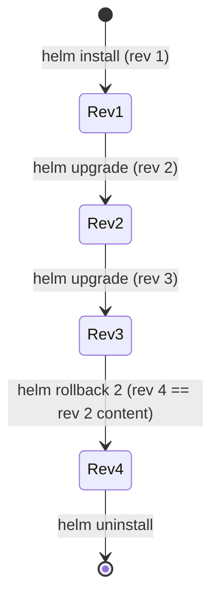
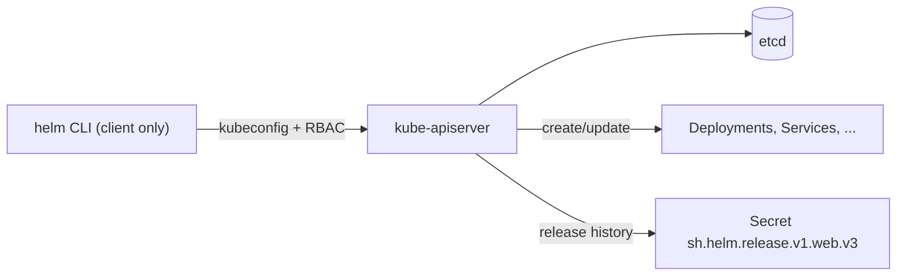

# Helm & Package Management

A real application on Kubernetes is rarely one YAML file. A modest web service already
needs a Deployment, a Service, an Ingress, a ConfigMap, a Secret, an HPA, a
ServiceAccount, maybe a PodDisruptionBudget and a NetworkPolicy — and every one of those
values (image tag, replica count, hostname, resource limits) differs per environment.
Managing that with raw `kubectl apply` means copy-pasting near-identical manifests,
hand-editing values for dev/staging/prod, and having no single command to install,
upgrade, roll back, or delete the whole app as one unit.

**Helm** is the de-facto package manager for Kubernetes. It packages a set of templated
manifests into a versioned artifact called a **chart**, lets you install that chart into a
cluster as a named **release** with environment-specific **values**, and tracks a
**revision history** so you can `helm upgrade` and `helm rollback` atomically. Think of it
as `apt`/`yum`/`npm` for Kubernetes: charts are the packages, repositories (or OCI
registries) distribute them, and releases are installed instances.

This topic assumes the K8s object model from the rest of this domain (Deployments,
Services, ConfigMaps) and container basics from the **docker** domain (Helm never builds
images — it references image tags). It focuses on Helm's mechanics: chart structure, Go
templating, releases and rollbacks, value precedence, dependencies, repositories/OCI, the
Helm 3 (Tiller-free) architecture, hooks, and the Helm-vs-Kustomize decision.

> [!KEY-TAKEAWAY]
> Helm answers three separate problems at once: **templating** (one parameterized chart, N
> environments), **packaging/distribution** (versioned charts in a repo or OCI registry),
> and **release management** (install/upgrade/rollback/uninstall a whole app atomically with
> revision history). Kustomize solves only the first with overlays and no templating
> language.

> [!KEY-TAKEAWAY]
> **Helm 3 has no Tiller.** It is a client-only binary that talks straight to the API server
> with your kubeconfig credentials/RBAC. Release state lives in the cluster as a **Secret**
> (per release, per revision) in the release's namespace by default — not in a server-side
> component.

---

## The problem Helm solves

Without a package manager you face three recurring pains:

1. **Configuration sprawl.** The same manifest must be duplicated and hand-edited for each
   environment. Drift is inevitable — prod ends up with a setting dev never got.
2. **No unit of deployment.** `kubectl apply -f ./` applies files but has no concept of "the
   app" — you cannot atomically upgrade all pieces, and rolling back means remembering the
   previous YAML for every object.
3. **No distribution.** Sharing an app (e.g. Prometheus, cert-manager, an internal service)
   means passing around a folder of YAML with a README of manual edits.

Helm packages the manifests as templates plus a `values.yaml` of defaults. You install once
per environment, overriding only what differs. The install is recorded as a release with a
revision number, so upgrade and rollback are single commands operating on the whole app.

> [!INTERVIEW]
> "What does Helm actually give you over `kubectl apply -f`?" → *Parameterized templates
> (one chart, many environments), a versioned/distributable package, and lifecycle
> management of the app as one unit — install/upgrade/rollback/uninstall with a tracked
> revision history.*

---

## Chart structure

A **chart** is a directory (or a `.tgz` of one) with a fixed layout:

```
mychart/
  Chart.yaml          # chart metadata: name, version, appVersion, dependencies
  values.yaml         # default configuration values
  values.schema.json  # optional JSON Schema to validate user-supplied values
  charts/             # vendored subchart .tgz files (dependencies)
  crds/               # CRDs installed before templates, on install only
  templates/          # the templated manifests
    deployment.yaml
    service.yaml
    _helpers.tpl      # named template partials (leading _ = not rendered as a manifest)
    NOTES.txt         # message printed after install/upgrade
    tests/            # helm test hooks
  .helmignore         # files to exclude when packaging
```

Key points:

- **`Chart.yaml`** carries `apiVersion: v2` (Helm 3), the chart `version` (SemVer of the
  chart itself) and `appVersion` (version of the app being deployed — informational only).
- **`values.yaml`** holds default values; users override a subset at install/upgrade time.
- **`templates/`** files are rendered through Go's `text/template` engine. Any file whose
  name starts with `_` (like `_helpers.tpl`) is treated as a partial and never rendered into
  a standalone manifest.
- **`crds/`** is a special directory: raw (non-templated) CRD YAML installed **before** the
  rest of the chart, and only on first install — Helm does **not** template, upgrade, or
  delete these automatically.
- **`NOTES.txt`** is itself a template; its rendered output is the usage note shown after a
  successful install.

```yaml
# Chart.yaml
apiVersion: v2
name: mychart
description: A demo web app
type: application        # or "library"
version: 1.4.2           # chart version (SemVer) — bump on any chart change
appVersion: "2.7.0"      # the app's version (quoted; informational)
```

---

## Go templating and values

Templates use Go `text/template` plus the **Sprig** function library and a few Helm-specific
functions. Values come from `values.yaml` (or user overrides) via the top-level `.Values`
object; other built-in objects include `.Release`, `.Chart`, `.Capabilities`, and `.Files`.

```yaml
# templates/deployment.yaml
apiVersion: apps/v1
kind: Deployment
metadata:
  name: {{ .Release.Name }}-web
  labels:
    app.kubernetes.io/name: {{ .Chart.Name }}
spec:
  replicas: {{ .Values.replicaCount | default 2 }}
  template:
    spec:
      containers:
        - name: web
          image: "{{ .Values.image.repository }}:{{ .Values.image.tag | default .Chart.AppVersion }}"
          resources:
            {{- toYaml .Values.resources | nindent 12 }}
```

Built-in objects you must know:

| Object | What it holds |
|---|---|
| `.Values` | Merged user values (defaults + overrides) |
| `.Release` | `.Name`, `.Namespace`, `.Revision`, `.IsInstall`, `.IsUpgrade` |
| `.Chart` | Contents of `Chart.yaml` (`.Name`, `.Version`, `.AppVersion`) |
| `.Capabilities` | Cluster/Kube/API versions — e.g. `.Capabilities.KubeVersion` |
| `.Files` | Access to non-template files in the chart (`.Files.Get`) |
| `.Template` | `.Name`/`.BasePath` of the current template |

> [!WARNING]
> Whitespace matters. `{{- ... }}` trims preceding whitespace/newline, `{{ ... -}}` trims
> following. Use `nindent`/`indent` when injecting a block into an already-indented spot;
> forgetting this produces invalid YAML. `helm template` / `helm install --dry-run` renders
> locally so you can eyeball the output before touching the cluster.

### Worked example: `nindent` vs a stray-indent bug

Take this values snippet:

```yaml
# values.yaml
resources:
  limits:
    cpu: 500m
    memory: 512Mi
```

`toYaml .Values.resources` renders that map back to YAML starting at column 0:

```yaml
limits:
  cpu: 500m
  memory: 512Mi
```

Now drop it into a container spec where `resources:` sits at 10 spaces and the block must
sit at 12. The **broken** version uses `indent 12`, which prefixes *every* line (including
the first) with 12 spaces — but the 12 spaces you already typed before `{{` are still there:

```yaml
          resources:
            {{ toYaml .Values.resources | indent 12 }}
```

renders to (the first line lands at 12 + 12 = 24 spaces; the child lines keep their own 2
spaces plus 12 = 14):

```yaml
          resources:
                        limits:        # 24 spaces — over-indented
              cpu: 500m                # 14 spaces — now LESS indented than its parent
              memory: 512Mi            # 14 spaces
```

`kubectl` rejects that (`error converting YAML to JSON: yaml: line ...: did not find
expected key`) because `limits:` is indented deeper than its own children. The fix is
`nindent 12` (newline + indent) together with a `{{-` that trims the whitespace/newline you
typed before it:

```yaml
          resources:
            {{- toYaml .Values.resources | nindent 12 }}
```

`{{-` eats the newline after `resources:` and the 12 leading spaces; `nindent 12` then
re-emits one clean newline and prefixes every line with exactly 12 spaces computed from
scratch:

```yaml
          resources:
            limits:            # 12 spaces
              cpu: 500m        # 14 spaces
              memory: 512Mi    # 14 spaces
```

Valid: `limits:` sits one level under `resources:`, its children one level under that. Rule
of thumb — put the directive on its own line, start it with `{{-`, and use `nindent` (not
`indent`) so indentation is built fresh rather than stacked on top of what you already typed.

---

## Template functions, pipelines, and flow control

Helm exposes Sprig functions plus Helm-specific ones, composed via `|` pipelines:

```yaml
# quote a value
name: {{ .Values.name | quote }}
# default + upper
tier: {{ .Values.tier | default "backend" | upper }}
# render a map/list as YAML with correct indentation
env:
  {{- toYaml .Values.env | nindent 2 }}
# base64-encode a secret value
password: {{ .Values.password | b64enc }}
```

Flow control and iteration:

```yaml
{{- if .Values.ingress.enabled }}
# ... ingress manifest ...
{{- end }}

{{- range .Values.hosts }}
  - host: {{ . }}
{{- end }}

{{- with .Values.podAnnotations }}   # sets scope: inside, "." = .Values.podAnnotations
annotations:
  {{- toYaml . | nindent 2 }}
{{- end }}
```

Two frequently-confused mechanisms — **`include`** and **`tpl`**:

- **`include`** calls a named template (defined with `define` in `_helpers.tpl`) and returns
  its output as a string, so it can be piped: `{{ include "mychart.labels" . | nindent 4 }}`.
  Prefer `include` over the built-in `template` action precisely because `template` is a
  statement (can't be piped into `nindent`/`indent`).
- **`tpl`** renders a **string that itself contains template directives** using the current
  context: `{{ tpl .Values.customConfig . }}`. Use it when a *value* supplied by the user is
  itself a template (e.g. a config blob referencing `.Release.Name`).

> [!TIP]
> `required "message" .Values.foo` fails the render with your message if the value is empty —
> use it to enforce mandatory values. `fail "..."` aborts unconditionally. `lookup` can read
> live cluster objects during render (returns empty on `--dry-run`).

---

## Named templates and _helpers.tpl

Repetition (labels, selector labels, a computed fullname) is factored into **named
templates** with `define`, conventionally in `templates/_helpers.tpl`:

```yaml
{{/* _helpers.tpl */}}
{{- define "mychart.fullname" -}}
{{- printf "%s-%s" .Release.Name .Chart.Name | trunc 63 | trimSuffix "-" -}}
{{- end -}}

{{- define "mychart.labels" -}}
app.kubernetes.io/name: {{ .Chart.Name }}
app.kubernetes.io/instance: {{ .Release.Name }}
app.kubernetes.io/managed-by: {{ .Release.Service }}
helm.sh/chart: {{ printf "%s-%s" .Chart.Name .Chart.Version }}
{{- end -}}
```

Used via `include`:

```yaml
metadata:
  name: {{ include "mychart.fullname" . }}
  labels:
    {{- include "mychart.labels" . | nindent 4 }}
```

The `trunc 63` matters: Kubernetes object names and label values are limited to 63
characters, and long release names will otherwise produce invalid objects. Note the leading
`_` on `_helpers.tpl` — that is what stops Helm rendering it as its own manifest.

---

## Releases, revisions, and the release lifecycle

A **release** is an *instance* of a chart running in a cluster, identified by a name and
namespace. The same chart can be installed many times (`web-blue`, `web-green`) — each is a
separate release with independent values and history.

```bash
helm install web ./mychart -n prod           # create release "web"
helm upgrade web ./mychart -n prod --set replicaCount=5   # -> revision 2
helm upgrade --install web ./mychart -n prod  # idempotent: install or upgrade
helm rollback web 1 -n prod                   # revert to revision 1 -> creates revision 3
helm history web -n prod                      # list revisions
helm status web -n prod
helm uninstall web -n prod                    # remove release (add --keep-history to retain)
helm list -n prod                             # -A for all namespaces
```

Every `install`/`upgrade`/`rollback` produces a new **revision** number. Rollback does not
delete history — it creates a *new* revision whose content equals the target. Helm computes a
three-way strategic merge (old manifest, new manifest, live state) so it can reconcile
manual `kubectl edit` drift on upgrade.

### Worked example: three-way merge vs manual drift

The three inputs to the merge are: **(1) old manifest** — what Helm last rendered and stored
in the release Secret; **(2) new manifest** — what this `helm upgrade` renders now; **(3)
live state** — what the object actually looks like in the cluster right now (including manual
edits). Walk a concrete drift case:

1. Chart sets `replicas: 3`; `helm install` → live Deployment has `replicas: 3`.
2. An operator panics during a spike: `kubectl scale deploy/web --replicas=10`. Live state is
   now `10`; Helm's stored (old) manifest still says `3`.
3. Someone runs `helm upgrade` with the **chart unchanged** (new manifest also says `3`).

Helm diffs old (`3`) vs new (`3`): **no change to `replicas`** from Helm's side, so it
generates no patch for that field — the live `10` is left alone. But now change the chart to
`replicas: 5` and upgrade: old (`3`) vs new (`5`) *is* a Helm-driven change, so Helm patches
`replicas` to `5`, **overwriting the manual `10`**. The senior takeaway: Helm 3 only reverts
your manual drift on fields it is *actively changing* this upgrade; a field Helm didn't touch
survives.

Contrast Helm 2's **two-way merge** (old manifest vs new manifest only — it never read live
state): it computed the patch purely from the manifest diff, so it could silently clobber or
fail to reconcile manual edits it had no knowledge of. Helm 3's three-way merge is what makes
`helm upgrade` aware of out-of-band `kubectl edit`/`kubectl scale` changes at all.



### Resource ordering within a chart

Helm applies the objects in a single install/upgrade phase in a **fixed kind-priority order**,
not by analyzing references between them. The order runs roughly: Namespace → NetworkPolicy →
ResourceQuota → ... → ServiceAccount → Secret → ConfigMap → ... → Service → ... → Deployment →
StatefulSet → ... → Job → Ingress → APIService. So the common case ("create the
ServiceAccount and Secret *before* the Deployment that mounts them") works automatically —
because those kinds simply sort earlier, **not** because Helm noticed the Deployment
references them. There is no dependency graph between your objects. The practical
consequences:

- Ordering you *can* express is only the built-in kind order — you cannot say "this
  Deployment before that Deployment."
- Cross-object timing you genuinely need to sequence (run a DB migration, then start the app;
  install a CRD before a CR that uses it) is what **hooks + `hook-weight`** and the **`crds/`**
  directory are for.

> [!WARNING]
> `--atomic` on install/upgrade auto-rolls-back the release if it fails (and `--cleanup-on-fail`
> removes new resources created during a failed upgrade). Without them a failed upgrade can
> leave the release stuck in a `pending-upgrade`/`failed` state, and the next command may
> error until you roll back or repair it.

---

## Values overriding and precedence

Values are merged from several sources. Understanding **precedence** is a classic interview
question. From lowest to highest priority:

1. The chart's own `values.yaml` (defaults).
2. A parent chart's values that target a subchart (parent overrides subchart defaults).
3. `-f`/`--values` files, applied left-to-right (later files win).
4. `--set`, `--set-string`, `--set-file`, `--set-json` on the command line (highest).

```bash
helm upgrade --install web ./mychart \
  -f values.yaml -f values-prod.yaml \      # values-prod wins over values.yaml
  --set image.tag=2.8.1 \                    # --set beats any -f
  --set-string replicaCount=3                # forces string type
```

Merging is a **deep merge for maps** but **`--set` and `-f` replace lists wholesale** — you
cannot merge into the middle of an array; you supply the whole array. `--set a.b=c` uses dots
for nesting and needs escaping for literal dots/commas. `helm get values web` shows the
user-supplied values; add `-a`/`--all` (`helm get values -a`) to see the fully computed set.

> [!INTERVIEW]
> "If a key is set in both `values-prod.yaml` (via `-f`) and `--set`, which wins?" → *`--set`
> always wins; command-line `--set*` has the highest precedence, then `-f` files (right-most
> first), then parent-chart values, then the chart's `values.yaml` defaults.*

### Worked example: resolving one key across four layers

Given these inputs to a single `helm upgrade`:

```yaml
# values.yaml (chart default, lowest)      # values-prod.yaml (-f, higher)
replicaCount: 2                            replicaCount: 4
image:                                     env:
  repository: myapp                          - name: TIER
  tag: "1.0"                                   value: prod
env:
  - name: TIER
    value: dev
```

```bash
helm upgrade web ./mychart -f values.yaml -f values-prod.yaml --set image.tag=2.8.1
```

Resolve key by key, lowest layer to highest:

| Key | values.yaml | values-prod.yaml | --set | **Final** |
|---|---|---|---|---|
| `replicaCount` | 2 | 4 | — | **4** (prod file wins over default) |
| `image.repository` | myapp | — | — | **myapp** (only the default set it) |
| `image.tag` | "1.0" | — | 2.8.1 | **2.8.1** (`--set` beats everything) |
| `env` (a list) | `[{TIER: dev}]` | `[{TIER: prod}]` | — | **`[{TIER: prod}]`** |

Note the two different merge behaviors. `image` is a **map**, so it deep-merges:
`image.repository` (only in defaults) *survives* even though `image.tag` was overridden — the
final `image` is `{repository: myapp, tag: 2.8.1}`, not just `{tag: 2.8.1}`. `env` is a
**list**, so it is replaced **wholesale**: the prod file's one-element list completely
supplants the default's — there is no element-by-element merge, and you could not "add" an
env var by supplying a partial list. That map-merge-vs-list-replace split is the detail
interviewers probe after you recite the precedence order.

---

## Chart dependencies and subcharts

A chart can depend on other charts (**subcharts**). Dependencies are declared in `Chart.yaml`
and vendored into `charts/`:

```yaml
# Chart.yaml
dependencies:
  - name: postgresql
    version: "12.x.x"
    repository: "https://charts.bitnami.com/bitnami"
    condition: postgresql.enabled     # toggle the subchart on/off
    alias: db                          # rename it in this chart
  - name: common
    version: "2.x.x"
    repository: "oci://registry-1.docker.io/bitnamicharts"
```

```bash
helm dependency update ./mychart   # resolves deps, writes charts/*.tgz and Chart.lock
helm dependency build ./mychart    # rebuild charts/ from an existing Chart.lock
```

`helm dependency update` pins resolved versions in **`Chart.lock`** (analogous to a lockfile),
so builds are reproducible. Parent values can override subchart values under a key matching
the subchart name (or its `alias`): `postgresql.auth.password: ...`. **Global** values
(`.Values.global.*`) are shared across the parent and all subcharts.

- **`condition`** enables/disables a subchart based on a boolean value (first existing path
  wins). **`tags`** group several subcharts under one toggle.
- A **library chart** (`type: library`) ships only reusable named templates — no
  installable manifests — and is depended on for its `_helpers`, not installed on its own.

> [!WARNING]
> Subchart hooks always run and a parent **cannot** disable a subchart's hooks. Subchart
> values are namespaced under the subchart's name; a bare top-level value will not reach a
> subchart unless it is under that subchart's key or declared `global`.

---

## Repositories and OCI registries

Charts are distributed two ways:

**Classic HTTP repositories** — a web server hosting packaged `.tgz` charts plus an
`index.yaml` catalog:

```bash
helm repo add bitnami https://charts.bitnami.com/bitnami
helm repo update
helm search repo nginx
helm install my-nginx bitnami/nginx
```

**OCI registries** (GA since Helm 3.8) — charts are pushed as OCI artifacts to any
container registry (ECR, GHCR, Docker Hub, Harbor), reusing the same registry infra as
images. There is **no `index.yaml`** and you don't `helm repo add` an OCI registry:

```bash
helm push mychart-1.4.2.tgz oci://registry.example.com/charts
helm install web oci://registry.example.com/charts/mychart --version 1.4.2
helm pull oci://registry.example.com/charts/mychart --version 1.4.2
```

`helm package ./mychart` produces the `.tgz`. `helm lint` and `helm template` validate a
chart before publishing.

> [!TIP]
> OCI is the direction of travel: one registry for images and charts, standard auth
> (`helm registry login`), immutable digests, and no separate index to maintain. Prefer OCI
> for new internal chart distribution.

---

## Helm 3 architecture — no Tiller

Helm 2 had a **Tiller** server component running in the cluster with cluster-wide
permissions; every client talked to Tiller, which applied changes. Tiller was a notorious
security problem (a shared, often over-privileged in-cluster service) and made RBAC hard.

**Helm 3 removed Tiller entirely.** The `helm` binary is now a pure client that talks
directly to the Kubernetes API server using **your kubeconfig context and your RBAC**. There
is no server-side component and no cluster-wide privilege escalation — you can only do what
your credentials allow.

Release state moved into the cluster as Kubernetes objects:

- By default, each release revision is stored as a **Secret** of `type: helm.sh/release.v1`
  in the release's namespace, named like `sh.helm.release.v1.<release>.v<revision>`.
- The storage backend is configurable via the `HELM_DRIVER` env var: `secret` (default),
  `configmap`, or `sql` (a beta PostgreSQL backend for releases exceeding the ~1MB
  Secret/etcd size limit). Switching backends requires manual migration.



> [!INTERVIEW]
> "How does Helm 3 differ from Helm 2 security-wise?" → *Helm 2 used Tiller, an in-cluster
> server usually granted broad permissions, so anyone with Helm access effectively had
> Tiller's rights. Helm 3 dropped Tiller — the client uses the caller's own kubeconfig and
> RBAC, and release state is stored as Secrets in the namespace.*

---

## Hooks

**Hooks** let a chart run resources (usually Jobs/Pods) at defined points in the release
lifecycle — e.g. a DB migration before an upgrade, or a backup before delete. A resource
becomes a hook via the `helm.sh/hook` annotation:

```yaml
apiVersion: batch/v1
kind: Job
metadata:
  name: {{ .Release.Name }}-migrate
  annotations:
    "helm.sh/hook": pre-upgrade,pre-install
    "helm.sh/hook-weight": "-5"                 # lower runs first; must be a string
    "helm.sh/hook-delete-policy": hook-succeeded # or before-hook-creation / hook-failed
spec:
  template:
    spec:
      restartPolicy: Never
      containers: [{ name: migrate, image: myapp:2.8.0, command: ["./migrate.sh"] }]
```

Hook points: `pre-install`, `post-install`, `pre-upgrade`, `post-upgrade`, `pre-delete`,
`post-delete`, `pre-rollback`, `post-rollback`, and `test` (run by `helm test`).

- **Weights** order hooks in the same phase, ascending (default 0), and must be quoted
  strings. Helm waits for a Job/Pod hook to reach completion before proceeding; a failed hook
  fails the release.
- **`hook-delete-policy`**: `before-hook-creation` (default — delete the previous hook object
  before recreating), `hook-succeeded`, `hook-failed`.
- Hook resources are **not** part of the release's normal tracked set. `helm uninstall` won't
  necessarily clean up objects a hook created (unless they are themselves delete-policy'd or
  regular tracked resources).

> [!WARNING]
> The `crds/` directory is **not** a hook and is not templated — it installs raw CRDs before
> everything else, only on first install, and is never upgraded or deleted by Helm. Use it
> for CRDs, not `pre-install` hooks, to avoid ordering/race problems.

---

## Helm vs Kustomize

Both produce Kubernetes manifests, but with opposite philosophies:

| Aspect | Helm | Kustomize |
|---|---|---|
| Approach | **Templating** (Go templates + values) | **Overlays** — patch a base with strategic/JSON merge patches |
| Template language | Yes (Go/Sprig) — logic, loops, conditionals | **None** — pure YAML, no variables/loops |
| Packaging/distribution | Yes — versioned charts, repos, OCI | No native packaging (kustomizations are just dirs) |
| Release lifecycle | Yes — install/upgrade/**rollback**, revision history | No — it only emits YAML; `kubectl` applies it |
| Learning curve / risk | Templating power, but easy to produce invalid YAML | Simpler, no language, but no logic and no reuse of upstream packages |
| Tooling | `helm` CLI | Built into `kubectl` (`kubectl apply -k`) and standalone `kustomize` |

When to pick which:

- **Helm** when you need to *distribute/consume* a packaged app (third-party charts, an
  internal chart used by many teams), want lifecycle management (rollback/history), or need
  templating logic (conditional resources, loops).
- **Kustomize** when you own the manifests and just need per-environment variation via
  overlays, want to avoid a templating language, and are happy for `kubectl` to apply the
  rendered output.
- **Both together** is common: `helm template` renders a chart, then Kustomize post-renders
  patches (Helm supports `--post-renderer`); or Argo CD/Flux consume either.

> [!INTERVIEW]
> "Helm or Kustomize?" → *Kustomize is overlay/patch-based with no templating language and no
> release lifecycle — great when you own simple manifests. Helm is templating + packaging +
> lifecycle (rollback/history) — better for distributing/consuming apps and for logic-heavy
> charts. They're not mutually exclusive; Helm can post-render with Kustomize.*

---

## Chart testing, linting, and validation

Quality gates before publishing or in CI:

```bash
helm lint ./mychart                 # static checks: Chart.yaml, values, template errors
helm template web ./mychart -f values-prod.yaml   # render offline; inspect the YAML
helm install web ./mychart --dry-run --debug      # render + server-side validation, no apply
helm test web -n prod               # run resources annotated helm.sh/hook: test
```

- **`helm lint`** catches structural/metadata issues and obvious template errors without a
  cluster.
- **`helm template`** renders locally (no API server) — fast feedback, but note it does not
  see the cluster, so `.Capabilities` and `lookup` are limited/empty.
- **`--dry-run`** additionally sends the manifests to the API server for validation
  (schema/admission) without persisting them.
- **`values.schema.json`** enforces a JSON Schema on user-supplied values, failing fast on
  typos or bad types.
- **`helm test`** executes test hooks (typically a Pod that curls the Service) to verify a
  deployed release actually works. The community **chart-testing (`ct`)** tool wires lint +
  install + test into CI.

> [!TIP]
> In CI, run `helm lint` + `helm template | kubeconform`/`kubeval` for schema validation, and
> `helm unittest` for template unit tests — none of which need a live cluster — then a
> `--dry-run` (or `ct install` on kind) for the server-validated pass.

---

## Common follow-up questions

- Where does Helm 3 store release state, and in what format? As a Secret
  (`sh.helm.release.v1.<release>.v<rev>`, type `helm.sh/release.v1`) in the release namespace
  by default — a gzipped, base64-encoded blob of the release. Configurable via `HELM_DRIVER`
  (`secret`/`configmap`/`sql`).
- What is the difference between chart `version` and `appVersion`? `version` is the SemVer
  of the chart package (bump on any chart change); `appVersion` is the version of the
  application shipped and is informational (often used as the default image tag).
- How do you make an upgrade idempotent in CI? `helm upgrade --install` (installs if
  absent, upgrades if present), typically with `--atomic --wait`.
- Why did my env-var change not take effect after `helm upgrade`? If nothing in the Pod
  template changed, the Deployment isn't rolled; a common trick is a checksum annotation of
  the ConfigMap/Secret (`checksum/config: {{ include (print $.Template.BasePath "/configmap.yaml") . | sha256sum }}`)
  so config changes force a rollout. *Why it works:* editing the ConfigMap changes its
  rendered content, so the `sha256sum` changes; the annotation must live in
  `spec.template.metadata.annotations` (the **Pod template**, not the Deployment's own
  metadata). Changing the Pod template spec makes the Deployment controller compute a new
  pod-template hash, which it treats as a new ReplicaSet → a rolling update. A ConfigMap edit
  alone never touches the Pod template, so without this annotation the pods keep their old
  mounted/env values until they happen to restart for another reason.
- Can Helm merge into a list value? No — `--set`/`-f` replace arrays wholesale; only maps
  deep-merge.
- How do hooks differ from normal resources? They run at lifecycle phases, are ordered by
  weight, aren't part of the tracked release, and follow their own delete policy.
- Argo CD / Flux and Helm? GitOps controllers can render and apply charts (see the
  `gitops-continuous-delivery` topic) — often using `helm template` server-side rather than
  `helm install`, so the GitOps controller owns reconciliation.

## References

- Helm docs — Charts: https://helm.sh/docs/topics/charts/
- Helm docs — Chart template guide: https://helm.sh/docs/chart_template_guide/
- Helm docs — Chart hooks: https://helm.sh/docs/topics/charts_hooks/
- Helm docs — Advanced / storage backends (HELM_DRIVER): https://helm.sh/docs/topics/advanced/
- Helm docs — Registries (OCI): https://helm.sh/docs/topics/registries/
- Helm docs — Helm 3 architecture / Tiller removal: https://helm.sh/docs/faq/
- Helm docs — Value files & precedence: https://helm.sh/docs/chart_template_guide/values_files/
- Kustomize docs: https://kubectl.docs.kubernetes.io/references/kustomize/
- Kubernetes docs — Managing resources / Declarative config: https://kubernetes.io/docs/concepts/cluster-administration/manage-deployment/
