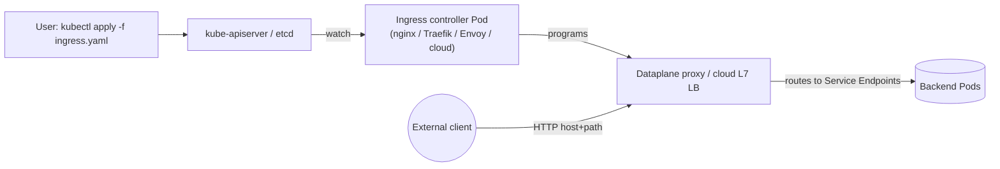
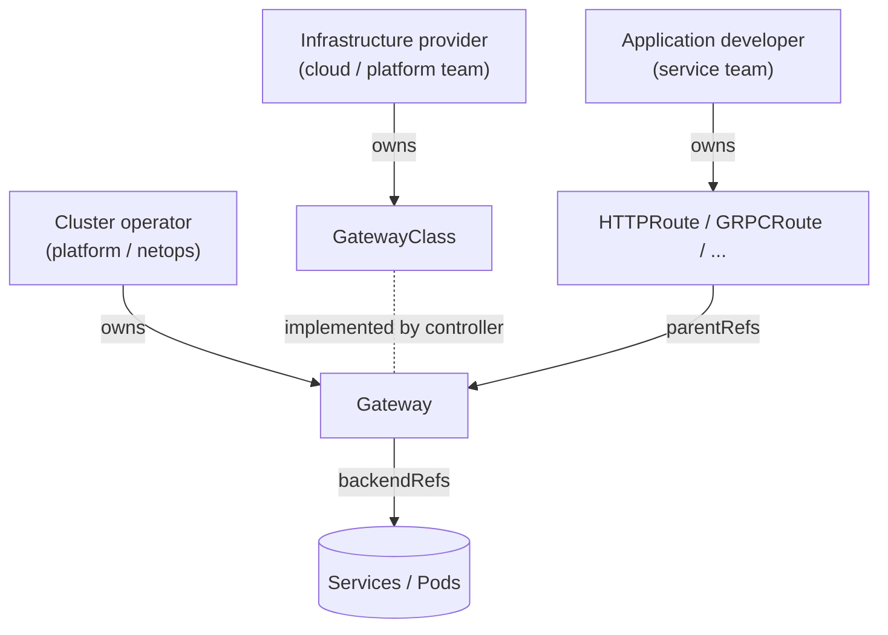
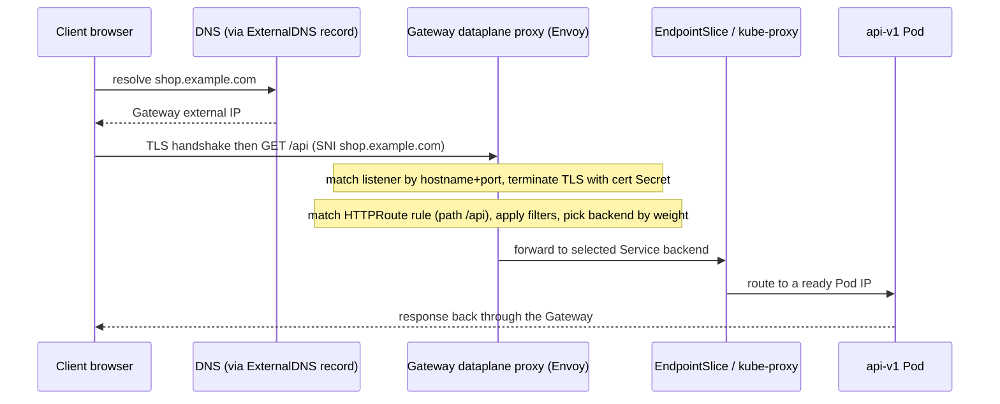

# Ingress, Gateway API & External Traffic

Getting HTTP(S) traffic from the outside world to a Pod is a distinct problem from
service-to-service traffic *inside* the cluster. A `Service` gives you a stable virtual IP
and L4 load balancing (see the `services-networking` topic), and `type=LoadBalancer` can
expose one Service on a cloud L4 load balancer — but that is one external IP *per Service*
and no HTTP awareness. Real applications want **L7 routing**: one entry point that fans out
by hostname and URL path to many backends, terminates TLS, and does it without provisioning
a load balancer per microservice. That is what **Ingress** and its modern successor the
**Gateway API** provide.

This topic covers north-south traffic (client → cluster). It assumes you already know
`Service`, `ClusterIP`, `NodePort`, `type=LoadBalancer`, `kube-proxy`, and `EndpointSlices`
from the `services-networking` topic, and containers from the `docker` domain. East-west
traffic policy (mTLS, retries, circuit breaking between services) belongs to the
`service-mesh-traffic-management` topic; this topic explains where the boundary is.

> [!KEY-TAKEAWAY]
> An **Ingress/Gateway resource is just data** — it does nothing until a **controller**
> (nginx, Traefik, Envoy Gateway, a cloud LB controller, a mesh) is running to watch it and
> program real proxy/LB infrastructure. Ingress is **stable but feature-frozen**; the
> Kubernetes project now recommends the **Gateway API** (GA since v1.0, Oct 2023) for new
> work: it is role-oriented, portable, and has traffic splitting, header matching, and
> cross-namespace routing built into the spec instead of controller-specific annotations.

---

## North-south vs east-west traffic

**North-south** traffic crosses the cluster boundary: a browser, mobile app, or external
system talking *in* to your services (and responses going *out*). **East-west** traffic is
service-to-service *inside* the cluster (Pod → Pod, often via a `ClusterIP` Service).

The distinction matters because the tools differ:

| Axis | Handles | Typical tooling |
|---|---|---|
| **North-south (ingress)** | External client → cluster; TLS termination, host/path routing, WAF, rate limits at the edge | `Service type=LoadBalancer`, **Ingress + controller**, **Gateway API** |
| **East-west (mesh)** | Service ↔ service; mTLS, retries, timeouts, circuit breaking, traffic shifting between versions | `ClusterIP` Services + `kube-proxy`; a **service mesh** (Istio, Linkerd) |

They overlap at the edges — a mesh ingress gateway does north-south, and the Gateway API's
GAMMA initiative extends `HTTPRoute` to east-west mesh routing — but for interviews the clean
mental model is: **Ingress/Gateway = the front door; mesh = the hallways.** North-south is
about *exposing* services safely; east-west is about *connecting* them reliably and securely.

> [!INTERVIEW]
> A classic question: "How does traffic get from a user's browser to a Pod?" The full path
> is DNS → external load balancer → (NodePort/`LoadBalancer` Service or ingress controller
> Pod) → `kube-proxy`/iptables/IPVS or the controller's own dataplane → Pod IP via an
> EndpointSlice. Ingress/Gateway inserts an L7 hop that routes by host/path *before* the
> Service selects a Pod.

---

## Service type=LoadBalancer and NodePort recap

Before Ingress, the built-in ways to expose a Service externally are:

- **`NodePort`** — allocates a port (default range 30000–32767) on *every* node; traffic to
  `any-node-ip:nodePort` is forwarded to the Service. Crude but dependency-free.
- **`type=LoadBalancer`** — builds on NodePort and asks the cloud provider (via a
  cloud-controller-manager) to provision an **external L4 load balancer** pointing at those
  NodePorts. You get one external IP per Service.

The limitations that motivate Ingress:

- **One LB (and often one public IP + cost) per Service.** Exposing 30 microservices means
  30 cloud load balancers.
- **L4 only** — no hostname or URL-path routing, no shared TLS termination, no HTTP-level
  features. The LB cannot send `api.example.com` and `www.example.com` to different Services.

```yaml
apiVersion: v1
kind: Service
metadata:
  name: web
spec:
  type: LoadBalancer      # cloud provisions an external L4 LB with an external IP
  selector:
    app: web
  ports:
    - port: 80
      targetPort: 8080
```

> [!TIP]
> Ingress and Gateway controllers themselves are usually exposed with a *single*
> `type=LoadBalancer` Service (the controller's dataplane), then fan out L7 to many backends.
> So you pay for one cloud LB and route dozens of hostnames/paths behind it.

---

## The Ingress resource

An **Ingress** (`networking.k8s.io/v1`, stable since Kubernetes v1.19) is an API object that
declares **L7 (HTTP/HTTPS) routing rules**: "requests for host `X` path `Y` go to Service
`Z` on port `P`." It supports host-based virtual hosting, path fanout, and TLS termination —
but **only HTTP/HTTPS**. Non-HTTP protocols need `NodePort`/`LoadBalancer` or the Gateway
API's TCPRoute/UDPRoute.

```yaml
apiVersion: networking.k8s.io/v1
kind: Ingress
metadata:
  name: shop
spec:
  ingressClassName: nginx
  rules:
    - host: shop.example.com
      http:
        paths:
          - path: /api
            pathType: Prefix
            backend:
              service:
                name: api-svc
                port:
                  number: 80
          - path: /
            pathType: Prefix
            backend:
              service:
                name: web-svc
                port:
                  number: 80
```

The Ingress spec supports:

- **`rules`** — a list of host + HTTP path → backend mappings. Both host (if set) and path
  must match. A rule with no `host` matches all inbound hosts.
- **`defaultBackend`** — where unmatched requests go. If there are no `rules`, a
  `defaultBackend` is required.
- **`tls`** — hosts to terminate TLS for, referencing a Secret (see below).

> [!WARNING]
> **The Ingress API is frozen.** It remains stable and supported (no removal planned), but
> receives no new features. New host/path features, traffic splitting, header routing, etc.
> live only in controller-specific annotations or in the Gateway API. The Kubernetes docs
> explicitly recommend Gateway API for new deployments.

---

## Ingress needs a controller (the resource alone does nothing)

This is the single most-tested Ingress fact: **creating an Ingress object has no effect
unless an Ingress controller is running.** The object is just desired state in etcd; a
controller must watch Ingress resources and *program* real infrastructure (an nginx config,
an Envoy config, a cloud L7 load balancer) to satisfy them.



Common controllers: **ingress-nginx** (the community NGINX controller), **Traefik**,
**HAProxy**, **Envoy Gateway / Contour**, and cloud controllers (AWS Load Balancer
Controller → ALB, GKE Ingress → Google Cloud LB, AGIC → Azure App Gateway). Unlike most
controllers, an Ingress controller is **not** built into `kube-controller-manager` — you
install it yourself. If you `kubectl apply` an Ingress on a cluster with no controller,
`kubectl get ingress` shows an empty `ADDRESS` and nothing happens.

> [!INTERVIEW]
> "I applied my Ingress and nothing works." First checks: (1) Is an ingress controller
> installed and running? (2) Does `ingressClassName` match an installed `IngressClass`?
> (3) `kubectl describe ingress` — is `ADDRESS` populated? (4) Do the backend Service and
> its Endpoints exist and select ready Pods?

---

## IngressClass and ingressClassName

A cluster can run **multiple ingress controllers** (e.g., an internal and an external one).
An **`IngressClass`** resource names a controller and lets each Ingress choose which
controller should satisfy it via `spec.ingressClassName`.

```yaml
apiVersion: networking.k8s.io/v1
kind: IngressClass
metadata:
  name: nginx
  annotations:
    ingressclass.kubernetes.io/is-default-class: "true"   # optional default
spec:
  controller: k8s.io/ingress-nginx
```

- An Ingress with `ingressClassName: nginx` is handled only by the controller that owns that
  class; other controllers ignore it.
- If `ingressClassName` is omitted, the Ingress is handled by the **default** IngressClass
  (the one annotated `is-default-class: "true"`), if one exists. If none is default and none
  is specified, no controller claims the Ingress.
- The older `kubernetes.io/ingress.class` annotation is **deprecated** in favor of the
  `ingressClassName` field.

> [!WARNING]
> Having **two** IngressClasses both marked default is a misconfiguration — behavior is
> undefined/controller-dependent. Exactly one default at most.

---

## Ingress path types and routing

Every path in an Ingress rule must set a **`pathType`** (there is no default — it is
required). Three values:

| pathType | Matches |
|---|---|
| **`Exact`** | The URL path exactly, case-sensitive. `/foo` matches only `/foo`, not `/foo/`. |
| **`Prefix`** | Path split by `/` element-wise. `/foo` matches `/foo`, `/foo/`, `/foo/bar` — but **not** `/foobar` (element boundaries, not string prefix). |
| **`ImplementationSpecific`** | Matching is delegated to the IngressClass/controller (may support regex, etc.). |

Routing precedence when multiple rules match is **not** fully specified by the API and is
partly controller-dependent, but conventionally **longer/more-specific paths win** and
`Exact` beats `Prefix`. Host matching supports wildcards like `*.example.com` (matches one
DNS label, so `foo.example.com` but not `example.com` or `a.b.example.com`).

> [!WARNING]
> A frequent bug: expecting `Prefix` `/foo` to match `/foobar`. It does not — `Prefix` works
> on path segments split by `/`. Use `ImplementationSpecific` with a regex (nginx) if you
> truly need substring matching. Also beware rewrite behavior: sending `/api` to a backend
> that expects `/` requires a controller-specific **rewrite** annotation.

---

## TLS termination in Ingress

Ingress terminates TLS by referencing a **Secret of type `kubernetes.io/tls`** (containing
`tls.crt` and `tls.key`) under `spec.tls`. The controller loads the cert and serves HTTPS for
the listed hosts, decrypting before forwarding (usually plaintext) to the backend.

```yaml
apiVersion: networking.k8s.io/v1
kind: Ingress
metadata:
  name: shop-tls
spec:
  ingressClassName: nginx
  tls:
    - hosts: [shop.example.com]
      secretName: shop-tls        # a kubernetes.io/tls Secret
  rules:
    - host: shop.example.com
      http:
        paths:
          - path: /
            pathType: Prefix
            backend:
              service: { name: web-svc, port: { number: 80 } }
```

Key points and gotchas:

- The TLS Secret must live **in the same namespace as the Ingress**.
- The `hosts` in the `tls` block should match the `rules` hosts (and the cert SAN) for SNI to
  pick the right cert.
- **Termination happens at the controller/edge.** Traffic from controller → backend Pod is
  typically plaintext HTTP unless you configure re-encryption (backend TLS) or a mesh.
- Many production behaviors (HTTP→HTTPS redirect, HSTS, mTLS, cipher suites) are **not** in
  the Ingress spec — they are controller-specific annotations. This annotation sprawl is a
  major driver toward the Gateway API.

---

## Ingress annotations and their limits

Because the Ingress spec is intentionally minimal (and now frozen), controllers expose extra
behavior through **annotations** on the Ingress object — and these are **controller-specific
and non-portable**. Examples for ingress-nginx:

```yaml
metadata:
  annotations:
    nginx.ingress.kubernetes.io/rewrite-target: /
    nginx.ingress.kubernetes.io/ssl-redirect: "true"
    nginx.ingress.kubernetes.io/canary: "true"
    nginx.ingress.kubernetes.io/canary-weight: "20"
```

The problems this creates:

- **Not portable** — an ingress-nginx annotation means nothing to Traefik or a cloud
  controller. Migrating controllers means rewriting annotations.
- **Not validated** — a typo'd annotation is silently ignored; no schema, no `kubectl`
  validation, no clear error.
- **No role separation** — the app dev, cluster operator, and infra owner all edit the same
  object with a bag of stringly-typed knobs.
- **Feature drift** — traffic splitting, header-based routing, and TLS options are
  implemented differently (or not at all) per controller.

> [!KEY-TAKEAWAY]
> "Ingress annotations" is the canonical answer to "why was the Gateway API created?" The
> Gateway API promotes the most common annotation use-cases (traffic splitting, header
> matching, redirects, cross-namespace) into **typed, portable, validated API fields**.

---

## Why the Gateway API was created

The Gateway API (`gateway.networking.k8s.io`) is a CNCF/SIG-Network project that is the
**official successor to Ingress**. It addresses Ingress's structural limits:

- **Expressiveness** — traffic splitting by weight, header/method/query matching, request &
  response header rewriting, redirects, and mirroring are **first-class typed fields**, not
  annotations.
- **Portability** — features are in the spec, so they behave the same across conformant
  implementations (Envoy Gateway, Istio, Cilium, NGINX Gateway Fabric, cloud gateways).
- **Role orientation** — the API is split into resources owned by different personas
  (see next section), enabling safe multi-team/multi-tenant use with RBAC.
- **Extensibility & protocols** — beyond HTTP: GRPCRoute, TCPRoute, TLSRoute, UDPRoute, plus
  policy attachment for advanced config.

It is delivered as **installable CRDs** (an add-on), not baked into core Kubernetes, so you
install a specific version's CRDs plus a controller (a GatewayClass implementation).

---

## The Gateway API resource model (roles)

The Gateway API's headline design is **role-oriented**: it splits the single Ingress object
into three resources owned by three personas, so responsibilities and RBAC line up with real
org structure.



| Resource | Owner | Purpose |
|---|---|---|
| **GatewayClass** | Infrastructure provider | Cluster-scoped template naming the **controller** that implements it (like `IngressClass`, but richer). |
| **Gateway** | Cluster operator | An instance of traffic-handling infra (a load balancer / proxy). Declares **listeners** (port, protocol, hostname, TLS) and which routes may attach. |
| **HTTPRoute** (and GRPCRoute, TCPRoute, ...) | Application developer | Protocol-specific routing rules attached to a Gateway listener, pointing at backend Services. |

This separation means the platform team owns TLS certs and listener ports on the `Gateway`,
while each app team manages only its own `HTTPRoute` — with RBAC enforcing the split, and
`allowedRoutes` on the Gateway controlling which namespaces may attach.

---

## GatewayClass and Gateway

A **GatewayClass** (cluster-scoped) names the controller that will service Gateways of that
class — analogous to a `StorageClass` for storage or an `IngressClass` for Ingress:

```yaml
apiVersion: gateway.networking.k8s.io/v1
kind: GatewayClass
metadata:
  name: eg
spec:
  controllerName: gateway.envoyproxy.io/gatewayclass-controller
```

A **Gateway** requests an instance of that infrastructure and defines **listeners**:

```yaml
apiVersion: gateway.networking.k8s.io/v1
kind: Gateway
metadata:
  name: prod-gw
  namespace: infra
spec:
  gatewayClassName: eg
  listeners:
    - name: https
      protocol: HTTPS
      port: 443
      hostname: "*.example.com"
      tls:
        mode: Terminate
        certificateRefs:
          - kind: Secret
            name: wildcard-example-tls
      allowedRoutes:
        namespaces:
          from: Selector          # only namespaces matching the selector may attach
          selector:
            matchLabels: { team: web }
```

Notes:

- **Listeners** carry port + protocol (HTTP/HTTPS/TCP/TLS/UDP) + optional hostname + TLS
  config. TLS lives on the **Gateway (operator)**, not scattered across app routes.
- **`allowedRoutes`** is the trust control: `from: Same` (default), `All`, or `Selector`
  decides which namespaces' routes may bind to this listener.
- The Gateway's `status` reports an assigned address and per-listener `attachedRoutes` and
  conditions — the reconciliation feedback you inspect with `kubectl describe gateway`.

---

## HTTPRoute: matching, splitting, and filters

An **HTTPRoute** (owned by the app dev) attaches to a Gateway via **`parentRefs`** and
defines rules with **matches**, **filters**, and weighted **backendRefs**:

```yaml
apiVersion: gateway.networking.k8s.io/v1
kind: HTTPRoute
metadata:
  name: shop
  namespace: web
spec:
  parentRefs:
    - name: prod-gw
      namespace: infra
  hostnames: ["shop.example.com"]
  rules:
    - matches:
        - path: { type: PathPrefix, value: /api }
          headers:
            - name: x-canary
              value: "true"
      filters:
        - type: RequestHeaderModifier
          requestHeaderModifier:
            add: [{ name: x-route, value: api }]
      backendRefs:
        - name: api-v2
          port: 80
          weight: 20            # 20% canary
        - name: api-v1
          port: 80
          weight: 80            # 80% stable  -> traffic splitting is native
```

Key capabilities (all typed, portable spec fields — no annotations):

- **`matches`** — by `path` (`PathPrefix`/`Exact`/`RegularExpression`), `headers`, `method`,
  `queryParams`. Multiple match conditions in one entry are ANDed.
- **`filters`** — `RequestHeaderModifier`, `ResponseHeaderModifier`, `RequestRedirect`
  (e.g. HTTP→HTTPS), `URLRewrite`, `RequestMirror`, `ExtensionRef`.
- **`backendRefs` with `weight`** — **native traffic splitting / canary / blue-green**, no
  controller-specific canary annotations.
- Route matching precedence is **defined by the spec** (e.g., exact path > prefix by length >
  method/header specificity), giving predictable, portable behavior.

---

## Cross-namespace routing and ReferenceGrant

Ingress is single-namespace: an Ingress, its Services, and its TLS Secret all live together.
The Gateway API supports **cross-namespace** references, but safely — a reference from one
namespace into another is **denied by default** and must be explicitly allowed by a
**`ReferenceGrant`** in the *target* namespace. This prevents a tenant from hijacking traffic
to Services/Secrets they don't own.

Two directions of cross-namespace trust:

1. **Route → Gateway (attaching):** controlled by the Gateway's `allowedRoutes.namespaces`.
2. **Route → backend Service in another namespace, or Gateway → Secret in another namespace:**
   controlled by a `ReferenceGrant` in the backend/secret's namespace.

```yaml
apiVersion: gateway.networking.k8s.io/v1beta1
kind: ReferenceGrant
metadata:
  name: allow-web-routes
  namespace: backend            # lives in the TARGET namespace
spec:
  from:
    - group: gateway.networking.k8s.io
      kind: HTTPRoute
      namespace: web            # who is allowed to reference in
  to:
    - group: ""
      kind: Service             # what may be referenced (empty group = core)
```

> [!KEY-TAKEAWAY]
> The default-deny + explicit `ReferenceGrant` model is the Gateway API's answer to
> multi-tenant safety: cross-namespace routing is powerful but never implicit. If an
> `HTTPRoute` references a backend in another namespace with no `ReferenceGrant`, the route's
> status shows a `RefNotPermitted` reason and traffic is not routed.

---

## Gateway API GA status and release channels

For interviews, know the maturity story precisely:

- **v1.0 (Oct 2023)** graduated **GatewayClass, Gateway, and HTTPRoute** to **`v1` (GA/
  stable)** — this is the milestone to cite for "is Gateway API production-ready?"
- **GRPCRoute** reached GA (v1) in **v1.1 (mid-2024)**.
- **TCPRoute and UDPRoute** graduated to GA in the **v1.6.0** release (2026); the latest
  release is **v1.6.1 (July 2026)**. **TLSRoute** and various policies remain experimental.

Two **release channels** ship as separate CRD bundles:

| Channel | Contains | Use when |
|---|---|---|
| **Standard** | GA/stable resources & fields (GatewayClass, Gateway, HTTPRoute, GRPCRoute, TCPRoute, UDPRoute at v1) | Production; API stability guarantees apply. |
| **Experimental** | Alpha/beta resources & fields (TLSRoute, some policies, newer fields) | Trying not-yet-stable features; may change or be removed. |

Because it is CRD-based, you install a *specific version's* CRDs, and a conformant controller
(Envoy Gateway, Istio, Cilium, NGINX Gateway Fabric, cloud gateways). Conformance tests +
channels are how portability is guaranteed. The **GAMMA** initiative extends the same
`HTTPRoute` to configure east-west **service mesh** routing (route `parentRef` a Service
instead of a Gateway).

---

## Ingress vs Gateway API vs type=LoadBalancer

The three-way "which do I use" comparison is a very common interview prompt:

| Aspect | `Service type=LoadBalancer` | Ingress | Gateway API |
|---|---|---|---|
| OSI layer | L4 (TCP/UDP) | L7 (HTTP/HTTPS only) | L4 + L7 (HTTP, gRPC, TCP, TLS, UDP) |
| Routing | None (1 Service ↔ 1 LB) | Host + path | Host, path, header, method, query, weight |
| TLS | Passthrough (app terminates) | Terminate via Secret | Terminate/passthrough per listener |
| Traffic splitting | No | Only via annotations | Native (`backendRefs` weights) |
| Cross-namespace | N/A | No | Yes (`ReferenceGrant`) |
| Portability | Cloud-specific | Poor (annotations) | High (typed spec + conformance) |
| Roles/RBAC | Single object | Single object | Split (Class/Gateway/Route) |
| Status | Stable | **Stable but frozen** | GA (v1), actively developed |
| Cost model | One LB per Service | One LB, many backends | One LB/Gateway, many routes |

Rules of thumb:

- **`type=LoadBalancer`**: non-HTTP protocol, or a single service that needs its own L4
  endpoint, or you're fronting an ingress/gateway controller itself.
- **Ingress**: existing/simple HTTP fanout on a cluster already standardized on a mature
  ingress controller; fine to keep, but prefer Gateway API for new, advanced needs.
- **Gateway API**: new deployments, multi-team/multi-tenant, traffic splitting/canary,
  header routing, multiple protocols, or you want portability across implementations.

---

## cert-manager: automated TLS certificates

Manually creating and rotating TLS Secrets does not scale. **cert-manager** is the de-facto
CNCF add-on that **issues and renews certificates as Kubernetes resources**, most commonly
from **Let's Encrypt via the ACME protocol** (HTTP-01 or DNS-01 challenges), and stores the
result in a `kubernetes.io/tls` Secret that Ingress/Gateway then references.

Core objects: `Issuer`/`ClusterIssuer` (a CA config, e.g. ACME) and `Certificate` (the
desired cert). With Ingress you can even annotate to auto-provision:

```yaml
apiVersion: networking.k8s.io/v1
kind: Ingress
metadata:
  name: shop
  annotations:
    cert-manager.io/cluster-issuer: letsencrypt-prod   # cert-manager watches this
spec:
  ingressClassName: nginx
  tls:
    - hosts: [shop.example.com]
      secretName: shop-tls        # cert-manager creates & renews this Secret
  rules:
    - host: shop.example.com
      http:
        paths:
          - path: /
            pathType: Prefix
            backend: { service: { name: web-svc, port: { number: 80 } } }
```

cert-manager watches the Ingress (or a `Certificate`/Gateway), solves the ACME challenge
(HTTP-01 requires the challenge path be routable through the same Ingress; DNS-01 requires
API access to your DNS provider and supports wildcards), obtains the cert, writes the Secret,
and **auto-renews** before expiry (Let's Encrypt certs last 90 days). It reconciles like any
controller — desired cert state in, real cert out.

> [!TIP]
> Use a **staging** ACME issuer while testing (Let's Encrypt rate-limits production issuance);
> switch the `ClusterIssuer` to production once HTTP-01/DNS-01 solving works. DNS-01 is
> required for **wildcard** certs.

---

## ExternalDNS: automating DNS records

An Ingress/Gateway gives you an external IP or hostname, but something must publish the
**DNS record** (`shop.example.com → that IP`). **ExternalDNS** is a controller that watches
Ingress, Gateway/HTTPRoute, and Service objects, reads their hostnames and assigned
addresses, and **programs records in your DNS provider** (Route 53, Cloud DNS, Cloudflare,
etc.) automatically.

- It closes the loop: cert-manager gets you HTTPS, ExternalDNS gets you the resolvable name,
  the ingress/gateway controller gets you the L7 routing — all reconciled from the same
  declarative objects.
- It typically keys off the `host`/`hostname` fields (or an
  `external-dns.alpha.kubernetes.io/hostname` annotation) and creates/updates/deletes records
  to match cluster state, with a TXT registry record to track ownership.

> [!INTERVIEW]
> The full "publish an app to the internet with HTTPS" stack: **Gateway/Ingress** (routing)
> + **controller** (dataplane) + **cert-manager** (TLS certs) + **ExternalDNS** (DNS records).
> Being able to name all four and what each reconciles is a strong senior signal.

---

## Traffic flow: request to Pod, end to end

Putting it together for an HTTPS request `https://shop.example.com/api` on a Gateway API
setup:



The Gateway/Ingress controller adds the **L7 decision** (which listener, which route, which
weighted backend) *before* the normal Service → EndpointSlice → Pod selection you know from
`services-networking`. TLS is terminated at the edge using the operator-owned certificate.

---

## Troubleshooting external traffic

A practical checklist when "the URL doesn't work," from edge inward:

1. **DNS** — does the hostname resolve to the controller/Gateway address?
   `dig shop.example.com`, and check the ExternalDNS record / controller Service
   `EXTERNAL-IP`.
2. **Controller present & class matches** — `kubectl get ingressclass` /
   `kubectl get gatewayclass`; does `ingressClassName`/`gatewayClassName` match? Is the
   controller Pod running?
3. **Object accepted** — `kubectl describe ingress` (is `ADDRESS` set?) or
   `kubectl describe httproute`/`gateway` (conditions `Accepted=True`, `ResolvedRefs=True`,
   `Programmed=True`; look for `RefNotPermitted`, `NoMatchingListenerHostname`).
4. **TLS** — is the Secret present, type `kubernetes.io/tls`, in the right namespace, and does
   its SAN match the host? cert-manager `Certificate`/`Order`/`Challenge` status if using ACME.
5. **Backend reachable** — does the Service exist with **non-empty Endpoints/EndpointSlices**
   selecting **ready** Pods? A route to a Service with zero ready endpoints returns 503.
6. **Path/rewrite** — `Prefix` segment semantics, and whether the backend expects a rewritten
   path.

> [!WARNING]
> `503 Service Temporarily Unavailable` from the ingress/gateway almost always means the
> backend Service has **no ready endpoints** (all Pods failing readiness, wrong selector, or
> wrong port) — not a controller bug. Check `kubectl get endpointslices` for the Service
> first.

---

## Common follow-up questions

- **"Why doesn't my Ingress do anything?"** No controller installed, or `ingressClassName`
  doesn't match any installed `IngressClass` (and there's no default). The resource is inert
  without a controller.
- **"Ingress vs Gateway API — one difference that matters most?"** Gateway API moves
  common features (traffic splitting, header routing, redirects, cross-namespace, TLS on the
  operator's Gateway) out of controller-specific annotations into a **typed, portable,
  role-oriented spec**; Ingress is frozen.
- **"How do you do canary/blue-green at the edge?"** Native `backendRefs` weights in an
  HTTPRoute; with Ingress you'd need controller-specific canary annotations.
- **"How does cross-namespace routing stay safe?"** Default-deny; an explicit
  `ReferenceGrant` in the target namespace (plus the Gateway's `allowedRoutes`) is required.
- **"Where does TLS terminate?"** At the controller/Gateway edge by default; backend hops are
  plaintext unless you configure backend/re-encryption TLS or a mesh.
- **"Ingress vs `type=LoadBalancer`?"** LoadBalancer is L4, one LB per Service; Ingress/
  Gateway is L7, one LB fanning out to many backends by host/path.
- **"What automates certs and DNS?"** cert-manager (ACME/Let's Encrypt, auto-renew) and
  ExternalDNS (DNS records from Ingress/Gateway/Service hostnames).
- **"Is the Gateway API production-ready?"** Yes — GatewayClass/Gateway/HTTPRoute are GA
  (`v1`) since v1.0 (Oct 2023); GRPCRoute GA since v1.1; TCPRoute/UDPRoute GA in v1.6.
- **"North-south vs east-west?"** Ingress/Gateway = north-south (client→cluster); mesh =
  east-west (service→service). Point to `service-mesh-traffic-management`.

## References

- Kubernetes docs — Ingress: https://kubernetes.io/docs/concepts/services-networking/ingress/
- Kubernetes docs — Ingress Controllers: https://kubernetes.io/docs/concepts/services-networking/ingress-controllers/
- Kubernetes docs — Gateway API: https://kubernetes.io/docs/concepts/services-networking/gateway/
- Gateway API project: https://gateway-api.sigs.k8s.io/
- Gateway API — API overview & concepts: https://gateway-api.sigs.k8s.io/concepts/api-overview/
- Gateway API — v1.0 GA announcement: https://kubernetes.io/blog/2023/10/31/gateway-api-ga/
- Gateway API — release channels & versioning: https://gateway-api.sigs.k8s.io/concepts/versioning/
- ReferenceGrant: https://gateway-api.sigs.k8s.io/api-types/referencegrant/
- Service type=LoadBalancer: https://kubernetes.io/docs/concepts/services-networking/service/#loadbalancer
- cert-manager docs: https://cert-manager.io/docs/
- ExternalDNS: https://github.com/kubernetes-sigs/external-dns
