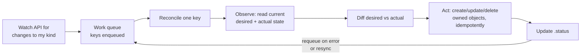
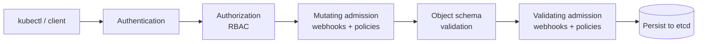
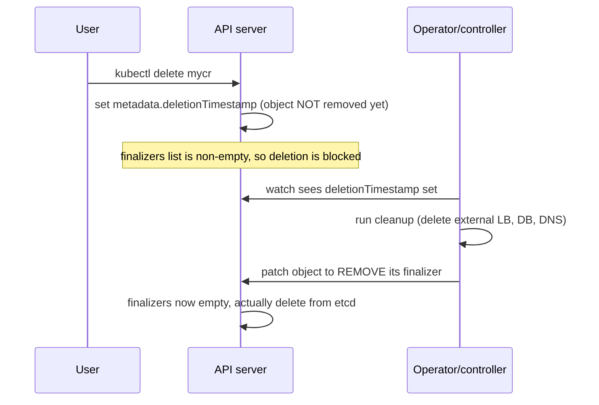

# Operators, CRDs & Extensibility

Kubernetes is not a fixed set of features — it is a **platform for building platforms**. Its
API server, controllers, and reconciliation model are designed to be extended so you can add
your own object *kinds* and your own operational *logic* without forking Kubernetes. This
topic covers the four main extension points that show up in interviews:

1. **Custom Resource Definitions (CRDs)** — add new object types (kinds) to the API.
2. **Custom controllers / the Operator pattern** — teach the reconciliation loop to manage
   an application, not just built-in resources.
3. **Admission control** (webhooks + CEL policies) — intercept and mutate/validate API
   requests before they are persisted.
4. **The API aggregation layer** — plug an entirely separate API server behind `kube-apiserver`.

This builds on the control-plane model from `architecture-control-plane` (the API server,
etcd, controller-manager, the watch/reconcile loop) and the object model from
`api-objects-kubectl`. It assumes container basics from the `docker` domain.

> [!KEY-TAKEAWAY]
> A **CRD is just data**: it adds a new kind to the API and gives you free CRUD, validation,
> and `kubectl` support — but nothing *acts* on it. An **Operator = CRD + a custom controller**
> that runs a reconciliation loop encoding human operational knowledge (install, upgrade,
> backup, failover) for a specific app. CRD without a controller is inert; a controller
> without a CRD is just a built-in-resource controller. The magic is the pairing.

---

## Why extend the Kubernetes API

The Kubernetes API is **declarative and uniform**: every object has `apiVersion`, `kind`,
`metadata`, `spec` (desired state) and usually `status` (observed state); every object
supports the same verbs (`get`, `list`, `watch`, `create`, `update`, `patch`, `delete`);
and a controller drives actual state toward `spec`. Extending the API means you get all of
that machinery — RBAC, audit logging, `kubectl`, label selectors, watches, admission —
**for free** on your own concepts (e.g. `kind: PostgresCluster`, `kind: CronTab`).

The four extension points, from least to most effort:

| Mechanism | Adds | Code required? | Extra process? |
|---|---|---|---|
| **CRD** | New object kind + schema + storage | No | No (served by kube-apiserver) |
| **Custom controller / Operator** | Behavior for a kind (usually a CRD) | Yes (a controller) | Yes (a controller Pod) |
| **Admission webhook / CEL policy** | Intercept/mutate/validate requests | Webhook: yes / CEL: no | Webhook: yes / CEL: no |
| **API aggregation layer** | A whole separate API server behind kube-apiserver | Yes (an apiserver) | Yes |

> [!INTERVIEW]
> "How would you add a new resource type that behaves like a native Kubernetes object?"
> The expected answer is a **CRD** — not an aggregated API server. Reach for aggregation
> only when you need custom storage (not etcd), protobuf, or complex behaviors a CRD's
> generic implementation can't express. For 95% of cases a CRD + controller is the answer.

---

## Custom Resource Definitions (CRDs)

A **CustomResourceDefinition** is itself a built-in Kubernetes object (`apiVersion:
apiextensions.k8s.io/v1`). Applying one **registers a new REST endpoint** and a new *kind*
that the API server will serve and persist in etcd. No recompilation, no restart.

```yaml
apiVersion: apiextensions.k8s.io/v1
kind: CustomResourceDefinition
metadata:
  name: crontabs.stable.example.com     # MUST be <plural>.<group>
spec:
  group: stable.example.com
  scope: Namespaced                       # or Cluster
  names:
    plural: crontabs
    singular: crontab
    kind: CronTab                         # the Kind used in manifests
    shortNames: [ct]
  versions:
    - name: v1
      served: true                        # is this version exposed over the API?
      storage: true                       # exactly ONE version is the storage version
      schema:
        openAPIV3Schema:
          type: object
          properties:
            spec:
              type: object
              properties:
                cronSpec: {type: string}
                image:    {type: string}
                replicas: {type: integer, minimum: 1, maximum: 10}
              required: [cronSpec, image]
```

After `kubectl apply -f crontab-crd.yaml` you can immediately do:

```bash
kubectl get crd crontabs.stable.example.com
kubectl apply -f my-crontab.yaml     # kind: CronTab
kubectl get crontabs                 # or 'kubectl get ct'
kubectl explain crontab.spec         # schema-driven, works because of openAPIV3Schema
```

Key rules interviewers probe:

- The **metadata name must be `<plural>.<group>`** exactly, or the CRD is rejected.
- **Exactly one** version has `storage: true` (the *storage version* — how it's written to
  etcd). Multiple versions can be `served: true`.
- `scope` is `Namespaced` or `Cluster` and is **immutable** after creation.
- Custom resources live in **etcd alongside built-ins** — a CRD does **not** give you a
  separate datastore.
- A CRD **by itself does nothing** beyond store/validate/serve the object. Behavior requires
  a controller (see below).

> [!WARNING]
> Don't use custom resources as a general-purpose database for app/end-user data (images,
> events, high-write-rate records). etcd is small and latency-sensitive; the API server and
> its watches will suffer. CRs are for **declarative config / desired-state** objects — a
> small number of relatively small, human-authored objects.

---

## CRD schema validation and structural schemas

Validation is defined with an **OpenAPI v3 schema** (`openAPIV3Schema`). The API server
rejects any custom resource that doesn't match — this is your first line of defense and runs
*before* any controller sees the object.

`apiextensions.k8s.io/v1` (the only served CRD version since v1.22) **requires a structural
schema**. A structural schema means, roughly:

- Every field has a `type` (or `x-kubernetes-preserve-unknown-fields: true` to allow
  arbitrary content), and types are specified for nested objects/arrays.
- No `type` may be set at the root of a logical-operator (`allOf`/`anyOf`/`oneOf`/`not`)
  branch in a conflicting way; the schema must be "complete and consistent."

Validation features you can use in the schema:

- Constraints: `minimum`, `maximum`, `minLength`, `pattern`, `enum`, `required`, `format`.
- **Defaulting**: `default: <value>` fills in missing fields on write (v1.17+ GA).
- **CEL validation rules** (`x-kubernetes-validations`, GA in v1.29): express cross-field
  invariants the OpenAPI keywords can't, e.g. `self.minReplicas <= self.maxReplicas`.

```yaml
        schema:
          openAPIV3Schema:
            type: object
            properties:
              spec:
                type: object
                x-kubernetes-validations:
                  - rule: "self.minReplicas <= self.maxReplicas"
                    message: "minReplicas cannot exceed maxReplicas"
                properties:
                  minReplicas: {type: integer}
                  maxReplicas: {type: integer}
```

By default the API server **prunes** fields not present in the schema (drops unknown fields
silently), which is why structural schemas matter — set
`x-kubernetes-preserve-unknown-fields: true` on a subtree if you intentionally store
free-form data there.

> [!TIP]
> `kubectl explain`, client-side/server-side apply merge behavior, and `kubectl` field
> validation all derive from the CRD's OpenAPI schema. A rich schema improves UX for free —
> another reason to invest in it rather than dumping everything under a preserve-unknown blob.

---

## CRD versions and conversion

Like built-in APIs, a CRD can serve **multiple versions** (`v1alpha1`, `v1beta1`, `v1`) of
the same kind. This lets you evolve the API without breaking existing clients. Rules:

- Each version has independent `served` and `storage` flags; **exactly one** is the storage
  version. Objects are always stored in etcd in the storage version's shape.
- When a client requests a version different from the stored one, the API server must
  **convert** between them. Two strategies:

| `conversion.strategy` | How it works | Use when |
|---|---|---|
| `None` (default) | No transformation — same object served under every version's apiVersion, unchanged | Versions are structurally identical (only the version string differs) |
| `Webhook` | API server calls a **conversion webhook** you run to translate between versions | Fields were renamed/restructured between versions |

Changing the storage version doesn't rewrite existing etcd objects; they're converted lazily
on read/write. To migrate all objects to a new storage version you re-write them (e.g. with
`kubectl get ... -o yaml | kubectl replace`, or the storage-version-migrator) and then drop
the old version from `spec.versions`. The `status.storedVersions` field tracks which
versions still exist in etcd — you can only remove a version once nothing is stored in it.

> [!INTERVIEW]
> Gotcha: "You bumped the CRD from v1beta1 to v1 and removed v1beta1 — why did the apply
> fail?" Because objects may still be *stored* as v1beta1 (`status.storedVersions`), and/or
> you removed the storage version without a conversion path. You must keep old versions
> served/convertible until everything is migrated to the new storage version.

---

## Subresources: status and scale

By default, a write to a custom resource replaces the whole object — so a controller
updating `.status` could clobber a user's `.spec` change (and vice versa). Enabling
**subresources** fixes this and unlocks native integrations:

```yaml
  versions:
    - name: v1
      served: true
      storage: true
      subresources:
        status: {}                       # enables /status subresource
        scale:                           # enables /scale subresource
          specReplicasPath: .spec.replicas
          statusReplicasPath: .status.replicas
          labelSelectorPath: .status.selector
      schema: { ... }
```

- **`status` subresource**: splits the object into two write paths. Updates to `/status`
  ignore changes to `spec`, and updates to the main resource ignore `status`. This enforces
  the **spec = user's desired state / status = controller's observed state** separation and
  prevents lost updates. It also means a controller can update status without incrementing
  the resource's spec generation.
- **`scale` subresource**: exposes `/scale`, which is what `kubectl scale` and — crucially —
  the **HorizontalPodAutoscaler** talk to. Wiring it up lets an HPA scale *your* custom
  resource by replica count, exactly as it scales a Deployment.

> [!KEY-TAKEAWAY]
> `metadata.generation` increments only when `spec` changes; controllers compare it against
> `status.observedGeneration` to know "have I reconciled the latest spec yet?" This pattern
> only works cleanly when the `status` subresource is enabled so status writes don't bump
> generation.

---

## The controller and the reconciliation loop

A **controller** is a non-terminating loop that watches objects and drives the world toward
their declared `spec`. This is the heart of Kubernetes and the thing an Operator extends.



Two properties define a correct controller:

- **Level-triggered, not edge-triggered.** The controller reconciles the *current observed
  state* of the world, not a stream of "an event happened" deltas. If it misses an event or
  restarts, the next reconcile still converges because it re-reads reality. (Watches +
  periodic resync exist precisely so nothing depends on catching every event.)
- **Idempotent.** Reconcile(key) may be called many times for the same object (retries,
  resyncs, duplicate events). Running it N times must produce the same end state as running
  it once — so it *checks then acts* ("does the Deployment exist? if not, create it") rather
  than blindly creating.

Reconcile returns quickly with one of: success (done), success-with-requeue-after (poll
again later), or error (backoff and retry). Controllers use a **rate-limited work queue** so
a hot-looping object backs off exponentially instead of hammering the API server.

> [!WARNING]
> A classic bug: an edge-triggered mindset ("on create, do X once"). If X fails or the
> controller restarts mid-way, X never completes. Always write reconcile to be
> **re-runnable**: read current state, compute the delta, converge. Never assume a handler
> runs exactly once.

---

## The Operator pattern

An **Operator** applies the controller pattern to a **specific application**, encoding the
knowledge a human operator would use to run it. Formally:

> **Operator = one or more CRDs (the app's desired-state API) + a custom controller that
> reconciles them by managing the app's real resources (Pods, Services, PVCs, secrets,
> external systems).**

The canonical example is a **database operator**. Instead of a human running failover
runbooks, you write `kind: PostgresCluster` with `spec.replicas: 3, spec.version: "16"`, and
the operator's controller:

- Creates the StatefulSet, headless Service, PVCs, and config.
- Initializes replication and elects a primary.
- On a primary failure, **promotes a replica** (automated failover) and updates endpoints.
- Runs scheduled **backups**, handles **version upgrades** with the right ordering, rotates
  credentials, and reports health in `.status`.

That day-2 operational logic — the stuff a Helm chart *can't* do because it's dynamic and
stateful — is the reason Operators exist. Well-known examples: Prometheus Operator,
cert-manager, Strimzi (Kafka), CloudNativePG / Zalando Postgres, etcd operator, ElasticSearch
(ECK).

> [!INTERVIEW]
> "Operator vs controller — is there a difference?" Mechanically an Operator *is* a
> controller. The distinction is intent: "controller" is the generic pattern (built-ins have
> them too); "Operator" specifically means a controller + CRDs that automate a **particular
> stateful application's** lifecycle and domain operations. Every Operator contains a
> controller; not every controller is an Operator.

---

## Building operators: controller-runtime, Kubebuilder, Operator SDK

You rarely write watch/queue/informer plumbing by hand. The standard Go toolchain:

- **`controller-runtime`** — the library. Provides the **Manager** (shared caches, clients,
  leader election), **informers/caches** (efficient watches), a **work queue**, and the
  `Reconciler` interface: you implement `Reconcile(ctx, req) (Result, error)`.
- **Kubebuilder** — the scaffolding/SDK built on controller-runtime. `kubebuilder init` +
  `kubebuilder create api` generates the CRD types (Go structs), CRD YAML (from
  `+kubebuilder:` markers), RBAC, and a reconciler skeleton.
- **Operator SDK** (Red Hat/Operator Framework) — wraps Kubebuilder for Go **and** also
  supports **Helm-based** and **Ansible-based** operators (no Go: reconcile = run a Helm
  release or Ansible playbook).

A minimal reconcile in controller-runtime:

```go
func (r *CronTabReconciler) Reconcile(ctx context.Context, req ctrl.Request) (ctrl.Result, error) {
    var ct stablev1.CronTab
    if err := r.Get(ctx, req.NamespacedName, &ct); err != nil {
        // NotFound => object was deleted; nothing to do (owned objects GC'd via ownerRefs)
        return ctrl.Result{}, client.IgnoreNotFound(err)
    }
    // ... build the desired Deployment from ct.Spec ...
    if err := r.Patch(ctx, desired, client.Apply, client.FieldOwner("crontab-operator")); err != nil {
        return ctrl.Result{}, err     // returning err requeues with backoff
    }
    ct.Status.ObservedGeneration = ct.Generation
    return ctrl.Result{}, r.Status().Update(ctx, &ct)
}
```

Interview-relevant details:

- **Informers/shared caches**, not raw polling: the framework `List/Get`s from an in-memory
  cache kept warm by a single watch per type — cheap reads, low API-server load.
- **Leader election**: run multiple operator replicas for HA, but only the **leader**
  actively reconciles (via a Lease). Prevents two controllers fighting over the same object.
- **Owner references + `SetControllerReference`**: mark the objects you create as owned by
  the CR so they're **garbage-collected** when the CR is deleted (see finalizers below).
- **Server-Side Apply** with a **field manager** is the modern way to reconcile owned
  objects without clobbering fields owned by others.

---

## Admission control: the request lifecycle

Before any object (built-in or custom) is persisted, an API request passes through a
pipeline. **Admission controllers** are the hooks that run *after* authentication and
authorization but *before* the object is written to etcd.



Order matters and is a favorite interview point:

1. **Mutating** admission runs **first** — it can *change* the object (inject a sidecar, add
   labels, set defaults).
2. Then **schema/OpenAPI validation** of the (now-mutated) object.
3. **Validating** admission runs **last** — it can only accept or reject, never mutate, so it
   sees the final object exactly as it will be stored.

This is why a mutating webhook can add a sidecar and a validating webhook can then enforce
"every Pod must have resource limits" on the final result.

---

## Mutating & validating admission webhooks

**Admission webhooks** are the extensible form of admission control: the API server sends the
admission request to **your HTTPS endpoint**, which returns an `AdmissionReview` allowing,
rejecting, or (for mutating) patching the object.

- **`MutatingWebhookConfiguration`** — endpoint may return a **JSONPatch** to modify the
  object. Uses: sidecar injection (Istio, Linkerd), defaulting, adding sidecar/annotations.
- **`ValidatingWebhookConfiguration`** — endpoint returns allow/deny only. Uses: policy
  enforcement (require labels, forbid `:latest`, enforce limits) — e.g. Kyverno, older OPA
  Gatekeeper.

```yaml
apiVersion: admissionregistration.k8s.io/v1
kind: ValidatingWebhookConfiguration
metadata: {name: require-limits.example.com}
webhooks:
  - name: require-limits.example.com
    rules:
      - apiGroups: [""]
        apiVersions: ["v1"]
        operations: ["CREATE", "UPDATE"]
        resources: ["pods"]
    clientConfig:
      service: {name: policy-webhook, namespace: policy, path: /validate}
      caBundle: <base64 CA>              # API server verifies the webhook's TLS cert
    admissionReviewVersions: ["v1"]
    sideEffects: None
    failurePolicy: Fail                  # Fail = reject if webhook is down; Ignore = allow
    timeoutSeconds: 5
```

Critical operational gotchas:

- **`failurePolicy`** is the big one. `Fail` (default) means if your webhook Pod is down,
  matching API requests are **rejected** — this can **brick the cluster** (you can't create
  Pods, including the webhook's own). Scope `rules`/`namespaceSelector` tightly and exclude
  `kube-system`. `Ignore` fails open (weaker enforcement, safer availability).
- Webhooks add **latency** to every matching request and must be **highly available**;
  respect `timeoutSeconds`.
- **Ordering among mutating webhooks is not guaranteed**, and one webhook may need to
  re-run after another mutates — the API server **re-invokes** if `reinvocationPolicy:
  IfNeeded`.
- Webhooks need **TLS**; the API server validates the server cert against `caBundle` (often
  managed by cert-manager).

> [!WARNING]
> A self-referential webhook is a classic outage: a validating webhook that intercepts Pod
> creation with `failurePolicy: Fail`, whose own Pod then crashes, cannot be recreated
> because *its own webhook rejects the new Pod*. Always exclude the webhook's namespace and
> system namespaces, and consider `failurePolicy: Ignore` for non-critical policy.

---

## CEL policies: ValidatingAdmissionPolicy & MutatingAdmissionPolicy

Running a webhook server for simple rules is heavy: a deployment, TLS, HA, latency, and an
availability risk. Kubernetes now offers **in-process admission policies** written in **CEL
(Common Expression Language)** — no webhook server, evaluated inside the API server.

- **`ValidatingAdmissionPolicy`** (+ `ValidatingAdmissionPolicyBinding`) — **GA in v1.30**,
  `admissionregistration.k8s.io/v1`. Declarative validation with CEL expressions.
- **`MutatingAdmissionPolicy`** — the mutating counterpart (GA in v1.36), mutates via CEL
  `ApplyConfiguration` (server-side-apply merge) or CEL-generated `JSONPatch`.

```yaml
apiVersion: admissionregistration.k8s.io/v1
kind: ValidatingAdmissionPolicy
metadata: {name: "max-replicas"}
spec:
  failurePolicy: Fail
  matchConstraints:
    resourceRules:
      - apiGroups: ["apps"]
        apiVersions: ["v1"]
        operations: ["CREATE", "UPDATE"]
        resources: ["deployments"]
  validations:
    - expression: "object.spec.replicas <= 5"
      message: "no more than 5 replicas allowed"
```

The **policy** defines the rule; a **binding** attaches it to a scope (namespaces via label
selector) and sets the action (`Deny`, `Warn`, `Audit`). This split lets one policy be reused
with different enforcement in different namespaces.

| | Admission webhook | CEL admission policy |
|---|---|---|
| Where it runs | Separate Pod/service (out of process) | In-process in the API server |
| Extra infra / TLS / HA | Yes | No |
| Latency & availability risk | Higher (network hop, can brick cluster) | Minimal |
| Expressiveness | Arbitrary code (any logic, external calls) | CEL only (no I/O, no external calls) |
| Best for | Complex logic, external data, sidecar injection | Simple structural/field rules |

> [!TIP]
> Interview framing: prefer **CEL ValidatingAdmissionPolicy** for straightforward "reject if
> field X violates rule Y" checks — it removes an entire failure domain. Reach for a
> **webhook** when you need logic CEL can't express (calling an external system, complex
> multi-object decisions, non-trivial mutation like sidecar injection).

---

## Finalizers and garbage collection

**Owner references** and **finalizers** are how Kubernetes handles cleanup — both are core to
operators.

- **Owner references (`metadata.ownerReferences`)** implement **cascading deletion**: when a
  parent is deleted, the garbage collector deletes children that reference it as owner. A
  Deployment owns ReplicaSets which own Pods; an operator sets ownerRefs on the objects it
  creates so they vanish with the CR — no cleanup code needed for owned in-cluster objects.

- **Finalizers (`metadata.finalizers`)** are the hook for cleanup the GC *can't* do —
  typically **external** resources (a cloud load balancer, an external DB, a DNS record).
  A finalizer is a string in the list; its presence **blocks actual deletion**.

The deletion flow with a finalizer:



Key points interviewers test:

- `kubectl delete` on an object with finalizers sets `deletionTimestamp` and the object
  enters **`Terminating`** — it is *not* gone until every finalizer is removed. The
  controller must notice the timestamp, do cleanup, then remove *its* finalizer.
- A **stuck `Terminating`** object almost always means a finalizer whose controller is gone
  or failing. Force-removing the finalizer (`kubectl patch ... -p
  '{"metadata":{"finalizers":[]}}' --type=merge`) unblocks deletion but **skips the cleanup**
  — you may leak the external resource. Diagnose why the controller isn't clearing it first.
- A common design: on reconcile, if `deletionTimestamp` is nil, ensure your finalizer is
  present; if it's set, run cleanup then remove the finalizer. This is the standard
  controller-runtime finalizer idiom.

---

## API aggregation layer

The **aggregation layer** lets you register a **whole separate API server** that
`kube-apiserver` proxies to, so your API lives under a group like `metrics.k8s.io` and is
indistinguishable from native APIs. You register an **`APIService`** object pointing at your
extension apiserver's Service.

```yaml
apiVersion: apiregistration.k8s.io/v1
kind: APIService
metadata: {name: v1beta1.metrics.k8s.io}
spec:
  group: metrics.k8s.io
  version: v1beta1
  service: {name: metrics-server, namespace: kube-system}
  groupPriorityMinimum: 100
  versionPriority: 100
```

CRD vs aggregation — the decision:

| | CRD | Aggregated API server |
|---|---|---|
| Effort | Declarative, no code | Build & run a full apiserver |
| Storage | etcd only (via kube-apiserver) | **Your choice** — custom backend, in-memory, external |
| Custom logic | Limited (schema + webhooks) | Arbitrary (custom verbs, protobuf, subresources) |
| Examples | Most operators (Prometheus, cert-manager) | **metrics-server** (`metrics.k8s.io`), service catalog |

The classic aggregation example is **metrics-server**: it serves `PodMetrics`/`NodeMetrics`
that are computed live and **not stored in etcd** — impossible with a CRD, which is exactly
why it uses aggregation. Use aggregation when you need non-etcd storage, computed/virtual
resources, custom subresources/verbs, or protobuf; otherwise a CRD wins on simplicity.

---

## When an operator is worth it (vs a Helm chart) & the maturity model

Not everything needs an operator. The decision hinges on **day-2 operations**:

- **Helm chart** = **templated packaging**. It renders manifests and installs/upgrades them.
  It's a *client-side* (or Tiller-less) tool: great for stateless apps and one-shot
  install/upgrade. It has **no running control loop** — it doesn't watch, doesn't self-heal,
  doesn't do failover or automated backups. Once installed, it's inert until you run `helm
  upgrade` again.
- **Operator** = **live control loop**. It continuously reconciles, self-heals, and automates
  complex, *dynamic* domain operations (failover, scaling with data movement, backup/restore,
  version-aware rolling upgrades of stateful clusters).

Rule of thumb: **stateless or simple app → Helm chart. Stateful app with real day-2
operational complexity → operator** (often *distributed as* a Helm chart that installs the
operator). Writing and maintaining an operator is a significant investment; don't build one
where a chart plus standard controllers (Deployment/StatefulSet/HPA) suffice.

The **Operator Capability / Maturity Model** (from the Operator Framework) describes five
levels of sophistication:

| Level | Name | Capability |
|---|---|---|
| 1 | **Basic Install** | Automated application provisioning and configuration |
| 2 | **Seamless Upgrades** | Patch and minor version upgrades supported |
| 3 | **Full Lifecycle** | App lifecycle, storage, backup & restore |
| 4 | **Deep Insights** | Metrics, alerts, log processing, workload analysis |
| 5 | **Auto Pilot** | Auto-scaling, auto-healing, auto-tuning, anomaly detection |

> [!INTERVIEW]
> "When would you NOT write an operator?" When the app is stateless, has no complex day-2
> operations, and standard primitives (Deployment + Service + HPA + a Helm chart) already
> express everything. Operators add a permanently-running controller, a CRD API surface, and
> maintenance burden — justify that with real operational automation (levels 3-5), not just
> "install it," which a chart does at level 1.

---

## Common follow-up questions

- "What exactly does applying a CRD do?" Registers a new API endpoint/kind that
  kube-apiserver serves and stores in etcd, with schema validation — but adds no behavior.
- "CRD vs custom controller vs operator?" CRD = the data/type; controller = the loop that
  acts on a kind; operator = CRD(s) + controller automating a specific stateful app.
- "Why must a reconciler be idempotent and level-triggered?" Because reconcile is called
  repeatedly (retries, resyncs, restarts) and may miss events; it must converge from whatever
  the current observed state is, every time.
- "Order of admission?" Mutating webhooks/policies → schema validation → validating
  webhooks/policies → persist. Validating runs last and can't mutate.
- "How do you avoid a webhook bricking the cluster?" Tight `rules`/`namespaceSelector`,
  exclude system namespaces, sane `timeoutSeconds`, and consider `failurePolicy: Ignore` for
  non-critical policy; make the webhook HA.
- "Webhook vs CEL ValidatingAdmissionPolicy?" CEL runs in-process (no server, no TLS, no
  availability risk) for simple field rules; webhooks for arbitrary/external logic and
  mutation like sidecar injection.
- "Object stuck in Terminating — why?" A finalizer whose controller is gone/failing;
  deletion is blocked until the finalizer is removed.
- "How does an operator clean up the Deployments/Services it created?" Owner references +
  garbage collection (cascading delete); external resources need finalizers.
- "CRD vs aggregation layer?" CRD for etcd-backed declarative objects (most cases);
  aggregation when you need custom storage/computed resources (e.g. metrics-server).
- "How does an HPA scale a custom resource?" Enable the `scale` subresource on the CRD
  so `/scale` exists; the HPA reads/writes replica count there.

## References

- Kubernetes docs — Extending Kubernetes / Custom Resources:
  https://kubernetes.io/docs/concepts/extend-kubernetes/api-extension/custom-resources/
- Kubernetes docs — Extend the API with CustomResourceDefinitions:
  https://kubernetes.io/docs/tasks/extend-kubernetes/custom-resources/custom-resource-definitions/
- Kubernetes docs — Versions in CustomResourceDefinitions (conversion):
  https://kubernetes.io/docs/tasks/extend-kubernetes/custom-resources/custom-resource-definition-versioning/
- Kubernetes docs — Operator pattern:
  https://kubernetes.io/docs/concepts/extend-kubernetes/operator/
- Kubernetes docs — Dynamic Admission Control (webhooks):
  https://kubernetes.io/docs/reference/access-authn-authz/extensible-admission-controllers/
- Kubernetes docs — Validating Admission Policy (CEL, GA v1.30):
  https://kubernetes.io/docs/reference/access-authn-authz/validating-admission-policy/
- Kubernetes docs — Mutating Admission Policy:
  https://kubernetes.io/docs/reference/access-authn-authz/mutating-admission-policy/
- Kubernetes docs — Aggregation layer:
  https://kubernetes.io/docs/concepts/extend-kubernetes/api-extension/apiserver-aggregation/
- Kubernetes docs — Finalizers & owner references / garbage collection:
  https://kubernetes.io/docs/concepts/overview/working-with-objects/finalizers/
- Kubebuilder Book: https://book.kubebuilder.io/ · controller-runtime:
  https://pkg.go.dev/sigs.k8s.io/controller-runtime
- Operator SDK & Capability Model: https://sdk.operatorframework.io/docs/overview/
