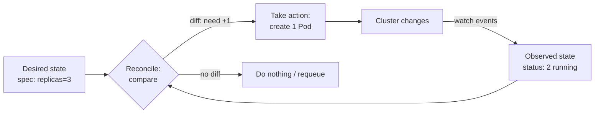
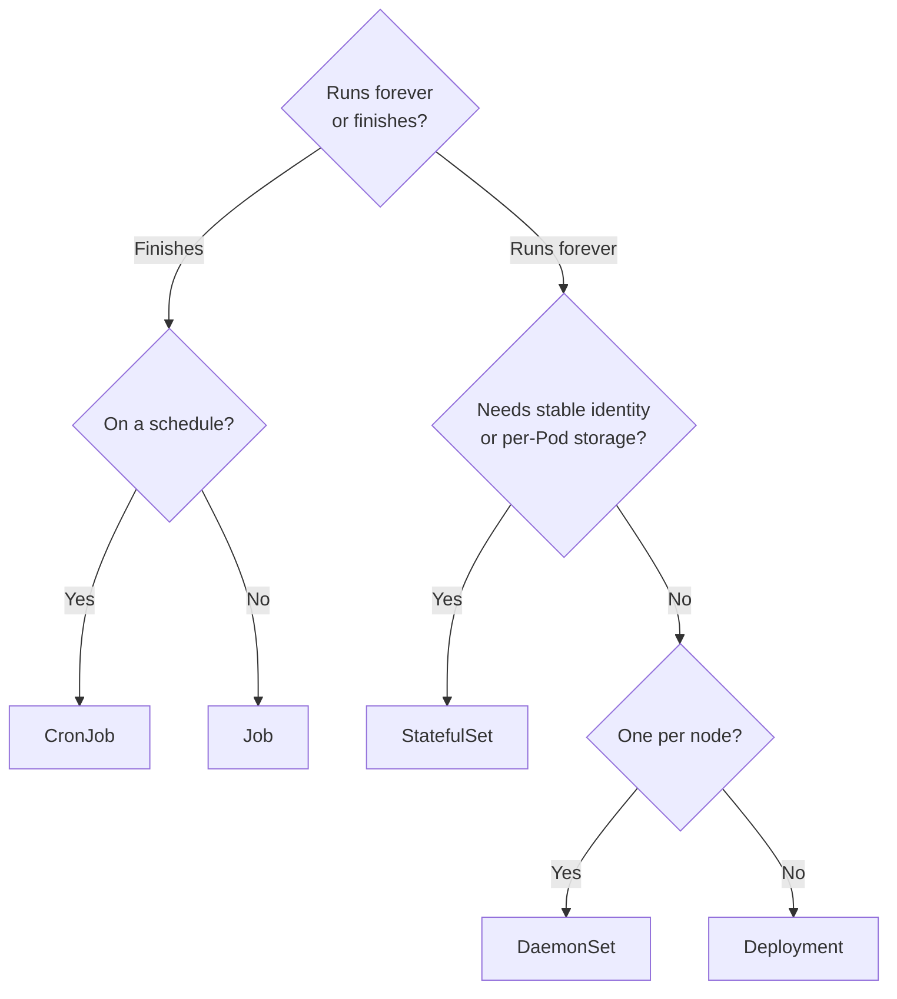
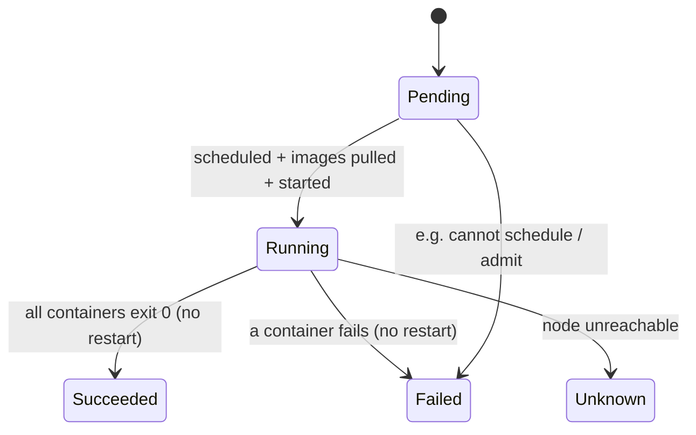
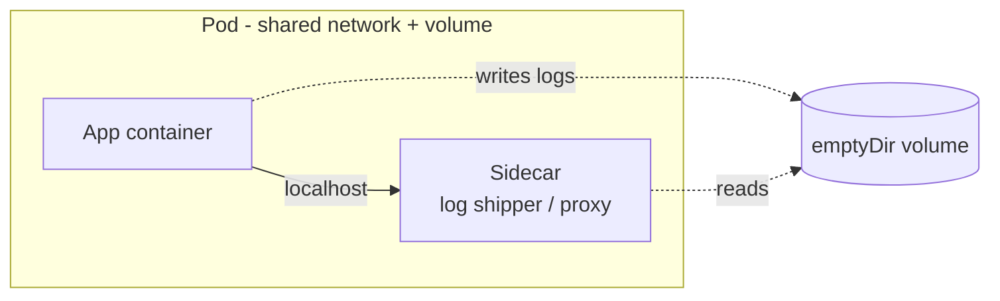

# Pods & Workload Controllers

This page covers the two most fundamental building blocks in Kubernetes: the **Pod** (the
smallest deployable unit) and the **workload controllers** that manage Pods for you —
ReplicaSet, Deployment, StatefulSet, DaemonSet, Job, and CronJob. It explains *why you almost
never create bare Pods*, how the reconciliation loop keeps desired state true, the multi-container
patterns (sidecar / ambassador / adapter), init vs (native) sidecar containers, Pod phases and
conditions, and `restartPolicy` semantics.

It is concept-first and hands-on, with real manifests and `kubectl`. It builds on the **docker**
domain — a Pod runs one or more *containers*, and container/image internals (Dockerfile, layers,
overlay2, containerd/runc, namespaces & cgroups) live there; Kubernetes consumes those images via
the **CRI** and we don't re-teach them here. Rolling-update mechanics and rollbacks get their own
topic (`deployments-rolling-updates`); probes and resource requests/limits live in
`probes-resources`; Services that front these Pods live in `services-networking`. This page is the
foundation the rest of the Kubernetes domain builds on.

> [!KEY-TAKEAWAY]
> Four ideas unlock this whole topic. **(1) A Pod is a wrapper around one or more containers that
> share a network namespace (one IP, shared `localhost`/ports) and can share volumes** — it is the
> atomic unit of scheduling. **(2) Pods are cattle, not pets: ephemeral and disposable** — you
> don't repair a Pod, the controller replaces it. **(3) You rarely create bare Pods; you declare a
> *controller* (Deployment/StatefulSet/DaemonSet/Job) and a controller's reconciliation loop drives
> actual state toward your declared desired state.** **(4) Pick the controller by workload shape:**
> stateless → Deployment, stateful-with-identity → StatefulSet, one-per-node agent → DaemonSet,
> run-to-completion → Job, scheduled → CronJob.

---

## What is a Pod

A **Pod** is the smallest deployable object in the Kubernetes API — you cannot schedule a lone
container, only a Pod. A Pod is a **co-located, co-scheduled group of one or more containers** that
together form a single unit of deployment. All containers in a Pod:

- **Share a network namespace** — one Pod IP, one port space; containers reach each other over
  `localhost`. (They must not bind the same port.)
- **Can share storage** — volumes declared on the Pod are mountable by any container in it.
- **Are always co-located and co-scheduled** on the *same node*, and share the same lifecycle
  fate for scheduling purposes.

Under the hood a Pod is implemented with a hidden **"pause" (infrastructure) container** that holds
the shared network (and IPC) namespace open; the app containers join that namespace. This is why the
Pod IP survives an individual app-container restart but not a Pod reschedule.

```yaml
apiVersion: v1
kind: Pod
metadata:
  name: web
  labels:
    app: web
spec:
  containers:
  - name: app
    image: nginx:1.27
    ports:
    - containerPort: 80
```

```bash
kubectl run web --image=nginx:1.27          # imperative: creates a bare Pod
kubectl get pod web -o wide                  # see node + Pod IP
kubectl describe pod web                     # events, container states, conditions
```

> [!INTERVIEW]
> "Why is the Pod the unit and not the container?" Because tightly-coupled helper processes
> (a log shipper, a proxy) often need the *same* network and disk as the main app and must live and
> die with it. The Pod gives them a shared namespace and lifecycle without forcing you to cram
> everything into one container image. The common answer they want: **one Pod = usually one main app
> container plus optional tightly-coupled helpers (sidecars).**

The mental model: a Pod is "a logical host" for a small set of cooperating containers — like
processes that would have run on the same machine sharing loopback and a scratch disk.

---

## Why you rarely create bare Pods

A Pod you create directly (a "naked" or "bare" Pod) has **no self-healing**. If its node dies, is
drained, or the Pod is evicted, **nothing recreates it** — it's just gone. Bare Pods also can't be
scaled, rolling-updated, or rescheduled onto another node automatically.

That's why in production you almost always declare a **controller** and let *it* own the Pods:

| You want… | Use |
|---|---|
| N identical stateless replicas, rolling updates | **Deployment** (which manages a ReplicaSet) |
| Stable identity + stable per-Pod storage + ordering | **StatefulSet** |
| Exactly one Pod on every (matching) node | **DaemonSet** |
| Run a batch task to completion | **Job** |
| Run a Job on a schedule | **CronJob** |

Bare Pods are still useful for **debugging** (`kubectl run -it --rm debug --image=busybox -- sh`),
one-shot manual tasks, and **static Pods** (managed by the kubelet directly from a manifest on disk
— that's how control-plane components like the API server run on a kubeadm cluster). But for
application workloads, "don't deploy naked Pods" is a canonical best practice.

> [!WARNING]
> A bare Pod scheduled to a node that later fails will **not** be rescheduled. `kubectl delete pod`
> on a controller-owned Pod, by contrast, triggers the controller to make a replacement almost
> immediately — proof that the controller, not the Pod, is the durable object.

---

## The reconciliation loop (controllers)

Every workload controller runs a **control loop** (a "reconciler") inside the
`kube-controller-manager`. The loop continuously **observes actual state, compares it to declared
desired state, and acts to close the gap** — the essence of Kubernetes' *declarative* model. You
never tell Kubernetes "start 3 Pods"; you declare "I want 3 replicas" and the loop makes and keeps
it true.



Key properties:

- **Level-triggered, not edge-triggered.** The loop reacts to the *current level* of state, not to
  a one-time event. If it misses an event it still converges on the next pass — this makes it
  robust and self-healing. Delete a Pod and the Deployment notices the count is low and recreates.
- **Ownership via `ownerReferences`.** A ReplicaSet stamps each Pod it creates with an owner
  reference; the garbage collector uses it for cascading deletes, and the controller uses label
  selectors + ownership to know which Pods are "its own."
- **`spec` (desired, set by you) vs `status` (observed, set by the controller).** This split is the
  backbone of every Kubernetes object.

```bash
kubectl scale deployment web --replicas=5    # you change desired state...
kubectl get pods -w                          # ...and watch the loop converge
```

**Traced convergence (a Deployment starting at 3 replicas):**

| Step | Event | Desired | Observed | Diff | Action |
|---|---|---|---|---|---|
| 1 | steady state | 3 | 3 | 0 | none (requeue) |
| 2 | `kubectl scale --replicas=5` | **5** | 3 | +2 | create 2 Pods |
| 3 | 2 new Pods reach Running | 5 | 5 | 0 | none |
| 4 | you `kubectl delete pod web-xxxx` | 5 | 4 | +1 | create 1 Pod |
| 5 | replacement Running | 5 | 5 | 0 | none |

Notice steps 4–5: nothing "told" the reconciler a Pod was deleted as a special event — on its next
pass it simply *observed* the level (4 Pods) fell below desired (5) and acted. That is
**level-triggered** convergence. An edge-triggered system that only reacted to the delete *event*
would silently stay at 4 if it ever missed that event; the level-triggered loop self-heals on the
very next pass regardless.

> [!INTERVIEW]
> A favorite question: "You `kubectl delete pod` a Deployment-managed Pod — what happens?" Answer:
> the ReplicaSet's reconciler sees replicas below desired and creates a replacement within seconds.
> The corollary: to *actually* remove the Pod you edit the controller (scale down or delete the
> Deployment), not the Pod.

---

## ReplicaSet

A **ReplicaSet** maintains a stable set of **N identical Pod replicas** running at any time. It
watches Pods matching its `selector` and creates or deletes Pods to match `.spec.replicas`.

```yaml
apiVersion: apps/v1
kind: ReplicaSet
metadata:
  name: web-rs
spec:
  replicas: 3
  selector:
    matchLabels:
      app: web
  template:
    metadata:
      labels:
        app: web           # MUST match the selector
    spec:
      containers:
      - name: app
        image: nginx:1.27
```

Important details:

- The **`selector` must match the Pod template labels**, or the API rejects it.
- A ReplicaSet will **adopt** any existing bare Pod whose labels match its selector (and count it
  toward the replica total) — a subtle gotcha if your labels overlap.
- **You almost never create a ReplicaSet directly.** You create a **Deployment**, which creates and
  manages ReplicaSets for you and adds rolling updates + rollback (the ReplicaSet alone has no
  update strategy — changing its template does *not* replace running Pods). ReplicaSet is the
  successor to the older `ReplicationController`.

---

## Deployment

A **Deployment** is the standard controller for **stateless** applications. It manages ReplicaSets
to provide **declarative updates**: you change the Pod template and the Deployment orchestrates a
controlled rollout, and can roll back.

```yaml
apiVersion: apps/v1
kind: Deployment
metadata:
  name: web
spec:
  replicas: 3
  selector:
    matchLabels:
      app: web
  template:
    metadata:
      labels:
        app: web
    spec:
      containers:
      - name: app
        image: nginx:1.27
```

How it works: a Deployment owns one **ReplicaSet per template revision**. On an update it creates a
*new* ReplicaSet and gradually scales it up while scaling the old one down (default strategy
`RollingUpdate`), keeping old ReplicaSets around (see `revisionHistoryLimit`) so you can roll back.

```bash
kubectl set image deployment/web app=nginx:1.28   # trigger a rollout
kubectl rollout status deployment/web             # watch it
kubectl rollout undo deployment/web               # roll back to previous ReplicaSet
kubectl get rs -l app=web                          # see old + new ReplicaSets
```

The mechanics of rolling updates (`maxSurge`/`maxUnavailable`), `Recreate` strategy, pause/resume,
and rollback history are the subject of the dedicated `deployments-rolling-updates` topic. Here the
key point is the **hierarchy: Deployment → ReplicaSet → Pods**, and that Deployment is for
**stateless** workloads where any replica is interchangeable.

> [!INTERVIEW]
> "Deployment vs StatefulSet vs ReplicaSet?" ReplicaSet = raw N replicas, no update strategy (you
> won't use it directly). Deployment = ReplicaSets + rolling updates/rollback, for **stateless**
> apps where Pods are fungible. StatefulSet = stable identity + storage + ordering, for **stateful**
> apps. Naming those three cleanly is table stakes.

---

## StatefulSet

A **StatefulSet** manages stateful applications that need **stable identity and stable storage**.
Unlike a Deployment's interchangeable replicas, StatefulSet Pods are **not fungible** — each has a
persistent identity it keeps across rescheduling.

It provides three guarantees:

1. **Stable network identity / hostname** — Pods are named `<statefulset>-<ordinal>` (`web-0`,
   `web-1`, …) and keep that name even after reschedule.
2. **Stable ordinal index** — a unique integer 0..N-1 per Pod (with a label
   `apps.kubernetes.io/pod-index`).
3. **Stable, per-Pod persistent storage** — each Pod gets its **own** PersistentVolumeClaim from
   `volumeClaimTemplates`, and that PVC follows the ordinal (`web-0` always remounts *its* volume).

```yaml
apiVersion: apps/v1
kind: StatefulSet
metadata:
  name: web
spec:
  serviceName: nginx            # references a headless Service (clusterIP: None)
  replicas: 3
  selector:
    matchLabels: { app: nginx }
  template:
    metadata:
      labels: { app: nginx }
    spec:
      containers:
      - name: nginx
        image: nginx:1.27
        volumeMounts:
        - name: www
          mountPath: /usr/share/nginx/html
  volumeClaimTemplates:
  - metadata:
      name: www
    spec:
      accessModes: [ "ReadWriteOnce" ]
      resources:
        requests: { storage: 1Gi }
```

Behavioral details interviewers probe:

- **A headless Service (`clusterIP: None`) is required** and you must create it yourself; it gives
  each Pod a stable DNS record: `web-0.nginx.<namespace>.svc.cluster.local`.
- **Ordered operations (default `podManagementPolicy: OrderedReady`):** Pods are created one at a
  time in order (0,1,2…), each must be Running & Ready before the next; scale-down and rolling
  updates go in **reverse** ordinal order. `podManagementPolicy: Parallel` launches/terminates them
  all at once (identity/storage still stable), useful when startup order doesn't matter.
- **PVCs are NOT deleted on scale-down or StatefulSet delete** by default — data safety wins over
  auto-cleanup. (Tunable via `persistentVolumeClaimRetentionPolicy`.)
- Use for databases, message brokers, quorum systems (Kafka, ZooKeeper, etcd, Postgres, Cassandra)
  — anything where "which replica am I" and "my disk" matter.

**Traced ordered operations (`OrderedReady`, a StatefulSet named `web`):**

- **Scale 0 → 3 (create up, ascending):** create `web-0`; **wait until `web-0` is Running & Ready**;
  only then create `web-1`; wait until Ready; only then create `web-2`. If `web-1` never becomes
  Ready (say its DB volume fails to mount), the StatefulSet **stalls** — `web-2` is never created.
  Contrast a Deployment, which would fire all 3 Pods at once.
- **Scale 3 → 1 (scale down, descending):** delete `web-2` first, then `web-1`; **`web-0` is kept**.
  The PVCs `www-web-2` and `www-web-1` are **not** deleted (default) — scaling back up to 3 later
  re-mounts the *same* disks to the *same* ordinals.
- **Rolling update (revs, descending):** update `web-2` (wait Ready) → `web-1` (wait Ready) →
  `web-0`, one at a time.

Why descending? In a leader/quorum system the lowest ordinal (`web-0`) is conventionally the seed /
initial leader; bringing members up 0→1→2 lets each later member join an already-healthy quorum, and
tearing down 2→1→0 removes followers before the seed — predictable, quorum-safe order.

> [!WARNING]
> A StatefulSet **does not create the headless Service for you**, and it does not delete PVCs when
> you scale down. Two classic surprises: Pods stuck without DNS because the Service is missing, and
> "orphaned" PVCs (and cloud disks, costing money) left behind after deleting a StatefulSet.

---

## DaemonSet

A **DaemonSet** ensures that **one copy of a Pod runs on every node** (or every node matching a
`nodeSelector`/affinity/tolerations). As nodes join the cluster the DaemonSet controller adds the
Pod to them; as nodes leave, those Pods are garbage-collected.

Canonical uses are **per-node infrastructure agents**: log collectors (Fluent Bit, Fluentd), node
metrics exporters (node-exporter), the CNI network plugin, storage daemons, and security agents.

```yaml
apiVersion: apps/v1
kind: DaemonSet
metadata:
  name: node-exporter
spec:
  selector:
    matchLabels: { app: node-exporter }
  template:
    metadata:
      labels: { app: node-exporter }
    spec:
      tolerations:
      - operator: Exists          # so it also lands on tainted/control-plane nodes
      containers:
      - name: node-exporter
        image: prom/node-exporter:v1.8.2
```

Details:

- You **don't set `replicas`** — the replica count is "number of matching nodes," managed by the
  controller.
- To run on control-plane or otherwise-tainted nodes you add **tolerations** (agents often tolerate
  everything).
- DaemonSets support their own rolling-update strategy (`RollingUpdate` with `maxUnavailable`, or
  `OnDelete`).

> [!INTERVIEW]
> "How do you run a metrics/log agent on every node, including new ones?" A DaemonSet — it
> auto-schedules one Pod per node and follows the node set as it changes. Answering "a Deployment
> with replicas = node count" is wrong: that doesn't guarantee one-per-node and won't track nodes
> joining/leaving.

---

## Job

A **Job** runs a Pod (or Pods) **to completion** — for batch/one-shot work like a migration, a
backup, or a computation — rather than keeping a service running forever. The Job tracks successful
completions and is done when it reaches the desired count; failed Pods are retried per policy.

```yaml
apiVersion: batch/v1
kind: Job
metadata:
  name: pi
spec:
  completions: 1          # desired # of successful Pods
  parallelism: 1          # how many run at once
  backoffLimit: 4         # retries before the Job is marked Failed
  template:
    spec:
      restartPolicy: Never   # MUST be Never or OnFailure (never Always)
      containers:
      - name: pi
        image: perl:5.34.0
        command: ["perl", "-Mbignum=bpi", "-wle", "print bpi(2000)"]
```

Key fields:

- **`completions`** — how many successful Pod runs mark the Job complete (default 1).
- **`parallelism`** — how many Pods run concurrently.
- **`backoffLimit`** — retries (with exponential back-off) before the Job is marked Failed
  (default 6).
- **`activeDeadlineSeconds`** — hard wall-clock cap; on expiry all Pods are killed and the Job
  fails, **taking precedence over `backoffLimit`**.
- **`ttlSecondsAfterFinished`** — auto-delete the finished Job (and its Pods) N seconds after it
  completes/fails, so finished Jobs don't pile up.
- **`completionMode`** — `NonIndexed` (default; interchangeable completions) vs **`Indexed`** (each
  Pod gets a fixed index 0..completions-1 via `JOB_COMPLETION_INDEX`, for static work partitioning).
- **`restartPolicy` must be `Never` or `OnFailure`** — `Always` is invalid for a Job (that's for
  long-running controllers). With `Never` a failed Pod is replaced by a *new* Pod; with `OnFailure`
  the container restarts in place.

```bash
kubectl create job pi --image=perl:5.34.0 -- perl -Mbignum=bpi -wle 'print bpi(20)'
kubectl get job pi                            # COMPLETIONS 1/1 when done
kubectl logs job/pi
```

**Traced parallelism (`completions: 6, parallelism: 2, backoffLimit: 4`):**

The Job needs **6 successes** and runs **at most 2 Pods at a time**. Watch `COMPLETIONS` climb:

```
t0:  P1, P2 running                     COMPLETIONS 0/6, active 2
t1:  P1 succeeds  -> start P3           COMPLETIONS 1/6, active 2  (P2, P3)
t2:  P2 succeeds  -> start P4           COMPLETIONS 2/6, active 2  (P3, P4)
t3:  P3, P4 succeed -> start P5, P6     COMPLETIONS 4/6, active 2  (P5, P6)
t4:  P5, P6 succeed                     COMPLETIONS 6/6  -> Job Complete
```

The invariant: keep `min(parallelism, remaining) = min(2, needed)` Pods running until 6 successes
land. Now the failure path — say 4 Pods *fail* instead of succeed. Each failure increments a
retry counter; the Job keeps launching replacements until the accumulated failure count hits
`backoffLimit: 4`, at which point the whole Job is marked **Failed** and no more Pods are started,
even if some completions were still outstanding. (Replacements are launched with exponential
back-off — ~10s, 20s, 40s, … — so retries slow down rather than hammer instantly.)

**Indexed mode (`completionMode: Indexed`, same `completions: 6, parallelism: 2`):** the 6 required
successes are the fixed indices **0,1,2,3,4,5**, and each Pod is pinned to one via the
`JOB_COMPLETION_INDEX` env var. With parallelism 2 the scheduler works through them two at a time,
e.g. run indices `{0,1}` first, then `{2,3}`, then `{4,5}` — a Pod for index 3 that fails is retried
*as index 3* (not reassigned), so a partitioned worker (shard 3 of 6) always reprocesses its own
slice. The Job completes only when **every** index 0–5 has one success.

---

## CronJob

A **CronJob** creates **Jobs on a repeating schedule**, like a Kubernetes-native crontab — for
periodic backups, report generation, cleanup, etc. It owns Jobs (which own Pods).

```yaml
apiVersion: batch/v1
kind: CronJob
metadata:
  name: nightly-backup
spec:
  schedule: "0 2 * * *"          # 02:00 every day (5-field cron)
  concurrencyPolicy: Forbid       # Allow (default) | Forbid | Replace
  startingDeadlineSeconds: 300    # miss window before a run counts as missed
  successfulJobsHistoryLimit: 3   # default 3
  failedJobsHistoryLimit: 1       # default 1
  jobTemplate:
    spec:
      template:
        spec:
          restartPolicy: OnFailure
          containers:
          - name: backup
            image: my/backup:1.0
```

Interview-relevant fields:

- **`schedule`** — standard 5-field cron (`minute hour day-of-month month day-of-week`); times are
  in the controller's timezone unless `spec.timeZone` is set.
- **`concurrencyPolicy`** — `Allow` (overlapping runs OK, default), **`Forbid`** (skip a new run if
  the previous is still going), **`Replace`** (kill the running one and start fresh). This is the
  field to reach for when "two backups ran at once and corrupted state."
- **`startingDeadlineSeconds`** — if the controller was down and a scheduled time was missed, this
  bounds how late a run may still start; missed runs beyond it are skipped.
- **History limits** keep only the last N successful / failed Jobs.

> [!INTERVIEW]
> "Two overlapping CronJob runs stepped on each other — how do you prevent it?" Set
> `concurrencyPolicy: Forbid` (or `Replace`). And know that a CronJob → creates Jobs → which create
> Pods; the Job (not the CronJob) carries `backoffLimit`/`restartPolicy`.

---

## Choosing the right controller

A single decision table interviewers love to see reasoned aloud:

| Workload shape | Controller | Why |
|---|---|---|
| Stateless web/API, any replica interchangeable | **Deployment** | Rolling updates + rollback via ReplicaSets |
| Stable identity, per-Pod storage, ordered start | **StatefulSet** | `<name>-<ordinal>`, own PVC, ordered ops |
| One agent per node (logs/metrics/CNI) | **DaemonSet** | Auto one-per-node, tracks node set |
| Batch task that finishes | **Job** | Runs to completion, retries, parallelism |
| Scheduled/periodic task | **CronJob** | Creates Jobs on a cron schedule |
| Raw N replicas, no updates (rare/direct) | **ReplicaSet** | Usually wrapped by a Deployment |



---

## Pod phases and conditions

The Pod's **`status.phase`** is a coarse, top-level summary — one of exactly five values:

| Phase | Meaning |
|---|---|
| **Pending** | Accepted by the cluster but not all containers running yet — includes time waiting to be scheduled and time pulling images. |
| **Running** | Bound to a node, all containers created, at least one running/starting/restarting. |
| **Succeeded** | All containers terminated successfully and won't be restarted. |
| **Failed** | All containers terminated and at least one failed (non-zero exit / system-killed), no restart. |
| **Unknown** | Pod state couldn't be obtained (usually a node-communication problem). |

Don't confuse `phase` with the `STATUS` column in `kubectl get pods` — strings like
`CrashLoopBackOff`, `ImagePullBackOff`, `ContainerCreating`, `Terminating`, `Completed` are
display-level reasons, **not** phases.

Finer-grained **PodConditions** (`status`: True/False/Unknown) track progress:

- **PodScheduled** — assigned to a node.
- **PodReadyToStartContainers** — Pod sandbox created and networking configured.
- **Initialized** — all init containers completed successfully.
- **ContainersReady** — all containers are ready.
- **Ready** — Pod can serve traffic and should be added to matching Services' endpoints (this is the
  one Services/Endpoints use to route). Custom conditions via **readiness gates**
  (`spec.readinessGates`) also feed into `Ready`.

Each container also has a **state**: **Waiting** (e.g., pulling image / applying secrets, with a
`Reason`), **Running** (with a start time), or **Terminated** (with exit code, reason, timestamps).



```bash
kubectl get pod web -o jsonpath='{.status.phase}'          # e.g. Running
kubectl get pod web -o jsonpath='{.status.conditions}'     # PodScheduled/Ready/...
```

> [!INTERVIEW]
> "A Pod shows `Ready 0/1` but `Running` — is something wrong?" Not necessarily broken: the phase is
> Running but the **readiness probe** hasn't passed, so the `Ready` condition is False and the Pod
> is kept out of Service endpoints. Distinguishing *phase* (Running) from the *Ready condition* is
> the insight. (Probe details: `probes-resources`.)

---

## restartPolicy

`spec.restartPolicy` controls whether the **kubelet restarts a container** (within the same Pod, on
the same node) after it exits. It applies to the Pod's app containers (and, per-container, to
sidecars). Three values:

| Value | Behavior |
|---|---|
| **Always** (default) | Restart the container after any termination (success or failure). |
| **OnFailure** | Restart only if it exits non-zero. |
| **Never** | Never restart automatically. |

Which controllers allow which:

- **Deployment / ReplicaSet / StatefulSet / DaemonSet** → template **must** use `Always` (they run
  services that should stay up).
- **Job / CronJob** → must use `Never` or `OnFailure` (a task that finishes shouldn't be restarted
  as if it were a service).

Two things to keep straight:

- **restartPolicy is a *container*-level, in-place restart by the kubelet** — different from a
  *controller* replacing a whole Pod. A `Deployment` Pod that keeps crashing restarts in place with
  exponential back-off, surfacing as **`CrashLoopBackOff`** (back-off caps around 5 minutes). The
  Deployment doesn't make a new Pod for a crash; the kubelet restarts the container.
- restartPolicy has **no effect on rescheduling to another node** — that's the controller's job.

> [!INTERVIEW]
> "Why is my Job Pod stuck restarting forever?" It probably has `restartPolicy: Always` — which is
> **invalid for a Job** (the API rejects it). Correct is `Never`/`OnFailure`, with `backoffLimit`
> bounding retries. Contrast with a Deployment Pod's `CrashLoopBackOff`, which *is* the kubelet
> honoring `Always`.

---

## Pod termination (graceful shutdown)

restartPolicy is the *restart* story; termination is the *stop* story, and it's a common senior
follow-up whenever Pods go away — rolling updates, StatefulSet scale-down, node drains. When a Pod is
deleted it doesn't vanish instantly; the kubelet runs an ordered, time-bounded shutdown:

1. Pod is marked **Terminating** and removed from Service endpoints (so no new traffic arrives).
2. If a container has a **`preStop` hook**, it runs first (e.g. tell a load balancer to drain, flush
   a buffer, `sleep` a few seconds to let in-flight requests finish).
3. The kubelet sends **`SIGTERM`** to each container's main process.
4. The **`terminationGracePeriodSeconds`** countdown runs (**default 30s**). The app should catch
   SIGTERM and exit cleanly within it.
5. If the process is still alive when the grace period expires, the kubelet sends **`SIGKILL`** (the
   hard, uncatchable kill).

**Traced (a Pod with a 5s `preStop` sleep and default 30s grace):** at t=0 the Pod goes Terminating
and leaves endpoints; the preStop sleep runs t=0→5s; at t=5s SIGTERM is sent and the app begins
draining; if it exits at, say, t=12s the Pod is removed cleanly; if it were still running at t=30s
it would be SIGKILLed. Note the grace period is a *ceiling*, not a fixed wait — a clean early exit
ends it immediately. (Native sidecars are terminated **after** the app containers, in reverse order,
so the app can still log/proxy through its sidecar while shutting down.)

---

## Multi-container Pod patterns

Because containers in a Pod share network and volumes, several **co-located helper** patterns are
idiomatic. The main app container is joined by one or more helpers:

- **Sidecar** — a long-running helper that augments the main container: a log shipper tailing a
  shared volume, a metrics exporter, a service-mesh proxy (Envoy), a config/secret reloader, a
  cache warmer. Runs for the life of the Pod alongside the app.
- **Ambassador** — a proxy sidecar that **represents the outside world to the app on `localhost`**.
  The app talks to `localhost:6379` and the ambassador handles sharding/discovery/TLS to the real
  remote service. Simplifies the app's networking.
- **Adapter** — transforms the app's output/interface into a **standardized external format**. E.g.,
  an adapter that scrapes the app's bespoke stats and exposes them in Prometheus format, so the
  outside world sees a uniform interface.

**Concrete wiring for the two less-obvious patterns:**

- **Ambassador (outbound proxy on localhost).** The app is compiled to talk to a plain
  `localhost:6379` Redis. In the Pod you add an ambassador container (e.g. `twemproxy` or `envoy`)
  that *listens* on `127.0.0.1:6379` and *forwards* to a 3-shard Redis cluster
  (`redis-0:6379`, `redis-1:6379`, `redis-2:6379`), hashing each key to a shard. App code never
  changes; sharding/failover/TLS all live in the sidecar. **App sees `localhost`; the world sees a
  sharded cluster.**
- **Adapter (normalize the outbound-facing interface).** The app writes bespoke stats to a shared
  file `/var/run/stats.json` (`{"reqs":1200,"errs":3}`). The adapter container reads that file and
  *re-exposes* it as Prometheus text on `:9090`:
  `app_requests_total 1200` / `app_errors_total 3`. Prometheus scrapes `:9090` and sees a standard
  format. **App emits its own quirky output; the world sees a uniform interface** — the adapter
  points *outward* (fixes what others consume), whereas the ambassador points *inward* (fixes what
  the app consumes).



```yaml
apiVersion: v1
kind: Pod
metadata: { name: web-with-logger }
spec:
  volumes:
  - name: logs
    emptyDir: {}
  containers:
  - name: app
    image: my/app:1.0
    volumeMounts:
    - { name: logs, mountPath: /var/log/app }
  - name: log-shipper                 # sidecar
    image: fluent/fluent-bit:3.1
    volumeMounts:
    - { name: logs, mountPath: /var/log/app }
```

> [!TIP]
> Rule of thumb: put a helper **in the same Pod** only if it must share the app's network/disk and
> lifecycle (a proxy, a log tailer). If it's an independent service, it belongs in its **own** Pod
> behind its own Service. Over-stuffing Pods couples scaling and failure domains you'd rather keep
> separate.

---

## Init containers vs sidecar containers

**Init containers** run **before** the app containers, **sequentially**, and **each must complete
successfully** before the next starts and before any app container starts. Use them for setup that
must finish first: waiting on a dependency, running a schema migration, fetching config, setting
file permissions. They can have their own images/tools not present in the app image.

```yaml
spec:
  initContainers:
  - name: wait-for-db
    image: busybox:1.36
    command: ['sh','-c','until nc -z db 5432; do sleep 2; done']
  containers:
  - name: app
    image: my/app:1.0
```

The problem init containers *don't* solve: a helper that must run **alongside** the app for its
whole life (a proxy, a log shipper). Historically you'd add such a helper as a regular container in
`containers[]`, but that has two pains: **no ordering guarantee** relative to the app, and — for a
**Job** — a never-ending sidecar would keep the Pod (and Job) from ever completing.

**Native sidecar containers** (feature gate `SidecarContainers`: beta & on-by-default since
**v1.29**, **stable in v1.33**) fix this. You declare the helper in **`initContainers`** but give it
**`restartPolicy: Always`**:

```yaml
spec:
  initContainers:
  - name: logshipper
    image: alpine:latest
    restartPolicy: Always        # <-- makes this a native sidecar
    command: ['sh','-c','tail -F /opt/logs.txt']
  containers:
  - name: app
    image: my/app:1.0
```

What that buys you, versus a regular init container and versus a plain sidecar:

| Aspect | Regular init container | Native sidecar (`initContainers` + `restartPolicy: Always`) | Plain sidecar (extra `containers[]`) |
|---|---|---|---|
| Lifetime | Runs then exits before app | Starts before app, **runs the whole Pod life** | Runs whole Pod life |
| Startup ordering | Sequential, blocks next until *done* | Starts, and once **`started`** the next init/app proceeds (doesn't wait for it to *finish*) | No ordering guarantee vs app |
| Probes | Not supported | **Supports** startup/readiness/liveness probes | Supported |
| Shutdown | N/A | Terminated **after** app containers, in reverse order | Terminated together with app (no ordering) |
| Blocks a Job from completing? | No | **No** (Job completes when the main container finishes) | **Yes** (a never-ending sidecar hangs the Job) |

> [!KEY-TAKEAWAY]
> **Init container = runs to completion, before the app, one at a time.** **Native sidecar = declared
> as an init container with `restartPolicy: Always`, starts before the app and keeps running,
> shuts down after the app, supports probes, and doesn't block Jobs from completing.** That last
> point (Jobs) is exactly why native sidecars were introduced.

---

## Common follow-up questions

- "What do all containers in a Pod share, and what don't they?" Share: network namespace (one
  IP, `localhost`, port space), IPC, and any declared volumes; always co-scheduled on one node.
  Don't share by default: filesystem root (each has its own image), PID namespace (unless
  `shareProcessNamespace: true`).
- "Deployment vs StatefulSet — one line each?" Deployment = interchangeable stateless replicas
  with rolling updates. StatefulSet = stable ordinal identity + stable per-Pod PVC + ordered
  operations, for stateful apps.
- "How is a DaemonSet's replica count set?" It isn't — it's the number of matching nodes; the
  controller adds/removes Pods as nodes join/leave.
- "Why did my `kubectl delete pod` not remove the app?" It's controller-owned; the ReplicaSet
  recreated it. Edit/scale/delete the controller instead.
- "A CronJob's runs overlap and corrupt data — fix?" `concurrencyPolicy: Forbid` (or `Replace`).
- "Pod is `Running` but `0/1 Ready` — why?" Readiness probe not passing; the `Ready` condition
  is False so it's excluded from Service endpoints.
- "Job Pod restarts forever / API rejects the Job — why?" `restartPolicy: Always` is invalid for
  a Job; use `Never`/`OnFailure` with a `backoffLimit`.
- "When would you ever run a bare Pod?" Debugging, one-shot manual tasks, and static Pods
  (kubelet-managed control-plane components) — not application workloads.
- "How do you run a helper that must live alongside the app but also let a Job finish?" A native
  sidecar (init container with `restartPolicy: Always`), v1.29+ (stable 1.33).

## References

- Kubernetes docs — Pods: https://kubernetes.io/docs/concepts/workloads/pods/
- Kubernetes docs — Pod Lifecycle (phases, conditions, restartPolicy, container states):
  https://kubernetes.io/docs/concepts/workloads/pods/pod-lifecycle/
- Kubernetes docs — Init Containers:
  https://kubernetes.io/docs/concepts/workloads/pods/init-containers/
- Kubernetes docs — Sidecar Containers (native):
  https://kubernetes.io/docs/concepts/workloads/pods/sidecar-containers/
- Kubernetes docs — ReplicaSet:
  https://kubernetes.io/docs/concepts/workloads/controllers/replicaset/
- Kubernetes docs — Deployment:
  https://kubernetes.io/docs/concepts/workloads/controllers/deployment/
- Kubernetes docs — StatefulSet:
  https://kubernetes.io/docs/concepts/workloads/controllers/statefulset/
- Kubernetes docs — DaemonSet:
  https://kubernetes.io/docs/concepts/workloads/controllers/daemonset/
- Kubernetes docs — Job:
  https://kubernetes.io/docs/concepts/workloads/controllers/job/
- Kubernetes docs — CronJob:
  https://kubernetes.io/docs/concepts/workloads/controllers/cron-jobs/
- Kubernetes docs — Objects & controllers / reconciliation:
  https://kubernetes.io/docs/concepts/architecture/controller/
