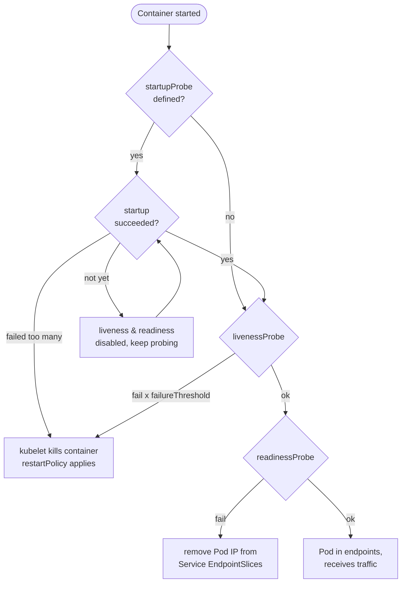
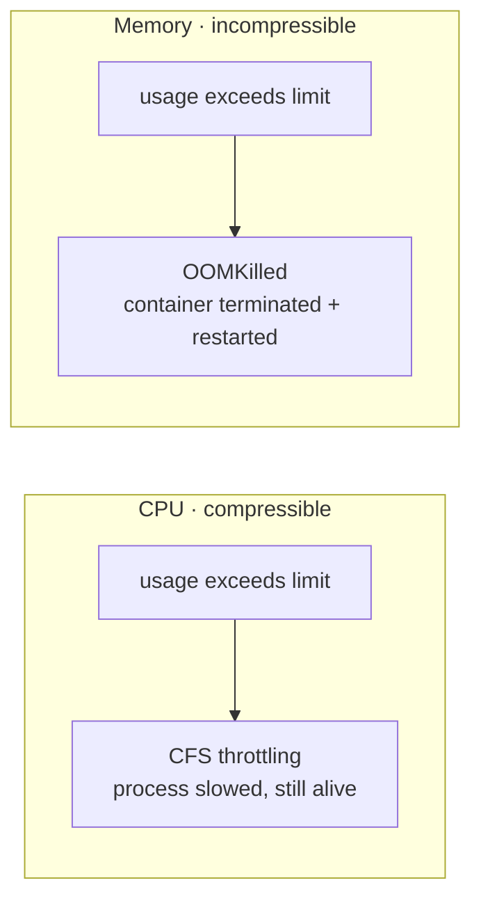
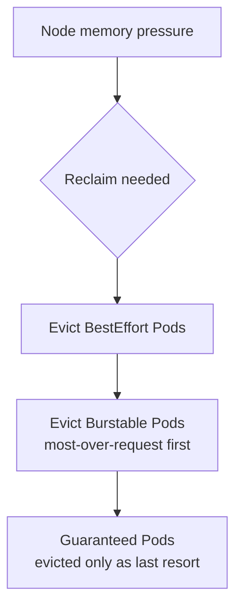
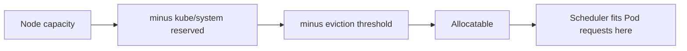

# Health Probes & Resource Management

Kubernetes keeps applications healthy and packs them efficiently onto nodes using two
independent-but-related machineries. **Health probes** let the kubelet decide, per container,
whether to *restart* it (liveness), whether to *send it traffic* (readiness), and whether it has
*finished booting* (startup). **Resource management** — requests, limits, QoS classes, and the
`LimitRange`/`ResourceQuota` policy objects — governs where a Pod is *scheduled*, how much CPU/memory
it is *guaranteed* and *capped* at, and which Pods get *killed or evicted* first when a node runs hot.

This topic assumes container basics from the **docker** domain (a Pod's containers are OCI containers
run via the CRI — see docker for images/cgroups internals). Autoscaling that consumes these
requests (HPA/VPA/Cluster Autoscaler) lives in `autoscaling-hpa-vpa`; diagnosing
`OOMKilled`/`CrashLoopBackOff`/`Pending` lives in `troubleshooting-observability`. Here we focus on the
mechanics: what each probe does, and how requests vs limits shape scheduling, throttling, and eviction.

> [!KEY-TAKEAWAY]
> **Liveness restarts, readiness re-routes, startup gates.** A failing *liveness* probe kills and
> restarts the container; a failing *readiness* probe only pulls the Pod out of Service endpoints
> (no restart); a *startup* probe holds the other two off until a slow app has booted. On resources:
> **requests** drive *scheduling* and QoS guarantees; **limits** are the enforced *cap* — CPU is
> compressible (throttled when over), memory is incompressible (over the limit → **OOMKilled**).

---

## Why health probes exist

Kubernetes is a **self-healing, declarative** system: you declare desired state (N healthy replicas
serving traffic) and controllers continuously reconcile reality toward it. But "the container process
is running" is a weak proxy for "the application is healthy." A Java service can be deadlocked, a
connection pool exhausted, or a cache still warming — the PID is alive, yet the app is useless or
actively harmful if it receives traffic.

Health probes give the **kubelet** (the node agent) and the **Service/EndpointSlice** machinery a way
to ask the application itself. Without probes, Kubernetes only knows whether the container's main
process exited. With probes, it can:

- **Restart** a wedged-but-running container (liveness).
- **Withhold traffic** from a Pod that is up but not ready (readiness).
- **Wait** for a slow starter before applying the above (startup).



> [!INTERVIEW]
> A classic opener: "Your Pod shows `1/1 Running` but users get 503s — why?" Answer: `Running`
> means the *container* is up, not that the *app* is *ready*. If there's no readiness probe, the Pod
> is added to Service endpoints the instant the container starts, before the app can serve. A
> readiness probe fixes this by gating endpoint membership on application-level health.

---

## Liveness probe

A **liveness probe** answers "is this container still working, or should I restart it?" If the probe
fails `failureThreshold` consecutive times, the **kubelet kills the container**, and the container is
then subject to the Pod's `restartPolicy` (`Always` by default for Deployments). This is the
self-healing lever for **deadlocks, hangs, and unrecoverable internal states** that don't crash the
process on their own.

```yaml
livenessProbe:
  httpGet:
    path: /healthz
    port: 8080
  initialDelaySeconds: 15
  periodSeconds: 20
  timeoutSeconds: 1
  failureThreshold: 3
```

Key semantics:

- Liveness only restarts the **single failing container**, not the whole Pod (other containers keep
  running). The Pod object is not recreated; the container is restarted in place, incrementing
  `RESTARTS` in `kubectl get pod`.
- Repeated liveness kills produce **`CrashLoopBackOff`**: the kubelet applies an exponential back-off
  between restart attempts. The delay **starts at 10s and doubles each time** — `10s → 20s → 40s →
  80s → 160s → 300s` — then **caps at 300s (5 min)** and stays there. Worked trace: a container that
  keeps failing waits 10s before restart #1, 20s before #2, 40s before #3, and so on, so it takes
  roughly `10+20+40+80+160 ≈ 5m` of cumulative waiting to reach the cap. Crucially, the back-off
  **resets to 10s once the container runs healthy for ~10 minutes** — so a Pod that briefly succeeds
  then fails again does *not* resume at the 5-min cap; it starts the ladder over from 10s.
- `successThreshold` **must be 1** for a liveness probe (a single success is enough to consider it
  passing again).

> [!WARNING]
> A liveness endpoint that checks **downstream dependencies** (database, cache, other services) is a
> footgun. If the DB blips, *every* replica's liveness fails simultaneously → every container
> restarts → a cascading, self-inflicted outage. Liveness should test only the **local** process's
> internal health ("am I deadlocked?"). Dependency health belongs in the **readiness** probe.

---

## Readiness probe

A **readiness probe** answers "should this Pod receive traffic right now?" On failure the kubelet
does **not** restart the container — instead the endpoints/EndpointSlice controller **removes the
Pod's IP** from all matching Service EndpointSlices, so the Service and any load balancer stop routing
to it. When the probe passes again, the Pod is added back.

This is the right tool for **transient, recoverable** unreadiness:

- App still warming up (cache load, JIT warm-up, connection-pool priming).
- A dependency the Pod *needs to serve requests* is temporarily down — shed traffic without a restart.
- Graceful shedding during shutdown or overload.

```yaml
readinessProbe:
  httpGet:
    path: /ready
    port: 8080
  periodSeconds: 5
  failureThreshold: 3
  successThreshold: 1
```

Notes:

- Before the first successful readiness check (and before `initialDelaySeconds` elapses), the default
  state is **Failure**, so the Pod stays out of endpoints until it proves ready.
- Unlike liveness, `successThreshold` may be **> 1** for readiness (require N consecutive successes
  before re-adding to endpoints — useful to avoid flapping).
- Readiness is also how **rolling updates** stay safe: a Deployment won't consider a new Pod
  "available" (and won't proceed to scale down old Pods, subject to `maxUnavailable`) until its
  readiness probe passes. No readiness probe → the rollout treats Pods as available the moment they
  run, which can route traffic to not-yet-ready Pods.

> [!INTERVIEW]
> **The shutdown race (zero-downtime follow-up).** On `kubectl delete`/rollout, the kubelet sends
> `SIGTERM` **at the same time** the endpoints controller removes the Pod's IP from EndpointSlices —
> these run in **parallel**, not in sequence. So a load balancer can still send a request to a Pod
> that has already begun terminating → dropped connections. The standard fix is a `preStop` hook that
> `sleep`s a few seconds: the container keeps serving in-flight/just-arrived traffic while the
> endpoint removal propagates, *then* the app shuts down. Note probes stop mattering here — during
> termination it's the endpoint removal (plus preStop), not a readiness flip, that drains traffic.

---

## Startup probe

A **startup probe** protects **slow-starting** containers. While it is running, the liveness and
readiness probes are **disabled**. Once the startup probe succeeds *once*, it stops running and the
other two take over. If the startup probe fails `failureThreshold` times, the kubelet kills the
container (subject to `restartPolicy`) — same as liveness.

The problem it solves: a legacy app might take 90 seconds to boot. If you set a liveness
`initialDelaySeconds` of 90s to cover boot, you also delay detection of *runtime* hangs by 90s. The
startup probe decouples the two: give a generous **startup budget**, then a **tight** liveness period.

```yaml
startupProbe:
  httpGet:
    path: /healthz
    port: 8080
  failureThreshold: 30
  periodSeconds: 10        # 30 x 10s = up to 300s to start
livenessProbe:
  httpGet:
    path: /healthz
    port: 8080
  periodSeconds: 10        # tight once started
  failureThreshold: 3
```

The maximum time allowed to start is `failureThreshold × periodSeconds`. Like liveness, a startup
probe's `successThreshold` must be **1**.

> [!TIP]
> Prefer a startup probe over a large `initialDelaySeconds`. It lets you keep liveness/readiness
> responsive after boot while still tolerating a long, variable cold start.

---

## Liveness vs readiness — the classic mistake

Conflating these two is the single most common probe bug, and a favorite interview trap.

| | Liveness | Readiness |
|---|---|---|
| Question answered | "Restart me?" | "Send me traffic?" |
| Action on failure | **Kill + restart** container | **Remove from Service endpoints** |
| Restarts container? | Yes | No |
| Use for dependencies? | **No** (cascading restart risk) | Yes (shed traffic, recover) |
| Effect on rolling update | — | Gates Pod "available" / rollout progress |
| `successThreshold` | must be 1 | may be > 1 |

Failure modes:

- **Dependency check in liveness** → DB blip restarts every replica → outage amplification and
  `CrashLoopBackOff` storms.
- **Same endpoint for liveness and readiness** → when the app sheds traffic (readiness fails), the
  liveness probe fails too and the container is needlessly restarted, losing warm state.
- **No readiness probe** → Pod gets traffic before it can serve → 503s during startup and every
  rollout.
- **Liveness `initialDelaySeconds` too short** → slow app is killed before it finishes booting →
  permanent `CrashLoopBackOff` (fix with a startup probe).

> [!INTERVIEW]
> "Liveness restarts, readiness reroutes." If you remember one sentence about probes, make it that.
> Then add: use *separate* endpoints, keep liveness *local-only*, put dependency checks in readiness,
> and use a startup probe for slow boots.

---

## Probe mechanisms: httpGet, tcpSocket, exec, grpc

Every probe (liveness/readiness/startup) uses exactly one of four mechanisms:

| Mechanism | How success is judged | Typical use |
|---|---|---|
| `httpGet` | HTTP GET on port/path returns status **≥ 200 and < 400** | Web/API servers with a health endpoint (most common) |
| `tcpSocket` | TCP connection to the port can be **opened** | Non-HTTP services (databases, brokers) — "is the port accepting?" |
| `exec` | A command run **inside** the container exits **0** | Custom checks, CLI health tools, file-based readiness |
| `grpc` | gRPC Health Checking Protocol returns **`SERVING`** | gRPC services (GA since **v1.27**) |

```yaml
# tcpSocket
readinessProbe:
  tcpSocket:
    port: 5432
# exec
livenessProbe:
  exec:
    command: ["cat", "/tmp/healthy"]
# grpc (port required, service optional)
livenessProbe:
  grpc:
    port: 2379
```

Gotchas:

- `httpGet` probes are issued **by the kubelet from the node**, not through the Service — so they hit
  the Pod IP directly and bypass Service/Ingress. Custom headers can be set via `httpHeaders`;
  `scheme: HTTPS` skips certificate verification.
- `exec` probes **fork a process every period** inside the container. On busy nodes with many Pods,
  frequent heavy exec probes add measurable CPU overhead — prefer `httpGet`/`grpc` where possible.
- `tcpSocket` only proves the port is open, not that the app logic works — weaker than an HTTP/gRPC
  health check.
- gRPC probes require the app to implement the standard gRPC health service; `port` is mandatory.

---

## Probe timing parameters

Five fields tune every probe. Getting them wrong causes premature kills or slow failure detection.

| Field | Default | Min | Meaning |
|---|---|---|---|
| `initialDelaySeconds` | 0 | 0 | Wait this long after container start before the **first** probe |
| `periodSeconds` | 10 | 1 | Interval between probes |
| `timeoutSeconds` | 1 | 1 | A single probe times out (counts as a failure) after this |
| `successThreshold` | 1 | 1 | Consecutive successes to be considered healthy again (must be 1 for liveness/startup) |
| `failureThreshold` | 3 | 1 | Consecutive failures before acting (kill for liveness/startup, drop from endpoints for readiness) |

Worked timing example — how long until a hung container is restarted with the defaults and
`initialDelaySeconds: 15`, `periodSeconds: 20`, `failureThreshold: 3`?

- First probe at ~15s, then every 20s. Three consecutive failures → kill.
- Worst case ≈ `initialDelaySeconds + failureThreshold × periodSeconds` = 15 + 3×20 = **75s** after
  start (and detection of a *later* hang ≈ `failureThreshold × periodSeconds` = 60s).

> [!WARNING]
> The default `timeoutSeconds: 1` is aggressive. A GC pause, cold JIT, or momentary load spike can
> make a healthy app miss a 1-second probe; three misses restart it. For JVM/heavy apps, raise
> `timeoutSeconds` and/or `failureThreshold`, and use a **startup probe** so slow boots don't count
> as liveness failures.

**Probe-level `terminationGracePeriodSeconds`:** a probe can override the Pod's grace period for the
termination it triggers. Example: a long Pod-level grace period for normal shutdown, but a short
override on the liveness probe so a *wedged* container is killed quickly instead of waiting the full
grace period.

---

## Requests vs limits

Two numbers per resource, per container, with very different jobs:

- **`requests`** = the amount the container is **guaranteed** and the number the **scheduler** uses to
  place the Pod. The scheduler sums container requests and only places the Pod on a node whose
  *allocatable* minus already-requested capacity can fit it. Requests are also the baseline for QoS
  and for what a Pod may use before it becomes an eviction candidate.
- **`limits`** = the **hard cap** the container may consume, enforced at runtime via cgroups. Exceeding
  it has resource-specific consequences (throttle for CPU, kill for memory).

```yaml
resources:
  requests:
    cpu: "250m"       # 0.25 core guaranteed; used for scheduling
    memory: "256Mi"
  limits:
    cpu: "500m"       # throttled above 0.5 core
    memory: "512Mi"   # OOMKilled if exceeded
```

Key facts:

- Scheduling looks **only at requests**, never limits or actual usage. A node can be "full" on
  requests while its actual CPU/memory usage is near-idle.
- If you set a **limit but no request**, Kubernetes defaults the **request to equal the limit**.
- **CPU is specified in cores / millicores** (`1` = 1 core, `500m` = half a core). **Memory** is in
  bytes with binary suffixes (`Mi`=2²⁰, `Gi`=2³⁰) or decimal (`M`, `G`).
- Omitting requests entirely means the scheduler assumes ~0 and will happily overpack the node,
  risking runtime contention and eviction.

---

## CPU vs memory: compressible vs incompressible

The single most important resource distinction:

- **CPU is a compressible resource.** When a container hits its CPU **limit**, the kernel **throttles**
  it (CFS bandwidth control) — the process is slowed down but keeps running. No crash. Symptom:
  latency spikes and high `container_cpu_cfs_throttled_periods`.
- **Memory is an incompressible resource.** You can't "slow down" memory usage. When a container tries
  to exceed its memory **limit**, the kernel's OOM killer terminates it → the container status shows
  **`OOMKilled`** and it is restarted per `restartPolicy` (repeated → `CrashLoopBackOff`).



**Worked example — what `cpu: 500m` actually does to a busy thread.** CPU limits are enforced by the
Linux CFS **bandwidth controller**, which works in fixed windows called the **CFS period** (default
**100ms**). Your limit becomes a **quota per period**: `quota = limit × period`.

- `limit: 500m` = 0.5 core → quota = `0.5 × 100ms` = **50ms of CPU time per 100ms window**.
- A single thread that wants to run flat-out gets to run for 50ms, then the kernel **throttles** it
  (parks it) for the remaining 50ms of the window — so it makes progress at **half wall-clock speed**.

Now trace a request that needs **200ms of actual CPU compute** (e.g. a heavy handler):

| CFS window | runs | throttled | compute done (cumulative) |
|---|---|---|---|
| 0–100ms   | 0–50ms   | 50–100ms  | 50ms |
| 100–200ms | 100–150ms | 150–200ms | 100ms |
| 200–300ms | 200–250ms | 250–300ms | 150ms |
| 300–400ms | 300–350ms | —         | **200ms → done at 350ms** |

So a job that would take 200ms unthrottled finishes at **~350ms** wall time — the extra ~150ms is
pure throttling latency, with **no crash** and no error, which is exactly why CPU throttling is such
a sneaky cause of p99 latency. (The clean "half-speed → 2× = 400ms" heuristic is close; the real
number is a touch better because CFS hands you the full 50ms quota at the *start* of each window.)
Watch `container_cpu_cfs_throttled_periods` / `_throttled_seconds_total` to catch this.

Consequences for tuning:

- A too-low **memory limit** causes intermittent `OOMKilled` under load spikes — often mistaken for a
  memory leak. A too-low **CPU limit** causes mysterious latency with no crash (throttling).
- Leaving **CPU limits off** is a common, defensible pattern: it lets Pods burst into idle node CPU
  and avoids throttling healthy apps; you still set CPU **requests** for scheduling fairness. Memory
  limits, by contrast, are usually worth setting to contain leaks — but set them with headroom.

> [!WARNING]
> `OOMKilled` from a *limit* is per-container and reported as exit code 137 (128+SIGKILL). This is
> distinct from a **node-level OOM / eviction** under node memory pressure, which is driven by QoS and
> can terminate whole Pods (see eviction below).

---

## QoS classes

At Pod creation, Kubernetes assigns a **Quality of Service class** derived purely from requests/limits.
It drives **eviction priority** under node pressure and is **immutable** for the Pod's life.

| Class | Condition | Eviction order |
|---|---|---|
| **Guaranteed** | *Every* container has CPU **and** memory requests **and** limits set, with **request == limit** for both | Evicted **last** |
| **Burstable** | Not Guaranteed, but at least one container has **some** CPU/memory request or limit | Evicted **middle** |
| **BestEffort** | **No** container sets any CPU/memory request or limit | Evicted **first** |

```yaml
# Guaranteed: requests == limits for every resource
resources:
  requests: { cpu: "500m", memory: "256Mi" }
  limits:   { cpu: "500m", memory: "256Mi" }
```

**Worked example — trace the class on a 2-container Pod.** The Guaranteed bar is strict: it needs
`request == limit` for **both** CPU **and** memory on **every** container. Miss it anywhere and the
whole Pod drops a tier. Take:

```yaml
containers:
- name: api        # A
  resources:
    requests: { cpu: "500m", memory: "256Mi" }
    limits:   { cpu: "500m", memory: "256Mi" }
- name: sidecar    # B
  resources:
    requests: { cpu: "100m", memory: "64Mi" }
    limits:   { cpu: "200m" }          # note: NO memory limit
```

Step through the rules:
1. Container **A**: cpu req==limit (500m==500m) ✓, mem req==limit (256Mi==256Mi) ✓ → A alone would be Guaranteed.
2. Container **B**: cpu req(100m) ≠ limit(200m) ✗, and memory has a request but **no limit** ✗.
3. Guaranteed requires *every* container to pass → B fails → the Pod is **not Guaranteed**.
4. Is any request/limit set at all? Yes (both containers set something) → **not BestEffort**.
5. Therefore the whole Pod is **Burstable**.

The lesson students trip on: A being perfectly Guaranteed-shaped doesn't matter — one loose sidecar
(a missing memory limit, or cpu limit > request) pulls the **entire Pod** down to Burstable. To make
it Guaranteed, B must set `memory` limit == request and `cpu` limit == request too.

Details:

- Only CPU and memory count toward QoS. Requesting other resources doesn't change the class.
- **Guaranteed** Pods are eligible for exclusive CPUs under the kubelet's `static` CPU manager policy.
- QoS is **immutable**: an in-place Pod resize that would change the class is rejected by admission.
- **QoS is not scheduling priority.** Preemption (choosing Pods to evict to fit a higher-priority
  pending Pod) is driven by `PriorityClass`, *not* QoS. QoS governs **node-pressure eviction**.

---

## Eviction under node pressure

When a node runs low on an incompressible resource (memory, disk), the **kubelet** proactively
**evicts** Pods to reclaim it and protect node stability. Eviction order:

1. **BestEffort** Pods (and Pods using **more than their requests**) go first.
2. **Burstable** Pods that exceed their requests next — ranked by how far over-request they are.
3. **Guaranteed** Pods last (they sit at request == limit, so they don't exceed requests).



Nuances:

- Only Pods **exceeding their requests** are prime candidates; a Burstable Pod living within its
  request is treated more like Guaranteed for pressure-eviction ranking.
- **Why over-request ranks worst (the intuition):** the kubelet scores candidates by roughly
  **usage minus request** — how much you're consuming *beyond what you promised*. A Pod that
  requested 128Mi but is using 1Gi (over by ~900Mi) is a worse offender than one that requested 1Gi
  and uses 1.1Gi (over by ~100Mi), so the first is evicted first even though both exceed their
  request. This is precisely why **honest requests are your best defense**: promise what you actually
  need and your `usage − request` stays small, keeping you near the bottom of the kill list.
- Node-pressure eviction terminates the **whole Pod** (all containers); the controller (e.g.
  Deployment) may reschedule a replacement elsewhere. This differs from a **limit** `OOMKilled`, which
  restarts just the offending container in place.
- The kubelet also sets the Linux **`oom_score_adj`** so that under a *node* kernel OOM event,
  BestEffort/over-request containers are more likely to be killed first — the same priority logic at
  the kernel level.
- Well-set **requests** are your best defense: a Pod that stays within its request is a poor eviction
  target.

---

## LimitRange

A **`LimitRange`** is a namespace-scoped policy that constrains and defaults per-**container** (or
per-Pod/PVC) resource values. It is enforced at admission time. It solves two problems: Pods with **no
requests/limits** (which land as BestEffort and overpack nodes) and Pods asking for absurd amounts.

```yaml
apiVersion: v1
kind: LimitRange
metadata:
  name: mem-cpu-limits
  namespace: team-a
spec:
  limits:
  - type: Container
    default:            # applied as limit if none set
      cpu: "500m"
      memory: "256Mi"
    defaultRequest:     # applied as request if none set
      cpu: "250m"
      memory: "128Mi"
    max: { cpu: "2", memory: "2Gi" }   # reject requests/limits above this
    min: { cpu: "50m", memory: "32Mi" }
```

What it does:

- **`defaultRequest` / `default`** inject requests/limits into containers that omit them — so a Pod
  can't accidentally be BestEffort in this namespace.
- **`min` / `max`** reject Pods whose values fall outside the allowed band (admission failure).
- `maxLimitRequestRatio` caps the limit-to-request ratio (bounds overcommit per container).

---

## ResourceQuota

A **`ResourceQuota`** is a namespace-scoped **aggregate** cap: the *total* requests/limits and/or
*object counts* across all Pods in a namespace. It's the multi-tenancy budget tool — `LimitRange`
governs individual containers, `ResourceQuota` governs the namespace sum.

```yaml
apiVersion: v1
kind: ResourceQuota
metadata:
  name: team-a-quota
  namespace: team-a
spec:
  hard:
    requests.cpu: "10"
    requests.memory: "20Gi"
    limits.cpu: "20"
    limits.memory: "40Gi"
    pods: "50"
    count/deployments.apps: "20"
```

Critical gotcha:

> [!WARNING]
> If a `ResourceQuota` sets `requests.*` or `limits.*` for a resource, then **every** Pod created in
> that namespace **must specify** that request/limit — otherwise the Pod is **rejected**. The usual
> fix is to pair the quota with a **`LimitRange`** that supplies defaults, so unannotated Pods still
> get admitted with sensible values.

`ResourceQuota` can also limit object counts (`pods`, `services`, `configmaps`, `count/<resource>`)
and scope by PriorityClass. When quota is exceeded, new objects are rejected with a `403`.

---

## Overcommit and node allocatable

Because scheduling uses **requests** while limits can be much higher, a cluster is normally
**overcommitted**: the sum of container *limits* can exceed node capacity, betting that not all Pods
peak at once. This raises utilization but is why QoS/eviction exist — to arbitrate when the bet fails.

- **Allocatable vs capacity:** the scheduler bins against a node's **allocatable** resources, which is
  `capacity` minus reservations for the **kubelet/system** (`--kube-reserved`, `--system-reserved`)
  and an **eviction threshold** (`--eviction-hard`). So you can't request 100% of a node's raw RAM.
- **Requests are a promise, limits are a ceiling.** Overcommitting *limits* is generally fine (and
  desirable) for CPU (compressible → throttle). Overcommitting *memory limits* is riskier: if many
  Pods peak, the node OOMs and eviction kicks in.
- A Pod stays **`Pending`** with `FailedScheduling` when no node has enough **allocatable** capacity to
  fit its **requests** — a very common interview scenario (fix: lower requests, scale the cluster, or
  free capacity). Note it's *requests*, not usage, that cause `Pending`.



**Worked example — "why is my Pod `Pending`?" with real numbers.** Take a node with raw **capacity
4 cores / 16Gi**. The kubelet carves off reservations before the scheduler ever sees it:

| Deduction | CPU | Memory |
|---|---|---|
| Raw capacity | 4000m | 16384Mi |
| `--kube-reserved` | −500m | −1024Mi |
| `--system-reserved` | −500m | −1024Mi |
| `--eviction-hard` (memory) | −0 | −256Mi |
| **Allocatable** | **3000m** | **14080Mi** |

So the scheduler has only **3000m** CPU to bin against, not 4000m. Now suppose three Pods are already
placed, each **requesting 1 core** (`1000m`):

- Requested so far = `3 × 1000m` = **3000m** → allocatable CPU is **fully committed** (3000m − 3000m = 0m free).

A new Pod arrives requesting **1500m** CPU:

- Free = `3000m − 3000m` = **0m**; need 1500m → **doesn't fit** → Pod stays **`Pending`** with a
  `FailedScheduling` event ("0/1 nodes are available: Insufficient cpu").

The trap the arithmetic exposes: this happens **even if the three existing Pods are near-idle** and the
node's *actual* CPU usage is ~5%. Scheduling is pure request accounting — **limits and live usage are
irrelevant** to the fit decision. The fixes: lower the new Pod's request, add node capacity, or free a
request elsewhere.

---

## Common follow-up questions

- **"Pod is `Running` but returns 503s — why?"** No readiness probe (or it's misconfigured), so the
  Pod joined Service endpoints before the app could serve. Add a readiness probe on a real
  readiness endpoint.
- **"Every replica restarted at once when the DB went down."** Liveness probe checks a downstream
  dependency; a dependency blip failed liveness cluster-wide → mass restarts. Move dependency checks
  to readiness; keep liveness local.
- **"Container keeps `CrashLoopBackOff` right after deploy."** Liveness `initialDelaySeconds` too short
  for a slow boot → killed before it starts. Use a **startup probe** with a generous budget.
- **"What's the difference between `OOMKilled` and an eviction?"** `OOMKilled` = container exceeded its
  **memory limit**, kernel kills just that container (restarted in place, exit 137). Eviction = kubelet
  reclaims a **node** under pressure, terminating whole Pods by QoS order.
- **"Why is my Pod `Pending`?"** No node's **allocatable** capacity fits the Pod's **requests** (or
  taints/affinity). Scheduling uses requests, not actual usage.
- **"How do I make a Pod Guaranteed?"** Set CPU and memory **requests == limits** on every container.
- **"CPU limit vs no CPU limit?"** With a limit, over-usage is **throttled** (latency, no crash);
  many teams omit CPU limits to allow bursting while still setting CPU requests for fair scheduling.
- **"ResourceQuota is set but my Pod won't create."** The quota requires requests/limits; add a
  `LimitRange` with defaults or specify them explicitly.
- **"Do probes go through the Service?"** No — the kubelet probes the **Pod IP directly** from the
  node, bypassing Services/Ingress.

---

## References

- Kubernetes docs — [Pod Lifecycle: Container probes](https://kubernetes.io/docs/concepts/workloads/pods/pod-lifecycle/#container-probes)
- Kubernetes docs — [Configure Liveness, Readiness and Startup Probes](https://kubernetes.io/docs/tasks/configure-pod-container/configure-liveness-readiness-startup-probes/)
- Kubernetes docs — [Pod Quality of Service Classes](https://kubernetes.io/docs/concepts/workloads/pods/pod-qos/)
- Kubernetes docs — [Managing Resources for Containers (requests & limits)](https://kubernetes.io/docs/concepts/configuration/manage-resources-containers/)
- Kubernetes docs — [Node-pressure Eviction](https://kubernetes.io/docs/concepts/scheduling-eviction/node-pressure-eviction/)
- Kubernetes docs — [Reserve Compute Resources / Node Allocatable](https://kubernetes.io/docs/tasks/administer-cluster/reserve-compute-resources/)
- Kubernetes docs — [LimitRange](https://kubernetes.io/docs/concepts/policy/limit-range/) and [ResourceQuota](https://kubernetes.io/docs/concepts/policy/resource-quotas/)
- Kubernetes blog — gRPC probes GA in v1.27
