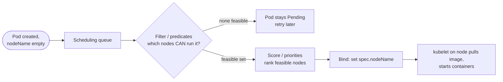
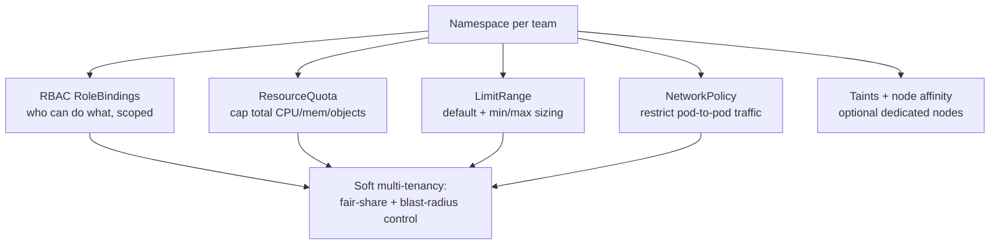

# Scheduling, Affinity & Multi-tenancy

Once a Pod is created, *something* has to decide **which node it runs on**, and in a shared cluster
*something* has to stop one team from starving another. Those two jobs are the subject of this topic:
the **kube-scheduler** (a control-plane component that assigns Pods to nodes) plus the placement
controls you feed it (`nodeSelector`, node/Pod affinity, taints/tolerations, topology spread,
priority/preemption), and **multi-tenancy** (namespaces + `ResourceQuota` + `LimitRange` + RBAC +
`NetworkPolicy`, and where "soft" tenancy stops and "hard" tenancy needs more).

This topic assumes container basics from the **docker** domain (a Pod's containers are OCI containers
run by the kubelet via the CRI). Resource **requests/limits and QoS** mechanics are introduced in
`probes-resources`; here we focus on how requests drive *placement*. Autoscaling that reacts to
un-schedulable Pods (Cluster Autoscaler/Karpenter) lives in `autoscaling-hpa-vpa`; RBAC depth lives in
`security-rbac`; `NetworkPolicy` depth lives in `workload-network-security`; diagnosing a stuck
`Pending` Pod lives in `troubleshooting-observability`. Managed control planes (EKS/GKE/AKS) run this
same scheduler — see the aws domain for EKS specifics.

> [!KEY-TAKEAWAY]
> The scheduler runs **filter → score → bind**: it discards infeasible nodes (predicates), ranks the
> survivors (priorities), and binds the Pod to the winner. You *bias* that decision with:
> **nodeSelector/node affinity** (attract to node labels), **pod affinity/anti-affinity** (place
> relative to other Pods), **taints/tolerations** (a node *repels* Pods unless they tolerate it),
> **topology spread** (even distribution across zones/nodes), and **priority/preemption** (evict
> lower-priority Pods when full). Multi-tenancy stacks **namespace + ResourceQuota + LimitRange +
> RBAC + NetworkPolicy** for *soft* isolation; a shared kernel and control plane mean *hard*
> isolation needs stronger boundaries (separate clusters, vCluster, or sandboxed runtimes).

---

## What the scheduler does

The **kube-scheduler** is a control-plane process that watches for Pods with an empty
`.spec.nodeName` and picks a node for each. Scheduling and *running* are separate: the scheduler only
writes a **binding** (it sets `nodeName` via the API server); the **kubelet** on that node then
actually pulls images and starts containers. So "scheduled" ≠ "running".

Node selection is a **two-phase** operation over the current set of nodes:

1. **Filtering (predicates)** — eliminate nodes on which the Pod *cannot* run. Checks include: does
   the node have enough allocatable CPU/memory for the Pod's **requests** (`NodeResourcesFit`), does
   it match `nodeSelector`/node affinity, does the Pod tolerate the node's taints (`TaintToleration`),
   are required volumes attachable, do host ports collide, etc. Nodes that pass are **feasible**.
2. **Scoring (priorities)** — rank the feasible nodes 0–100 per plugin, weight and sum them. Scorers
   include `NodeResourcesFit` (bin-pack vs spread), affinity `preferred` weights, topology-spread
   skew, image locality, and inter-pod affinity. The **highest total score** wins; ties broken at
   random.
3. **Bind** — the scheduler sets `.spec.nodeName` on the Pod (a POST to the API server's binding
   subresource). If **no node is feasible**, the Pod stays **`Pending`** and the scheduler retries.



Internally this is the **Scheduling Framework**: pluggable extension points run in order —
`PreFilter → Filter → PostFilter` (PostFilter runs only when filtering found nothing, and is where
**preemption** lives) `→ PreScore → Score → NormalizeScore → Reserve → Permit → PreBind → Bind →
PostBind`. Custom schedulers or plugins hook these points. You can run multiple **scheduler profiles**
in one binary and pick one per Pod via `.spec.schedulerName`.

> [!INTERVIEW]
> "Walk me through what happens from `kubectl apply` to a running Pod." Expected beats: API server
> validates + persists the Pod to etcd → scheduler sees an unbound Pod, runs **filter then score**,
> writes a **binding** → kubelet on the chosen node sees the bound Pod, calls the CRI to start it,
> reports status back. Emphasize that requests (not limits) drive the resource filter, and that a Pod
> with no feasible node is `Pending`, not failed.

---

## nodeSelector and node labels

`nodeSelector` is the **simplest** placement control: a map of key/value labels on `.spec.nodeSelector`.
The Pod is only feasible on nodes whose labels contain **all** of those key/value pairs (logical AND,
exact-match only).

```yaml
spec:
  nodeSelector:
    disktype: ssd
    topology.kubernetes.io/zone: us-east-1a
```

Nodes carry standard labels the cloud provider / kubelet set — `kubernetes.io/hostname`,
`kubernetes.io/os`, `kubernetes.io/arch`, `topology.kubernetes.io/zone`,
`topology.kubernetes.io/region`, `node.kubernetes.io/instance-type` — plus any you add with
`kubectl label node <node> disktype=ssd`.

Its limits are why affinity exists: `nodeSelector` can only express **exact equality** and only
**hard** requirements — no "one of these values", no "prefer but don't require", no negation. For
anything richer, use node affinity. If **both** `nodeSelector` and node affinity are set, **both must
be satisfied**.

> [!WARNING]
> For real isolation, don't rely on labels a workload could set on its own node. Use keys under the
> `node-restriction.kubernetes.io/` prefix, which the `NodeRestriction` admission plugin prevents a
> kubelet from setting on itself.

---

## Node affinity

**Node affinity** (`.spec.affinity.nodeAffinity`) is the expressive superset of `nodeSelector`. It
uses `matchExpressions` with operators `In`, `NotIn`, `Exists`, `DoesNotExist`, `Gt`, `Lt` (so `NotIn`
/ `DoesNotExist` give node *anti-affinity*), and comes in two flavors:

- **`requiredDuringSchedulingIgnoredDuringExecution`** — a **hard** rule. The scheduler will not place
  the Pod on a non-matching node (behaves like a richer `nodeSelector`). Uses `nodeSelectorTerms`:
  multiple terms are **ORed**, multiple `matchExpressions` within one term are **ANDed**.
- **`preferredDuringSchedulingIgnoredDuringExecution`** — a **soft** rule with a `weight` (1–100) per
  preference. Weights of satisfied preferences are added into the node's score; if no node matches,
  the Pod is **still scheduled** somewhere.

```yaml
spec:
  affinity:
    nodeAffinity:
      requiredDuringSchedulingIgnoredDuringExecution:
        nodeSelectorTerms:
        - matchExpressions:
          - key: topology.kubernetes.io/zone
            operator: In
            values: [us-east-1a, us-east-1b]
      preferredDuringSchedulingIgnoredDuringExecution:
      - weight: 80
        preference:
          matchExpressions:
          - key: disktype
            operator: In
            values: [ssd]
```

**`IgnoredDuringExecution`** is the crucial subtlety in the field name: affinity is evaluated **only at
scheduling time**. If a node's labels change *after* the Pod is placed, the Pod keeps running — it is
**not** evicted for now violating the rule. (There is no `requiredDuringSchedulingRequiredDuring
Execution` yet; that would re-evaluate at runtime.)

---

## Pod affinity and anti-affinity

Where node affinity targets **node labels**, **inter-pod affinity/anti-affinity**
(`.spec.affinity.podAffinity` / `.spec.affinity.podAntiAffinity`) places a Pod relative to **other
Pods** already running, within a **topology domain**:

- **podAffinity** — *co-locate*: schedule me in the same domain as Pods matching a label selector
  (e.g., put the web tier near its cache for latency).
- **podAntiAffinity** — *spread*: keep me **away** from Pods matching a selector (e.g., don't put two
  replicas of the same app on one node — HA).

Each term needs a **`topologyKey`** — the node label that defines the domain: `kubernetes.io/hostname`
(per-node), `topology.kubernetes.io/zone` (per-zone). The rule says "consider all nodes sharing the
same value of `topologyKey` as one bucket, and (anti-)affine against matching Pods in that bucket."
Both `required...` and `preferred...` variants exist, same semantics as node affinity.

```yaml
# Spread replicas of app=web across nodes (one per node preferred)
spec:
  affinity:
    podAntiAffinity:
      preferredDuringSchedulingIgnoredDuringExecution:
      - weight: 100
        podAffinityTerm:
          labelSelector:
            matchLabels: {app: web}
          topologyKey: kubernetes.io/hostname
```

> [!WARNING]
> Pod affinity/anti-affinity is **expensive**: the scheduler must compare the incoming Pod against all
> existing Pods across all domains, which "significantly slows down scheduling in large clusters" per
> the docs. For simple even-spreading, prefer **topology spread constraints** — they were designed to
> be cheaper and more declarative. `requiredDuringScheduling` anti-affinity with
> `topologyKey: hostname` also *hard-caps* replicas at one-per-node: if you have more replicas than
> nodes, the surplus stay **`Pending`**.

`matchLabelKeys` (beta) lets a term additionally scope which Pods count by copying label values from
the incoming Pod (commonly `pod-template-hash`), so a rolling update only affines against Pods of the
**same revision**, not the old ReplicaSet.

---

## Taints and tolerations

Affinity is Pods **choosing** nodes. **Taints** are the inverse: a node **repels** Pods that don't
explicitly **tolerate** it. This is how you build **dedicated nodes** (GPU pools, control-plane nodes,
tenant-reserved nodes). A taint is `key=value:effect`; a toleration on the Pod must match.

```bash
kubectl taint nodes gpu-node-1 gpu=true:NoSchedule    # add
kubectl taint nodes gpu-node-1 gpu=true:NoSchedule-   # remove (trailing -)
```

```yaml
tolerations:
- key: "gpu"
  operator: "Equal"     # Equal (match value) | Exists (match any value)
  value: "true"
  effect: "NoSchedule"
```

Three **effects**:

| Effect | On scheduling | On already-running Pods |
|---|---|---|
| `NoSchedule` | New non-tolerating Pods rejected | **Not** evicted |
| `PreferNoSchedule` | Scheduler *tries* to avoid (soft) | Not evicted |
| `NoExecute` | New non-tolerating Pods rejected | **Evicted** (after `tolerationSeconds`, if set) |

> [!KEY-TAKEAWAY]
> A toleration **permits** but does not **attract**. Tolerating a GPU taint lets a Pod land on the GPU
> node — it does not *force* it there, and the scheduler may still put it on a normal node. To both
> repel others **and** pull your workload in, pair a **taint** (repel) with **node affinity/
> nodeSelector** (attract).

Kubernetes adds **built-in taints** automatically for node conditions:
`node.kubernetes.io/not-ready`, `.../unreachable` (both `NoExecute` — this is what evicts Pods off a
dead node, gated by the default 300s `tolerationSeconds` Kubernetes injects), `.../memory-pressure`,
`.../disk-pressure`, `.../pid-pressure`, `.../unschedulable`, `.../network-unavailable`. Control-plane
nodes carry `node-role.kubernetes.io/control-plane:NoSchedule`, which is why ordinary workloads don't
land there. Setting `.spec.nodeName` directly bypasses the scheduler (and `NoSchedule`), but the
kubelet will still honor an un-tolerated `NoExecute`.

---

## Topology spread constraints

**Pod topology spread constraints** (`.spec.topologySpreadConstraints`) are the modern, declarative
way to distribute Pods **evenly** across failure domains (zones, nodes) — replacing most uses of
`preferred` pod anti-affinity for spreading.

```yaml
spec:
  topologySpreadConstraints:
  - maxSkew: 1
    topologyKey: topology.kubernetes.io/zone
    whenUnsatisfiable: DoNotSchedule
    labelSelector:
      matchLabels: {app: web}
```

Key fields:

- **`maxSkew`** (required, >0) — max allowed difference between the number of matching Pods in the
  **busiest** eligible domain and the **global minimum** (the least-populated eligible domain, or 0 if
  eligible domains < `minDomains`). Smaller = tighter spread.
- **`topologyKey`** — the node label defining domains (zone, hostname, …).
- **`whenUnsatisfiable`** — `DoNotSchedule` (hard: leave `Pending` rather than violate skew) or
  `ScheduleAnyway` (soft: schedule but prefer skew-reducing nodes).
- **`labelSelector`** — which Pods to count when computing skew.
- **`minDomains`**, **`matchLabelKeys`** (scope by revision), **`nodeAffinityPolicy`**
  (`Honor`/`Ignore`, default `Honor`), **`nodeTaintsPolicy`** (`Honor`/`Ignore`, default `Ignore`).

**Skew example:** three zones hold 2, 2, 1 matching Pods → global minimum = 1. With `maxSkew: 1`, a
new Pod can only go to the zone with 1 (making it 2,2,2), because placing it in a zone with 2 would
make skew 2. There is a **built-in cluster default** (`maxSkew: 3` on `kubernetes.io/hostname` and
`maxSkew: 5` on `topology.kubernetes.io/zone`, both `ScheduleAnyway`) applied when a Pod sets no
constraints of its own.

> [!INTERVIEW]
> "Anti-affinity vs topology spread — when do you use which?" Anti-affinity is binary
> ("never/prefer-not together"); topology spread is *quantitative* ("keep the imbalance ≤ maxSkew")
> and cheaper to evaluate. Use `DoNotSchedule` topology spread across zones for HA; use `hostname`
> `maxSkew: 1` to approximate one-per-node without the hard replica cap that `required` anti-affinity
> imposes.

---

## Resource-request-based placement

Placement is gated by **resource requests**, not limits. During filtering, `NodeResourcesFit` checks
that the sum of the Pod's container **`requests`** fits in the node's **allocatable** capacity minus
what already-scheduled Pods requested — regardless of actual live usage. So a node reporting 10% CPU
utilization can still be "full" for scheduling if existing Pods *requested* all of it.

```yaml
resources:
  requests: {cpu: "500m", memory: "512Mi"}   # used for scheduling
  limits:   {cpu: "1",    memory: "1Gi"}      # enforced at runtime, NOT for scheduling
```

Consequences an interviewer probes:

- A Pod requesting more CPU/memory than **any** single node's allocatable is **permanently
  `Pending`** — `kubectl describe pod` shows `FailedScheduling ... Insufficient cpu`.
- The scoring stage decides *among* fitting nodes how to pack: the default `NodeResourcesFit` scoring
  strategy is `LeastAllocated` (**spread** load), but it can be configured to `MostAllocated`
  (**bin-pack** to fewer nodes — cheaper, and what Cluster Autoscaler/Karpenter want).
- **No requests set** = the scheduler assumes ~0 and packs freely → nodes get oversubscribed and Pods
  (BestEffort QoS) are first to be evicted under pressure. A `LimitRange` supplying **default
  requests** prevents this.
- Requests also set **QoS class** (Guaranteed / Burstable / BestEffort), which drives eviction order —
  covered in `probes-resources`.

---

## Priority and preemption

A **PriorityClass** (cluster-scoped, `scheduling.k8s.io/v1`) maps a name to an integer `value`
(−2147483648 … 1000000000; higher = more important). Pods reference it via `.spec.priorityClassName`;
an admission controller resolves the number into `.spec.priority`.

```yaml
apiVersion: scheduling.k8s.io/v1
kind: PriorityClass
metadata: {name: high-priority}
value: 1000000
globalDefault: false
preemptionPolicy: PreemptLowerPriority   # or Never (non-preempting)
description: "Critical latency-sensitive services."
```

Priority does two things:

1. **Queue ordering** — higher-priority pending Pods are scheduled ahead of lower-priority ones.
2. **Preemption** — if a high-priority Pod can't schedule anywhere, the scheduler's `PostFilter`
   preemption logic looks for a node where **evicting lower-priority Pods** would make room, deletes
   those victims, and schedules the incoming Pod. Victims get their **graceful termination period**;
   the incoming Pod's `.status.nominatedNodeName` is set to the target node (though it may ultimately
   land elsewhere).

Nuances:

- **`preemptionPolicy: Never`** makes a Pod *non-preempting*: it jumps the queue but never evicts
  others (good for large batch/data-science jobs). It can still *be* preempted by something higher.
- **PodDisruptionBudgets** are honored **best-effort** during preemption — if no PDB-respecting victim
  set exists, the scheduler preempts **anyway**.
- Built-in `system-cluster-critical` and `system-node-critical` classes protect control-plane/node
  add-ons; names can't start with `system-`. Only one class may be `globalDefault: true`; otherwise
  Pods with no class get priority 0.

> [!WARNING]
> In multi-tenant clusters, high `value` PriorityClasses are a footgun: a tenant that can set a huge
> priority can evict everyone else. Restrict them with a **ResourceQuota scoped by `PriorityClass`**
> and RBAC on the (cluster-scoped) PriorityClass objects.

---

## Namespaces as a tenancy boundary

A **namespace** is a virtual cluster partition: it scopes **names** (two Pods named `api` can coexist
in different namespaces), and it's the attachment point for **RBAC RoleBindings**, **ResourceQuota**,
**LimitRange**, and **NetworkPolicy**. It is the unit of "soft" multi-tenancy.

```bash
kubectl create namespace team-a
kubectl -n team-a get pods
```

What a namespace does **not** do is as important for interviews:

- Namespaces are **not a security boundary by themselves** — without RBAC and NetworkPolicy, a Pod in
  `team-a` can still call a Service in `team-b` (flat network) and a user with cluster-wide verbs sees
  everything.
- Many objects are **cluster-scoped** and ignore namespaces: Nodes, PersistentVolumes, StorageClasses,
  ClusterRoles, PriorityClasses, CustomResourceDefinitions, IngressClasses, and namespaces themselves.
- Cross-namespace DNS is intentional: a Service is reachable at
  `<svc>.<namespace>.svc.cluster.local`.
- Deleting a namespace cascades: all namespaced objects in it are garbage-collected.

---

## ResourceQuota and LimitRange

These two objects turn a namespace into a *bounded* tenant. They are complementary:

**`ResourceQuota`** — caps **aggregate** consumption across the namespace: total CPU/memory
**requests and limits**, storage, and **object counts**.

```yaml
apiVersion: v1
kind: ResourceQuota
metadata: {name: team-a-quota, namespace: team-a}
spec:
  hard:
    requests.cpu: "10"
    requests.memory: 20Gi
    limits.cpu: "20"
    limits.memory: 40Gi
    persistentvolumeclaims: "10"
    count/deployments.apps: "20"
    pods: "50"
```

Critical behavior: **once a ResourceQuota constrains `requests.cpu`/`memory` (or their limits) in a
namespace, every new Pod must specify those requests/limits** or the API server **rejects it with
`403 Forbidden`**. Creating a *Deployment* that exceeds quota succeeds, but its Pods silently fail to
be created (diagnose with `kubectl describe replicaset`).

**`LimitRange`** — sets **per-object** rules within the namespace: **default** requests/limits (so
users don't have to specify them — which is exactly what lets Pods satisfy a ResourceQuota), plus
**min/max** per container/Pod and PVC size bounds.

```yaml
apiVersion: v1
kind: LimitRange
metadata: {name: team-a-defaults, namespace: team-a}
spec:
  limits:
  - type: Container
    default:        {cpu: 500m, memory: 512Mi}   # applied as limits if unset
    defaultRequest: {cpu: 250m, memory: 256Mi}   # applied as requests if unset
    max:            {cpu: "2",  memory: 2Gi}
    min:            {cpu: 50m,  memory: 64Mi}
```

| | ResourceQuota | LimitRange |
|---|---|---|
| Level | Whole namespace (aggregate) | Per container / Pod / PVC |
| Purpose | Cap totals + object counts | Defaults + min/max bounds |
| On violation | 403 for the request that would exceed the total | 403 for object outside bounds; injects defaults |

The canonical pairing: **ResourceQuota** (require + cap requests/limits) **+ LimitRange** (supply
defaults) so tenants get sensible sizing without touching every manifest.

---

## Soft vs hard multi-tenancy

**Soft multi-tenancy** = trusted-ish tenants (teams in one company) sharing a cluster, isolated by the
stack of namespaced controls:



- **RBAC** (`Role`/`RoleBinding`) limits *who* can act inside the namespace — see `security-rbac`.
- **ResourceQuota + LimitRange** limit *how much* — fair-share and preventing a noisy neighbor.
- **NetworkPolicy** (default-deny + explicit allows) limits *who talks to whom* — see
  `workload-network-security`. Namespaces alone give no network isolation.
- Optionally, **taints + node affinity** pin a tenant to **dedicated nodes**.

**Why it's only "soft":** all tenants share **one kernel** (containers are not VMs — see docker), one
API server, one etcd, and one set of cluster-scoped CRDs/webhooks. A container escape, an
overly-broad ClusterRole, a shared admission webhook, or noisy control-plane usage crosses the
namespace line. For **hard multi-tenancy** (untrusted tenants, e.g. SaaS running customer code) you
need stronger boundaries:

- **Separate clusters per tenant** (strongest, most operational cost) — or a **virtual cluster**
  (e.g. **vCluster**) giving each tenant its own API server + control plane on top of a shared host
  cluster.
- **Sandboxed runtimes** (gVisor, Kata Containers) for kernel-level isolation between Pods.
- **Node isolation** so tenants never share a kernel, plus per-tenant admission/policy enforcement
  (e.g. Kyverno/Gatekeeper) and **Pod Security Standards**.

> [!INTERVIEW]
> "Is a namespace a security boundary?" Say **no, not on its own** — it's a *scoping* boundary. It
> becomes a soft tenancy boundary only when you add RBAC + ResourceQuota/LimitRange + NetworkPolicy,
> and even then the shared kernel/control plane means untrusted tenants need cluster-level isolation
> or virtual clusters (vCluster) / sandboxed runtimes.

---

## Cordon, drain and node maintenance

For node maintenance (kernel patch, upgrade, decommission) you take a node out of rotation without
killing the cluster:

- **`kubectl cordon <node>`** — marks the node **unschedulable** (adds the
  `node.kubernetes.io/unschedulable:NoSchedule` taint / sets `.spec.unschedulable`). No **new** Pods
  land there; **existing** Pods keep running.
- **`kubectl drain <node>`** — cordons **and** evicts the node's Pods so you can safely reboot/remove
  it. Drain uses the **Eviction API**, so it **respects PodDisruptionBudgets** (blocks if evicting
  would violate a PDB). Common flags: `--ignore-daemonsets` (DaemonSet Pods aren't evicted, they'll
  just be re-created — expected), `--delete-emptydir-data` (acknowledge losing `emptyDir` data),
  `--force` (evict Pods not backed by a controller, i.e. bare Pods that won't be recreated).
- **`kubectl uncordon <node>`** — reverses cordon; the node is schedulable again.

```bash
kubectl drain node-7 --ignore-daemonsets --delete-emptydir-data
# ... patch / reboot ...
kubectl uncordon node-7
```

> [!WARNING]
> `drain` uses **eviction**, not raw deletion, precisely so a **PodDisruptionBudget**
> (`minAvailable`/`maxUnavailable`) can protect availability during maintenance. If a PDB has no slack
> (e.g. `minAvailable: 100%`), `drain` will **hang** — the eviction is refused. That interplay
> (drain + PDB) is a very common senior-level question.

---

## Common follow-up questions

- **"Requests or limits — which affects scheduling?"** Requests. Limits are runtime enforcement
  (CPU throttling / OOMKill). A node can be "full" for scheduling while barely utilized.
- **"Difference between a toleration and node affinity?"** A toleration only *permits* a Pod onto a
  tainted node; it doesn't attract. Node affinity/nodeSelector *attracts*. Dedicated nodes usually
  need both.
- **"Why is my Pod Pending?"** Insufficient requestable resources on any node, unsatisfiable
  nodeSelector/affinity, an un-tolerated taint, a `DoNotSchedule` topology-spread violation, unbound
  PVC, or hard anti-affinity with more replicas than nodes. Read `kubectl describe pod` events.
- **"How does preemption pick victims?"** Lowest-priority Pods on a node that, once removed, let the
  pending high-priority Pod fit; PDBs honored best-effort; victims get graceful termination.
- **"nodeSelector vs node affinity vs pod affinity?"** nodeSelector = simple exact node-label match;
  node affinity = expressive node-label match (hard/soft, operators); pod affinity/anti-affinity =
  placement relative to *other Pods* within a topology domain.
- **"Is a namespace enough to isolate tenants?"** No — add RBAC + quota + NetworkPolicy for soft
  tenancy; use separate/virtual clusters or sandboxes for hard tenancy.
- **"Anti-affinity vs topology spread?"** Anti-affinity is binary and expensive; topology spread is
  quantitative (`maxSkew`) and cheaper — prefer it for even distribution.
- **"What does drain do that delete doesn't?"** Drain cordons + evicts via the Eviction API,
  respecting PDBs and skipping/handling DaemonSets; raw delete ignores PDBs and the node stays
  schedulable.

## References

- Kubernetes docs — [kube-scheduler](https://kubernetes.io/docs/concepts/scheduling-eviction/kube-scheduler/)
- Kubernetes docs — [Assigning Pods to Nodes (nodeSelector, affinity)](https://kubernetes.io/docs/concepts/scheduling-eviction/assign-pod-node/)
- Kubernetes docs — [Taints and Tolerations](https://kubernetes.io/docs/concepts/scheduling-eviction/taint-and-toleration/)
- Kubernetes docs — [Pod Topology Spread Constraints](https://kubernetes.io/docs/concepts/scheduling-eviction/topology-spread-constraints/)
- Kubernetes docs — [Pod Priority and Preemption](https://kubernetes.io/docs/concepts/scheduling-eviction/pod-priority-preemption/)
- Kubernetes docs — [Scheduling Framework](https://kubernetes.io/docs/concepts/scheduling-eviction/scheduling-framework/)
- Kubernetes docs — [Resource Quotas](https://kubernetes.io/docs/concepts/policy/resource-quotas/) · [Limit Ranges](https://kubernetes.io/docs/concepts/policy/limit-range/)
- Kubernetes docs — [Namespaces](https://kubernetes.io/docs/concepts/overview/working-with-objects/namespaces/) · [Multi-tenancy](https://kubernetes.io/docs/concepts/security/multi-tenancy/)
- Kubernetes docs — [Safely Drain a Node](https://kubernetes.io/docs/tasks/administer-cluster/safely-drain-node/) · [Disruptions / PDB](https://kubernetes.io/docs/concepts/workloads/pods/disruptions/)
- CNCF / community — [vCluster (virtual clusters)](https://www.vcluster.com/docs)
