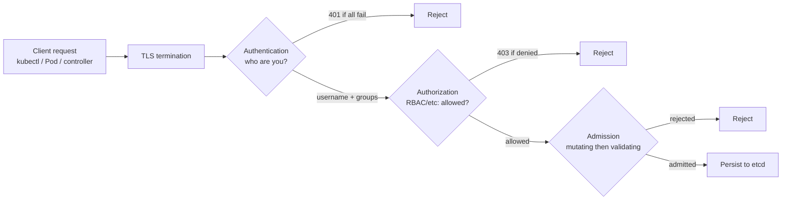
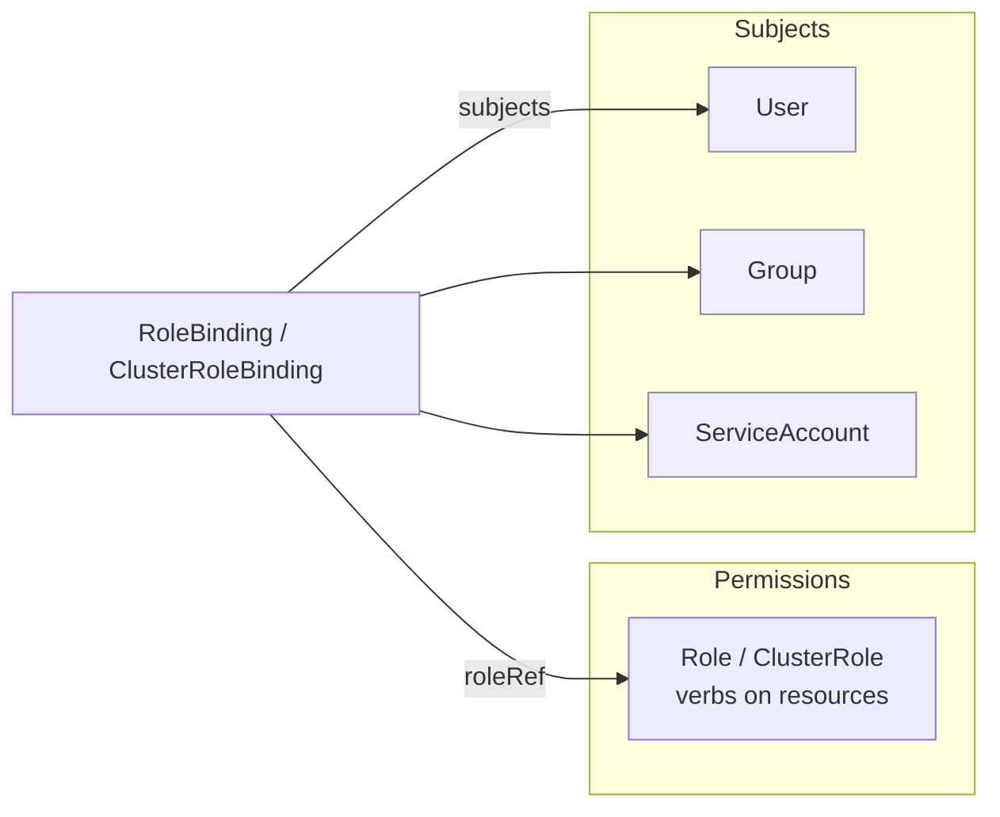

# Authentication, Authorization & RBAC

Every request that reaches the Kubernetes API server — from `kubectl`, a controller, a Pod's
in-cluster client, or a CI robot — runs through the same three-stage gate before it can touch
etcd: **Authentication** (who are you?), **Authorization** (are you allowed to do this?), and
**Admission control** (should this specific object be allowed/mutated?). RBAC
(Role-Based Access Control) is the authorization stage almost everyone uses, and it is the
core of this topic.

This topic assumes container basics from the **docker** domain (Pods run containers; images
come from a registry). It builds on **architecture-control-plane** (the API server is the
single front door to etcd) and **config-secrets** (ServiceAccount tokens are Secrets;
protecting Secrets needs RBAC). The *general* theory of authentication vs authorization,
OIDC/OAuth2, mTLS, and least-privilege as security principles lives in the **security**
domain — here we cover how Kubernetes specifically implements them. Admission control and
Pod Security Standards are introduced here and deepened in **workload-network-security**.

> [!KEY-TAKEAWAY]
> The pipeline is **AuthN → AuthZ → Admission**, in that order, on *every* API request.
> Authentication only establishes a **username + groups** (it never grants permissions).
> Authorization (RBAC) then decides yes/no. RBAC is **deny-by-default and purely additive** —
> there are **no deny rules**; a request is allowed only if some Role/ClusterRole bound to
> the caller explicitly permits it.

> [!KEY-TAKEAWAY]
> **Human users are NOT Kubernetes objects** — there is no `User` resource; users come from an
> external identity source (a client cert's CN, an OIDC token's claims). **ServiceAccounts ARE
> objects** (`kind: ServiceAccount`), namespaced, and are how *Pods/workloads* authenticate to
> the API.

---

## The auth pipeline: authentication, authorization, admission

Every request to `kube-apiserver` (the only component that reads/writes etcd) passes through
three sequential stages. If any stage rejects, the request stops.



1. **Authentication (AuthN)** — one or more authenticator plugins inspect the request
   (client cert, bearer token, etc.). The first that succeeds returns a **username** and a
   set of **groups**. If none succeed the API server returns **401 Unauthorized**. AuthN
   *never* grants any permission; it only establishes identity.
2. **Authorization (AuthZ)** — authorizer modules (usually **RBAC**, sometimes Node, Webhook,
   ABAC) decide whether *this identity* may perform *this verb* on *this resource*. Denied →
   **403 Forbidden**.
3. **Admission control** — chains of admission plugins/webhooks run *after* authorization but
   *before* persistence. **Mutating** admission runs first (can modify the object, e.g. inject
   a sidecar, set defaults), then **Validating** admission (can only accept/reject, e.g. Pod
   Security Standards, ResourceQuota, custom policy). Admission only runs for requests that
   create/modify/delete objects (not plain reads).

> [!INTERVIEW]
> "A user gets `401` vs `403` — what's the difference?" → **401** = authentication failed (we
> don't know who you are — bad/expired cert or token). **403** = authenticated fine, but RBAC
> (or another authorizer) denied the action. Different stage, different fix.

---

## Authentication: how the API server identifies you

Kubernetes has no built-in user database. Instead the API server is configured with one or
more **authentication strategies**, tried in order until one succeeds:

| Strategy | Used by | Identity source |
|---|---|---|
| **X.509 client certificates** | admins, kubeadm-issued kubeconfigs | cert **Common Name (CN)** → username, **Organization (O)** → groups |
| **Bearer tokens — ServiceAccount** | Pods / in-cluster clients | signed JWT issued by the API server (TokenRequest) |
| **Bearer tokens — OIDC** | human SSO (Okta, Entra ID, Google, Dex) | JWT `id_token`; claims map to username/groups |
| **Static token file / bootstrap tokens** | node join, small/legacy setups | flat token file (discouraged for humans) |
| **Authenticating proxy / webhook** | external IAM (e.g. cloud, `aws-iam-authenticator`) | proxy headers or a remote TokenReview |

Key facts:

- The output of AuthN is always just a **username** (a string) and a **list of group names**
  (strings). RBAC bindings reference exactly these strings.
- **Client certs**: `kubectl` in a typical kubeadm cluster authenticates with a cert whose
  `CN=kubernetes-admin`, `O=kubernetes-admin` (or `system:masters`). The API server validates
  it against the cluster CA. Certs **cannot be revoked** (short of rotating the CA), so keep
  them short-lived.
- **OIDC**: the recommended way to authenticate *humans* at scale. The API server is pointed
  at an issuer URL and validates the JWT signature; a claim (e.g. `email`) becomes the
  username and another (e.g. `groups`) becomes the groups. No user objects, no per-user certs.

```bash
# See who kubectl thinks you are and how you'd be authorized
kubectl auth whoami
```

> [!WARNING]
> A base64-encoded ServiceAccount token or a kubeconfig client cert is a **bearer
> credential** — anyone holding it *is* that identity. Treat them like passwords. Prefer
> short-lived, bound tokens (below) over long-lived Secret tokens.

---

## Users vs ServiceAccounts

This distinction is a favorite interview question.

| | **User (human/normal user)** | **ServiceAccount** |
|---|---|---|
| Is it a K8s API object? | **No** — no `kind: User` | **Yes** — `kind: ServiceAccount`, namespaced |
| Managed by | external system (certs, OIDC, IAM) | the cluster (`kubectl create sa`) |
| Intended for | humans / external automation | **in-cluster workloads (Pods)** |
| Username form in RBAC | arbitrary string (`jane@corp.com`) | `system:serviceaccount:<ns>:<name>` |
| Group membership | from cert `O` / OIDC groups claim | `system:serviceaccounts`, `system:serviceaccounts:<ns>` |

- You never `kubectl create user`. You configure an authenticator and then write RBAC
  bindings referencing whatever username/groups that authenticator emits.
- A **ServiceAccount** is created in a namespace and is how a Pod calls the API. Every
  namespace has a `default` ServiceAccount, and Pods that don't specify one get it.
- In RBAC, a ServiceAccount named `build-bot` in namespace `ci` is the subject
  `system:serviceaccount:ci:build-bot`. All ServiceAccounts are in the group
  `system:serviceaccounts`, and all in one namespace share `system:serviceaccounts:<ns>`.

```yaml
apiVersion: v1
kind: ServiceAccount
metadata:
  name: build-bot
  namespace: ci
```

> [!TIP]
> Give each workload its **own** ServiceAccount with only the permissions it needs, rather
> than reusing `default`. Set `automountServiceAccountToken: false` on Pods/SAs that never
> call the API to avoid handing an unnecessary token to a container.

---

## ServiceAccount tokens: bound tokens & projection

How does a Pod actually get a credential? Historically Kubernetes auto-created a
**long-lived Secret** of type `kubernetes.io/service-account-token` for each ServiceAccount
and mounted it. That changed significantly:

- **v1.22 — BoundServiceAccountTokenVolume (GA):** Pods now receive tokens via a **projected
  volume** using the **TokenRequest API**. These tokens are **time-bound** (expire and are
  auto-rotated by the kubelet, default ~1h), **audience-bound**, and **object-bound** (tied to
  the Pod's lifetime — deleting the Pod invalidates the token).
- **v1.24 — LegacyServiceAccountTokenNoAutoGeneration:** the control plane **no longer
  auto-creates** a token Secret when you create a ServiceAccount. Creating an SA gives you
  *no* Secret by default.

Consequences:

- **Get a token on demand:** `kubectl create token build-bot -n ci` returns a short-lived
  bound token via the TokenRequest API. Optionally bind it to an object so it dies with that
  object: `kubectl create token build-bot --bound-object-kind=Pod --bound-object-name=p1`.
- **Need a non-expiring token** (legacy CI that can't refresh)? You must **create the Secret
  yourself**; the token controller then populates it:

```yaml
apiVersion: v1
kind: Secret
metadata:
  name: build-bot-token
  namespace: ci
  annotations:
    kubernetes.io/service-account.name: build-bot
type: kubernetes.io/service-account-token   # controller fills in the token
```

- The projected token a Pod mounts lives at
  `/var/run/secrets/kubernetes.io/serviceaccount/token` alongside `ca.crt` and `namespace`.

```yaml
# What the kubelet effectively projects for a Pod (bound, audience-scoped, auto-rotated)
volumes:
- name: kube-api-access
  projected:
    sources:
    - serviceAccountToken:
        path: token
        expirationSeconds: 3600
        audience: https://kubernetes.default.svc
```

> [!WARNING]
> A manually-created `kubernetes.io/service-account-token` Secret is a **long-lived,
> non-expiring** credential (the old behavior). It's a bigger blast radius if leaked — prefer
> `kubectl create token` / projected bound tokens whenever the consumer can refresh.

---

## Workload identity for cloud (IRSA / Workload Identity)

Pods frequently need to call *cloud* APIs (S3, GCS, Azure Blob), not just the K8s API. The
modern, keyless pattern federates the Pod's **projected ServiceAccount token** (a signed OIDC
JWT) with the cloud IAM provider so no static cloud credentials live in the cluster:

- **AWS — IRSA (IAM Roles for ServiceAccounts):** annotate the SA with
  `eks.amazonaws.com/role-arn`; the SDK exchanges the projected token via
  `AssumeRoleWithWebIdentity` for temporary AWS credentials. (EKS specifics are covered in the
  **aws** domain, `aws-containers-ecs-eks`.) EKS Pod Identity is a newer alternative.
- **GKE — Workload Identity** and **AKS — Workload Identity** follow the same OIDC-federation
  model.

```yaml
apiVersion: v1
kind: ServiceAccount
metadata:
  name: s3-reader
  namespace: data
  annotations:
    eks.amazonaws.com/role-arn: arn:aws:iam::111122223333:role/s3-read-only
```

> [!INTERVIEW]
> "How does a Pod get AWS permissions without baked-in access keys?" → The cluster is an OIDC
> provider; the Pod's projected SA token is a signed JWT the cloud IAM trusts. IAM exchanges
> it for short-lived credentials (`AssumeRoleWithWebIdentity`). No long-lived secrets, tied to
> the ServiceAccount, auditable.

---

## Authorization modes & why RBAC is deny-by-default

The API server runs one or more **authorizers**, configured via `--authorization-mode`
(or an `AuthorizationConfiguration` file). Common modes:

| Mode | Purpose |
|---|---|
| **RBAC** | the standard: Roles/ClusterRoles bound to subjects |
| **Node** | special-cases the kubelet — restricts each node to only the objects for its Pods |
| **Webhook** | delegates the decision to an external service (SubjectAccessReview) |
| **ABAC** | legacy attribute policy file (rarely used now) |
| **AlwaysAllow / AlwaysDeny** | testing only |

How multiple authorizers combine (crucial subtlety):

- An authorizer can **Allow**, **Deny**, or return **NoOpinion**.
- If **any** authorizer explicitly **allows**, the request is permitted (short-circuits).
- If an authorizer explicitly **denies**, the request stops (with the newer configurable
  authorization; classic modes mostly Allow/NoOpinion).
- If all return NoOpinion, the request is **denied** (deny-by-default).

**RBAC itself has no deny rules.** Permissions are *purely additive*: you can only grant. To
"take away" access you remove or narrow a binding — you cannot write a rule that says "deny
X". This is why a single overly-broad ClusterRoleBinding (e.g. to `cluster-admin`) can't be
"patched" with a deny; you must fix the grant.

> [!KEY-TAKEAWAY]
> RBAC is **deny-by-default + additive + no deny rules**. Absence of a grant = denied. You
> secure a cluster by granting the *least* set of permissions, never by adding denials.

---

## Role and ClusterRole — permissions (verbs on resources)

A **Role** (namespaced) or **ClusterRole** (cluster-scoped) is a *set of permissions*. Each
rule combines **apiGroups** + **resources** + **verbs** (and optionally `resourceNames`,
`subresources`, `nonResourceURLs`). A Role/ClusterRole grants **nothing** on its own until a
binding attaches it to a subject.

```yaml
apiVersion: rbac.authorization.k8s.io/v1
kind: Role
metadata:
  namespace: dev
  name: pod-reader
rules:
- apiGroups: [""]                 # "" = the core API group (pods, services, configmaps...)
  resources: ["pods", "pods/log"] # a subresource: pods/log, pods/exec
  verbs: ["get", "list", "watch"]
```

- **Verbs**: `get`, `list`, `watch`, `create`, `update`, `patch`, `delete`,
  `deletecollection` (plus special ones like `impersonate`, `bind`, `escalate`, `use`).
- `apiGroups`: `""` is the core group; others are named (`apps`, `batch`,
  `rbac.authorization.k8s.io`, etc.). You must match the resource's real group.
- **`resourceNames`** restricts a rule to specific named instances (e.g. only the ConfigMap
  `app-config`). But it **cannot** restrict `list`, `watch`, `create`, or `deletecollection` —
  those operate on the collection, not a single named object.
- **`nonResourceURLs`** (e.g. `/healthz`, `/metrics`) can only appear in a **ClusterRole**
  (they aren't namespaced). `*` is a **suffix** wildcard.

**Role vs ClusterRole:**

| | **Role** | **ClusterRole** |
|---|---|---|
| Scope of the object | one namespace | cluster-wide (no namespace) |
| Can grant on namespaced resources | yes, in its namespace | yes (across all namespaces, if bound cluster-wide) |
| Can grant on cluster-scoped resources (nodes, PVs, namespaces) | **no** | yes |
| Can grant non-resource URLs | no | yes |

> [!WARNING]
> `verbs: ["*"]`, `resources: ["*"]`, `apiGroups: ["*"]` are wildcards that grant *everything*
> in scope, including future resources added later. Avoid wildcards in real roles — enumerate
> what you need.

---

## RoleBinding and ClusterRoleBinding — granting to subjects

A binding is what actually **grants** a Role/ClusterRole to **subjects** (users, groups,
ServiceAccounts). Two fields: `subjects` (who) and `roleRef` (which permissions).

```yaml
apiVersion: rbac.authorization.k8s.io/v1
kind: RoleBinding
metadata:
  name: read-pods-dev
  namespace: dev
subjects:
- kind: User                       # a human (from cert/OIDC)
  name: jane@corp.com
  apiGroup: rbac.authorization.k8s.io
- kind: ServiceAccount             # a workload; note NO apiGroup for SAs
  name: build-bot
  namespace: ci
- kind: Group
  name: dev-team
  apiGroup: rbac.authorization.k8s.io
roleRef:
  kind: Role                       # or ClusterRole
  name: pod-reader
  apiGroup: rbac.authorization.k8s.io
```

- Subject `kind`s: `User`, `Group` (both use `apiGroup: rbac.authorization.k8s.io`), and
  `ServiceAccount` (uses `namespace`, and **no** `apiGroup`).
- **`roleRef` is immutable.** You cannot change which Role a binding points to — delete and
  recreate the binding instead.
- A `ClusterRoleBinding` grants its ClusterRole **cluster-wide** (every namespace + cluster
  resources) to the subjects.



---

## Namespaced vs cluster-wide scope

The four object types combine scope in a specific, testable way:

| Binding | References | Effective scope |
|---|---|---|
| **RoleBinding** → **Role** | same-namespace Role | that one namespace |
| **RoleBinding** → **ClusterRole** | a ClusterRole | **only the RoleBinding's namespace** (reuse a common role per-namespace) |
| **ClusterRoleBinding** → **ClusterRole** | a ClusterRole | **entire cluster** (all namespaces + cluster-scoped resources) |
| RoleBinding → *ClusterRole for cluster-scoped resource* | e.g. nodes | **does not work** — namespaced binding can't grant cluster-scoped access |

The powerful, commonly-tested pattern: define a **ClusterRole once** (say `secret-reader`) and
attach it with a **RoleBinding** in each namespace where it's needed. The permissions apply
**only** in that namespace, even though the role is cluster-scoped.

```yaml
# ClusterRole 'secret-reader' bound via a RoleBinding in 'dev' → dave reads Secrets ONLY in dev
apiVersion: rbac.authorization.k8s.io/v1
kind: RoleBinding
metadata:
  name: read-secrets-dev
  namespace: dev
subjects:
- kind: User
  name: dave
  apiGroup: rbac.authorization.k8s.io
roleRef:
  kind: ClusterRole
  name: secret-reader
  apiGroup: rbac.authorization.k8s.io
```

> [!INTERVIEW]
> "I bound a ClusterRole granting node access with a RoleBinding, but the user still can't
> list nodes — why?" → Nodes are **cluster-scoped**. A namespaced RoleBinding can only grant
> access to *namespaced* resources in its own namespace. Cluster-scoped resources require a
> **ClusterRoleBinding**.

---

## Aggregated ClusterRoles & default roles

**Aggregated ClusterRoles** let you compose a ClusterRole from others via label selectors.
The RBAC controller watches for ClusterRoles matching the selector and auto-fills the
aggregate's `rules`. This is how Kubernetes lets you *extend* built-in roles (e.g. add CRD
permissions to `edit`/`view` by labeling a small ClusterRole).

```yaml
apiVersion: rbac.authorization.k8s.io/v1
kind: ClusterRole
metadata:
  name: monitoring
aggregationRule:
  clusterRoleSelectors:
  - matchLabels:
      rbac.example.com/aggregate-to-monitoring: "true"
rules: []          # controller manages these; do not hand-edit
```

**Default (user-facing) ClusterRoles** shipped with every cluster:

| ClusterRole | Grants |
|---|---|
| **cluster-admin** | super-user; any verb on any resource. As a ClusterRoleBinding = full cluster control |
| **admin** | full read/write in a namespace **incl. roles/rolebindings** (meant for a RoleBinding) |
| **edit** | read/write most namespaced objects, but **cannot** touch Roles/RoleBindings |
| **view** | read-only most objects; **cannot read Secrets**, roles, or rolebindings |

`admin`, `edit`, and `view` are themselves **aggregated** — that's how add-ons extend them.
There are also many `system:*` ClusterRoles (e.g. `system:node`, `system:kube-scheduler`) for
control-plane components — don't bind those to users.

> [!TIP]
> To let a namespace team do everything *within* their namespace, bind the **`admin`**
> ClusterRole with a **RoleBinding** in that namespace — not `cluster-admin` with a
> ClusterRoleBinding.

---

## Least privilege & avoiding cluster-admin

RBAC's whole value is granting the minimum. Anti-patterns and the guardrails that fight them:

- **Over-granting `cluster-admin`.** A `ClusterRoleBinding` to `cluster-admin` is god-mode. Use
  it only for genuine cluster operators; scope teams to namespaced `admin`/`edit`.
- **Wildcards** (`*` verbs/resources/apiGroups) grant more than intended and silently expand
  when new resource types appear. Enumerate.
- **Privilege-escalation prevention:** you **cannot grant permissions you don't already have**.
  Creating/updating a Role with rules beyond your own is rejected unless you hold the
  **`escalate`** verb on `roles`/`clusterroles`. Likewise, creating a **binding** to a role you
  don't fully possess requires the **`bind`** verb. These stop a namespace admin from
  bootstrapping themselves to cluster-admin.
- **`pods/exec`, `secrets get`, `impersonate`, and `escalate`/`bind`** are especially
  sensitive — `exec` = shell into any Pod, `impersonate` = act as another user/group.
- Watch out for **transitive** escalation: the ability to create a Pod (or a workload
  controller) with an arbitrary ServiceAccount effectively grants that SA's permissions to
  whoever controls the Pod.

> [!WARNING]
> Granting `create`/`update` on `roles`/`rolebindings` (as the `admin` ClusterRole does within
> a namespace) plus the `escalate`/`bind` verbs lets a subject expand their own access.
> Reserve those verbs for trusted operators.

---

## Checking access: kubectl auth can-i & impersonation

Don't guess whether RBAC is right — query it. The API server answers via the
**SubjectAccessReview** / **SelfSubjectAccessReview** APIs, surfaced by `kubectl`:

```bash
# Can *I* do this?
kubectl auth can-i create deployments -n dev            # -> yes / no
kubectl auth can-i '*' '*'                                # am I effectively cluster-admin?
kubectl auth can-i get pods --subresource=log -n dev

# List everything I can do in a namespace
kubectl auth can-i --list -n dev

# Check on behalf of another subject (needs 'impersonate' permission)
kubectl auth can-i list secrets -n dev \
  --as=jane@corp.com
kubectl auth can-i get pods -n dev \
  --as=system:serviceaccount:ci:build-bot
kubectl auth can-i create pods --as-group=dev-team --as=jane@corp.com
```

- `--as` / `--as-group` use **user impersonation**, which itself requires the `impersonate`
  verb on `users`/`groups` — useful for admins to debug "why can't this SA do X?"
- `kubectl auth can-i --list` is the fastest way to audit an identity's effective permissions.

> [!INTERVIEW]
> "How would you debug a Pod getting 403 from the API?" → Identify its ServiceAccount, then
> `kubectl auth can-i <verb> <resource> -n <ns> --as=system:serviceaccount:<ns>:<sa>`; if
> `no`, inspect the Roles/Bindings (`kubectl get rolebindings,clusterrolebindings -A -o wide`)
> for that subject and add the missing grant.

---

## Built-in groups: anonymous, system:authenticated, system:masters

The API server injects several special usernames/groups that RBAC can bind to:

| Identity | Meaning |
|---|---|
| **`system:authenticated`** | group added to every successfully-authenticated request |
| **`system:unauthenticated`** | group for requests that failed all authenticators (if anonymous auth is on) |
| **`system:anonymous`** / group `system:unauthenticated` | the username for anonymous requests |
| **`system:masters`** | bound to **cluster-admin** by a default ClusterRoleBinding — unrestricted; used to bootstrap. A client cert with `O=system:masters` is full admin |
| **`system:serviceaccounts`** | all ServiceAccounts cluster-wide |
| **`system:serviceaccounts:<ns>`** | all ServiceAccounts in a namespace |
| **`system:nodes`** | the group for kubelet identities (paired with the Node authorizer) |

Gotchas:

- **Anonymous access:** the API server enables anonymous auth by default; unauthenticated
  requests become user `system:anonymous` in group `system:unauthenticated`. They only get
  what RBAC grants that identity (by default: a tiny discovery allowlist like
  `/healthz`, `/version`). Binding real permissions to `system:unauthenticated` or
  `system:authenticated` is dangerous — the latter includes *everyone with any credential,
  including every ServiceAccount*.
- **`system:masters` bypasses meaningful RBAC scoping** — it's hard-bound to cluster-admin and
  isn't subject to privilege-escalation checks. Tightly control who holds a cert in that org.

> [!WARNING]
> Never bind a broad ClusterRole to `system:authenticated` or `system:serviceaccounts`. That
> silently grants the permission to *every* user and *every* Pod in the cluster.

---

## Common follow-up questions

- **"401 vs 403?"** 401 = authentication failed (unknown identity); 403 = authenticated but
  RBAC denied the action.
- **"Are users Kubernetes objects?"** No — only ServiceAccounts are. Users come from certs /
  OIDC / IAM; RBAC just references the username/group strings they produce.
- **"Why doesn't my new ServiceAccount have a token Secret?"** Since v1.24 tokens aren't
  auto-generated; use `kubectl create token` or create a `kubernetes.io/service-account-token`
  Secret explicitly for a long-lived one.
- **"Difference between the bound projected token and the old Secret token?"** Bound tokens
  are short-lived, audience- and object-scoped, auto-rotated; legacy Secret tokens never
  expire.
- **"Can RBAC deny an action?"** No deny rules — it's additive/deny-by-default. Remove or
  narrow the grant instead.
- **"RoleBinding to a ClusterRole — what scope?"** Only the RoleBinding's namespace.
- **"Why can't a RoleBinding grant node access?"** Nodes are cluster-scoped; need a
  ClusterRoleBinding.
- **"How do you check a Pod's effective permissions?"**
  `kubectl auth can-i --list --as=system:serviceaccount:<ns>:<sa> -n <ns>`.
- **"How does a Pod authenticate to AWS/GCP without static keys?"** OIDC workload identity
  (IRSA / GKE/AKS Workload Identity) federating the projected SA token.
- **"What is system:masters?"** The bootstrap super-user group, hard-bound to cluster-admin.

## References

- Controlling Access to the API: https://kubernetes.io/docs/concepts/security/controlling-access/
- Authenticating: https://kubernetes.io/docs/reference/access-authn-authz/authentication/
- Using RBAC Authorization: https://kubernetes.io/docs/reference/access-authn-authz/rbac/
- Authorization Overview: https://kubernetes.io/docs/reference/access-authn-authz/authorization/
- Managing ServiceAccounts (admin): https://kubernetes.io/docs/reference/access-authn-authz/service-accounts-admin/
- ServiceAccounts (concept): https://kubernetes.io/docs/concepts/security/service-accounts/
- Configure ServiceAccounts for Pods: https://kubernetes.io/docs/tasks/configure-pod-container/configure-service-account/
- Admission Controllers Reference: https://kubernetes.io/docs/reference/access-authn-authz/admission-controllers/
- Authorization: checking API access (`can-i`): https://kubernetes.io/docs/reference/access-authn-authz/authorization/#checking-api-access
- User impersonation: https://kubernetes.io/docs/reference/access-authn-authz/authentication/#user-impersonation
- OIDC Tokens: https://kubernetes.io/docs/reference/access-authn-authz/authentication/#openid-connect-tokens
- Node authorization: https://kubernetes.io/docs/reference/access-authn-authz/node/
- IAM Roles for ServiceAccounts (EKS): https://docs.aws.amazon.com/eks/latest/userguide/iam-roles-for-service-accounts.html
