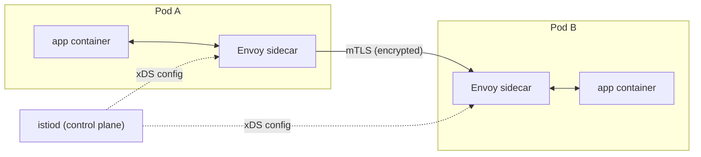
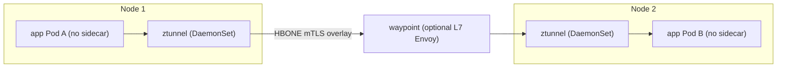
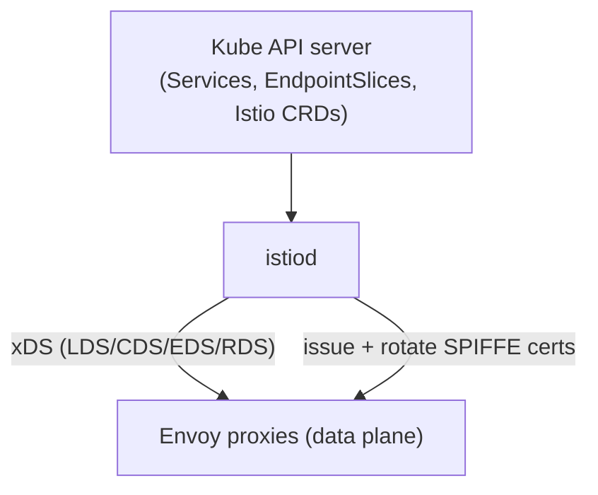

# Service Mesh & Advanced Traffic Management

A **service mesh** is a dedicated infrastructure layer that manages **east-west**
(service-to-service) communication inside a cluster — encryption (mTLS), observability
(golden metrics + traces), and traffic control (retries, timeouts, circuit breaking,
canary shifting) — **without changing application code**. The application keeps making
plain `http://orders/...` calls, and a proxy alongside each workload intercepts every
connection and applies policy.

This topic covers east-west traffic. It builds on `services-networking` (ClusterIP,
kube-proxy, EndpointSlices), `ingress-gateway-api` (north-south, the front door), and
containers from the `docker` domain. For general application security see the `security`
domain; for K8s-specific RBAC/NetworkPolicy see `security-rbac` and
`workload-network-security`. A mesh's mTLS/AuthorizationPolicy is **complementary** to
NetworkPolicy, not a replacement — the two operate at different layers.

> [!KEY-TAKEAWAY]
> A mesh moves cross-cutting networking concerns — encryption, retries, timeouts, circuit
> breaking, traffic shifting, per-call metrics — **out of every application** and into a
> uniform, language-agnostic infrastructure layer. The price is real operational
> complexity and per-hop latency, so a mesh is justified only when you have enough
> services (and enough polyglot/compliance pressure) that solving these problems in
> libraries stops scaling.

---

## The problem a service mesh solves

In a microservices system, every service needs the same non-business concerns:
encryption in transit, retries with backoff, timeouts, circuit breaking, load balancing,
per-request metrics, and distributed tracing. Solving these **in each application**
(via libraries like Netflix Hystrix/Resilience4j/Finagle) has three problems:

1. **Polyglot duplication** — you must reimplement and maintain the same logic in every
   language (Java, Go, Python, Node), and versions drift.
2. **Coupled upgrades** — changing a timeout or retry policy means rebuilding and
   redeploying application code.
3. **Inconsistency** — teams configure resilience differently, so behavior varies and is
   hard to audit centrally (e.g. "is *all* internal traffic encrypted?").

A mesh solves this by pushing those concerns into a **proxy** next to each workload. The
proxy is configured centrally and declaratively, so a platform team sets one policy and it
applies uniformly — no app rebuilds, any language.

**What a mesh gives you, code-free:**

| Capability | Without mesh | With mesh |
|---|---|---|
| mTLS between services | Per-app TLS libraries + cert rotation | Automatic, transparent, auto-rotated certs |
| Retries / timeouts | Per-app resilience library | Declarative policy (e.g. `VirtualService`) |
| Circuit breaking | Per-app (Resilience4j) | `DestinationRule` outlier detection |
| Canary traffic split | Two Services + client logic | Weighted routing rule |
| Golden metrics (rate/error/latency) | Instrument every app | Emitted by the proxy for free |
| Distributed tracing | Full manual instrumentation | Proxy propagates + samples spans |

> [!INTERVIEW]
> The one-line answer interviewers want: "A service mesh offloads cross-cutting networking
> — mTLS, retries, timeouts, circuit breaking, traffic shifting, and telemetry — from
> application code into a per-workload proxy that a control plane configures declaratively."
> Note the honest caveat: tracing is only *partially* free — the proxy propagates and times
> spans, but apps still must **forward the trace-context headers** across their own internal
> calls for traces to connect end to end.

---

## The sidecar data-plane model

The classic mesh architecture splits into a **control plane** (the brain — computes and
distributes config) and a **data plane** (the muscle — the proxies that actually move
bytes). In the **sidecar model**, the data plane is one proxy container injected into
**every Pod**, sharing the Pod's network namespace.

**How injection works (Istio):** you label a namespace `istio-injection=enabled` (or use a
revision label). A **mutating admission webhook** intercepts Pod creation and rewrites the
Pod spec to add the Envoy proxy container (`istio-proxy`) plus an init container that
programs iptables rules. Because the sidecar shares the Pod's network namespace, those
iptables rules **transparently redirect all inbound and outbound TCP** through Envoy — the
app is unaware.



The control plane pushes configuration to every proxy using **xDS** (the Envoy discovery
APIs: LDS/listeners, CDS/clusters, EDS/endpoints, RDS/routes). All app-to-app traffic
actually flows **proxy → proxy**, and the proxies establish mTLS between themselves.

**Trade-offs of sidecars:**

- **Pros:** strong per-Pod isolation, mature, full L7 features per workload, works on any
  CNI.
- **Cons:** a proxy container per Pod means **resource overhead** (CPU/memory × every Pod)
  and **added latency** (two extra proxy hops per request). Lifecycle coupling is a classic
  gotcha (see warning). Sidecar **upgrades** require restarting every Pod to pick up a new
  proxy version.

> [!WARNING]
> Pre-1.28, sidecars were ordinary containers, so two race conditions bit hard: (1) the app
> could start **before** the proxy was ready and its early calls failed, and (2) in a Job,
> the app finished but the **sidecar kept running**, so the Pod never completed. Kubernetes
> **native sidecar containers** (init containers with `restartPolicy: Always`, enabled by
> default/beta in v1.29, GA in v1.33) fix both: native sidecars start before app containers
> and are terminated after them.

---

## Ambient / sidecar-less mode

**Ambient mesh** (Istio) is a newer data-plane architecture that removes per-Pod sidecars
to cut overhead and decouple mesh upgrades from application Pods. It splits the mesh into
two layers you can adopt independently:

- **ztunnel ("zero-trust tunnel")** — a **per-node** L4 proxy (a DaemonSet, written in
  Rust) that handles mTLS, L4 authorization, and TCP-level telemetry for all meshed Pods on
  that node. It does **not** parse HTTP or terminate L7. It tunnels traffic between nodes
  using **HBONE** (HTTP-Based Overlay Network Encapsulation — mTLS over HTTP CONNECT on port
  15008).
- **waypoint proxy** — an **optional** per-namespace (or per-service-account) Envoy
  **Deployment** that adds L7 features (HTTP routing, L7 authorization, retries,
  `VirtualService` behavior). You deploy it only for the namespaces that need L7.



This gives a **layered adoption path**: start with no mesh, turn on the secure L4 overlay
(mTLS + identity) with **zero proxies in your Pods**, then add waypoints only where you need
L7 policy. Because proxies aren't in the Pod, you can **upgrade the mesh without restarting
applications**, and idle overhead scales per-node rather than per-Pod.

> [!TIP]
> Ambient mode reached **GA in Istio 1.24 (November 2024)** — ztunnel, waypoints, and the
> APIs are now Stable. For interviews: "sidecar = one Envoy per Pod, full L7 everywhere,
> higher overhead; ambient = per-node ztunnel for L4/mTLS + optional per-namespace waypoint
> for L7, lower overhead and no per-Pod proxy." Both modes can coexist and interoperate in
> one mesh.

---

## Istio control plane: istiod

Istio's control plane is a single binary called **istiod**, which consolidates what were
once separate components (Pilot, Citadel, Galley). Its jobs:

- **Configuration / service discovery (Pilot):** watches the K8s API for Services,
  EndpointSlices, and Istio CRDs (VirtualService, DestinationRule, Gateway, etc.), converts
  them into Envoy **xDS** config, and pushes to every proxy.
- **Certificate authority (Citadel):** acts as the mesh CA. It issues each workload an
  identity-bearing certificate (a **SPIFFE** SVID encoding the service account, e.g.
  `spiffe://cluster.local/ns/prod/sa/orders`) and **auto-rotates** it (default ~24h). This
  is what makes automatic mTLS possible with no app involvement.
- **Sidecar injection webhook:** the mutating webhook endpoint used to inject proxies.



**Key operational points:**

- The **data plane keeps forwarding traffic even if istiod is down** — proxies run on their
  last-known config. istiod being unavailable stops *config updates* and *new cert
  issuance*, not existing traffic. This decoupling is a common interview point.
- Istio supports **canary control-plane upgrades** via **revisions**: run istiod `1-24` and
  `1-25` side by side, migrate namespaces by relabeling, and roll back by relabeling.

---

## Istio traffic management: VirtualService, DestinationRule, Gateway

Istio configures routing through CRDs. The two you must know:

- **`VirtualService`** — the **routing rules**: "for requests to host `reviews`, match on
  header/path/weight and send them to subset X." This is where **traffic splitting, HTTP
  match conditions, rewrites, retries, timeouts, mirroring, and fault injection** live.
- **`DestinationRule`** — policies applied **after** routing decides a destination:
  it defines named **subsets** (by Pod labels, e.g. `version: v1`), the **load-balancing**
  algorithm, connection-pool limits, and **outlier detection** (circuit breaking).

A `Gateway` configures a mesh **ingress/egress** proxy (north-south edge) — the L4-L6
listener (port, protocol, TLS) — and is bound to a `VirtualService` for L7 routing.

Weighted canary split — 90% to v1, 10% to v2:

```yaml
apiVersion: networking.istio.io/v1
kind: VirtualService
metadata:
  name: reviews
spec:
  hosts: ["reviews"]
  http:
    - route:
        - destination: { host: reviews, subset: v1 }
          weight: 90
        - destination: { host: reviews, subset: v2 }
          weight: 10
---
apiVersion: networking.istio.io/v1
kind: DestinationRule
metadata:
  name: reviews
spec:
  host: reviews
  subsets:
    - name: v1
      labels: { version: v1 }
    - name: v2
      labels: { version: v2 }
```

> [!WARNING]
> A `VirtualService` that routes to a `subset` **requires a matching `DestinationRule`
> defining that subset** — the subset name is not resolved from Pod labels directly. Forget
> the `DestinationRule` (or misname the subset) and Envoy gets no cluster for it, producing
> `503 NR`/`no healthy upstream` even though the Pods are perfectly healthy.

---

## mTLS and zero-trust authentication

A mesh's headline security feature is **automatic mutual TLS**: every proxy authenticates
both ends of a connection with certificates and encrypts the traffic — turning a flat,
plaintext internal network into a **zero-trust** one where identity is cryptographic, not
IP-based.

**Identity:** each workload's cert encodes a **SPIFFE** identity derived from its
**ServiceAccount** (`spiffe://<trust-domain>/ns/<namespace>/sa/<serviceaccount>`). Policy is
written against these identities, not IPs.

Two Istio resources govern this:

- **`PeerAuthentication`** — controls **whether mTLS is required**. Modes: `PERMISSIVE`
  (accept both plaintext and mTLS — the default, essential for **gradual migration**) and
  `STRICT` (reject any non-mTLS traffic).
- **`AuthorizationPolicy`** — L7/L4 **authZ**: allow/deny rules by source identity,
  namespace, HTTP method, path, etc. — e.g. "only the `sa/checkout` service account may
  `POST /charge` on `payments`."

```yaml
apiVersion: security.istio.io/v1
kind: PeerAuthentication
metadata:
  name: default
  namespace: prod
spec:
  mtls:
    mode: STRICT          # reject any plaintext traffic in prod
---
apiVersion: security.istio.io/v1
kind: AuthorizationPolicy
metadata:
  name: payments-allow-checkout
  namespace: prod
spec:
  selector:
    matchLabels: { app: payments }
  action: ALLOW
  rules:
    - from:
        - source:
            principals: ["cluster.local/ns/prod/sa/checkout"]
      to:
        - operation:
            methods: ["POST"]
            paths: ["/charge"]
```

> [!WARNING]
> Flipping to `mtls.mode: STRICT` **before every client is meshed** breaks traffic instantly
> — unmeshed clients (or Prometheus scraping app ports, or a non-mesh health checker) send
> plaintext and get rejected. The safe path: keep `PERMISSIVE`, mesh all clients, verify
> mTLS is actually in use, *then* go `STRICT`. `AuthorizationPolicy` has another classic
> gotcha: as soon as **one** `ALLOW` policy selects a workload, everything **not** matched is
> **denied by default** — a single narrow allow-rule can lock out traffic you forgot.

---

## Traffic splitting, canary, fault injection

Because the mesh sits on every request, it can shape traffic in ways plain K8s Services
cannot (a Service does flat round-robin across all Ready endpoints — no weights, no header
awareness).

- **Weighted routing (canary / blue-green):** send N% to a new version by weight (shown
  above). Combined with a progressive-delivery controller (**Argo Rollouts** or **Flagger**),
  the mesh's weights are shifted automatically while golden metrics are watched — see
  `gitops-continuous-delivery`.
- **Request routing by attributes:** route by header/cookie/path — e.g. send only
  `x-user: beta` to v2 (dark launch to internal users) while everyone else stays on v1.
- **Traffic mirroring (shadowing):** copy live traffic to a new version, discarding its
  responses — test with production traffic at zero user risk.
- **Fault injection:** deliberately inject **delays** or **aborts** (e.g. return HTTP 500 for
  0.1% of calls) to test that clients' retries/timeouts/fallbacks actually work — chaos
  testing without touching app code.

```yaml
# Inject a 5s delay into 10% of calls, and abort 0.1% with HTTP 500
http:
  - fault:
      delay:
        percentage: { value: 10 }
        fixedDelay: 5s
      abort:
        percentage: { value: 0.1 }
        httpStatus: 500
    route:
      - destination: { host: ratings, subset: v1 }
```

> [!TIP]
> Header/weight-based routing is why a mesh beats "just make two Deployments." Two
> Deployments behind one Service give you only crude replica-ratio splitting (10% traffic
> means 1 of 10 Pods), and you can't route by request attributes at all.

---

## Resilience: retries, timeouts, circuit breaking

The mesh applies resilience uniformly at the proxy, so a Python and a Java service get
identical behavior from one policy.

- **Timeouts** — cap how long a proxy waits for a response (`VirtualService.http.timeout`).
  Prevents one slow dependency from tying up caller resources indefinitely.
- **Retries** — retry failed requests with a budget and conditions
  (`http.retries: {attempts, perTryTimeout, retryOn}`). **Gotcha:** retries only make sense
  for **idempotent** requests; blindly retrying a non-idempotent `POST` can double-charge.
- **Circuit breaking (outlier detection)** — in the `DestinationRule`, Envoy **ejects** an
  endpoint that returns too many consecutive 5xx errors, temporarily removing it from the
  load-balancing pool so failures don't cascade. **Connection-pool limits** cap concurrent
  connections/requests, shedding load rather than overwhelming a backend.

```yaml
apiVersion: networking.istio.io/v1
kind: DestinationRule
metadata:
  name: ratings
spec:
  host: ratings
  trafficPolicy:
    connectionPool:
      tcp: { maxConnections: 100 }
      http: { http1MaxPendingRequests: 10, maxRequestsPerConnection: 1 }
    outlierDetection:
      consecutive5xxErrors: 5
      interval: 10s
      baseEjectionTime: 30s
      maxEjectionPercent: 50
```

> [!WARNING]
> **Retry storms / cascading retries:** if every hop in a call chain retries 3×, a failure
> at the bottom is amplified exponentially up the stack (3×3×3 = 27 attempts), turning a
> small blip into a self-inflicted outage. Mitigate with **retry budgets** (Linkerd) or a
> small `attempts` count, and don't stack retries at every layer. Also cap
> `maxEjectionPercent` so outlier detection can't eject your whole fleet at once.

---

## Istio vs Linkerd vs Cilium

The three most common east-west choices differ sharply in philosophy and dataplane.

| Aspect | **Istio** | **Linkerd** | **Cilium (mesh)** |
|---|---|---|---|
| Data plane | **Envoy** (C++), sidecar or ambient ztunnel/waypoint | Purpose-built **Rust "micro-proxy"** (`linkerd2-proxy`) | **eBPF** in the kernel + Envoy only when L7 needed |
| Philosophy | Most features, most knobs, most complex | Minimal, opinionated, simplest to run | Sidecar-less via eBPF; also *is* the CNI |
| Proxy footprint | Full Envoy per Pod (sidecar) | Tiny Rust proxy per Pod | No per-Pod proxy; per-node eBPF/agent |
| Config surface | Large (VirtualService, DestinationRule, Gateway…) | Deliberately small | CiliumNetworkPolicy + Gateway API |
| mTLS | Yes (SPIFFE) | Yes (automatic, on by default) | Yes (mutual auth, WireGuard/mTLS) |
| Governance | CNCF graduated | CNCF graduated | CNCF graduated |

**How to choose (interview framing):**

- **Linkerd** — you want a mesh with the **least operational overhead**, mostly for mTLS +
  golden metrics + basic reliability, and don't need Istio's advanced L7 knobs. Its Rust
  micro-proxy is smaller and lower-latency than full Envoy.
- **Istio** — you need the **richest traffic-management feature set** (fine-grained routing,
  fault injection, egress control, multi-cluster), and ambient mode now blunts the classic
  "too heavy" objection.
- **Cilium** — you're already using Cilium as your **CNI** and want mesh-like capabilities
  (mTLS, L7 policy, observability via Hubble) implemented largely in the **kernel via eBPF**,
  avoiding per-Pod proxies for L3/L4 entirely.

> [!TIP]
> "eBPF vs sidecar" is a hot topic: eBPF handles L3/L4 (routing, policy, encryption) in the
> kernel with no userspace proxy, which is very efficient — but **full L7 processing (HTTP
> parsing, retries) still needs a userspace proxy** (Cilium uses Envoy per-node for that).
> So eBPF reduces, but doesn't fully eliminate, proxies. Istio ambient's ztunnel makes a
> similar L4/L7 split without depending on a specific CNI.

---

## Observability: golden metrics for free

Because the proxy sees every request, a mesh emits the **golden signals** — request
**rate**, **error rate**, and **latency** (distribution/percentiles) — for **every
service-to-service edge**, with **zero application instrumentation**. It also knows the full
service dependency graph, which powers topology views (Kiali for Istio, the Linkerd
dashboard).

What you get without touching app code:

- **Golden metrics** per source→destination pair, exported to Prometheus (see the
  `observability` domain for Prometheus/OTel mechanics).
- **Success rates and latencies** used to gate automated canary analysis (Flagger/Argo
  Rollouts).
- **Distributed tracing** — the proxy **times spans and forwards trace headers**, but apps
  still must **propagate the context headers** (e.g. `traceparent`, `x-request-id`) across
  their own outbound calls, or traces break into disconnected fragments.

> [!INTERVIEW]
> "What do I get for free vs what still needs work?" **Free:** rate/error/latency per edge,
> service topology, mTLS. **Not free:** meaningful *span names/tags inside your code*, and
> **trace-context propagation** across in-process calls — the mesh can't reach into your app
> to thread the header through. This nuance separates people who've actually run a mesh from
> those who've only read the marketing.

---

## Mesh vs Ingress / Gateway API

These solve **different axes** and are usually used **together** (see `ingress-gateway-api`
for the north-south depth).

| | **Ingress / Gateway API** | **Service mesh** |
|---|---|---|
| Traffic axis | **North-south** (client → cluster) | **East-west** (service ↔ service) |
| Primary job | Expose services at the edge, TLS termination, host/path routing | mTLS, resilience, traffic shaping *between* services |
| Scope | The front door | The internal hallways |

The lines blur in two places:

1. A mesh has its **own ingress gateway** (Istio `Gateway`) that *also* does north-south —
   so a meshed cluster may use the Istio ingress gateway instead of a separate Ingress
   controller.
2. The **Gateway API's GAMMA initiative** extends `HTTPRoute` to configure **east-west mesh**
   routing with the same portable, vendor-neutral API — so the mesh and edge increasingly
   share one config model. Linkerd and Istio both support Gateway API for mesh routing.

> [!KEY-TAKEAWAY]
> Ingress/Gateway = **getting in**; mesh = **moving around inside**. They compose. The
> Gateway API is becoming the unifying config surface for both (north-south via `Gateway` +
> `HTTPRoute`, east-west via GAMMA), which is why "will the Gateway API absorb the mesh
> config layer?" is a live design question.

---

## When a mesh is worth it (and when it's overkill)

A mesh is powerful but **not free**: it adds a control plane to operate and upgrade, a proxy
(latency + CPU/memory) on every hop, a large new config surface, and a steep debugging
learning curve (now you debug Envoy/xDS too). Adopt it when the benefits outweigh that cost.

**Signs a mesh is worth it:**

- **Many services** (dozens+) where reimplementing mTLS/retries/metrics per-app doesn't
  scale.
- **Polyglot** stack — you can't standardize on one language's resilience library.
- **Compliance** demands **encryption-in-transit everywhere** and auditable
  service-to-service authZ (zero-trust).
- You need **advanced traffic control** (automated canaries, mirroring, per-header routing)
  across many teams.

**Signs it's overkill (start simpler):**

- A **handful of services** — a shared resilience library (Resilience4j) or a smart client
  is cheaper and easier to reason about.
- You only need **north-south** routing + TLS → the **Gateway API / an Ingress controller**
  suffices.
- You only need **encryption in transit** without L7 policy → **mTLS via a CNI** (Cilium
  WireGuard) or app-level TLS may be enough.
- You only need **network segmentation** → **NetworkPolicy** (see `workload-network-security`)
  is far simpler than a mesh.

> [!WARNING]
> A common anti-pattern is adopting a full mesh to solve a **single** need (say, mTLS) and
> inheriting all the operational cost of the control plane, upgrades, and per-hop latency.
> Match the tool to the actual requirement: mesh for the *combination* of encryption +
> resilience + traffic control + observability across *many* services — otherwise reach for
> the narrower tool (NetworkPolicy, Gateway API, a library, or ambient-mode L4-only).

---

## Common follow-up questions

- **"Does the app know it's in a mesh?"** No — sidecar/ztunnel intercept traffic via
  iptables/eBPF transparently. The app makes ordinary calls; the proxy applies policy. The
  one thing apps *should* still do is propagate trace-context headers.
- **"What happens to traffic if the control plane (istiod) goes down?"** Existing traffic
  keeps flowing on the proxies' last-known config. You lose *config updates* and *new cert
  issuance* until it recovers — not existing connectivity.
- **"Sidecar vs ambient — the elevator pitch?"** Sidecar = one Envoy per Pod, full L7
  everywhere, higher overhead, restart-to-upgrade. Ambient = per-node ztunnel for
  L4/mTLS + optional per-namespace waypoint for L7, lower overhead, upgrade without app
  restarts. GA in Istio 1.24.
- **"Mesh mTLS vs NetworkPolicy — same thing?"** No. NetworkPolicy is L3/L4 allow/deny by
  Pod selector/IP (firewall). Mesh mTLS is cryptographic identity + encryption + L7 authZ.
  Use both: NetworkPolicy for coarse segmentation, mesh for identity-based zero-trust.
- **"Why did my VirtualService return 503 no-healthy-upstream when Pods are healthy?"**
  Almost always a missing/mismatched `DestinationRule` subset, or `STRICT` mTLS rejecting an
  unmeshed client. Check subsets and `PeerAuthentication` mode.
- **"Are retries always safe?"** No — only for idempotent operations, and beware retry
  storms amplifying failures up a call chain. Use retry budgets and small attempt counts.

## References

- Istio docs — Architecture: https://istio.io/latest/docs/ops/deployment/architecture/
- Istio docs — Ambient mode overview: https://istio.io/latest/docs/ambient/overview/
- Istio 1.24 release — Ambient GA announcement: https://istio.io/latest/news/releases/1.24.x/announcing-1.24/
- Istio docs — Traffic management (VirtualService/DestinationRule): https://istio.io/latest/docs/concepts/traffic-management/
- Istio docs — Security (mTLS, PeerAuthentication, AuthorizationPolicy): https://istio.io/latest/docs/concepts/security/
- Linkerd docs — Features: https://linkerd.io/2/features/
- Linkerd docs — Architecture: https://linkerd.io/2/reference/architecture/
- Cilium docs — Service Mesh: https://docs.cilium.io/en/stable/network/servicemesh/
- SPIFFE — identity spec: https://spiffe.io/docs/latest/spiffe-about/overview/
- Kubernetes docs — Sidecar containers (native): https://kubernetes.io/docs/concepts/workloads/pods/sidecar-containers/
- Envoy docs — xDS API overview: https://www.envoyproxy.io/docs/envoy/latest/api-docs/xds_protocol
- Gateway API — GAMMA (mesh) initiative: https://gateway-api.sigs.k8s.io/mesh/
