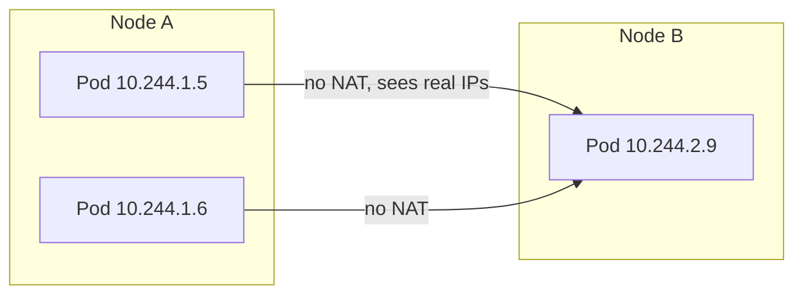
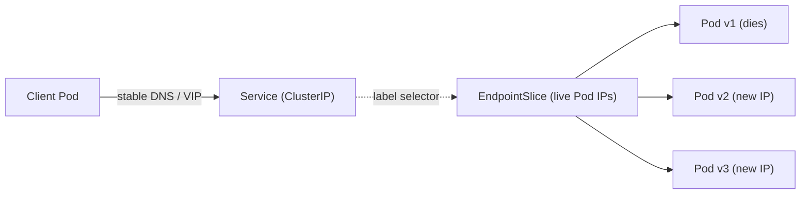
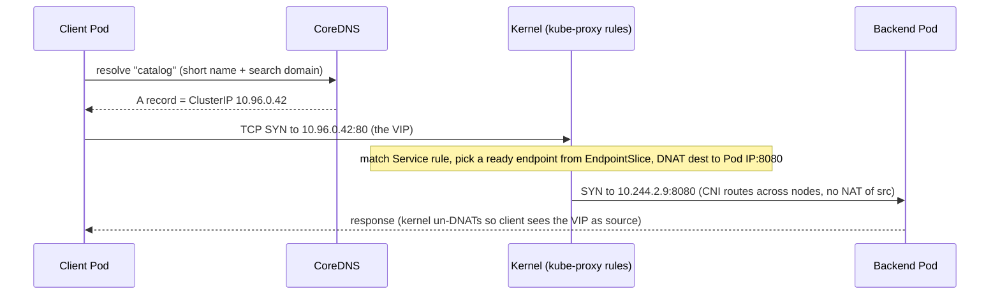

# Services & Cluster Networking

Kubernetes networking has one job that everything else builds on: give every Pod a
routable identity, then paper over the fact that Pods are cattle (created and destroyed
constantly, each with a fresh IP) so clients can reach a *role* ("the payments API")
instead of a specific, doomed Pod. This topic covers the flat network model, how the CNI
implements it, and the `Service` abstraction (ClusterIP / NodePort / LoadBalancer /
ExternalName / headless) that turns a churning set of Pods into a stable virtual endpoint,
plus the data-plane machinery — EndpointSlices, kube-proxy, and cluster DNS — that makes a
request actually land on a Pod.

> [!INTERVIEW]
> The single most common opening question here is *"a Pod's IP changes every time it
> restarts — how do other Pods reliably talk to it?"* The expected answer is the whole
> chain: **Service (stable VIP + DNS name) → label selector → EndpointSlice (live Pod IPs)
> → kube-proxy (programs the VIP → Pod DNAT rules) → CNI (delivers the packet)**. If you can
> narrate that flow you own this topic.

This topic assumes container basics from the **docker** domain (a Pod's containers share a
network namespace the same way Docker containers get one). Cloud-specific load balancer
depth for EKS lives in the **aws** domain; here we stay cloud-agnostic.

## The Kubernetes network model

Kubernetes imposes a **flat, NAT-free network model** with three fundamental requirements
that every conforming cluster network must satisfy:

1. **Every Pod gets its own unique, cluster-routable IP address.** Not a port on the node —
   a real IP. A Pod is a *network peer*, like a lightweight VM.
2. **Pods can communicate with any other Pod on any node without NAT** — the source Pod
   sees the destination's real Pod IP, and the destination sees the source's real Pod IP.
3. **Agents on a node** (kubelet, system daemons) **can reach all Pods on that node.**

Inside a Pod, all containers share a single network namespace (the same
[Linux namespace](../../docker/docker-networking/concepts.md) mechanism Docker uses): they
share the Pod IP and localhost, and reach each other over `127.0.0.1`. This is why two
containers in one Pod cannot both bind the same port.

> [!KEY-TAKEAWAY]
> The model is deliberately "boring": it makes the cluster look like one flat L3 network
> where every Pod is directly addressable. That simplicity is why Services, DNS, and
> policies can be layered cleanly on top — none of them have to reason about NAT hairpins
> or port-mapping between Pods.

Why not port-mapping (the Docker single-host default)? Port-mapping forces apps to
coordinate host ports and makes service discovery a nightmare. A flat IP-per-Pod model lets
apps use their natural ports and treats the cluster like a datacenter LAN.



> [!WARNING]
> The model requires *no NAT for Pod-to-Pod traffic*, but traffic **entering** the cluster
> via NodePort or a load balancer, or **leaving** to the internet, generally *is* NATed. So
> "Kubernetes has no NAT" is wrong — it is "no NAT between Pods." That distinction is why
> preserving a real client IP for external traffic needs `externalTrafficPolicy: Local`.

## CNI: implementing the network model

Kubernetes itself does **not** implement Pod networking. The kubelet delegates to a
**CNI (Container Network Interface)** plugin — a spec/binary contract — to wire each Pod's
network namespace: allocate the Pod IP, create the veth pair, and set up routes so the
flat-model guarantees hold. This is the same "core does the mechanism-agnostic part,
plugins do the specifics" pattern as CRI (runtime) and CSI (storage).

Common CNI plugins and their approaches:

| Plugin | Approach | Notable feature |
|---|---|---|
| **flannel** | Overlay (VXLAN) or host-gw | Simple, no NetworkPolicy on its own |
| **Calico** | L3 routing (BGP) or overlay | NetworkPolicy enforcement, high performance |
| **Cilium** | eBPF datapath | NetworkPolicy, can replace kube-proxy, L7 policy, observability |
| **AWS VPC CNI** | Real VPC IPs on ENIs | Pods get native VPC addresses (EKS) |

> [!TIP]
> If a Pod is stuck in `ContainerCreating` with a `NetworkPlugin cni failed to set up pod`
> event, the CNI is the suspect — the plugin isn't installed/healthy, or the Pod CIDR is
> exhausted. Pod networking is broken *before* any Service ever comes into play.

Advanced note: `NetworkPolicy` is only *enforced* if the CNI supports it (Calico, Cilium do;
plain flannel does not). Applying a NetworkPolicy under a non-enforcing CNI silently does
nothing — a classic gotcha. NetworkPolicy depth lives in **workload-network-security**.

## Why Pod IPs are ephemeral → Services

Pod IPs are **not stable**. A Pod that crashes, is rescheduled, is scaled, or is replaced
during a rolling update comes back with a **new IP** (and the old one is recycled). A
Deployment's ReplicaSet churns Pods constantly. So hard-coding a Pod IP — or even
discovering it once and caching it — is broken by design.

A **Service** solves this by providing a **stable identity** in front of a dynamic set of
Pods:

- A stable **virtual IP (ClusterIP)** that lives for the life of the Service.
- A stable **DNS name** (`my-svc.my-namespace.svc.cluster.local`).
- **Load balancing** across the currently-healthy backing Pods.

Clients target the Service; Kubernetes continuously keeps the Service's backend list in
sync with reality. The Pod may die; the Service name does not.



> [!KEY-TAKEAWAY]
> Services exist because **Pods are ephemeral and their IPs are unstable**. The Service is
> the stable indirection layer; everything else in this topic is the plumbing that keeps
> that indirection honest and fast.

## Services and label selectors

A Service does **not** reference Pods by name or IP. It uses a **label selector** to define
its membership dynamically. Any Pod whose labels match becomes a backend automatically; a
Pod whose labels stop matching (or that is deleted) drops out. This loose coupling is the
heart of the declarative model.

```yaml
apiVersion: v1
kind: Service
metadata:
  name: payments
spec:
  selector:
    app: payments          # matches Pods labelled app=payments
  ports:
    - name: http
      port: 80             # port the Service listens on (the VIP port)
      targetPort: 8080     # port on the Pod/container
      protocol: TCP
```

Key points:

- `port` is the Service's own port (what clients hit); `targetPort` is the container port.
  If omitted, `targetPort` defaults to `port`.
- `targetPort` can be a **named port** (`targetPort: http`) referencing a container's named
  `containerPort`, which decouples the Service from the numeric port.
- The selector is evaluated continuously by the control plane, not once at creation.

> [!WARNING]
> A Service with a **selector that matches no Pods** is perfectly valid — it just has an
> empty EndpointSlice, so connections to it fail (connection refused / timeout) with no
> error on the Service object itself. `kubectl get endpointslices -l kubernetes.io/service-name=<svc>`
> showing no ready addresses is the tell. The usual cause is a **selector/label mismatch**
> (typo, wrong key) or all Pods failing their readiness probe.

A Service **without** a selector is also legal — you then manage its EndpointSlices manually
(useful for pointing at an external database or another namespace's endpoints).

## Endpoints and EndpointSlices

The **EndpointSlice controller** (part of the control plane) watches Services and their
selected Pods and maintains the actual list of backend IP:port targets. The **ready**
condition of each endpoint is driven by the Pod's **readiness probe** — an unready Pod is
excluded from the ready set, so it receives no Service traffic.

- The legacy **Endpoints** object (`kind: Endpoints`) put *all* backends in a single object.
  For a Service with thousands of Pods, every change rewrote a huge object and shipped it
  to every node — a scalability bottleneck.
- **EndpointSlices** (GA in **Kubernetes 1.21**) shard backends into slices of **up to 100
  endpoints each** by default (configurable up to **1000** via the kube-controller-manager
  `--max-endpoints-per-slice` flag). A change touches only one small slice, not the world.
  EndpointSlices are now the source of truth kube-proxy consumes; the old `Endpoints` API is
  effectively deprecated in favor of them.

```bash
kubectl get endpointslices -l kubernetes.io/service-name=payments
kubectl describe endpointslice payments-abc12
# shows addresses, ready/serving/terminating conditions, nodeName, zone
```

> [!TIP]
> When "the Service exists but no traffic flows," check the EndpointSlice first. Empty ready
> addresses = no matching *ready* Pods → almost always a selector mismatch or failing
> readiness probes. This is faster than staring at the Service YAML.

EndpointSlices also carry **topology** (`nodeName`, `zone`) per endpoint, which is what
enables topology-aware routing (below).

## ClusterIP Services

`ClusterIP` is the **default** Service type. It allocates a **stable virtual IP** from the
cluster's service CIDR, reachable **only from inside the cluster**, and load-balances to the
backing Pods. This is the workhorse for internal service-to-service traffic (microservice →
microservice, app → cache).

```yaml
apiVersion: v1
kind: Service
metadata:
  name: catalog
spec:
  type: ClusterIP        # default; can be omitted
  selector:
    app: catalog
  ports:
    - port: 80
      targetPort: 8080
```

- The ClusterIP is **virtual** — no interface owns it; it exists only as forwarding rules
  programmed by kube-proxy on every node. You cannot `ping` it in the usual ICMP sense in
  many setups, but TCP/UDP to `ClusterIP:port` works.
- It is stable for the Service's lifetime. You can pin one with `spec.clusterIP: 10.96.0.10`,
  or set `clusterIP: None` to make the Service **headless** (see below).
- All other externally-facing types (`NodePort`, `LoadBalancer`) are built **on top of** a
  ClusterIP — they allocate a ClusterIP and add reachability layers around it.

## NodePort Services

`NodePort` exposes the Service on a **static port on every node's IP**, in the range
**30000–32767** by default (`--service-node-port-range`). Traffic to `<AnyNodeIP>:<nodePort>`
is forwarded to the Service (and thus to a backing Pod), even if no backing Pod runs on that
particular node.

```yaml
apiVersion: v1
kind: Service
metadata:
  name: web
spec:
  type: NodePort
  selector:
    app: web
  ports:
    - port: 80
      targetPort: 8080
      nodePort: 30080     # optional; auto-assigned from range if omitted
```

- Creating a NodePort **also creates a ClusterIP** — NodePort is a superset.
- Every node listens on the port, so a client can hit any node and reach the Service; this
  is how bare-metal setups and simple demos expose apps without a cloud LB.
- By default the client IP is **SNAT'd** (source-NAT) when the packet is forwarded to a Pod
  on another node, so the Pod sees a node IP, not the real client. Set
  `externalTrafficPolicy: Local` to preserve the client IP (traffic only goes to Pods on the
  node that received it, and nodes with no local Pod fail the health check).

> [!WARNING]
> NodePort is rarely the right *production* front door: it exposes a high, unfriendly port on
> every node, offers no TLS termination or hostname routing, and couples you to node IPs. In
> production you usually put a `LoadBalancer` and/or an **Ingress/Gateway** (see the
> **ingress-gateway-api** topic) in front instead.

## LoadBalancer Services

`LoadBalancer` provisions an **external cloud load balancer** (via the cloud
provider/controller) that fronts the Service and forwards to the nodes. It builds on
NodePort: internally it still gets a ClusterIP and (by default) a NodePort that the cloud LB
targets.

```yaml
apiVersion: v1
kind: Service
metadata:
  name: web-lb
spec:
  type: LoadBalancer
  selector:
    app: web
  ports:
    - port: 80
      targetPort: 8080
```

- The cloud controller manager watches for `type: LoadBalancer` and calls the cloud API
  (AWS ELB/NLB, GCP LB, Azure LB) to provision an external IP/hostname, populated back into
  `status.loadBalancer.ingress`.
- On bare metal there is no cloud API, so you need something like **MetalLB** or a
  cloud-provider-style controller, otherwise the external IP stays `<pending>` forever.
- `externalTrafficPolicy: Local` preserves the real client IP and avoids the extra node hop,
  at the cost of imbalanced distribution (LB must health-check which nodes have Pods).
- `allocateLoadBalancerNodePorts: false` (defaults `true`) lets LB implementations that route
  **directly to Pods** skip node-port allocation.

> [!TIP]
> Each `type: LoadBalancer` Service typically provisions its **own** cloud LB, which gets
> expensive and slow at scale. That economic reality is the main reason teams front many
> Services with a single **Ingress/Gateway** (one LB, host/path routing to many Services)
> rather than one LoadBalancer per Service.

## ExternalName Services

`ExternalName` is the odd one out: it has **no selector, no ClusterIP, no proxying, and no
EndpointSlices**. It simply maps the Service name to an external DNS name by returning a
**CNAME** record from cluster DNS.

```yaml
apiVersion: v1
kind: Service
metadata:
  name: prod-db
spec:
  type: ExternalName
  externalName: mydb.rds.amazonaws.com
```

Now in-cluster clients can resolve `prod-db.default.svc.cluster.local`, and DNS returns a
CNAME to `mydb.rds.amazonaws.com`. This gives you a **stable internal name** for an external
dependency, so you can later swap the target (or point it at an in-cluster Service) without
changing client config.

> [!WARNING]
> Because ExternalName works purely at the DNS/CNAME layer, kube-proxy is **not** involved —
> there is no VIP and **no port remapping**. Any `ports` you list on an ExternalName Service
> are informational only. It also does not help with protocols where the client validates the
> hostname (e.g. TLS SNI/cert CN) against the *original* name — the client connects to the
> CNAME target and sees that host's certificate.

## Headless Services

A **headless Service** is a Service with `clusterIP: None`. Kubernetes allocates **no VIP**
and kube-proxy does **no load balancing**. Instead, cluster DNS returns the **A/AAAA records
of the individual backing Pods** directly.

```yaml
apiVersion: v1
kind: Service
metadata:
  name: cassandra
spec:
  clusterIP: None        # headless
  selector:
    app: cassandra
  ports:
    - port: 9042
```

Why you'd want this:

- The client wants to **discover and address individual Pods**, not a random one behind a
  VIP — e.g. clustered databases, peer-to-peer systems, and especially **StatefulSets**.
- With a **StatefulSet** + headless Service, each Pod gets a **stable, predictable DNS name**:
  `pod-0.cassandra.default.svc.cluster.local`, `pod-1.cassandra...`, etc. This stable
  per-Pod identity is exactly what stateful systems (leader election, sharding) rely on.

> [!KEY-TAKEAWAY]
> ClusterIP = "give me *any* healthy Pod behind one VIP." Headless = "give me the *list of
> all* Pods so I can address them individually." StatefulSets pair with a headless Service
> precisely for that stable per-Pod addressability.

## Cluster DNS (CoreDNS)

Every cluster runs a DNS service — **CoreDNS** (the default since ~1.13) — deployed as a
Deployment with its own ClusterIP Service (commonly `kube-dns`). The kubelet configures each
Pod's `/etc/resolv.conf` to use that DNS IP with a search-domain suffix list, so apps can use
short names.

DNS records created for Services:

- **Normal (ClusterIP) Service** → an **A/AAAA record for the Service's VIP**:
  `<service>.<namespace>.svc.cluster.local` → ClusterIP.
- **Headless Service** → **A/AAAA records for each ready Pod IP** (no VIP).
- **ExternalName** → a **CNAME** to `externalName`.
- **SRV records** for named ports; per-Pod records for StatefulSet Pods.

```bash
# From inside a Pod:
nslookup catalog                        # short name, uses search domains
nslookup catalog.default.svc.cluster.local
```

Name resolution and search domains:

- A Pod in namespace `default` can reach a same-namespace Service by **short name**
  (`catalog`) thanks to the search domain `default.svc.cluster.local`.
- To reach another namespace, use `catalog.other-ns` or the FQDN
  `catalog.other-ns.svc.cluster.local`.

> [!WARNING]
> The `ndots:5` default in Pods' `resolv.conf` means names with fewer than 5 dots get the
> search-domain suffixes appended and tried **first**. Resolving an external name like
> `api.stripe.com` (2 dots) triggers several failing internal lookups before the real one —
> a well-known source of DNS latency. Fixes: use a trailing dot (`api.stripe.com.`) to force
> an absolute lookup, tune `dnsConfig.options ndots`, or enable **NodeLocal DNSCache**.

## kube-proxy and Service VIPs (iptables vs IPVS vs nftables)

A ClusterIP is virtual — nothing actually listens on it. **kube-proxy**, a DaemonSet on
every node, watches Services and EndpointSlices from the API server and programs the node's
kernel so that packets destined for a Service VIP get **DNAT'd** to a real Pod IP and load
balanced. kube-proxy handles the *control plane* (programming rules); the kernel does the
actual per-packet forwarding.

Modes (Linux):

| Mode | Mechanism | Characteristics |
|---|---|---|
| **iptables** | netfilter iptables rules; picks a backend at random | **Default.** Rules are evaluated linearly, so rule count (and update cost) grows with Services × endpoints — degrades in very large clusters |
| **IPVS** | in-kernel L4 load balancer with a hash table | O(1)-ish lookup, more LB algorithms (rr, lc, sh…), scales to many Services. **Deprecated as of v1.35** |
| **nftables** | netfilter nftables rules | **GA/stable in v1.33**; modern successor to iptables mode, better performance/scaling; the intended long-term default direction |

Key facts:

- kube-proxy does **NOT sit in the data path** as a userspace proxy in these modes — it only
  *programs* kernel rules. Packets are forwarded by the kernel, not proxied through the
  kube-proxy process. (The very old userspace mode did proxy; it's long gone.)
- Because forwarding is kernel-level DNAT, the ClusterIP works from any node without an extra
  hop through a central proxy.
- Some CNIs (notably **Cilium** with eBPF) can **replace kube-proxy** entirely, implementing
  Service load balancing in eBPF.

```bash
kubectl -n kube-system get ds kube-proxy
# On a node, inspect the programmed rules:
iptables-save | grep <clusterIP>          # iptables mode
ipvsadm -ln                               # IPVS mode
```

> [!INTERVIEW]
> A favorite: *"Where does kube-proxy sit in the request path?"* The strong answer: it
> **does not sit in the path at all** in iptables/IPVS/nftables modes — it's a controller
> that translates Service+EndpointSlice state into **kernel forwarding rules**; the kernel
> then DNATs Service-VIP packets straight to a Pod. Saying "traffic flows *through*
> kube-proxy" is the common wrong answer.

## How a request reaches a Pod (traffic flow)

Putting it together — a client Pod calls `http://catalog/`:



Step by step:

1. **DNS resolution:** the client resolves the Service name to the ClusterIP via CoreDNS.
2. **Connect to VIP:** the client opens a connection to `ClusterIP:port`.
3. **kube-proxy rules (kernel):** netfilter matches the VIP, selects a **ready** endpoint
   from the EndpointSlice (random for iptables, hash/algorithm for IPVS), and **DNATs** the
   destination to that Pod's real IP:targetPort.
4. **CNI delivery:** the packet is routed to the destination Pod — across nodes if needed —
   with **no NAT of the source** for east-west traffic, honoring the flat model.
5. **Return path:** reply packets are un-DNAT'd by conntrack so the client still sees the VIP
   as the peer. Connection affinity is per-connection (all packets of one TCP connection go
   to the same Pod).

> [!KEY-TAKEAWAY]
> The chain is **name → VIP → endpoint selection + DNAT → Pod**. Every failure mode maps to a
> link: DNS broken (CoreDNS), empty endpoints (selector/readiness), no rules (kube-proxy
> down), packet won't route (CNI).

## Session affinity

By default, Service load balancing is **per-connection and effectively random** — successive
requests from the same client may land on different Pods. For workloads that want a client to
stick to one Pod, set **`sessionAffinity: ClientIP`**:

```yaml
spec:
  sessionAffinity: ClientIP
  sessionAffinityConfig:
    clientIP:
      timeoutSeconds: 10800   # default 3 hours; max 86400
```

- Only `None` (default) and `ClientIP` are supported. There is **no cookie-based affinity**
  at the Service layer — that's an L7 concern (Ingress/Gateway/mesh), because Services are L4.
- Affinity is keyed on **source IP**, so it breaks down when many clients share one source IP
  (behind a NAT/proxy) — they all stick to the same Pod — or when the client IP is itself
  SNAT'd before reaching kube-proxy.

> [!WARNING]
> `sessionAffinity: ClientIP` is a crude tool. It does not survive Pod restarts (the endpoint
> disappears), doesn't balance well behind shared NATs, and shouldn't be a substitute for
> making your app **stateless** (externalize session state to Redis/DB). Reach for it only for
> genuinely sticky protocols where L7 affinity isn't available.

## Traffic policies and topology-aware routing

Two `Service` fields control how far kube-proxy is willing to send traffic, trading client-IP
fidelity and locality against even load distribution:

- **`externalTrafficPolicy`** (for NodePort/LoadBalancer external traffic):
  - `Cluster` (default): traffic entering any node can be forwarded to a Pod on **any** node.
    Even balance, but an **extra hop** and the client IP is **SNAT'd** (lost).
  - `Local`: only forward to Pods on the **same node** that received the traffic. **Preserves
    the client IP** and avoids the hop, but nodes with no local Pod are unhealthy to the LB,
    and load can be uneven.
- **`internalTrafficPolicy`** (for in-cluster ClusterIP traffic):
  - `Cluster` (default): route to endpoints cluster-wide.
  - `Local`: route only to endpoints on the **same node** as the client (drops traffic if
    none). Useful for node-local daemons/agents.

**Topology-aware routing** (`trafficDistribution: PreferClose`, or older
`service.kubernetes.io/topology-mode: Auto` hints) tells kube-proxy to **prefer endpoints in
the same zone** as the client, cutting cross-AZ traffic (latency + cloud egress cost) while
still failing over cross-zone when local capacity is insufficient. The topology data comes
from EndpointSlice `zone`/`nodeName` fields.

> [!KEY-TAKEAWAY]
> `Local` policies **preserve client IP / cut hops but risk imbalance and blackholing** on
> Pod-less nodes; `Cluster` **spreads load evenly but SNATs and adds a hop**. Topology-aware
> routing is the middle ground for zone locality. Interviewers love the client-IP-preservation
> trade-off in `externalTrafficPolicy: Local`.

## Multi-port and named-port Services

A Service can expose **multiple ports** (e.g. HTTP + metrics + gRPC). When it does, **every
port entry must be named** (names unique within the Service):

```yaml
spec:
  selector: { app: api }
  ports:
    - name: http
      port: 80
      targetPort: web        # named container port
    - name: metrics
      port: 9090
      targetPort: 9090
```

- Naming lets DNS SRV records and other consumers disambiguate ports.
- `targetPort` may be numeric or a **named container port** — decoupling the Service from the
  container's numeric port so you can change the container port without touching the Service.
- `appProtocol` (e.g. `kubernetes.io/h2c`, `http`, `https`) hints the L7 protocol to
  consumers like Gateways/meshes.

## Common follow-up questions

- **"Pod IP changes on restart — how do clients cope?"** They target the Service's stable VIP
  and DNS name; the EndpointSlice controller keeps the live Pod IPs behind it in sync.
- **"Difference between ClusterIP, NodePort, LoadBalancer?"** Layers: ClusterIP = internal VIP;
  NodePort = ClusterIP + a static port on every node; LoadBalancer = NodePort + a cloud LB.
- **"What is a headless Service and when do you use it?"** `clusterIP: None`, no VIP, DNS
  returns per-Pod IPs; used for StatefulSets / clustered apps that address individual Pods.
- **"Where does kube-proxy sit in the data path?"** Nowhere — it programs kernel
  (iptables/IPVS/nftables) rules; the kernel DNATs Service-VIP packets to Pods.
- **"Service exists but connections fail — how do you debug?"** Check EndpointSlices for ready
  addresses (selector/readiness), then CoreDNS resolution, then kube-proxy health, then CNI.
- **"How do you preserve the real client IP for external traffic?"** `externalTrafficPolicy:
  Local` (with the imbalance / node-health trade-off).
- **"iptables vs IPVS vs nftables mode?"** iptables = default but linear-scan scaling; IPVS =
  hash-table, more algorithms, now deprecated (v1.35); nftables = GA v1.33, the modern path.
- **"Why prefer Ingress over many LoadBalancer Services?"** One cloud LB with host/path routing
  and TLS termination instead of one costly LB per Service.
- **"How does a Pod reach a Service in another namespace?"** Use the cross-namespace name
  `svc.other-ns` or the FQDN `svc.other-ns.svc.cluster.local`.

## References

- Kubernetes docs — [Service](https://kubernetes.io/docs/concepts/services-networking/service/)
- Kubernetes docs — [Virtual IPs and Service Proxies (kube-proxy modes)](https://kubernetes.io/docs/reference/networking/virtual-ips/)
- Kubernetes docs — [EndpointSlices](https://kubernetes.io/docs/concepts/services-networking/endpoint-slices/)
- Kubernetes docs — [The Kubernetes network model / Cluster Networking](https://kubernetes.io/docs/concepts/cluster-administration/networking/)
- Kubernetes docs — [DNS for Services and Pods](https://kubernetes.io/docs/concepts/services-networking/dns-pod-service/)
- Kubernetes docs — [Topology Aware Routing](https://kubernetes.io/docs/concepts/services-networking/topology-aware-routing/)
- CNI specification — [github.com/containernetworking/cni](https://github.com/containernetworking/cni)
- Related topics in this library: `ingress-gateway-api`, `workload-network-security`, `pods-workload-controllers`, and the `docker/docker-networking` container-networking primer.
