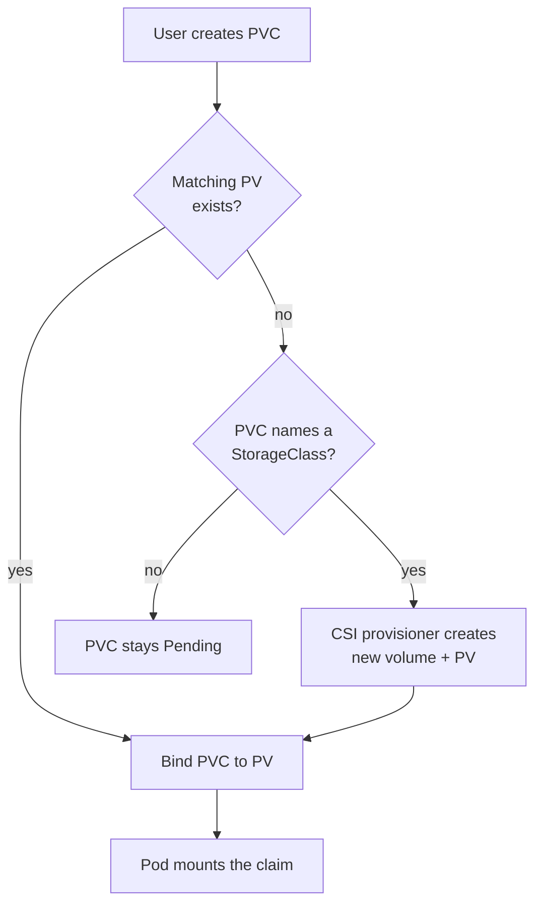
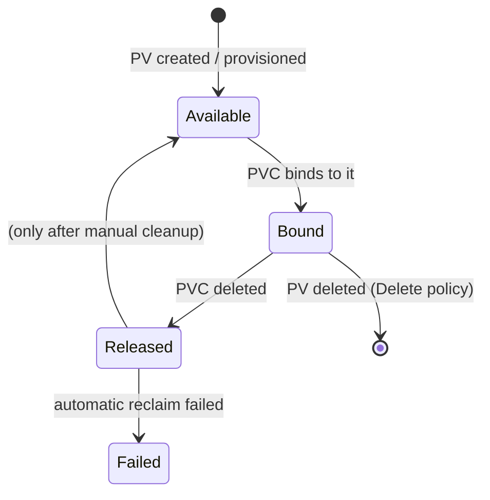
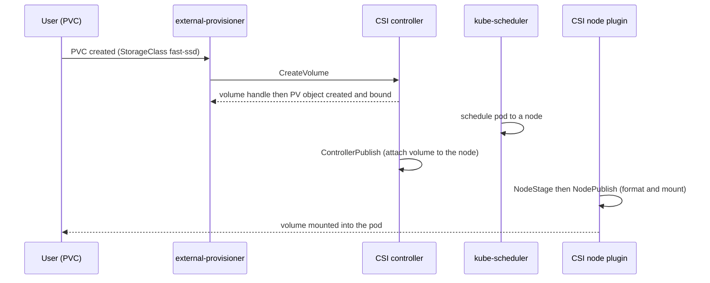

# Storage: Volumes, PV, PVC & StorageClasses

Containers are, by design, **ephemeral and immutable**: a container's writable layer lives
and dies with the container. Kubernetes inherits that model from the container runtime (see
the **docker** domain for image layers and the copy-on-write writable layer). That is fine
for stateless request handlers, but real systems have databases, queues, caches, upload
buckets, and logs that must **outlive a container restart, a pod reschedule, or a node
failure**. Kubernetes storage is the set of abstractions that bolt durable, shareable, and
sometimes network-attached storage onto otherwise-disposable pods — without the app or the
pod author needing to know whether the bytes land on EBS, Ceph RBD, NFS, or a local SSD.

This topic is cloud-agnostic. Managed platforms (EKS, GKE, AKS) ship default CSI drivers and
StorageClasses, but the objects and semantics below are identical everywhere; see the **aws**
domain for EBS/EFS-on-EKS specifics.

> [!KEY-TAKEAWAY]
> The mental model is a **supply/demand marketplace**: a **PersistentVolume (PV)** is a
> piece of storage that exists in the cluster (supply); a **PersistentVolumeClaim (PVC)** is
> a namespaced request for storage (demand); **binding** matches them 1:1. A **StorageClass**
> is the "menu" that lets a claim be fulfilled by **dynamically provisioning** a brand-new PV
> via a **CSI driver**, instead of an admin hand-creating PVs in advance. Pods reference the
> claim, never the physical storage — that indirection is the whole point.

---

## The ephemeral container filesystem problem

Every container starts with a fresh, **writable layer** stacked on top of its read-only image
layers. Anything the process writes to a path that is *not* backed by a volume goes into that
writable layer, which the kubelet/runtime **deletes when the container is removed**.

Concretely, in Kubernetes there are three distinct "lifetimes" to keep straight:

| Write destination | Survives container crash/restart? | Survives pod deletion/reschedule? |
|---|---|---|
| Container writable layer (no volume) | ❌ No | ❌ No |
| `emptyDir` volume | ✅ Yes | ❌ No (tied to the pod) |
| `persistentVolumeClaim` (PV-backed) | ✅ Yes | ✅ Yes |

A subtle but heavily-tested point: a **container restart** (e.g. from a liveness probe kill or
a crash) is *not* the same as a **pod deletion**. When only the container restarts, the pod
object and its `emptyDir` volumes persist, so an `emptyDir` survives a container restart but is
wiped when the pod is deleted or rescheduled to another node. Only PV-backed storage survives
the pod itself going away.

> [!WARNING]
> Writing app data to the container filesystem (or to `emptyDir`) and expecting durability is
> the single most common storage mistake. If the data must survive a rollout or a node dying,
> it needs a PVC backed by a PersistentVolume.

Volumes solve two problems at once: **persistence** (data outliving a container) and
**sharing** (multiple containers in the same pod seeing the same files, e.g. a sidecar writing
logs that a shipper reads).

---

## Volume types overview

A `volume` is declared in `spec.volumes` and mounted into a container at a path via
`volumeMounts`. The volume *type* determines where the bytes actually live and their lifetime.

```yaml
apiVersion: v1
kind: Pod
metadata:
  name: multi-vol
spec:
  containers:
    - name: app
      image: busybox
      volumeMounts:
        - name: scratch
          mountPath: /scratch
        - name: cfg
          mountPath: /etc/app
  volumes:
    - name: scratch
      emptyDir: {}
    - name: cfg
      configMap:
        name: app-config
```

The families you must know for interviews:

| Type | Lifetime | Typical use |
|---|---|---|
| `emptyDir` | Pod | scratch space, sidecar handoff, RAM disk |
| `hostPath` | Node | node agents (dangerous for apps) |
| `configMap` / `secret` | Pod (projected) | inject config / credentials as files |
| `downwardAPI` | Pod | expose pod metadata as files |
| `projected` | Pod | combine secret + configMap + SA token + downwardAPI |
| `persistentVolumeClaim` | Independent of pod | durable app data |
| `csi` (usually via PVC) | Independent of pod | any external storage system |

In-tree cloud plugins (`gcePersistentDisk`, `awsElasticBlockStore`, `azureDisk`, …) and
`gitRepo` are **deprecated/removed**; their functionality has moved to **CSI drivers** via
"CSI migration." Modern manifests reference storage through a **PVC + StorageClass**, not an
in-tree type.

---

## emptyDir

`emptyDir` is created empty when a pod is assigned to a node and **deleted permanently when the
pod is removed** from that node. It survives container restarts (the pod stays) but not pod
rescheduling.

```yaml
volumes:
  - name: cache
    emptyDir:
      sizeLimit: 500Mi     # capped against node ephemeral storage
  - name: ramdisk
    emptyDir:
      medium: Memory       # tmpfs, RAM-backed
      sizeLimit: 256Mi
```

Two gotchas:

- **`medium: Memory`** makes it a tmpfs. It is fast, but the bytes **count against the
  container's memory limit** — a large in-memory `emptyDir` can get the pod **OOMKilled**.
- Without a `sizeLimit`, disk-backed `emptyDir` can fill the node's ephemeral storage and get
  the pod **evicted**.

Use it for scratch/temp data and for **sharing files between containers in the same pod** — the
canonical sidecar pattern (init or main container writes, sidecar reads).

---

## hostPath and its dangers

`hostPath` mounts a file or directory **from the node's own filesystem** into the pod.

```yaml
volumes:
  - name: varlog
    hostPath:
      path: /var/log
      type: Directory   # "", DirectoryOrCreate, File, FileOrCreate, Socket, ...
```

It is legitimately used by **node-level system agents** (log/metrics collectors reading
`/var/log`, CSI node plugins, CNI agents) that genuinely need host access and run as
DaemonSets. For ordinary application data it is an anti-pattern and a **security hazard**:

> [!WARNING]
> `hostPath` is a classic privilege-escalation and container-escape vector. Mounting host
> paths like `/`, `/var/run/docker.sock`, or `/etc` lets a compromised pod read/modify the
> node. It also breaks scheduling assumptions: data written on node A is invisible after the
> pod reschedules to node B, so it is **not** durable cluster storage. Pod Security Standards'
> **baseline/restricted** profiles forbid `hostPath` (see `workload-network-security`).

For node-local *persistent* storage, prefer the **`local` volume** type (a PV pinned to a node
with proper node affinity) instead of raw `hostPath`.

---

## configMap and secret volumes

ConfigMaps and Secrets can be surfaced to a container as **files** (a volume) or as
**environment variables**. As volumes they are mounted **read-only**; Secrets are backed by
**tmpfs** (RAM) so the plaintext never touches node disk.

```yaml
volumes:
  - name: cfg
    configMap:
      name: app-config
      items:
        - key: log_level
          path: log.conf     # /etc/app/log.conf
  - name: creds
    secret:
      secretName: db-creds
      defaultMode: 0400
```

Key behaviors:

- **File mounts auto-update** when the ConfigMap/Secret changes (eventually consistent, via
  kubelet sync) — *except* **`subPath` mounts, which are frozen** at mount time and never
  update. Env-var injections also never update; both require a pod restart to pick up changes.
- Config content lives in the `config-secrets` topic; here the point is the **volume
  mechanics**. Secret encryption at rest / etcd is covered in `workload-network-security`.

---

## The PV / PVC abstraction

This is the heart of the topic. Kubernetes **decouples "what storage exists" from "what a
workload asks for"** using two objects:

- **PersistentVolume (PV)** — a **cluster-scoped** resource representing an actual piece of
  storage (a disk, an NFS export, a Ceph image). It has a capacity, access modes, a reclaim
  policy, and a driver reference. Think **supply**.
- **PersistentVolumeClaim (PVC)** — a **namespaced** request by a user: "I want 20Gi,
  ReadWriteOnce, from class `fast-ssd`." Think **demand**.

The control plane's PV controller **binds** a PVC to a suitable PV **1:1** (a bound PV cannot
be shared by another claim). A pod then references the **claim**, not the volume:

```yaml
# PVC (the request)
apiVersion: v1
kind: PersistentVolumeClaim
metadata:
  name: data
spec:
  accessModes: ["ReadWriteOnce"]
  resources:
    requests:
      storage: 20Gi
  storageClassName: fast-ssd
---
# Pod uses the claim by name
spec:
  containers:
    - name: db
      volumeMounts:
        - name: data
          mountPath: /var/lib/postgresql/data
  volumes:
    - name: data
      persistentVolumeClaim:
        claimName: data
```

> [!INTERVIEW]
> "Why the extra indirection — why not point the pod at the disk directly?" Because it
> **decouples app authors from infrastructure**. The pod author asks for "20Gi RWO fast-ssd";
> the platform decides whether that's EBS, Ceph, or NFS. It makes manifests **portable across
> clouds**, lets storage be provisioned on demand, and enforces quotas/lifecycle at the claim
> boundary. Binding is the matchmaker between demand (PVC) and supply (PV).

---

## Static vs dynamic provisioning

There are two ways a PVC gets a PV:

- **Static provisioning** — an **admin pre-creates PV objects** describing existing storage.
  When a PVC appears, the controller looks for an existing PV whose capacity ≥ request, whose
  access modes are a superset, and whose class matches. If one fits, it binds; otherwise the
  PVC stays **Pending**. This is manual and doesn't scale, but is used for pre-existing/legacy
  storage (e.g. an NFS export you already have).

- **Dynamic provisioning** — the PVC names a **StorageClass**; when no matching PV exists, the
  class's **provisioner (a CSI driver)** creates a **brand-new backing volume and PV on the
  fly**, then binds it. No admin pre-creation needed. This is the default modern path.



If a PVC sets `storageClassName: ""` it **explicitly opts out of dynamic provisioning** and
can only bind a static PV. If the field is **omitted**, the `DefaultStorageClass` admission
controller injects the cluster's default class (the one annotated
`storageclass.kubernetes.io/is-default-class: "true"`).

---

## StorageClass

A **StorageClass** is the template/menu for dynamic provisioning. It names a **provisioner**
(CSI driver), tunable **parameters** (disk type, IOPS, filesystem, encryption), a
**reclaimPolicy**, a **volumeBindingMode**, and `allowVolumeExpansion`.

```yaml
apiVersion: storage.k8s.io/v1
kind: StorageClass
metadata:
  name: fast-ssd
provisioner: ebs.csi.aws.com          # the CSI driver
parameters:
  type: gp3
  iops: "5000"
  encrypted: "true"
reclaimPolicy: Delete                  # Delete (default) | Retain
allowVolumeExpansion: true
volumeBindingMode: WaitForFirstConsumer
```

The `parameters` block is **opaque to Kubernetes** — it's passed straight to the driver, so
valid keys are driver-specific. A dynamically provisioned PV **inherits the class's
`reclaimPolicy`** (defaulting to `Delete`), which is why leaving it at `Delete` in production
databases is a footgun.

---

## Access modes (RWO / ROX / RWX / RWOP)

Access modes describe **how many nodes/pods can mount a volume and in what mode**. They are a
property of the *volume type/driver*, not something you can force on a backend that doesn't
support it.

| Mode | Short | Meaning |
|---|---|---|
| ReadWriteOnce | RWO | mount read-write by a **single node** (multiple pods on that *same* node can share it) |
| ReadOnlyMany | ROX | mount **read-only** by **many nodes** |
| ReadWriteMany | RWX | mount **read-write** by **many nodes** |
| ReadWriteOncePod | RWOP | mount read-write by **exactly one pod** cluster-wide |

Critical, frequently-missed facts:

- **RWO is per-*node*, not per-pod.** Two pods scheduled to the **same** node can both mount a
  RWO volume read-write; RWO only prevents *cross-node* multi-attach. If you truly need "only
  one pod ever," use **`ReadWriteOncePod`** (GA in **v1.29**; alpha v1.22, beta v1.27).
- **Block storage (EBS, Ceph RBD, GCE PD) is RWO** — a single block device attaches to one
  node at a time. If you need **RWX**, you need a **shared/network filesystem**: **NFS,
  CephFS, GlusterFS, or a managed file service (e.g. EFS/Azure Files)**. Asking a block-storage
  CSI driver for RWX will leave the PVC unschedulable/failing.

> [!WARNING]
> A very common exam scenario: a Deployment with `replicas: 3` using a single RWO PVC. Pods
> that land on other nodes get stuck **ContainerCreating** with a **`Multi-Attach` error**,
> because a RWO volume can't attach to a second node. Fixes: use RWX storage, pin replicas to
> one node, or use a **StatefulSet with `volumeClaimTemplates`** so each pod gets its own PVC.

---

## Reclaim policies (Retain / Delete / Recycle)

The **reclaim policy** decides what happens to a PV (and its backing storage) **when its PVC is
deleted**:

- **Delete** — the PV object *and* the external storage asset are **deleted**. This is the
  **default** for dynamically provisioned volumes. Convenient, but a deleted PVC can silently
  destroy a database's disk.
- **Retain** — the PV is **kept** but moves to the **`Released`** phase; the data stays on the
  backing asset. It is **not** auto-reused — an admin must manually delete/clean the PV and
  reprovision. Use this for anything precious.
- **Recycle** — **deprecated** (a basic `rm -rf /volume/*` scrub); use dynamic provisioning
  instead. Don't propose it in an interview except to say it's deprecated.

```bash
# Protect an existing dynamic PV from deletion when its PVC is removed
kubectl patch pv pvc-abc123 -p '{"spec":{"persistentVolumeReclaimPolicy":"Retain"}}'
```

> [!TIP]
> Production rule of thumb: stateful data (databases, ledgers) → **Retain** (or Retain +
> snapshots); throwaway caches → **Delete** is fine.

---

## PV lifecycle, phases & binding

A PV moves through **phases**, visible in `kubectl get pv`:



| Phase | Meaning |
|---|---|
| **Available** | free, not yet bound to any claim |
| **Bound** | bound to a PVC |
| **Released** | claim was deleted, but the PV/asset is not yet reclaimed (Retain) |
| **Failed** | automatic reclamation failed |

A PVC is either **Pending** (no PV yet) or **Bound**. **Storage Object in Use Protection** adds
finalizers (`kubernetes.io/pvc-protection`, `kubernetes.io/pv-protection`) so that a PVC still
mounted by a running pod won't be fully deleted — it shows **`Terminating`** until the pod
releases it. This prevents yanking storage out from under a live pod.

---

## Volume binding mode (Immediate vs WaitForFirstConsumer)

`volumeBindingMode` on the StorageClass controls **when** binding/provisioning happens:

- **Immediate** — the PV is provisioned **as soon as the PVC is created**, before any pod is
  scheduled. Risk: for **topology-constrained** storage (a zonal disk), the volume may be
  created in zone A while the scheduler later wants to place the pod in zone B — deadlock,
  because a zonal disk can't attach cross-zone.
- **WaitForFirstConsumer (WFFC)** — provisioning is **delayed until a pod that uses the PVC is
  scheduled**, so the volume is created in the **same topology (zone/node)** the scheduler
  picked. This is the recommended default for zonal/local storage.

> [!INTERVIEW]
> "PVC is stuck Pending in a multi-zone cluster with WaitForFirstConsumer — is that a bug?"
> No — with WFFC a PVC **intentionally** stays Pending until a consuming pod is created. Create
> the pod/Deployment and the volume provisions in the right zone. It's a feature that prevents
> zone-mismatch deadlocks.

---

## CSI — the Container Storage Interface

**CSI** is the standard, out-of-tree API that lets **any storage vendor** write a driver that
plugs into Kubernetes without changing core code. It replaced the old model of baking every
vendor's plugin ("in-tree") into the Kubernetes binary; in-tree cloud plugins are being removed
via **CSI migration** (operations transparently redirect to the equivalent CSI driver).

A CSI driver typically ships two parts:

- a **controller plugin** (Deployment/StatefulSet) that handles **CreateVolume /
  DeleteVolume / ControllerPublish** (provision and attach) via CSI sidecars
  (`external-provisioner`, `external-attacher`, `external-resizer`, `external-snapshotter`);
- a **node plugin** (DaemonSet) that handles **NodeStageVolume / NodePublishVolume** —
  formatting and mounting the volume into the pod on the node.



The payoff: storage vendors iterate independently, and features like snapshots, cloning, and
expansion are all standardized through CSI.

---

## StatefulSet volumeClaimTemplates

Deployments share one pod template, so they can't give each replica its **own** durable disk —
which is exactly what databases, Kafka, and Elasticsearch need. **StatefulSets** solve this
with **`volumeClaimTemplates`**: the controller creates a **separate PVC per pod**, named
deterministically, and **reattaches the same PVC** to the same pod ordinal across restarts and
rescheduling.

```yaml
apiVersion: apps/v1
kind: StatefulSet
metadata:
  name: pg
spec:
  serviceName: pg
  replicas: 3
  selector: { matchLabels: { app: pg } }
  template:
    metadata: { labels: { app: pg } }
    spec:
      containers:
        - name: pg
          image: postgres:16
          volumeMounts:
            - name: data
              mountPath: /var/lib/postgresql/data
  volumeClaimTemplates:
    - metadata:
        name: data
      spec:
        accessModes: ["ReadWriteOnce"]
        storageClassName: fast-ssd
        resources:
          requests:
            storage: 50Gi
```

This yields PVCs `data-pg-0`, `data-pg-1`, `data-pg-2` — **stable storage identity**. Two
things that trip people up:

- **Scaling down does NOT delete the PVCs** (data is preserved on purpose); scaling back up
  reattaches them. You clean them up manually (or via `persistentVolumeClaimRetentionPolicy`,
  which lets you opt into deletion on scale-down/delete).
- Each pod gets RWO storage of its own, so a 3-replica StatefulSet works fine on block storage
  — unlike a 3-replica Deployment sharing one RWO PVC.

---

## Volume expansion

You can **grow** a PVC if its StorageClass has **`allowVolumeExpansion: true`** and the CSI
driver supports it. Edit the PVC's `spec.resources.requests.storage` to a **larger** value:

```bash
kubectl patch pvc data -p '{"spec":{"resources":{"requests":{"storage":"100Gi"}}}}'
```

Rules and gotchas:

- **Only growing is allowed** — you can never shrink a PVC.
- Many drivers support **online expansion** (no pod restart); older filesystem-resize paths
  required the pod to be recreated. The controller expands the backing volume, then the node
  resizes the filesystem.
- Expansion only works through the **PVC** — editing the PV's capacity directly won't resize
  the app-visible filesystem.

---

## Volume snapshots

CSI standardizes **point-in-time snapshots** through three objects (API group
`snapshot.storage.k8s.io`, driven by the `external-snapshotter` sidecar):

- **VolumeSnapshotClass** — like a StorageClass, but for snapshots (which driver, parameters).
- **VolumeSnapshot** — a namespaced request to snapshot a PVC.
- **VolumeSnapshotContent** — the cluster-scoped actual snapshot (analogous to a PV).

```yaml
apiVersion: snapshot.storage.k8s.io/v1
kind: VolumeSnapshot
metadata:
  name: pg-snap-2026-07-21
spec:
  volumeSnapshotClassName: csi-snapclass
  source:
    persistentVolumeClaimName: data-pg-0
```

You **restore** by creating a new PVC whose `spec.dataSource` references the VolumeSnapshot —
the CSI driver provisions a new volume pre-populated from the snapshot. (You can similarly
**clone** a PVC by using another PVC as the `dataSource`.) Snapshots are your in-cluster backup
primitive for stateful workloads, and are usually **crash-consistent** unless the app is
quiesced first.

---

## Storage for stateful workloads (putting it together)

Choosing storage for a stateful app is a chain of decisions:

1. **Does data need to survive pod death?** No → `emptyDir`. Yes → PVC.
2. **How many writers, across how many nodes?** Single node/pod → **RWO** block storage
   (fast, cheap). Many nodes read-write → **RWX** shared filesystem (NFS/CephFS/EFS).
3. **One shared volume or one-per-replica?** Per-replica identity → **StatefulSet +
   volumeClaimTemplates**. Shared → single RWX PVC referenced by a Deployment.
4. **How is it provisioned?** Dynamic (StorageClass + CSI) by default; static for pre-existing
   assets.
5. **What must happen on delete?** `Retain` for precious data; `Delete` for throwaway.
6. **Backups / topology?** VolumeSnapshots for PITR; `WaitForFirstConsumer` for zonal disks.

> [!KEY-TAKEAWAY]
> Block = fast + RWO + one node; File = RWX + many nodes + slower. StatefulSets give each
> replica its own RWO disk with stable identity. Default reclaim `Delete` deletes your data —
> switch precious volumes to `Retain`. WaitForFirstConsumer keeps zonal disks in the pod's
> zone.

---

## Common follow-up questions

- **"Deployment vs StatefulSet for a database — why?"** A Deployment shares one pod template
  and (for RWO storage) can't give each replica its own disk; pods on other nodes hit
  Multi-Attach errors. StatefulSets give stable network identity + per-pod PVCs via
  `volumeClaimTemplates`. See `pods-workload-controllers`.
- **"Why is my PVC stuck Pending?"** No matching static PV *and* no StorageClass (or class
  can't provision); or `WaitForFirstConsumer` waiting for a pod; or an impossible request
  (RWX from a block driver, capacity too large). `kubectl describe pvc` shows events.
- **"Difference between `emptyDir` and a PVC?"** `emptyDir` lives and dies with the pod; a PVC
  is an independent object whose data survives pod deletion and rescheduling.
- **"What actually happens when I delete a PVC?"** Reclaim policy decides: `Delete` destroys
  the backing disk; `Retain` keeps it (PV → `Released`). In-use protection delays deletion
  until no pod mounts it.
- **"Can two pods share one PVC?"** Only if the access mode allows it — RWX for cross-node,
  RWO for same-node; `ReadWriteOncePod` explicitly forbids sharing.
- **"How do I resize a volume live?"** `allowVolumeExpansion: true` + patch the PVC bigger;
  grow-only, driver-dependent online support.
- **"CSI vs in-tree?"** CSI is the out-of-tree standard; in-tree cloud plugins are removed and
  migrated to CSI drivers transparently.

---

## References

- Kubernetes Docs — Persistent Volumes: https://kubernetes.io/docs/concepts/storage/persistent-volumes/
- Kubernetes Docs — Volumes: https://kubernetes.io/docs/concepts/storage/volumes/
- Kubernetes Docs — Storage Classes: https://kubernetes.io/docs/concepts/storage/storage-classes/
- Kubernetes Docs — Dynamic Volume Provisioning: https://kubernetes.io/docs/concepts/storage/dynamic-provisioning/
- Kubernetes Docs — Volume Snapshots: https://kubernetes.io/docs/concepts/storage/volume-snapshots/
- Kubernetes Docs — StatefulSets: https://kubernetes.io/docs/concepts/workloads/controllers/statefulset/
- Kubernetes Docs — Expanding Persistent Volumes Claims: https://kubernetes.io/docs/concepts/storage/persistent-volumes/#expanding-persistent-volumes-claims
- CSI Specification: https://github.com/container-storage-interface/spec/blob/master/spec.md
- KEP — ReadWriteOncePod (GA v1.29): https://kubernetes.io/blog/2023/12/18/read-write-once-pod-access-mode-ga/
