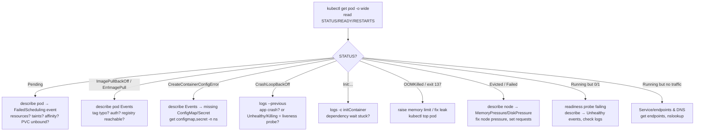

# Observability & Troubleshooting (Kubernetes)

When a Pod won't start, restarts in a loop, or a Service returns nothing, the difference between a
junior and a senior engineer is *method*: knowing which object to interrogate, in what order, and how
to read the signals Kubernetes surfaces. This topic is the **Kubernetes-specific debugging craft** —
the `kubectl` toolkit, the Pod `STATUS` vocabulary (`CrashLoopBackOff`, `ImagePullBackOff`, `Pending`,
`OOMKilled`, `Evicted`, `CreateContainerConfigError`), the Events model, `metrics-server`/`kubectl
top`, and systematic flows for "the Pod won't start" and "the node is `NotReady`."

> [!KEY-TAKEAWAY]
> **`describe` tells you *what* Kubernetes thinks; `logs` tells you what the *app* said; `events`
> tell you *when and why* the control plane acted.** Almost every diagnosis is: read `STATUS` → `kubectl
> describe pod` (State/Reason/Exit Code + Events) → `kubectl logs [--previous]` → drill into the
> failing layer (image, scheduling, config, probes, DNS, node).

This topic is **not** about metrics/logs/traces *mechanics* — Prometheus, OpenTelemetry, log
aggregation, tracing, PromQL, and dashboards live in the **observability** domain. Point learners there
for "how do I build a metrics pipeline." Here we cover cluster-native signals: the Events API,
`metrics-server`, and reading Pod/node state with `kubectl`. Container/image internals (layers, runc,
exit semantics) are in the **docker** domain.

---

## The kubectl debugging toolkit

The primary debugging surface is a handful of `kubectl` verbs. Master their *ordering*, not just their
existence.

| Command | What it answers |
|---|---|
| `kubectl get pods -o wide` | High-level `STATUS`, restart count, node, Pod IP, `READY` count |
| `kubectl describe pod <p>` | Container `State`/`Reason`/`Exit Code`, probes, mounts, and **Events** |
| `kubectl logs <p> [-c <ctr>]` | stdout/stderr of a **running** container |
| `kubectl logs <p> --previous` (`-p`) | logs of the **crashed/previous** container instance |
| `kubectl get events` | cluster/namespace events sorted or filtered by object |
| `kubectl exec -it <p> -- sh` | shell into a running container (needs a shell in the image) |
| `kubectl debug` | ephemeral debug container / Pod copy (distroless or crashed containers) |
| `kubectl top pod/node` | live CPU/memory (requires `metrics-server`) |

```bash
# The canonical first three moves on any misbehaving Pod:
kubectl get pod web-7d9f -o wide            # STATUS + RESTARTS + node
kubectl describe pod web-7d9f               # State/Reason/Exit Code + Events at the bottom
kubectl logs web-7d9f --previous            # what the app printed before it died
```

> [!TIP]
> `kubectl get events --sort-by=.lastTimestamp` (or `--sort-by=.metadata.creationTimestamp`) turns the
> unordered event list into a timeline. `kubectl describe` already shows the events *for that one
> object*, which is usually what you want first.

> [!INTERVIEW]
> "Walk me through debugging a Pod that isn't working." The expected answer is a *process*, not a
> command: `get` (read STATUS), `describe` (State + Events), `logs --previous` (app output), then branch
> by symptom. Reciting flags without the ordering signals shallow experience.

## Reading Pod STATUS and container State

A Pod has a coarse **`phase`** (`Pending`, `Running`, `Succeeded`, `Failed`, `Unknown`) but the `STATUS`
column in `kubectl get pods` is richer — it surfaces the *container* state or the *waiting reason*
(e.g. `CrashLoopBackOff`, `ImagePullBackOff`). Each container is in one of three states:

- **`Waiting`** — not yet running, with a `Reason` (e.g. `ImagePullBackOff`, `CreateContainerConfigError`).
- **`Running`** — process is up (says nothing about app readiness).
- **`Terminated`** — exited, with an `Exit Code` and `Reason` (e.g. `Completed`, `Error`, `OOMKilled`).

```
Containers:
  web:
    State:          Waiting
      Reason:       CrashLoopBackOff
    Last State:     Terminated
      Reason:       Error
      Exit Code:    1
    Restart Count:  6
```

Read this bottom-up: the container **last** terminated with exit code 1 (app error) and is now
**waiting** in back-off before the next restart. The `READY` column (`0/1`) reflects readiness-probe
status, independent of `Running`.

> [!KEY-TAKEAWAY]
> `Running` ≠ healthy. `1/1` means one container is ready; `0/1 Running` means the process is up but
> the readiness probe fails (or none passed yet). Always cross-read `STATUS`, `READY`, and `RESTARTS`.

## CrashLoopBackOff — the container keeps dying

`CrashLoopBackOff` is **not an error itself** — it means the container **starts, exits, and the kubelet
is waiting (backing off) before restarting it again**. The app is crashing repeatedly; Kubernetes is
throttling the restarts with **exponential back-off** (10s, 20s, 40s … capped at **5 minutes**).

Common root causes:
- Application bug/exception on startup (bad config, missing env, failed DB connection) → check
  `kubectl logs --previous`.
- Misconfigured **command/args** or entrypoint that exits immediately.
- A **liveness probe** that fails and kills a container that was actually fine (see below).
- Missing dependency the app needs at boot.

```bash
kubectl describe pod api-xyz | grep -A4 "Last State"   # exit code + reason
kubectl logs api-xyz --previous                        # the crash itself
```

> [!WARNING]
> Exit code **0** with `CrashLoopBackOff` usually means the process **completed and exited** but is
> managed by a controller expecting a long-running process (e.g. you ran a batch command in a
> Deployment). Use a Job for run-to-completion work, or keep the process in the foreground.

## ImagePullBackOff and ErrImagePull

These are **image-fetch** failures, distinct from anything the app does — the container never starts.
`ErrImagePull` is the first failed attempt; `ImagePullBackOff` is the kubelet backing off after repeated
failures. Causes:

| Cause | Signal / Fix |
|---|---|
| Wrong image name or **tag** (typo, tag doesn't exist) | Event: `manifest ... not found`. Fix the tag. |
| Private registry, **no/invalid credentials** | Event: `pull access denied` / `unauthorized`. Add `imagePullSecrets`. |
| Registry unreachable (network/DNS/firewall) | Event: `dial tcp ... i/o timeout`. Check node egress. |
| Rate-limited (e.g. Docker Hub anonymous limit) | Event: `toomanyrequests`. Authenticate or mirror. |

```bash
kubectl describe pod web-abc | grep -A2 Events   # the pull error is here, not in logs
```

> [!TIP]
> `kubectl logs` is **useless** for `ImagePullBackOff` — there's no container to log. The evidence is
> always in `kubectl describe` **Events**. This distinction (logs vs events) is a common interview probe.

## Pending — the Pod can't be scheduled

A Pod stuck in **`Pending`** has been accepted by the API server but **cannot be placed on any node** (or
its containers haven't been created). `kubectl describe pod` shows a `FailedScheduling` event from the
scheduler explaining *why*:

| Reason | Typical event text |
|---|---|
| Insufficient resources | `0/5 nodes are available: Insufficient cpu` / `Insufficient memory` |
| **Taints** without tolerations | `node(s) had untolerated taint {…}` |
| Node **affinity/selector** mismatch | `node(s) didn't match Pod's node affinity/selector` |
| **PVC unbound** (no matching PV / storage class) | Pod waits on volume; PVC in `Pending` |
| Pod **anti-affinity** / topology spread unsatisfiable | `didn't satisfy pod anti-affinity rules` |
| No nodes at all / all cordoned | `0/0 nodes are available` |

```bash
kubectl describe pod batch-1 | grep -A5 Events
kubectl get pvc                                  # is the volume claim Bound?
kubectl describe node <node> | grep -A3 Taints
```

> [!INTERVIEW]
> "Your Pod is `Pending` — how do you find out why?" The scheduler *always* records the reason as a
> `FailedScheduling` event on the Pod. `kubectl describe pod` (not the node, not logs) is the fastest path.

## OOMKilled — memory limit exceeded

When a container exceeds its **memory limit** (memory is *incompressible*), the Linux kernel's OOM killer
sends `SIGKILL`. The container's `Last State` shows `Reason: OOMKilled` and **`Exit Code: 137`**
(`128 + 9`, where 9 = SIGKILL). Repeated OOM kills produce a `CrashLoopBackOff`.

```
Last State:     Terminated
  Reason:       OOMKilled
  Exit Code:    137
```

Diagnosis and fixes:
- Confirm via `kubectl describe pod`; use `kubectl top pod` to see actual usage vs the limit.
- **Raise the memory `limit`**, or fix a leak/oversized heap (e.g. JVM `-Xmx` above the container limit
  is a classic offender — set heap relative to the cgroup limit).
- Note: exceeding the **CPU** limit does *not* kill — CPU is *compressible*, so the container is merely
  **throttled** (see probes-resources for QoS/throttling depth).

> [!WARNING]
> An OOM kill can be the **container** exceeding its own limit *or* the **node** running out of memory
> and the kernel killing the biggest offender. `describe` on the Pod shows the container kill, node
> pressure shows up as **Evicted** Pods (below).

## CreateContainerConfigError and related config failures

The container **can't be created because required configuration is missing**. Most often a referenced
**ConfigMap or Secret doesn't exist**, or a key named in `valueFrom`/`envFrom`/volume doesn't exist.

```
State:          Waiting
  Reason:       CreateContainerConfigError
Events:
  Error: configmap "app-config" not found
```

Related distinct reasons:
- **`CreateContainerConfigError`** — bad/missing ConfigMap, Secret, or key reference.
- **`CreateContainerError`** — runtime couldn't create the container (e.g. bad command, mount problem).
- **`RunContainerError`** — failed at container start (e.g. permission/mount).
- **`InvalidImageName`** — malformed image reference (fails before pull).

```bash
kubectl describe pod app-1 | grep -A3 Events   # names the missing configmap/secret
kubectl get configmap,secret -n <ns>           # confirm it exists in the right namespace
```

> [!TIP]
> A missing Secret/ConfigMap fails the Pod at **container creation**, before any app code runs — so
> there are no app logs. The evidence, again, is in Events.

## Evicted — node-pressure eviction

An **`Evicted`** Pod (phase `Failed`) was terminated by the **kubelet** to reclaim resources when a node
crossed an **eviction threshold** — low `memory.available`, `nodefs.available` (disk), `imagefs`, or
inodes. This is *proactive kubelet action*, distinct from a kernel OOM kill:

| | Node-pressure Eviction | OOMKilled |
|---|---|---|
| Actor | **kubelet** (proactive) | Linux **kernel** OOM killer (reactive) |
| Trigger | eviction signal crosses threshold (mem/disk/inodes) | cgroup/node out of memory |
| Result | Pod `phase: Failed`, reason `Evicted`, graceful-ish terminate | container SIGKILLed, exit 137 |
| Order | lowest-QoS / over-request Pods first (BestEffort → Burstable) | kernel picks by oom_score |

```bash
kubectl get pods --field-selector=status.phase=Failed
kubectl describe node <node> | grep -A5 Conditions   # MemoryPressure / DiskPressure = True
```

Evicted Pod objects **linger** (they're not auto-deleted) until you clean them up; a controller
(Deployment/StatefulSet) recreates a replacement elsewhere. Fix by relieving node pressure (bigger nodes,
lower requests, clean disk/images) and setting proper **requests** so QoS protects critical Pods.

## The Events object and why events expire

Kubernetes **Events** are first-class API objects (`kubectl get events`) emitted by components — the
scheduler, kubelet, controllers — to narrate *what happened* to an object: scheduling decisions, image
pulls, probe failures, restarts, evictions. They are the connective tissue between "desired state" and
"what actually occurred."

Crucial property: **Events are ephemeral.** By default they are stored in etcd with a **TTL of 1 hour**
(`--event-ttl` on the API server) and then garbage-collected. So a Pod that failed overnight may show
**no events** by morning — the *object* persists but its *narrative* is gone.

```bash
kubectl get events -n prod --sort-by=.lastTimestamp
kubectl get events --field-selector involvedObject.name=web-7d9f,type=Warning
kubectl describe pod web-7d9f          # shows only the events still within TTL
```

> [!KEY-TAKEAWAY]
> Events answer *"why did the control plane do X, and when?"* but they **expire after ~1 hour**. For
> durable history you must ship events to a persistent store (an events exporter → logging/observability
> pipeline). Don't rely on `kubectl get events` for post-mortems hours later.

Modern clusters also **de-duplicate/aggregate** repeated events (a `count` field and `Aggregated from …`
note) so a flapping probe doesn't spam thousands of rows.

## metrics-server and kubectl top

`kubectl top` shows **live CPU/memory** for Pods and nodes — but it returns `error: Metrics API not
available` unless **metrics-server** is installed. metrics-server is a cluster add-on that scrapes the
kubelet's **Summary API** (`/metrics/resource`) and serves the aggregated **Metrics API**
(`metrics.k8s.io`). It is the data source for **`kubectl top`** and for the **Horizontal Pod Autoscaler**.

```bash
kubectl top nodes                 # per-node CPU/mem usage
kubectl top pods -A --sort-by=memory
kubectl top pod web-7d9f --containers
```

> [!WARNING]
> metrics-server is for **autoscaling and quick-look usage**, *not* monitoring/alerting. It keeps only
> the latest sample in memory (no history) and is **not** an accurate accounting source. For historical
> metrics/alerts use Prometheus — see the **observability** domain. Common gotcha: on kubeadm/dev
> clusters metrics-server fails TLS to the kubelet and needs `--kubelet-insecure-tls`.

## Liveness probes and restart loops

A **liveness probe** that is wrong can *cause* a `CrashLoopBackOff` on a perfectly healthy app: if the
probe's endpoint is slow, the threshold too tight, or `initialDelaySeconds` too short, the kubelet
declares the container unhealthy and **restarts it repeatedly** — a self-inflicted crash loop. The tell:
`kubectl describe` shows events like `Liveness probe failed: … / Killing container`.

```
Warning  Unhealthy  kubelet  Liveness probe failed: HTTP probe failed with statuscode: 500
Normal   Killing    kubelet  Container failed liveness probe, will be restarted
```

Fixes: use a **startup probe** to protect slow-booting apps, loosen `failureThreshold`/`periodSeconds`,
ensure the liveness endpoint is cheap and dependency-free (don't check the DB in liveness — that belongs
in readiness). Probe *semantics* are covered in **probes-resources**; here the point is recognizing a
probe-induced loop vs a real app crash.

> [!INTERVIEW]
> "App is fine locally but `CrashLoopBackOff` in the cluster with exit code from SIGTERM/kill, and the
> logs look healthy." Suspect a **liveness probe** killing it. Check the Unhealthy/Killing events — a
> real app crash shows an app stack trace, a probe kill shows probe-failure events.

## Init containers and stuck initialization

A Pod's **init containers** run **to completion, sequentially, before** the app containers start. If one
fails or hangs, the Pod is stuck showing `Init:0/2`, `Init:CrashLoopBackOff`, or `Init:Error`, and the
main containers never start.

```
STATUS:  Init:0/2          # still on the first of two init containers
STATUS:  Init:Error        # an init container exited non-zero
STATUS:  Init:CrashLoopBackOff
```

Debug by targeting the specific init container's logs:

```bash
kubectl logs <pod> -c <init-container-name>
kubectl logs <pod> -c wait-for-db --previous
kubectl describe pod <pod>          # shows which init container and its state
```

Common cause: an init container that **waits for a dependency** (DB, migration, config) that never
becomes ready — so it blocks forever or crash-loops. The main app is *not broken*; the init step is.

## DNS debugging

In-cluster DNS is served by **CoreDNS**; the `kube-dns` Service (usually `10.96.0.10`) is injected into
every Pod's `/etc/resolv.conf`. When Pods can't resolve `service.namespace.svc.cluster.local`, symptoms
look like app connection errors, not DNS errors, so confirm resolution directly:

```bash
# Run a throwaway client and test resolution:
kubectl run dnstest --rm -it --image=busybox:1.28 --restart=Never -- \
  nslookup kubernetes.default
# Inspect a Pod's resolver config:
kubectl exec <pod> -- cat /etc/resolv.conf
# Check CoreDNS is healthy:
kubectl -n kube-system get pods -l k8s-app=kube-dns
kubectl -n kube-system logs -l k8s-app=kube-dns
```

Checklist: CoreDNS Pods `Running`? The `kube-dns` Service has endpoints? `resolv.conf` points at the
cluster DNS with the right `search` domains and `ndots:5`? A `NetworkPolicy` blocking egress to
`kube-system:53`? (NetworkPolicy details live in **workload-network-security**.)

> [!WARNING]
> The `ndots:5` default means short names trigger several failed lookups through the search list before
> the FQDN — a latency gotcha, not an outage. Use trailing-dot FQDNs for hot paths if it matters.

## Node NotReady

When `kubectl get nodes` shows a node **`NotReady`**, its Pods stop being schedulable there and existing
Pods are eventually **evicted/rescheduled** (after the `node.kubernetes.io/not-ready` toleration timeout,
default ~5 min). The node's `Ready` condition is set by the **kubelet**; `NotReady` almost always means
the kubelet stopped heart-beating or reported a problem.

```bash
kubectl get nodes -o wide
kubectl describe node <node>       # Conditions: Ready/MemoryPressure/DiskPressure/PIDPressure
```

Common causes:
- **kubelet down / not posting status** (crashed, cert expired, systemd unit dead) → SSH: `systemctl
  status kubelet`, `journalctl -u kubelet`.
- **Container runtime down** (containerd/CRI not responding).
- **Resource pressure** conditions `True` (`MemoryPressure`, `DiskPressure`, `PIDPressure`).
- **Network partition** — control plane can't reach the node; `Ready` flips to `Unknown` then `NotReady`.
- **CNI plugin not ready** on a fresh node (no pod network) → node `NotReady` until CNI installs.

> [!KEY-TAKEAWAY]
> `NotReady` is a *node-agent* signal. Start with `kubectl describe node` (Conditions + Events), then go
> to the node host itself: kubelet and runtime logs. Cluster-lifecycle depth (kubeadm, version skew) is
> in **cluster-installation-upgrades**.

## kubectl debug and ephemeral containers

Some containers can't be `exec`'d into — **distroless/scratch** images have no shell, and **crashed**
containers have no running process to attach to. **`kubectl debug`** solves both:

```bash
# 1) Attach an EPHEMERAL debug container that shares the target's process namespace:
kubectl debug -it web-7d9f --image=busybox:1.28 --target=web
# 2) Debug a crashing Pod by COPYING it (change image/command so it stays up):
kubectl debug web-7d9f -it --copy-to=web-debug --container=web -- sh
kubectl debug web-7d9f --copy-to=web-debug --set-image=web=busybox:1.28
# 3) Debug a NODE by scheduling a privileged Pod into the node's namespaces:
kubectl debug node/<node> -it --image=busybox
```

**Ephemeral containers** are a first-class Pod feature (GA since **v1.25**): they're added to a *running*
Pod's `ephemeralContainers` list, share namespaces with `--target`, and **cannot** have ports, probes,
or resources. They're for interactive debugging only and can't be removed once added (they die with the
Pod). The `--copy-to` variant leaves the original Pod untouched, which is essential for a container stuck
in a crash loop.

> [!TIP]
> For a distroless app that's `CrashLoopBackOff`, `exec` fails (no shell, and it's not running anyway).
> `kubectl debug --copy-to=... --set-image=...=busybox -- sh` gives you a shell with the same volumes and
> config to inspect what the app would have seen.

## A systematic "pod won't start" flow

Rather than guessing, branch on the observed `STATUS`. This decision flow gets you to the evidence fast:



The universal move at every branch: `kubectl describe pod` (for State/Reason/Exit Code + Events) and, if
a container ran at all, `kubectl logs --previous`. Everything else is following the specific signal.

## Common follow-up questions

- **What's the difference between `CrashLoopBackOff` and `ImagePullBackOff`?** The former means the
  container *starts and crashes* (app problem — read `logs --previous`); the latter means the image
  *never downloaded* (registry/tag/auth — read Events; there are no logs).
- **Exit code 137 vs 143?** 137 = 128+9 (SIGKILL, typically OOMKilled or forced kill); 143 = 128+15
  (SIGTERM, graceful shutdown, e.g. the container was asked to stop).
- **Why does `kubectl logs` show nothing for a Pending or ImagePullBackOff Pod?** No container is running
  yet, so there's no stdout/stderr — the diagnosis lives in `describe`/Events.
- **My events disappeared — where did they go?** Events have a ~1-hour TTL in etcd and are
  garbage-collected. Ship them to a persistent store for post-mortems.
- **`kubectl top` says "Metrics API not available."** Install/repair **metrics-server**; on some clusters
  it needs `--kubelet-insecure-tls`.
- **Pod is `Running` but the Service returns nothing.** Check `kubectl get endpoints <svc>` (empty means
  the selector doesn't match or readiness fails), then DNS resolution.
- **Node is `NotReady` — where do I look?** `kubectl describe node` Conditions/Events, then the node's
  kubelet and container-runtime logs.
- **How do I debug a distroless container with no shell?** `kubectl debug` with an ephemeral container
  (`--target`) or a Pod copy (`--copy-to --set-image`).

## References

- Kubernetes Docs — *Debug Running Pods* (kubectl debug, ephemeral containers, `--previous`):
  https://kubernetes.io/docs/tasks/debug/debug-application/debug-running-pod/
- Kubernetes Docs — *Debug Pods* (Pending, CrashLoopBackOff, statuses):
  https://kubernetes.io/docs/tasks/debug/debug-application/debug-pods/
- Kubernetes Docs — *Pod Lifecycle* (phases, container states, restart policy):
  https://kubernetes.io/docs/concepts/workloads/pods/pod-lifecycle/
- Kubernetes Docs — *Node-pressure Eviction* (Evicted, signals, thresholds):
  https://kubernetes.io/docs/concepts/scheduling-eviction/node-pressure-eviction/
- Kubernetes Docs — *Events* & API server `--event-ttl`:
  https://kubernetes.io/docs/reference/command-line-tools-reference/kube-apiserver/
- Kubernetes SIG — *metrics-server*: https://github.com/kubernetes-sigs/metrics-server
- Kubernetes Docs — *Debugging DNS Resolution*:
  https://kubernetes.io/docs/tasks/administer-cluster/dns-debugging-resolution/
- Kubernetes Docs — *Init Containers*:
  https://kubernetes.io/docs/concepts/workloads/pods/init-containers/
- Cross-references (this library): **observability** (metrics/logs/traces mechanics), **docker**
  (container/image internals), **probes-resources** (probe semantics, QoS), **services-networking**
  (endpoints/DNS), **workload-network-security** (NetworkPolicy), **cluster-installation-upgrades**
  (node lifecycle).
