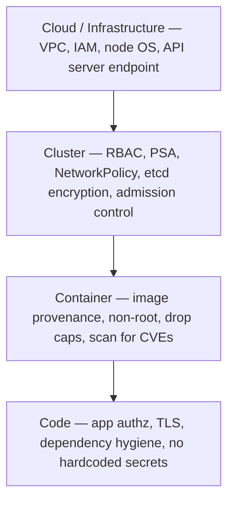
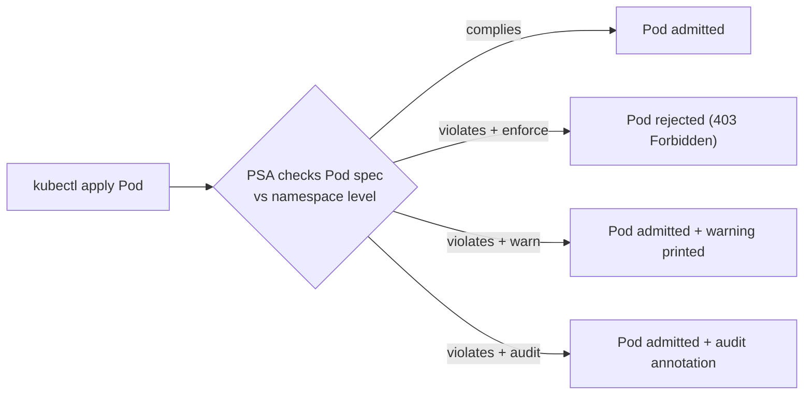
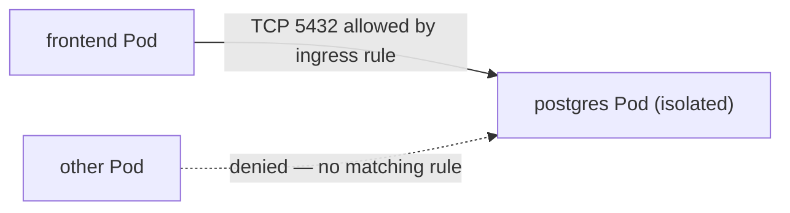

# Workload & Network Security

RBAC (in the sibling **`security-rbac`** topic) answers *"who can call the API and do what"*.
This topic answers the two questions RBAC doesn't: **"what is a running workload allowed to do
to the node/kernel it lands on"** (workload hardening) and **"which workloads are allowed to
talk to each other over the network"** (segmentation). Those are enforced by three distinct
mechanisms that interviewers love to conflate:

- **`securityContext`** — per-Pod/container knobs (run as non-root, drop Linux capabilities,
  read-only root filesystem, seccomp) that shrink the blast radius of a compromised container.
- **Pod Security Admission (PSA)** — a built-in admission controller that *enforces* a floor of
  those hardening settings across a namespace, using the **Pod Security Standards** profiles. It
  replaced the removed **PodSecurityPolicy (PSP)**.
- **NetworkPolicy** — the firewall for Pod-to-Pod traffic. Pods are wide-open by default;
  a NetworkPolicy flips selected Pods to deny-by-default for a direction.

Around those sit **secrets-at-rest (etcd encryption)**, **policy-as-code admission** (Kyverno /
OPA Gatekeeper) and **supply-chain / image admission** (signature verification, blocking
`:latest`). We frame the whole thing with the CNCF **4C's** model.

> [!INTERVIEW]
> The trap question is *"NetworkPolicy vs RBAC vs securityContext — what does each protect?"*.
> Crisp answer: **RBAC guards the Kubernetes API (control-plane authz), NetworkPolicy guards
> Pod network traffic (L3/L4 data-plane), securityContext guards the node/kernel from the
> container (runtime isolation).** They are orthogonal — an attacker who breaks one is not
> stopped by the others, which is exactly the defense-in-depth point.

This topic builds on container security fundamentals from the **docker** domain
(capabilities, non-root images, read-only rootfs live at the container level too — K8s just
declares them) and on general application security in the **security** domain. It cross-links
to **`security-rbac`** for identity/authz and to **`config-secrets`** for how Secret objects
are consumed by Pods.

## The 4C's of cloud native security

Cloud native security is layered as concentric rings — **Cloud, Cluster, Container, Code** —
where each outer layer is the trust base for the ones inside it. You cannot secure an inner
layer if an outer one is compromised.



| Layer | You control | Examples for this topic |
|---|---|---|
| **Cloud** | The infra hosting the cluster | Node hardening, restricting API server access, provider IAM |
| **Cluster** | The K8s components & policy | RBAC, **Pod Security Admission**, **NetworkPolicy**, **etcd encryption at rest**, admission webhooks |
| **Container** | The workload image & runtime | Non-root user, `readOnlyRootFilesystem`, drop capabilities, image scanning/signing |
| **Code** | The application itself | Input validation, mutual TLS, no secrets in source |

> [!KEY-TAKEAWAY]
> The 4C's give you a checklist and a language for scoping a security question. When an
> interviewer asks "how would you secure this app on K8s", walk the rings outward-in: this
> topic mostly lives in **Cluster** (PSA/NetworkPolicy/admission) and **Container**
> (securityContext/images).

## securityContext — hardening the workload

`securityContext` is a field on both the Pod (`spec.securityContext`) and each container
(`spec.containers[*].securityContext`) that declares the security posture the kubelet/CRI must
apply. The container-level setting overrides the Pod-level one where they overlap. These are the
same kernel primitives from the docker domain — UID/GID, Linux capabilities, seccomp, read-only
rootfs — just declared through the K8s API.

```yaml
apiVersion: v1
kind: Pod
metadata:
  name: hardened
spec:
  securityContext:                 # Pod-level: applies to all containers
    runAsNonRoot: true             # kubelet refuses to start if image tries to run as UID 0
    runAsUser: 1000
    fsGroup: 2000                  # group ownership applied to mounted volumes
    seccompProfile:
      type: RuntimeDefault         # filter dangerous syscalls with the runtime's default profile
  containers:
  - name: app
    image: myapp:1.4.2
    securityContext:               # container-level: overrides/refines Pod-level
      allowPrivilegeEscalation: false   # blocks setuid/setgid gaining more privs than parent
      readOnlyRootFilesystem: true      # rootfs is immutable; app writes to mounted emptyDir
      capabilities:
        drop: ["ALL"]              # drop every Linux capability...
        add: ["NET_BIND_SERVICE"] # ...then add back only what's needed (bind port < 1024)
    volumeMounts:
    - name: tmp
      mountPath: /tmp              # writable scratch space since rootfs is read-only
  volumes:
  - name: tmp
    emptyDir: {}
```

The high-value knobs interviewers probe:

| Field | Effect | Why it matters |
|---|---|---|
| `runAsNonRoot: true` | kubelet refuses to start a container whose effective user is UID 0 | Root in the container is root on the node if isolation is bypassed |
| `runAsUser` / `runAsGroup` | Force a specific UID/GID | Deterministic non-root identity even if image default is root |
| `allowPrivilegeEscalation: false` | Sets the `no_new_privs` bit — a process can't gain more privileges than its parent | Blocks setuid-binary escalation |
| `readOnlyRootFilesystem: true` | Mounts `/` read-only | Attacker can't drop tools/binaries or tamper with the app |
| `capabilities.drop: ["ALL"]` | Remove all Linux capabilities | Least privilege; add back only e.g. `NET_BIND_SERVICE` |
| `privileged: true` | Container gets nearly all host capabilities & devices | **Almost always wrong** for app workloads — effectively root on the node |
| `seccompProfile.type: RuntimeDefault` | Apply the container runtime's default syscall filter | Blocks obscure/dangerous syscalls used in kernel exploits |

> [!WARNING]
> `privileged: true` is not "a bit more access" — it gives the container essentially full
> control of the node (all capabilities, host devices, ability to load kernel modules). A
> compromised privileged Pod = a compromised node = potentially the whole cluster. Reserve it
> for genuine infrastructure DaemonSets (CNI, storage) and block it for app namespaces via PSA
> or a policy engine.

> [!TIP]
> `runAsNonRoot: true` does **not** pick a UID — it only *asserts* the container must not be
> root. If the image's default user is root and you set `runAsNonRoot: true` without
> `runAsUser`, the Pod fails to start with `CreateContainerConfigError`. Either bake a non-root
> `USER` into the image (docker domain) or set `runAsUser` explicitly.

## Pod Security Standards — the three profiles

`securityContext` is *opt-in per workload* — nothing forces developers to set it. The **Pod
Security Standards (PSS)** define three named, **cumulative** policy profiles that codify
hardening best practices so a cluster can *require* a baseline:

| Profile | Intent | Representative rules |
|---|---|---|
| **Privileged** | Unrestricted — for trusted infra workloads | No restrictions; allows `privileged`, hostPath, host namespaces |
| **Baseline** | Prevent *known* privilege escalations, minimal friction | No `privileged`, no host namespaces (`hostNetwork/hostPID/hostIPC`), no hostPath volumes, no host ports, seccomp not `Unconfined`, limited capability add-list |
| **Restricted** | Current hardening best practice (some app compatibility cost) | Everything in Baseline **plus** `runAsNonRoot: true`, `allowPrivilegeEscalation: false`, `capabilities.drop: ["ALL"]` (only `NET_BIND_SERVICE` may be added), `seccompProfile.type` must be `RuntimeDefault`/`Localhost`, and a restricted allow-list of volume types |

The **Restricted** volume allow-list is: `configMap`, `csi`, `downwardAPI`, `emptyDir`,
`ephemeral`, `persistentVolumeClaim`, `projected`, `secret` (notably **no** `hostPath`).

> [!KEY-TAKEAWAY]
> The profiles are *cumulative*: Restricted = Baseline + non-root + drop-all-caps +
> explicit-seccomp + volume allow-list. Baseline blocks the obvious foot-guns; Restricted is
> what a security-conscious multi-tenant cluster actually wants for app namespaces.

Since Kubernetes v1.25, several Restricted controls (`runAsNonRoot`, `allowPrivilegeEscalation`,
`seccompProfile`) are Linux-only — they don't apply when `spec.os.name: windows` is set.

## Pod Security Admission — enforcing the standards

**Pod Security Admission (PSA)** is the *built-in admission controller* that enforces the PSS
profiles. It went **stable (GA) and enabled by default in Kubernetes v1.25** — the same release
that **removed PodSecurityPolicy (PSP)** (PSP was deprecated in v1.21). You configure PSA purely
with **namespace labels** — no CRDs, no webhooks.

Each namespace can set up to three **modes**, each with a level and optional pinned version:

| Mode | On violation |
|---|---|
| **enforce** | Pod is **rejected** |
| **audit** | Pod is **allowed**, a violation annotation is written to the audit log |
| **warn** | Pod is **allowed**, a warning is returned to the user (`kubectl` prints it) |

```yaml
apiVersion: v1
kind: Namespace
metadata:
  name: payments
  labels:
    # enforce a hard floor of "baseline"...
    pod-security.kubernetes.io/enforce: baseline
    pod-security.kubernetes.io/enforce-version: v1.30   # pin to a K8s minor, or "latest"
    # ...while warning/auditing against the stricter "restricted" (migration ramp)
    pod-security.kubernetes.io/warn: restricted
    pod-security.kubernetes.io/audit: restricted
```

Label format: `pod-security.kubernetes.io/<MODE>: <LEVEL>` and optional
`pod-security.kubernetes.io/<MODE>-version: <VERSION>` where VERSION is a K8s minor (e.g.
`v1.30`) or `latest`. Pinning a version keeps enforcement stable across upgrades; `latest`
always tracks the newest rules.

> [!WARNING]
> **`enforce` mode is applied only to Pods, not to workload controllers.** A Deployment whose
> Pod template violates `enforce: restricted` is *accepted* by the API — but its ReplicaSet then
> fails to create Pods, so you get a healthy-looking Deployment with 0 ready replicas and errors
> buried in the ReplicaSet events. `warn` and `audit`, by contrast, *do* evaluate the template
> on the controller, so they surface the problem at `kubectl apply` time. This is why the common
> rollout pattern is `warn/audit: restricted` first, then flip `enforce` once workloads are clean.



PSA covers the standard profiles but is deliberately *not* extensible — if you need custom rules
(e.g. "block image registries other than our own", "require a team label"), you reach for a
policy engine (Kyverno / Gatekeeper) below.

## NetworkPolicy — default behavior and isolation model

By default, the Pod network is **flat and fully open**: every Pod can reach every other Pod in
any namespace (see the `services-networking` topic for the flat L3 model). Pods are
**non-isolated** — all ingress and egress is allowed. **NetworkPolicy** is the object that
introduces segmentation, and its semantics are the #1 gotcha:

- A Pod is **isolated for ingress** only once *some* NetworkPolicy selects it *and* lists
  `Ingress` in `policyTypes`. Same for egress.
- **The instant a Pod is selected for a direction, that direction flips to deny-by-default** —
  only traffic matching an explicit rule (plus reply traffic) is allowed.
- Pods **not** selected by any policy remain wide open.
- Policies are **purely additive / union** — multiple policies never conflict, evaluation order
  is irrelevant, the allowed set is the union of all matching policies.
- For a connection A→B to succeed, **A's egress policy AND B's ingress policy must both allow
  it** (if either endpoint is isolated in that direction).

> [!WARNING]
> **NetworkPolicy is enforced by the CNI plugin, not the API server.** If your CNI doesn't
> implement it (e.g. plain flannel), the API happily *accepts* the object but nothing enforces
> it — a silent no-op that gives false confidence. You need a policy-capable CNI like **Calico**
> or **Cilium**. Also: NetworkPolicy is **namespaced**, operates at **L3/L4 only** (IP + port,
> TCP/UDP/SCTP — no HTTP paths, no logging), and a Pod can never block traffic to itself.

## Writing NetworkPolicies — selectors, rules, and the AND/OR trap

```yaml
apiVersion: networking.k8s.io/v1
kind: NetworkPolicy
metadata:
  name: db-allow-frontend
  namespace: shop
spec:
  podSelector:                 # which Pods THIS policy governs (empty {} = all Pods in ns)
    matchLabels:
      app: postgres
  policyTypes: [Ingress]       # isolate ingress for the selected Pods
  ingress:
  - from:
    - podSelector:             # allow Pods labeled app=frontend, in THIS namespace
        matchLabels:
          app: frontend
    ports:
    - protocol: TCP
      port: 5432               # only on 5432
```

**Default-deny-all ingress** for a namespace — an empty `podSelector` selects every Pod and no
ingress rules means nothing is allowed in:

```yaml
apiVersion: networking.k8s.io/v1
kind: NetworkPolicy
metadata:
  name: default-deny-ingress
  namespace: shop
spec:
  podSelector: {}              # ALL pods in the namespace
  policyTypes: [Ingress]       # no ingress rules => deny all inbound
```

The peer types you can list under `from`/`to` are `podSelector`, `namespaceSelector`, and
`ipBlock` (a CIDR, with optional `except`). The infamous **AND vs OR** distinction turns on a
single YAML dash:

```yaml
# AND — Pods labeled role=client that ALSO live in namespaces labeled team=alice
ingress:
- from:
  - namespaceSelector:
      matchLabels: {team: alice}
    podSelector:                     # SAME list item => intersection (AND)
      matchLabels: {role: client}
```

```yaml
# OR — role=client Pods in THIS namespace, OR any Pod in team=alice namespaces
ingress:
- from:
  - namespaceSelector:
      matchLabels: {team: alice}     # separate list item
  - podSelector:                     # separate list item => union (OR)
      matchLabels: {role: client}
```

> [!KEY-TAKEAWAY]
> Two selectors under **one** `-` bullet = **AND** (namespace *and* pod must match). Two
> selectors as **separate** `-` bullets = **OR**. Getting this wrong is the classic "my policy
> is way too permissive / way too strict" incident. Also remember: a bare `podSelector` peer
> only matches Pods **in the policy's own namespace** — cross-namespace requires a
> `namespaceSelector`.



## Secrets at rest — etcd encryption

Kubernetes **Secret** objects are only **base64-encoded, not encrypted**, and they are stored in
**etcd**. Anyone who can read etcd (a stolen backup, disk access, or overly broad RBAC on the
Secret API) can read every secret. Two independent problems, two fixes:

1. **API access** — control who can `get`/`list` Secrets with RBAC (the `security-rbac` topic).
2. **At-rest storage** — enable **encryption at rest** so etcd holds ciphertext.

You configure the API server with an `EncryptionConfiguration` (`--encryption-provider-config`):

```yaml
apiVersion: apiserver.config.k8s.io/v1
kind: EncryptionConfiguration
resources:
- resources: ["secrets"]
  providers:
  - kms:                       # BEST: envelope encryption via an external KMS (keys never in etcd)
      name: myKmsPlugin
      endpoint: unix:///tmp/kms.sock
  - aescbc:                    # fallback: local key in the config file
      keys:
      - name: key1
        secret: <base64-key>
  - identity: {}               # plaintext — must come LAST for read-compat during migration
```

> [!TIP]
> Provider **order matters**: the first provider is used to *encrypt* new writes; all listed
> providers can *decrypt*. `identity` (plaintext) must be last, and only present during
> migration. After enabling encryption you must rewrite existing Secrets
> (`kubectl get secrets -A -o json | kubectl replace -f -`) — enabling it does not retroactively
> encrypt data already in etcd. Production clusters should use the **KMS provider** so the
> data-encryption keys are wrapped by an external key manager rather than sitting in a file on
> the control-plane node.

## Admission control for security — policy-as-code

PSA enforces a fixed set of Pod hardening rules. For **arbitrary org policy** — "images only from
`registry.corp.io`", "every workload must set resource limits", "no `:latest` tags", "deny
`hostPath`", "require a `team` label" — you use a **validating (and optionally mutating) admission
webhook** driven by a **policy engine**:

| Engine | Language | Model |
|---|---|---|
| **Kyverno** | YAML (K8s-native `ClusterPolicy` CRs) | validate / mutate / generate / verifyImages; no new language |
| **OPA Gatekeeper** | Rego (OPA policy language) | `ConstraintTemplate` + `Constraint` CRs; very expressive |

A Kyverno policy that blocks the `:latest` tag (a classic supply-chain foot-gun — non-pinned
images make rollouts non-reproducible and let a mutable tag pull new/malicious content):

```yaml
apiVersion: kyverno.io/v1
kind: ClusterPolicy
metadata:
  name: disallow-latest-tag
spec:
  validationFailureAction: Enforce      # Enforce = reject; Audit = report only
  rules:
  - name: require-image-tag
    match:
      any:
      - resources:
          kinds: [Pod]
    validate:
      message: "Using ':latest' or an untagged image is not allowed."
      pattern:
        spec:
          containers:
          - image: "!*:latest"          # reject any container image ending in :latest
```

These engines run as admission webhooks *after* authentication/authorization and *after* the
built-in admission controllers (including PSA). See the `security-rbac` topic for the full
**authn → authz → admission** request pipeline; policy engines plug into the admission stage.

> [!WARNING]
> A **validating webhook** with `failurePolicy: Fail` that becomes unavailable will **block all
> matching API writes** — a self-inflicted outage. Scope the webhook's `namespaceSelector`/
> `objectSelector` tightly (exclude `kube-system`), and weigh `Fail` (secure, fragile) vs
> `Ignore` (available, can leak non-compliant resources).

## Supply-chain security — image provenance and verification

The container that runs is only as trustworthy as the image it came from. Supply-chain controls
live at the **Container** layer of the 4C's and are enforced at admission time:

- **Pin by digest, not tag.** `myapp@sha256:...` is immutable; `myapp:latest` can silently change
  under you. Block mutable tags with a policy (above).
- **Scan images for CVEs** in CI and/or admission (Trivy, Grype) — reference the **docker** and
  **security** domains for image/vuln details; K8s just *gates* on the result.
- **Sign images and verify signatures at admission.** With **Sigstore/cosign**, images are signed
  and the signature stored alongside them; an admission policy verifies the signature (and
  optionally attestations/SBOM provenance) before allowing the Pod. Kyverno's `verifyImages` and
  Gatekeeper + `ratify` do this natively:

```yaml
apiVersion: kyverno.io/v1
kind: ClusterPolicy
metadata:
  name: verify-image-signatures
spec:
  validationFailureAction: Enforce
  rules:
  - name: verify-signature
    match:
      any:
      - resources: {kinds: [Pod]}
    verifyImages:
    - imageReferences: ["registry.corp.io/*"]
      attestors:
      - entries:
        - keys:
            publicKeys: |-
              -----BEGIN PUBLIC KEY-----
              ...
              -----END PUBLIC KEY-----
```

> [!KEY-TAKEAWAY]
> The supply-chain story is a chain of custody enforced by **admission**: only images from
> approved registries, pinned/scanned, cryptographically signed by our build system, run in the
> cluster. This is where SLSA/Sigstore concepts meet K8s — the cluster is the last gate that
> checks the provenance the pipeline produced.

## Common follow-up questions

- **"What's the difference between RBAC, NetworkPolicy, and securityContext?"** — RBAC = who can
  call the K8s API (control-plane authz); NetworkPolicy = which Pods can talk over the network
  (L3/L4 data plane); securityContext = what the container can do to the node/kernel (runtime
  isolation). Orthogonal layers of defense-in-depth.
- **"What replaced PodSecurityPolicy?"** — Pod Security Admission (built-in, namespace-label
  driven, enforces the Pod Security Standards). PSP was deprecated in v1.21 and removed in v1.25;
  PSA went GA in v1.25.
- **"What's the default NetworkPolicy behavior?"** — None: Pods are non-isolated, all traffic
  allowed. The *first* policy selecting a Pod for a direction flips that direction to
  deny-by-default.
- **"I created a NetworkPolicy but it isn't enforced — why?"** — Your CNI doesn't implement
  NetworkPolicy (e.g. plain flannel). The object is accepted but silently ignored; switch to
  Calico/Cilium.
- **"Are Kubernetes Secrets encrypted?"** — Only base64-encoded by default. Enable encryption at
  rest (`EncryptionConfiguration`, ideally a KMS provider) and lock down Secret RBAC.
- **"How do you stop containers running as root?"** — `securityContext.runAsNonRoot: true`
  (+ `runAsUser`), and enforce it cluster-wide with PSA `restricted` (or a policy engine).
- **"enforce: restricted on a namespace but my Deployment shows 0 replicas and no error — why?"**
  — enforce mode rejects *Pods*, not the Deployment; the ReplicaSet can't create Pods. Use
  `warn`/`audit` to catch it at apply time.
- **"How do you enforce org-specific rules PSA can't express?"** — A policy engine (Kyverno or
  OPA Gatekeeper) as a validating/mutating admission webhook.
- **"AND vs OR in a NetworkPolicy `from` block?"** — Selectors under one list item = AND;
  separate list items = OR.

## References

- Kubernetes docs — Pod Security Standards: https://kubernetes.io/docs/concepts/security/pod-security-standards/
- Kubernetes docs — Pod Security Admission: https://kubernetes.io/docs/concepts/security/pod-security-admission/
- Kubernetes docs — Network Policies: https://kubernetes.io/docs/concepts/services-networking/network-policies/
- Kubernetes docs — Configure a Security Context for a Pod/Container: https://kubernetes.io/docs/tasks/configure-pod-container/security-context/
- Kubernetes docs — Encrypting Confidential Data at Rest: https://kubernetes.io/docs/tasks/administer-cluster/encrypt-data/
- Kubernetes docs — Using KMS provider for data encryption: https://kubernetes.io/docs/tasks/administer-cluster/kms-provider/
- Kubernetes docs — Admission Controllers Reference: https://kubernetes.io/docs/reference/access-authn-authz/admission-controllers/
- CNCF — Overview of Cloud Native Security (the 4C's): https://kubernetes.io/docs/concepts/security/overview/
- Kyverno docs: https://kyverno.io/docs/ · OPA Gatekeeper: https://open-policy-agent.github.io/gatekeeper/
- Sigstore / cosign: https://docs.sigstore.dev/
