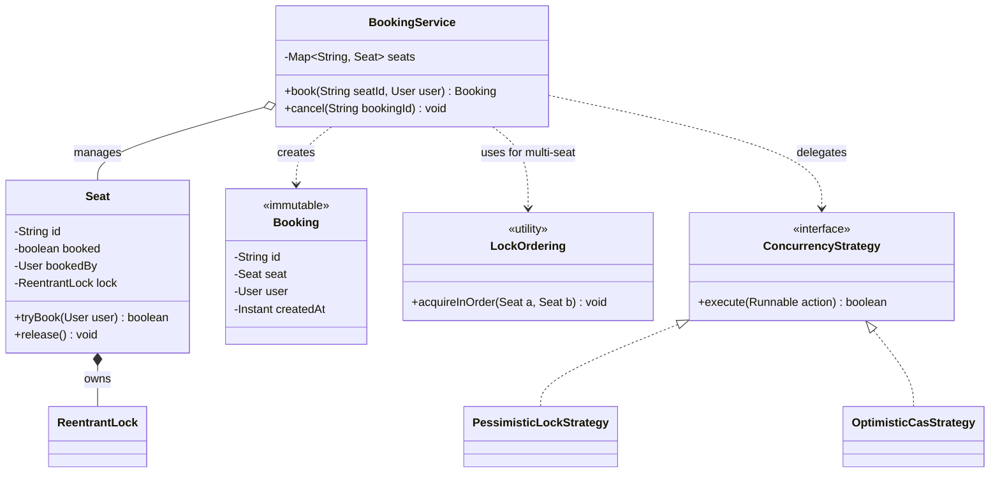

# Concurrency in Low-Level Design

This is the senior differentiator in the machine-coding round. Two candidates can produce
the same clean class diagram; the one who then says *"now let me make the seat-booking
path thread-safe — here's the race, here's the lock, here's why I chose it over the
alternatives"* signals a different level. This topic is **not** about distributed locking
or scaling to many machines (that is an HLD concern — see the `system-design` domain). It is
about making a **single-JVM object-oriented design** correct under concurrent access: where
shared mutable state lives, how races happen, and which locking strategy fits.

Concurrency is a *cross-cutting* concern layered onto the OO designs you build elsewhere.
It shows up as the "make it thread-safe" follow-up on problems like
[design-hotel-booking](../design-hotel-booking/concepts.md) (seat/room lock),
[design-splitwise](../design-splitwise/concepts.md) (balance updates),
[design-parking-lot](../design-parking-lot/concepts.md) (the last free spot),
[design-rate-limiter-oo](../design-rate-limiter-oo/concepts.md) (token bucket refill), and
[design-cache-oo](../design-cache-oo/concepts.md) (concurrent get/put + eviction).

> [!INTERVIEW]
> The pattern that scores: (1) point at the exact shared mutable state, (2) name the race
> class (check-then-act or read-modify-write), (3) show the smallest correct fix, (4) justify
> the *granularity* and *strategy* (pessimistic lock vs optimistic CAS) with the contention
> profile. Reaching for `synchronized` on every method is a junior tell.

## When Concurrency Matters

Concurrency only matters where **shared mutable state** is touched by more than one thread.
Ask two questions of every field:

- **Is it shared?** Reachable by multiple threads (a field on a singleton service, a static,
  an entry in a shared map). A local variable or a per-request object is not shared.
- **Is it mutable?** Written after construction. A `final`/immutable field read by many
  threads needs no locking.

Shared **and** mutable → you have a concurrency problem. Classic LLD hotspots:

| Problem | Shared mutable state | The race |
|---|---|---|
| Movie / hotel booking | seat/room availability | two users book the last seat |
| Parking lot | count of free spots | two cars take the last spot |
| Digital wallet / Splitwise | account balance | concurrent debits overdraw |
| Inventory / vending machine | stock count | oversell below zero |
| Rate limiter | token count | two requests both pass the last token |
| Cache | map + eviction structure | lost update / corrupted linked list |

> [!TIP]
> If a field is only ever read after construction, make it `final` and immutable and you
> remove it from the concurrency conversation entirely. The cheapest lock is no lock.

## Race Conditions: Check-Then-Act and Read-Modify-Write

A **race condition** is when correctness depends on the *relative timing* of threads. Two
canonical shapes cover almost every LLD bug:

**Check-then-act** — you observe a condition, then act on it, but the condition can change
between the check and the act:

```java
// BROKEN: two threads can both pass the check for the last seat
if (seat.isAvailable()) {      // check
    seat.book(user);           // act — another thread booked it in between
}
```

**Read-modify-write** — you read a value, compute a new value, write it back; a concurrent
writer's update is lost:

```java
// BROKEN: balance = balance - amount is three operations, not one
account.setBalance(account.getBalance() - amount);
```

Both are lost-update / invalid-state bugs. Even `count++` is read-modify-write (read, add,
store) and is **not** atomic in Java. The fix is to make the compound action *atomic* —
either by holding a lock across the whole check-and-act, or by using an atomic
compare-and-set. Naming the shape ("this is a check-then-act on the last spot") is exactly
the reasoning interviewers want to hear.

> [!WARNING]
> Marking each field `volatile` does **not** fix these. `volatile` guarantees visibility of
> a single read or single write, not atomicity of a compound `read-modify-write`. `count++`
> on a `volatile int` is still racy.

## Intrinsic Locks and volatile

Java's built-in **intrinsic lock** (monitor) is entered via `synchronized`. Every object has
one. `synchronized` gives you two guarantees at once: **mutual exclusion** (one thread in the
block at a time) and **visibility** (changes made under the lock are visible to the next
thread that acquires it — happens-before).

```java
// FIXED: the whole check-then-act is one atomic critical section
public synchronized boolean book(User user) {
    if (available) {           // check
        available = false;     // act — no other thread can interleave
        this.bookedBy = user;
        return true;
    }
    return false;
}
```

- `synchronized` method → locks on `this` (or the `Class` object for static methods).
- `synchronized(lockObject)` block → locks on an explicit object; prefer a **private final
  lock object** so callers cannot deadlock you by locking your instance.

**`volatile`** is the lighter tool: it guarantees *visibility and ordering* for a single
variable but gives **no atomicity** and **no mutual exclusion**. Use it for flags
(`volatile boolean running`) and for the double-checked-locking singleton reference — never
as a substitute for a lock around a compound update.

## ReentrantLock and ReadWriteLock

`java.util.concurrent.locks` gives explicit locks with capabilities `synchronized` lacks:

**`ReentrantLock`** — same mutual-exclusion semantics as `synchronized`, plus:

- `tryLock()` / `tryLock(timeout)` — back off instead of blocking forever (deadlock avoidance).
- `lockInterruptibly()` — a waiting thread can be cancelled.
- Optional **fairness** (FIFO ordering) to avoid starvation.
- Multiple `Condition` objects for fine-grained wait/signal.

```java
private final ReentrantLock lock = new ReentrantLock();

public boolean book(User user) {
    if (!lock.tryLock()) return false;   // don't queue behind a slow holder
    try {
        if (!available) return false;
        available = false; bookedBy = user;
        return true;
    } finally {
        lock.unlock();                   // ALWAYS unlock in finally
    }
}
```

**`ReadWriteLock`** (`ReentrantReadWriteLock`) — separates a **read lock** (shared: many
readers concurrently) from a **write lock** (exclusive). Ideal for **read-heavy, write-rare**
structures — a cache, a config registry, a seat map that is read far more than mutated.
Readers don't block each other; a writer blocks everyone.

> [!TIP]
> Choose `ReadWriteLock` only when reads dominate; under write-heavy load its bookkeeping
> overhead loses to a plain lock. `StampedLock` adds an optimistic-read mode for even more
> read throughput but is harder to use correctly — mention it as an advanced option.

## Lock Granularity: Coarse vs Fine-Grained

Granularity is *how much state one lock protects* — the central trade-off.

- **Coarse-grained** — one lock for the whole object/collection (e.g. `synchronized` the
  entire `BookingService`). Simple and obviously correct, but serializes *unrelated*
  operations: booking seat A blocks booking seat B. Fine at low contention.
- **Fine-grained** — a lock per independent unit (per seat, per row, per account, per shard).
  Unrelated operations proceed in parallel → higher throughput, but more code, harder to
  reason about, and it introduces **deadlock risk** when a transaction needs two locks.

```java
// Fine-grained: one lock per seat, so different seats book concurrently
class Seat {
    private final Object lock = new Object();
    private boolean booked;
    boolean book(User u) {
        synchronized (lock) {              // only contends with same-seat bookers
            if (booked) return false;
            booked = true; return true;
        }
    }
}
```

The interview answer: **start coarse for correctness, then split the lock only where the
contention profile justifies it.** Per-seat/per-row locking is the standard fine-grained
answer for booking and inventory problems.

## Deadlock and Lock Ordering

**Deadlock** = two threads each hold a lock the other needs, and both wait forever. It
appears the moment a transaction acquires **two or more locks** — the classic case is
Splitwise/wallet transferring money between two accounts:

```java
// DEADLOCK: T1 transfers A->B (locks A then B); T2 transfers B->A (locks B then A)
synchronized (from) { synchronized (to) { /* move money */ } }
```

The standard fix is **lock ordering**: define a global order (e.g. by account id) and always
acquire locks in that order, so a cycle is impossible:

```java
Account first  = a.getId() < b.getId() ? a : b;
Account second = a.getId() < b.getId() ? b : a;
synchronized (first) { synchronized (second) { /* move money */ } }
```

Other tools: `tryLock` with timeout + retry/back-off (breaks the "no preemption" condition),
and shrinking the number of locks needed. The four Coffman conditions (mutual exclusion,
hold-and-wait, no preemption, circular wait) are worth naming; breaking any one prevents
deadlock. **Livelock** (threads keep retrying and yielding without progress) and
**starvation** (a thread never gets the lock — cured by fair locks) are related failures to
mention.

## Optimistic vs Pessimistic Concurrency

Two philosophies for protecting a read-modify-write:

- **Pessimistic** — assume conflicts are likely; **lock first**, then read-modify-write, then
  unlock. No wasted work, but threads block and it can deadlock. Best under **high
  contention** or when the critical section is expensive/side-effecting.
- **Optimistic** — assume conflicts are rare; read a value + a **version** (or use CAS on the
  value), compute, then commit **only if nothing changed** since the read. On conflict,
  **retry**. No locks, no deadlock, great throughput under **low contention**; but wasted
  work (and possible livelock) when contention is high.

```java
// Optimistic decrement of inventory using compare-and-set + retry
AtomicInteger stock = ...;
int cur;
do {
    cur = stock.get();
    if (cur == 0) return false;          // sold out
} while (!stock.compareAndSet(cur, cur - 1));  // retry if someone changed it
return true;
```

> [!KEY-TAKEAWAY]
> Match the strategy to the contention profile: **low contention → optimistic (CAS/version +
> retry)**; **high contention or costly critical section → pessimistic (lock)**. Stating this
> trade-off out loud is a senior signal. (This is the OO-level analogue of DB optimistic vs
> pessimistic locking, but kept in-JVM.)

## Atomics and Lock-Free Basics

`java.util.concurrent.atomic` (`AtomicInteger`, `AtomicLong`, `AtomicReference`) wrap a
single variable and offer **lock-free** atomic operations built on the CPU's
**compare-and-swap (CAS)** instruction:

- `incrementAndGet()`, `getAndAdd()` — atomic read-modify-write for counters (rate-limiter
  token counts, hit counters, id generators).
- `compareAndSet(expect, update)` — the primitive behind optimistic concurrency.
- `updateAndGet(fn)` / `accumulateAndGet` — atomic apply of a function, retrying internally.

CAS is *lock-free*: no thread can block another indefinitely, so no deadlock. The cost is
the **ABA problem** (a value changes A→B→A and CAS wrongly succeeds — solved with
`AtomicStampedReference`) and potential retry churn under heavy contention. For a single
counter, an atomic beats a lock; for a compound invariant across several fields, you still
need a lock or an atomic reference to an immutable snapshot.

> [!TIP]
> For high-contention counters where you only need the total occasionally, `LongAdder`
> outperforms `AtomicLong` by striping the count across cells. Good "I know the modern tool"
> mention for a metrics/rate-limiter design.

## Thread-Safe Singleton

A perennial interview trap — several ways, ranked:

**1. Eager init** — simple, thread-safe by class-loading guarantees, but no laziness:

```java
public class Config { private static final Config INSTANCE = new Config(); }
```

**2. Initialization-on-demand holder idiom** — lazy *and* thread-safe with no synchronization
cost, leveraging the JVM's guarantee that a nested class loads only on first use:

```java
public class Config {
    private Config() {}
    private static class Holder { static final Config INSTANCE = new Config(); }
    public static Config get() { return Holder.INSTANCE; }
}
```

**3. Double-checked locking (DCL)** — lazy, low-overhead after init; the classic trap is that
the field **must be `volatile`**, otherwise another thread can see a half-constructed object
due to instruction reordering:

```java
private static volatile Config instance;          // volatile is mandatory
public static Config get() {
    if (instance == null) {                        // 1st check (no lock)
        synchronized (Config.class) {
            if (instance == null)                  // 2nd check (locked)
                instance = new Config();
        }
    }
    return instance;
}
```

**4. Enum singleton** — the most concise and serialization/reflection-safe form (Effective
Java's recommendation): `enum Config { INSTANCE; }`.

> [!WARNING]
> DCL without `volatile` is broken. Prefer the **holder idiom** or **enum** — they are
> lazy/safe without the DCL subtlety. Also: cross-ref [dp-singleton](../../design-patterns/)
> for the pattern itself; here we only care about the *concurrency* correctness.

## Concurrent Collections

Reach for the right collection instead of hand-rolling locks:

- **`ConcurrentHashMap`** — lock-striped/CAS map, high concurrent throughput. Its
  **atomic compound methods** (`putIfAbsent`, `computeIfAbsent`, `compute`, `merge`) are the
  point: they close the check-then-act gap that `get`-then-`put` opens. Prefer over
  `Collections.synchronizedMap`, which wraps every method in one lock (coarse) and still
  needs external locking for compound actions and iteration.
- **`CopyOnWriteArrayList`** — for read-mostly listener/observer lists (mutation copies the
  array; reads are lock-free). Ideal for an event-listener registry.
- **`BlockingQueue`** (`ArrayBlockingQueue`, `LinkedBlockingQueue`) — the backbone of
  **producer-consumer**: `put` blocks when full, `take` blocks when empty, so you get
  back-pressure without hand-written wait/notify. Used for job/task queues, logging pipelines.
- **`ConcurrentLinkedQueue`** — lock-free unbounded queue when you don't need blocking.

```java
// Atomic "get-or-create" — no check-then-act race
sessions.computeIfAbsent(userId, id -> new Session(id));
```

> [!WARNING]
> `ConcurrentHashMap` makes each *method* atomic, but a sequence like
> `if (!map.containsKey(k)) map.put(k, v)` is still a race — use `putIfAbsent`/`computeIfAbsent`.

## Immutability as a Concurrency Strategy

An **immutable** object (all fields `final`, no setters, defensively copied collections,
`final class` or no leaked `this`) is **inherently thread-safe** — with no mutable state
there is nothing to synchronize. This is often the *cleanest* fix in an LLD design:

- Model value objects (`Money`, `Coordinate`, `CacheKey`, a `Booking` record) as immutable.
- To "change" state, produce a **new** object (copy-on-write) rather than mutate in place.
- Combine with a single atomic reference: keep an `AtomicReference<ImmutableState>` and swap
  the whole snapshot via `compareAndSet` — mutation becomes one atomic pointer swap.

Java `record` types are a concise immutable carrier. Immutability trades allocation for
simplicity and safety; in interviews it's the elegant answer for shared read-mostly config
and value objects.

## Idempotency for Retries

In a concurrent/retry world, an operation may be delivered or attempted more than once
(client retry, timeout-then-retry, at-least-once processing). **Idempotency** means applying
it twice has the same effect as once — essential for correctness when retries collide with
concurrency:

- Attach a client-supplied **idempotency key / request id**; record processed keys and
  short-circuit duplicates (`putIfAbsent` on a processed-set).
- Prefer **absolute** state transitions over relative deltas where possible: "set status =
  BOOKED" is naturally idempotent; "increment balance by 10" is not unless de-duplicated.
- Design create operations so a duplicate returns the existing result instead of creating a
  second entity.

Cross-refs: payment/booking flows in [design-hotel-booking](../design-hotel-booking/concepts.md)
and [design-splitwise](../design-splitwise/concepts.md) rely on idempotency to survive retried
requests. (Distributed exactly-once semantics are an HLD topic — keep the LLD answer to
in-process de-duplication.)

## Worked Example: Seat Booking Race

The single most common "make it thread-safe" follow-up. **Before** — a check-then-act race on
the last seat:

```java
// BEFORE (racy): two users can both book seat 14
class BookingService {
    private final Map<String, Seat> seats;
    Booking book(String seatId, User user) {
        Seat seat = seats.get(seatId);
        if (seat.isAvailable()) {          // both threads see available == true
            seat.setBookedBy(user);        // second write wins; first user's booking lost
            return new Booking(seat, user);
        }
        throw new SeatUnavailableException(seatId);
    }
}
```

**After** — fine-grained per-seat locking makes the check-and-act atomic while letting
different seats book in parallel:

```java
// AFTER (correct): per-seat lock, minimal critical section
class Seat {
    private final ReentrantLock lock = new ReentrantLock();
    private volatile boolean booked;
    private User bookedBy;

    boolean tryBook(User user) {
        lock.lock();
        try {
            if (booked) return false;      // check
            booked = true;                 // act — atomic w.r.t. this seat
            bookedBy = user;
            return true;
        } finally { lock.unlock(); }
    }
}

class BookingService {
    private final Map<String, Seat> seats;   // ConcurrentHashMap, populated up front
    Booking book(String seatId, User user) {
        Seat seat = seats.get(seatId);
        if (seat == null) throw new NoSuchElementException(seatId);
        if (!seat.tryBook(user)) throw new SeatUnavailableException(seatId);
        return new Booking(seat, user);
    }
}
```

Why this design: the lock lives *inside* `Seat` (encapsulation + fine granularity), the
critical section is tiny, booking seat A never blocks booking seat B, and the service holds a
`ConcurrentHashMap` so lookups are concurrent. If a booking spans *multiple* seats, acquire
their locks in a **consistent order** (by seat id) to avoid deadlock — or model the multi-seat
reserve optimistically with a rollback on partial failure.

## Class Diagram: A Thread-Safe Booking Design



The `ConcurrencyStrategy` interface shows how pessimistic vs optimistic can themselves be a
**Strategy** ([dp-strategy](../../design-patterns/)) so the concurrency policy is swappable —
useful when the same service runs low-contention (optimistic) and high-contention (pessimistic)
workloads.

## Design Decisions and Patterns

Concurrency intersects with the GoF patterns you use elsewhere (reference, don't re-teach —
see the `design-patterns` domain):

- **Strategy** for pluggable concurrency policy (optimistic vs pessimistic) — cross-ref
  [dp-strategy](../../design-patterns/).
- **Singleton** correctness (holder/enum/DCL+volatile) — cross-ref [dp-singleton](../../design-patterns/).
- **Observer** listener lists made concurrent with `CopyOnWriteArrayList` — cross-ref
  [dp-observer](../../design-patterns/).
- **Producer-Consumer** (a concurrency *architecture*, not GoF) via `BlockingQueue`.
- **Immutable / Value Object** as a first-class thread-safety strategy.
- SOLID still applies: keep the lock **encapsulated** inside the class that owns the state
  (SRP + encapsulation); don't leak locking concerns to callers.

## Common Interview Follow-ups

- *"Two users click 'book the last seat' at the same instant — what happens and how do you
  fix it?"* → name the check-then-act race; per-seat lock or `compareAndSet`.
- *"Make this counter thread-safe without a lock."* → `AtomicInteger.incrementAndGet` / CAS.
- *"How do you avoid deadlock when transferring between two accounts?"* → global lock ordering
  by id, or `tryLock` with timeout + retry.
- *"Optimistic or pessimistic locking here — which and why?"* → tie the answer to the
  contention profile and critical-section cost.
- *"Your singleton isn't thread-safe — fix it."* → holder idiom or enum; if DCL, `volatile`.
- *"`get` then `put` on your map is racy — fix it."* → `computeIfAbsent` / `putIfAbsent`.
- *"How do you make retries safe?"* → idempotency key + de-duplication; absolute over relative
  updates.
- *"Now scale this to millions of users across machines."* → that's an HLD problem: distributed
  locks (Redis/ZooKeeper), DB row locks/optimistic versioning — cross-ref the `system-design`
  domain; the LLD design stays single-JVM.
- *"Why not just `synchronized` everything?"* → correctness yes, but it serializes unrelated
  work and kills throughput; discuss granularity.

## References

- Brian Goetz et al., *Java Concurrency in Practice* — the canonical text (races, visibility,
  lock granularity, immutability, atomics).
- Joshua Bloch, *Effective Java* (3rd ed.) — Items on synchronization, thread safety
  documentation, and the enum singleton.
- Oracle Java Tutorials — *Concurrency* trail (`java.util.concurrent`, locks, atomics).
- Java API docs: `java.util.concurrent.locks`, `java.util.concurrent.atomic`,
  `ConcurrentHashMap`, `BlockingQueue`.
- Cross-refs in this library: [design-hotel-booking](../design-hotel-booking/concepts.md),
  [design-splitwise](../design-splitwise/concepts.md),
  [design-parking-lot](../design-parking-lot/concepts.md),
  [design-rate-limiter-oo](../design-rate-limiter-oo/concepts.md),
  [design-cache-oo](../design-cache-oo/concepts.md), and the `design-patterns` domain for
  Strategy/Singleton/Observer.
