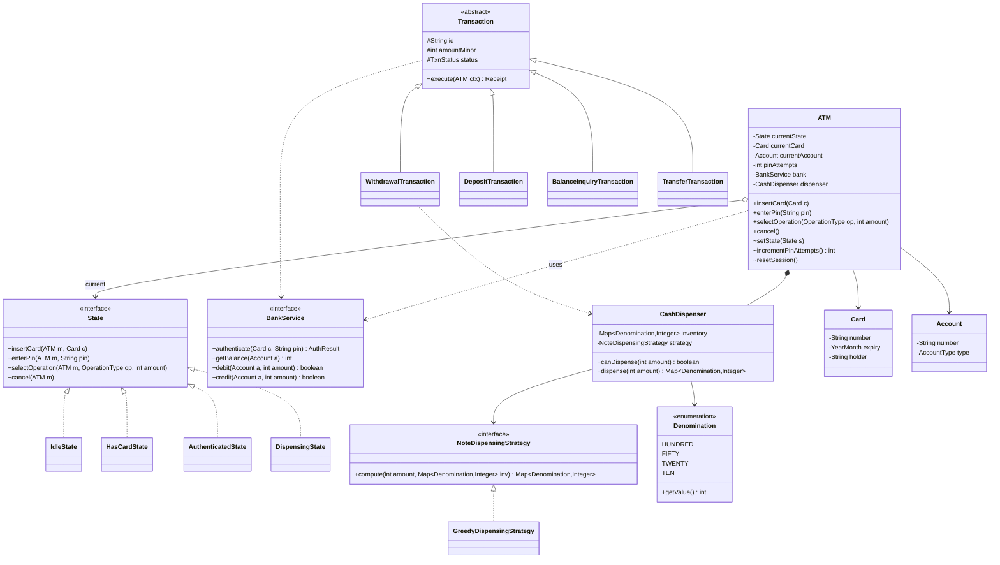
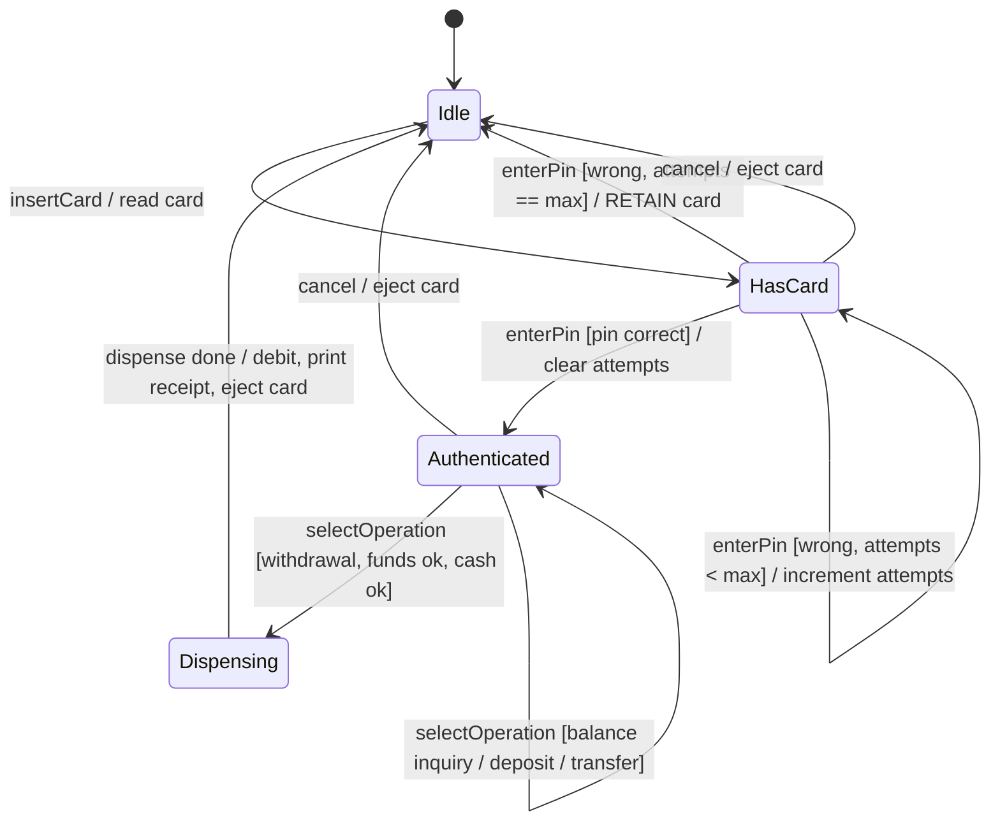

# Design an ATM

The ATM is the **State-pattern flagship** of LLD interviews — even more so than the vending
machine, because the flow has a genuine multi-step lifecycle: insert card → authenticate PIN →
select operation → execute → dispense/return card. A machine whose response to *the same
action* depends entirely on *how far into the session you are* is the textbook finite state
machine, and the interviewer is watching for whether you reach for **State** or drown in a
`if (cardInserted && pinOk && !dispensing && ...)` swamp. Secondary themes: a **transaction
type hierarchy** (Withdrawal / Deposit / BalanceInquiry / Transfer) modeled with Command or
Strategy, a **cash-dispensing (note-selection) algorithm**, a clean seam to the **bank
backend**, and hard edge cases (wrong-PIN lockout, card retention, insufficient ATM cash).

Budget for a 45–60 min session: ~5 min requirements, ~10 min entities + state diagram,
~20 min classes and code, ~10 min dispensing algorithm and edge cases, rest for follow-ups.

## Requirements Clarification

Never draw classes before scoping. High-signal clarifying questions for an ATM:

- **Operations in scope?** Withdrawal, balance inquiry, deposit, transfer, mini-statement,
  PIN change? (Baseline: withdrawal + balance inquiry + deposit + transfer — enough to justify
  a transaction hierarchy. PIN change / statement are easy add-ons.)
- **Authentication?** Card + PIN. How many wrong-PIN attempts before lockout, and what happens —
  eject or **retain (eat) the card**? (Baseline: 3 attempts, then retain card.)
- **Is the bank backend in scope or a dependency?** The ATM does **not** own account balances;
  a `BankService` authenticates and debits/credits. We design the *seam*, not the core banking
  system. (This keeps it LLD, not distributed banking.)
- **Cash dispensing?** Which denominations? Must it minimize the number of notes? What if the
  requested amount isn't composable from available notes, or the ATM is short on cash?
  (Baseline: fixed denominations, greedy note count, and "cannot dispense" is a first-class error.)
- **Deposit?** Cash and/or cheque? Instant credit or hold? (Baseline: cash deposit into an
  envelope/bin, credited via `BankService`; cheque deposit is an extensibility follow-up.)
- **Concurrency?** One physical card slot means one customer at a time — but the shared
  `BankService` and the ATM's own cash inventory are touched by that session and by
  admin/replenishment. Say this out loud.

Explicitly **scope out**: the core banking system, fraud detection, card-network (ISO-8583)
protocol details, encryption/HSM specifics, cash-logistics fleet management. Those are backend
/ HLD / security concerns — name them and move on (see the system-design domain).

Two ground rules to state out loud:

1. **Money is integer minor units** (cents/paise) or a `Money` value object — never `double`.
2. **The ATM is a finite state machine** — name the states before writing any class.

## Use Cases and Actors

The Grokking UML-first move: enumerate actors and their use cases before classes.

- **Customer (cardholder)** — insert card, enter PIN, withdraw cash, deposit cash, check
  balance, transfer funds, cancel/eject.
- **Bank / BankService (external actor)** — authenticate card+PIN, authorize and post
  debits/credits, return account balance. The ATM is a *client* of this actor.
- **Operator / Technician (admin actor)** — replenish cash, service the machine, retrieve
  retained cards. Modeled as a small admin API, no auth flows.

The primary success scenario — *withdraw cash* — drives the design: `insertCard →
authenticate → selectWithdrawal(amount) → [check balance via bank] → [dispense notes] →
[post debit] → printReceipt → ejectCard`. Every alternate flow (wrong PIN, insufficient funds,
insufficient ATM cash, cancel) is an exception branch off this spine.

## Noun/Verb Object Identification

Pull candidate classes from the **nouns** and candidate methods from the **verbs** in the
requirements, then **filter** — not every noun becomes a class.

**Nouns → candidate classes:** ATM, Card, PIN, Account, Bank/BankService, Customer,
Transaction, Withdrawal, Deposit, Balance inquiry, Transfer, Cash, Note/Denomination,
CashDispenser, Screen, Keypad, CardReader, Receipt/Printer, State, Session, Attempt-counter.

**Verbs → candidate methods:** insert(card), read(card), authenticate/verify(PIN),
select(operation), enter(amount), withdraw, deposit, transfer, check(balance), dispense(cash),
eject/retain(card), print(receipt), debit, credit.

**Filtering — the judgment the interviewer wants to see:**

| Candidate | Verdict | Why |
|---|---|---|
| `ATM` | **Class** (the State *context*) | Holds current state + collaborators; delegates actions |
| `State` + concrete states | **Classes** | Each phase's legal behavior — the star pattern |
| `Card` | **Class** (value-ish) | card number, expiry, holder — data the reader produces |
| `PIN` | **Not a class** | A short secret; a `String`/`char[]` field or param, verified by the bank. Modeling it as a class is over-engineering |
| `Customer` | **Usually not modeled** | The physical human is an actor, not an in-memory object; the `Card` + `Account` represent them |
| `Account` | **Class** (or bank-side DTO) | account number, type, balance — but owned by the bank, referenced by the ATM |
| `BankService` | **Interface** | The seam to the backend: `authenticate`, `getBalance`, `debit`, `credit` |
| `Transaction` (+ subtypes) | **Class hierarchy** | Withdrawal/Deposit/BalanceInquiry/Transfer share a lifecycle but differ in `execute` |
| `CashDispenser` | **Class** | Owns the note inventory + dispensing algorithm |
| `Denomination` | **Enum** | Fixed closed set with a value — an enum, not a hierarchy |
| `Screen`, `Keypad`, `CardReader`, `Printer` | **Classes/interfaces** | Hardware boundary devices; thin, mockable |
| `Balance` | **Not a class** | An attribute (int minor units), not an object |
| `Session` | **Optional** | Transient per-card context (auth state, timeout). Often folded into the ATM context; extract it if you want clean multi-transaction sessions |

State the filter rule aloud: *a noun earns a class only if it has state + behavior or a
distinct responsibility; pure data becomes a field, and external humans stay actors.*

## Responsibilities and Relationships

CRC-style — what each class *knows* and *does*, plus collaborators:

| Class | Knows (data) | Does (behavior) | Collaborators |
|---|---|---|---|
| `ATM` | current `State`, current `Card`, active `Account`/session, wrong-PIN attempts, references to devices | delegates user actions to state; exposes context mutators (`setState`, `setCurrentCard`) | `State`, `BankService`, `CashDispenser`, `Screen`, `Keypad`, `CardReader` |
| `State` (interface) | — | contract: `insertCard`, `enterPin`, `selectOperation`, `dispenseCash`/`execute`, `cancel` | `ATM` (passed in) |
| concrete states | — (stateless, shareable) | implement legal actions for their phase; reject the rest; trigger transitions | `ATM` |
| `BankService` (interface) | — | `authenticate(card, pin)`, `getBalance(acct)`, `debit(acct, amt)`, `credit(acct, amt)` | `Card`, `Account` |
| `Transaction` (abstract) | id, type, amount, timestamp, status | `execute(ATM ctx)` template; produce a `Receipt` | `BankService`, `CashDispenser` |
| `WithdrawalTransaction` | amount | check balance → dispense → debit | `CashDispenser`, `BankService` |
| `CashDispenser` | note inventory per `Denomination` | `canDispense(amount)`, `dispense(amount)` via a note-selection strategy | `Denomination`, `NoteDispensingStrategy` |
| `Card` | number, expiry, holder name | — (pure data read from the magstripe/chip) | — |
| `Account` | account number, type, (balance is bank-side) | — | — |

**Relationships to narrate:**

- `ATM` **composes** its devices (`CardReader`, `CashDispenser`, `Screen`, `Keypad`, `Printer`)
  — they have no life outside the machine (composition, filled diamond).
- `ATM` holds a *reference* to its current `State`; the concrete states are shared flyweights,
  not owned parts (aggregation-like).
- `ATM` **depends on** `BankService` (a collaborator injected via the constructor — Dependency
  Inversion: the ATM depends on the interface, not a concrete bank).
- `Transaction` is an **inheritance** hierarchy (`Withdrawal --|> Transaction`) — the subtypes
  are genuine *is-a* variants that differ in the `execute` algorithm.
- `CashDispenser` **has-a** `NoteDispensingStrategy` (composition of an algorithm — Strategy).

## Class Diagram



Relationship notes worth saying aloud:

- `ATM o--> State` (aggregation arrow) — the machine references shared, stateless state
  instances; it does not own their lifecycle.
- `ATM ..> BankService` (dependency) — the ATM *uses* an injected interface; it doesn't own
  or compose the bank.
- `ATM *-- CashDispenser` (composition) — the dispenser is a physical part of this machine.
- `Transaction <|-- WithdrawalTransaction` (inheritance) — genuine *is-a* variants.

## State Machine

Draw this before writing code — it is the spec the states implement:



Rules encoded here:

- `insertCard` is meaningful **only in `Idle`**; in every other state it is rejected (a card
  is already inserted). The State pattern enforces this structurally.
- `enterPin` has **three outcomes** from `HasCard`: correct → `Authenticated`; wrong with
  attempts remaining → stay in `HasCard`; wrong on the final attempt → **retain the card** and
  return to `Idle`. This branching is exactly what a naive `if`-ladder gets wrong.
- `selectOperation` is only legal in `Authenticated`. A withdrawal that passes both guards
  (sufficient account funds **and** the dispenser can compose the amount) transitions to
  `Dispensing`; non-cash operations (balance/deposit/transfer) complete in place and stay in
  `Authenticated` so the customer can do another.
- `Dispensing` accepts no new user input — it releases cash, posts the debit, prints, ejects.
- Every terminal path resets the session (clears card, account, attempts) and returns to `Idle`.

Each transition maps 1:1 to a `atm.setState(...)` call inside a concrete state method.

## Key Design Decisions and Patterns

Classify each pattern by GoF intent and justify it. (The `dp-*` topics own the mechanics —
here we *apply* and name them.)

**State (Behavioral) — the star.** Each user action (`insertCard`, `enterPin`,
`selectOperation`) behaves differently per phase. Without the pattern, every method becomes a
conditional ladder over a status enum, and *every* new state or action means editing *every*
ladder — shotgun surgery and an Open/Closed violation. With State, each concrete state class is
the single home for "what is legal right now"; illegal actions fail in one obvious place, and
adding `MaintenanceState` is a new class, not edits everywhere. Cross-ref `dp-behavioral-state`.

**Command or Strategy (Behavioral) — transaction types.** The four operations share a
lifecycle (validate → execute → produce receipt) but differ in the body. Two clean models:
(a) a `Transaction` **hierarchy** with an abstract `execute()` (Template Method flavor), or
(b) **Command** — each operation is a command object with `execute()`/`undo()`, which also
gives you a transaction *log* and reversal for free. Command shines when the interviewer asks
for auditing/rollback; the hierarchy is lighter for a plain menu. Cross-ref
`dp-behavioral-command` / `dp-behavioral-strategy`.

**Strategy (Behavioral) — cash dispensing.** `NoteDispensingStrategy` isolates the
note-selection algorithm. **Greedy** (largest denomination first) is optimal for canonical
note systems and minimizes the note count, but can *fail* when the greedy pick strands the
remainder (e.g., only {30, 20} available for 40, or a low inventory of small notes); a DP /
backtracking strategy handles odd sets. Swapping strategies is a config change, not a rewrite.
(Algorithm internals belong to `dsa-coding`; here the design point is the seam.)

**Factory (Creational) — transaction creation.** A `TransactionFactory.create(OperationType,
amount)` centralizes construction so `AuthenticatedState` doesn't hard-code `new
WithdrawalTransaction(...)` — adding a `PinChangeTransaction` touches only the factory.
Cross-ref `dp-creational-factory-method`.

**Chain of Responsibility (Behavioral) — optional, for validation/dispensing.** Some designs
model the denomination payout as a chain (a handler per note value passes the remainder down)
or model pre-transaction checks (card valid → PIN ok → funds ok → cash ok) as a chain. Mention
it as an alternative to Strategy; don't over-build it.

**Dependency Inversion — `BankService` as an interface.** The ATM depends on a `BankService`
*abstraction*, injected via the constructor. This is what keeps it testable (mock the bank) and
what makes "the ATM doesn't own balances" true in code. Cross-ref `solid-principles`.

**Stateless states → share them.** Session data (card, account, attempts) lives on the `ATM`
context, so concrete states have no fields — make each a singleton or a Java `enum`.

**No Singleton for the `ATM` itself.** Tempting ("there's one machine") but wrong — operators
run fleets and singletons poison testability. Instantiate normally.

## API and Method Signatures

The public surface a customer (via the panel) touches, plus admin and the bank seam:

```java
public interface AtmApi {
    void insertCard(Card card);
    void enterPin(String pin);
    // op = WITHDRAWAL | BALANCE_INQUIRY | DEPOSIT | TRANSFER; amount in minor units
    TransactionResult selectOperation(OperationType op, int amountMinor);
    void cancel();                         // eject card, reset session
}

public interface BankService {
    AuthResult authenticate(Card card, String pin);   // PIN verified bank-side, never on ATM
    int getBalance(Account account);
    boolean debit(Account account, int amountMinor);  // atomic, returns success
    boolean credit(Account account, int amountMinor);
}

public interface CashDispenser {
    boolean canDispense(int amountMinor);              // guard BEFORE committing a withdrawal
    Map<Denomination, Integer> dispense(int amountMinor); // throws if not composable
}

public interface AdminApi {
    void loadCash(Denomination d, int count);
    Map<Denomination, Integer> collectDeposits();
    List<Card> retrieveRetainedCards();
}
```

Design notes:

- **PIN is verified by the bank, not the ATM** — the ATM never stores or compares the real
  PIN (security + single responsibility). It forwards `enterPin` to `BankService.authenticate`.
- **Split customer / admin / bank interfaces** (Interface Segregation) — the panel never sees
  `collectDeposits()`; the ATM only sees the `BankService` methods it needs.
- Errors surface as domain results/exceptions — `InsufficientFundsException`,
  `InsufficientCashException`, `CardRetainedException` — pick a `Result` object *or* exceptions
  and stay consistent. Never return `null` or a magic int.

## Code Skeleton

Java, trimmed to structure. States take the `ATM` as a parameter so instances stay shareable:

```java
public enum Denomination {
    HUNDRED(10000), FIFTY(5000), TWENTY(2000), TEN(1000); // value in minor units
    private final int value;
    Denomination(int v) { this.value = v; }
    public int getValue() { return value; }
}

public interface State {
    void insertCard(ATM m, Card card);
    void enterPin(ATM m, String pin);
    void selectOperation(ATM m, OperationType op, int amountMinor);
    void cancel(ATM m);
}

public class IdleState implements State {
    public void insertCard(ATM m, Card card) {
        m.getCardReader().read(card);
        m.setCurrentCard(card);
        m.setState(m.getHasCardState());
        m.getScreen().prompt("Enter PIN");
    }
    public void enterPin(ATM m, String pin)        { throw new IllegalStateException("Insert card first"); }
    public void selectOperation(ATM m, OperationType op, int amt) { throw new IllegalStateException("Insert card first"); }
    public void cancel(ATM m)                      { /* no-op: nothing to cancel */ }
}

public class HasCardState implements State {
    private static final int MAX_ATTEMPTS = 3;
    public void insertCard(ATM m, Card card)       { throw new IllegalStateException("Card already inserted"); }
    public void enterPin(ATM m, String pin) {
        AuthResult res = m.getBank().authenticate(m.getCurrentCard(), pin);
        if (res.isSuccess()) {
            m.setCurrentAccount(res.getAccount());
            m.resetPinAttempts();
            m.setState(m.getAuthenticatedState());
            m.getScreen().prompt("Select operation");
            return;
        }
        int attempts = m.incrementPinAttempts();
        if (attempts >= MAX_ATTEMPTS) {
            m.getCardReader().retainCard();            // eat the card
            m.resetSession();
            m.setState(m.getIdleState());
            throw new CardRetainedException("Too many wrong attempts");
        }
        m.getScreen().prompt("Wrong PIN, " + (MAX_ATTEMPTS - attempts) + " attempts left");
    }
    public void selectOperation(ATM m, OperationType op, int amt) { throw new IllegalStateException("Authenticate first"); }
    public void cancel(ATM m) {
        m.getCardReader().ejectCard();
        m.resetSession();
        m.setState(m.getIdleState());
    }
}

public class AuthenticatedState implements State {
    public void insertCard(ATM m, Card card)       { throw new IllegalStateException("Card already inserted"); }
    public void enterPin(ATM m, String pin)        { throw new IllegalStateException("Already authenticated"); }
    public void selectOperation(ATM m, OperationType op, int amount) {
        Transaction txn = TransactionFactory.create(op, m.getCurrentAccount(), amount);
        if (op == OperationType.WITHDRAWAL) {
            // guard BOTH: account funds and physical cash, BEFORE dispensing
            if (m.getBank().getBalance(m.getCurrentAccount()) < amount)
                throw new InsufficientFundsException();
            if (!m.getDispenser().canDispense(amount))
                throw new InsufficientCashException();
            m.setPendingTransaction(txn);
            m.setState(m.getDispensingState());
            m.getDispensingState().dispenseCash(m);       // drive the next step
        } else {
            txn.execute(m);                                // balance/deposit/transfer complete in place
            // stays in AuthenticatedState — customer may do another
        }
    }
    public void cancel(ATM m) {
        m.getCardReader().ejectCard();
        m.resetSession();
        m.setState(m.getIdleState());
    }
}

public class DispensingState implements State {
    public void insertCard(ATM m, Card c)                        { throw new IllegalStateException("Busy"); }
    public void enterPin(ATM m, String pin)                      { throw new IllegalStateException("Busy"); }
    public void selectOperation(ATM m, OperationType op, int a)  { throw new IllegalStateException("Busy"); }
    public void dispenseCash(ATM m) {
        Transaction txn = m.getPendingTransaction();
        Map<Denomination, Integer> notes = m.getDispenser().dispense(txn.getAmount());
        m.getBank().debit(m.getCurrentAccount(), txn.getAmount());  // post AFTER cash committed
        m.getPrinter().printReceipt(txn);
        m.getCardReader().ejectCard();
        m.resetSession();
        m.setState(m.getIdleState());
    }
    public void cancel(ATM m)                                    { throw new IllegalStateException("Too late to cancel"); }
}

public class ATM {
    private final State idle = new IdleState();
    private final State hasCard = new HasCardState();
    private final State authenticated = new AuthenticatedState();
    private final DispensingState dispensing = new DispensingState();

    private State currentState = idle;
    private Card currentCard;
    private Account currentAccount;
    private int pinAttempts = 0;
    private Transaction pendingTransaction;

    private final BankService bank;              // injected — Dependency Inversion
    private final CashDispenser dispenser;
    private final CardReader cardReader;
    private final Screen screen;
    private final Printer printer;

    public ATM(BankService bank, CashDispenser dispenser, CardReader reader,
               Screen screen, Printer printer) {
        this.bank = bank; this.dispenser = dispenser; this.cardReader = reader;
        this.screen = screen; this.printer = printer;
    }

    // public API — pure delegation, no conditionals on state
    public void insertCard(Card c)                                { currentState.insertCard(this, c); }
    public void enterPin(String pin)                              { currentState.enterPin(this, pin); }
    public void selectOperation(OperationType op, int amount)     { currentState.selectOperation(this, op, amount); }
    public void cancel()                                          { currentState.cancel(this); }

    // context mutators used by states
    void setState(State s)          { this.currentState = s; }
    int incrementPinAttempts()      { return ++pinAttempts; }
    void resetPinAttempts()         { pinAttempts = 0; }
    void resetSession()             { currentCard = null; currentAccount = null;
                                      pinAttempts = 0; pendingTransaction = null; }
    // getters: getHasCardState, getAuthenticatedState, getDispensingState, getIdleState,
    //          getBank, getDispenser, getCardReader, getScreen, getPrinter,
    //          getCurrentCard, getCurrentAccount, setCurrentCard, setCurrentAccount,
    //          setPendingTransaction, getPendingTransaction ...
}
```

```java
public abstract class Transaction {
    protected final String id;
    protected final Account account;
    protected final int amountMinor;
    protected TxnStatus status = TxnStatus.PENDING;
    protected Transaction(Account a, int amt) { this.id = UUID.randomUUID().toString();
                                                this.account = a; this.amountMinor = amt; }
    public int getAmount() { return amountMinor; }
    public abstract Receipt execute(ATM ctx);   // subtypes differ only here
}

public class BalanceInquiryTransaction extends Transaction {
    public BalanceInquiryTransaction(Account a) { super(a, 0); }
    public Receipt execute(ATM ctx) {
        int bal = ctx.getBank().getBalance(account);
        status = TxnStatus.SUCCESS;
        return Receipt.balance(account, bal);
    }
}

public interface NoteDispensingStrategy {
    /** Notes to dispense, or throws InsufficientCashException. */
    Map<Denomination, Integer> compute(int amount, Map<Denomination, Integer> inventory);
}

public class GreedyDispensingStrategy implements NoteDispensingStrategy {
    public Map<Denomination, Integer> compute(int amount, Map<Denomination, Integer> inv) {
        Map<Denomination, Integer> out = new EnumMap<>(Denomination.class);
        for (Denomination d : Denomination.values()) {          // declared largest-first
            int take = Math.min(amount / d.getValue(), inv.getOrDefault(d, 0));
            if (take > 0) { out.put(d, take); amount -= take * d.getValue(); }
        }
        if (amount != 0) throw new InsufficientCashException(); // couldn't compose exactly
        return out;
    }
}
```

The tell that the pattern is working: `ATM`'s public methods contain **zero** `if`/`switch`
on machine status — all conditional behavior lives inside states.

## Extensibility

The follow-ups an interviewer will actually ask, and the seam each one uses:

- **"Add cheque deposit."** New `ChequeDepositTransaction extends Transaction` + a factory
  branch; the deposit posts a *hold* via `BankService.credit` with a clearing delay. No state
  class changes — Open/Closed holds via the transaction hierarchy + factory.
- **"Add a new operation (mini-statement, PIN change)."** One new `Transaction` subtype and one
  factory line. `AuthenticatedState` already delegates through the factory, so it's untouched.
- **"Cardless / QR / UPI withdrawal."** Introduce an `AuthMethod` abstraction (`CardAuth`,
  `OtpAuth`, `QrAuth`) so `IdleState`/`HasCardState` depend on the auth abstraction, not on a
  physical card. The bank seam already takes a credential object.
- **"Multi-currency."** `Denomination` gains a `Currency`, and `CashDispenser` keeps per-currency
  inventories; the strategy is unchanged because nothing hardcodes note values outside the enum.
- **"Add a MaintenanceState"** (all customer actions rejected, admin can service): one new
  `State` class plus the transitions in/out. Existing states untouched — the payoff of State.
- **"Transaction audit log / reversal."** Switch the transaction hierarchy to **Command** with
  `execute()`/`undo()` and keep a history list; reversal becomes `command.undo()`.
- **"Different dispensing policy per market."** Swap `NoteDispensingStrategy`
  (greedy → DP/backtracking) — a constructor argument, not a rewrite.

## Concurrency and Edge Cases

**Concurrency.** Be honest about the physics: one physical card slot means customer actions on a
single ATM are inherently **serial** — don't invent locks for imaginary races between two
customers on one machine. Real concurrency lives at two seams:

- **The `BankService` backend** is shared across many ATMs. The debit must be **atomic and
  authoritative on the bank side** — the ATM must not read-balance-then-debit as two racy steps;
  it calls `debit(account, amount)` which the bank performs under its own transaction (optimistic
  locking / conditional update). Two ATMs withdrawing from a joint account concurrently is the
  bank's consistency problem, not the ATM's — name it and point to system-design for the
  distributed story.
- **The ATM's own cash inventory** is touched by the active session and by admin replenishment.
  Guard `CashDispenser` mutations (a coarse `synchronized`/lock is plenty at ATM throughput).

**Order of operations (the critical invariant):** guard funds **and** cash *before* the
`Dispensing` transition, and post the debit **after** cash is physically committed. You can't
un-dispense notes; a debit-then-jam is worse than a jam-then-no-debit.

**Edge cases checklist:**

- **Wrong PIN lockout** — count attempts on the `ATM` context (not on a state, so states stay
  shareable); on the final failure **retain the card** and reset to `Idle`. State the attempt
  limit as a policy constant.
- **Insufficient account funds** — checked via `BankService.getBalance`/authorization before
  dispensing; reject and stay in `Authenticated` so the customer can try a smaller amount.
- **Insufficient ATM cash / non-composable amount** — `canDispense(amount)` must respect the
  *limited note inventory*, not just arithmetic divisibility (greedy can say "yes" when the
  actual notes strand a remainder). Reject before dispensing.
- **Card retained / customer walks away mid-session (timeout)** — a session timer fires
  `cancel()` after N seconds, ejecting the card and resetting; if not taken, retain it.
- **Dispense hardware jam** — notes counted but not released: post *no* debit, flag maintenance,
  reverse any partial commit. This is exactly why the debit follows physical dispensing.
- **Power failure mid-transaction** — persist a small journal (state, account, pending txn) so
  boot can reconcile with the bank (was the debit posted?) and refund/retry. Mention it, don't
  build it.
- **Expired / invalid / foreign card** — rejected at `read`/`authenticate`; the model only ever
  advances on a valid, bank-recognized card.

## Common Interview Follow-ups

1. **"Why State and not an enum + switch?"** — For 2 states a switch is fine; State wins as the
   action×state matrix grows (4 states × 4 actions here): each state's rules live in one class,
   new states don't touch existing code, illegal-action handling is structural. Know the crossover.
2. **"Where does the PIN get verified?"** — Bank-side, always. The ATM forwards the PIN to
   `BankService.authenticate`; it never stores or compares the real PIN (security + SRP).
3. **"Model the four transaction types — hierarchy or Command?"** — Hierarchy/Template Method
   for a plain menu; Command when you need audit log / reversal. Justify by requirement.
4. **"Withdraw amount the machine can't compose?"** — `canDispense` respecting limited note
   inventory; greedy vs DP note-selection; reject before the `Dispensing` transition.
5. **"Two ATMs, same account, at once?"** — Consistency is the bank's job (atomic conditional
   debit); the ATM stays single-session. Distributed detail → system-design.
6. **"Order of debit vs dispense?"** — Guard first, dispense, then debit; never debit-then-jam.
7. **"Add cardless withdrawal / cheque deposit / new currency."** — Auth abstraction / new
   Transaction subtype / per-currency inventory — all Open/Closed via existing seams.
8. **"How do you test this?"** — States are pure and shareable: unit-test each against a mock
   `ATM` + mock `BankService`; property-test the dispensing strategy (sum of notes == amount,
   every note within inventory).

## References

- Gamma, Helm, Johnson, Vlissides — *Design Patterns* (GoF): State, Strategy, Command, Factory Method.
- Freeman & Robson — *Head First Design Patterns*, Ch. 10 "The State of Things" (the gumball/state machine that generalizes to the ATM).
- Cross-reference in this library: `dp-behavioral-state`, `dp-behavioral-command`, `dp-behavioral-strategy`, `dp-creational-factory-method` (pattern mechanics), `design-vending-machine` (sibling state machine), `lld-interview-method` (session structure), `solid-principles` (DIP / ISP), `dsa-coding` (coin/note-change DP internals).
- Grokking-style LLD problem sets: "Design an ATM" chapters (educative.io / GitHub `awesome-low-level-design`).
