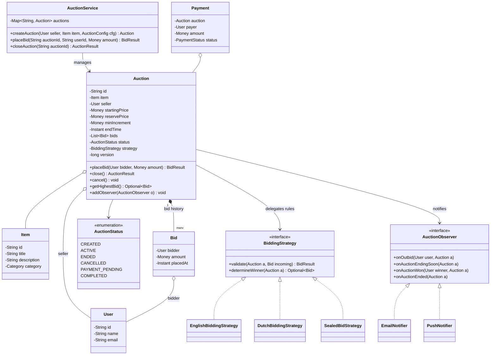
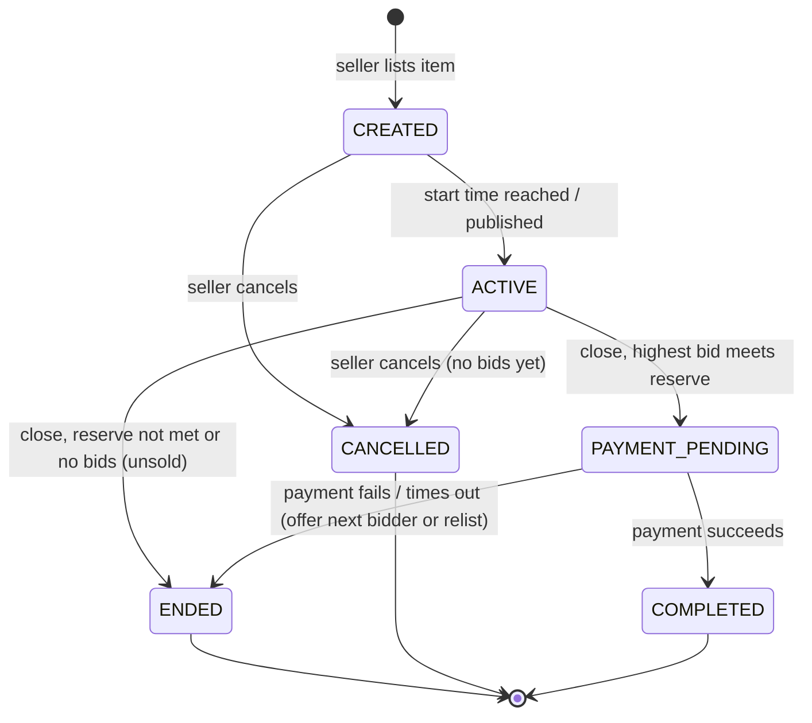

# Design an Online Auction System

> A classic "moderate-hard" LLD problem: a marketplace where sellers list items and buyers
> compete through bids. It packs three heavyweight patterns into one design — **Strategy**
> (auction type determines bidding rules), **State** (auction lifecycle), and **Observer**
> (outbid / ending / won notifications) — plus a genuinely interesting concurrency question:
> what happens when two bids for the same auction arrive at the same instant? Interviewers
> use it to test whether you can keep a multi-actor, time-driven domain model clean under
> a 60-minute clock.

## Requirements Clarification

Spend the first five minutes narrowing scope. Good questions and typical answers:

- **Which auction types?** English (ascending open bids — the default), Dutch (price
  descends until someone accepts), Sealed-bid (each bidder submits one secret bid; highest
  wins). Supporting more than one type is the hook for the Strategy pattern — ask
  explicitly whether new types should be pluggable.
- **Bidding rules?** A bid must exceed the current highest bid by at least a **minimum
  increment**; the seller cannot bid on their own auction; bids are only accepted while
  the auction is ACTIVE.
- **Reserve price?** Yes — a hidden minimum set by the seller. If the highest bid at close
  is below the reserve, the auction ends unsold. Bidders see "reserve not met", never the
  number.
- **How does an auction end?** By timer (fixed end time) for English/Sealed; by first
  acceptance for Dutch. Ask whether **anti-sniping** (extending the end time when a bid
  lands in the final seconds) is in scope — it is a favorite follow-up.
- **After the win?** Winner pays; item transfers. Model `Payment` as a thin entity and a
  `PaymentService` boundary — actual gateway integration is out of scope.
- **Notifications?** Notify a bidder when outbid, all watchers when an auction is ending
  soon, and the winner/seller at close. This is the Observer hook.

**Scope OUT explicitly:** search/browse, fraud detection, escrow, shipping, distributed
scale ("millions of concurrent bidders" is an HLD/system-design concern — say so and move
on). Keep the design single-process, in-memory, thread-safe.

> [!INTERVIEW]
> Say early: "I'll design for English auctions first but put the bidding rules behind a
> strategy interface so Dutch and sealed-bid drop in without touching `Auction`." That one
> sentence signals Open/Closed thinking and usually earns the follow-up you're prepared for.

## Core Objects and Entities

Identify the nouns and give each one job:

| Class | Responsibility |
|---|---|
| `User` | Identity/profile. A user can act as buyer or seller per auction — prefer **roles per interaction** over `Buyer`/`Seller` subclasses (the same person does both). |
| `Item` | What is being sold: title, description, category. No auction logic. |
| `Auction` | The aggregate root: owns the item reference, seller, reserve price, min increment, start/end time, ordered bid history, current status. Enforces invariants — every bid enters through `Auction.placeBid(...)`. |
| `Bid` | Immutable value: bidder, amount, timestamp. Once placed, a bid never changes — immutability makes the bid history an audit log and removes a whole class of race conditions. |
| `AuctionStatus` | Enum backing the state machine: `CREATED`, `ACTIVE`, `ENDED`, `CANCELLED`, `PAYMENT_PENDING`, `COMPLETED`. |
| `BiddingStrategy` | Strategy interface: validates/accepts a bid and decides the winner per auction type (English / Dutch / Sealed). |
| `AuctionObserver` | Observer interface: `onOutbid`, `onAuctionEndingSoon`, `onAuctionWon`, `onAuctionEnded`. Implemented by notification channels. |
| `AuctionService` | Facade / entry point: create auction, place bid, close auction; owns the registry `Map<AuctionId, Auction>` and the scheduler that fires closings. |
| `Payment` | Records winner, amount, status for a completed auction. Processed by a `PaymentService` behind an interface. |

Key relationships: `Auction` **composes** its `Bid` list (bids don't exist outside their
auction); `Auction` **aggregates** `Item` and `User` (they exist independently);
`Auction` **has-a** `BiddingStrategy` (composition over inheritance — do *not* create
`EnglishAuction extends Auction` subclasses; behavior varies, identity doesn't).

> [!WARNING]
> The classic modeling trap is `Buyer` and `Seller` as subclasses of `User`. A user who
> sells one item and bids on another would need to be two objects. Model the *role* as the
> relationship (auction has a `seller` reference; bids have a `bidder` reference), not as
> the user's type.

## Class Diagram



The lifecycle as a state machine:



## Key Design Decisions

**Strategy for auction type — not `Auction` subclasses.** English, Dutch, and sealed-bid
auctions differ only in *bidding rules and winner determination*; identity, bid history,
lifecycle, and notifications are shared. Encapsulate the varying part behind
`BiddingStrategy` and compose it into `Auction`. Adding a Vickrey (second-price sealed)
auction is then a new strategy class — `Auction` is closed to modification, open to
extension. Subclassing instead couples the type to construction time and multiplies every
future axis of variation (see the dp-strategy topic for the general pattern).

- *English:* reject a bid unless `amount >= highest + minIncrement`; winner = highest bid
  at close if `>= reserve`.
- *Dutch:* the "current price" descends on a schedule; the first bid at (or above) the
  current price wins immediately — the strategy both validates and triggers close.
- *Sealed:* accept exactly one bid per bidder, reveal nothing until close; winner = highest
  at close. `getHighestBid()` must not leak during ACTIVE — the strategy governs visibility.

**State for the lifecycle.** Which operations are legal depends entirely on status:
`placeBid` only in ACTIVE, `cancel` only before meaningful bids, `pay` only in
PAYMENT_PENDING. At interview scale, an enum + explicit transition checks inside `Auction`
is acceptable; if the interviewer pushes on "the if-else on status is growing", refactor
to State objects (`ActiveState.placeBid(...)`, `EndedState.placeBid(...) -> throws`) so
each state class owns its legal transitions (see dp-state). The non-negotiable part:
**transitions are validated in one place** — no external code sets `status` directly.

**Observer for notifications.** `Auction` announces domain events (outbid, ending soon,
ended, won); notifiers subscribe. The auction must not know about email vs. push vs. SMS —
that knowledge would couple the domain to delivery channels and violate SRP. New channel =
new `AuctionObserver` implementation, zero changes to `Auction` (see dp-observer).

**Money as a value type.** Use integer cents or `BigDecimal` wrapped in a `Money` value
object — never `double`. Bid comparison (`>= highest + increment`) must be exact.

**Bid is immutable.** Amount, bidder, and timestamp are set at construction. "Editing" a
bid is placing a new one. The bid list becomes an append-only audit log — crucial when a
seller disputes the outcome, and it simplifies concurrent reads.

**Reserve price stays hidden.** The reserve lives on `Auction` as private state consulted
only inside `close()` and in a boolean-returning `isReserveMet()`. Never expose the value
through any getter that reaches the API layer — leaking it changes bidder behavior. State
the **no-reserve default** explicitly: when the seller sets none, `reservePrice` defaults
to `startingPrice` (or `Money.ZERO`) so `isReserveMet()` is always well-defined — the
`close()` comparison must never dereference a null reserve.

## Bid Validation

All validation funnels through `Auction.placeBid`, which delegates rule-specific checks to
the strategy. The invariant checklist an interviewer expects you to enumerate:

1. Auction status is `ACTIVE` (state check).
2. `bidder != seller` — self-bidding (shilling) is rejected.
3. Amount rule per strategy — English: `amount >= currentHighest + minIncrement` (or
   `>= startingPrice` for the first bid); Sealed: bidder has not already bid; Dutch:
   `amount >= currentDescendingPrice`.
4. Timestamp within `[startTime, endTime]` — checked against the auction's clock, not the
   client's.

Return a `BidResult` (accepted / rejected + reason) rather than throwing for expected
outcomes like "too low" — being outbid a millisecond earlier is a normal domain result,
not an exceptional condition. Reserve-price failure is deliberately **not** a bid-time
rejection: bids below the reserve are still valid bids; the reserve is evaluated only at
close.

## Anti-Sniping and Auction Close

**Sniping** = bidding in the last seconds so no one can respond. Two standard mitigations;
know both and their trade-off:

- **Soft close (extension):** if a bid arrives within the final N seconds (say 60), push
  `endTime` out by M seconds. Repeat as needed, optionally capped. Kills the sniping
  incentive but makes the end time unpredictable.
- **Fixed hard close** (eBay's model) keeps end times predictable but rewards snipers.

Design impact of soft close: `endTime` becomes **mutable state guarded by the same lock as
bidding**, and the close must be scheduled as a *re-schedulable* task. On each accepted
bid: `if (endTime - now < snipeWindow) endTime = now + extension` and re-schedule the
closing job. The closing job itself must re-check `now >= endTime` under the lock before
transitioning to ENDED — otherwise a bid that extended the auction races with a stale
timer firing.

**Worked timeline — extension + stale timer.** `endTime = 12:00:00`, `snipeWindow = 60s`,
`extension = 120s`. A close task is scheduled to fire at `12:00:00`.

1. `11:59:30` — a bid lands. `endTime - now = 30s < 60s snipeWindow`, so
   `endTime = 11:59:30 + 120s = 12:01:30`. A **new** close task is scheduled for `12:01:30`.
   (The old `12:00:00` task is still queued — cancelling scheduled tasks reliably is fiddly,
   so we let it fire and defend at the guard instead.)
2. `12:00:00` — the **stale** task fires, acquires the lock, checks `now(12:00:00) >=
   endTime(12:01:30)`? **No.** It returns `currentResult()` — a no-op. The auction stays
   ACTIVE. This is exactly the `clock.instant().isBefore(endTime)` guard in `close()`.
3. `12:01:30` — the fresh task fires, checks `12:01:30 >= 12:01:30`? **Yes** → proceed to
   determine winner and transition. (Assuming no further late bid pushed `endTime` again.)

Without step 2's re-check the stale timer would close an auction that had legitimately been
extended, dropping the very bid that extended it.

**How does Dutch actually end?** English/Sealed close on the timer above; Dutch **inverts the
trigger** — the first acceptable bid wins *immediately*, no timer. Concretely, the Dutch
strategy's `validate` returns an "accept-and-close" signal, and `placeBid` acts on it: after
`bids.add(incoming)`, if `strategy.isWinningAcceptance(result)` is true, call `close(clock)`
right there inside the lock. Example: Dutch price ticks down `$500 → $450 → $400`; the first
bidder to accept `$400` is accepted, and that same call flips the auction to PAYMENT_PENDING —
the scheduled timer, if any, later finds the auction already closed and no-ops (idempotent
`close`).

At close: `strategy.determineWinner(auction)` picks the winning bid; if
`winner.amount >= reservePrice` transition to `PAYMENT_PENDING` and notify winner + seller,
else end unsold and notify "reserve not met".

## API and Method Signatures

```java
// Facade — what the interviewer's "driver" code calls
public interface AuctionService {
    Auction createAuction(String sellerId, Item item, AuctionConfig config);
    BidResult placeBid(String auctionId, String bidderId, Money amount);
    AuctionResult closeAuction(String auctionId);      // invoked by scheduler
    void cancelAuction(String auctionId, String sellerId);
    List<Bid> getBidHistory(String auctionId);         // hides amounts for sealed-bid while ACTIVE
}

public record AuctionConfig(Money startingPrice, Money reservePrice,
                            Money minIncrement, Duration duration,
                            AuctionType type) {}

public record BidResult(boolean accepted, String reason, Optional<Bid> bid) {}

public record AuctionResult(AuctionStatus finalStatus, Optional<Bid> winningBid) {}
```

Notes worth saying aloud: IDs (not object references) at the service boundary; `Money`
everywhere an amount appears; `closeAuction` is idempotent (closing an already-ENDED
auction is a no-op) because timers can fire twice.

## Code Skeleton

```java
public class Auction {
    private final String id;
    private final Item item;
    private final User seller;
    private final Money startingPrice;
    private final Money reservePrice;      // never exposed
    private final Money minIncrement;
    private volatile Instant endTime;      // mutable for anti-sniping
    private final List<Bid> bids = new ArrayList<>();
    private AuctionStatus status = AuctionStatus.CREATED;
    private final BiddingStrategy strategy;
    private final List<AuctionObserver> observers = new CopyOnWriteArrayList<>();
    private final Object lock = new Object();

    public BidResult placeBid(User bidder, Money amount, Clock clock) {
        synchronized (lock) {
            if (status != AuctionStatus.ACTIVE)
                return BidResult.rejected("Auction is not active");
            if (bidder.equals(seller))
                return BidResult.rejected("Seller cannot bid on own auction");

            Bid incoming = new Bid(bidder, amount, clock.instant());
            BidResult result = strategy.validate(this, incoming);
            if (!result.accepted()) return result;

            Optional<Bid> previousHighest = getHighestBid();
            bids.add(incoming);
            maybeExtendForSniping(clock);
            // Whether an outbid is announced during ACTIVE is a strategy concern, not a
            // hardcoded English behavior: sealed-bid must reveal nothing until close, so it
            // returns false here and stays silent. Route the decision through the strategy.
            if (strategy.revealsOutbidDuringActive()) {
                previousHighest.ifPresent(prev ->
                    notifyObservers(o -> o.onOutbid(prev.bidder(), this)));
            }
            return BidResult.accepted(incoming);
        }
    }

    public AuctionResult close(Clock clock) {
        synchronized (lock) {
            if (status != AuctionStatus.ACTIVE)
                return currentResult();                 // idempotent
            if (clock.instant().isBefore(endTime))
                return currentResult();                 // stale timer after extension
            Optional<Bid> winner = strategy.determineWinner(this);
            if (winner.isPresent() && winner.get().amount().gte(reservePrice)) {
                status = AuctionStatus.PAYMENT_PENDING;
                notifyObservers(o -> o.onAuctionWon(winner.get().bidder(), this));
            } else {
                status = AuctionStatus.ENDED;           // unsold or reserve not met
                winner = Optional.empty();              // no winner below reserve
            }
            notifyObservers(o -> o.onAuctionEnded(this));
            return new AuctionResult(status, winner);
        }
    }
}

public class EnglishBiddingStrategy implements BiddingStrategy {
    @Override
    public BidResult validate(Auction a, Bid incoming) {
        Money floor = a.getHighestBid()
                       .map(h -> h.amount().plus(a.getMinIncrement()))
                       .orElse(a.getStartingPrice());
        return incoming.amount().gte(floor)
            ? BidResult.accepted(incoming)
            : BidResult.rejected("Bid must be at least " + floor);
    }

    @Override
    public Optional<Bid> determineWinner(Auction a) {
        return a.getBidHistory().stream()
                .max(Comparator.comparing(Bid::amount)
                               .thenComparing(Bid::placedAt, Comparator.reverseOrder()));
    }
}
```

Ties on amount go to the **earlier** bid — hence the reversed timestamp tiebreak. Mention
this; interviewers notice when candidates handle equal bids.

One refinement worth naming aloud: the skeleton notifies observers *while holding the
lock* for brevity. In a production-shaped answer, collect the events under the lock and
dispatch them after release (or async) — calling foreign observer code under a lock risks
blocking all bidding on a slow notifier or re-entering the auction (see the concurrency
section).

## Extensibility

The "now add X" follow-ups and where each lands:

- **Auto-bidding / proxy bids** ("bid for me up to a max of $500"): add an `AutoBidder`
  (or `ProxyBidAgent`) that *implements `AuctionObserver`* — on `onOutbid`, it places the
  minimum bid needed (current highest + increment) capped at the user's max. Elegant
  because auto-bidding becomes a client of the existing API: no changes to `Auction` or
  the strategies. Two proxy bidders competing resolve in a quick escalation loop that
  terminates when one cap is exceeded.

  **Worked trace — two proxies ping-pong.** Opening `$50`, `minIncrement = $10`. A sets a
  proxy cap of `$200`, B sets `$150`. A bids first at the opening `$50`. Each `onOutbid`
  fires the minimum needed (`currentHighest + increment`), capped at the agent's max:

  | Bid | Actor | Reason | Amount | Highest after |
  |---|---|---|---|---|
  | 1 | A | opening | `$50` | A $50 |
  | 2 | B | outbid, `50+10=60 ≤ 150` cap | `$60` | B $60 |
  | 3 | A | outbid, `60+10=70 ≤ 200` cap | `$70` | A $70 |
  | … | … | (ping-pong in $10 steps) | … | … |
  | 10 | B | outbid, `130+10=140 ≤ 150` cap | `$140` | B $140 |
  | 11 | A | outbid, `140+10=150 ≤ 200` cap | `$150` | **A $150** |
  | — | B | outbid, `150+10=160 > 150` cap → **stops** | — | A $150 wins |

  Final: A wins at `$150`. B is **never charged** — a losing proxy bid is just a bid that got
  outbid. Note the subtlety: A wins at exactly B's cap because the `$10` ladder happened to
  land A's turn on `$150`; the loop terminates the instant one agent needs to exceed its own
  cap. (Real systems — eBay — skip the ladder and *jump* the winner to `loserCap + increment`
  = `$160` here, capped at the winner's max. That the naive step-by-step observer loop yields
  `$150` while a jump yields `$160` is itself the interview point: the escalation result is
  path-dependent unless you compute the settling price in one shot.)

- **Second-price / Vickrey sealed-bid:** worth a concrete trace because the payment is *not*
  the winning bid. Sealed bids come in at `$300` (X), `$250` (Y), `$180` (Z). `determineWinner`
  returns the highest bidder **X**, but the price paid is the **second-highest amount, `$250`**
  — X pays `$250`, not `$300`. That gap (`$300` bid, `$250` paid) is the whole point: bidding
  your true value is optimal because your bid sets *whether* you win, never *how much* you pay.
  This is exactly why `AuctionResult` must carry `winningBidder` and `pricePaid` as **separate
  fields** — in English auctions they coincide (`$160`/`$160` above), in Vickrey they don't.
- **Buy-it-now:** a fixed price that, if paid while the auction is ACTIVE (typically only
  before bidding crosses a threshold), ends it immediately. Implement as an operation on
  `Auction` guarded by state + strategy, transitioning straight to PAYMENT_PENDING.
- **New auction type (e.g., Vickrey second-price):** one new `BiddingStrategy`
  implementation — winner pays the *second-highest* amount, so `determineWinner` returns
  the highest bidder but the payable amount comes from the runner-up. This is precisely
  why `AuctionResult` should carry the winning bid *and* the price to pay as separate
  fields if you anticipate it.
- **Categories / search:** attributes on `Item` plus a query service — keep it out of
  `Auction`.
- **Millions of concurrent bidders, multi-region:** name it as an HLD problem (event
  streams, partitioning by auction ID, optimistic concurrency at the datastore) and point
  to the system-design domain; keep the OO model as designed.

## Concurrency and Edge Cases

**Two bids, same auction, same instant** — the signature concurrency question:

- **Coarse lock (shown above):** `synchronized` per-auction lock around `placeBid` and
  `close`. Bids on the *same* auction serialize; bids on different auctions don't contend.
  Simple, correct, and fine for an interview — contention is per-auction and bid rates per
  auction are human-scale.
- **Optimistic locking + retry:** give `Auction` a `version`; read state, validate, then
  CAS (compare-and-swap the version). On conflict, re-read and retry — the second bidder
  re-validates against the new highest bid and typically gets rejected as too low. This is
  the answer when state lives in a database (`WHERE version = ?` update) — mention it as
  the persistence-layer analogue.
- Either way, **the same lock must cover bid placement, end-time extension, and closing**,
  or a bid can slip in after the winner was determined.

**Worked trace — two "simultaneous" bids (coarse lock).** State before: `highestBid = $100`,
`minIncrement = $5`, so the floor for the next bid is `$105`. Thread A submits `$105`,
Thread B submits `$103`; both arrive in the same millisecond and race for the lock.

| Step | Thread | Action | Floor at check | Result | State after |
|---|---|---|---|---|---|
| 1 | A | acquires lock | `100 + 5 = 105` | `105 >= 105` → **accepted** | highest = **$105** |
| 2 | A | releases lock | — | — | highest = $105 |
| 3 | B | acquires lock | `105 + 5 = 110` | `103 >= 110`? no → **rejected** ("Bid must be at least 110") | highest = $105 |

The lock *serializes* the two; the loser doesn't see a stale floor. B re-reads the floor
as `$110` (against A's new highest), so its `$103` is correctly rejected as too low — the
outcome is deterministic, not a coin flip.

**Same race, optimistic locking (the DB analogue).** Now `Auction.version = 7`, and suppose
B bids `$110` (high enough to clear the *original* floor of `$105`). Both threads read
`highest = $100, version = 7` before either writes:

```
// read: highest=$100, version=7
// validate incoming against highest ($105 floor) → both A($105) and B($110) pass
UPDATE auction SET highest_bid=?, version = version + 1
 WHERE id = ? AND version = 7;      // CAS: only succeeds if version still 7
```

- **A** commits first: 1 row updated → `highest=$105, version=8`. Success.
- **B**'s CAS: `WHERE version = 7` now matches **0 rows** (version is 8) → conflict.
- B **re-reads** (`highest=$105, version=8`), re-validates: new floor `$110`, `110 >= 110`
  → still valid, retries the CAS `WHERE version = 8` → 1 row → `highest=$110, version=9`.

Retry loop, bounded so a hot auction can't spin forever:

```java
for (int attempt = 0; attempt < MAX_RETRIES; attempt++) {
    Snapshot s = read(auctionId);              // highest + version
    if (!validate(incoming, s)) return REJECTED; // too low → no point retrying
    int rows = db.update(
        "UPDATE auction SET highest_bid=?, version=version+1 " +
        "WHERE id=? AND version=?", incoming, auctionId, s.version());
    if (rows == 1) return ACCEPTED;            // CAS won
    // else another writer moved first → loop, re-read, re-validate
}
return REJECTED; // contention budget exhausted
```

Note the asymmetry: had B bid `$103` here, `validate` would fail on the *first* read and it
returns REJECTED without ever attempting the CAS — you only retry a bid that could still win.

Other edge cases to enumerate proactively:

- **Bid equal to current highest:** rejected (must exceed by increment). Two equal sealed
  bids: earlier timestamp wins — state the tiebreak.
- **Cancel with existing bids:** disallow (or require no bids / admin override); bidders
  have acted on the listing.
- **Winner doesn't pay:** PAYMENT_PENDING times out → offer to the next-highest bidder
  (second-chance offer) or relist. This is why ENDED → PAYMENT_PENDING is a distinct state.
- **Clock trust:** validate bid times with a server-side `Clock` (also makes tests
  deterministic — inject the clock).
- **Notification failure:** observers must be isolated — wrap each `notify` in try/catch
  (or dispatch async) so one failing email listener can't roll back or block a valid bid.
- **Observer callbacks under the lock:** calling foreign code while holding the auction
  lock is a hazard — a slow notifier stalls all bidding, and an observer that synchronously
  calls back into `placeBid` (e.g., an auto-bidder) re-enters the monitor. The sharp
  answer: collect events inside the critical section, dispatch them after releasing the
  lock (or hand them to an async dispatcher).

> [!KEY-TAKEAWAY]
> One aggregate (`Auction`) enforcing all invariants behind one lock, with three seams:
> Strategy for *how bidding works*, State/enum for *what's legal when*, Observer for
> *who hears about it*. Every follow-up (proxy bids, Vickrey, buy-it-now) lands in a seam,
> not in a rewrite.

## Common Interview Follow-ups

- **"Add proxy/auto-bidding."** Observer-based `AutoBidder` reacting to `onOutbid`, capped
  at the user's max — no core changes.
- **"Add a Dutch auction."** New `BiddingStrategy`; note it inverts the close trigger
  (first acceptance ends it, not a timer).
- **"How do you stop sniping?"** Soft close: extend `endTime` on late bids, guarded by the
  bidding lock, with a re-schedulable close task that re-checks the deadline.
- **"Two bids arrive simultaneously — walk me through it."** Per-auction lock: one wins the
  lock, becomes highest; the second validates against the new highest and gets rejected
  unless it still clears highest + increment. Or optimistic version + retry at the DB layer.
- **"Why not `EnglishAuction extends Auction`?"** Behavior (rules) varies independently of
  identity/lifecycle; composition via Strategy lets type be data-driven and combinable —
  subclass explosion looms once buy-it-now or reserve variants multiply.
- **"Where does payment live?"** `Payment` entity + `PaymentService` interface; the auction
  transitions on payment events but never talks to a gateway itself.
- **"What if the winner never pays?"** Timeout on PAYMENT_PENDING; second-chance offer to
  the runner-up or relist — supported because bid history is immutable and complete.
- **"Scale to a million watchers on one auction?"** Out of LLD scope — becomes fan-out via
  pub/sub infrastructure (system-design domain); the Observer interface is the in-process
  seam that the message bus would replace.

## References

- Gamma, Helm, Johnson, Vlissides — *Design Patterns* (Strategy, State, Observer).
- Joshua Bloch — *Effective Java*, 3rd ed. (immutability, enums, composition over inheritance).
- Eric Evans — *Domain-Driven Design* (aggregate roots and invariant enforcement).
- eBay Help — bidding rules, bid increments, and reserve prices (real-world reference for validation rules).
- Vickrey, W. (1961) — "Counterspeculation, Auctions, and Competitive Sealed Tenders" (second-price auctions).
- Related topics in this library: `dp-strategy`, `dp-state`, `dp-observer`, `solid-principles`.
