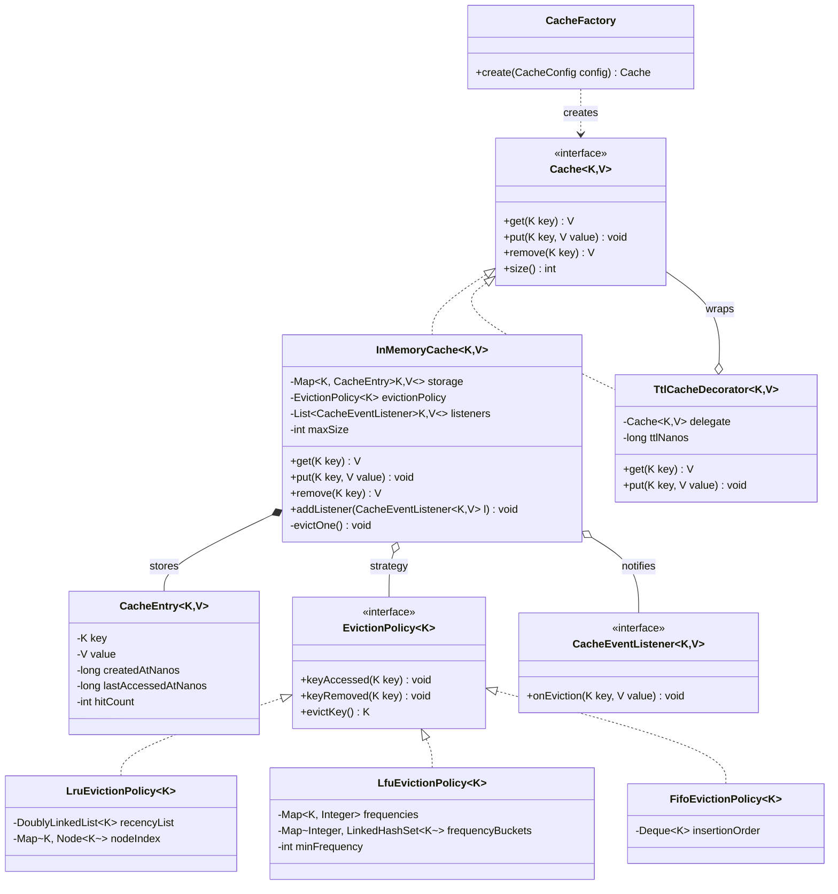

# Design an LRU / LFU Cache (OO)

This topic covers the cache design problem from the **object-oriented design** perspective —
not just the DSA trick of "HashMap + doubly linked list." In the LLD round the interviewer
is grading whether you can wrap that trick in clean, extensible classes: an interchangeable
eviction policy, a factory that assembles configurations, hooks for eviction notifications,
and a decorator for TTL. The data-structure internals matter, but the class boundaries
matter more.

## Requirements Clarification

Spend the first five minutes locking scope. Good clarifying questions for a cache:

- **Capacity model** — bounded by *entry count* or by *memory size*? (Interview default:
  entry count `maxSize`. Memory-based sizing needs a weigher function — mention it, scope it out.)
- **Eviction policy** — LRU only, or should the design support LFU / FIFO too? (Say: "I'll
  design the policy as a pluggable strategy so all three fit the same skeleton.")
- **Operations** — `get`, `put`; do we need `remove`, `containsKey`, `size`, `clear`?
- **What counts as an access?** — does `get` alone refresh recency, or does `put` on an
  existing key too? (Standard answer: **both** count as access for LRU/LFU.)
- **Miss behavior** — return `null` / `Optional.empty()`, or *load-through* (cache computes
  the value via a loader on miss, like Guava's `LoadingCache`)? Start with plain get/put;
  loader is an extension.
- **Null keys/values** — typically disallowed (a `null` return already means "miss";
  allowing null values makes `get` ambiguous).
- **TTL / expiry** — needed now? Usually deferred as a follow-up (design for it via Decorator).
- **Thread safety** — single-threaded first, then discuss locking as a follow-up.
- **Persistence / distribution** — explicitly out of scope: a distributed cache
  (Redis/Memcached) is an HLD problem. Keep this single-machine, in-process.

Scoping statement to say out loud: *"I'll build a bounded in-memory key-value cache with a
pluggable eviction strategy, LRU as the default, O(1) get/put, single-threaded first, and
I'll show where TTL and thread safety bolt on."*

## Core Objects and Responsibilities

Identify the nouns and give each **one** job (SRP is the main thing being graded):

| Class / Interface | Responsibility |
|---|---|
| `Cache<K,V>` (interface) | The public contract: `get`, `put`, `remove`, `size`. Callers depend on this, never on a concrete class. |
| `InMemoryCache<K,V>` | Orchestrates: checks capacity, delegates storage to the map, delegates victim selection to the policy, fires events. **Does not** know *how* a victim is chosen. |
| `CacheEntry<K,V>` | Value object holding key, value, and metadata (createdAt, lastAccessedAt, hitCount). Keeps metadata off the raw value. |
| `EvictionPolicy<K>` (interface) | The strategy: told about accesses (`keyAccessed`) and removals (`keyRemoved`), answers `evictKey()` when the cache is full. |
| `LruEvictionPolicy<K>` | Doubly linked list + node map — move-to-front on access, evict from tail. |
| `LfuEvictionPolicy<K>` | Frequency buckets + min-frequency pointer — evict least-frequently used, LRU within a frequency tie. |
| `FifoEvictionPolicy<K>` | Insertion-order queue — cheapest to implement, proves the abstraction works. |
| `CacheEventListener<K,V>` (interface) | Observer hook: `onEviction(key, value)` — enables write-behind flush, metrics, logging without touching cache code. |
| `CacheFactory` | Builds a configured cache from a `CacheConfig` (capacity, policy type, listeners) so callers don't hand-wire the object graph. |

Key relationship calls:

- `InMemoryCache` **composes** its storage map and **has-a** `EvictionPolicy`
  (aggregation via constructor injection — the policy is swappable, which is the whole point).
- Policies **implement** `EvictionPolicy` — new policies are *added*, never patched in
  (Open-Closed).
- Listeners are held in a list — zero-to-many observers, registered at build time or runtime.

Anti-pattern to name and avoid: one `LRUCache` god class doing hashing, list surgery,
eviction, TTL math, and locking in a single 200-line file. It works in a DSA round; it
fails an LLD round.

## Class Diagram



Interview-grade calibration: this is ~9 types. Fewer and you've hard-coded LRU; many more
(entry pools, serializers, stats registries) and you're gold-plating a 45-minute session.

## Key Design Decisions

**1. Strategy for eviction (the centerpiece).** Eviction is the axis of variation the
problem statement itself announces ("LRU / LFU"). An `if (policyType == LRU) ... else if
(policyType == LFU)` chain inside `put` violates Open-Closed — every new policy reopens
tested cache code — and forces the cache to carry every policy's bookkeeping fields. With
`EvictionPolicy` injected, the cache calls `evictKey()` and stays ignorant of recency lists
and frequency buckets. See `dp-strategy` for the pattern itself.

**2. The policy tracks keys, not values.** `EvictionPolicy<K>` only ever sees keys. Victim
selection needs ordering metadata about keys, not payloads — keeping values out of the
policy keeps it memory-light and reusable across caches.

**3. Push events into the policy, don't let the policy scan the cache.** The cache calls
`keyAccessed(k)` on every get/put hit and `keyRemoved(k)` on removal. The alternative —
the policy iterating cache entries comparing timestamps at eviction time — is O(n) per
eviction and couples the policy to storage internals.

**4. Eviction trigger: on `put` of a NEW key when at capacity, before insert.** Updating
an existing key never evicts (size doesn't grow). Evict-then-insert keeps size ≤ maxSize
as a hard invariant. Alternative triggers (background sweeper thread) add complexity; note
them and move on.

**5. Observer for eviction events.** Write-behind persistence, metrics, and logging all
want to know "key X was just evicted." Hard-coding a DB flush into `evictOne()` couples the
cache to persistence. A `CacheEventListener` list lets any number of reactions plug in.
See `dp-observer`.

**6. Decorator for TTL.** Expiry is an orthogonal concern: any base cache (LRU, LFU, FIFO)
might also want TTL. Subclassing (`TtlLruCache`, `TtlLfuCache`, ...) multiplies classes
combinatorially; a `TtlCacheDecorator` wrapping any `Cache` composes instead. See
`dp-decorator`.

**7. Factory for assembly.** `CacheFactory.create(config)` maps `config.policy` to the
right `EvictionPolicy` instance, wraps with TTL decorator if `config.ttl` is set, and
registers listeners. The `switch` over policy types lives *here* — in creation code — not
inside the cache's operational logic. That's the legitimate home for it. See `dp-factory-method`.

**8. Null contract.** Reject `null` keys and values with `IllegalArgumentException` (or
`NullPointerException`, matching `ConcurrentHashMap`'s convention). Then a `null` from
`get` unambiguously means miss; returning `Optional<V>` is a fine stricter alternative.
One consistency point a sharp interviewer catches: the skeleton's `get`/`put` call
`requireNonNull(key)` but `remove(null)`/`containsKey(null)` don't — treat those as harmless
misses (a `null` key was never stored, so removing it is a no-op returning `null`). State
that this is deliberate, or add `requireNonNull` to `remove` for uniformity; either is
defensible, but say which so it reads as a decision, not an oversight.

## API and Method Signatures

```java
public interface Cache<K, V> {
    /** Returns value or null on miss. Counts as an access. */
    V get(K key);

    /** Inserts or updates. May trigger eviction of a different key when full. */
    void put(K key, V value);

    /** Removes and returns the value, or null if absent. */
    V remove(K key);

    int size();
}

public interface EvictionPolicy<K> {
    /** Called on every get-hit and put (insert or update). */
    void keyAccessed(K key);

    /** Called when a key leaves the cache (explicit remove or eviction). */
    void keyRemoved(K key);

    /** Chooses and returns the victim key. Cache performs the actual removal. */
    K evictKey();
}

public interface CacheEventListener<K, V> {
    void onEviction(K key, V value);
}
```

Contract subtleties worth saying out loud:

- `evictKey()` **selects** the victim; the *cache* removes it from storage and fires
  listeners. If the policy also mutated storage, storage responsibility would be split
  across two classes.
- `keyAccessed` is called for updates too — a `put` on an existing key refreshes recency
  and increments frequency.
- All operations are O(1) for LRU and LFU with the structures below — state that target
  complexity before coding.

## Code Skeleton

Enough structure to demonstrate the design — in the interview, write this level of detail,
not a full library.

```java
public class InMemoryCache<K, V> implements Cache<K, V> {
    private final Map<K, CacheEntry<K, V>> storage = new HashMap<>();
    private final EvictionPolicy<K> evictionPolicy;   // injected: Strategy
    private final List<CacheEventListener<K, V>> listeners = new ArrayList<>();
    private final int maxSize;

    public InMemoryCache(int maxSize, EvictionPolicy<K> evictionPolicy) {
        if (maxSize <= 0) throw new IllegalArgumentException("maxSize must be > 0");
        this.maxSize = maxSize;
        this.evictionPolicy = evictionPolicy;
    }

    @Override
    public V get(K key) {
        requireNonNull(key);
        CacheEntry<K, V> entry = storage.get(key);
        if (entry == null) return null;               // miss
        entry.recordAccess();
        evictionPolicy.keyAccessed(key);              // recency/frequency bump
        return entry.getValue();
    }

    @Override
    public void put(K key, V value) {
        requireNonNull(key); requireNonNull(value);
        if (storage.containsKey(key)) {               // update: no eviction
            storage.get(key).setValue(value);
            evictionPolicy.keyAccessed(key);
            return;
        }
        if (storage.size() >= maxSize) evictOne();    // make room BEFORE insert
        storage.put(key, new CacheEntry<>(key, value));
        evictionPolicy.keyAccessed(key);
    }

    private void evictOne() {
        K victim = evictionPolicy.evictKey();         // policy selects
        CacheEntry<K, V> removed = storage.remove(victim);  // cache removes
        evictionPolicy.keyRemoved(victim);
        for (CacheEventListener<K, V> l : listeners)  // observers react
            l.onEviction(victim, removed.getValue());
    }

    @Override
    public V remove(K key) {
        CacheEntry<K, V> entry = storage.remove(key);
        if (entry == null) return null;
        evictionPolicy.keyRemoved(key);
        return entry.getValue();
    }

    @Override
    public int size() { return storage.size(); }
}
```

Factory assembling a configuration:

```java
public final class CacheFactory {
    public static <K, V> Cache<K, V> create(CacheConfig config) {
        EvictionPolicy<K> policy = switch (config.policyType()) {
            case LRU  -> new LruEvictionPolicy<>();
            case LFU  -> new LfuEvictionPolicy<>();
            case FIFO -> new FifoEvictionPolicy<>();
        };
        Cache<K, V> cache = new InMemoryCache<>(config.maxSize(), policy);
        if (config.ttl() != null)
            cache = new TtlCacheDecorator<>(cache, config.ttl()); // Decorator
        return cache;
    }
}
```

Python sketch of the same shape (duck-typed strategy):

```python
class InMemoryCache:
    def __init__(self, max_size: int, eviction_policy: "EvictionPolicy"):
        self._storage: dict = {}
        self._policy = eviction_policy
        self._max_size = max_size

    def put(self, key, value) -> None:
        if key in self._storage:
            self._storage[key] = value
            self._policy.key_accessed(key)
            return
        if len(self._storage) >= self._max_size:
            victim = self._policy.evict_key()
            del self._storage[victim]
            self._policy.key_removed(victim)
        self._storage[key] = value
        self._policy.key_accessed(key)
```

## LRU Internals from an OO Lens

The DSA answer is "HashMap + doubly linked list." The OO answer wraps the pointer surgery
in named abstractions so the interviewer never sees raw `prev`/`next` juggling smeared
through cache logic:

- `DoublyLinkedList<K>` — owns head/tail **sentinel nodes** and the operations
  `addFirst(node)`, `moveToFront(node)`, `removeLast() : Node<K>`, `unlink(node)`.
  Sentinels eliminate every null-check on head/tail edges.
- `Node<K>` — package-private; a linked-list implementation detail that never leaks
  through `EvictionPolicy`'s public interface.
- `LruEvictionPolicy<K>` — holds the list plus a `Map<K, Node<K>>` index so
  `keyAccessed` finds the node in O(1) and moves it to the front.

```java
class LruEvictionPolicy<K> implements EvictionPolicy<K> {
    private final DoublyLinkedList<K> recencyList = new DoublyLinkedList<>();
    private final Map<K, Node<K>> nodeIndex = new HashMap<>();

    public void keyAccessed(K key) {
        Node<K> node = nodeIndex.get(key);
        if (node != null) {
            recencyList.moveToFront(node);        // existing key: refresh recency
        } else {
            nodeIndex.put(key, recencyList.addFirst(key));  // new key
        }
    }

    public K evictKey() {
        Node<K> last = recencyList.removeLast();  // least recently used
        nodeIndex.remove(last.key());
        return last.key();
    }

    public void keyRemoved(K key) {
        Node<K> node = nodeIndex.remove(key);
        if (node != null) recencyList.unlink(node);
    }
}
```

Why a linked list at all? `moveToFront` and `removeLast` must be O(1). An `ArrayList`
makes "remove from middle" O(n); a plain `LinkedList<K>` without a node index makes
"find the node for key k" O(n). The `HashMap<K, Node>` index is what buys O(1) on both.

**Traced example (capacity 3).** Watch the recency list, front (most-recently-used) on the
left, tail (LRU, the eviction victim) on the right. Sequence: `put A, put B, put C, get A, put D`.

| Step | Action | List (front → tail) | Notes |
|---|---|---|---|
| 1 | `put A` | `[A]` | new key → `addFirst(A)` |
| 2 | `put B` | `[B, A]` | new key → `addFirst(B)` |
| 3 | `put C` | `[C, B, A]` | new key → `addFirst(C)`; now full (size 3) |
| 4 | `get A` | `[A, C, B]` | hit → `moveToFront(A)`; **B is now the tail** |
| 5 | `put D` | `[D, A, C]` | full + new key → `evictKey()` = `removeLast()` = **B**, then `addFirst(D)` |

So **B is evicted** — not the oldest-inserted key (that was A), but the least-recently-*used*,
because the `get A` in step 4 rescued A from the tail and demoted B into it. That distinction
— insertion order vs. access order — is the whole point of LRU, and the trace makes it visible.

Shortcut worth naming: Java's `LinkedHashMap(capacity, loadFactor, accessOrder=true)` with
an overridden `removeEldestEntry` **is** an LRU cache. Mention it to show breadth
("in production Java I'd reach for `LinkedHashMap` or Caffeine"), then build the explicit
design anyway — the interviewer is testing whether *you* can structure it, and the Strategy
seam is what makes LFU a drop-in later.

## LFU Internals from an OO Lens

LFU evicts the **least frequently used** key; on a frequency tie, evict the least
*recently* used among them (the standard tie-break — say it explicitly). O(1) structure:

- `Map<K, Integer> frequencies` — current count per key.
- `Map<Integer, LinkedHashSet<K>> frequencyBuckets` — keys grouped by count.
  `LinkedHashSet` preserves insertion order within a bucket, giving the LRU tie-break
  for free: the set's first element is the oldest at that frequency.
- `int minFrequency` — points at the lowest non-empty bucket so `evictKey()` is O(1),
  no scanning.

**The one invariant that makes `minFrequency` work:** *it always points at the lowest
non-empty frequency bucket.* Everything in `keyAccessed` exists to preserve that as keys
move between buckets, and it explains the two cases in the code that trip students up:

- **Brand-new key (`freq == 0`)** enters at frequency 1. One is the smallest count any key
  can have, so a new key is *always* the new global minimum → `minFrequency = 1`,
  unconditionally.
- **Existing key promoted (`freq → freq+1`)** leaves its old bucket. It only *raises* the
  minimum if it was the **last** key sitting in the current min bucket (that bucket is now
  empty) — then the lowest non-empty bucket becomes `freq+1` = `next`. If other keys remain
  at the old min, the minimum hasn't moved, so we leave it alone. Note the min never jumps
  *down* on an access; only an insert of a new key can lower it back to 1.

```java
class LfuEvictionPolicy<K> implements EvictionPolicy<K> {
    private final Map<K, Integer> frequencies = new HashMap<>();
    private final Map<Integer, LinkedHashSet<K>> frequencyBuckets = new HashMap<>();
    private int minFrequency = 0;

    public void keyAccessed(K key) {
        int freq = frequencies.getOrDefault(key, 0);
        if (freq > 0) frequencyBuckets.get(freq).remove(key);   // leave old bucket
        int next = freq + 1;
        frequencies.put(key, next);
        frequencyBuckets.computeIfAbsent(next, f -> new LinkedHashSet<>()).add(key);
        if (freq == 0) minFrequency = 1;                        // new key resets min
        else if (freq == minFrequency && frequencyBuckets.get(freq).isEmpty())
            minFrequency = next;                                // old min bucket drained
    }

    public K evictKey() {
        LinkedHashSet<K> bucket = frequencyBuckets.get(minFrequency);
        K victim = bucket.iterator().next();                    // oldest at min freq
        bucket.remove(victim);
        frequencies.remove(victim);
        return victim;
    }

    public void keyRemoved(K key) {
        Integer freq = frequencies.remove(key);
        if (freq != null) frequencyBuckets.get(freq).remove(key);
        // minFrequency may be briefly stale; it is reset on the next insert
    }
}
```

**Traced example (capacity 2).** Sequence: `put A, put B, get A, get A, put C`. Watch
`frequencies`, the `frequencyBuckets`, and `minFrequency` after each step:

| Step | Action | frequencies | buckets (freq → keys) | min | Notes |
|---|---|---|---|---|---|
| 1 | `put A` | `{A:1}` | `{1:[A]}` | 1 | new key → freq 1, min reset to 1 |
| 2 | `put B` | `{A:1, B:1}` | `{1:[A,B]}` | 1 | new key → freq 1; full now |
| 3 | `get A` | `{A:2, B:1}` | `{1:[B], 2:[A]}` | 1 | A leaves bucket 1 (still holds B) → min stays 1 |
| 4 | `get A` | `{A:3, B:1}` | `{1:[B], 2:[], 3:[A]}` | 1 | A promoted again; bucket 2 now empty (lingers) |
| 5 | `put C` | `{A:3, C:1}` | `{1:[C], 2:[], 3:[A]}` | 1 | full → evict min bucket (freq 1) = **B**; insert C at freq 1 (empty bucket 2 lingers) |

So **B is evicted** — it stayed at frequency 1 while A climbed to 3 on its two hits. On *this*
sequence LRU agrees (B is also the least-recently-*used*, since A was touched most recently at
steps 3–4). To see LFU and LRU genuinely **disagree**, use `put A, put B, get A, get A, get B, put C`
(capacity 2): after the gets, A is freq 3 (last used at step 4) and B is freq 2 (last used at step 5,
the most recent access). On `put C`, **LFU evicts B** (lowest frequency) but **LRU evicts A** (least
recently used). That contrast is the line to say aloud: LFU keeps the *popular* item, LRU keeps the
*recently-used* one.

**Frequency-tie tie-break (why `LinkedHashSet`).** Capacity 2, sequence
`put X, put Y, get X, get Y, put Z`. After the two gets both keys sit at frequency 2, so
`buckets = {2:[X, Y]}` — X first because X's second access happened *before* Y's,
and `LinkedHashSet` preserves that insertion order. When `put Z` forces an eviction,
`evictKey()` takes `bucket.iterator().next()` = **X**, the least-recently-used of the tied
pair. That is how the LRU tie-break falls out "for free" with no extra timestamp bookkeeping.

**Empty-bucket cleanup (a hygiene detail worth naming).** Notice bucket `2` sits empty in
step 4 and is never deleted from the map — neither `keyAccessed`'s `remove` nor `evictKey`
prunes an emptied `LinkedHashSet`. It doesn't break eviction (we only ever read
`minFrequency`'s bucket), but over a long-lived cache these empty sets accumulate at low
frequencies. The fix is one line — after any `bucket.remove(...)`, `if (bucket.isEmpty())
frequencyBuckets.remove(freq)` — and mentioning it unprompted signals you think about
memory hygiene, not just correctness.

Two behaviors interviewers probe:

- **New-key eviction storm.** A brand-new key enters at frequency 1 — usually the minimum —
  so under a scan-heavy workload, new keys evict each other while old high-frequency keys
  squat forever. That's inherent to plain LFU; mitigations (aging/decay, TinyLFU admission
  as in Caffeine) are great "beyond the basics" mentions.
- **Design payoff of the Strategy seam:** LFU replaced LRU *without one line of
  `InMemoryCache` changing.* Say this sentence in the interview — it is the point of the
  whole design.

## Concurrency and Thread Safety

Start single-threaded, then upgrade when asked. The honest headline: **in this design,
`get` mutates state** (recency list / frequency buckets), so read-write locks help less
than people expect.

- **Coarse `ReentrantLock` / `synchronized`** — correct and simple: wrap `get`, `put`,
  `remove` bodies. For a 45-minute interview this is the right first answer.
- **`ReentrantReadWriteLock`** — the classic pitfall: taking the *read* lock in `get` is
  **wrong here**, because `get` calls `keyAccessed`, which restructures the linked list —
  concurrent readers would corrupt it. You'd need the write lock for `get` too, making the
  RW lock pointless. RW locks only pay off if reads are truly read-only (e.g., FIFO policy,
  where `get` doesn't touch order — a nice illustration that the *policy choice changes the
  locking story*).
- **`ConcurrentHashMap` for storage alone is not enough** — the check-then-act sequence
  in `put` (containsKey, size check, evict, insert) and the map+policy pair must change
  *atomically*; a thread-safe map doesn't make a compound operation atomic.
- **Production-grade direction (mention, don't build):** Caffeine's approach — lock-free
  reads on a `ConcurrentHashMap`, with recency updates recorded in ring buffers and
  *replayed asynchronously* into the policy, trading strict LRU order for throughput.

```java
public class SynchronizedCache<K, V> implements Cache<K, V> {  // Decorator again
    private final Cache<K, V> delegate;
    private final Object lock = new Object();

    public V get(K key)            { synchronized (lock) { return delegate.get(key); } }
    public void put(K key, V v)    { synchronized (lock) { delegate.put(key, v); } }
    public V remove(K key)         { synchronized (lock) { return delegate.remove(key); } }
    public int size()              { synchronized (lock) { return delegate.size(); } }
}
```

Wrapping thread safety as a decorator (like `Collections.synchronizedMap`) keeps the base
cache lock-free for single-threaded users — concurrency becomes another composable layer,
not a rewrite.

## Extensibility

The follow-ups an interviewer will throw, and the seam each one lands on:

- **"Add TTL expiry."** → `TtlCacheDecorator` stores an expiry deadline per key and checks
  it **lazily on `get`**: if expired, remove and return null (a miss). Lazy expiry is O(1)
  and needs no threads; its cost is that expired entries linger and occupy capacity until
  touched. **Active cleanup** (a scheduled sweeper thread, or a min-heap of deadlines)
  reclaims memory promptly at the cost of a background thread and coordination. Interview
  answer: lazy first, optional sweeper as an enhancement — the two compose.

  ```java
  public class TtlCacheDecorator<K, V> implements Cache<K, V> {  // Decorator
      private final Cache<K, V> delegate;
      private final Map<K, Long> deadlines = new HashMap<>();     // key -> expiry nanos
      private final long ttlNanos;

      public V get(K key) {
          Long deadline = deadlines.get(key);
          if (deadline != null && System.nanoTime() >= deadline) {
              delegate.remove(key);        // route through remove() so keyRemoved fires
              deadlines.remove(key);
              return null;                 // lazily expired reads as a miss
          }
          return delegate.get(key);
      }

      public void put(K key, V value) {
          delegate.put(key, value);
          deadlines.put(key, System.nanoTime() + ttlNanos);
      }
      // remove/size delegate straight through
  }
  ```

  **The decorator/policy interaction gotcha:** a lazily-expired entry that nobody has
  `get`-ed yet is still live in the *underlying* cache — it still sits in the eviction
  policy's recency/frequency structures and still counts against `maxSize`. So the policy
  can pick a stale-but-untouched entry as an eviction victim, or (worse) evict a genuinely
  live entry while a stale one lingers untouched. Two consequences to state: (1) expiry only
  reclaims a slot when the key is next touched or a sweeper runs, and (2) expiry-driven
  removal **must** go through `delegate.remove(key)` (as above), never a silent map delete,
  so `keyRemoved` fires and the policy/storage desync invariant holds.
- **"Add a new eviction policy (e.g., MRU, random, SLRU)."** → implement `EvictionPolicy`,
  add one line to the factory. Zero changes to `InMemoryCache` — Open-Closed in action.
- **"Write-through vs write-behind persistence."** → *Write-through*: `put` writes cache
  and backing store synchronously (simple, consistent, slower writes). *Write-behind*:
  `put` writes cache only; a `CacheEventListener` (plus a queue/flusher) persists
  asynchronously on eviction or interval (fast writes, risk of loss on crash). The
  Observer hook is exactly why this needs no cache changes.
- **"Load-through on miss."** → a `LoadingCacheDecorator` taking a `Function<K,V> loader`:
  on miss, compute, `put`, return. (Under concurrency, guard against cache stampede —
  per-key locking or a `Future`-based entry so one thread loads while others wait.)
- **"Multi-level cache (L1 in-memory + L2 remote)."** → a `TieredCache implements Cache`
  **composing two `Cache` instances**: get checks L1, falls back to L2, promotes hits into
  L1. Because everything speaks the `Cache` interface, L2 can be a Redis-backed adapter —
  and the moment it's a *remote, shared* cache (consistency, invalidation, sharding),
  you're in HLD territory: point to the system-design caching topics and keep the LLD
  answer at "the interface composes."
- **"Cache statistics (hit rate)."** → either a `StatsCacheDecorator` counting
  hits/misses, or a listener if you also emit events on hit/miss.

The meta-answer to *every* extension question here: **"which existing seam does this land
on — Strategy, Decorator, Observer, or Factory — so that I add a class instead of editing
one?"**

## Edge Cases and Error Handling

- **`maxSize <= 0`** — reject in the constructor (`IllegalArgumentException`). A
  zero-capacity cache would force `put` to evict the key it's inserting.
- **Capacity 1** — every new-key `put` evicts the sole resident. Must work; good unit test.
- **`put` on an existing key at full capacity** — must **not** evict (size unchanged).
  A naive `if (size >= max) evict()` before the containsKey check gets this wrong —
  classic bug.
- **`get`/`remove` on absent key** — return `null`, never throw. Misses are normal.
- **Null key or value** — throw fast (see the null contract decision). Silent acceptance
  makes `get` returning null ambiguous forever after.
- **Policy/storage desync** — the invariant is: *storage and policy always track exactly
  the same key set.* Every storage mutation must be mirrored by a `keyAccessed`/`keyRemoved`
  call. This is the main correctness risk the split design introduces; call it out and
  keep all mutations funneled through `put`/`remove`/`evictOne`.
- **Listener misbehavior** — a listener that throws inside `evictOne` should not corrupt
  the cache: catch/log per listener. A listener that calls back into the cache
  (re-entrancy) can deadlock under coarse locking — fire notifications *outside* the lock
  or document the constraint.
- **LFU new-entry starvation** — noted above: fresh keys at frequency 1 churn while old
  hot keys stay pinned; know the aging/TinyLFU mitigation as a talking point.

## SOLID in This Design

A checklist you can narrate while designing:

- **S — Single Responsibility.** Storage (map), victim selection (policy), expiry (TTL
  decorator), notification (listeners), assembly (factory) are five separate reasons to
  change, in five separate classes. The god-class `LRUCache` collapses all five into one.
- **O — Open-Closed.** New eviction policy = new class + factory registration; the cache's
  tested `get`/`put` never reopens. Same for new listeners and new decorators.
- **L — Liskov Substitution.** Any `EvictionPolicy` must honor the contract: after
  `keyAccessed(k)` and before `keyRemoved(k)`, `evictKey()` may return `k`; it must never
  return a key it wasn't told about. `TtlCacheDecorator` must remain a valid `Cache`
  (an expired entry reads as an ordinary miss, not an exception).
- **I — Interface Segregation.** `Cache` exposes only what callers need; the
  policy-facing callbacks (`keyAccessed`, `keyRemoved`, `evictKey`) live on a separate
  interface — callers of `Cache` never see them.
- **D — Dependency Inversion.** `InMemoryCache` depends on the `EvictionPolicy`
  *abstraction*, injected via constructor; the factory depends on `Cache`, not
  `InMemoryCache`. High-level caching logic never names a concrete policy.

## Common Interview Follow-ups

1. **"Now add TTL — how, and lazy or active cleanup?"** — Decorator; lazy check on `get`
   first, optional background sweeper second; discuss the memory-vs-thread trade-off.
2. **"Make it thread-safe."** — Coarse lock (or synchronized decorator); explain why a
   read-write lock is a trap when `get` mutates recency; name Caffeine's async replay as
   the production approach.
3. **"Add an LFU policy — what changes in the cache class?"** — Nothing. New
   `EvictionPolicy` implementation + one factory line. Then whiteboard the
   frequency-bucket + minFrequency structure.
4. **"How would you flush evicted entries to a database?"** — Observer: write-behind
   listener with a queue; contrast with write-through in `put`.
5. **"What if two entries tie in LFU frequency?"** — Evict the least recently used among
   them; the `LinkedHashSet` bucket ordering encodes it.
6. **"Scale it to multiple machines."** — Recognize the boundary: consistent hashing,
   invalidation, replication are HLD — sketch the `Cache`-interface adapter for a Redis
   client and redirect to system-design.
7. **"Why not just `LinkedHashMap` with `accessOrder=true`?"** — It *is* the right
   production shortcut for LRU-only; the explicit design exists for policy pluggability
   (LFU/FIFO) and for the interview's real question — can you draw boundaries?
8. **"Capacity by memory bytes instead of entry count?"** — Introduce a `Weigher<K,V>`
   strategy (like Guava/Caffeine `maximumWeight`); eviction loops until under weight.
9. **"How do you test this?"** — Policies unit-test in isolation (feed access sequences,
   assert victims) — a direct payoff of separating them; cache tests use a scripted fake
   policy.

## References

- *Head First Design Patterns* (Freeman & Robson) — Strategy, Observer, Decorator chapters.
- Effective Java, 3rd ed. (Bloch) — Item 18 "favor composition over inheritance" (decorator rationale), Item 64 "refer to objects by their interfaces."
- Caffeine cache design docs — https://github.com/ben-manes/caffeine/wiki/Design (TinyLFU admission, async recency replay).
- Guava `CacheBuilder` / `LoadingCache` javadoc — production API shapes for loaders, weighers, removal listeners.
- Java `LinkedHashMap` javadoc — `accessOrder` + `removeEldestEntry` as a minimal LRU.
- LeetCode 146 (LRU Cache) & 460 (LFU Cache) — the DSA-side internals this topic wraps in OO structure.
- Related topics in this library: `dp-strategy`, `dp-observer`, `dp-decorator`, `dp-factory-method` (pattern mechanics); system-design caching topics (distributed caching, cache-aside, write-through/behind at infrastructure scale).
