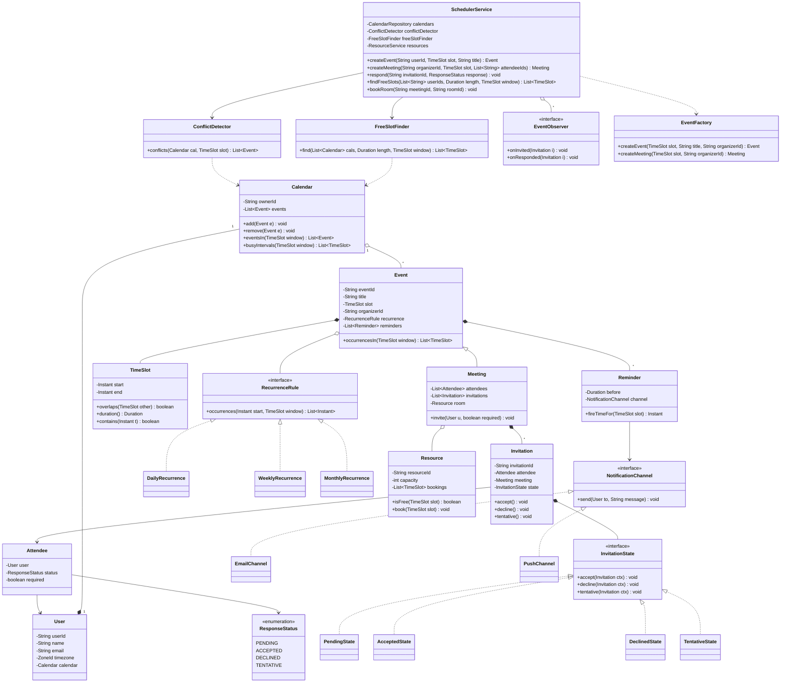
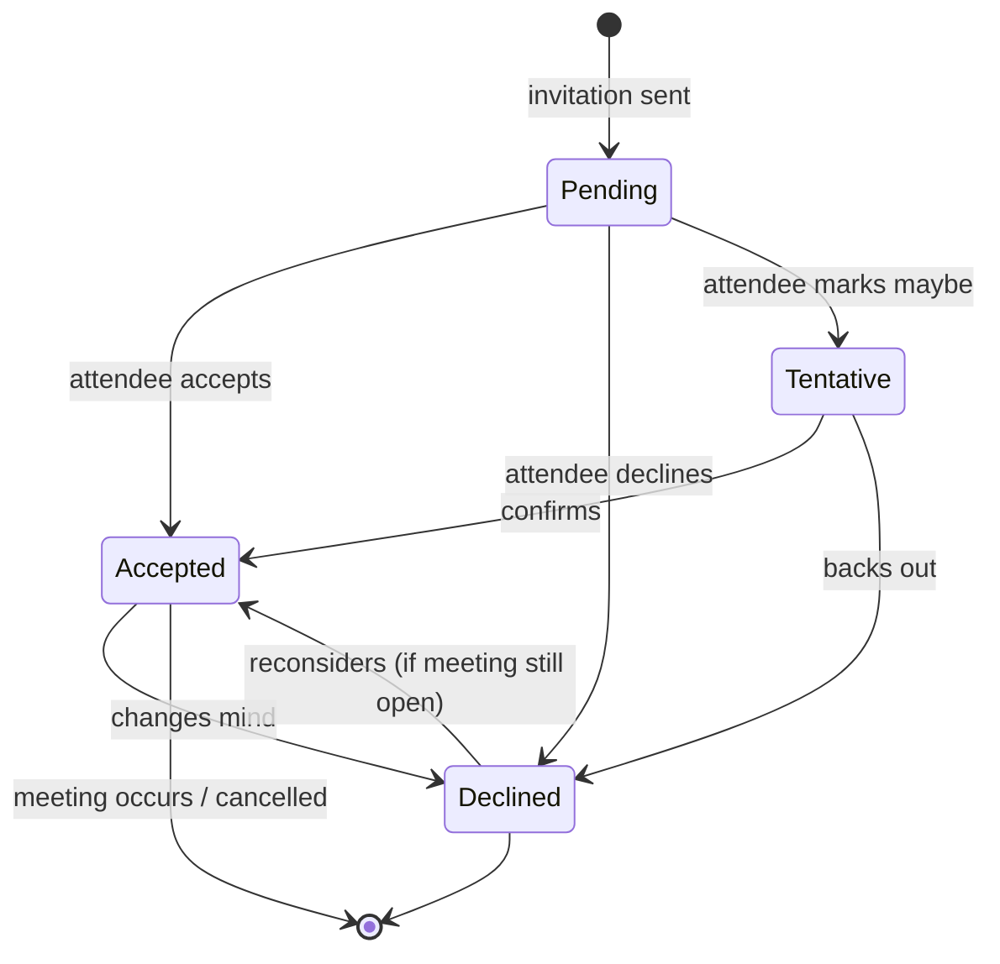

# Design a Calendar / Meeting Scheduler

A Google-Calendar–style scheduler is the canonical **interval / conflict-detection** LLD
problem. Where the parking lot asks "is this spot free *right now*", the calendar asks "does
this proposed event *overlap* anything on my calendar, and if I invite five people, when are
they *all* free?" Interviewers use it to test three things: whether you model an event as a
first-class object over a **time interval** (not a flag), whether you can implement **overlap
detection** and **free-slot finding** as clean interval logic, and whether you pick the right
patterns for **recurrence expansion**, **invitation lifecycle**, and **reminders**. Expect
45–60 minutes. Keep it single-machine OO — "make it work for millions of users" is HLD.

## Requirements Clarification

Spend the first five minutes narrowing scope. Good clarifying questions:

- **Personal calendar or shared/team scheduling?** Start with per-user calendars that hold
  events; layer *meeting invitations across users* on top. Both matter for this problem —
  the "find a common free slot for N attendees" question is what makes it interesting.
- **Core flows:** create/edit/delete an event, detect conflicts on create, invite attendees
  and track their responses (accept/decline/tentative), find a free slot common to several
  people, book a meeting room/resource, set reminders, and support recurring events
  (daily/weekly/monthly).
- **Conflict handling:** do we *block* a conflicting create, or *warn and allow* (calendars
  usually allow overlaps, just show them)? Clarify — the overlap *detection* is the same
  either way; only the policy on the result differs.
- **Time model:** treat every event as a half-open interval `[start, end)` so a meeting
  ending at 10:00 and one starting at 10:00 do **not** conflict. Nail this early — it kills
  a whole class of off-by-one bugs. Store instants in UTC; render in the user's timezone.
- **Recurrence:** how expressive? Scope to RRULE-style daily/weekly/monthly with a count or
  until-date, plus per-instance exceptions ("this Tuesday's standup is cancelled"). Infinite
  recurrence is fine if you expand lazily within a queried window.
- **Out of scope (say so explicitly):** cross-datacenter sync, CalDAV/iCal wire protocol,
  ML "smart" scheduling, video-conferencing integration internals, and "scale to a billion
  events" (that's HLD — name it and move on).

A crisp scope statement: *"I'll design per-user `Calendar`s holding `Event`s over half-open
time intervals. Creating an event detects conflicts via interval overlap. A meeting invites
`Attendee`s who respond through an invitation state machine, can reserve a `Resource` (room),
and can find a free slot common to all attendees by merging their busy intervals. Events
recur via a pluggable `RecurrenceRule`, and `Reminder`s fire through an observer/notification
seam. Concurrency: two organizers must not double-book the same room."*

## Use-Cases and Actors

The Grokking UML-first approach — enumerate actors and what they do before drawing classes:

- **Organizer (a `User`):** creates an event/meeting, invites attendees, reserves a room,
  edits/cancels, sets a recurrence rule, adds reminders.
- **Attendee (a `User`):** receives an invitation, responds (accept/decline/tentative),
  sees the meeting on their calendar once accepted.
- **System (scheduler):** detects conflicts, expands recurring events into instances within
  a window, computes common free slots across attendees, fires reminders at the due time,
  notifies attendees of invitations and organizers of responses.
- **Resource / Room (a passive actor):** has its own busy calendar; can be booked at most
  once per interval.

Primary use cases: *Create Event*, *Detect Conflict*, *Invite & Respond*, *Find Free Slot*,
*Book Room*, *Expand Recurrence*, *Fire Reminder*. Each maps to a method on a service — keep
that mapping in mind as you extract objects.

## Noun / Verb Object Identification

The heart of the method: pull **candidate classes from the nouns** and **candidate methods
from the verbs** in the requirements, then *filter* — not every noun becomes a class.

**Nouns (candidate classes):** user, calendar, event, meeting, time slot, start time, end
time, room, resource, attendee, invitation, recurrence rule, reminder, notification,
organizer, response, conflict, free slot, timezone.

**Verbs (candidate methods):** create, edit, delete, invite, respond (accept/decline),
detect conflict, find free slot, book (room), expand (recurrence), remind/notify, merge
(intervals), overlap.

Now **filter** the nouns — this is the judgment interviewers watch for:

| Candidate noun | Verdict | Reasoning |
|---|---|---|
| User | **Class** | Identity; owns a calendar; can be an organizer or attendee |
| Calendar | **Class** | Owns a user's events; the container we query for conflicts |
| Event | **Class** | First-class thing over a `TimeSlot`; base for `Meeting` |
| Meeting | **Class (subtype/role)** | An event *with attendees + invitations*; specializes Event |
| TimeSlot | **Value object** | `[start, end)` interval — carries the `overlaps()` logic |
| start time / end time | **Fields of TimeSlot** | Not classes — attributes |
| Attendee | **Class (or link)** | The user↔meeting link carrying a response — a first-class association |
| Invitation | **Class + State machine** | Has lifecycle (Pending→Accepted/Declined/Tentative) |
| RecurrenceRule | **Strategy interface** | Behavior varies (daily/weekly/monthly) — polymorphism |
| Reminder | **Class** | A due-offset + channel; drives Observer notifications |
| Notification | **Behind an interface** | Delivery mechanism (email/SMS/push) — pluggable |
| Room / Resource | **Class** | Bookable thing with its own busy calendar |
| Response | **Enum / state** | A value (`ACCEPTED`…), not its own class |
| Conflict | **Not a class** | A *result* of the overlap query, returned as a list/boolean |
| Free slot | **Value object (TimeSlot)** | The gap result of interval merging — reuse `TimeSlot` |
| Timezone | **Field / value** | An attribute of user/event, not a domain class here |
| Organizer | **A role of User** | Model as a reference, not a subclass |

Three noun-filtering decisions worth narrating:

1. **`Conflict` and "free slot" are results, not classes.** A common junior mistake is a
   `Conflict` class. Conflict detection *returns* overlapping events; a free slot is just a
   `TimeSlot`. Don't manufacture classes for the *output* of an algorithm.
2. **`Attendee` is a first-class link, not just a `User` in a list.** The user↔meeting
   relationship carries state (their `ResponseStatus`, whether they're optional/required).
   That data has to live *on the link* — an association class — so model `Attendee` (or
   `MeetingParticipant`) explicitly.
3. **`RecurrenceRule` is behavior, so it's a Strategy interface — not a data enum.** Daily
   vs. weekly vs. monthly differ in the *algorithm* that generates occurrence dates, so they
   become polymorphic classes, not a `switch` on an enum.

## Responsibilities and Relationships

CRC-style — what each class KNOWS, what it DOES, and its collaborators:

| Class | Knows (state) | Does (responsibility) | Collaborators |
|---|---|---|---|
| `User` | id, name, email, timezone, its `Calendar` | Owns a calendar; is organizer/attendee | Calendar |
| `Calendar` | its `User`, its `Event`s | Add/remove events; return events in a window; expose busy intervals | Event, TimeSlot |
| `Event` | id, title, `TimeSlot`, organizer, `RecurrenceRule`, reminders | Report its interval; expand occurrences | TimeSlot, RecurrenceRule, Reminder |
| `Meeting` (Event) | attendees, invitations, `Resource` | Track invites/responses; hold room booking | Attendee, Invitation, Resource |
| `TimeSlot` | start, end (instants) | `overlaps()`, `duration()`, comparison | — |
| `Attendee` | the `User`, `ResponseStatus`, required/optional | Represent one participant's status | User, Invitation |
| `Invitation` | attendee, meeting, `InvitationState` | Manage response lifecycle; guard transitions | InvitationState |
| `RecurrenceRule` | frequency, interval, until/count | Generate occurrence start-times in a window | TimeSlot |
| `Reminder` | offset-before, channel | Compute fire-time; trigger notification | NotificationChannel |
| `Resource`/`Room` | id, capacity, its busy `TimeSlot`s | Answer "free for this slot?"; hold bookings | TimeSlot |
| `ConflictDetector` | — | Find events overlapping a slot in a calendar | Calendar, TimeSlot |
| `FreeSlotFinder` | — | Merge busy intervals across calendars; return gaps | Calendar, TimeSlot |
| `SchedulerService` | services/repos | Facade: create, invite, respond, findFreeSlot, book | all of the above |
| `EventFactory` | defaults | Construct correctly-wired events/meetings | Event, Meeting |
| `NotificationChannel` | — | Deliver a message (email/SMS/push) | — |

Relationship decisions:

- **`User "1" *-- "1" Calendar`** — composition; a calendar doesn't exist without its owner.
- **`Calendar "1" o-- "*" Event`** — aggregation; events can be moved/shared, and a meeting
  appears on several attendees' calendars, so the calendar references rather than solely owns
  them (design choice — say it out loud).
- **`Meeting --|> Event`** — inheritance: a meeting *is an* event with attendees. Prefer this
  only because a meeting genuinely adds structure (attendees, invitations, resource); if the
  only difference were data, favor composition.
- **`Event *-- TimeSlot`** — composition of a value object (no identity of its own).
- **`Meeting "1" *-- "*" Invitation`** and **`Invitation --> Attendee`** — the invitation is
  the association object carrying response state.
- **`Event o-- RecurrenceRule`** and **`Event *-- "*" Reminder`** — a rule is optional and
  swappable (Strategy); reminders are owned parts of the event.
- Services depend on **interfaces** (`RecurrenceRule`, `NotificationChannel`) — DIP — so new
  frequencies and channels drop in without editing orchestration.

## Class Diagram

Interview-grade, not enterprise-grade — entities, the interval value object, and the pattern
seams (Strategy for recurrence, State for invitations, Observer for reminders/responses,
Factory for construction):



Relationship notes worth saying out loud:

- `Event *-- TimeSlot` and `Event *-- Reminder` are **composition** — parts with no life of
  their own outside the event.
- `Calendar o-- Event` is **aggregation** — the same meeting object appears on multiple
  attendees' calendars, so ownership is shared/referential, not exclusive.
- `Invitation *-- InvitationState` is the **State pattern** seam: the invitation delegates
  `accept()`/`decline()` to its current state object.
- Services depend on `RecurrenceRule` and `NotificationChannel` **interfaces** (DIP).

## Invitation State Machine

An invitation has a genuine lifecycle, which is why it's a **State** machine, not a mutable
enum with scattered `if`s. Each state defines which transitions are legal:



Design points:

- **Why State over a flag?** Each response transition has rules (a `Declined` invite to a
  *cancelled* meeting can't be re-accepted; an accepted attendee counts toward the room
  capacity, a declined one doesn't). Encapsulating "what `accept()` does *from here*" in a
  state class keeps `Invitation` free of a growing `switch`. With only four states some
  interviewers accept an enum + transition table — say the trade-off; promote to full State
  when per-state behavior grows. See the dp-state topic for the pattern itself.
- **Transitions fire Observer notifications:** entering `Accepted`/`Declined` notifies the
  *organizer* (a response came in) — the response side of the Observer seam.
- **Guard illegal transitions in one place.** Accepting an invitation to a deleted meeting
  throws `IllegalInvitationStateException`.

## Key Design Decisions and Patterns

Patterns classified by intent, each tied to the requirement that forces it (referenced by
name — the dp-* topics teach them in full):

- **Strategy (Behavioral) — recurrence expansion.** Daily/weekly/monthly differ in the
  *algorithm* that produces occurrence dates. `RecurrenceRule.occurrences(start, window)`
  lets each frequency be its own class; adding "every 2nd Tuesday" is a new class, not an
  edit to `Event` — Open/Closed in action. Also the right seam for **conflict-resolution**
  policy (block vs. warn) and **notification-timing** policy.
- **State (Behavioral) — invitation lifecycle.** As above: `Pending`, `Accepted`,
  `Declined`, `Tentative` as state objects with guarded transitions.
- **Observer (Behavioral) — reminders and invitation responses.** When a reminder's
  fire-time arrives, or when an attendee responds, interested parties (the attendee's
  devices, the organizer, an analytics logger) must be notified. `EventObserver` /
  notification subscribers invert the dependency: the scheduler fires `onInvited` /
  `onResponded` and channels subscribe. New channels (WhatsApp) never edit the scheduler.
- **Factory (Creational) — event/meeting construction.** `EventFactory` centralizes wiring
  (default reminder, organizer's calendar, id generation) and hides whether we build a plain
  `Event` or a `Meeting`. Adding an `AllDayEvent` touches the factory, not every caller.
- **Composite (Structural) — recurring event → instances.** A recurring event is a *single*
  logical event that expands into many concrete occurrences. Treating the series and a single
  occurrence through a common interface (`occurrencesIn(window)` returns one-or-many) lets
  callers handle "the standup" and "next Tuesday's standup" uniformly, and supports
  per-instance exceptions/overrides.
- **Facade — `SchedulerService`.** One entry point wires conflict detection, free-slot
  finding, invitations, and room booking; internals stay swappable.
- **What conflict is NOT: a stored field.** Availability/conflict is *computed* from event
  intervals on demand — never a cached boolean that drifts.

## Conflict Detection (Interval Overlap)

The core algorithm. With half-open slots `[start, end)`, two events overlap **iff each
starts before the other ends**:

```java
public final class TimeSlot {
    private final Instant start;   // inclusive
    private final Instant end;     // exclusive

    public boolean overlaps(TimeSlot other) {
        return this.start.isBefore(other.end)
            && other.start.isBefore(this.end);
    }
}
```

Detecting conflicts for a proposed slot on a calendar:

```java
public List<Event> conflicts(Calendar cal, TimeSlot proposed) {
    return cal.eventsIn(proposed).stream()          // candidate events near the window
              .filter(e -> e.getSlot().overlaps(proposed))
              .collect(Collectors.toList());
}
```

**Trace it on three pairs** (the two-sided condition is the part students get backwards —
watch each clause). Recall `overlaps` = `this.start.isBefore(other.end) && other.start.isBefore(this.end)`:

| `this` | `other` | `this.start < other.end` | `other.start < this.end` | `overlaps` | Why |
|---|---|---|---|---|---|
| `[9:00,10:00)` | `[10:00,11:00)` | `9:00 < 11:00` = T | `10:00 < 10:00` = **F** | **false** | back-to-back — half-open makes the touch-point a non-conflict for free |
| `[9:00,10:00)` | `[9:30,10:30)` | `9:00 < 10:30` = T | `9:30 < 10:00` = T | **true** | partial overlap |
| `[9:00,11:00)` | `[9:30,10:00)` | `9:00 < 10:00` = T | `9:30 < 11:00` = T | **true** | full containment |

The back-to-back row is the payoff: a single `false` clause kills the false conflict, so no
`-1`-second fudging is needed. Both clauses must be true for an overlap — one gap on either
side is enough to separate them.

Points interviewers probe:

- **Why half-open?** A meeting `[9:00, 10:00)` and `[10:00, 11:00)` must *not* conflict —
  back-to-back meetings are normal. Strict `isBefore` gives that for free; closed intervals
  force `-1` fudges everywhere.
- **Recurring events complicate it.** You can't compare a single stored slot — you must
  *expand* the recurring event's occurrences within the proposed window (bounded by the
  query window, so infinite series stay finite) and overlap-test each. This is why
  `occurrencesIn(window)` exists.
- **Complexity.** Naive scan is O(events) per check — fine for one user in an interview. Say
  the upgrade path out loud: keep events **sorted by start** for binary search to the window,
  or an **interval tree** for O(log n + k) overlap queries. (Data-structure internals belong
  to dsa-coding — name the structure and move on; cross-ref the merge-intervals problem.)

## Finding a Common Free Slot

The signature "find a time all N attendees are free" question — a **merge-intervals**
problem (cross-ref dsa-coding). Algorithm:

1. Gather every attendee's (and the room's) **busy** intervals within the search window.
2. **Merge** the combined busy intervals into maximal non-overlapping blocks (sort by start,
   sweep, coalesce overlaps/adjacencies).
3. The **gaps** between merged busy blocks (and window edges) are the common free intervals.
4. Return gaps whose `duration() >= requested length`.

```java
public List<TimeSlot> find(List<Calendar> cals, Duration length, TimeSlot window) {
    List<TimeSlot> busy = cals.stream()
        .flatMap(c -> c.busyIntervals(window).stream())
        .sorted(Comparator.comparing(TimeSlot::getStart))
        .collect(Collectors.toList());

    List<TimeSlot> merged = merge(busy);            // coalesce overlapping/adjacent
    List<TimeSlot> free = gaps(merged, window);     // complement within the window
    return free.stream()
               .filter(s -> !s.duration().minus(length).isNegative())
               .collect(Collectors.toList());
}
```

**Worked example — three calendars, one 30-min request.** Search window `[9:00, 17:00)`:

- Alice busy: `[9:00,10:00)`, `[13:00,14:00)`
- Bob busy: `[9:30,11:00)`, `[15:00,16:00)`
- Room busy: `[14:00,15:00)`

Step 1 — **gather + sort by start** (5 intervals):
`[9:00,10:00)`, `[9:30,11:00)`, `[13:00,14:00)`, `[14:00,15:00)`, `[15:00,16:00)`.

Step 2 — **sweep and coalesce.** Carry a running block; extend it whenever the next start is
`<=` the current end (touching counts as adjacent so we don't leave a zero-length gap):

- Start block `[9:00,10:00)`. Next `[9:30,11:00)`: `9:30 <= 10:00` → overlaps, extend end to `max(10:00,11:00)=11:00` → block `[9:00,11:00)`.
- Next `[13:00,14:00)`: `13:00 > 11:00` → gap. Emit `[9:00,11:00)`, start new block `[13:00,14:00)`.
- Next `[14:00,15:00)`: `14:00 <= 14:00` → adjacent, extend end to `15:00` → block `[13:00,15:00)`.
- Next `[15:00,16:00)`: `15:00 <= 15:00` → adjacent, extend end to `16:00` → block `[13:00,16:00)`.
- End of list → emit `[13:00,16:00)`.

Merged busy blocks: **`[9:00,11:00)`, `[13:00,16:00)`**.

Step 3 — **complement within `[9:00,17:00)`** (gaps between window edge → first block → …
→ last block → window edge):
`[11:00,13:00)` (2h) and `[16:00,17:00)` (1h). The `9:00` window edge equals the first block's
start, so no leading gap.

Step 4 — **filter by `duration() >= 30 min`.** Both survive (120 min, 60 min). Result:
**`[11:00,13:00)`, `[16:00,17:00)`**; earliest-first, `[11:00,13:00)` is the answer. (A 90-min
request would drop `[16:00,17:00)` and return only `[11:00,13:00)`.)

Points to narrate:

- **Merge, don't naively intersect.** Combining everyone's busy time then complementing is
  O(M log M) for M total intervals — cleaner than pairwise intersection of free sets.
- **"Only accepted attendees block."** A `DECLINED` invitation's meeting shouldn't count as
  busy for that person; a `TENTATIVE` one is a policy choice — surface it.
- **Working hours / timezones.** Intersect the free result with each attendee's working
  hours *in their own timezone* before returning — a common follow-up.
- **Optional vs. required attendees:** required must be free; optional conflicts only lower a
  slot's "score." Mention ranking slots rather than a hard filter.

## API and Method Signatures

```java
// Events
Event createEvent(String userId, TimeSlot slot, String title, RecurrenceRule rule)
    throws EventConflictException;                 // policy: throw or warn+return conflicts
List<Event> conflictsFor(String userId, TimeSlot slot);
void updateEvent(String eventId, TimeSlot newSlot);
void deleteEvent(String eventId);                  // whole series or this-occurrence-only

// Meetings & invitations
Meeting createMeeting(String organizerId, TimeSlot slot, List<String> attendeeIds);
void respond(String invitationId, ResponseStatus response)
    throws IllegalInvitationStateException;

// Scheduling assistant
List<TimeSlot> findFreeSlots(List<String> userIds, Duration length, TimeSlot window);

// Resources
void bookRoom(String meetingId, String roomId) throws ResourceUnavailableException;

// Reminders
void addReminder(String eventId, Duration before, NotificationChannel channel);
```

Signature decisions to narrate:

- `createEvent` takes the `RecurrenceRule` as a parameter (nullable for one-offs) rather than
  a boolean flag — Strategy injection, not a conditional.
- `deleteEvent` must distinguish **this occurrence** from **the whole series** — the classic
  recurring-event edit question; model an exception/override list on the series.
- Failure surfaces as **typed exceptions** (`EventConflictException`,
  `ResourceUnavailableException`) so callers know *why* and can react differently.
- `findFreeSlots` returns a *list* of `TimeSlot`s (ranked/earliest-first), not a single
  answer — the caller picks.

## Code Skeleton

Enough structure to show the seams — not a full implementation:

```java
public enum ResponseStatus { PENDING, ACCEPTED, DECLINED, TENTATIVE }

public final class TimeSlot {
    private final Instant start, end;
    public TimeSlot(Instant start, Instant end) {
        if (!start.isBefore(end)) throw new IllegalArgumentException("empty/inverted slot");
        this.start = start; this.end = end;
    }
    public boolean overlaps(TimeSlot o) {
        return start.isBefore(o.end) && o.start.isBefore(end);
    }
    public Duration duration() { return Duration.between(start, end); }
}

public interface RecurrenceRule {
    List<Instant> occurrences(Instant seriesStart, TimeSlot window);
}

public class WeeklyRecurrence implements RecurrenceRule {
    private final int intervalWeeks;      // every N weeks
    private final Set<DayOfWeek> days;    // e.g. MON, WED
    private final Instant until;          // or a count
    public List<Instant> occurrences(Instant seriesStart, TimeSlot window) {
        // step week-by-week within window, emit matching days; bounded by window+until
        return List.of();
    }
}

public class Event {
    protected final String eventId;
    protected TimeSlot slot;
    protected RecurrenceRule recurrence;              // null => one-off
    protected final List<Reminder> reminders = new ArrayList<>();
    public List<TimeSlot> occurrencesIn(TimeSlot window) {
        if (recurrence == null) return slot.overlaps(window) ? List.of(slot) : List.of();
        return recurrence.occurrences(slot.getStart(), window).stream()
                 .map(s -> new TimeSlot(s, s.plus(slot.duration())))
                 .toList();
    }
}

public class Meeting extends Event {
    private final List<Invitation> invitations = new ArrayList<>();
    private Resource room;                            // optional booked room
}

// State pattern for the invitation lifecycle
public interface InvitationState {
    void accept(Invitation ctx);
    void decline(Invitation ctx);
    void tentative(Invitation ctx);
}
public class PendingState implements InvitationState {
    public void accept(Invitation ctx)   { ctx.setState(new AcceptedState()); ctx.notifyOrganizer(); }
    public void decline(Invitation ctx)  { ctx.setState(new DeclinedState()); ctx.notifyOrganizer(); }
    public void tentative(Invitation ctx){ ctx.setState(new TentativeState()); }
}

public class ConflictDetector {
    public List<Event> conflicts(Calendar cal, TimeSlot proposed) {
        return cal.eventsIn(proposed).stream()
                  .flatMap(e -> e.occurrencesIn(proposed).stream()
                                 .filter(s -> s.overlaps(proposed)).limit(1)
                                 .map(s -> e))
                  .toList();
    }
}

public class ResourceService {
    private final Map<String, Resource> rooms = new ConcurrentHashMap<>();
    public void book(String roomId, TimeSlot slot) {
        Resource room = rooms.get(roomId);
        synchronized (room) {                          // per-room lock: serialize this room only
            if (!room.isFree(slot)) throw new ResourceUnavailableException(roomId);
            room.book(slot);
        }
    }
}
```

## Concurrency: Double-Booking a Room

The classic race: two organizers see the same conference room free for an overlapping slot
and both call `bookRoom()`. The `isFree()` check followed by the `book()` write is a
**check-then-act** sequence — without mutual exclusion, both checks pass before either
write lands, and the room is double-booked. (Cross-ref concurrency-in-lld.)

- **Pessimistic per-resource lock (the interview answer).** Acquire the *room's* lock, then
  check-then-act, then release. One lock **per room** — a single global lock would serialize
  bookings for unrelated rooms. Room A and Room B proceed in parallel; two requests for Room
  A serialize, and the loser gets a clean `ResourceUnavailableException`.
- **Not a global scheduler lock.** Locking the whole service kills throughput; scope the
  lock to the contended object (the resource). Same reasoning as the hotel "last room" race.
- **Per-user calendar writes** also race (two clients editing one calendar) — a per-calendar
  lock or a concurrent collection guards the event list.
- **Optimistic alternative:** version the resource / a unique constraint on (room, slot);
  the loser's commit fails and retries. Better when contention is rare; pessimistic is
  easier to reason about live and is the expected default.
- **In a real system** this becomes a DB transaction (`SELECT … FOR UPDATE`, or a unique
  index on room+interval). Name it, then keep the in-memory design — distributed locking is
  HLD, cross-ref system-design.

## Edge Cases and Error States

- **Invalid slot:** `end <= start` or zero-length — validate in the `TimeSlot` constructor so
  malformed intervals can't exist. Do **not** bake a "not in the past" check into the value
  object: `TimeSlot` is also used for query windows, reconstructing busy intervals, and
  recording historical/imported events — all legitimately in the past. "No creating an event
  in the past" is a *business rule*, so enforce it in a create-event policy layer, not the
  interval invariant.
- **DST / timezone boundaries:** store instants in UTC; a "9 AM daily" recurrence must
  re-anchor to the user's wall-clock time across a DST shift — expand in the user's
  `ZoneId`, not by adding fixed 24h. A frequent senior probe.
  *Worked example — 09:00 daily standup in `America/New_York` across US spring-forward.*
  Before the shift EST is UTC−5, so 09:00 local = **14:00 UTC**. On the second Sunday of
  March clocks jump forward and EDT becomes UTC−4. **Naive add-fixed-24h** keeps the stored
  instant at 14:00 UTC, which now renders as **10:00 local** — the standup silently drifts an
  hour. **Correct expansion**: take `LocalTime 09:00` on the next date in `ZoneId`
  `America/New_York`, then convert to an instant → 09:00 EDT = **13:00 UTC**, so it stays
  09:00 on everyone's wall clock. Same trap in reverse (fall-back) drifts it to 08:00.
- **Editing one occurrence of a series:** must not mutate the whole series — record a
  per-instance override/exception; deleting one occurrence adds an EXDATE-style exception.
- **Responding to a cancelled/deleted meeting:** invitation state guards it — throws.
- **Overlapping self-events:** policy decision — calendars usually *allow* overlap and just
  display both; only room booking is a hard conflict.
- **Reminder for a past event / a deleted event:** the reminder scheduler must skip fire-times
  already elapsed and drop reminders whose event was deleted.
- **Attendee in a different timezone:** the meeting has one absolute instant; each attendee
  *renders* it in their own zone — store once, convert on display.
- **Notification failure:** never fails the booking/response — fire observers after the state
  change is durable, each wrapped in its own try/catch.

## Extensibility

The "now add X" follow-ups and where they land — each should be Open/Closed:

- **New recurrence pattern (every last Friday, every weekday):** a new `RecurrenceRule`
  implementation — zero edits to `Event` or the scheduler. This is the payoff of Strategy.
- **New notification channel (SMS, Slack, WhatsApp):** a new `NotificationChannel` — the
  Observer/DIP seam absorbs it with no scheduler edits.
- **Room / resource booking (projectors, cars):** `Resource` is already generic — add
  attributes; the per-resource lock and `isFree()` check apply unchanged.
- **Find-a-time across N calendars with ranking:** `FreeSlotFinder` already merges intervals;
  add a scoring pass (fewer optional-attendee conflicts, within working hours) and return
  ranked slots.
- **Timezones & working hours:** intersect free results with per-user working-hour windows in
  their own zone — a filter layered on `FreeSlotFinder`, not a rewrite.
- **Shared / delegated calendars (assistant books for exec):** an authorization check plus a
  calendar-ACL — the ownership model already references a `Calendar` by owner.
- **Guest / external attendees:** an `Attendee` backed by an email rather than a `User` — the
  invitation flow is unchanged; only response tracking differs.
- **"Speedy meetings" / buffer time:** a policy that pads every booked slot — another
  Strategy applied when computing the effective busy interval.

## Common Interview Follow-ups

1. **"An attendee edits a single occurrence of a weekly standup."** Split series vs.
   occurrence: keep the `RecurrenceRule` on the series and an override/exception list; the
   edited instance becomes a detached `Event` referencing its parent. Concretely the series
   carries two collections keyed by *occurrence-start instant*:
   ```java
   Set<Instant> exdates;              // occurrences to skip (EXDATE)
   Map<Instant, Event> overrides;     // occurrence-start -> detached override event
   ```
   `occurrencesIn(window)` then expands the rule, **drops** any start in `exdates`, and
   **substitutes** the override where `overrides` has that start. So "cancel this Tuesday"
   adds `2026-07-28T13:00Z` to `exdates`; "move this Tuesday to 3pm" puts a detached `Event`
   at `overrides[2026-07-28T13:00Z]` with the new 15:00 slot — the rest of the series is
   untouched, and "edit all future" splits the series (set the old rule's `until` and start a
   new series). This is exactly RFC 5545's RRULE + EXDATE + RECURRENCE-ID model.
2. **"Find the earliest 30-min slot next week where five people and a room are all free."**
   Merge all six busy-interval sets, complement within next-week's window ∩ working hours,
   filter by duration, return earliest — the merge-intervals answer.
3. **"Two people book the last room at the same instant — walk me through it."** Per-room
   lock, check-then-act inside it, loser gets `ResourceUnavailableException`; explain why the
   unlocked version double-books.
4. **"How do reminders actually fire?"** A due-time priority queue / scheduled executor pops
   reminders whose fire-time arrived and pushes to `NotificationChannel`s via the Observer
   seam; skip past/deleted ones.
5. **"Handle DST and cross-timezone attendees."** Store UTC instants; expand recurrence in
   the organizer's wall-clock zone; render per attendee's zone.
6. **"Model tentative vs. accepted for capacity counting."** Invitation State drives whether
   an attendee counts toward room capacity — accepted counts, declined doesn't, tentative is
   a policy call.
7. **"Scale to a billion users / global sync."** Name it as HLD (sharded calendars, event
   store, CalDAV sync, fan-out on invite) and point to system-design — keep this round
   single-process.

## References

- Grokking the Object-Oriented Design Interview — "Design a Calendar" / meeting-scheduler
- *Design Patterns* (GoF) — Strategy, State, Observer, Composite, Factory Method, Facade
- *Effective Java* (Bloch) — Item 17 (immutable value objects like `TimeSlot`), Item 81
  (concurrency utilities)
- RFC 5545 (iCalendar) — RRULE recurrence and EXDATE exception semantics (recurrence model)
- Related topics in this library: dp-strategy, dp-state, dp-observer, dp-composite,
  dp-factory-method (pattern deep-dives), concurrency-in-lld (per-resource locking),
  design-hotel-booking (range-over-time reservation contrast), dsa-coding merge-intervals
  (the free-slot algorithm), system-design (distributed calendar HLD)
