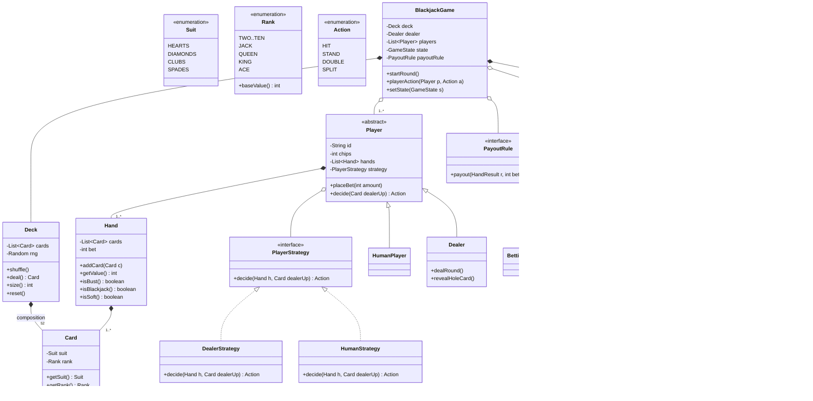

# Design a Card Game (Deck and Blackjack)

The card-game problem is the classic "**reusable abstractions**" LLD exercise. Its whole
point is layering: build a *game-agnostic* `Card` / `Deck` core that a poker table, a
rummy hand, or a solitaire game could reuse unchanged — then bolt Blackjack's rules on top
without leaking Blackjack into `Deck`. Where Chess tests inheritance geometry and Parking
Lot tests composition, this problem tests whether you can spot the seam between *generic
card mechanics* and *specific game rules* and keep them on opposite sides of an interface.

> [!INTERVIEW]
> Interviewers use this problem to watch for three things: (1) do you resist putting
> "Blackjack" logic (Ace = 1 or 11, bust at 21) inside `Card`/`Deck`; (2) do you reach for
> **Strategy** to vary a player's decision (dealer must-hit-17 vs a human's free choice) and
> the game's scoring rules; (3) do you model the game flow as a **State machine** (Betting →
> Dealing → PlayerTurn → DealerTurn → Settlement) rather than one tangled `play()` method.

## Requirements Clarification

Spend the first five minutes bounding the problem. "A card game" is enormous; commit to
Blackjack as the concrete target while designing the reusable core.

**Questions to ask:**

- **Which game, concretely?** Blackjack (single hand, dealer vs one-or-more players) is the
  standard target. Confirm the reusable `Deck`/`Card` core should be game-neutral so poker
  could reuse it — that reuse is the whole point of the exercise.
- **How many players?** One human vs a dealer is the minimum; multi-player (several humans
  sharing one dealer) is a common extension — design the collections for N from the start.
- **Betting and chips?** Confirm whether wagers/payouts are in scope. A good default:
  model `bet`/`chips` but keep the money logic thin; say the ratio table (blackjack pays
  3:2, etc.) is a `PayoutRule` you can extend.
- **Which Blackjack rules?** Nail these down explicitly: Ace counts 1 or 11 (soft/hard
  hands), face cards = 10, bust > 21, **dealer hits until 17** (clarify hit-soft-17 or
  stand-soft-17), player actions **hit / stand / double down / split**. Insurance and
  surrender are usually scoped out or named as extensions.
- **Number of decks in the shoe?** Casinos use 4–8 decks. Design `Deck`/`Shoe` so one or
  many decks is a construction parameter, not a rewrite.
- **Shuffle fairness / RNG?** Mention that shuffling must be an unbiased Fisher–Yates and
  the RNG should be injectable (for testing / provably-fair). Don't implement crypto-RNG.

**In scope (typical):** a reusable 52-card `Deck` (build, shuffle, deal/draw), `Hand`,
`Player` (`HumanPlayer`, `Dealer`), a `BlackjackGame` orchestrating rounds, hand-value
calculation with soft aces, player actions, dealer policy, and settlement/payout.

**Out of scope:** GUI/animation, network multiplayer, persistence, real-money
transactions, card-counting detection, and "scale to thousands of tables" — that last one
is an HLD concern (one `Game` object per table; distribution lives in the system-design
domain).

> [!TIP]
> Saying "I'll build `Card` and `Deck` with zero knowledge of Blackjack, then put all the
> 21-specific logic behind a scoring/rules layer" up front is a senior signal: it names the
> reuse seam before you've drawn a single box.

## Use Cases and Actors

The Grokking approach: enumerate actors and their use cases before classes.

**Actors:**

- **Player (human):** places a bet, then chooses hit / stand / double / split each turn;
  wins, loses, or pushes.
- **Dealer:** a special automated player — deals the round, plays its hand by a fixed
  house policy (hit until 17), and settles payouts. The dealer is both a participant (has a
  `Hand`) and, often, the game operator.
- **Game / House (system):** owns the shoe, enforces turn order and rules, computes
  outcomes, pays or collects chips.

**Core use cases:** start round → place bets → deal two cards each → player turn(s) →
dealer turn → settle. Follow-ups: shuffle/reshuffle the shoe, split a pair into two hands,
double down, handle a natural blackjack.

> [!KEY-TAKEAWAY]
> The Dealer is *both* an actor and a `Player` subtype. Modeling it as a `Player` whose
> decision-making is a fixed **Strategy** (must-hit-17) — rather than a totally separate
> class with duplicated hand logic — is the elegant move and a frequent discussion point.

## Noun Verb Object Identification

Extract candidate classes from the **nouns** and candidate methods from the **verbs**, then
*filter* — not every noun becomes a class.

Requirement sentences: *"A **deck** of 52 **cards**, each with a **suit** and a **rank**, is
**shuffled**. The **dealer deals** two cards to each **player**. A player **hits** or
**stands**; the **hand value** must not **bust** past 21. The **dealer hits** until 17. The
**game settles** by comparing hands and **pays** the winners."*

| Candidate noun | Verdict | Why |
|---|---|---|
| Card | **Class** | Core value object: suit + rank. Immutable. |
| Suit, Rank | **Enums** | Fixed, finite sets — enums, not classes or strings. |
| Deck | **Class** | Owns the 52 cards, `shuffle`, `deal`/`draw`. |
| Shoe | **Class (opt.)** | Multi-deck container; degenerates to one `Deck` for single-deck. |
| Hand | **Class** | A player's held cards + value calculation. |
| Player | **Class (abstract/iface)** | Identity + a `Hand` + a decision strategy. |
| Dealer | **Subclass of Player** | Same hand mechanics, fixed decision policy. |
| Game / BlackjackGame | **Class** | Orchestrator / state machine. |
| Value / score | **Method, not class** | `Hand.getValue()` computes it; no `Value` class. |
| Bust, blackjack, push | **States/results, not classes** | Enum `HandResult` / booleans. |
| Bet, chips | **Field / small class** | `int bet` on a hand; `chips` on player. |
| Turn, round | **Not a class** | Flow concepts modeled by the State machine, not objects. |

**Verbs → methods:** `shuffle()`, `deal()/draw()`, `hit()`, `stand()`, `doubleDown()`,
`split()`, `getValue()`, `isBust()`, `settle()`, `payout()`, `play()` (dealer policy).

> [!WARNING]
> The classic over-modeling trap here is a `Value` or `Score` class, or a `Turn` object.
> Value is a *computed property* of a `Hand`; a turn is a *phase* of the State machine.
> Promoting them to classes is exactly the noun-filtering mistake this step exists to catch.

## Responsibilities and Relationships

Assign each class one responsibility (CRC-style: what it KNOWS, what it DOES, its
collaborators).

| Class | Knows (state) | Does (behavior) | Collaborators |
|---|---|---|---|
| `Card` | suit, rank | expose suit/rank; nothing game-specific | — |
| `Deck` | list of `Card` | `shuffle`, `deal`/`draw`, `size`, `reset` | `Card`, RNG |
| `Hand` | list of `Card`, bet | add card, `getValue` (soft aces), `isBust`, `isBlackjack` | `Card`, `ScoringStrategy` |
| `Player` | id, chips, hand(s) | place bet, `decide(...)` via strategy | `Hand`, `PlayerStrategy` |
| `Dealer` | (is-a Player) hand | fixed `decide` (hit-until-17); deals; reveals hole card | `Deck`, `Hand` |
| `BlackjackGame` | players, dealer, deck, current state | run the round: bet→deal→turns→settle | everything |
| `GameState` | — | handle actions valid in one phase | `BlackjackGame` |
| `PayoutRule` | payout ratios | compute winnings from result + bet | `HandResult` |

**Relationship choices interviewers probe:**

- `Deck` **composes** its `Card`s (the cards belong to and are created by the deck) —
  composition.
- `Player` **has-a** `Hand` (one, or many after a split) — composition; the hand doesn't
  outlive the round.
- `Player` **has-a** `PlayerStrategy` — composition, and the axis that lets `Dealer` and
  `HumanPlayer` differ without a class explosion.
- `Dealer` **extends** (or implements) `Player`: it IS-A player with a fixed strategy —
  genuine inheritance; LSP holds because it honors the same `Hand`/turn contract.
- `BlackjackGame` **aggregates** its `Player`s (players may join/leave the table
  independently) but **composes** the `Deck` and the `GameState`.

> [!KEY-TAKEAWAY]
> `Card` and `Deck` collaborate with **nobody game-specific**. If `Deck` imports
> `BlackjackGame` or `Hand.getValue()` lives in `Deck`, the reuse seam has been breached —
> the single most important structural test of this design.

## Class Diagram



Interview-grade, not enterprise overkill: `Card` is a bare value object, enums stay enums,
and there's no `AbstractDeckFactoryProvider`. Every box earns its place — the interfaces
exist only where a second implementation is real (strategies, states, payout rules).

## Key Design Decisions and Patterns

Reference each pattern by name and intent; the full treatments live in the design-patterns
(`dp-*`) domain — cross-ref, don't re-teach.

**1. Reusable core vs game rules — the central decision.** `Card`, `Deck`, `Suit`, `Rank`
know nothing about Blackjack. All 21-specific knowledge (Ace = 1/11, bust at 21, dealer
policy, payouts) sits above them in `Hand` scoring, strategies, and rules. This is the
Dependency Inversion / separation-of-concerns payoff: poker reuses the core, Blackjack
specializes on top. See `solid-principles` and `design-principles-beyond-solid`.

**2. Strategy (Behavioral) for player decisions and scoring.** A `PlayerStrategy.decide()`
lets `Dealer` (fixed hit-until-17) and `HumanPlayer` (interactive/AI choice) vary the
*algorithm* of play without changing `Player`. Likewise a `ScoringStrategy` / `PayoutRule`
lets different card games or table rules plug in. Strategy is the reason the Dealer isn't a
duplicated class. Cross-ref `dp-strategy`.

**3. State (Behavioral) for game flow.** The round is a state machine — `BettingState`,
`DealingState`, `PlayerTurnState`, `DealerTurnState`, `SettlementState`. Each state permits
only the actions valid in that phase (you can't `hit` during betting) and decides the next
state. This replaces a brittle `if (phase == ...)` ladder and makes illegal transitions
impossible. Cross-ref `dp-state`; compare with `design-vending-machine` and `design-atm`,
which use the same pattern.

**4. Factory (Creational) for deck/card construction.** A `DeckFactory` builds a standard
52-card deck (or a multi-deck shoe, or a pinochle deck) so construction knowledge lives in
one place and callers ask for a *kind* of deck rather than looping suits×ranks themselves.
Cross-ref `dp-factory-method` / `dp-abstract-factory`.

**5. Observer (Behavioral) for game events.** `BlackjackGame` publishes events
(`CARD_DEALT`, `PLAYER_BUST`, `ROUND_SETTLED`) to registered `GameObserver`s (UI, logger,
statistics). The engine notifies rather than `println`s — presentation stays decoupled.
Cross-ref `dp-observer`.

**6. Immutable `Card`.** Cards never change suit/rank, so make `Card` immutable (final
fields, no setters). Two-of-hearts can even be a shared flyweight, but in the interview a
plain immutable value object is enough — note the Flyweight option, don't build it.

> [!WARNING]
> Don't over-apply patterns. A `CardFactory` per single card, a Singleton `Deck` (breaks
> multi-table play and testability), or wrapping the four suits in a class hierarchy are all
> over-engineering. The interviewer rewards the *minimum* set of patterns that keeps the
> reuse seam and the state machine clean.

## Hand Value Calculation

The one algorithm every interviewer checks. Blackjack's twist: an **Ace is worth 1 or 11**,
whichever helps without busting.

The clean approach: sum every card with the Ace counted as **1**, then, while you still hold
an Ace and adding 10 keeps you ≤ 21, promote one Ace from 1 to 11. This never
double-promotes (only one Ace can ever be 11 without busting, since two 11s = 22).

```java
public int getValue() {
    int total = 0, aces = 0;
    for (Card c : cards) {
        total += c.getRank().baseValue();   // ACE.baseValue() == 1; face cards == 10
        if (c.getRank() == Rank.ACE) aces++;
    }
    while (aces > 0 && total + 10 <= 21) {  // promote one ace 1 -> 11
        total += 10;
        aces--;
    }
    return total;
}
```

Related predicates: **`isBust()`** = `getValue() > 21`; **`isBlackjack()`** = exactly two
cards totaling 21 (an Ace + a ten-value); **`isSoft()`** = a hand where an Ace is currently
counted as 11 (matters because the dealer's hit-soft-17 rule keys off it).

> [!KEY-TAKEAWAY]
> Put `getValue()` on `Hand`, never on `Deck` or `Card`. A single `Card` has no Blackjack
> value (its rank has a *base* value; the 1-or-11 decision is contextual to the whole hand).
> This placement is exactly the reuse seam: `Rank.baseValue()` is generic, the Ace-promotion
> loop is Blackjack-specific and lives in `Hand`.

## API and Method Signatures

Keep the public surface small — `BlackjackGame` is the facade.

```java
// ---- Reusable, game-agnostic core ----
public enum Suit { HEARTS, DIAMONDS, CLUBS, SPADES }

public enum Rank {
    TWO(2), THREE(3), FOUR(4), FIVE(5), SIX(6), SEVEN(7), EIGHT(8), NINE(9),
    TEN(10), JACK(10), QUEEN(10), KING(10), ACE(1);
    private final int base;
    Rank(int base) { this.base = base; }
    public int baseValue() { return base; }   // generic; Ace's 11 is Blackjack's concern
}

public final class Card {
    private final Suit suit;
    private final Rank rank;
    public Card(Suit suit, Rank rank) { this.suit = suit; this.rank = rank; }
    public Suit getSuit() { return suit; }
    public Rank getRank() { return rank; }
}

public class Deck {
    public Deck(int numDecks, Random rng);   // injectable RNG for testability
    public void shuffle();                   // Fisher-Yates
    public Card deal();                      // draws top; throws if empty
    public int size();
    public void reset();                     // rebuild + reshuffle
}

// ---- Blackjack-specific layer ----
public interface PlayerStrategy {
    Action decide(Hand hand, Card dealerUpCard);
}

public class BlackjackGame {
    public BlackjackGame(List<Player> players, Dealer dealer,
                         Deck deck, PayoutRule payoutRule);
    public void startRound();                       // -> BettingState
    public void placeBet(Player p, int amount);
    public void playerAction(Player p, Action action);   // HIT/STAND/DOUBLE/SPLIT
    public GameState getState();
    public void addObserver(GameObserver o);
}
```

Design notes worth saying out loud:

- The RNG is a **constructor parameter**, not `new Random()` inline — Dependency Injection so
  tests can feed a seeded/deterministic shuffle. This is a frequent "how would you test the
  shuffle?" follow-up.
- `deal()` returns a `Card` and mutates the deck; make "deck empty" an explicit condition
  (throw or reshuffle from a discard pile) rather than returning null.
- Actions go through `playerAction(...)` so the current `GameState` can reject moves invalid
  in the current phase.

## Code Skeleton

```java
public enum Action { HIT, STAND, DOUBLE, SPLIT }

public class Deck {
    private final Deque<Card> cards = new ArrayDeque<>();
    private final Random rng;

    public Deck(int numDecks, Random rng) {
        this.rng = rng;
        List<Card> all = new ArrayList<>();
        for (int d = 0; d < numDecks; d++)
            for (Suit s : Suit.values())
                for (Rank r : Rank.values())
                    all.add(new Card(s, r));   // no Blackjack knowledge here
        Collections.shuffle(all, rng);         // or explicit Fisher-Yates
        cards.addAll(all);
    }

    public Card deal() {
        if (cards.isEmpty()) throw new IllegalStateException("shoe empty");
        return cards.pop();
    }
    public int size() { return cards.size(); }
}

// Strategy: the Dealer's fixed house policy
public class DealerStrategy implements PlayerStrategy {
    private final boolean hitSoft17;
    public DealerStrategy(boolean hitSoft17) { this.hitSoft17 = hitSoft17; }

    @Override public Action decide(Hand hand, Card dealerUpCard) {
        int v = hand.getValue();
        if (v < 17) return Action.HIT;
        if (v == 17 && hand.isSoft() && hitSoft17) return Action.HIT;
        return Action.STAND;
    }
}

public abstract class Player {
    protected final String id;
    protected int chips;
    protected final List<Hand> hands = new ArrayList<>();
    protected final PlayerStrategy strategy;

    protected Player(String id, int chips, PlayerStrategy strategy) {
        this.id = id; this.chips = chips; this.strategy = strategy;
    }
    public Action decide(Card dealerUp) {
        return strategy.decide(hands.get(0), dealerUp);  // simplified: first hand
    }
}

public class Dealer extends Player {
    public Dealer() { super("dealer", 0, new DealerStrategy(false)); }
    public Card revealHoleCard() { return hands.get(0).getCards().get(1); }
}

// State: only the actions valid in this phase are accepted
public interface GameState { void handle(BlackjackGame game); }

public class PlayerTurnState implements GameState {
    @Override public void handle(BlackjackGame game) {
        for (Player p : game.getPlayers()) {
            Action a;
            do {
                a = p.decide(game.getDealer().upCard());
                if (a == Action.HIT) p.currentHand().addCard(game.getDeck().deal());
            } while (a == Action.HIT && !p.currentHand().isBust());
        }
        game.setState(new DealerTurnState());   // state decides the transition
    }
}

public class BlackjackGame {
    private final Deck deck;
    private final Dealer dealer;
    private final List<Player> players;
    private final PayoutRule payoutRule;
    private GameState state;
    private final List<GameObserver> observers = new ArrayList<>();

    public void startRound() { setState(new BettingState()); state.handle(this); }
    public void setState(GameState s) { this.state = s; }
    // getters, notifyObservers(event), settle() ...
}
```

Narrate while writing: the deck loop has zero Blackjack knowledge (reuse seam), the Dealer
is a `Player` with a `DealerStrategy` (no duplicated hand logic), and each `GameState`
chooses its own successor (the transition table lives in the states, not in a central
`switch`).

## Extensibility

The follow-ups an interviewer will actually ask, with the one-line design answer:

- **"Support a different card game (poker)."** Reuse `Card`/`Deck`/`Suit`/`Rank`
  unchanged; add a poker `Hand` evaluator (a new `ScoringStrategy`) and a `PokerGame` with
  its own states. Nothing in the core changes — the reuse seam pays off. This is the headline
  Open/Closed proof for the whole design.
- **"Multi-deck shoe (6 decks) + reshuffle at a cut card."** `Deck` already takes
  `numDecks`; add a `discardPile` and a cut-card threshold that triggers `reset()`. No
  API change for callers.
- **"Add Double Down / Split."** Both are new `Action` values plus a branch in
  `PlayerTurnState`; Split creates a second `Hand` on the player (that's why `Player` holds a
  `List<Hand>`, decided at design time). No change to `Deck` or scoring.
- **"Change the payout table (Blackjack pays 6:5 instead of 3:2)."** Swap the
  `PayoutRule` implementation — Strategy again. Settlement code is untouched.
- **"Add an AI / card-counting player."** New `PlayerStrategy` implementation; `Player`
  and `Game` don't change. Dependency inversion in action.
- **"Multiplayer at one table."** `Game` already aggregates `List<Player>`; the state
  machine iterates them. Adding seats is data, not code.
- **"Provably-fair / seeded shuffle."** RNG is already injected — pass a seeded or
  commit-reveal RNG. No structural change.
- **"Persist / broadcast to remote spectators / thousands of tables."** In-process
  spectators use Observer; anything cross-machine is HLD — one `Game` per table, shard
  tables, and point at the system-design domain.

## Concurrency and Edge Cases

**Concurrency is light — say why.** Blackjack is turn-based: within one table exactly one
actor acts at a time, enforced by the State machine and turn order. A single lock on the
`BlackjackGame` (or `synchronized playerAction`) stops double-submits and out-of-turn
actions from an impatient client. Different tables are independent `Game` instances with no
shared mutable state — which is exactly why a **Singleton `Deck` is wrong**: it would couple
tables and serialize unrelated games. The `Deck` itself is not thread-safe, and doesn't need
to be, because only the owning game touches it under the game lock.

**Edge cases checklist:**

- **Dealer must hit soft 17 vs stand — clarify and encode in `DealerStrategy`.** The
  soft/hard distinction is a real correctness trap.
- **Multiple aces:** the promotion loop must promote **at most one** Ace to 11 (two would
  bust) — the `while (total + 10 <= 21)` guard handles it; verify with `A-A-9`.
- **Natural blackjack** (21 on the first two cards) beats a drawn 21 and pays 3:2 — handle
  it before the normal turn loop, and check the dealer's natural too (push if both).
- **Push (tie):** equal values return the bet; not a loss. Common off-by-one bug.
- **Empty shoe mid-deal:** deal from a discard pile or reshuffle; never return null.
- **Split legality:** only equal-rank (or equal ten-value, per house rules) pairs; re-split
  and split-aces rules must be stated, not assumed.
- **Bet exceeds chips:** reject at bet time; don't let chips go negative.
- **Bust ends that hand immediately:** a busted player loses even if the dealer later busts
  too (player acts first) — a rule ordering bug if settlement isn't careful.
- **Shuffle bias:** use Fisher–Yates (`Collections.shuffle` with an injected `Random`), not
  a naive "sort by random key" that can bias.

## Common Interview Follow-ups

- **"Why isn't `getValue()` on `Card` or `Deck`?"** — A single card has only a *base* rank
  value; the Ace's 1-or-11 choice depends on the whole hand, and it's Blackjack-specific.
  Putting it on `Hand` keeps `Card`/`Deck` reusable across games — the core seam.
- **"Dealer: subclass or separate class?"** — Subclass of `Player` with a fixed
  `DealerStrategy`. It shares hand mechanics and turn contract (LSP), and its only difference
  is the decision algorithm — exactly what Strategy captures. A duplicated class would
  repeat all the hand logic.
- **"Why a State machine instead of a `phase` enum + `switch`?"** — States make invalid
  actions impossible (can't hit during betting), localize each phase's transition, and
  extend cleanly (insurance = a new state). The switch ladder violates OCP and scatters phase
  logic. Compare `design-vending-machine`, `design-atm`.
- **"How do you test the shuffle / deal fairness?"** — Inject the RNG; a seeded `Random`
  gives deterministic deals for unit tests, and statistical tests over many seeds check
  uniformity. This is why RNG is a constructor param, not `new Random()`.
- **"Add poker without touching Blackjack code — how?"** — Reuse the `Card`/`Deck` core,
  add a poker `ScoringStrategy`/hand evaluator and poker states. The whole point of building
  the deck game-agnostically.
- **"Should `Deck` be a Singleton?"** — No. Singleton couples all tables to one deck,
  breaks multi-table concurrency, and cripples testability. Each `Game` composes its own
  `Deck`.
- **"Where do chips/payouts live?"** — `bet` on the `Hand`, `chips` on the `Player`, and a
  `PayoutRule` Strategy computes winnings from result + bet so different tables (3:2 vs 6:5)
  plug in without editing settlement.
- **"Scale to thousands of online tables?"** — Per-table state is tiny and independent;
  shard tables across servers, persist round logs. Beyond that it's a system-design
  conversation, not LLD.

## References

- Gamma, Helm, Johnson, Vlissides — *Design Patterns* (Strategy, State, Factory Method,
  Observer; full treatments in the `dp-*` design-patterns domain).
- Robert C. Martin — *Agile Software Development, Principles, Patterns, and Practices*
  (SRP/OCP/DIP as applied to the reuse seam).
- Grokking the Object-Oriented Design Interview — "Design a Deck of Cards" / "Design
  Blackjack" chapters (the common interview baseline for this problem).
- Cracking the Coding Interview (McDowell) — the "Deck of Cards / Blackjack" OO design
  problem (Chapter on OO design).
- Knuth — *The Art of Computer Programming, Vol. 2* — the Fisher–Yates shuffle and unbiased
  shuffling.
