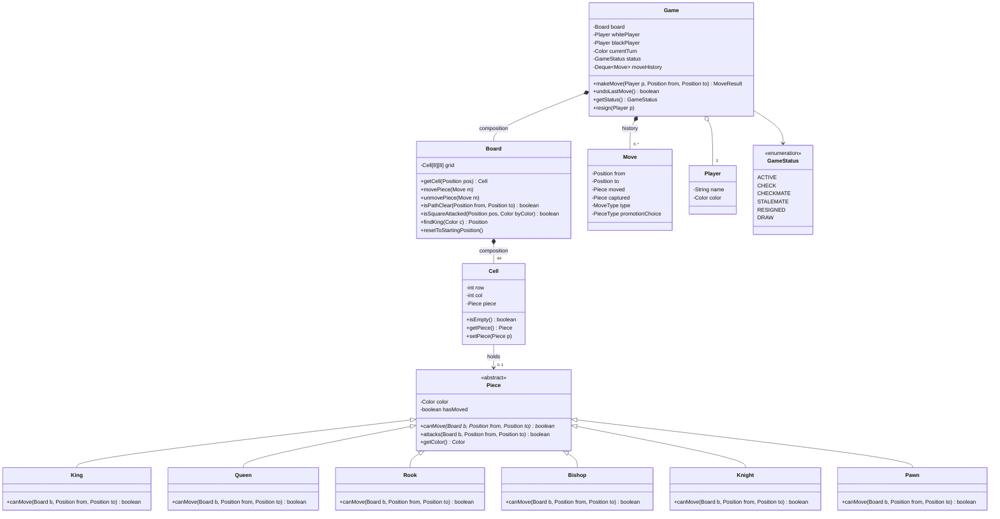

# Design a Chess Game

Chess is the classic "inheritance and polymorphism" LLD problem. Unlike Parking Lot
(composition-heavy) or Elevator (state-machine-heavy), chess tests whether you can model a
**family of related types with shared structure but different behavior** — six piece types
that all "move", but each with its own rules. It also has the richest rule engine of the
common LLD problems: path blocking, check detection, and special moves (castling, en passant,
promotion) that break the "one piece moves to one square" abstraction.

> [!INTERVIEW]
> Interviewers use chess to probe three things: (1) do you reach for polymorphism instead of
> a giant `switch (pieceType)`; (2) can you cleanly separate *piece-level* geometry from
> *board-level* validation from *game-level* rules; (3) how do you handle the rules that
> don't fit the clean abstraction (castling, en passant) without wrecking the design.

## Requirements Clarification

Spend the first five minutes scoping. Chess has enormous optional surface area (clocks,
ratings, networking, AI); an unscoped design drowns in 45 minutes.

**Questions to ask:**

- **Two human players on one machine?** (Yes — standard scope. AI opponent and network play
  are extensions, not core.)
- **Full rules or simplified?** Confirm which special rules are in scope: castling,
  en passant, pawn promotion, check/checkmate/stalemate detection. A good default: design
  the core so these fit, implement basic moves first, and narrate how the specials slot in.
- **Draws?** Fifty-move rule, threefold repetition, insufficient material — usually scoped
  out or mentioned as extensions. Stalemate detection is usually in scope.
- **Undo / move history?** Usually asked as a follow-up — design `Move` so it supports undo
  from day one (cheap insurance).
- **Timers, ratings, matchmaking, persistence?** Out of scope for the LLD round; say so
  explicitly.

**In scope (typical):** 8x8 board, two players, all six piece types with legal-move
validation, turn alternation, capture, check/checkmate/stalemate, game status, move history.

**Out of scope:** GUI rendering, chess engine/AI strength, network protocol, clock/timer
(extension), tournament features. "Scale to millions of concurrent games" is an HLD
question — one `Game` object per match; distribution belongs in the system-design domain.

> [!TIP]
> Explicitly saying "I'll design the move pipeline so castling and en passant are additive,
> and implement basic moves first" is a senior move: it shows time management *and* design
> foresight.

## Core Objects and Entities

Extract the nouns and give each a single responsibility:

| Entity | Responsibility |
|---|---|
| `Game` | Orchestrator: turn management, move execution, status (active/checkmate/...), move history. The only public entry point (`makeMove`). |
| `Board` | 8x8 grid of `Cell`s. Knows piece placement, answers spatial queries (`getCell`, `isPathClear`, `isSquareAttacked`), sets up the initial position. |
| `Cell` (Square) | One board location: coordinates + an optional `Piece`. A `Cell` may be empty — never model "empty" as a fake piece. |
| `Piece` (abstract) | Color + movement *geometry*: `canMove(board, from, to)`. Subclasses: `King`, `Queen`, `Rook`, `Bishop`, `Knight`, `Pawn`. |
| `Player` | Identity + color. (Interface if you'll add `AIPlayer` later.) |
| `Move` | Value object: from, to, moved piece, captured piece, special flags (castle, en passant, promotion). Immutable; the unit of history and undo. |
| `GameStatus` | Enum: `ACTIVE`, `CHECK`, `CHECKMATE`, `STALEMATE`, `RESIGNED`, `DRAW`. |
| `Color` | Enum: `WHITE`, `BLACK`. |

**Relationship choices that get probed:**

- `Board` **composes** `Cell`s (cells don't exist outside a board), and `Game` **composes**
  the `Board`. Lifetimes are tied — composition, not aggregation.
- `Cell` **references** a `Piece` (nullable / `Optional`): the piece "sits on" the cell.
- `King extends Piece` is genuine **inheritance**: every subtype IS-A piece and is
  substitutable wherever a `Piece` is expected (LSP holds — all honor the same
  `canMove` contract, just with different geometry).
- `Move` **aggregates** references to pieces and coordinates but owns none of them.

> [!KEY-TAKEAWAY]
> The piece hierarchy is the heart of the design. `Board.movePiece` never asks "what type
> are you?" — it calls `piece.canMove(...)` and dynamic dispatch selects the right rules.
> Any design with `switch (piece.getType())` scattered through the game logic fails the
> Open/Closed test: adding a fairy-chess piece would mean editing every switch.

## Class Diagram



Interview-grade, not enterprise overkill: no `AbstractBoardFactoryProvider`, no interfaces
for classes with one implementation. Every box earns its place.

## Key Design Decisions and Patterns

**1. Inheritance + polymorphism IS the pattern here.** Each piece subclass overrides
`canMove` with its own geometry. This is textbook Open/Closed: adding a new piece type
(fairy chess) means adding a subclass, not editing existing code. Resist the urge to
sprinkle GoF patterns for their own sake — an interviewer will happily fail a design that
wraps six piece types in six Strategy + Factory + Singleton layers.

**2. Strategy (composition) is the discussed alternative.** Instead of subclassing, a
single `Piece` class could hold a `MovementStrategy` field (see the Strategy write-up in
the design-patterns domain). Trade-off: composition lets you change movement at runtime
(useful for promotion — swap the strategy instead of replacing the object) and avoids a
class explosion if pieces varied along multiple axes. In standard chess, pieces vary along
exactly one axis (movement) and never change type except promotion, so the subclass
hierarchy is simpler and idiomatic. Mention the alternative, pick inheritance, move on.

**3. Layered validation — decide who validates what.** This is the design decision that
separates strong candidates:

- **Piece layer (geometry):** "Is this shape of move legal for me?" A bishop checks
  `|dr| == |dc|`. Pieces may consult the board (path clearance, target occupancy) but know
  nothing about turns or check.
- **Board layer (space):** path clearance for sliding pieces, "is that square attacked",
  locating the king.
- **Game layer (rules):** is it your turn, does the move leave your own king in check,
  status transitions (check/checkmate/stalemate), history.

Putting everything in `Game` creates a God class; putting turn logic in `Piece` couples
pieces to game flow. Each layer has one reason to change (SRP).

**4. `Move` as a Command-style value object.** Recording from/to, the moved piece, the
captured piece (if any), and special-move flags makes every move **reversible**:
`undo` pops the history and applies the inverse. This is the Command pattern's
encapsulate-an-action idea; you rarely need the full interface-per-command ceremony —
a rich immutable `Move` plus `Board.unmovePiece(move)` suffices in the interview.

**5. Observer for game events.** `Game` publishes `CHECK`, `CHECKMATE`, `DRAW` events to
registered listeners (UI, logger, clock). Keeps the engine free of presentation concerns —
the engine doesn't `println`, it notifies.

**6. Simulate-and-test for check legality.** A move is legal only if, after making it, your
own king is not attacked. Cleanest implementation: apply the move on the board, ask
`isSquareAttacked(kingPos, opponentColor)`, then revert. This one mechanism uniformly
handles pinned pieces, moving into check, and blocking a check — no special-case code.

> [!WARNING]
> Don't create an `EmptyPiece` / `NullPiece` subclass to represent empty squares. Null
> Object sounds clever but every movement rule then needs "can I capture an EmptyPiece?"
> special cases. An empty `Cell` (null or `Optional.empty()`) is the honest model.

## Move Validation Pipeline

The heart of `Game.makeMove`. Walk the interviewer through the ordered checks:

1. **Game active?** Reject moves after checkmate/resignation.
2. **Turn check:** the piece at `from` exists and belongs to the current player.
3. **Not a self-capture:** `to` is not occupied by a friendly piece.
4. **Piece geometry:** `piece.canMove(board, from, to)` — the polymorphic call.
5. **Path clearance:** for sliding pieces (rook, bishop, queen) every intermediate square
   is empty. The **knight skips this check** — it jumps. Cleanest home for the shared
   walk-the-line logic is `Board.isPathClear`, called by the sliding pieces from their
   `canMove` (avoids triplicating the loop in Rook/Bishop/Queen — or hoist it into a
   `SlidingPiece` intermediate class).
6. **King safety (legal vs pseudo-legal):** simulate the move; if your own king would be
   attacked, reject. A move passing 1-5 is only *pseudo-legal*; step 6 makes it *legal*.
7. **Execute:** apply the move, record it in history, flip the turn.
8. **Status update:** compute opponent's state — check, checkmate, stalemate — and notify
   observers.

**Pawn geometry deserves its own paragraph** — it's the piece most likely to expose a shaky
design, because its capture rule differs from its movement rule:

- Moves forward only, direction depends on color (`WHITE` decreasing row or increasing,
  depending on your coordinate convention — state it and stay consistent).
- One step forward onto an **empty** square; two steps from its starting rank if **both**
  squares are empty.
- Captures **diagonally only** — a pawn can never capture straight ahead, and can never
  move diagonally to an empty square (except en passant).

This is why `canMove(board, from, to)` takes the board: the pawn must inspect target
occupancy to distinguish a push from a capture. A signature like `canMove(from, to)`
without board access cannot express the pawn (or path blocking) at all.

> [!INTERVIEW]
> "Why does `canMove` take the `Board`?" is a favorite probe. Answer: movement legality is
> context-dependent — blocking pieces, capture targets, en passant state. Pure coordinate
> geometry is insufficient for every piece except the knight.

## Check Checkmate and Stalemate Detection

**Check:** the king's square is attacked by any enemy piece. Implement
`Board.isSquareAttacked(pos, byColor)` by iterating enemy pieces and asking whether each
could pseudo-legally move to `pos`. (Optimization if asked: instead of scanning all enemy
pieces, cast rays outward from the king and check knight-jump squares — O(1)-ish instead of
O(pieces × board). Mention it; don't build it first.)

One subtlety worth naming: **"attacks" ≠ "can move to" for the pawn.** A pawn attacks its
two forward diagonals even when they're empty, and does *not* attack the square it pushes
to. Reusing `canMove` for attack detection works when the target square is occupied (which
is always true in the king-safety simulation — the king stands on the tested square), but
for **empty** squares — castling's transit squares — it gives both false positives (the
push square "attacked") and false negatives (the empty diagonal missed). Fix: give pieces
an `attacks(board, from, to)` that defaults to `canMove` and is overridden by `Pawn`
(diagonals only, occupancy ignored). Spotting this is a strong-candidate signal.

**Checkmate = in check AND no legal move exists.** The only robust algorithm is
generate-and-test:

1. For every piece of the side to move, generate its pseudo-legal moves.
2. For each, **simulate** it on the board.
3. If any simulation leaves the king un-attacked, it's not mate.
4. If none do, checkmate.

Don't try to enumerate "can the king run, can the checker be captured, can the check be
blocked" as separate hand-coded cases — the generate-and-test loop covers all three
uniformly, including double check (where only king moves can help) for free.

**Stalemate = NOT in check AND no legal move exists.** Same loop, opposite check condition.
Result is a draw, not a win — a classic correctness trap.

**Simulation mechanics:** apply the move to the real board, test, revert (using the same
`Move`-based undo machinery you built for history — one mechanism, two uses). Copying the
whole board per candidate move also works and is safer against revert bugs; note the
memory/CPU trade-off and pick one out loud.

> [!KEY-TAKEAWAY]
> "A move is illegal if it leaves your own king in check" is the single rule that unifies
> pins, moving into check, and forced check responses. If your design handles that rule via
> simulate-and-test, you don't need special code for pinned pieces at all.

## Special Moves Castling En Passant and Promotion

The specials break the "one piece, one square" abstraction — interviewers ask them to see
whether your abstraction bends or shatters. Model each as a `MoveType`
(`NORMAL`, `CASTLE_KINGSIDE`, `CASTLE_QUEENSIDE`, `EN_PASSANT`, `PROMOTION`) on the `Move`
object so execution and undo can branch cleanly in one place.

**Castling** — a king-and-rook compound move with five preconditions:

1. Neither the king nor the chosen rook has moved (this is why `Piece.hasMoved` exists —
   a boolean set once; you cannot derive it cheaply from the board position alone, though
   you can derive it from move history).
2. No pieces between king and rook.
3. King is not currently in check.
4. The king does not **pass through** an attacked square.
5. The king does not **land on** an attacked square.

Note the asymmetry candidates miss: the rook may pass through an attacked square; only the
king's path (including start and end) must be safe. Because castling needs game/board
context beyond one piece's geometry, validate it at the Game/validator layer, not inside
`King.canMove` alone. Execution moves two pieces atomically — your `Move` type must
represent that for undo.

**En passant** — a pawn capturing a pawn that just advanced two squares, landing on the
square the enemy pawn skipped. Two design consequences:

- Legality depends on the **immediately previous move** — the only chess rule that does.
  So the validator needs access to the last entry of the move history (or the board caches
  an "en passant target square" after every double pawn push, FEN-style).
- The captured pawn is **not on the destination square**. Naive undo/capture code that
  assumes `captured piece sits at move.to` silently corrupts the board here — store the
  captured piece *and its square* in `Move`.

**Pawn promotion** — a pawn reaching the last rank becomes a queen, rook, bishop, or knight
(player's choice; under-promotion to a knight is legal and occasionally best — don't
hard-code queen). Design points:

- The choice is an **input to the move** (`Move.promotionChoice`), supplied by the caller —
  the engine shouldn't block waiting for a UI prompt mid-`makeMove`.
- Cleanest execution: **replace** the pawn object with a newly created piece (a small
  piece Factory keeps creation in one place). Mutating a pawn's "type" field breaks the
  subclass model. (This is the one spot where the Strategy-composition alternative shines —
  it would swap a strategy instead — acknowledge and move on.)
- Undo must restore the pawn, another reason `Move` records what happened.

## API and Method Signatures

Keep the public surface small — `Game` is the facade; callers never touch `Board` directly.

```java
public class Game {
    public Game(Player white, Player black);

    /** Validates and executes. Returns result instead of void so callers
        get status without exception-driven control flow for normal cases. */
    public MoveResult makeMove(Player player, Position from, Position to);

    /** Promotion overload: choice supplied with the move. */
    public MoveResult makeMove(Player player, Position from, Position to,
                               PieceType promotionChoice);

    public boolean undoLastMove();
    public GameStatus getStatus();
    public Color getCurrentTurn();
    public List<Move> getMoveHistory();   // unmodifiable view
    public void resign(Player player);
    public void addListener(GameListener l);   // Observer hook
}

public record Position(int row, int col) { }   // or file/rank named "e4"-style

public record MoveResult(boolean success, GameStatus statusAfter, String reason) { }

public interface GameListener {
    void onMoveMade(Move move);
    void onStatusChanged(GameStatus newStatus);
}
```

Design notes worth saying out loud:

- `makeMove` takes the `Player` so the game — not the caller — enforces turn order.
- Illegal move ≠ exceptional: it's an expected outcome (users mis-click), so return a
  `MoveResult` with a reason rather than throwing. Reserve exceptions for programming
  errors (null player, out-of-range coordinates).
- `Position` as an immutable value type (record) kills a whole class of aliasing bugs and
  gives free `equals`/`hashCode` for sets of attacked squares.

## Code Skeleton

```java
public enum Color { WHITE, BLACK;
    public Color opposite() { return this == WHITE ? BLACK : WHITE; }
}

public enum GameStatus { ACTIVE, CHECK, CHECKMATE, STALEMATE, RESIGNED, DRAW }

public abstract class Piece {
    protected final Color color;
    protected boolean hasMoved = false;

    protected Piece(Color color) { this.color = color; }

    /** Pure movement legality for this piece type, given board context.
        Does NOT consider turn order or whether own king ends up in check. */
    public abstract boolean canMove(Board board, Position from, Position to);

    /** Squares this piece threatens. Same as canMove for every piece except
        the pawn (attacks diagonals regardless of occupancy, never the push square). */
    public boolean attacks(Board board, Position from, Position to) {
        return canMove(board, from, to);
    }

    public Color getColor() { return color; }
    public boolean hasMoved() { return hasMoved; }
}

public class Bishop extends Piece {
    public Bishop(Color c) { super(c); }

    @Override
    public boolean canMove(Board board, Position from, Position to) {
        int dr = Math.abs(to.row() - from.row());
        int dc = Math.abs(to.col() - from.col());
        return dr == dc && dr > 0 && board.isPathClear(from, to);
    }
}

public class Knight extends Piece {
    public Knight(Color c) { super(c); }

    @Override
    public boolean canMove(Board board, Position from, Position to) {
        int dr = Math.abs(to.row() - from.row());
        int dc = Math.abs(to.col() - from.col());
        return dr * dc == 2;          // (1,2) or (2,1) - jumps, no path check
    }
}

public class Pawn extends Piece {
    public Pawn(Color c) { super(c); }

    @Override
    public boolean canMove(Board board, Position from, Position to) {
        int dir = (color == Color.WHITE) ? -1 : 1;     // white moves up
        int dr = to.row() - from.row();
        int dc = Math.abs(to.col() - from.col());
        boolean targetEmpty = board.getCell(to).isEmpty();

        if (dc == 0 && dr == dir && targetEmpty) return true;          // push
        if (dc == 0 && dr == 2 * dir && !hasMoved && targetEmpty
                && board.getCell(new Position(from.row() + dir, from.col())).isEmpty())
            return true;                                               // double push
        if (dc == 1 && dr == dir && !targetEmpty)                      // capture
            return true;
        return false;   // en passant handled by MoveValidator with history context
    }
}

public class Board {
    private final Cell[][] grid = new Cell[8][8];

    public boolean isPathClear(Position from, Position to) {
        int stepR = Integer.signum(to.row() - from.row());
        int stepC = Integer.signum(to.col() - from.col());
        int r = from.row() + stepR, c = from.col() + stepC;
        while (r != to.row() || c != to.col()) {
            if (!grid[r][c].isEmpty()) return false;
            r += stepR; c += stepC;
        }
        return true;    // destination checked separately (capture vs friendly)
    }

    public boolean isSquareAttacked(Position pos, Color byColor) {
        for (Cell cell : allCells()) {
            Piece p = cell.getPiece();
            // attacks() defaults to canMove(); Pawn overrides it (diagonals only,
            // occupancy ignored) so empty transit squares test correctly.
            if (p != null && p.getColor() == byColor
                    && p.attacks(this, cell.position(), pos)) return true;
        }
        return false;
    }
    // getCell, movePiece(Move), unmovePiece(Move), findKing, resetToStartingPosition ...
}

public class Game {
    private final Board board = new Board();
    private final Deque<Move> history = new ArrayDeque<>();
    private Color currentTurn = Color.WHITE;
    private GameStatus status = GameStatus.ACTIVE;

    public synchronized MoveResult makeMove(Player player, Position from, Position to) {
        if (status == GameStatus.CHECKMATE || status == GameStatus.RESIGNED
                || status == GameStatus.STALEMATE || status == GameStatus.DRAW)
            return MoveResult.fail("game over");
        if (player.color() != currentTurn) return MoveResult.fail("not your turn");

        Piece piece = board.getCell(from).getPiece();
        if (piece == null || piece.getColor() != currentTurn)
            return MoveResult.fail("no piece of yours at source");
        if (!isLegal(piece, from, to)) return MoveResult.fail("illegal move");

        Move move = buildMove(piece, from, to);      // fills captured piece, MoveType
        board.movePiece(move);
        history.push(move);
        currentTurn = currentTurn.opposite();
        status = evaluateStatus(currentTurn);        // CHECK / CHECKMATE / STALEMATE
        notifyListeners(move, status);
        return new MoveResult(true, status, null);
    }

    private boolean isLegal(Piece piece, Position from, Position to) {
        Cell target = board.getCell(to);
        if (!target.isEmpty() && target.getPiece().getColor() == piece.getColor())
            return false;                                  // no self-capture
        if (!piece.canMove(board, from, to)) return false; // polymorphic geometry
        return !leavesOwnKingInCheck(piece, from, to);     // simulate and test
    }

    private boolean leavesOwnKingInCheck(Piece piece, Position from, Position to) {
        Move trial = buildMove(piece, from, to);
        board.movePiece(trial);
        boolean inCheck = board.isSquareAttacked(
                board.findKing(piece.getColor()), piece.getColor().opposite());
        board.unmovePiece(trial);
        return inCheck;
    }
}
```

What to narrate while writing it: the `synchronized` on `makeMove` (cheap safety for a
turn-based game), the reuse of move/unmove for both undo and simulation, and that
`evaluateStatus` runs the generate-and-test loop from the checkmate section.

## Concurrency and Edge Cases

**Concurrency is light here — say why.** Chess is strictly turn-based: at most one player
has a legal action at any time. A single lock (`synchronized makeMove`) plus the
`player.color() == currentTurn` guard handles double-submits, impatient double-clicks, and
a malicious client sending moves out of turn. There is no lock ordering problem and no need
for concurrent collections inside one game. Multiple *games* run independently — one `Game`
instance each, no shared mutable state (avoid static/singleton boards precisely so games
don't couple). Timer-vs-move races (clock thread flags timeout while a move arrives) are
resolved by taking the same game lock — first to acquire wins.

**Edge cases checklist:**

- **Stalemate is a draw, not a loss** — the most common correctness bug.
- **Pinned piece:** moving it exposes the king — rejected automatically by
  simulate-and-test; verify with a test, not with special-case code.
- **Double check:** only a king move can resolve it — again falls out of generate-and-test.
- **En passant undo:** the captured pawn isn't on the destination square; `Move` must store
  the captured piece's actual square.
- **Castling rights lost forever:** once `hasMoved` flips, it never unflips — except on
  undo, so undo must restore the *previous* `hasMoved` value (store it in `Move`, or a
  first-move flag).
- **Promotion without a choice:** reject or default explicitly; don't NPE.
- **Draw rules (extension tier):** fifty-move counter (reset on pawn move or capture),
  threefold repetition (needs position hashing — mention Zobrist hashing as the standard
  technique, don't implement), insufficient material (K vs K, K+B vs K, K+N vs K).
- **Input hygiene:** out-of-board coordinates, `from == to`, moving from an empty square.

## Extensibility

The follow-ups an interviewer will actually ask, and the one-line design answer:

- **"Add undo/redo."** Already built: `history` is a stack of rich `Move` objects;
  `unmovePiece(move)` inverts one. Redo = a second stack, cleared on any new move. This is
  the Command pattern payoff — no board snapshots needed (though snapshot/Memento is the
  simpler-but-heavier alternative worth naming).
- **"Add a move timer (chess clock)."** A `Clock` per player owned by `Game`; `makeMove`
  stops the mover's clock and starts the opponent's. Timeout fires an event → status
  becomes a timeout loss. Register the clock as a `GameListener` — zero changes to move
  validation. Points to Observer.
- **"Add an AI opponent."** Make `Player` an interface — `HumanPlayer` supplies moves from
  input, `AIPlayer` computes them (Strategy for difficulty levels). `Game` doesn't change:
  it validates whatever move it's given. Clean dependency-inversion story.
- **"Add a new piece type / fairy chess."** New `Piece` subclass + factory/setup entry.
  Nothing else changes — the Open/Closed proof for the whole design.
- **"Chess960 (random start position)."** Board setup is one method; extract a
  `BoardInitializer` (Strategy or Factory Method) with `StandardSetup` and `Chess960Setup`.
  Castling logic generalizes (king/rook start squares become parameters) — honest answer:
  that part genuinely needs rework, which is why it's asked.
- **"Notation / replay (PGN)."** Move history already captures everything; a
  `MoveFormatter` walks it. Replay = apply the list to a fresh board — also your best
  integration test.
- **"Spectators / broadcast, persistence, matchmaking."** Observer handles in-process
  spectators; anything cross-machine is HLD — say "that's a system-design conversation"
  and point at the game-platform topics there.

## Common Interview Follow-ups

- **"Why not one `Piece` class with a `type` enum and a big switch in `canMove`?"** —
  Violates OCP (every new piece edits the switch), and the switch inevitably duplicates
  into `getValidMoves`, rendering, and scoring. Polymorphism puts each piece's rules in one
  place.
- **"Piece inheritance vs a `MovementStrategy` composition — when would you flip?"** — Flip
  when behavior must change at runtime (promotion), when pieces vary along multiple
  independent axes, or when the same movement rules are shared across piece skins. Standard
  chess varies on one axis, so subclassing wins on simplicity.
- **"Where does `getValidMoves(board, from)` live?"** — On `Piece` (each type generates its
  own candidates) with `Game` filtering out king-in-check moves; or a `MoveGenerator`
  service if you want pieces to stay minimal. Either is defensible — what's wrong is
  `Game` computing knight offsets itself.
- **"How do you unit-test checkmate?"** — Board setup injection: construct arbitrary
  positions (back-rank mate, smothered mate, stalemate traps) directly rather than playing
  full games. This is why `Board.resetToStartingPosition` shouldn't be welded into the
  constructor.
- **"Two clients submit a move simultaneously?"** — One game lock + turn guard; second
  submission fails with "not your turn". Turn-based games don't need finer-grained locking.
- **"Does `Cell` even need to exist, versus `Map<Position, Piece>`?"** — A map of only
  occupied squares is a legitimate slimmer model (empty = absent key). `Cell` earns its
  keep if squares carry state/rendering info. Showing you *considered* the representation
  is the point.
- **"Scale to millions of games / online chess platform?"** — Per-game state is tiny and
  independent; shard games across servers, persist move logs. Beyond that, redirect to the
  system-design domain — it's an HLD question wearing an LLD hat.

## References

- Gamma, Helm, Johnson, Vlissides — *Design Patterns* (Command, Observer, Strategy,
  Factory Method; see the design-patterns domain topics for full treatments).
- Robert C. Martin — *Agile Software Development* (SRP/OCP/LSP as applied to type
  hierarchies).
- FIDE Laws of Chess — the authoritative rules for castling, en passant, and draw
  conditions: https://handbook.fide.com/chapter/E012023
- Chess Programming Wiki — move generation, Zobrist hashing, board representations:
  https://www.chessprogramming.org/
- Grokking the Object-Oriented Design Interview — "Design Chess" chapter (common
  interview baseline for this problem).
