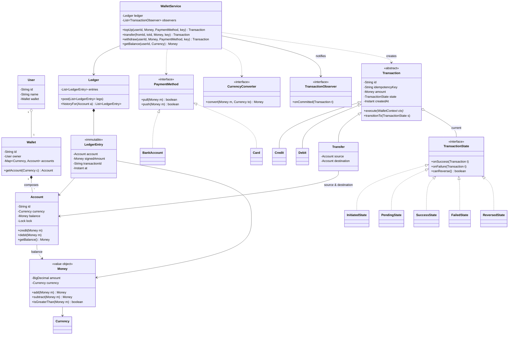
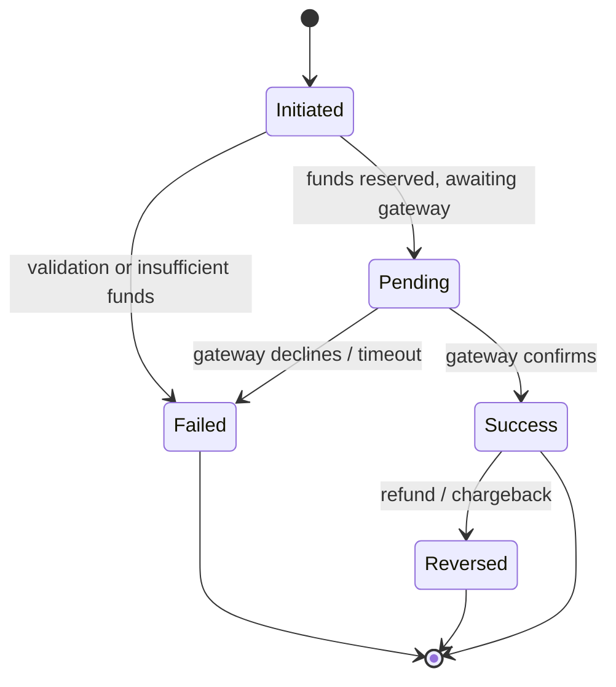

# Design a Digital Wallet

A PayTM / PayPal / Venmo-style digital wallet is the canonical **money-modeling +
concurrency** problem in LLD interviews. It looks deceptively small — "let users hold a
balance and send money" — but it is the one problem where getting the *data types* wrong
(using `double` for money) or the *concurrency* wrong (non-atomic transfers, double-spend on
retry) is an instant fail. It rewards three things: a clean **value object** for money, a
**double-entry ledger** so balances always reconcile, and correct **atomic, idempotent**
transfers between accounts.

Budget for a 45–60 min session: ~5 min requirements, ~10 min entities + class diagram,
~10 min Money + transaction state machine, ~10 min the atomic-transfer / ledger core,
~10 min code skeleton, ~10 min concurrency and follow-ups.

This topic assumes the method from `lld-interview-method` and the OO foundations from
`oop-principles-pillars` / `solid-principles`. It reuses the Strategy/State/Command/Observer
patterns owned by the `dp-*` topics — we name them and say *why*, and cross-reference rather
than re-teach.

## Requirements Clarification

The first five minutes — pin down scope before drawing a single class:

- **Core operations**: top-up (load money from a bank/card into the wallet), withdraw
  (cash out to a bank), peer-to-peer transfer (wallet → wallet), and pay a merchant?
  (Baseline: top-up, transfer, withdraw. Merchant payment is "transfer to a merchant
  wallet".)
- **Balance rules**: can a balance go negative? (Baseline: **no** — overdraft is rejected;
  credit lines are an explicit extension.) Is there a minimum/maximum balance or a
  per-transaction / daily limit? (Design a limit hook; baseline enforces a non-negative
  balance and an optional per-txn cap.)
- **Multi-currency**: one currency per wallet, or many? (Baseline: single currency per
  account, but model `Money` as amount **+** currency from day one so multi-currency is an
  extension, not a rewrite. Cross-currency transfer needs an exchange-rate strategy.)
- **Funding sources**: which `PaymentMethod`s can top-up/withdraw — bank account, debit/credit
  card, UPI? (Support several behind one interface — the Strategy hook the interviewer is
  fishing for.)
- **Transaction lifecycle**: are transfers instant, or can they be pending/async (bank
  settlement takes time)? (This is what justifies a **State machine**: Initiated → Pending →
  Success / Failed, plus Reversed for refunds.)
- **History & audit**: must every balance change be traceable? (Yes — this is why we keep an
  immutable **ledger**, not just a mutable balance number.)
- **Idempotency**: what happens if the client retries a transfer after a network timeout?
  (Must not double-charge — needs an idempotency key. Call this out; it separates seniors.)
- **Refunds / reversals**: can a completed transaction be reversed? (Yes — model reversal as a
  compensating transaction, never by mutating history.)
- **Persistence / scale**: in-memory single machine is fine for this round. "Handle millions
  of TPS / distributed ledger / two-phase commit across services" is an **HLD** concern — say
  so and point to the system-design domain; keep this design single-node OO.

Explicitly **scope out**: KYC/authentication, actual bank/card gateway integration (model
the `PaymentGateway` interface, not its wire protocol), fraud detection ML, interest/GST
computation, and distributed storage.

> [!INTERVIEW]
> State the money invariant out loud in minute one: *every balance-changing operation is
> recorded as one or more ledger entries whose signed amounts sum to zero, and no account may
> go negative*. Double-entry + non-negativity is the entire correctness story; interviewers
> score you for naming it before you code.

## Actors and Use Cases

Who touches the system and how (the Grokking UML-first framing):

- **User / Wallet holder** — tops up, checks balance, transfers to another user, withdraws to
  a bank, views transaction history, requests a refund.
- **Merchant** — receives payments (a wallet with a merchant flag); may issue refunds.
- **Payment gateway / Bank (external system)** — asynchronously confirms or rejects a top-up
  or withdrawal; drives Pending → Success/Failed transitions.
- **System / Ledger** — the internal actor that keeps the double-entry books and reconciles.
- **Admin (optional)** — freezes accounts, sets limits, triggers reconciliation reports.

Primary use cases: *Top Up Wallet*, *Transfer Money*, *Withdraw to Bank*, *View Balance*,
*View Transaction History*, *Reverse / Refund Transaction*. Each maps to one public method on
the `WalletService` facade.

## Noun/Verb Object Identification

The step-by-step technique: underline the nouns in the requirements for **candidate classes**,
the verbs for **candidate methods**, then *filter* — not every noun becomes a class.

**Candidate nouns → filter:**

| Noun | Decision |
|---|---|
| User | **Class** — identity/profile |
| Wallet | **Class** — a user's container of one or more accounts |
| Account | **Class** — holds balance in one currency; the unit the ledger debits/credits |
| Balance | **Attribute** of Account (a `Money`), *derivable* from the ledger — not its own class |
| Money / amount / currency | **Value object** (`Money`) — amount + currency, immutable |
| Transaction | **Class (abstract)** — one money-movement event; subtypes Credit/Debit/Transfer |
| Transaction type | **Enum** `TransactionType` — CREDIT, DEBIT, TRANSFER, REFUND |
| Transaction status/state | **Enum + State pattern** — INITIATED, PENDING, SUCCESS, FAILED, REVERSED |
| Ledger / transaction history | **Class** `Ledger` — append-only list of `LedgerEntry`s |
| Ledger entry | **Class** — one signed posting against one account (double-entry leg) |
| Payment method / bank account / card | **Strategy interface** `PaymentMethod` + implementations |
| Exchange rate | **Strategy** `CurrencyConverter` / `ExchangeRateProvider` (interface — external) |
| Notification | **Observer** hook, not a core class — `TransactionObserver` |
| Limit / rule | **Class** `TransactionLimit` or a validation rule; a limit *policy* |
| PayTM / PayPal / rupee symbol | **Noise** — brand/UI, not domain |

**Candidate verbs → methods:** *top up* → `topUp()`, *transfer* → `transfer()`, *withdraw* →
`withdraw()`, *debit/credit* → `Account.debit()/credit()`, *record* → `Ledger.post()`,
*validate* → strategy `validate()`, *convert* → `CurrencyConverter.convert()`, *notify* →
`observer.onTransaction()`, *reverse* → `reverse()`.

The filtering discipline is the point: "balance" is a *derived attribute*, not a class;
"transaction status" is behavior worth a **State** object rather than a bare enum; brand names
are noise. Say this out loud — interviewers grade the *reasoning*, not the list.

## Responsibilities and Relationships

CRC-style — what each class KNOWS, what it DOES, and its collaborators:

| Class | Knows (state) | Does (behavior) | Collaborators |
|---|---|---|---|
| `User` | id, name, contact | identity only — no money logic | Wallet |
| `Wallet` | owner, its Accounts | resolve the account for a currency | User, Account |
| `Account` | id, currency, current balance (`Money`) | `credit`/`debit` with non-negativity + locking | Money, Ledger |
| `Money` | amount (`BigDecimal`), currency | immutable arithmetic (`add`/`subtract`), reject cross-currency | Currency |
| `Transaction` (abstract) | id, amount, state, timestamp, idempotencyKey | drive its own lifecycle via State | TransactionState, Account |
| `Transfer` / `Credit` / `Debit` | source/dest accounts | define how to apply itself to accounts | Account, Ledger |
| `TransactionState` (interface) | — | legal transitions + guard | Transaction |
| `Ledger` | append-only `LedgerEntry` list | `post` balanced entries, query history, reconcile | LedgerEntry, Account |
| `LedgerEntry` | account, signed `Money`, txnId, timestamp | immutable record of one posting leg | Money |
| `PaymentMethod` (interface) | — | `pull`/`push` money to external world | PaymentGateway |
| `CurrencyConverter` (interface) | — | convert `Money` between currencies | ExchangeRateProvider |
| `TransactionObserver` (interface) | — | react to committed transactions | Transaction |
| `WalletService` | registries, ledger, observers | orchestrate/validate/commit — the facade | everything |

Relationships to narrate:

- `Wallet` **composes** `Account`s (filled diamond): an account has no meaning outside its
  wallet and shares its lifecycle.
- `User` **aggregates**/associates a `Wallet` (or 1:1 owns it) — the user exists independently.
- `Transaction` **is-a** hierarchy (`Credit`/`Debit`/`Transfer`) uses inheritance because the
  *identity/shape* of the operation genuinely differs (a transfer has two accounts, a credit
  one) — but the *status behavior* varies orthogonally, so status uses **State composition**,
  not more subclasses. This "inheritance for kind, composition for varying behavior" split is
  the key modeling call.
- `Ledger` **composes** `LedgerEntry`s (append-only, immutable).
- `Account` **has-a** `Money` balance; `Money` **has-a** `Currency`.

## Class Diagram



Relationship notes worth saying out loud:

- `Wallet` **composes** `Account`s (filled diamond) — lifecycle-bound.
- `Transaction` **aggregates** its current `TransactionState` (open diamond) — the state
  object is swapped as the transaction moves through its lifecycle (State pattern).
- `WalletService` **depends on** (dashed) `PaymentMethod`/`CurrencyConverter` — injected
  collaborators it uses transiently, not owned state.
- `LedgerEntry` and `Money` are **immutable** — the stereotype signals no setters.

## Money as a Value Object

The single most-graded detail in this problem. `Money` is an **immutable value object**:
amount **plus** currency, equality by value, arithmetic that returns new instances.

- **Use `BigDecimal` (or integer minor units / paise), never `double`.** `0.1 + 0.2 != 0.3`
  in binary floating point; over millions of transactions the ledger drifts and the
  "entries sum to zero" invariant silently breaks. `BigDecimal` gives exact decimal
  arithmetic with an explicit rounding mode; integer minor units (store `12345` for
  ₹123.45) is the common alternative.
- **Immutable.** `add`/`subtract` return a *new* `Money`; no setters. Immutability makes it
  safe to share across threads and impossible to accidentally mutate a balance mid-transfer.
- **Currency-safe.** `add`/`subtract` throw if currencies differ — you cannot silently add
  USD to INR. Cross-currency movement must go through a `CurrencyConverter` explicitly.
- **Why a value object and not a `long`?** A raw amount loses the currency and lets you do
  meaningless arithmetic (add rupees to dollars). Bundling amount+currency with guarded
  operations is the textbook Value Object (DDD) / "Whole Value" pattern — it centralizes the
  money rules so no caller can get them wrong.

This mirrors the money discipline in `design-splitwise` and `design-vending-machine`; the
difference here is multi-currency, so the currency field is load-bearing, not optional.

## Transaction State Machine

A transfer is not instantaneous when a bank/gateway is involved, so a `Transaction` moves
through a lifecycle. Model it with the **State pattern** (each state is an object that knows
its legal transitions), not a tangle of `if (status == ...)` checks.



- **INITIATED** — created and validated (amount positive, currencies match, limits ok).
- **PENDING** — funds reserved/held; awaiting external confirmation (top-up/withdraw via a
  gateway). An instant wallet→wallet transfer may skip straight to SUCCESS.
- **SUCCESS** — ledger posted, balances committed. Terminal unless reversed.
- **FAILED** — rejected; any reservation released; no net ledger effect. Terminal.
- **REVERSED** — a compensating transaction has undone a previously SUCCESS transaction
  (refund/chargeback). Terminal.

Why State over an enum-and-switch: each state encapsulates *which transitions are legal* and
*what to do on entry*. Illegal moves (e.g., FAILED → SUCCESS) are impossible by construction,
and adding a new state (e.g., `Disputed`) is a new class, not edits scattered across every
switch — Open/Closed in action. The enum still exists for persistence/serialization, but the
*behavior* lives in state objects. (See `dp-state`.)

## Key Design Decisions and Patterns

Name each pattern, classify it by GoF intent, and say why:

**Strategy (Behavioral) — funding & currency conversion.** `PaymentMethod` (BankAccount,
Card, UPI) and `CurrencyConverter` are interchangeable algorithms behind one interface.
Adding "top up via UPI" is a new `PaymentMethod` class, no change to `WalletService` — OCP.
The alternative, a `switch` on method type inside the service, reopens and re-tests the
service for every new method. (See `dp-strategy`.)

**State (Behavioral) — transaction lifecycle.** As above: legal transitions live in state
objects; illegal states are unrepresentable. (See `dp-state`.)

**Command (Behavioral) — transaction as a command.** Modeling each `Transaction` as a command
object with `execute()` (and `undo()`/`reverse()`) gives you a **first-class, replayable,
auditable** unit of work. It enables an audit log, retry, and reversal for free — the command
*is* the audit record. This is a natural fit because a wallet must be fully auditable. (See
`dp-command`.)

**Observer (Behavioral) — notifications.** "Notify the user when a transfer completes" must
not put SMS/push/email logic inside `WalletService`. The service fires
`observer.onCommitted(txn)`; new channels are new observers, zero service change. (See
`dp-observer`.)

**Factory (Creational) — building transactions/accounts.** A `TransactionFactory` centralizes
constructing the right `Transaction` subtype (Credit/Debit/Transfer) wired to its initial
state, so clients never `new` concrete transactions. (See `dp-factory`.)

**Value Object — `Money`** (covered above): the money rules in one immutable type.

**Facade — `WalletService`**: one orchestration entry point over accounts, ledger, payment
methods, and observers; keeps controllers thin.

> [!KEY-TAKEAWAY]
> One-line pitch: *Money is an immutable value object, every balance change is a
> double-entry Ledger posting, a Transaction is a Command whose lifecycle is a State machine,
> funding methods are Strategies, and transfers are atomic + idempotent.* Balances always
> reconcile and retries never double-spend.

## Double-Entry Bookkeeping and the Ledger

The concept that turns a toy wallet into a correct one. **Never** store the balance as the
only source of truth and mutate it in place — store an **append-only ledger** of postings and
treat the balance as their running sum (or a cached materialization you can rebuild).

**Double-entry rule:** every transaction produces balanced legs whose signed amounts **sum to
zero**. A transfer of ₹100 from A to B posts two entries:

```
LedgerEntry{ account: A, amount: -100 }   // debit source
LedgerEntry{ account: B, amount: +100 }   // credit destination
                          --------
                     sum =   0            // must always hold
```

A top-up debits an external "bank source" account and credits the wallet; a withdrawal does
the reverse. This guarantees money is **conserved** — it is never created or destroyed inside
the system, only moved. Reconciliation is then a one-line invariant check: *the sum of all
ledger entries across all internal accounts equals the total funded in minus funded out*.

Why append-only and immutable: an audit trail you can never silently alter, replay, or
rebuild balances from. Edits/reversals are **new compensating entries**, never mutations of
past rows (same discipline as `design-splitwise`'s "don't fake a repayment as an inverted
expense"). This is the object-level shadow of event sourcing — worth name-dropping, but keep
it single-node here.

## API and Method Signatures

The public surface an interviewer expects on the facade:

```java
public interface PaymentMethod {
    boolean pull(Money amount);   // bring money IN from bank/card
    boolean push(Money amount);   // send money OUT to bank/card
}

public interface CurrencyConverter {
    Money convert(Money amount, Currency target);
}

public class WalletService {
    // idempotencyKey de-dupes retries; returns existing txn if key seen
    Transaction topUp(String userId, Money amount,
                      PaymentMethod method, String idempotencyKey);

    Transaction transfer(String fromUserId, String toUserId,
                         Money amount, String idempotencyKey);

    Transaction withdraw(String userId, Money amount,
                        PaymentMethod method, String idempotencyKey);

    Money getBalance(String userId, Currency currency);
    List<LedgerEntry> getHistory(String userId);
    Transaction reverse(String transactionId, String idempotencyKey);

    void registerObserver(TransactionObserver o);
}
```

Signature decisions to narrate: ids at the boundary (not entity refs); `Money` (not `double`)
everywhere a value flows; every mutating call takes an **idempotencyKey**; `reverse` creates a
*new* compensating transaction rather than deleting one; queries return `Money`/immutable
history.

## Code Skeleton

Enough Java to show structure — write this much and talk through the rest:

```java
// ---- Money: immutable value object ----
public final class Money {
    private final BigDecimal amount;
    private final Currency currency;

    public Money(BigDecimal amount, Currency currency) {
        this.amount = amount.setScale(currency.getDefaultFractionDigits(),
                                      RoundingMode.HALF_EVEN);
        this.currency = currency;
    }
    public Money add(Money o)      { requireSameCurrency(o); return new Money(amount.add(o.amount), currency); }
    public Money subtract(Money o) { requireSameCurrency(o); return new Money(amount.subtract(o.amount), currency); }
    public boolean isGreaterThanOrEqual(Money o) { requireSameCurrency(o); return amount.compareTo(o.amount) >= 0; }
    public boolean isNegative() { return amount.signum() < 0; }
    private void requireSameCurrency(Money o) {
        if (!currency.equals(o.currency))
            throw new CurrencyMismatchException(currency, o.currency);
    }
    // equals/hashCode by (amount, currency) — value equality
}

// ---- Account: guards the non-negative invariant + locking ----
public class Account {
    private final String id;
    private final Currency currency;
    private Money balance;
    private final ReentrantLock lock = new ReentrantLock();

    public void debit(Money amount) {           // caller holds lock (see transfer)
        if (!balance.isGreaterThanOrEqual(amount))
            throw new InsufficientFundsException(id);
        balance = balance.subtract(amount);
    }
    public void credit(Money amount) { balance = balance.add(amount); }
    ReentrantLock lock() { return lock; }
}

// ---- Transaction: Command + State ----
public abstract class Transaction {
    protected final String id;
    protected final String idempotencyKey;
    protected final Money amount;
    protected TransactionState state = new InitiatedState();

    public abstract void execute(WalletContext ctx);   // Command
    public void transitionTo(TransactionState s) { this.state = s; }
}

public class Transfer extends Transaction {
    private final Account source, destination;

    @Override public void execute(WalletContext ctx) {
        // lock BOTH accounts in canonical id order to avoid deadlock
        Account first  = source.getId().compareTo(destination.getId()) < 0 ? source : destination;
        Account second = first == source ? destination : source;
        first.lock().lock();
        second.lock().lock();
        try {
            source.debit(amount);                 // may throw InsufficientFundsException
            destination.credit(amount);
            ctx.ledger().post(List.of(
                LedgerEntry.debit(source, amount, id),
                LedgerEntry.credit(destination, amount, id)));   // sum == 0
            transitionTo(new SuccessState());
        } catch (InsufficientFundsException e) {
            transitionTo(new FailedState());
            throw e;
        } finally {
            second.lock().unlock();
            first.lock().unlock();
        }
    }
}

// ---- Service facade: idempotency + orchestration ----
public class WalletService {
    private final Ledger ledger;
    private final Map<String, Transaction> byIdempotencyKey = new ConcurrentHashMap<>();
    private final List<TransactionObserver> observers = new CopyOnWriteArrayList<>();

    public Transaction transfer(String fromId, String toId, Money amt, String key) {
        // Claim the key BEFORE executing. putIfAbsent is one atomic step:
        // only the thread that wins the insert runs execute(); any concurrent
        // retry sees the existing txn and returns it — so no two retries execute.
        Transfer txn = TransactionFactory.transfer(resolve(fromId), resolve(toId), amt, key);
        Transaction existing = byIdempotencyKey.putIfAbsent(key, txn);
        if (existing != null) return existing;            // idempotent: retry lost the race, no double-spend

        txn.execute(new WalletContext(ledger));           // only the key owner executes
        observers.forEach(o -> o.onCommitted(txn));       // notify after commit
        return txn;
    }
    // NOTE: the tempting get(key) -> if-null execute() -> putIfAbsent(key) ordering
    // is exactly the double-spend bug: two retries both read null, both execute, and
    // the store de-dupes too late. Reserve the key first, then execute.
}
```

The `execute()`-with-both-locks method is the heart of the problem — narrate the debit-then-
credit ordering, the ledger post, and the state transition as one atomic unit.

## Concurrency and Atomic Transfers

This is where the problem is won or lost. A transfer must be **atomic**: debit source and
credit destination either both happen or neither does. Two designs:

- **Pessimistic locking (interview default).** Lock both accounts, do the debit+credit+ledger
  post, unlock. Correct and simple for a single node. The trap is **deadlock**: thread 1
  transfers A→B, thread 2 transfers B→A, each holds one lock and waits for the other. Fix:
  acquire locks in a **canonical order** (sort by account id, lock the smaller id first) so a
  cycle can't form. State this rule explicitly — it's the graded detail.
- **Optimistic locking (concurrency depth).** Give each account a `version`; read balance +
  version, compute, then compare-and-set — if the version changed, retry. No locks held
  across the operation; better under low contention, needs a retry loop. Cross-ref
  `concurrency-in-lld` for the CAS/versioning mechanics.

Other concurrency points:

- **Never allow a negative balance under a race.** The check `balance >= amount` and the
  `balance -= amount` must be one atomic critical section; a `ConcurrentHashMap` of balances
  is *not* enough because check-then-act across two accounts needs cross-account atomicity.
- **The ledger post must be part of the same critical section** as the balance mutation, or a
  reader can observe a debit without its matching credit (broken sum-to-zero invariant).
- **Idempotency for retries** (below) is a concurrency concern too: two concurrent retries of
  the same key must resolve to a single transaction (`putIfAbsent` / unique-key insert).

"Scale this to a distributed ledger / 2-phase commit / sharded accounts" is explicitly an
**HLD** handoff — acknowledge it and point to the system-design domain; keep the LLD design
single-node.

## Idempotency and Retries

The network is unreliable: a client sends "transfer ₹100", times out, and retries — but the
first request may have already succeeded. Without protection the user is charged twice
(double-spend).

**Idempotency key:** the client generates a unique key per logical operation and sends it with
every retry. The service records "key → resulting transaction" atomically. On a repeat key it
**returns the original result** instead of re-executing. This makes the operation *at-most-once
in effect* even under *at-least-once delivery*.

Design notes: store the key mapping in the same atomic step that commits the transaction
(`putIfAbsent`, or a unique DB constraint) so two concurrent retries can't both execute; keys
should be scoped/expiring; a "reserve then confirm" (two-phase) flow handles long-running
gateway calls where the retry arrives while the first is still PENDING.

## Extensibility

The "now add X" follow-ups and where the design absorbs them:

- **New funding source (UPI, wallet-to-card):** new `PaymentMethod` implementation + factory
  line. No `WalletService` change — that's OCP and exactly why we chose Strategy.
- **Multi-currency / cross-currency transfer:** `Money` already carries currency; inject a
  `CurrencyConverter` strategy and convert at the boundary; the destination account credits in
  its own currency. Because `Money` was a value object from day one, this is additive.
- **Transaction limits (per-txn cap, daily limit, KYC tiers):** a `TransactionLimitPolicy`
  interface checked during validation (Strategy/Chain-of-Responsibility of rules). New rules
  are new policy objects, not edits to `execute`.
- **Cashback / rewards:** a `TransactionObserver` that credits a rewards account on qualifying
  transactions — no core change. (Or a decorator over the transaction.)
- **Refunds / reversals:** already first-class — `reverse` posts a compensating double-entry
  and moves the original to REVERSED; history is never mutated.
- **Overdraft / credit line:** relax the non-negativity guard behind an
  `OverdraftPolicy` on the account (baseline policy = "no negative"); a credit account uses a
  limit-based policy. The invariant becomes policy-driven, not hard-coded.
- **New transaction state (Disputed / OnHold):** new `TransactionState` class + its legal
  transitions; no switch statements to hunt down (State pattern payoff).
- **Scheduled / recurring payments:** a `PaymentSchedule` that *creates* transactions on a
  cadence — don't complicate `Transaction` itself.

## Edge Cases

Enumerate these before being asked:

- **Insufficient funds** — reject the debit, transaction → FAILED, no ledger effect.
- **Self-transfer** (A → A) — reject or no-op; never let it create phantom ledger entries.
- **Zero or negative amount** — reject in validation; amounts must be strictly positive.
- **Currency mismatch** on transfer without a converter — reject with `CurrencyMismatchException`.
- **Rounding** on currency conversion — explicit `RoundingMode` (HALF_EVEN / banker's
  rounding) and decide who absorbs the sub-cent remainder; never doubles.
- **Reversing an already-reversed or failed transaction** — reject; only SUCCESS is reversible
  (guard via `state.canReverse()`).
- **Concurrent transfers touching the same account** — serialized by the account lock; balance
  never goes negative under the race.
- **Retry after timeout** — idempotency key returns the original result, no double-charge.
- **Gateway declines a PENDING top-up** — release the reservation, move to FAILED, no balance
  change.
- **Account frozen / user blocked** — validation gate rejects before any ledger posting.

## Common Interview Follow-ups

- **"Why not store money as a double?"** Binary FP can't represent decimal fractions exactly;
  sums drift and the sum-to-zero ledger invariant breaks. Use `BigDecimal` or integer minor
  units.
- **"Make a transfer atomic — what breaks under concurrency?"** Debit+credit+ledger post must
  be one critical section; lock both accounts in canonical id order to avoid deadlock;
  optionally optimistic versioning (cross-ref `concurrency-in-lld`).
- **"A client retries a transfer — how do you avoid double-spend?"** Idempotency key recorded
  atomically with the commit; repeat keys return the original transaction.
- **"How do balances stay correct and auditable?"** Double-entry append-only ledger; balance is
  the running sum; reconciliation = entries sum to zero; edits are compensating entries.
- **"Why State for the transaction and inheritance for Credit/Debit/Transfer?"** Status
  *behavior* varies orthogonally to operation *kind* — State composition for the former,
  subtype inheritance for the latter; don't multiply subclasses across both axes.
- **"Add multi-currency."** `Money` already has currency; inject a `CurrencyConverter`
  strategy; credit destination in its own currency with explicit rounding.
- **"Why model a Transaction as a Command?"** First-class, auditable, replayable, reversible
  unit of work — the command object *is* the audit record.
- **"Scale to millions of TPS / distributed ledger."** Explicit HLD handoff — sharded accounts,
  saga/2PC, event-sourced ledger; point to the system-design domain and keep this round
  single-node.

## References

- Grokking the Object-Oriented Design Interview — "Design a Digital Wallet / Payment System"
  style problems.
- Martin Fowler, *Patterns of Enterprise Application Architecture* — the **Money** and
  **Value Object** patterns (BigDecimal, currency safety).
- Eric Evans, *Domain-Driven Design* — Value Objects and the ledger/aggregate discipline.
- *Head First Design Patterns* (Freeman & Robson) — State, Strategy, Command, Observer chapters
  (cross-reference the `dp-*` topics in this library).
- Martin Kleppmann, *Designing Data-Intensive Applications* — idempotency, exactly-once
  effects, and event-sourced ledgers (the HLD extension of this LLD).
- Cross-references in this library: `dp-state`, `dp-strategy`, `dp-command`, `dp-observer`,
  `dp-factory`, `concurrency-in-lld`, `design-splitwise` (ledger/money discipline).
