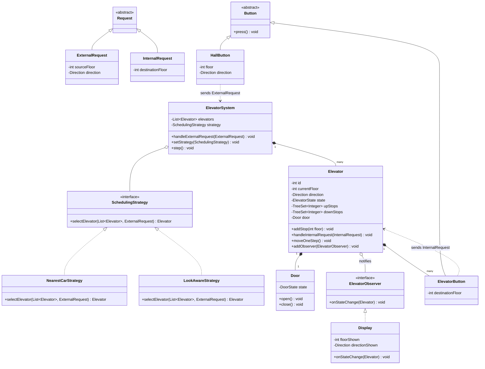
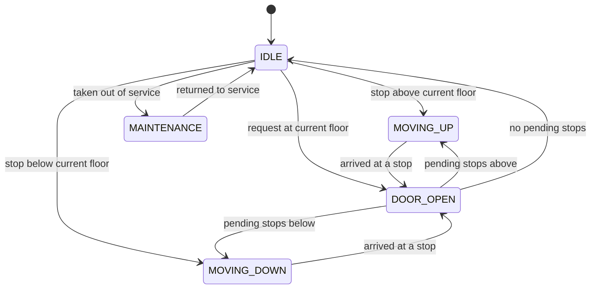

# Design an Elevator System

The elevator problem is the canonical **State + Strategy** LLD question. Interviewers use it
to test three things: can you model a non-trivial state machine cleanly, can you separate a
pluggable scheduling algorithm from the machinery that executes it, and can you reason about
two different kinds of requests (hall calls vs. cabin calls) flowing into one system. It is
also a favorite because the "now add X" follow-ups (VIP mode, weight limit, emergency stop)
immediately expose whether the design is extensible or a pile of `if-else`.

> [!INTERVIEW]
> In a 45–60 minute round, budget roughly: 5 min requirements, 10 min entities + class
> diagram, 10 min the single-elevator state machine, 10 min dispatching strategy, 15 min
> code skeleton + follow-ups. The state machine and the dispatcher are where the signal is —
> don't burn time modeling the `Door` in loving detail.

## Requirements Clarification

Never start drawing classes before scoping. Good questions for the first five minutes:

**Functional scope**
- How many elevators and floors? (Typical answer: *N* elevators, *M* floors — design for
  multiple elevators; a single-elevator design misses the dispatching half of the problem.)
- Two request types, confirm both are in scope:
  - **External (hall) request** — pressed on a floor: `(floor, direction)`. The user says
    "I am on floor 5 and want to go UP"; they do *not* choose an elevator.
  - **Internal (cabin) request** — pressed inside a car: `(destinationFloor)`. It is bound
    to that specific elevator.
- What scheduling behavior is expected? Usually "reasonable and pluggable" — implement one
  algorithm (LOOK / nearest-car) behind an interface, and be able to discuss alternatives.
- Do doors, displays, and buttons need to be modeled? Model them lightly (they demonstrate
  composition and Observer) but keep the depth in the controller and the car.

**Scope OUT (say it explicitly)**
- Physical/embedded concerns: motor control, door sensors, firmware timing.
- Multi-building or cloud fleet management — that's HLD; this design is one building, one
  process (see the system-design domain for the distributed version).
- Persistence: requests live in memory; a real system's audit log is out of scope.

**Non-functional expectations worth stating**
- Fairness: no request starves (LOOK guarantees this; pure shortest-seek does not).
- Thread safety: hall buttons on many floors can be pressed simultaneously.
- Extensibility: new scheduling policies and elevator modes without rewriting the core.

> [!TIP]
> Saying "external requests carry a direction, internal requests carry a destination" in the
> first five minutes is a strong signal — the two-request-type split drives the whole design.

## Core Objects and Entities

Identify the nouns and give each a single responsibility:

| Class | Responsibility |
|---|---|
| `ElevatorSystem` / `ElevatorController` | Facade + dispatcher. Receives hall requests, asks the `SchedulingStrategy` to pick a car, forwards the request. Owns the list of elevators. |
| `Elevator` (car) | Holds its own state (`ElevatorState`), current floor, direction, and its **stop set**. Executes movement steps; decides *its own* next stop. |
| `Request` | Value object. `ExternalRequest(sourceFloor, direction)` and `InternalRequest(destinationFloor)` — both can implement/extend a common `Request` abstraction. |
| `SchedulingStrategy` (interface) | Given an external request + fleet state, choose the best elevator. Implementations: `NearestCarStrategy`, `LookStrategy` variants. |
| `Door` | Owned by `Elevator` (composition). `open()` / `close()`; guards "never move with door open". |
| `Display` | Observer of an elevator: shows current floor + direction. One inside the cabin, one per floor. |
| `Button` (abstract) → `HallButton(floor, direction)`, `ElevatorButton(destinationFloor)` | Translates a press into a `Request` and hands it to the controller / car. Buttons **don't** contain scheduling logic. |
| `Floor` | Mostly a container for hall buttons/display; often skimmed in interviews. |

Key relationship calls to make out loud:
- `ElevatorSystem` **composes** `Elevator`s; each `Elevator` **composes** its `Door` and
  its `ElevatorButton` panel (parts don't outlive the whole).
- `ElevatorSystem` **holds a** `SchedulingStrategy` (aggregation — swappable at runtime).
- `Display` **observes** `Elevator` — the car doesn't know how many displays exist.

> [!KEY-TAKEAWAY]
> The controller decides **which elevator** serves a hall call (inter-elevator decision).
> The elevator decides **which of its own stops** to serve next (intra-elevator decision).
> Splitting these two decisions is the single most important structural choice in this design.

## Class Diagram



Interview-grade, not enterprise-grade: no `ElevatorFactoryProviderBean`, no persistence
layer. Every box earns its place by owning one responsibility.

## Elevator State Machine

Each car is a small finite-state machine. Enumerate the states and the *legal* transitions —
interviewers probe illegal ones ("can it go from MOVING_UP straight to MOVING_DOWN?").



Rules the state machine enforces:
- **You never transition `MOVING_UP` → `MOVING_DOWN` directly.** A direction reversal always
  passes through a stop (`DOOR_OPEN`) or `IDLE`. This mirrors physics and simplifies invariants.
- **The car never moves while `DOOR_OPEN`.** The `Door` composition plus the state check make
  "moving with open doors" unrepresentable rather than merely discouraged.
- `MAINTENANCE` (and `EMERGENCY`) are entered only from safe states and cause the car to stop
  accepting new requests; existing hall requests get re-dispatched to other cars.

Why the **State pattern** (or at minimum an explicit `enum` + `switch` with a single
transition function) instead of scattered booleans (`isMoving`, `isDoorOpen`, `goingUp`):
three booleans give 8 combinations of which several are nonsense (moving + door open). An
explicit state type makes invalid states unrepresentable and gives each state its own
behavior for "what do I do on the next tick?".

> [!WARNING]
> A common failure mode is putting transition logic in *callers* ("button sets
> `elevator.state = MOVING_UP`"). All transitions must go through the elevator's own methods
> so invariants (door closed before moving) are checked in exactly one place.

## Key Design Decisions and Patterns

Name the pattern, then justify it against the requirement (cross-references go to the
`dp-*` topics — don't re-teach the pattern):

1. **Strategy — scheduling/dispatching.** "Which elevator serves this hall call?" is a policy
   that varies (nearest car, LOOK-aware cost, zoned, VIP-priority) while the surrounding
   machinery (queues, state machine, movement) is stable. Varying policy behind
   `SchedulingStrategy` means a new algorithm is a new class — the controller is closed for
   modification, open for extension (OCP). An `if (algorithm == ...)` chain inside the
   controller fails the "now add destination-dispatch" follow-up.
2. **State — per-elevator behavior.** IDLE / MOVING_UP / MOVING_DOWN / DOOR_OPEN each answer
   "what happens on the next tick?" differently. See the state-machine section above.
3. **Observer — displays and monitoring.** The elevator emits `onStateChange`; cabin display,
   per-floor displays, and (later) a monitoring dashboard subscribe. The car stays decoupled
   from how many views exist — adding a fifth display touches zero elevator code.
4. **Singleton (use with care) — the controller.** One building has one dispatcher, so
   `ElevatorSystem` is often a singleton. Say the caveat out loud: prefer a single instance
   created at composition root over a hard `getInstance()` everywhere, for testability.
5. **Command (optional mention)** — a button press *is* a command object (`Request`); queuing
   requests is queuing commands. Worth naming, not worth ceremony.

Decisions that are *data structures*, not patterns:
- Each elevator keeps two sorted stop sets: `upStops` (ascending `TreeSet`) and `downStops`
  (descending). "Next stop while moving up" = `upStops.ceiling(currentFloor)` — O(log n),
  and duplicate presses of the same floor collapse for free (it's a set).
- A plain FIFO queue of floors is the classic wrong choice: an elevator at floor 1 with FIFO
  requests [9, 2, 8, 3] yo-yos; sorted stop sets + LOOK visit 2, 3, 8, 9 in one sweep.

## Dispatching Algorithms: SCAN, LOOK, Nearest Car

Two separate scheduling questions — keep them distinct in your answer:

**(a) Single car: in what order do I serve my own stops?**
- **SCAN ("elevator algorithm")** — travel in the current direction servicing stops until the
  *end of the shaft*, then reverse. Simple, fair, but wastes travel to the top/bottom when no
  one is there.
- **LOOK** — the practical refinement: travel in the current direction only as far as the
  *last pending stop* in that direction, then reverse (or idle). Same fairness, less wasted
  travel. **LOOK is the expected default answer.**
- Why not FCFS? Order [9, 2, 8] from floor 1 costs 8+7+6=21 floors under FCFS vs. 2→8→9 = 8
  floors under LOOK. Why not always-nearest (SSTF-style)? A car near busy middle floors
  can starve a request at floor 20 indefinitely; LOOK's sweep guarantees eventual service.

Direction-pickup rule that makes LOOK correct for hall calls: a car moving UP picks up a hall
call at floor *f* only if *f* is **ahead of it** and the call's direction is **UP**. A DOWN
hall call at a floor above gets queued for the reverse sweep — otherwise passengers board a
car going the wrong way.

**(b) Fleet: which car gets a new hall call?** (`SchedulingStrategy`)
- **Nearest car** — `min |currentFloor - requestFloor|` over all cars. Easy but
  direction-blind: a car 1 floor away moving *away* is worse than a car 3 floors away moving
  toward you.
- **Nearest car with direction awareness (the industry-classic cost function)** — score each
  car: best = moving toward the call *and* same direction as the call wants; next = moving
  toward the call, opposite desired direction (will serve on reverse sweep); idle cars score
  by distance; worst = moving away. Pick the max/least-cost car. This is the strongest
  ~10-line answer.
- **Zoning / sector** — assign floor ranges to cars (lobby-heavy buildings). Mention it.
- **Destination dispatch** — passengers enter the destination *at the hall panel*, system
  groups riders by destination and assigns a car before boarding. Modern high-rises; great
  extensibility answer since it's *just another* `SchedulingStrategy` + a richer
  `ExternalRequest`.

> [!INTERVIEW]
> Common probe: "Your nearest-car strategy sends every request to the same busy elevator —
> fix it." Answer: add load (pending-stop count) into the cost function — a strategy-local
> change; no controller or elevator code is touched. That's the Strategy payoff, stated.

## API and Method Signatures

The public surface a caller (buttons, simulation loop, tests) sees:

```java
// External entry points
public interface ElevatorSystemApi {
    void requestElevator(int floor, Direction direction);   // hall call
    void requestFloor(int elevatorId, int destinationFloor);// cabin call
    ElevatorStatus getStatus(int elevatorId);                // floor, direction, state
    void setSchedulingStrategy(SchedulingStrategy strategy);
    void setMode(int elevatorId, ElevatorMode mode);         // NORMAL, MAINTENANCE, EMERGENCY
}

// Strategy contract — pure function of fleet state + request
public interface SchedulingStrategy {
    Elevator selectElevator(List<Elevator> elevators, ExternalRequest request);
}

// Elevator's own surface (used by the controller and the tick loop)
public class Elevator {
    public void addStop(int floor) { ... }        // idempotent (set semantics)
    public void moveOneStep() { ... }             // advance the state machine one tick
    public int  getCurrentFloor() { ... }
    public Direction getDirection() { ... }
    public ElevatorState getState() { ... }
    public int  pendingStopCount() { ... }        // used by load-aware strategies
    public void addObserver(ElevatorObserver o) { ... }
}
```

Signature choices worth narrating:
- `requestElevator` takes `(floor, direction)` — **not** an elevator id; riders don't pick cars.
- `requestFloor` takes an elevator id (or is a method *on* the car) — a cabin button is
  physically bound to one car.
- `selectElevator` receives the **fleet list**, so strategies can weigh load and direction
  without the controller pre-chewing the data.
- A `moveOneStep()` tick method makes the design testable/simulatable without threads or
  timers — call it in a loop and assert floor sequences.

## Code Skeleton

Enough Java to show the structure — in the interview, write this level of detail, not more:

```java
enum Direction { UP, DOWN, NONE }
enum ElevatorState { IDLE, MOVING_UP, MOVING_DOWN, DOOR_OPEN, MAINTENANCE }

record ExternalRequest(int sourceFloor, Direction direction) {}
record InternalRequest(int destinationFloor) {}

interface SchedulingStrategy {
    Elevator selectElevator(List<Elevator> elevators, ExternalRequest req);
}

class NearestCarStrategy implements SchedulingStrategy {
    public Elevator selectElevator(List<Elevator> cars, ExternalRequest req) {
        return cars.stream()
            .filter(e -> e.getState() != ElevatorState.MAINTENANCE)
            .min(Comparator.comparingInt(e -> cost(e, req)))
            .orElseThrow(NoElevatorAvailableException::new);
    }
    private int cost(Elevator e, ExternalRequest req) {
        int d = Math.abs(e.getCurrentFloor() - req.sourceFloor());
        if (e.getState() == ElevatorState.IDLE) return d;
        boolean toward =
            (e.getDirection() == Direction.UP   && req.sourceFloor() >= e.getCurrentFloor()) ||
            (e.getDirection() == Direction.DOWN && req.sourceFloor() <= e.getCurrentFloor());
        if (toward && e.getDirection() == req.direction()) return d;      // best
        if (toward) return d + PENALTY_WRONG_DIR;                         // reverse-sweep pickup
        return d + PENALTY_MOVING_AWAY;                                   // worst
    }
}

class Elevator {
    private final int id;
    private int currentFloor = 0;
    private ElevatorState state = ElevatorState.IDLE;
    private Direction direction = Direction.NONE;   // committed travel direction (survives DOOR_OPEN)
    private final NavigableSet<Integer> upStops   = new TreeSet<>();
    private final NavigableSet<Integer> downStops = new TreeSet<>(Comparator.reverseOrder());
    private final Door door = new Door();
    private final List<ElevatorObserver> observers = new CopyOnWriteArrayList<>();

    // Cabin call: no desired direction, bucket purely by geometry.
    public synchronized void addStop(int floor) { addStop(floor, Direction.NONE); }

    // Hall call: callDir is the rider's desired direction (UP/DOWN); NONE = cabin call.
    public synchronized void addStop(int floor, Direction callDir) {
        if (floor == currentFloor) { openDoor(); return; }   // request for the current floor
        // A cabin call goes to the sweep its geometry implies. A hall call must go to the
        // sweep whose *direction matches the rider's* so nobody boards a car going the wrong
        // way (the LOOK-correctness rule). The tricky case — a DOWN call ABOVE the car (or an
        // UP call BELOW it) — cannot just be dropped into downStops/upStops here, because the
        // car would never reach it on that sweep; a production controller first routes the car
        // to that floor on the current sweep, then serves it on the reverse sweep. This
        // skeleton handles the common in-line cases; see the note below for the reverse-sweep case.
        boolean servesUp = (callDir == Direction.NONE) ? floor > currentFloor
                                                       : callDir == Direction.UP;
        if (servesUp) upStops.add(floor); else downStops.add(floor);
        if (state == ElevatorState.IDLE) chooseDirection();
    }

    /** One tick of the state machine — drives all movement. */
    public synchronized void moveOneStep() {
        switch (state) {
            case MOVING_UP -> {
                currentFloor++;
                if (upStops.contains(currentFloor)) { upStops.remove(currentFloor); openDoor(); }
            }
            case MOVING_DOWN -> {
                currentFloor--;
                if (downStops.contains(currentFloor)) { downStops.remove(currentFloor); openDoor(); }
            }
            case DOOR_OPEN -> { door.close(); chooseDirection(); }   // LOOK: keep going or reverse
            case IDLE, MAINTENANCE -> { /* nothing to do */ }
        }
        notifyObservers();
    }

    private void chooseDirection() {   // LOOK policy lives here
        // Consult the *committed* direction, NOT state: when we call this from DOOR_OPEN we
        // must remember which way we were travelling and finish that sweep before reversing.
        // (A car that arrived at a stop while going UP must keep going UP while upStops has
        // floors ahead — reversing here would yo-yo, the exact bug LOOK exists to prevent.)
        boolean preferUp = (direction != Direction.DOWN);   // UP or NONE -> exhaust up first
        if (preferUp) {
            if (!upStops.isEmpty())   { state = ElevatorState.MOVING_UP;   direction = Direction.UP;   return; }
            if (!downStops.isEmpty()) { state = ElevatorState.MOVING_DOWN; direction = Direction.DOWN; return; }
        } else {
            if (!downStops.isEmpty()) { state = ElevatorState.MOVING_DOWN; direction = Direction.DOWN; return; }
            if (!upStops.isEmpty())   { state = ElevatorState.MOVING_UP;   direction = Direction.UP;   return; }
        }
        state = ElevatorState.IDLE;
        direction = Direction.NONE;
    }

    public Direction getDirection() { return direction; }

    // Note: openDoor() deliberately leaves `direction` untouched so a stop reached mid-sweep
    // remembers where it was heading; only chooseDirection() may change the committed direction.
    private void openDoor() { door.open(); state = ElevatorState.DOOR_OPEN; }
    private void notifyObservers() { observers.forEach(o -> o.onStateChange(this)); }
}

class ElevatorSystem {
    private final List<Elevator> elevators;
    private volatile SchedulingStrategy strategy;   // swappable at runtime

    public void requestElevator(int floor, Direction dir) {
        Elevator chosen = strategy.selectElevator(elevators, new ExternalRequest(floor, dir));
        chosen.addStop(floor, dir);          // pass desired direction so LOOK routes the sweep
    }
    public void requestFloor(int elevatorId, int destination) {
        elevatorById(elevatorId).addStop(destination);
    }
    public void step() { elevators.forEach(Elevator::moveOneStep); }  // simulation tick
}
```

Points to narrate while writing it:
- `chooseDirection()` **is** LOOK: exhaust the current direction's stop set, then flip.
- `addStop` is where hall calls and cabin calls converge — after dispatch, the elevator
  treats them identically (a stop is a stop). That collapse keeps the car simple.
- The tick (`moveOneStep`) design means no threads are needed to demo correctness.

## Concurrency and Edge Cases

**Concurrency** (buttons on 40 floors are pressed simultaneously):
- Mutable state per elevator (`currentFloor`, stop sets, `state`) is guarded by
  `synchronized` on the elevator's own monitor — coarse-grained but correct, and per-elevator
  locks mean cars don't contend with each other. Say: "lock per elevator, not one global lock."
- **Check-then-act race in dispatch:** the strategy reads fleet state, picks car 2, and by the
  time `addStop` runs, car 2 has moved past the floor. Options: (a) accept it — the car will
  still serve the stop on its reverse sweep (LOOK guarantees service, just later), or
  (b) route all dispatch decisions through a single dispatcher thread consuming a
  `BlockingQueue<Request>` — serializing decisions removes the race entirely. Naming the
  queue-based dispatcher is a senior-level answer.
- Observer list uses `CopyOnWriteArrayList` so a display subscribing mid-notification doesn't
  throw `ConcurrentModificationException`.
- Duplicate presses (everyone mashes "7") are naturally idempotent because stops are a *set*.

**Edge cases to volunteer before being asked**
- Request for the floor the car is already on → open the door, no movement (see `addStop`).
- Invalid floor (below ground / above top) → validate at the API boundary, reject early.
- All elevators in `MAINTENANCE` → `NoElevatorAvailableException` or queue the request until
  a car returns; don't NPE.
- Direction reversal is only decided at `DOOR_OPEN`/`IDLE` — prevents thrashing when opposing
  requests arrive mid-flight.
- Emergency stop: transition to an `EMERGENCY` state that clears stop sets, moves to the
  nearest floor, opens doors, and rejects new requests — a new state, not booleans sprinkled
  through the movement code.

## Extensibility

The follow-ups, and why the design absorbs them:

| "Now add..." | Change required |
|---|---|
| **New dispatch policy** (zoned, destination dispatch, load-aware) | New `SchedulingStrategy` implementation. Zero changes to controller or elevator. |
| **VIP / express elevator** | Two composable moves: a `VipRequest` subtype carrying priority, and either a priority-aware strategy (VIP calls only match designated cars) or a priority queue of pending hall calls. Cars themselves are unchanged. |
| **Weight limit** | Elevator gets a `WeightSensor` (composition); `DOOR_OPEN → MOVING_*` transition is guarded by `sensor.withinLimit()` — an overloaded car refuses to close/move and re-emits its hall call for redispatch. |
| **Maintenance mode** | Already a state: car drains internal stops, controller's strategies filter out `MAINTENANCE` cars (one `filter` line, already in the skeleton). |
| **Emergency / fire mode** | New state + a controller-level `setMode` broadcast: all cars go to ground floor, doors open. The Observer channel doubles as the monitoring feed. |
| **Monitoring dashboard** | One more `ElevatorObserver`. No elevator changes. |
| **"Scale to a campus of 50 buildings"** | Explicitly an HLD question — controller-per-building, coordination service above; keep the LLD answer single-building and point at the system-design domain. |

> [!KEY-TAKEAWAY]
> Notice the pattern in the table: every extension lands in exactly one of the three seams
> you built — a new `Strategy`, a new `State`, or a new `Observer`. If a follow-up forces you
> to edit `moveOneStep()`, the seams were in the wrong place.

## Common Interview Follow-ups

1. **"Why Strategy for scheduling instead of a method with `switch(algorithmType)`?"** —
   New policy = new class vs. editing tested dispatch code; strategies unit-test in isolation
   with fake fleets; runtime swap (rush-hour policy 8–10 am) is a setter call. (OCP in action.)
2. **"Why can't the elevator go straight from MOVING_UP to MOVING_DOWN?"** — Reversal without
   stopping is physically meaningless and creates thrash; funneling reversals through
   `DOOR_OPEN`/`IDLE` gives one place (`chooseDirection`) where the LOOK decision lives.
3. **"Nearest-car keeps starving floor 20 during lunch rush — fix it."** — Add wait-time aging
   to the cost function (requests gain priority as they age) or switch to a LOOK-sweep
   assignment; either is a strategy-local change.
4. **"Add destination dispatch."** — Richer `ExternalRequest` (destination at the hall panel),
   a grouping `SchedulingStrategy`, and hall displays that announce the assigned car (Observer).
   Core car logic unchanged.
5. **"Two people on different floors press UP at the same instant — walk me through it."** —
   Two threads enter `requestElevator`; dispatch is either serialized via the dispatcher queue
   or each strategy call reads a consistent-enough snapshot; both `addStop` calls are
   per-elevator synchronized; worst case is a mildly suboptimal assignment, never a lost request.
6. **"How would you test this?"** — The tick design: script button presses, call `step()` in a
   loop, assert the visited-floor sequence. Strategies get pure unit tests (fleet in, car out).
   No sleeps, no threads in tests.
7. **"What if an elevator breaks down mid-trip with passengers' requests queued?"** — Car enters
   `MAINTENANCE`/`FAULT`, its unserved *hall* calls are re-emitted to the controller for
   redispatch; internal (cabin) requests can't be transferred — the car must reach the nearest
   floor and open. Distinguishing the two request types again pays off.

## References

- Grokking the Object-Oriented Design Interview — "Design an Elevator System" chapter.
- *Head First Design Patterns* (Freeman & Robson) — State, Strategy, Observer chapters.
- Operating-systems disk-scheduling literature — SCAN/LOOK/SSTF (the elevator algorithm's
  namesake) for the fairness-vs-throughput trade-off.
- The Elevator Saga game (play.elevatorsaga.com) — hands-on scheduling-policy intuition.
- Related topics in this library: `dp-strategy`, `dp-state`, `dp-observer`, `dp-singleton`
  (pattern mechanics), `solid-principles` (OCP/SRP framing), and the system-design domain
  for building-fleet scale-out.
