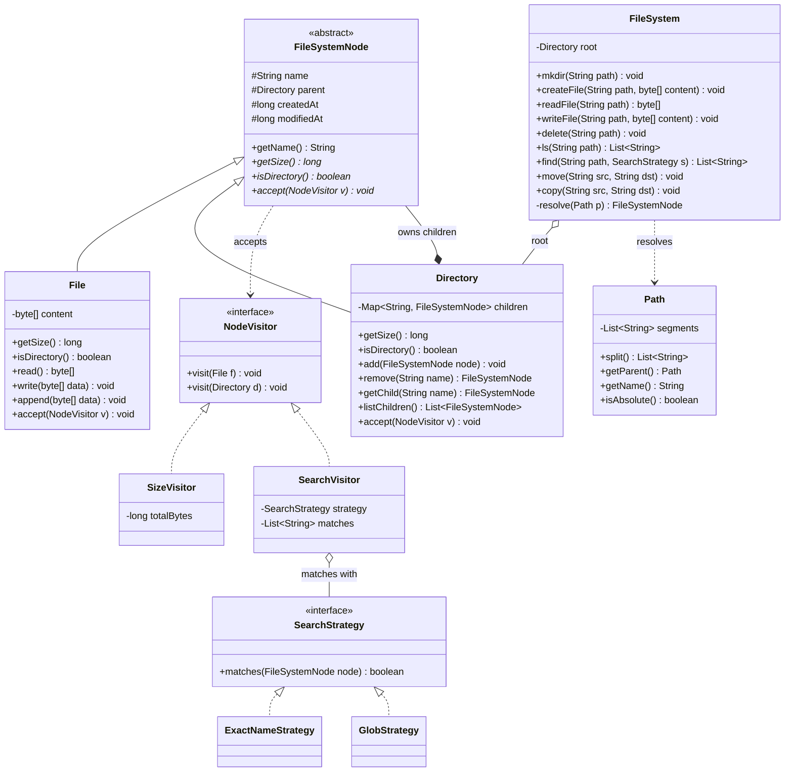

# Design an In-Memory File System

This is the canonical **Composite pattern** problem. A file system is a tree: directories
contain files and other directories, arbitrarily nested. The interviewer is checking one
thing above all — can you see that a `File` (a leaf) and a `Directory` (a container) should
share a **single common type** so that operations like `getSize()`, `delete()`, and
`search()` recurse uniformly over the tree, and client code never has to ask "am I holding
a file or a folder?"

The DSA skill here is tree recursion (cross-ref `dsa-coding` trees). The LLD skill is
wrapping that recursion in a clean type hierarchy — Composite for structure, plus Iterator,
Visitor, and Strategy for traversal, operations, and matching. Keep it single-machine and
in-memory; the moment "distributed / durable" comes up, that is an HLD concern
(cross-ref `system-design`).

## Requirements Clarification

Spend the first five minutes fixing scope. Good clarifying questions:

- **Path model** — absolute paths only (`/a/b/c`), or relative paths + a "current working
  directory" too? (Interview default: absolute paths, with a `cwd` as an optional extension.)
- **Node types** — files and directories only, or also symbolic links / hard links / mount
  points? (Start with files + directories; symlinks are a classic follow-up.)
- **File content model** — bytes, a `String`, or an append-only stream? (Default: a `byte[]`
  or `String` buffer held in memory; content size drives `getSize()`.)
- **Core operations** — `mkdir`, `createFile`, `readFile`, `writeFile`/`appendFile`,
  `delete`, `ls`, `find`/search, `move`, `copy`. Confirm which are in scope.
- **Overwrite / create semantics** — does `createFile` on an existing path fail, or
  truncate? Does `mkdir -p` create intermediate directories? (State your choice.)
- **Metadata** — do we need timestamps, owner, permissions, size? (Start with size + name;
  permissions and timestamps are extensions.)
- **Search semantics** — exact name, substring, or glob/wildcard (`*.txt`)? Recursive?
- **Concurrency** — single-threaded first; then discuss locking on the tree as a follow-up.
- **Capacity / quotas** — bounded total size? (Usually out of scope; mention as an extension.)
- **Persistence / distribution** — explicitly **out of scope**. A durable, replicated,
  networked file system (HDFS, S3, NFS) is an HLD problem. Keep this in-process.

Scoping statement to say out loud: *"I'll build an in-memory hierarchical file system —
files and directories under a single root, absolute-path operations (mkdir, create/read/write,
ls, find, move, copy), size computed by recursing the tree, single-threaded first, and I'll
show where symlinks, permissions, and thread safety bolt on."*

## Use-Cases and Actors

The single actor is a **client / shell** (a user typing commands, or a program calling the
API). The facade they talk to is the `FileSystem` object. Primary use-cases:

- **Navigate & list** — `ls(path)` returns the names of a directory's children.
- **Create structure** — `mkdir(path)`, `createFile(path, content)`.
- **Read & modify content** — `readFile(path)`, `writeFile(path, content)`,
  `appendFile(path, more)`.
- **Remove** — `delete(path)` (a directory delete recurses over its subtree).
- **Search** — `find(path, pattern)` walks the subtree and returns matches.
- **Reorganize** — `move(src, dst)`, `copy(src, dst)`.

The Grokking-style UML-first approach: sketch these as the public methods of `FileSystem`
first, then discover the objects that must exist behind them. Every use-case above resolves
a path to a node, then does something to that node — so **path resolution** is the workhorse
that nearly every operation shares.

## Noun / Verb Object Identification

Pull candidate classes from the **nouns** and candidate methods from the **verbs** in the
requirements, then **filter** — not every noun becomes a class.

**Nouns → candidate classes:**

| Noun | Verdict | Reasoning |
|---|---|---|
| File system | ✅ `FileSystem` | The facade / entry point clients call. |
| File | ✅ `File` | Leaf node: name + content + size. |
| Directory / folder | ✅ `Directory` | Composite node: holds children. |
| Node / entry | ✅ `FileSystemNode` | **The key abstraction** — common supertype of File & Directory (the Composite *Component*). |
| Path | ✅ `Path` | Value object: parses/splits `/a/b/c`, knows parent & basename. |
| Content | ➖ field | Content is a `byte[]`/`String` **field of `File`**, not its own class (unless you add versioning/streams). |
| Name | ➖ field | A `String` field of the node. |
| Size | ➖ derived | Computed, not stored on directories (a directory's size is the sum of children). |
| Permission / owner / timestamp | ➖ defer | Metadata — group into a `Metadata` object only when the follow-up demands it. |
| Root | ➖ instance | The root is just a `Directory` instance named `/`, not a new class. |

**Verbs → candidate methods:** *make directory* → `mkdir`; *create/read/write/append* →
`createFile`/`readFile`/`writeFile`/`appendFile`; *delete* → `delete`; *list* → `ls`;
*find/search* → `find`; *move* → `move`; *copy* → `copy`; *get size* → `getSize`;
*resolve a path* → `resolve` (internal helper).

The filtering insight to voice: **"Content" and "Name" are attributes, not classes** — a
common junior mistake is making a class for every noun. The genuinely load-bearing discovery
is `FileSystemNode` as the shared abstraction; without it you end up with `if (isDirectory)`
branches smeared through every operation.

## Responsibilities and Relationships

CRC-style — what each type **knows** and **does**, plus its collaborators:

| Type | Knows (state) | Does (behavior) | Collaborators |
|---|---|---|---|
| `FileSystemNode` (abstract) | name, parent, created/modified time | `getSize()`, `getName()`, `isDirectory()`, `accept(visitor)` — abstract contract | is realized by File & Directory |
| `File` | content (`byte[]`) | `getSize()` = content length; `read()`, `write()`, `append()` | held by a Directory |
| `Directory` | `Map<String, FileSystemNode> children` | `getSize()` = Σ children sizes (recurse); `add`, `remove`, `getChild`, `listChildren` | contains many `FileSystemNode` |
| `Path` | the raw path string / segment list | `split()`, `getParent()`, `getName()`, `isAbsolute()` | used by FileSystem |
| `FileSystem` | the `root` directory | `mkdir`, `createFile`, `read/write`, `ls`, `find`, `move`, `copy`; **resolves paths** | owns root; uses Path; drives Visitors |
| `NodeVisitor` (interface) | — | `visit(File)`, `visit(Directory)` — an operation over the tree | implemented by size/search visitors |
| `SearchStrategy` (interface) | — | `matches(FileSystemNode)` — pluggable matching | used by find/search |

Key relationships to state explicitly:

- **`Directory` composes its children** (`Directory *-- FileSystemNode`) — **composition**,
  not aggregation: children have no independent life; deleting a directory deletes its whole
  subtree. The children are *owned*.
- **`File` and `Directory` extend `FileSystemNode`** (`--|>` generalization — it is an
  abstract class, not an interface, so this is inheritance, not `..|>` realization) — the Composite relationship.
  A `Directory`'s child list is typed as `FileSystemNode`, so it holds files and subdirectories
  uniformly.
- **`FileSystem` aggregates the root** (`o--`) and **depends on `Path`** (`..>`) as a
  transient parameter.
- **Multiplicity:** a `Directory` has `0..*` children; every non-root node has exactly `1`
  parent; the tree has exactly `1` root.

The anti-pattern to name: separate `List<File> files` and `List<Directory> dirs` on
`Directory`, forcing every operation to loop twice and special-case each. One
`Map<String, FileSystemNode>` is the Composite payoff.

## Class Diagram



Interview-grade calibration: this is ~10 types. The Composite core (`FileSystemNode`,
`File`, `Directory`) plus `FileSystem` + `Path` is the minimum viable design; the Visitor
and Strategy families are what you add when the interviewer pushes on "operations without
touching node classes" and "pluggable search."

## Key Design Decisions and Patterns

Name each GoF pattern by intent and say *why* — cross-ref `dp-*` for the mechanics; do not
re-teach the pattern from scratch.

**1. Composite (Structural — the star).** `FileSystemNode` is the *Component*, `File` the
*Leaf*, `Directory` the *Composite* that holds a `List`/`Map` of `FileSystemNode`. This lets
client code treat individual files and whole subtrees **uniformly** — `getSize()`,
`delete()`, and `accept(visitor)` are declared once on the component and recurse through
directories. Without Composite you get `instanceof` ladders everywhere. See `dp-composite`.

*The classic Composite tension:* should child-management methods (`add`, `remove`,
`getChild`) live on the `FileSystemNode` component (GoF's **transparency** — uniform
interface, but `File.add()` is meaningless and must throw) or only on `Directory` (GoF's
**safety** — no nonsensical calls, but clients must downcast to add children)? For a file
system, **safety** is the cleaner choice: `add`/`remove` live on `Directory`, because "add a
child to a file" is a genuine type error you *want* the compiler to catch. State this
trade-off explicitly — it is a favorite interviewer probe.

**2. A directory's size is derived, not stored.** `Directory.getSize()` sums
`child.getSize()` recursively; `File.getSize()` returns content length. Storing a cached
size on directories introduces an invariant to maintain on every write/delete/move — mention
caching (with dirty-propagation up to the root) only as an optimization follow-up.

**3. Visitor (Behavioral) for operations over the tree.** Size calculation, search,
permission audits, "print tree" — these are *operations* that vary independently of the node
*structure*. Baking each new operation as a method on `FileSystemNode` bloats the node classes
and reopens them for every new operation (Open-Closed violation). A `NodeVisitor` with
`visit(File)` / `visit(Directory)` lets you add operations as new visitor classes without
touching `File`/`Directory`. Trade-off: Visitor makes adding *operations* easy but adding
new *node types* hard (every visitor must gain a method) — acceptable here because node types
are stable (files & dirs) while operations proliferate. See `dp-visitor`.

**4. Strategy (Behavioral) for search/matching.** `find` should support exact-name,
substring, and glob (`*.txt`) matching without an `if (mode == GLOB)...` chain. A
`SearchStrategy.matches(node)` interface makes each matcher a swappable class. See
`dp-strategy`.

**5. Iterator (Behavioral) for traversal.** Expose tree traversal (DFS/BFS) as an `Iterator`
so clients walk the tree without knowing it is a tree of `Map`s — and so DFS vs BFS is a
swappable choice. This decouples "how to traverse" from "what to do at each node." See
`dp-iterator`.

**6. `FileSystem` as a Facade.** Clients call one object with path-string methods; it hides
path parsing, tree walking, and node wiring. This keeps the recursion and the Composite
internals off the client's plate.

**7. Path as a value object.** Parsing `/a/b/c` (split on `/`, drop empties, resolve `.`/`..`)
is its own responsibility. A `Path` value object keeps string-munging out of `FileSystem`'s
operation logic and is trivially unit-testable.

**8. Path resolution is the shared workhorse.** Almost every operation is "split the path,
walk from root segment by segment, act on the final node." Implement `resolve(path)` once
and reuse it — do not re-inline the walk in `mkdir`, `read`, `delete`, etc.

## API and Method Signatures

```java
public abstract class FileSystemNode {
    protected String name;
    protected Directory parent;
    protected long createdAt;
    protected long modifiedAt;

    public String getName() { return name; }
    public abstract long getSize();
    public abstract boolean isDirectory();
    public abstract void accept(NodeVisitor visitor);   // Visitor hook
}

public interface NodeVisitor {
    void visit(File file);
    void visit(Directory directory);
}

public interface SearchStrategy {
    boolean matches(FileSystemNode node);
}

public class FileSystem {
    public void mkdir(String path);                     // create dir (+ parents optional)
    public void createFile(String path, byte[] content);
    public byte[] readFile(String path);
    public void writeFile(String path, byte[] content); // overwrite
    public void appendFile(String path, byte[] more);
    public void delete(String path);                    // recurses for directories
    public List<String> ls(String path);                // children names
    public List<String> find(String path, SearchStrategy strategy);
    public void move(String src, String dst);
    public void copy(String src, String dst);
}
```

Contract subtleties worth saying out loud:

- `getSize()` on a `Directory` **recurses**; on a `File` it returns content length. Same
  method name, polymorphic behavior — that is the Composite payoff.
- `delete` on a directory removes the **entire subtree** (composition = cascading delete).
- `resolve(path)` is a private helper returning the target node (or signaling "not found");
  every public method funnels through it.
- `ls` returns names (or lightweight entries), not the node objects, to avoid leaking
  internal references clients could mutate.
- `find` must return **full/absolute paths**, not bare names. `ls` is scoped to one
  directory so a bare name is unambiguous, but `find` spans the whole subtree, where the
  same name can occur in different directories (two `config.txt`); returning `/a/config.txt`
  vs `/b/config.txt` is what a follow-up open/delete needs to act on.

## Code Skeleton

Enough structure to show the design — in the interview, write this level, not a full
implementation.

```java
// ---- Composite: Component ----
public abstract class FileSystemNode {
    protected String name;
    protected Directory parent;
    protected long createdAt = System.currentTimeMillis();
    protected long modifiedAt = createdAt;

    protected FileSystemNode(String name) { this.name = name; }

    public String getName() { return name; }
    public abstract long getSize();
    public abstract boolean isDirectory();
    public abstract void accept(NodeVisitor visitor);
}

// ---- Composite: Leaf ----
public class File extends FileSystemNode {
    private byte[] content;

    public File(String name, byte[] content) {
        super(name);
        this.content = content == null ? new byte[0] : content;
    }

    @Override public long getSize() { return content.length; }
    @Override public boolean isDirectory() { return false; }
    @Override public void accept(NodeVisitor v) { v.visit(this); }

    public byte[] read() { return content; }
    public void write(byte[] data) { this.content = data; touch(); }
    public void append(byte[] more) {
        byte[] merged = new byte[content.length + more.length];
        System.arraycopy(content, 0, merged, 0, content.length);
        System.arraycopy(more, 0, merged, content.length, more.length);
        this.content = merged; touch();
    }
    private void touch() { modifiedAt = System.currentTimeMillis(); }
}

// ---- Composite: Composite ----
public class Directory extends FileSystemNode {
    private final Map<String, FileSystemNode> children = new HashMap<>();

    public Directory(String name) { super(name); }

    @Override
    public long getSize() {                       // recurse: sum of children
        long total = 0;
        for (FileSystemNode child : children.values()) total += child.getSize();
        return total;
    }
    @Override public boolean isDirectory() { return true; }

    @Override
    public void accept(NodeVisitor v) {
        v.visit(this);                            // visit self...
        for (FileSystemNode child : children.values()) child.accept(v); // ...then recurse
    }

    // child-management on Directory only (Composite "safety" variant)
    public void add(FileSystemNode node) {
        if (children.containsKey(node.getName()))
            throw new IllegalArgumentException("exists: " + node.getName());
        node.parent = this;
        children.put(node.getName(), node);
    }
    public FileSystemNode remove(String name) { return children.remove(name); }
    public FileSystemNode getChild(String name) { return children.get(name); }
    public List<FileSystemNode> listChildren() { return new ArrayList<>(children.values()); }
}
```

Path resolution — the shared workhorse — and a couple of operations built on it:

```java
public class FileSystem {
    private final Directory root = new Directory("/");

    /** Walk from root, segment by segment. Returns the target node or null. */
    private FileSystemNode resolve(String path) {
        FileSystemNode current = root;
        for (String segment : split(path)) {
            if (!(current instanceof Directory dir)) return null;   // path goes through a file
            current = dir.getChild(segment);
            if (current == null) return null;                       // missing segment
        }
        return current;
    }

    private List<String> split(String path) {
        List<String> parts = new ArrayList<>();
        for (String s : path.split("/")) if (!s.isEmpty()) parts.add(s);
        return parts;
    }

    public void mkdir(String path) {
        List<String> parts = split(path);
        Directory current = root;
        for (String segment : parts) {                              // create intermediates
            FileSystemNode next = current.getChild(segment);
            if (next == null) { Directory d = new Directory(segment); current.add(d); next = d; }
            if (!(next instanceof Directory dir))
                throw new IllegalStateException(segment + " is a file");
            current = dir;
        }
    }

    public byte[] readFile(String path) {
        FileSystemNode node = resolve(path);
        if (!(node instanceof File file)) throw new NoSuchElementException(path);
        return file.read();
    }

    public long getSize(String path) {
        FileSystemNode node = resolve(path);
        if (node == null) throw new NoSuchElementException(path);
        return node.getSize();                                      // polymorphic recursion
    }
}
```

Visitor + Strategy for search (added without touching File/Directory):

```java
public class SearchVisitor implements NodeVisitor {
    private final SearchStrategy strategy;
    private final List<String> matches = new ArrayList<>();
    public SearchVisitor(SearchStrategy strategy) { this.strategy = strategy; }

    @Override public void visit(File f)      { if (strategy.matches(f)) matches.add(fullPath(f)); }
    @Override public void visit(Directory d) { if (strategy.matches(d)) matches.add(fullPath(d)); }
    public List<String> getMatches() { return matches; }

    // find spans the whole subtree, so a bare name is ambiguous — two "config.txt"
    // in different directories would collide and be unusable for a follow-up
    // open/delete. Return the absolute path instead, rebuilt from the parent chain.
    private String fullPath(FileSystemNode node) {
        Deque<String> parts = new ArrayDeque<>();
        for (FileSystemNode n = node; n != null && n.parent != null; n = n.parent)
            parts.addFirst(n.getName());
        return "/" + String.join("/", parts);
    }
}

public class GlobStrategy implements SearchStrategy {   // e.g. "*.txt"
    private final Pattern regex;
    public GlobStrategy(String glob) {
        this.regex = Pattern.compile(glob.replace(".", "\\.").replace("*", ".*"));
    }
    @Override public boolean matches(FileSystemNode node) {
        return regex.matcher(node.getName()).matches();
    }
}
// find(path, strategy): resolve(path).accept(new SearchVisitor(strategy)) then return matches
```

## Extensibility

The follow-ups an interviewer throws, and the seam each lands on:

- **"Add symbolic links."** → a `SymbolicLink extends FileSystemNode` leaf that holds a
  *target path*; `resolve` follows it (with a hop counter to detect cycles). It slots into
  the Composite as another node type — but note this is the case where Visitor pays a tax:
  every existing visitor must add `visit(SymbolicLink)`. Name that trade-off.
- **"Add permissions / owner / ACLs."** → a `Metadata`/`Permission` object composed into
  `FileSystemNode`; operations consult it before acting. A `PermissionCheckVisitor` can audit
  the tree. No change to the Composite structure.
- **"Add glob / wildcard / regex search."** → new `SearchStrategy` implementation, plugged
  into the existing `SearchVisitor`. Zero changes to nodes or traversal — Open-Closed via
  Strategy.
- **"Add DFS and BFS traversal, and let clients choose."** → an `Iterator` family
  (`DfsIterator`, `BfsIterator`); the operation using it is agnostic to the order.
- **"Add file versioning / snapshots."** → give `File` a history (list of content versions),
  or apply Memento for undo; the node interface is unchanged.
- **"Compute size fast for huge trees."** → cache size on each `Directory` and propagate a
  dirty/delta up the parent chain on write/delete/move. An optimization, not a redesign.
- **"Support relative paths and a working directory."** → `Path` gains `.`/`..` resolution;
  `FileSystem` tracks a `cwd`. Isolated in the `Path` value object.
- **"In-memory vs on-disk backing."** → introduce a `StorageBackend` interface behind `File`
  content so bytes can live in memory or on disk; the tree structure is orthogonal. If it
  becomes networked/durable/replicated, that is HLD — point to `system-design`.
- **"Wildcard delete / bulk ops."** → compose the search Visitor's results with `delete`.

The meta-answer to every extension: **"which seam does this land on — Composite (new node
type), Visitor (new operation), or Strategy (new matching/traversal policy) — so I add a
class instead of editing one?"**

## Concurrency and Edge Cases

Start single-threaded, then upgrade when asked. The tree is shared mutable state, so
concurrent structural changes are the hazard.

- **Coarse lock on the whole tree** — one `ReentrantReadWriteLock` on the `FileSystem`:
  read lock for `ls`/`read`/`find`, write lock for `mkdir`/`create`/`write`/`delete`/`move`.
  Simple and correct; the right first answer for a 45-minute session. Cost: no concurrency
  between writers even in unrelated subtrees.
- **Per-node / per-directory locking** — finer granularity (lock only the directories on
  the affected path) allows parallel work in disjoint subtrees, but risks **deadlock** if
  two `move` operations grab path locks in opposite order. Mitigate with a global lock
  ordering (e.g., always lock ancestors before descendants, or by path). Mention; usually
  don't implement.
- **Atomic `move`** — `move(/a/x, /b/x)` must not leave the node in neither or both places.
  Under coarse locking it is trivially atomic; under fine locking you must lock both the
  source parent and destination parent (in a fixed order) for the whole detach-then-attach.
- **`ConcurrentHashMap` for children alone is not enough** — the check-then-act in `mkdir`
  ("does the child exist? no → create") and `move` (detach + attach) is a compound operation
  a thread-safe map does not make atomic.

Edge cases and error handling:

- **Path through a file** — `resolve("/a/file.txt/b")` where `file.txt` is a file: fail
  cleanly (a file has no children). The `instanceof Directory` guard in `resolve` handles it.
- **Non-existent intermediate directory** — `createFile("/a/b/c.txt")` when `/a/b` is
  missing: either fail, or auto-create (`mkdir -p` semantics) — state which; don't
  silently do nothing.
- **Duplicate name in a directory** — a file and directory cannot share a name in the same
  parent (the `Map<String,...>` key enforces uniqueness); `add` should reject collisions.
- **Delete root** — reject; the root has no parent to detach from.
- **Move a directory into its own subtree** — `move(/a, /a/b/c)` would create a cycle and
  orphan the tree; detect by checking the destination is not a descendant of the source.
- **Copy semantics** — `copy` of a directory must **deep-copy** the whole subtree (new
  node objects), not share child references, or the two trees alias and edits bleed across.
- **Empty / malformed path** — `""`, `"//a"`, trailing slashes: normalize in `Path`.
- **Read a directory / write a file's path onto a directory** — type mismatches: return a
  clear error, never a silent no-op.
- **Symlink cycles** — if links are added, cap resolution hops to avoid infinite loops.

## SOLID in This Design

A checklist you can narrate while designing:

- **S — Single Responsibility.** `File` holds content, `Directory` holds children, `Path`
  parses paths, `FileSystem` orchestrates, each Visitor is one operation, each Strategy is
  one matcher. Distinct reasons to change live in distinct classes.
- **O — Open-Closed.** New operation = new Visitor; new search rule = new Strategy; new node
  kind (symlink) = new subclass. Existing tested classes mostly stay closed (the Visitor
  caveat for new node types is the honest exception).
- **L — Liskov Substitution.** Anywhere a `FileSystemNode` is expected, a `File` or
  `Directory` must work — `getSize()`, `accept()` must be safe on both. The Composite
  "safety" choice (no `add()` on the component) is partly *because* a throwing `File.add()`
  would be an LSP smell.
- **I — Interface Segregation.** `NodeVisitor` and `SearchStrategy` are small, focused
  interfaces; clients of `FileSystem` never see traversal internals.
- **D — Dependency Inversion.** `FileSystem` and visitors depend on the `FileSystemNode`
  abstraction and the `SearchStrategy`/`NodeVisitor` interfaces, not on concrete `File`/
  `Directory` types (aside from the small `instanceof` guards path-walking needs).

## Common Interview Follow-ups

1. **"Why is `FileSystemNode` the key class?"** — It is the Composite *Component*: the
   shared type that lets `getSize`/`delete`/`accept` recurse over files and directories
   uniformly, killing the `instanceof` ladders.
2. **"Should `add`/`remove` be on the node or the directory?"** — The transparency
   (component) vs safety (directory-only) trade-off. For a file system, safety is cleaner —
   "add a child to a file" should be a compile-time error.
3. **"How does a directory know its size?"** — It doesn't store it; `getSize()` recurses and
   sums children. Caching is an optimization with an invalidation cost.
4. **"Add a new operation over the tree without touching File/Directory."** — Visitor: a new
   `NodeVisitor` implementation. Explain the Visitor trade-off (easy new operations, hard
   new node types).
5. **"Support `*.txt` search."** — Strategy: a `GlobStrategy` fed to the search Visitor.
6. **"Make `move` atomic under concurrency."** — Lock source and destination parents in a
   fixed order (or a coarse write lock); detach-then-attach as one critical section.
7. **"Copy a directory."** — Deep copy the subtree; never share child references.
8. **"Add symlinks."** — New node subclass holding a target path; `resolve` follows with a
   hop-count cycle guard; note every visitor must handle the new type.
9. **"Scale to a distributed/durable file system."** — Recognize the boundary: replication,
   consistency, metadata servers (HDFS NameNode), object storage — that is HLD; keep the LLD
   at the in-memory tree and redirect to `system-design`.
10. **"How would you test this?"** — Path resolution and each Strategy/Visitor unit-test in
    isolation (a direct payoff of separating them); tree operations test with small scripted
    trees and assert structure + sizes.

## References

- *Design Patterns* (Gamma, Helm, Johnson, Vlissides / GoF) — Composite, Visitor, Iterator,
  Strategy chapters (the transparency-vs-safety discussion is in the Composite chapter).
- *Head First Design Patterns* (Freeman & Robson) — accessible Composite and Iterator treatments.
- Effective Java, 3rd ed. (Bloch) — Item 18 "favor composition over inheritance," Item 64
  "refer to objects by their interfaces."
- LeetCode 588 (Design In-Memory File System) & 1166 (Design File System) — the DSA-side
  path/trie internals this topic wraps in OO structure.
- Related topics in this library: `dp-composite`, `dp-visitor`, `dp-iterator`, `dp-strategy`
  (pattern mechanics); `dsa-coding` trees & recursion (traversal internals); `oop-principles-pillars`,
  `solid-principles`, `uml-class-diagrams`, `lld-interview-method` (foundations);
  `system-design` (distributed / durable file systems at infrastructure scale).
