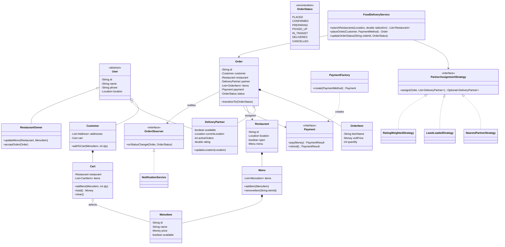
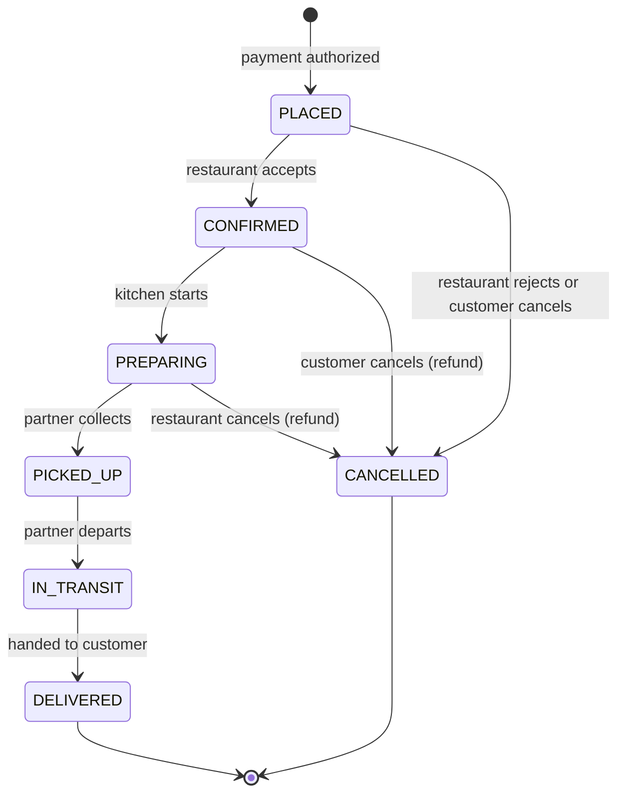

# Design a Food Delivery App (OO)

Food delivery (Swiggy / DoorDash / Uber Eats) is the "kitchen sink" of LLD problems: it
packs three actor types, a multi-step order lifecycle, a pluggable matching decision, and
a fan-out of notifications into one 60–90 minute round. Interviewers use it to test
whether you can (1) keep a three-sided marketplace from collapsing into one god class,
(2) model the order lifecycle as an explicit **state machine** instead of a pile of
booleans, and (3) isolate the delivery-partner assignment decision behind a **Strategy**
so "change the matching rule" is a one-class change. The scope trap is real: geo-search
over millions of restaurants and real-time GPS tracking at scale are HLD — say so early
and keep the design single-process OO.

## Requirements Clarification

Spend the first five minutes narrowing the problem. Good clarifying questions:

- **Which actors?** Three: `Customer` (browses, orders, rates), `DeliveryPartner`
  (accepts, picks up, delivers), `RestaurantOwner` (manages menu, accepts orders). All
  share identity/contact — model a `User` base with role-specific subclasses or
  composition.
- **Which flows are in scope?** Core loop: browse restaurants near a location → build a
  cart → place order with payment → restaurant confirms and prepares → a delivery
  partner is assigned → pickup → in transit → delivered → customer rates. That's the
  spine; everything else is extension.
- **One restaurant per cart, or many?** Clarify — real apps enforce **one restaurant per
  cart** because one partner picks up from one kitchen. This single answer simplifies
  cart, checkout, and assignment. Multi-restaurant carts split into multiple orders —
  park it as an extension.
- **How are partners assigned?** Automatically by the system (nearest available? least
  loaded? rating-weighted?). The *rule* will change — that's your cue for Strategy. Ask
  whether a partner can decline (yes in real apps — plan a re-assignment path).
- **Payments:** multiple methods (card, UPI/wallet, cash-on-delivery) behind an
  interface; no gateway internals. Refund needed on cancellation.
- **Tracking:** in-app status updates (state changes pushed to customer, restaurant,
  partner). Live GPS map tiles and ETA prediction are out of scope — HLD.
- **Out of scope (say it out loud):** distributed geo-indexes (quadtrees/geohash at
  scale), surge/ML pricing models, recommendation feeds, multi-region inventory. Note
  where each would plug in and move on.

A crisp scope statement: *"I'll design a single-city, single-process food delivery
system: customers browse nearby restaurants, build a one-restaurant cart, pay and place
an order; the order moves through an explicit state machine; a pluggable strategy assigns
a delivery partner; all three parties are notified on every status change; customers rate
food and delivery. Concurrency: two orders must not grab the same partner, and an order
must not be cancelled after pickup."*

## Core Objects and Entities

Walk the nouns and give each one job:

| Class | Responsibility |
|---|---|
| `FoodDeliveryService` | Facade: entry point wiring browse, cart, order, assignment, rating |
| `User` (abstract) | Shared identity: id, name, phone, `Location` |
| `Customer` | Orders and ratings history, delivery addresses, owns a `Cart` |
| `DeliveryPartner` | Availability flag, current `Location`, active order count, rating |
| `RestaurantOwner` | Manages one or more restaurants' menus and order acceptance |
| `Restaurant` | Identity, `Location`, open/closed, owns a `Menu`, incoming orders |
| `Menu` | Composition of `MenuItem`s for one restaurant |
| `MenuItem` | id, name, price, availability (86'd items), veg/non-veg flags |
| `Cart` | One customer's pending selection: one restaurant + `CartItem`s + totals |
| `Order` | The aggregate: immutable `OrderItem` snapshot, customer, restaurant, partner, `Payment`, current `OrderStatus` |
| `OrderItem` | **Price-and-name snapshot** of a `MenuItem` at order time + quantity |
| `Payment` | Amount, method, `PaymentStatus`; created via a factory/interface |
| `PartnerAssignmentStrategy` | Pluggable rule choosing a `DeliveryPartner` for an order |
| `OrderObserver` / `NotificationService` | Subscribers notified on every order state change |
| `Rating` | Score + review, targeting a restaurant or a delivery partner |
| `Location` | Value object (lat, lng) with `distanceTo()` |

Three modeling decisions matter more than everything else:

1. **`OrderItem` snapshots the `MenuItem`; it does not reference it live.** Menus change
   — the owner edits a price or deletes a dish tomorrow. If the order holds a live
   reference, historical orders silently change price. Copy name and unit price into
   `OrderItem` at checkout; the order is a *record of what was agreed*, not a view over
   mutable menu data.
2. **`Cart` and `Order` are different classes, not one object with a flag.** A cart is
   mutable, private, and disposable (add/remove items, abandon it). An order is an
   immutable commitment with payment, a state machine, and three interested parties.
   Merging them forces every order consumer to handle "still editable" states.
3. **`Order` holds a reference to its assigned `DeliveryPartner` (aggregation), while it
   *owns* its `OrderItem`s (composition).** Order items cannot exist without the order;
   the partner exists independently and is merely associated. Getting this pair of
   relationships right is a favorite diagram probe.

## Class Diagram

Interview-grade: entities, the state enum, and the three pattern seams (Strategy for
assignment, Observer for notifications, Factory for payments).



Relationship callouts an interviewer will probe:

- `Restaurant *-- Menu` — **composition**: a menu has no meaning without its restaurant.
- `Order *-- OrderItem` — **composition**: order items die with the order.
- `Order o-- DeliveryPartner` — **aggregation/association**: the partner outlives the
  order and serves many orders over time.
- `Cart o-- MenuItem` — the cart *references* live menu items; only at checkout are they
  frozen into `OrderItem` snapshots.

## Order State Machine

The order lifecycle is the backbone of the design. Model it explicitly — an enum of
states plus a single guarded `transitionTo` — not as scattered booleans
(`isConfirmed`, `isPickedUp`, `isCancelled`) that can drift into impossible combinations
like "cancelled and in transit".



Key rules to state out loud:

- **Transitions are validated centrally.** Either a `Map<OrderStatus, Set<OrderStatus>>`
  of allowed transitions, or the full **State pattern** (one class per state that knows
  its legal next moves). For seven states with mostly-linear flow, the transition map is
  the pragmatic interview answer; upgrade to State classes if the interviewer pushes
  per-state *behavior* (e.g., each state computes its own cancellation-fee rule).
- **Cancellation is state-dependent.** Allowed (with refund) up to `PREPARING`;
  disallowed from `PICKED_UP` onward — food already left the kitchen. This guard lives
  in the transition validation, not in the UI.
- **`DELIVERED` and `CANCELLED` are terminal.** Any transition out of them throws
  `IllegalStateTransitionException`.
- **Every successful transition fires the observers** — one hook point, so notifications
  can never be forgotten on a new code path.

## Delivery Partner Assignment Strategy

"How do you pick the partner?" is the design decision of this problem. The rule is
volatile — ops will tune it monthly — so encode it as a **Strategy** (see the dp-strategy
topic) instead of an `if-else` chain inside the order service:

```java
public interface PartnerAssignmentStrategy {
    Optional<DeliveryPartner> assign(Order order, List<DeliveryPartner> candidates);
}

public class NearestPartnerStrategy implements PartnerAssignmentStrategy {
    public Optional<DeliveryPartner> assign(Order order, List<DeliveryPartner> candidates) {
        Location pickup = order.getRestaurant().getLocation();
        return candidates.stream()
            .filter(DeliveryPartner::isAvailable)
            .min(Comparator.comparingDouble(p -> p.getCurrentLocation().distanceTo(pickup)));
    }
}
```

- `NearestPartnerStrategy` — minimize pickup distance (fast pickup, may overload
  partners near restaurant clusters).
- `LeastLoadedStrategy` — minimize active orders per partner (fairness/load balancing,
  may pick someone far away).
- `RatingWeightedStrategy` — composite score, e.g.
  `score = w1·distance + w2·load − w3·rating` (what real systems converge to).

Why Strategy and not a conditional? Each rule is independently unit-testable, new rules
are **added** without touching (or re-testing) the dispatcher — Open/Closed — and the
service depends only on the interface (DIP). A `CompositeStrategy` that chains fallbacks
("nearest, else least-loaded, else queue the order") composes cleanly.

Two operational details worth saying:

- **Return `Optional` — no partner may be free.** The order then waits in `CONFIRMED`
  with a retry/queue, rather than the method returning `null` or throwing.
- **Assignment must be atomic per partner** (see Concurrency): filter-then-assign is a
  check-then-act race when two orders run concurrently.

Filtering "candidates within 5 km" via a naive linear scan over an in-memory list is
fine here; a geo-index (geohash/quadtree) serving millions of partners is the HLD
version of this question — name it and move on.

## Key Design Decisions

Pattern-by-pattern, with the *requirement* that justifies each (reference the dp-*
topics for pattern mechanics):

- **State (or a validated transition map) for the order lifecycle.** Requirement:
  actions are legal only in certain states (cancel before pickup, rate only after
  delivery). Booleans can encode contradictory combinations; an explicit state machine
  cannot.
- **Strategy for partner assignment.** Requirement: the matching rule changes often and
  must be swappable/testable in isolation.
- **Observer for order tracking.** Requirement: on every status change, notify the
  customer (push/SMS), the restaurant dashboard, and the partner app — and tomorrow, an
  analytics sink. The `Order` (subject) fires `onStatusChange`; it knows *that* it has
  observers, never *who* they are. Adding a fourth listener touches zero order code.
- **Factory for payments.** Requirement: `CardPayment`, `UpiPayment`,
  `CashOnDeliveryPayment` — checkout code asks `PaymentFactory.create(method)` and works
  against the `Payment` interface. Adding a wallet type is one new class + one factory
  case; no `switch` scattered through checkout.
- **Facade (`FoodDeliveryService`) as the entry point.** The demo/driver talks to one
  class; internally it delegates to cart, assignment strategy, and order components.
  Keeps the live-coding session navigable.
- **One restaurant per cart, enforced in `Cart.addItem`.** Adding an item from a
  different restaurant either throws or (product decision) clears the cart after
  confirmation — but the *invariant lives in the Cart*, not in every UI flow.
- **Singleton is optional, not the answer.** One `FoodDeliveryService` instance wired
  with its strategy via constructor injection beats a hard `getInstance()` — easier to
  test with fakes.

## API and Method Signatures

The facade surface — enough to drive every flow in a demo:

```java
public class FoodDeliveryService {
    // browse
    List<Restaurant> searchRestaurants(Location near, double radiusKm);
    Menu getMenu(String restaurantId);

    // cart
    void addToCart(String customerId, String restaurantId, String itemId, int qty);
    Cart viewCart(String customerId);

    // order
    Order placeOrder(String customerId, PaymentMethod method);   // cart -> order, pays, PLACED
    void confirmOrder(String orderId);                           // restaurant accepts
    void updateOrderStatus(String orderId, OrderStatus next);    // guarded transition
    void cancelOrder(String orderId, String byUserId);           // state-dependent, refunds

    // delivery
    Optional<DeliveryPartner> assignPartner(String orderId);     // delegates to strategy
    OrderStatus trackOrder(String orderId);

    // feedback
    void rateRestaurant(String customerId, String restaurantId, int stars, String review);
    void ratePartner(String customerId, String partnerId, int stars);
}
```

Signature choices worth defending:

- `placeOrder` returns the created `Order` (caller needs the id to track); it fails fast
  with typed exceptions: `EmptyCartException`, `RestaurantClosedException`,
  `PaymentFailedException`.
- `assignPartner` returns `Optional` — "nobody available" is an expected outcome, not an
  error.
- `cancelOrder` takes *who* is cancelling — customer, restaurant, and system
  cancellations have different refund/penalty consequences.
- `updateOrderStatus` is the single choke point for transitions — validation and
  observer fan-out live behind it.

## Code Skeleton

Structure over completeness — the state machine, the observer hook, and checkout:

```java
public enum OrderStatus {
    PLACED, CONFIRMED, PREPARING, PICKED_UP, IN_TRANSIT, DELIVERED, CANCELLED;

    private static final Map<OrderStatus, Set<OrderStatus>> ALLOWED = Map.of(
        PLACED,     Set.of(CONFIRMED, CANCELLED),
        CONFIRMED,  Set.of(PREPARING, CANCELLED),
        PREPARING,  Set.of(PICKED_UP, CANCELLED),
        PICKED_UP,  Set.of(IN_TRANSIT),
        IN_TRANSIT, Set.of(DELIVERED),
        DELIVERED,  Set.of(),
        CANCELLED,  Set.of()
    );

    public boolean canTransitionTo(OrderStatus next) {
        return ALLOWED.get(this).contains(next);
    }
}

public class Order {
    private final String id;
    private final Customer customer;
    private final Restaurant restaurant;
    private final List<OrderItem> items;          // immutable snapshot
    private final Payment payment;
    private volatile OrderStatus status = OrderStatus.PLACED;
    private DeliveryPartner partner;              // set on assignment
    private final List<OrderObserver> observers = new CopyOnWriteArrayList<>();

    public synchronized void transitionTo(OrderStatus next) {
        if (!status.canTransitionTo(next)) {
            throw new IllegalStateTransitionException(status, next);
        }
        this.status = next;
        observers.forEach(o -> o.onStatusChange(this, next));   // single fan-out point
    }

    public void addObserver(OrderObserver o) { observers.add(o); }
}

public interface OrderObserver { void onStatusChange(Order order, OrderStatus next); }

public class CustomerNotifier implements OrderObserver {
    public void onStatusChange(Order order, OrderStatus next) {
        push(order.getCustomer(), "Your order is now " + next);
    }
}

public interface Payment {
    PaymentResult pay(Money amount);
    PaymentResult refund();
}

public class PaymentFactory {
    public static Payment create(PaymentMethod method) {
        return switch (method) {
            case CARD -> new CardPayment();
            case UPI  -> new UpiPayment();
            case COD  -> new CashOnDeliveryPayment();   // pay() is a no-op until delivery
        };
    }
}

public class FoodDeliveryService {
    private final PartnerAssignmentStrategy assignment;   // injected — swappable

    public Order placeOrder(String customerId, PaymentMethod method) {
        Cart cart = carts.get(customerId);
        if (cart == null || cart.isEmpty()) throw new EmptyCartException(customerId);
        if (!cart.getRestaurant().isOpen()) throw new RestaurantClosedException();

        List<OrderItem> snapshot = cart.snapshotItems();      // freeze names + prices
        Payment payment = PaymentFactory.create(method);
        PaymentResult result = payment.pay(cart.total());
        if (!result.success()) throw new PaymentFailedException(result);

        Order order = new Order(newId(), cart.getCustomer(),
                                cart.getRestaurant(), snapshot, payment);
        registerDefaultObservers(order);                      // customer, restaurant, partner, analytics
        cart.clear();
        return order;
    }

    public Optional<DeliveryPartner> assignPartner(String orderId) {
        Order order = orders.get(orderId);
        return assignment.assign(order, partnerPool.availablePartners())
                         .map(p -> { p.acceptOrder(order); order.setPartner(p); return p; });
    }
}
```

Notes to narrate while writing it: the transition map makes illegal moves impossible by
construction; `transitionTo` is the *only* mutator of `status`, so observers can never
be skipped; `PaymentFactory` + `Payment` keeps checkout closed against new payment
types; the strategy is constructor-injected, so tests pass a `FakeStrategy`.

## Concurrency and Edge Cases

Single-process, multi-threaded — call these before the interviewer does:

- **Double-assignment race.** Two orders run `assignPartner` concurrently and both pick
  the same free partner: classic **check-then-act**. Fix: make claiming atomic on the
  partner — `synchronized boolean tryAcceptOrder(Order o)` (or an
  `AtomicBoolean.compareAndSet(false, true)` on availability) that re-checks
  availability inside the lock and returns `false` to the loser, who then retries with
  the next candidate. Locking the whole partner pool also works but serializes every
  assignment — lock per partner, not per pool.
- **Cancel-vs-pickup race.** Customer cancels at the same moment the partner marks
  `PICKED_UP`. Because `transitionTo` is `synchronized` per order and validates against
  the *current* state, exactly one wins: if `PICKED_UP` lands first, the cancel throws
  `IllegalStateTransitionException`; if the cancel lands first, the pickup fails. The
  state machine *is* the concurrency guard — this is why booleans lose.
- **Menu edit vs. open carts.** Owner raises a price or 86's an item while it sits in
  carts. Cart references live items, so re-validate price and availability at
  `placeOrder` and fail with a clear "cart changed" error — the `OrderItem` snapshot
  then protects the order *after* placement.
- **Payment failed after cart freeze:** don't create the order; keep the cart intact so
  the customer retries. Payment succeeded but restaurant rejects: transition
  `PLACED → CANCELLED` and `payment.refund()` — pair every cancel path with its refund.
- **Partner declines or goes offline mid-flow.** Re-run assignment excluding them; if
  the order was `PICKED_UP`, this is an ops escalation, not a silent re-queue.
- **No partner available:** order waits in `CONFIRMED` with retry — `Optional.empty()`
  is a normal outcome, not an exception.
- **Rating guards:** only the order's own customer, only after `DELIVERED`, only once
  per order — the check belongs in the rating service, keyed by order id.
- **Restaurant closes with orders in flight:** closing stops *new* carts/orders; in-
  flight orders complete. Open/closed is checked at `placeOrder`, not retroactively.

## Extensibility

The follow-ups interviewers actually ask, and why this design absorbs them:

- **Promo codes / discounts.** A `PricingRule`/`DiscountPolicy` interface applied at
  checkout — `FlatDiscount`, `PercentageDiscount`, `FreeDeliveryOverAmount` — either a
  Strategy chosen per code or **Decorator** stacking rules over the base bill. Cart
  total computation already sits in one place (`cart.total()` → an `OrderPricer`), so
  no call site changes.
- **Surge pricing on delivery fee.** A `DeliveryFeePolicy` strategy
  (`FlatFee`, `DistanceBasedFee`, `SurgeFee(demandFactor)`). The *policy seam* is LLD;
  computing the demand factor from real-time signals is HLD — say so.
- **Scheduled orders.** Add a `scheduledFor` timestamp and a `SCHEDULED` state that
  transitions to `PLACED` when due (a scheduler polls or a delay queue fires). Only the
  transition map gains one row — nothing downstream changes because everything already
  keys off states.
- **Multi-restaurant cart.** Checkout splits the cart into one `Order` per restaurant;
  each order gets its own state machine and partner. The one-restaurant invariant moves
  from `Cart` into a `CartGroup` that partitions by restaurant.
- **Restaurant analytics dashboard.** Register an `AnalyticsObserver` implementing
  `OrderObserver` — order volume, prep-time, and cancellation metrics accumulate off
  the same status-change events. Zero changes to `Order`.
- **Partner incentives / gamification.** Same event stream: an observer tallies
  deliveries per partner; incentive rules are strategies over the tally.
- **"Now scale to a whole country."** Geo-sharded search, partner-location streams,
  ETA models — acknowledge as HLD (point at the system-design domain) and note the OO
  seams (Strategy, Observer) are where those systems would plug in.

## Common Interview Follow-ups

1. **"Why is Strategy better than an `if (mode == NEAREST) ... else if` block for
   assignment?"** Each rule is a testable unit; new rules add classes instead of
   modifying a growing conditional (OCP); the service depends on the interface, so tests
   inject fakes (DIP).
2. **"Enum-with-transition-map vs. full State pattern — which and why?"** Transition map
   for lifecycle *validation* alone; State classes once each state carries distinct
   *behavior* (per-state cancellation fees, per-state allowed actions). Start with the
   map, name the upgrade path.
3. **"Where exactly do notifications get sent, and how do you guarantee no path forgets
   them?"** Only `transitionTo` mutates status, and it fires observers — a single choke
   point; new listeners register, existing code never changes.
4. **"Two orders picked the same delivery partner — walk me through the fix."**
   Check-then-act race; atomic claim per partner (`tryAcceptOrder` with
   `synchronized`/CAS), loser retries next candidate.
5. **"Customer cancels while the partner is picking up — who wins?"** Whoever's
   transition commits first under the order's lock; the other gets
   `IllegalStateTransitionException`. Demonstrates why status is a guarded state
   machine, not a settable field.
6. **"Owner changes a price after I ordered — what does my receipt show?"** The
   `OrderItem` snapshot price. Orders record agreements; menus are mutable catalogs.
7. **"Add COD (cash on delivery) — what changes?"** One new `Payment` implementation
   whose `pay()` defers capture until `DELIVERED` (settle via an observer on that
   transition) + one factory case. Checkout code untouched.
8. **"Add promo codes without touching checkout."** Discount policies behind an
   interface applied by the pricer — Strategy or Decorator stack.
9. **"Support scheduled orders."** New `SCHEDULED` state + one transition-map row + a
   due-time trigger; downstream logic already keys off states.
10. **"How would this change for millions of restaurants and live GPS?"** That's HLD:
    geo-indexes, location streams, push infrastructure — name them, point to
    system-design, keep this round's design single-process.

## References

- *Head First Design Patterns* (Freeman & Robson) — Strategy, Observer, State, Factory chapters
- *Design Patterns: Elements of Reusable Object-Oriented Software* (GoF) — State (305), Strategy (315), Observer (293)
- Grokking the Object-Oriented Design Interview — "Design a Food Delivery System / Online Ordering"
- Refactoring.Guru — State, Strategy, Observer pattern write-ups (refactoring.guru/design-patterns)
- Swiggy/DoorDash engineering blogs — dispatch/assignment problem overviews (HLD context for the Strategy seam)
- Related topics in this library: dp-strategy, dp-observer, dp-state, dp-factory-method (pattern mechanics), system-design domain (scaling follow-ups)
