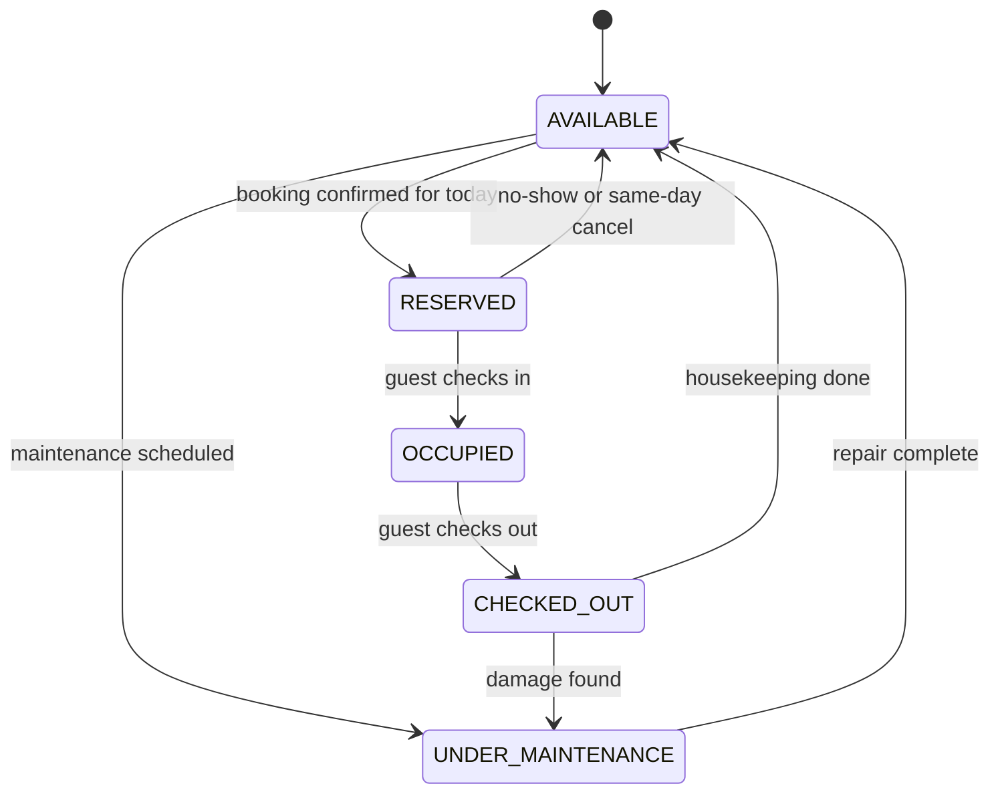

# Design a Hotel Booking System

The hotel booking system is the canonical "reservation over time" LLD problem. Unlike a
parking lot (where a spot is free or taken *right now*), a hotel room's availability is a
function of a **date range** — the same room can be simultaneously "free tonight" and
"booked next weekend". Interviewers use this problem to test three things: whether you can
model availability as **interval overlap over bookings** instead of a boolean flag on the
room, whether you can pick the right pattern for pricing/lifecycle/notifications, and
whether you can protect the "two guests grab the last room" race. Expect 45–60 minutes.

## Requirements Clarification

Spend the first five minutes narrowing scope. Good clarifying questions:

- **Single hotel or a chain?** Start single-hotel; model `Hotel` so a chain is an easy
  extension (a `HotelChain` aggregating hotels, search fanning out by location).
- **Room types:** Single, Double, Suite, Deluxe — each with a base price and capacity. Do
  guests book a *specific room* (Room 204) or a *room type* (any Double)? Booking **by
  type** is how real hotels work and it changes the availability check (count free rooms
  of a type, not check one room). Clarify — for the core design, booking a specific room
  is simpler and most interviewers accept it; call out the by-type variant explicitly.
- **Key flows:** search available rooms (date range + type + location), book (availability
  check → reserve → pay), cancel (refund policy), check-in, check-out. Payment itself is
  behind an interface — no gateway internals.
- **Overbooking:** do we ever sell more rooms than we have (airline-style)? Hotels usually
  **don't** — scope it out but note where the policy would plug in.
- **Dates:** treat stays as half-open intervals `[checkIn, checkOut)` — a guest leaving on
  the 10th and one arriving on the 10th can share a room with no conflict. Nail this
  convention early; it kills a whole class of off-by-one bugs.
- **Out of scope:** multi-region inventory sync, dynamic-pricing ML, channel managers /
  OTA sync at scale, loyalty programs (park as extensibility), and "millions of concurrent
  searches" (that's HLD — say so and move on).

A crisp scope statement: *"I'll design a single hotel where guests search rooms by date
range and type, book a specific room with payment, cancel under a refund policy, and
check in/out. Rooms have an operational lifecycle (maintenance, housekeeping), pricing is
pluggable, and confirmations go out via notifications. Concurrency: two guests must not
book the same room for overlapping dates."*

## Core Objects and Entities

Walk the nouns and assign one responsibility each:

| Class | Responsibility |
|---|---|
| `HotelBookingService` | Facade: entry point wiring search, booking, cancellation, check-in/out |
| `Hotel` | Identity + location + owns its `Room` inventory |
| `Room` | A physical room: number, `RoomType`, base price, operational `RoomStatus` |
| `RoomType` | Enum: `SINGLE`, `DOUBLE`, `SUITE`, `DELUXE` (capacity + base rate live with the type or the room) |
| `Guest` | A registered customer: id, name, contact info |
| `RoomBooking` | First-class reservation record: room, guest, `DateRange`, price paid, `BookingStatus` |
| `DateRange` | Value object `[checkIn, checkOut)` with an `overlaps()` method — the heart of availability |
| `AvailabilityService` | Answers "is this room free for this range?" by scanning that room's active bookings |
| `BookingService` | Orchestrates book/cancel: lock → availability check → price → pay → confirm → notify |
| `PricingStrategy` | Pluggable price computation (base, seasonal, weekend, dynamic) |
| `RefundPolicy` | Pluggable cancellation refund computation (full / tiered / non-refundable) |
| `PaymentProcessor` | Interface hiding the gateway: `charge()`, `refund()` |
| `BookingObserver` / `NotificationService` | Subscribers notified on confirm/cancel (email, SMS) |
| `RoomFactory` | Creates correctly configured `Room` instances per `RoomType` |

Three modeling decisions matter more than everything else:

1. **`RoomBooking` is a first-class object, not a flag on `Room`.** The guest–room
   relationship carries data (dates, price, status, payment) and history. A room
   accumulates many bookings over time; a guest holds many bookings. Availability is
   *derived* by querying these records — never stored as "isBooked" on the room.
2. **`DateRange` is a value object with the overlap logic inside it.** Putting
   `overlaps()` on `DateRange` gives the rule one home, makes it unit-testable in
   isolation, and stops the half-open-interval convention from being re-implemented
   (differently) in three places.
3. **Separate the room's *operational* state from its *booking* availability.**
   `RoomStatus` (`UNDER_MAINTENANCE`, `OCCUPIED`, …) describes the physical room *today*.
   Whether the room is free *on August 14th* is a question about bookings, not about the
   enum. Conflating the two is the most common failure in this interview — a single
   `AVAILABLE/BOOKED` field cannot represent "free tonight, booked next week".

## Class Diagram

Interview-grade, not enterprise-grade — services, entities, and the three pattern seams
(Strategy for pricing/refunds, Observer for notifications, Factory for rooms):

```mermaid
classDiagram
    class HotelBookingService {
        -Hotel hotel
        -BookingService bookingService
        -AvailabilityService availabilityService
        +search(DateRange range, RoomType type) List~Room~
        +book(String roomNo, String guestId, DateRange range) RoomBooking
        +cancel(String bookingId) Refund
        +checkIn(String bookingId)
        +checkOut(String bookingId) Invoice
    }
    class Hotel {
        -String hotelId
        -String name
        -Address location
        -List~Room~ rooms
        +roomsOfType(RoomType type) List~Room~
    }
    class Room {
        -String roomNumber
        -RoomType type
        -RoomStatus status
        -BigDecimal basePrice
        +isOperational() boolean
    }
    class RoomType {
        <<enumeration>>
        SINGLE
        DOUBLE
        SUITE
        DELUXE
    }
    class RoomStatus {
        <<enumeration>>
        AVAILABLE
        RESERVED
        OCCUPIED
        CHECKED_OUT
        UNDER_MAINTENANCE
    }
    class Guest {
        -String guestId
        -String name
        -String email
    }
    class RoomBooking {
        -String bookingId
        -Room room
        -Guest guest
        -DateRange stay
        -BigDecimal totalPrice
        -BookingStatus status
        +isActive() boolean
    }
    class BookingStatus {
        <<enumeration>>
        CONFIRMED
        CHECKED_IN
        COMPLETED
        CANCELLED
        NO_SHOW
    }
    class DateRange {
        -LocalDate checkIn
        -LocalDate checkOut
        +overlaps(DateRange other) boolean
        +nights() int
    }
    class AvailabilityService {
        +isAvailable(Room room, DateRange range) boolean
        +findAvailable(RoomType type, DateRange range) List~Room~
    }
    class BookingService {
        -AvailabilityService availability
        -PricingStrategy pricing
        -PaymentProcessor payments
        -List~BookingObserver~ observers
        +book(Room room, Guest guest, DateRange range) RoomBooking
        +cancel(RoomBooking booking, RefundPolicy policy) Refund
    }
    class PricingStrategy {
        <<interface>>
        +price(Room room, DateRange range) BigDecimal
    }
    class SeasonalPricing
    class WeekendPricing
    class RefundPolicy {
        <<interface>>
        +refundAmount(RoomBooking b, LocalDate cancelDate) BigDecimal
    }
    class PaymentProcessor {
        <<interface>>
        +charge(Guest g, BigDecimal amt) Payment
        +refund(Payment p, BigDecimal amt)
    }
    class BookingObserver {
        <<interface>>
        +onBookingConfirmed(RoomBooking b)
        +onBookingCancelled(RoomBooking b)
    }
    class EmailNotifier
    class SmsNotifier
    class RoomFactory {
        +createRoom(RoomType type, String number) Room
    }

    HotelBookingService --> Hotel
    HotelBookingService --> BookingService
    HotelBookingService --> AvailabilityService
    Hotel "1" *-- "many" Room
    Room --> RoomType
    Room --> RoomStatus
    RoomBooking --> Room
    RoomBooking --> Guest
    RoomBooking *-- DateRange
    RoomBooking --> BookingStatus
    BookingService --> AvailabilityService
    BookingService --> PricingStrategy
    BookingService --> PaymentProcessor
    BookingService --> BookingObserver
    PricingStrategy <|.. SeasonalPricing
    PricingStrategy <|.. WeekendPricing
    BookingObserver <|.. EmailNotifier
    BookingObserver <|.. SmsNotifier
    RoomFactory ..> Room : creates
```



Relationship notes worth saying out loud:

- `Hotel *-- Room` is **composition** — rooms don't exist outside their hotel.
- `RoomBooking --> Room` and `--> Guest` are plain **associations**: a booking references
  a room and a guest but owns neither; both outlive any single booking.
- `RoomBooking *-- DateRange` is composition of a **value object** — the range has no
  identity of its own.
- The service depends on `PricingStrategy` / `PaymentProcessor` / `BookingObserver`
  **interfaces** (DIP): swap Stripe for a mock, add WhatsApp notifications, or change
  pricing without touching `BookingService`.

## Room State Machine

`RoomStatus` models the room's **operational lifecycle for the current day** — the state
housekeeping and the front desk care about. It is *not* the future-availability calendar
(that lives in bookings):



Design points:

- **Guard illegal transitions in one place.** `AVAILABLE → OCCUPIED` without a check-in,
  or `OCCUPIED → UNDER_MAINTENANCE` while a guest is inside, should throw. With few
  states, a `switch`/transition-table inside `Room.transitionTo(RoomStatus)` is fine; if
  each state gains real behavior (different handling of `checkIn()`, `checkOut()`,
  `markMaintenance()` per state), promote to the **State pattern** with one class per
  state — same reasoning as the vending machine and elevator problems (see the dp-state
  topic for the pattern itself).
- **`CHECKED_OUT` is deliberately distinct from `AVAILABLE`.** The gap between guest
  departure and housekeeping completion is real; selling a dirty room is a bug the
  interviewer will happily probe.
- **`UNDER_MAINTENANCE` interacts with search:** `AvailabilityService` must exclude
  non-operational rooms even if they have no overlapping bookings — hence
  `room.isOperational()` in the availability check.

## Key Design Decisions

Pattern choices, each tied to the requirement that forces it (patterns referenced by
name — the dp-* topics teach them in full):

- **Strategy — pricing.** "Price = base rate" survives five minutes; then the interviewer
  adds seasonal rates, weekend multipliers, dynamic demand pricing. An `if/else` chain in
  `BookingService` violates Open/Closed and tangles orchestration with pricing math.
  `PricingStrategy.price(room, range)` lets each policy be its own class; new policies are
  new classes, not edits. Compose them (e.g., seasonal *then* weekend uplift) by iterating
  a list of adjusters or wrapping strategies decorator-style.
- **Strategy — refunds.** Cancellation policy (full refund >48h out, 50% within 48h,
  non-refundable rates) is the same shape: `RefundPolicy.refundAmount(booking,
  cancelDate)`. Keeping it separate from `PricingStrategy` respects ISP — they change for
  different reasons and often ship in different combinations (cheap rate = strict refund).
- **State — room lifecycle.** As above: explicit states with guarded transitions; promote
  to full State pattern when per-state behavior grows.
- **Factory — room creation.** `RoomFactory.createRoom(SUITE, "501")` centralizes
  type-specific configuration (capacity, base rate, amenities). Adding a `PENTHOUSE` type
  touches the enum and the factory — search, booking, and pricing code never mention
  concrete room subtypes. Prefer **one `Room` class + `RoomType` enum/config** over a
  `Room` subclass per type: the types differ in *data* (price, capacity), not *behavior*,
  so subclassing adds ceremony without polymorphism to exploit.
- **Observer — booking events.** On confirm/cancel, email + SMS + (later) the loyalty
  service all want to know. If `BookingService` calls `emailService.send()` directly, every
  new channel edits the service. `BookingObserver` subscribers invert that: the service
  fires `onBookingConfirmed(booking)`, channels subscribe. Notification failure must not
  fail the booking — notify *after* commit, catch per-observer.
- **Facade — `HotelBookingService`.** The demo/driver talks to one class; internals stay
  swappable.
- **What availability is NOT: a field.** The single biggest decision — see the next
  section. Availability is computed from bookings; `RoomStatus.AVAILABLE` only says the
  room is physically sellable today.

## Availability and Date-Range Overlap

The core algorithm of the problem. With half-open stays `[checkIn, checkOut)`, two ranges
overlap **iff each starts before the other ends**:

```java
public final class DateRange {
    private final LocalDate checkIn;   // inclusive
    private final LocalDate checkOut;  // exclusive

    public boolean overlaps(DateRange other) {
        return this.checkIn.isBefore(other.checkOut)
            && other.checkIn.isBefore(this.checkOut);
    }
}
```

A room is available for a requested range iff it is operational and **no active booking
overlaps** the range:

```java
public boolean isAvailable(Room room, DateRange requested) {
    return room.isOperational()
        && bookingRepository.activeBookingsFor(room).stream()
               .noneMatch(b -> b.getStay().overlaps(requested));
}
```

Points interviewers probe:

- **Why half-open?** Checkout day = someone else's check-in day. `[10th, 12th)` and
  `[12th, 14th)` do **not** overlap under strict `isBefore` — back-to-back stays just
  work. With closed intervals you'd need `-1 day` fudges everywhere.
- **Only *active* bookings block.** `CANCELLED` and `NO_SHOW` bookings must not — filter
  by status (`CONFIRMED`, `CHECKED_IN`) before the overlap scan.
- **Complexity.** Naive scan is O(bookings-per-room) — fine for one hotel in an
  interview. Say the upgrade path out loud: keep each room's bookings **sorted by
  check-in** for binary search, or an **interval tree** for O(log n) conflict lookup, or
  a per-room-per-date availability bitmap. (Data-structure internals belong to
  dsa-coding; here you name the structure and move on.)
- **Booking by type instead of by room:** availability becomes a *count* — "on every
  night of the range, bookedCount(type, night) < totalRooms(type)". A per-type,
  per-date counter map makes this O(nights). Mention it; implement specific-room.

## API and Method Signatures

```java
// Search
List<Room> search(DateRange range, RoomType type);           // filter: operational + no overlap
List<Room> search(DateRange range, RoomType type, Location loc); // chain variant

// Booking lifecycle
RoomBooking book(String roomNumber, String guestId, DateRange range)
    throws RoomUnavailableException, PaymentFailedException;
Refund cancel(String bookingId) throws IllegalBookingStateException;
void checkIn(String bookingId);        // CONFIRMED -> CHECKED_IN, room -> OCCUPIED
Invoice checkOut(String bookingId);    // CHECKED_IN -> COMPLETED, room -> CHECKED_OUT

// Pricing (used inside book, also exposed for quotes)
BigDecimal quote(String roomNumber, DateRange range);
```

Signature decisions to narrate:

- `book(...)` returns the `RoomBooking` (caller needs id + price), and throws typed
  exceptions rather than returning null/boolean — "why did it fail" matters (room taken
  vs. card declined) and the caller handles them differently.
- `cancel` returns a `Refund` object (amount + payment reference), computed by the
  `RefundPolicy` — not a hardcoded amount.
- Quotes and bookings share the same `PricingStrategy` so the price shown equals the
  price charged.

## Code Skeleton

Enough structure to show the seams — not a full implementation:

```java
public enum RoomType { SINGLE, DOUBLE, SUITE, DELUXE }
public enum RoomStatus { AVAILABLE, RESERVED, OCCUPIED, CHECKED_OUT, UNDER_MAINTENANCE }
public enum BookingStatus { CONFIRMED, CHECKED_IN, COMPLETED, CANCELLED, NO_SHOW }

public class Room {
    private final String roomNumber;
    private final RoomType type;
    private final BigDecimal basePrice;
    private RoomStatus status = RoomStatus.AVAILABLE;
    private final ReentrantLock lock = new ReentrantLock();   // per-room booking lock

    public boolean isOperational() { return status != RoomStatus.UNDER_MAINTENANCE; }
    public ReentrantLock bookingLock() { return lock; }
    public void transitionTo(RoomStatus next) { /* validate against transition table, throw if illegal */ }
}

public class RoomFactory {
    public Room createRoom(RoomType type, String number) {
        return switch (type) {
            case SINGLE -> new Room(number, type, new BigDecimal("100"));
            case DOUBLE -> new Room(number, type, new BigDecimal("160"));
            case SUITE  -> new Room(number, type, new BigDecimal("300"));
            case DELUXE -> new Room(number, type, new BigDecimal("450"));
        };
    }
}

public interface PricingStrategy { BigDecimal price(Room room, DateRange range); }

public class WeekendPricing implements PricingStrategy {
    private final PricingStrategy base;          // wraps another strategy
    private final BigDecimal weekendMultiplier;  // e.g. 1.25
    public BigDecimal price(Room room, DateRange range) { /* per-night, uplift Fri/Sat */ return null; }
}

public interface BookingObserver {
    void onBookingConfirmed(RoomBooking b);
    void onBookingCancelled(RoomBooking b);
}

public class BookingService {
    private final AvailabilityService availability;
    private final PricingStrategy pricing;
    private final PaymentProcessor payments;
    private final List<BookingObserver> observers = new CopyOnWriteArrayList<>();

    public RoomBooking book(Room room, Guest guest, DateRange range) {
        room.bookingLock().lock();                       // pessimistic: serialize per room
        try {
            if (!availability.isAvailable(room, range))
                throw new RoomUnavailableException(room.getRoomNumber());
            BigDecimal total = pricing.price(room, range);
            Payment payment = payments.charge(guest, total);      // may throw
            RoomBooking booking = new RoomBooking(room, guest, range, total, payment);
            bookingRepository.save(booking);                      // now it blocks others
            notifyConfirmed(booking);                             // after commit, best-effort
            return booking;
        } finally {
            room.bookingLock().unlock();
        }
    }

    public Refund cancel(RoomBooking b, RefundPolicy policy) {
        b.markCancelled();                                        // validates current status
        BigDecimal amount = policy.refundAmount(b, LocalDate.now());
        payments.refund(b.getPayment(), amount);
        observers.forEach(o -> safeNotify(() -> o.onBookingCancelled(b)));
        return new Refund(b.getBookingId(), amount);
    }
}
```

## Concurrency: Booking the Last Room

The classic race: two guests see the same room available and both call `book()`. The
availability check followed by the save is a **check-then-act** sequence — without mutual
exclusion, both checks pass before either booking is saved, and the room is double-booked.

- **Pessimistic per-room lock (the interview answer).** Acquire the room's lock, *then*
  check availability, *then* create the booking, release. One lock **per room** — a single
  global lock would serialize bookings for unrelated rooms (Room 101's booking should
  never wait on Room 902's). Two different rooms proceed in parallel; two requests for
  the same room serialize, and the loser gets a clean `RoomUnavailableException`.
- **Lock granularity refinement:** requests for the same room but *disjoint dates* also
  serialize under a per-room lock — acceptable at interview scale. Mention the finer
  option (lock per room+date-bucket) as an optimization, and its cost: multi-bucket
  bookings must acquire multiple locks **in a canonical order** (e.g., sorted by date) to
  avoid deadlock.
- **Optimistic alternative:** proceed without a lock, and on save let a version check /
  unique constraint on (room, night) reject the loser, who retries or errors. Better when
  conflicts are rare; pessimistic is easier to reason about live and is the expected
  default here.
- **In a real system** this becomes a DB transaction (`SELECT … FOR UPDATE` on the room's
  bookings, or a unique index on room+night) — name it, then keep the in-memory design;
  distributed locking is HLD territory.
- **Charge inside or outside the lock?** Holding a per-room lock across a slow payment
  call hurts only that room's throughput — acceptable, and it avoids charging two cards
  for one room. The alternative (a short-lived `PENDING` hold that blocks availability,
  released on payment failure or timeout) is the real-world answer — offer it as the
  follow-up design.

## Edge Cases and Error States

- **Payment fails mid-booking:** charge happens before the booking is saved; on
  `PaymentFailedException` nothing was reserved, no cleanup needed. If you save first
  (PENDING hold), you must release the hold on failure *and* on timeout.
- **Cancel after check-in / double cancel:** `markCancelled()` validates the current
  `BookingStatus` — cancelling a `CHECKED_IN` or already-`CANCELLED` booking throws
  `IllegalBookingStateException`.
- **Invalid ranges:** `checkOut <= checkIn`, past dates, or a stay exceeding max length —
  validate in the `DateRange` constructor so bad ranges can't exist at all.
- **No-show:** `CONFIRMED` booking whose check-in date passes → a scheduled sweep marks
  it `NO_SHOW`, freeing the room (and possibly charging a no-show fee via policy).
- **Maintenance with a future booking:** marking a room `UNDER_MAINTENANCE` when it has
  upcoming confirmed bookings should warn/require relocation — check bookings before
  allowing the transition.
- **Notification failure:** never fails the booking — observers are invoked after the
  booking is durable, each wrapped in its own try/catch.
- **Timezone / "day" definition:** the hotel's local calendar date defines nights;
  pin `LocalDate` semantics to the property's timezone and say so.

## Extensibility

The "now add X" follow-ups and where they land:

- **Amenities / packages (breakfast, spa, parking):** an `Addon` line-item list on
  `RoomBooking`; price folds in via the pricing pipeline (or a booking-level
  decorator that adds addon costs). No change to search or concurrency.
- **Loyalty points:** a `LoyaltyObserver implements BookingObserver` accruing points on
  `onBookingConfirmed` — zero edits to `BookingService` (Open/Closed via the Observer
  seam). Redemption enters as another pricing adjuster.
- **Third-party aggregator (Booking.com pulls inventory):** expose search/book behind an
  interface; an **Adapter** translates the aggregator's API to `HotelBookingService`
  calls. The concurrency story already holds because all paths converge on the same
  per-room lock.
- **Cancellation waitlist:** when a fully-booked range gets a cancellation, waitlisted
  guests should be offered the room — a `WaitlistService` subscribes to
  `onBookingCancelled`, keeps a FIFO queue per (roomType, dateRange) request, and offers
  with an expiry. Observer again — the cancel flow doesn't change.
- **Multi-hotel chain:** `HotelChain` holds hotels; search adds a location filter and
  fans out per hotel. Per-room locks stay valid because rooms are still owned by one
  hotel. Cross-region inventory and caching are HLD — defer explicitly.
- **Dynamic pricing:** one more `PricingStrategy` (`DemandBasedPricing` reading occupancy
  %) — the seam was built for exactly this.
- **Overbooking policy:** if the business ever wants it, it's a policy object in the
  availability check (`allowedOversell(type, date)`), not scattered if-statements.

## Common Interview Follow-ups

1. **"Guests book a room *type*, and the desk assigns the physical room at check-in."**
   Split `RoomBooking` (type + range) from `RoomAssignment` (physical room, created at
   check-in); availability becomes per-type counting per night.
2. **"Add hourly bookings / day-use rooms."** `DateRange` generalizes to a time range;
   overlap logic is unchanged (half-open intervals still), pricing gains an hourly
   strategy.
3. **"Two guests hit Book at the same second for the last Deluxe — walk me through
   exactly what happens."** Narrate the per-room lock acquisition order, the loser's
   exception, and why check-then-act without the lock double-books.
4. **"The payment gateway takes 8 seconds. Do you hold the lock?"** Discuss PENDING
   holds with expiry vs. lock-across-payment trade-off.
5. **"Support promotional coupon codes."** Another pricing adjuster; validate + apply in
   the pricing pipeline, record on the booking for audit.
6. **"How would this scale to 10,000 hotels and OTA traffic?"** Name it as HLD (caching
   availability, inventory service, idempotent booking API, saga for payment) and point
   to the system-design domain — keep this round's design single-process.
7. **"Add housekeeping scheduling."** A `HousekeepingService` observing `CHECKED_OUT`
   transitions — the room state machine already exposes the hook.

## References

- Grokking the Object-Oriented Design Interview — "Design a Hotel Management System"
- *Design Patterns* (GoF) — Strategy, State, Observer, Factory Method, Facade
- *Effective Java* (Bloch) — Item 17 (immutable value objects like `DateRange`), Item 81 (concurrency utilities over raw locks)
- Martin Fowler, *Analysis Patterns* — the Reservation / Plan patterns for time-based booking domains
- Related topics in this library: dp-strategy, dp-state, dp-observer, dp-factory-method (pattern deep-dives), design-parking-lot (spot-now vs. range-over-time contrast), system-design hotel/booking HLD topics
