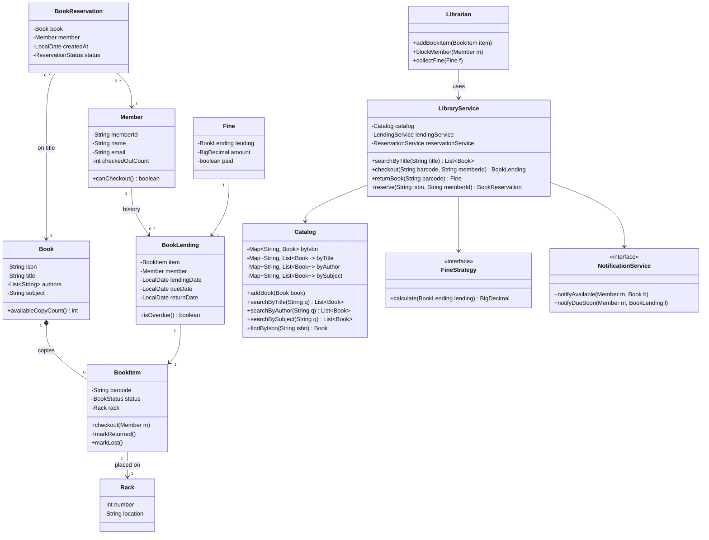
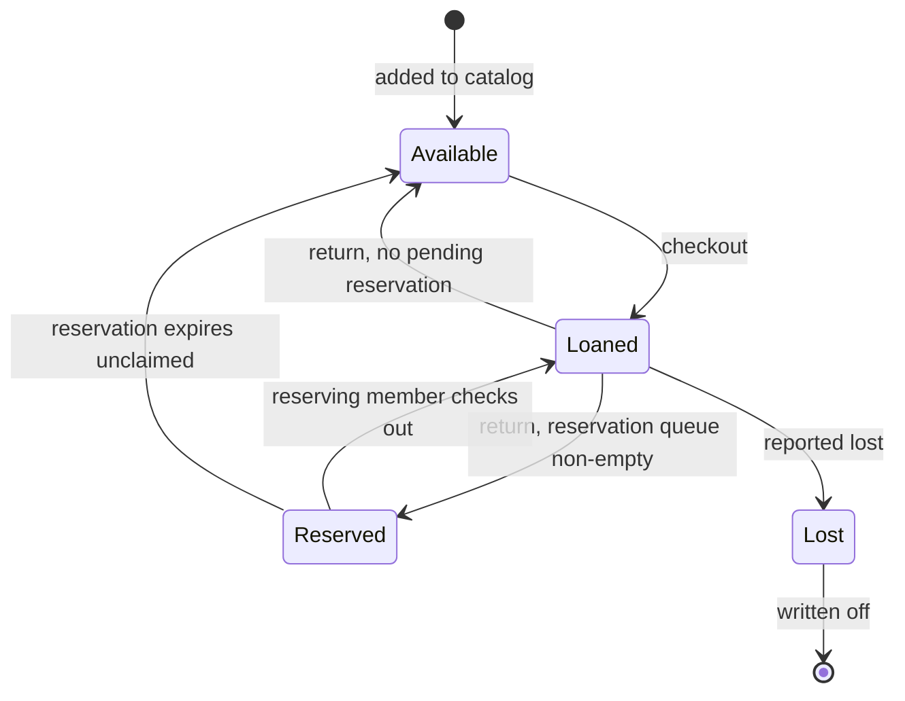

# Design a Library Management System

The library management system is the classic "many entities, clear workflows" LLD
problem. It is less algorithmic than an elevator or a rate limiter — the challenge is
**domain modeling**: separating a *title* from its *physical copies*, modeling lending
and reservations as first-class objects, and picking the right pattern for fines,
copy lifecycle, and reservation notifications. Interviewers use it to test whether you
can turn a fuzzy real-world domain into clean, extensible classes in 45–60 minutes.

## Requirements Clarification

Spend the first five minutes narrowing scope. Good clarifying questions:

- **Actors:** members (borrow, return, reserve, search) and librarians (add/remove
  books, register members, collect fines). Do we need admins or guests? Usually no —
  two actors are enough.
- **Copies vs. titles:** can the library hold multiple physical copies of the same
  book? (Yes — this is the single most important modeling question. It forces the
  `Book` vs. `BookItem` split.)
- **Borrowing rules:** maximum books per member (say 5), loan period (say 10 days),
  fine per overdue day. Are limits per member type (student vs. faculty)? Park it as
  an extensibility point.
- **Reservations:** if all copies are checked out, can a member reserve the title and
  get notified when a copy returns? (Yes — this drives the Observer discussion.)
- **Search:** by title, author, subject, ISBN. Prefix match or exact? Exact/keyword is
  fine for LLD; full-text search is out of scope.
- **Out of scope:** payments processing, multi-branch libraries, recommendation ML,
  digital rights management, and "millions of concurrent users" (that's HLD — say so
  and move on).

A crisp scope statement to close the five minutes: *"I'll design a single-branch
library where members search the catalog, check out up to N book copies, return them
with overdue fines, and reserve titles that are fully checked out, receiving a
notification when a copy becomes available. Librarians manage inventory and members."*

## Core Objects and Entities

Walk the nouns and assign one responsibility each:

| Class | Responsibility |
|---|---|
| `Library` / `LibraryService` | Facade: the entry point that wires catalog, lending, and reservation services together |
| `Catalog` | Indexes books for search by title, author, subject, ISBN |
| `Book` | The *title*: ISBN, title, authors, subject, publisher — pure metadata, no lending state |
| `BookItem` | A *physical copy* of a `Book`: barcode, rack location, and lifecycle state (Available, Loaned, Reserved, Lost) |
| `Rack` | Physical shelf location of a `BookItem` (number + location identifier) |
| `Member` | A registered borrower: id, current checked-out count, contact info |
| `Librarian` | Staff actor: adds/removes `BookItem`s, registers members, collects fines |
| `BookLending` | A lending record: which `BookItem`, which `Member`, creation date, due date, return date |
| `BookReservation` | A pending claim by a `Member` on a `Book` title (not a specific copy) |
| `Fine` | Amount owed for an overdue return, tied to a `BookLending` |
| `FineStrategy` | Pluggable policy that computes the fine amount from a lending record |
| `NotificationService` | Sends reservation-available and due-date notifications (email/SMS behind an interface) |

Two modeling decisions matter more than everything else:

1. **`Book` vs. `BookItem`.** "Clean Code, ISBN 978-0132350884" is one `Book`; the
   library's seven copies are seven `BookItem`s, each with its own barcode and state.
   Availability, checkout, and loss are *copy-level* concerns; search and reservation
   are *title-level* concerns. Merging them into one class makes "how many copies are
   available?" and "reserve this title" impossible to express cleanly.
2. **`BookLending` as a first-class object.** The relationship between `Member` and
   `BookItem` carries data (checkout date, due date, return date, fine). Model it as
   an association class rather than a bare reference so history, fines, and audits
   have somewhere to live. `Member` and `BookLending` form a many-to-many over time:
   a member has many lendings, and a copy accumulates lendings from many members.

## Class Diagram



Interview-grade calibration: ~12 classes. `Book *-- BookItem` is **composition** — a
copy has no meaning without its title, and deleting the title record removes its
copies. `BookItem --> Rack` is a plain association (the rack exists independently).
Reservations point at `Book` (a title-level claim), lendings point at `BookItem`
(a copy-level fact) — getting this asymmetry right is a strong signal.

## BookItem State Machine

A `BookItem` moves through a small lifecycle, which is exactly what the **State
pattern** (see dp-state) exists for once transition rules get conditional:



Key transitions to narrate:

- **Return with a pending reservation** does *not* go back to `Available`. The copy
  becomes `Reserved` (held for the head of the reservation queue) so a walk-in member
  can't grab it first.
- **Reserved copies expire**: if the notified member doesn't pick up within, say,
  3 days, the copy returns to `Available` (or to `Reserved` for the next queued
  member).
- **Lost** is terminal for lending purposes and triggers a replacement-cost fine.

In a 45-minute session an `enum BookStatus` with transition checks inside `BookItem`
methods is perfectly acceptable; mention that if per-state behavior grows (different
checkout rules per state), you'd promote it to State-pattern objects. Don't build
four state classes upfront for a four-state enum — that's over-engineering, and
saying so out loud earns points.

## Key Design Decisions and Patterns

Name each pattern, the requirement that justifies it, and the alternative you rejected
(cross-reference the dp-* topics rather than re-teaching them):

- **Strategy — fine calculation** (see dp-strategy). "₹10 per overdue day" today,
  "capped at the book's price" tomorrow, "faculty pay nothing" next quarter. A
  `FineStrategy` interface (`calculate(BookLending): BigDecimal`) lets policies vary
  without touching checkout/return code — the Open/Closed Principle in action. The
  rejected alternative is an `if member.type == FACULTY ... else if ...` chain inside
  `returnBook`, which forces edits to tested lending logic for every policy change.
- **Observer — reservation notifications** (see dp-observer). When a copy of a
  reserved title is returned, interested members must be told. The return flow
  publishes a "copy available" event; `NotificationService` subscribers (email, SMS,
  push) react. The lending code never knows *how* members are contacted, so adding a
  push channel touches zero lending code.
- **State (or a disciplined enum) — `BookItem` lifecycle.** Transition rules like
  "return goes to Reserved iff the queue is non-empty" belong in one place, not
  scattered as status checks across services.
- **Facade — `LibraryService`.** Callers (UI, librarian console) see
  `checkout / returnBook / reserve / search` and never orchestrate catalog + lending +
  reservation + notification themselves.
- **Deliberate non-use of Singleton.** Making `Library` a Singleton is a common
  reflex; prefer creating one instance and injecting it — it keeps the design
  testable and avoids hidden global state. Saying this unprompted is a senior signal.

SOLID checkpoints an interviewer listens for: `Book` holds no lending state (SRP);
new fine policies and notification channels require no modification of existing
classes (OCP); services depend on `FineStrategy` / `NotificationService` interfaces,
not concrete implementations (DIP).

## Searching the Catalog

Search is by title, author, subject, or ISBN. The `Catalog` owns it — not `Library`,
not `Book` — and maintains one index per axis:

```java
public class Catalog {
    private final Map<String, Book> byIsbn = new HashMap<>();
    private final Map<String, List<Book>> byTitle = new HashMap<>();
    private final Map<String, List<Book>> byAuthor = new HashMap<>();
    private final Map<String, List<Book>> bySubject = new HashMap<>();

    public void addBook(Book book) {
        byIsbn.put(book.getIsbn(), book);
        byTitle.computeIfAbsent(normalize(book.getTitle()), k -> new ArrayList<>()).add(book);
        for (String author : book.getAuthors()) {
            byAuthor.computeIfAbsent(normalize(author), k -> new ArrayList<>()).add(book);
        }
        bySubject.computeIfAbsent(normalize(book.getSubject()), k -> new ArrayList<>()).add(book);
    }

    public List<Book> searchByTitle(String q)  { return byTitle.getOrDefault(normalize(q), List.of()); }
    public Optional<Book> findByIsbn(String isbn) { return Optional.ofNullable(byIsbn.get(isbn)); }
}
```

Design notes:

- ISBN maps to a **single** `Book`; title/author/subject map to **lists** (many titles
  share an author or subject). Getting the multiplicity of each index right is a
  small but telling detail.
- Indexes are a write-time cost paid for read-time speed — `addBook` updates four
  maps so each search is O(1) lookup instead of a full scan. The internals of
  `HashMap` are dsa-coding territory; here you just justify the choice.
- Results are `Book`s (titles). Availability is answered per result via
  `book.availableCopyCount()`, which counts `BookItem`s in `Available` state.
- If the interviewer asks for prefix or fuzzy search, name the upgrade (a trie or an
  inverted index, or a search engine at HLD scale) without building it.

## Checkout, Return, and Reserve Flows

**Checkout** (`checkout(barcode, memberId)`):
1. Look up the `BookItem`; verify its state is `Available` — or `Reserved` *by this
   very member* (picking up a held reservation).
2. Verify `member.canCheckout()` — under the max-books limit and no blocking unpaid
   fines.
3. Create a `BookLending` with `dueDate = today + loanPeriod`, transition the item to
   `Loaned`, increment the member's count. If this fulfilled a reservation, mark the
   reservation `COMPLETED`.

**Return** (`returnBook(barcode)`):
1. Find the *active* lending for the barcode; stamp `returnDate`.
2. If overdue, compute `fineStrategy.calculate(lending)` and record a `Fine`.
3. Consult the reservation queue for the item's `Book`. If non-empty: transition the
   copy to `Reserved`, assign it to the head reservation, and fire the Observer
   notification. Otherwise transition to `Available`.
4. Decrement the member's checked-out count.

**Reserve** (`reserve(isbn, memberId)`):
1. If a copy is `Available`, tell the member to just check it out (or hold it) — a
   reservation queue is only for fully-checked-out titles.
2. Reject duplicates (a member can't hold two reservations on one title).
3. Append a `BookReservation` to the title's FIFO queue (a `Queue<BookReservation>`
   per ISBN). FIFO is the fairness policy; call out that a priority queue would slot
   in if faculty get precedence — another Strategy seam.

The ordering trap interviewers probe in the return flow: check the reservation queue
**before** marking the copy `Available`. If you flip the order, there is a window
where a walk-in checkout steals the copy from the member who has been queued for
weeks.

## API and Method Signatures

The facade surface — small, intention-revealing, typed:

```java
public interface LibraryService {
    // catalog
    List<Book> searchByTitle(String title);
    List<Book> searchByAuthor(String author);
    List<Book> searchBySubject(String subject);
    Optional<Book> findByIsbn(String isbn);

    // lending
    BookLending checkout(String barcode, String memberId)
            throws ItemNotAvailableException, CheckoutLimitExceededException;
    ReturnResult returnBook(String barcode);          // carries Optional<Fine>
    void reportLost(String barcode, String memberId); // triggers replacement fine

    // reservations
    BookReservation reserve(String isbn, String memberId)
            throws AlreadyReservedException, CopiesAvailableException;
    void cancelReservation(String reservationId);

    // administration (librarian only)
    BookItem addBookItem(String isbn, Rack rack);
    Member registerMember(String name, String email);
}
```

Signature-level decisions worth narrating: `checkout` takes a **barcode** (a specific
copy is scanned at the desk) while `reserve` takes an **ISBN** (members reserve
titles, not copies); business-rule failures are explicit checked exceptions or a
result type, never `null` or boolean flags; `returnBook` returns a `ReturnResult`
containing an `Optional<Fine>` so callers aren't forced to null-check.

## Code Skeleton

Enough structure to show the seams — not a full implementation:

```java
public enum BookStatus { AVAILABLE, LOANED, RESERVED, LOST }

public class BookItem {
    private final String barcode;
    private final Book book;
    private BookStatus status = BookStatus.AVAILABLE;
    private Rack rack;

    public synchronized void checkout(Member member) {
        // RESERVED is only checkable by the member the hold is assigned to;
        // the reservation-holder match is verified via ReservationService.
        if (status != BookStatus.AVAILABLE
                && !(status == BookStatus.RESERVED && isHeldFor(member))) {
            throw new ItemNotAvailableException(barcode);
        }
        status = BookStatus.LOANED;
    }
    // markReturned(boolean hasPendingReservation), markLost() ...
}

public interface FineStrategy {
    BigDecimal calculate(BookLending lending);
}

public class PerDayFineStrategy implements FineStrategy {
    private final BigDecimal ratePerDay;
    public PerDayFineStrategy(BigDecimal ratePerDay) { this.ratePerDay = ratePerDay; }

    @Override
    public BigDecimal calculate(BookLending lending) {
        long daysLate = ChronoUnit.DAYS.between(lending.getDueDate(), lending.getReturnDate());
        return daysLate <= 0 ? BigDecimal.ZERO : ratePerDay.multiply(BigDecimal.valueOf(daysLate));
    }
}

public class LendingService {
    private static final int MAX_BOOKS = 5;
    private static final int LOAN_DAYS = 10;

    private final FineStrategy fineStrategy;
    private final ReservationService reservations;
    private final NotificationService notifier;
    private final Map<String, BookLending> activeLendings = new ConcurrentHashMap<>(); // barcode -> lending

    public BookLending checkout(BookItem item, Member member) {
        if (!member.canCheckout(MAX_BOOKS)) throw new CheckoutLimitExceededException(member.getId());
        item.checkout(member);                            // atomic guarded state transition
        BookLending lending = new BookLending(item, member, LocalDate.now(),
                                              LocalDate.now().plusDays(LOAN_DAYS));
        activeLendings.put(item.getBarcode(), lending);
        member.incrementCheckedOut();
        return lending;
    }

    public ReturnResult returnBook(BookItem item) {
        BookLending lending = activeLendings.remove(item.getBarcode());
        if (lending == null) return ReturnResult.noop();  // double scan / no active lending: idempotent, never a crash
        lending.setReturnDate(LocalDate.now());
        Optional<Fine> fine = Optional.of(fineStrategy.calculate(lending))
                .filter(a -> a.signum() > 0)
                .map(a -> new Fine(lending, a));

        Optional<BookReservation> next = reservations.nextFor(item.getBook());
        if (next.isPresent()) {
            item.markReturned(true);                      // -> RESERVED
            reservations.assignCopy(next.get(), item);
            notifier.notifyAvailable(next.get().getMember(), item.getBook());
        } else {
            item.markReturned(false);                     // -> AVAILABLE
        }
        lending.getMember().decrementCheckedOut();
        return new ReturnResult(lending, fine);
    }
}
```

Note the constructor-injected `FineStrategy`, `ReservationService`, and
`NotificationService` — the three seams every follow-up question will pull on.
Constants like `MAX_BOOKS` would graduate to a `LendingPolicy` config object the
moment limits vary by member type.

## Concurrency and Edge Cases

Even single-machine, two librarian desks (or a desk plus a self-checkout kiosk) can
race:

- **Double checkout of one copy:** two threads call `checkout` on the same barcode.
  Guard the state transition — `synchronized` on the `BookItem` (as above) or a
  `compareAndSet`-style transition on an `AtomicReference<BookStatus>`. The check
  ("is it available?") and the act ("mark it loaned") must be atomic; a separate
  `isAvailable()` check followed by `checkout()` is a textbook check-then-act race.
- **Return vs. reserve race:** a copy is being returned while a member reserves the
  title. Serialize per-title reservation-queue operations (lock the queue) so the
  returning copy is either assigned to the new reservation or the reservation waits —
  never both missed.
- **Lock granularity:** lock per `BookItem` / per title-queue, never one global
  library lock — otherwise every checkout in the building serializes.

Edge cases to volunteer before being asked:

- Member at the max-books limit, or with unpaid fines above a threshold → checkout
  rejected with a specific exception.
- Returning an item with no active lending (double scan) → idempotent no-op or
  explicit error, but never a crash.
- Reserved copy never picked up → expiry job releases it to the next reservation or
  to `Available`.
- Lost book → replacement-cost fine (another `FineStrategy` implementation), item to
  `Lost`, and any reservation queue re-evaluated against remaining copies.
- Same member holding the copy tries to reserve the same title → reject.

## Extensibility

The "now add X" follow-ups, and why the seams absorb them:

- **Digital books / e-readers:** add `EBookItem` implementing a `LendableItem`
  abstraction (no rack, no physical state, concurrent-license count instead of a
  single-copy lifecycle). `BookLending` targets `LendableItem`; checkout flow is
  untouched except the availability rule, which lives inside the item type —
  polymorphism instead of `if (item.isDigital())` checks scattered around.
- **Member tiers (student/faculty limits and fines):** introduce `LendingPolicy`
  (max books, loan days) resolved per member type, and tier-aware `FineStrategy`
  implementations. Existing services already depend on the interfaces, so this is
  pure addition — OCP.
- **Inter-library loan:** a `RemoteLibraryClient` behind an interface; the catalog
  search decorates local results with remote availability. The domain gains an
  `ExternalLoan` subtype of lending; core classes unchanged. True multi-branch
  consistency is an HLD/distributed-data conversation — name it and defer.
- **Recommendation engine:** `BookLending` history is already first-class data; a
  `RecommendationService` reads it. Batch/ML pipelines are out of LLD scope — the
  LLD contribution is that the data model made the history queryable.
- **New notification channels:** one more Observer subscriber; zero lending changes.

## Common Interview Follow-ups

- *"Why two classes, `Book` and `BookItem`? Isn't that overkill?"* — Multiple copies
  per title with independent barcodes, locations, and lifecycles; title-level
  reservations vs. copy-level lendings are different multiplicities.
- *"Where does the fine logic live, and how do I change it without redeploying
  lending?"* — `FineStrategy` behind an interface, injected; swap implementations.
- *"A copy is returned and three members have reserved the title — walk me through
  exactly what happens."* — Queue head gets the copy (state `Reserved`), Observer
  notification fires, expiry timer starts; order-of-operations vs. walk-in checkouts.
- *"Add e-books with 3 simultaneous licenses."* — `LendableItem` abstraction,
  license-count availability rule inside the digital type.
- *"Two kiosks scan the last copy at the same instant."* — Atomic state transition on
  the `BookItem`; check-then-act must be one critical section.
- *"Faculty borrow 10 books for 30 days, students 5 for 10."* — `LendingPolicy` per
  member type; show it's addition, not modification.
- *"How would you persist this / scale to a city's library network?"* — Repositories
  behind interfaces for persistence; multi-branch and search-at-scale are HLD (see
  system-design) — keep the OO model the same.

## References

- Grokking the Object-Oriented Design Interview — "Design a Library Management System"
- Gamma, Helm, Johnson, Vlissides — *Design Patterns* (Strategy, Observer, State, Facade)
- Robert C. Martin — *Agile Software Development* (SRP, OCP, DIP applied to domain models)
- Eric Evans — *Domain-Driven Design* (entities vs. value objects; association classes like `BookLending`)
- Cross-references in this library: dp-strategy, dp-observer, dp-state, dp-facade for
  pattern depth; system-design for the multi-branch/scale follow-ups
